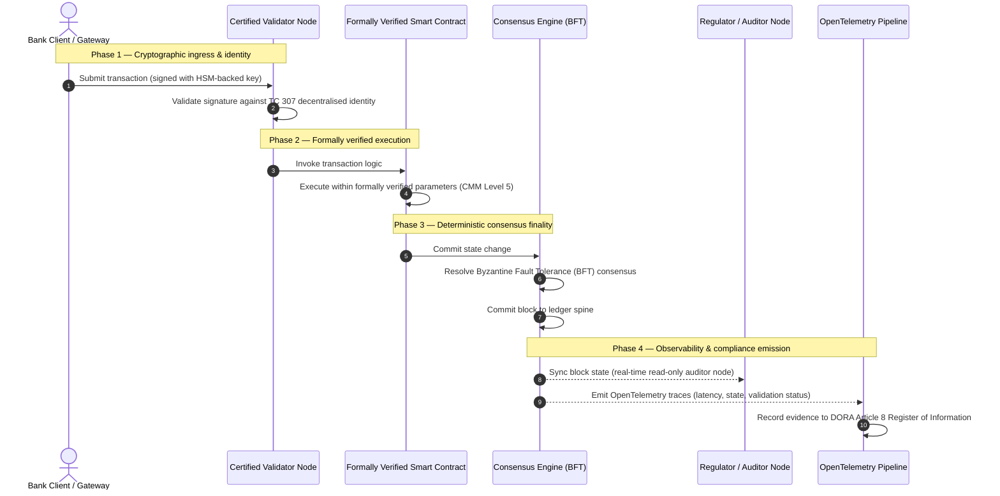

## از شواهد تا حقیقت: چرا بلاک‌چین‌های گواهی‌شده دوران بعدی اعتماد بانکی را تعریف خواهند کرد

## خلاصه اجرایی و بستر راهبردی (چکیده)

بانکداری عمده و تراکنش‌های جهانی در سال ۲۰۲۶ در یک نقطه عطف تاریخی قرار دارند. همچنان که خدمات مالی به سوی شبکه‌های پایاپای بلادرنگ و به‌صورت ذاتی دیجیتال گذار می‌کنند و همچنان که هوش مصنوعی نامعین‌بودگیِ احتمالاتی را وارد می‌کند، مدل‌های سنتی، آنالوگ و گذشته‌نگرِ اطمینان‌بخشی (مانند ممیزی‌های ایستای مبتنی بر نهاد) از پاسخگویی به الزامات نوین مدیریت ریسک و مسئولیت امانی بازمی‌مانند.

کمیته فنی ۳۰۷ سازمان ISO/IEC (TC 307) یک مبنای استانداردشده برای فناوری‌های دفترکل توزیع‌شده تثبیت کرده است. با این حال، پذیرش واقعی در سطح شرکتی و نهادی مستلزم گذار از راهنماییِ توصیفی به اطمینان‌بخشیِ بلاک‌چینِ تجویزی و مستقلاً قابل‌گواهی است. با امتیازدهی به حاکمیت دفترکل، یکپارچگی اجماع، ایمنی قرارداد هوشمند و چابکی رمزنگارانه در برابر یک مدل بلوغ قابلیت (CMM) پنج‌سطحی سختگیرانه، بانک‌ها می‌توانند از فرض‌های وصله‌پینه‌ای و مختص‌فروشنده به حقیقت مالیِ قابل‌گواهی و قابل‌ممیزی در سطح هیئت‌مدیره حرکت کنند.

## نکات کلیدی

* **شکاف اصطکاکیِ امانی**: ما اکنون می‌توانیم بانک (Basel III)، ابر (ISO 27001) و سامانه‌های حاکمیت هوش مصنوعی (ISO 42001) را گواهی کنیم، اما هنوز نمی‌توانیم دفترکل توزیع‌شده‌ای را که به‌طور فزاینده تعیین‌کننده آنچه حقیقت است می‌باشد، گواهی کنیم. این عدم‌تقارن یک آسیب‌پذیری عملیاتی عمده است.
* **DORA مسئولیت امانی مستقیم را الزامی می‌کند**: بر اساس ماده ۵ DORA، هیئت‌مدیره بانک‌ها مسئولیت شخصیِ مستقیم و غیرقابل‌واگذاری در قبال تاب‌آوری عملیاتیِ تمام استقرارهای شخص ثالث و دفترکل را بر عهده دارند، به‌همراه جریمه‌های شخصی سنگین SM&CR در صورت قصور.
* **ستون فقرات ممیزی هوش مصنوعی**: در حالی که یادگیری ماشین پیامدهای احتمالاتیِ غیرقابل‌بازتولید را وارد می‌کند، یک بلاک‌چین گواهی‌شده ثبتِ حالتِ معین (قطعی) را فراهم می‌کند. ثبتِ نسخه‌های مدل، ورودی‌ها و تصمیم‌های اعتبارسنجی روی زنجیره، الزامات ISO 42001 و استانداردهای مدیریت ریسک مدل را برآورده می‌سازد.
* **شاخص بلاک‌چین گواهی‌شده**: این شاخص، حاکمیت، اجماع، قراردادهای هوشمند و رصدپذیری را به یک کارنامهٔ قابل‌راستی‌آزمایی و آمادهٔ ممیزی روی مقیاس CMM از ۰ تا ۵ رسمیت می‌بخشد و معیارهای مهندسی را به بیانیه‌های اشتهای ریسکِ مصوبِ هیئت‌مدیره ترجمه می‌کند.

## ۰۱. شکاف اصطکاکیِ امانی در بانکداری دیجیتال

در بانکداری کلاسیک، اعتماد رابطه‌ای، نهادی و گذشته‌نگر است. این اعتماد به ممیزان مستقلِ شخص ثالث وابسته است که وضعیت مالی را در نقاط زمانی ایستا بررسی کرده و مغایرت‌ها را در سیلوهای دفترکل دوجانبه تطبیق می‌دهند. در بازارهای بلادرنگ و مبتنی بر API در سال ۲۰۲۶، این مدل تأخیرهای بازدارنده و ریسک‌های ساختاری وارد می‌کند.

هنگامی که تراکنش‌ها آنی تسویه می‌شوند، استخرهای نقدینگی درون‌روزی به‌صورت پویا توسط دروازه‌های API مدیریت می‌شوند و مالکیت دارایی در سراسر دفترکل‌های مشترک توکنی‌شده است، ممیزی‌های گذشته‌نگر بیش از آنکه کنترل‌های پیشگیرانه باشند، به تمرین‌های جرم‌شناختی تبدیل می‌شوند. امانت‌داران دیگر نمی‌توانند صرفاً به گواهی‌کردن نهاد شرکتی تکیه کنند. آنها باید خودِ بستر دیجیتال را گواهی کنند.

اکنون بانک‌ها تحت یک عدم‌تقارن معماریِ آشکار فعالیت می‌کنند:

1. **زیرساخت ابری گواهی‌شده**: گره‌های سخت‌افزاری، کانتینرهای مجازی‌شده و مراکز داده فیزیکی در برابر کنترل‌های ISO/IEC 27001 و SOC 2 Type II اعتبارسنجی می‌شوند.
2. **فرآیندهای مدیریتی گواهی‌شده**: سیاست‌های ریسک عملیاتی، طرح‌های تداوم کسب‌وکار و استقرارهای الگوریتمی تحت چارچوب‌های ریسک سختگیرانه اداره می‌شوند.
3. **موتورهای دفترکلِ گواهی‌نشده**: سازوکارهای هستهٔ اجماع توزیع‌شده، زنجیره‌های تأمینِ گره‌های اعتبارسنج، مرزهای قرارداد هوشمند و مدل‌های حاکمیت شبکه به فرض‌های گواهی‌نشده، سفارشی یا مختص‌کنسرسیوم واگذار شده‌اند.

این عدم‌تقارن یک نقطه شکست عمده است. یک بانک می‌تواند یک برنامهٔ اعتبارسنجی‌شده را درون یک کانتینر ابری امن و گواهی‌شده با ISO 27001 اجرا کند، اما اگر آن کانتینر روی دفترکلِ توزیع‌شده‌ای بنویسد که کنترلِ اعتبارسنجِ متمرکز، پارامترهای اجماعِ آسیب‌پذیر یا قراردادهای هوشمندِ ممیزی‌نشده دارد، یکپارچگی تراکنش مخدوش می‌شود. برای پرکردن این شکاف، خودِ موتور دفترکل باید به یک شیءِ اطمینان‌بخشیِ قابل‌گواهی تبدیل شود.

## ۰۲. مبنای استانداردسازی ISO/IEC TC 307

کارِ بنیادین لازم برای استانداردسازی دفترکل‌های توزیع‌شده توسط کمیته فنی ۳۰۷ سازمان ISO/IEC (TC 307) (بلاک‌چین و فناوری‌های دفترکل توزیع‌شده) در حال تثبیت است. TC 307 به‌جای آنکه بلاک‌چین را به‌عنوان یک پروتکل فنیِ منزوی در نظر بگیرد، آن را به‌مثابهٔ یک زیرساخت اعتماد نهادی می‌نگرد و کار خود را در پنج ستون اصلی سازماندهی می‌کند:

1. **رده‌بندی و واژگان (ISO 22739)**: یک نامگذاری مشترک تثبیت می‌کند و تعاریف حقوقی و عملیاتیِ یکدست را در سراسر حوزه‌های قضایی، طرح‌های مالی و نهادهای مختلف تضمین می‌کند.
2. **معماری مرجع (ISO/TR 23245)**: مرزها، لایه‌ها، جریان‌های داده و مؤلفه‌های کارکردیِ یک سامانه دفترکل توزیع‌شدهٔ سازگار را تعریف می‌کند.
3. **امنیت، حریم خصوصی و قراردادهای هوشمند (ISO/TR 23244 / ISO 23613)**: راهنماهای امنیتی پایه برای سامانه‌های دارایی دیجیتال را تثبیت می‌کند و بهترین شیوه‌ها برای کاهش آسیب‌پذیری قرارداد هوشمند و حاکمیت چرخه عمر آن را به‌تفصیل شرح می‌دهد.
4. **چارچوب‌های تعامل‌پذیری**: سازوکارهای تبادل داده و دارایی میان شبکه‌های دفترکلِ ناهمگون را بررسی می‌کند و از شکل‌گیری سیلوهای توکنی‌شدهٔ منزوی جلوگیری می‌کند.
5. **هویت غیرمتمرکز و لنگرهای اعتماد**: شناسه‌های رمزنگارانهٔ مبتنی بر دفترکل را با زیرساخت‌های رسمی کلید عمومی (PKI) و ثبت‌های مورد تأیید دولت یکپارچه می‌کند.

در مجموع، TC 307 نشانهٔ گذارِ DLT از یک انتخاب مهندسیِ سفارشی به یک انضباط معماریِ استانداردشده است. با این حال، TC 307 عمدتاً توصیفی باقی می‌ماند. این کمیته تعریف می‌کند که «خوب چگونه به نظر می‌رسد» (راهنمایی)، اما پروتکل راستی‌آزماییِ تجویزی (اطمینان‌بخشی) را که افسران ریسک و ناظران برای مجوز استقرارِ تولیدیِ کارکردهای بحرانی یا مهم (CIF‌ها) نیاز دارند، فراهم نمی‌کند.

## ۰۳. راهنمایی در برابر اطمینان‌بخشی: تمایز امانی

فعالان بازار مالی فناوری را به این دلیل به‌کار نمی‌گیرند که نوآورانه یا ظریف است؛ آنها زمانی آن را به‌کار می‌گیرند که بتوان آن را اداره، ممیزی، دفاع و با الزامات ذخیره سرمایه تطبیق داد. به همین دلیل است که استانداردسازی در بانکداری به‌طور طبیعی به دو لایه تجزیه می‌شود:

* **راهنمایی (چارچوب)**: بهترین شیوه‌ها، اهداف مرجع و راهنماهای معماری را ترسیم می‌کند (مثلاً ISO/IEC TC 307، چارچوب‌های NIST).
* **اطمینان‌بخشی (اثبات)**: شواهد مستقل، پیوسته و قابل‌راستی‌آزمایی توسط شخص ثالث را فراهم می‌کند که چارچوب همان‌گونه که طراحی شده پیاده‌سازی و اجرا می‌شود (مثلاً گواهی ISO 27001، ممیزی‌های SOC 2، بازرسی‌های نظارتی).

تکیه بر اجماعِ دفترکلِ گواهی‌نشده در حالی که زیرساخت ابری گواهی می‌شود، یک شکاف نظارتی بحرانی است. بلاک‌چینی که «تغییرناپذیر» است، لزوماً «مورد اعتماد نهادی» نیست. تغییرناپذیری تنها تضمین می‌کند که داده‌های واردشده تغییر نکرده‌اند؛ این ویژگی راستی‌آزمایی نمی‌کند که گره‌های اعتبارسنج امن هستند، پروتکل اجماع در برابر تبانی تاب‌آور است، منطق قرارداد هوشمند از نظر ریاضی درست است، یا مدیریت کلید رمزنگارانه با الزامات پساکوانتومی سازگار است.

برای بستن این شکاف، شاخص بلاک‌چین گواهی‌شده ۲۰۲۶ این الزامات را به یک مدل بلوغ قابلیت (CMM) کمی‌پذیر که به مقررات جهانی بانکداری نگاشت شده است، رسمیت می‌بخشد.

## ۰۴. شاخص بلاک‌چین گواهی‌شده ۲۰۲۶

برای آنکه مدیریت ارشد بتواند سکوهای دفترکل خود را ارزیابی و گواهی کند، این شاخص زیرساخت دفترکل توزیع‌شده را به پنج لایهٔ عملیاتیِ قابل‌ممیزی که روی مقیاس CMM از ۰ تا ۵ امتیازدهی می‌شوند، ساختاربندی می‌کند.

## جدول ۱: معماری شاخص بلاک‌چین گواهی‌شده

| لایه شاخص | سطح بلوغ قابلیت (CMM) | معیار فنی و عملیاتی | مرجع کنترل نظارتی / امانی |
| ---- | ---- | ---- | ---- |
| **حاکمیت دفترکل** | **سطح ۰**: کنسرسیوم بدون‌قاعده**سطح ۳**: بررسی و چرخش خودکار اعتبارسنج‌ها**سطح ۵**: لنگرگذاریِ هویت رمزنگارانهٔ غیرمتمرکز و چندجانبه | درصد گره‌های اعتبارسنجِ بهره‌برداری‌شده توسط نهادهای مالیِ بررسی‌شده؛ میانگین زمان حل اختلافات اعتبارسنج؛ توزیع جغرافیایی گره‌ها | **DORA Article 5** (حاکمیت و سازمان)؛ **CPMI-IOSCO PFMI Principle 2** (حاکمیت) و **Principle 3** (چارچوب مدیریت جامع ریسک‌ها) |
| **یکپارچگی اجماع** | **سطح ۰**: تک‌گره یا POW مبهم**سطح ۳**: BFT ممیزی‌شده با نهایی‌شدنِ معین**سطح ۵**: اجماعِ چندحوزه‌ای و رسماً راستی‌آزمایی‌شده با پایش پیوستهٔ تأخیر | حداکثر تأخیر اجماعِ قابل‌تحمل؛ آستانهٔ مقاومت در برابر تبانی؛ SLA زمان کارکرد تحت پارتیشن شبیه‌سازی‌شدهٔ گره | **DORA Article 6** (چارچوب مدیریت ریسک ICT)؛ **CPMI-IOSCO PFMI Principle 8** (نهایی‌شدن تسویه) |
| **هویت و رمزنگاری** | **سطح ۰**: کلیدهای ضعیف RSA / ECDSA**سطح ۳**: چندامضایی با مدیریت کلید پشتیبانی‌شده با HSM**سطح ۵**: کلیدهای ترکیبیِ کوانتوم‌ایمن (FIPS 203 ML-KEM) و دروازه‌های حریم خصوصیِ دانش‌صفر | درصد تراکنش‌های دفترکل امضاشده با کلیدهای پشتیبانی‌شده با HSM؛ امتیاز آمادگی مهاجرت PQC؛ تأخیر اثبات ZK | **NIST FIPS 203 / 204**؛ **ISO/IEC 27001** (مدیریت امنیت اطلاعات) |
| **اطمینان‌بخشی قرارداد هوشمند** | **سطح ۰**: اسکریپت‌های solidity ممیزی‌نشده**سطح ۳**: اعتبارسنجی خودکار کامپایلر و ممیزی خارجی**سطح ۵**: قراردادهای هوشمندِ رسماً راستی‌آزمایی‌شده و تغییرناپذیر با ارتقاهای کلید-قطع‌کننده | درصد قراردادهای هوشمند دارای راستی‌آزماییِ صوریِ ریاضی؛ شمار هشدارهای کامپایلر؛ پوشش اسکن آسیب‌پذیری | **EBA Guidelines on Outsourcing Arrangements** (بندهای ۸۱، ۱۱۳-۱۱۷)؛ **DORA Article 30** (بندهای حداقلی قرارداد) |
| **ممیزی و رصدپذیری** | **سطح ۰**: استخراج دستی گزارش‌ها**سطح ۳**: ردیابی‌های ساختارمند OTel و گره‌های ممیزِ فقط‌خواندنی**سطح ۵**: تطبیق خودکار و پیوسته با ثبتِ ماده ۸ | درصد تراکنش‌های پوشش‌داده‌شده با ردیابی‌های OpenTelemetry؛ تأخیر از تثبیت بلوکِ دفترکل تا همگام‌سازیِ گره ممیز | **BCBS 239** (تجمیع داده‌های ریسک)؛ **DORA Article 8** (ثبت اطلاعات / طرح‌واره‌های ITS) |

## جدول ۲: سیگنال‌های کلیدی اعتماد نگاشت‌شده به استانداردهای جهانی بانکداری

| سیگنال / معیار | معیار سنجش | تأثیر بر سکوهای بانکی | منبع نظارتی |
| ---- | ---- | ---- | ---- |
| **پیشرفت ISO/IEC TC 307** | گذار از گزارش‌های فنی ISO/TR به طرح‌های گواهیِ رسمی | نخستین چارچوب استانداردشده برای گواهیِ موتورهای دفترکل توزیع‌شده را تثبیت می‌کند | **ISO/IEC JTC 1 / SC 44** (فناوری‌های دفترکل توزیع‌شده) |
| **فاز نمونه‌اولیهٔ پروژه Agorá** | بیش از ۴۰ بانک تجاری مشارکت‌کننده؛ آزمایش دفترکل یکپارچهٔ سپرده‌های توکنی‌شده | انتقال پایاپای فرامرزی از پیام‌رسانی (SWIFT) به تسویهٔ اتمیکِ توکنی‌شده | **مرکز نوآوری بانک تسویه بین‌المللی (BIS)** |
| **ممیزی شخص ثالثِ DORA Article 30** | ممیزیِ ۱۰۰٪ ارائه‌دهندگان گره و میزبانان زیرساخت در برابر معیارهای امنیتی | «گره‌های اعتبارسنجِ سایه» را حذف می‌کند؛ شفافیت کامل زنجیره تأمین را الزامی می‌کند | **مقامات نظارتی اروپا (ESA)** |
| **ISO/IEC 42001 (حاکمیت هوش مصنوعی)** | تغییرناپذیرسازیِ رمزنگارانهٔ مدل هوش مصنوعی و گزارش‌های آموزش روی زنجیره | بلاک‌چین را به‌عنوان دفترکل مدارک تغییرناپذیر («ستون فقرات ممیزی») برای یادگیری ماشین به‌کار می‌گیرد | **ISO/IEC 42001:2023** (فناوری اطلاعات — هوش مصنوعی) |
| **کفایت سرمایه Basel III** | کاهش بافرهای سرمایهٔ ریسک عملیاتی بر پایهٔ کاهش پیچیدگیِ مستند | چارچوب‌های استانداردشدهٔ ریسک عملیاتی به‌طور مستقیم به تاب‌آوریِ راستی‌آزمایی‌شدهٔ دفترکل اعتبار می‌دهند | **کمیته بازل در نظارت بانکی (BCBS)** |

## ۰۵. «ستون فقرات ممیزی» هوش مصنوعی: هوشِ احتمالاتی روی زیرساخت معین

یکی از قدرتمندترین نقش‌های راهبردی برای یک بلاک‌چین گواهی‌شده در سال ۲۰۲۶، ایفای نقشِ **«ستون فقرات ممیزی»** برای استقرارهای هوش مصنوعی است. سامانه‌های مالیِ نوین به‌طور فزاینده احتمالاتی هستند. امتیازدهی اعتباری، تشخیص تقلبِ بلادرنگ، معاملات الگوریتمی و تعاملات خودمختار با مشتری همگی توسط مدل‌های یادگیری ماشین هدایت می‌شوند که با گذر زمان تکامل می‌یابند، رانش می‌کنند و سازگار می‌شوند. این مدل‌ها نامعین‌اند: با ورودی یکسان در دو زمان متفاوت، ممکن است به‌دلیل وزن‌های پویا و آموزش پیوسته، خروجی‌های متفاوتی تولید کنند.

این نامعین‌بودگی یک چالش عمیقِ حاکمیتی تحت **ISO/IEC 42001 (حاکمیت هوش مصنوعی)** و استانداردهای مدیریت ریسک مدل (MRM) (مانند **SR 11-7** فدرال رزرو ایالات متحده و **SS1/23** PRA بریتانیا) وارد می‌کند: *چگونه تصمیم‌هایی را که به‌طور دقیق قابل‌بازتولید نیستند، ممیزی، تبیین و دفاع می‌کنید؟*

یک دفترکل توزیع‌شدهٔ گواهی‌شده وزنهٔ تعادلِ معین را فراهم می‌کند. در حالی که مدل‌های هوش مصنوعی به‌صورت احتمالاتی عمل می‌کنند، بلاک‌چین گواهی‌شده پارامترهای آنها را به‌صورت معین ثبت می‌کند و یک ستون فقرات مدارک تغییرناپذیر می‌سازد:

* **نسخه‌گذاری مدل و لنگرگذاری وزن**: هر نسخهٔ مدلِ مستقرشده، وزن‌های مرتبط با آن و مقادیر درهم‌سازیِ (checksum) داده‌های آموزش آن در زمان ساخت درهم‌سازی و روی دفترکل نوشته می‌شود و الزامات **SLSA Level 3** زنجیره تأمین را برآورده می‌سازد.
* **ثبتِ ورودیِ زمینه‌ای**: هنگامی که یک مدل هوش مصنوعی یک تصمیم بحرانی را اجرا می‌کند (مثلاً تأیید یک وام یا نشانه‌گذاری یک تراکنش)، ورودی‌های زمینه‌ایِ دقیق و درهم‌سازی‌های مدل روی دفترکل نوشته می‌شوند و یک تاریخچهٔ دستکاری‌آشکار می‌سازند.
* **قابلیت ممیزی بدون دسترسی به کد**: اگر یک ناظر بپرسد «چرا مدل شما این درخواست اعتباری را در ۳ ژوئن رد کرد؟»، بانک نیازی به افشای کد اختصاصی یا تلاش برای بازآفرینی حالت دقیق مدل ندارد. بانک رکورد دفترکلِ روی‌زنجیره‌ایِ رمزنگارانه‌امضاشده از ورودی‌ها، وزن‌ها و حالت اعتبارسنجی را ارائه می‌کند.

با لنگرکردنِ تصمیم‌های احتمالاتیِ مدل‌های یادگیری ماشین به اجماع معینِ یک بلاک‌چین گواهی‌شده، نهاد یک خط‌زمانی قابل‌دفاع، قابل‌بازسازی و مستقلاً قابل‌راستی‌آزمایی از اقدامات خودکار می‌سازد.

## ۰۶. تصویرسازی خط‌لولهٔ گواهی‌شدهٔ اجماع-تا-ممیزی

نمودار توالیِ زیر چرخهٔ عمر یک تراکنش را که از میان یک سکوی بلاک‌چین گواهی‌شده عبور می‌کند نشان می‌دهد و نشان می‌دهد که چگونه دروازه‌های اعتبارسنجی، یکپارچگی اجماع، اجرای قرارداد هوشمند و ارسال داده‌های سنجش (تله‌متری) به‌هم قفل می‌شوند تا شواهد نظارتیِ آمادهٔ هیئت‌مدیره تولید کنند:

مسیر بحرانیِ این توالی تراکنشی مستلزم آن است که هر گام اعتبارسنجی، اجرا و اجماع به‌صورت رمزنگارانه امضا شود تا اصالتِ سرتاسری تضمین گردد. گره ممیزِ ناظر حالتِ بلوک را به‌صورت بلادرنگ همگام‌سازی می‌کند و نیاز به تطبیق مالیِ گذشته‌نگر و دستی را از میان می‌برد.

## ۰۷. دفترچه راهنمای هیئت‌مدیره برای مدیران ارشد

برای پیمودن موفقیت‌آمیز گذار از اعتماد سازمانی به اعتماد زیرساختی، مدیران اجرایی و مدیران ارشد بانک باید بی‌درنگ چهار دستورالعمل کلیدی را اجرا کنند:

1. **الزام ممیزی دفترکل در مدیریت ریسک سازمانی (ERM)**: سیاستی را اعمال کنید که بر اساس آن هیچ سکوی دفترکل توزیع‌شده‌ای — چه خصوصی، عمومی یا مبتنی بر کنسرسیوم — نباید برای کارکردهای بحرانی یا مهم (CIF‌ها) مستقر شود مگر آنکه در برابر **معماری شاخص بلاک‌چین گواهی‌شده** پنج‌لایه‌ای ممیزی شده باشد (حداقل CMM سطح ۳).
2. **یکپارچه‌سازی بلاک‌چین‌ها به‌عنوان ستون فقرات مدارکِ هوش مصنوعیِ ISO 42001**: به مدیر ارشد ریسک و معمار ارشد هوش مصنوعی دستور دهید تمام مدل‌های یادگیری ماشینِ پرتأثیر را با یک بلاک‌چین گواهی‌شده یکپارچه کنند و یک دفترکل ممیزیِ دستکاری‌آشکار از نسخه‌های مدل، وزن‌ها، ورودی‌ها و تصمیم‌ها بسازند.
3. **ممیزی زنجیره تأمین گره‌های اعتبارسنج (DORA Article 30)**: از بخش تدارکات بخواهید تمام نهادهای شخص ثالث که میزبانِ گره‌های اعتبارسنج هستند یا میزبانی ابری برای شبکه‌های DLT را مدیریت می‌کنند ممیزی کند و سازگاری با همان استانداردهای امنیت سایبری و تاب‌آوری عملیاتی را که برای گره‌های ابری داخلی بانک اعمال می‌شود، الزامی سازد.
4. **همسوسازی معماری‌های دفترکل با CPMI-IOSCO و BCBS 239**: به تیم مهندسی سکو دستور دهید تله‌متری خروجی دفترکل را مستقیماً با الزامات گزارش‌دهی داده‌ای **BCBS 239** همسو کند و اطمینان یابد که پارامترهای اجماع و نهایی‌شدن تسویه به‌طور دقیق با **CPMI-IOSCO Principles 8 و 9** سازگارند.

## ۰۸. پرسش‌های پرتکرار

**آیا ISO/IEC TC 307 یک استاندارد گواهی است؟**  
خیر. ISO/IEC TC 307 یک کمیته فنی است که واژگان، معماری‌های مرجع و راهنماهای امنیتی را تثبیت می‌کند. در حالی که این کمیته تعریف می‌کند که «خوب چگونه به نظر می‌رسد» (راهنمایی)، صنعت باید این اسناد را به طرح‌های گواهیِ رسمی و قابل‌ممیزی (اطمینان‌بخشی) عملیاتی کند تا ناظران بانکی را راضی سازد.

**یک بلاک‌چین گواهی‌شده چگونه از سازگاری با DORA پشتیبانی می‌کند؟**  
بر اساس ماده ۵ DORA، هیئت‌مدیره بانک‌ها مسئولیت شخصیِ مستقیم در قبال تاب‌آوری فناوری را بر عهده دارند. یک بلاک‌چین گواهی‌شده شواهد رمزنگارانه و قابل‌راستی‌آزمایی از یکپارچگی اجماع، کنترل زنجیره تأمین اعتبارسنج و ایمنی قرارداد هوشمند فراهم می‌کند و به اعضای هیئت‌مدیره «گام‌های معقولِ» مستندپذیرِ لازم را برای دفاع در برابر ادعاهای مسئولیت شخصیِ SM&CR می‌دهد.

تفاوت میان یک ممیزی سنتی دفترکل و یک ممیزی بلاک‌چین گواهی‌شده چیست؟  
یک ممیزی سنتی گذشته‌نگر است و ورودی‌های دستی و فایل‌های ایستا را پس از تسویهٔ تراکنش‌ها راستی‌آزمایی می‌کند. یک ممیزی بلاک‌چین گواهی‌شده پیوسته و بلادرنگ است؛ گره‌های اعتبارسنج، موتور اجماع BFT و قراردادهای هوشمندِ رسماً راستی‌آزمایی‌شده گواهی می‌شوند تا تراکنش‌ها را به‌صورت معین اجرا کنند و تله‌متری ساختارمند (OpenTelemetry) منتشر کنند که به‌طور پیوسته سلامت سامانه را اعتبارسنجی می‌کند.

آیا بلاک‌چین‌های عمومی را می‌توان برای استفاده بانکی گواهی کرد؟  
در بیشتر حوزه‌های قضایی، بلاک‌چین‌های عمومیِ خالص و بدون‌مجوز به‌دلیل نبود راستی‌آزمایی هویت اعتبارسنج، هزینه‌های گاز/تراکنشِ غیرقابل‌پیش‌بینی و نهایی‌شدن نامعین (مانند انشعاب‌های احتمالاتیِ اثبات‌کار/اثبات‌سهم) از برآورده‌کردن مقررات بانکی بازمی‌مانند. بلاک‌چین‌های گواهی‌شده در بانکداری معمولاً از معماری‌های سازمانیِ مجوزدار یا معماری‌های عمومی-ترکیبیِ به‌شدت تنظیم‌شده استفاده می‌کنند که در آنها اپراتورهای گره اعتبارسنج، نهادهای مالیِ شناسایی‌شده و ممیزی‌شده هستند.

## ۰۹. منابع

* Basel Committee on Banking Supervision (BCBS), 2013. *Principles for effective risk data aggregation and reporting (BCBS 239)*. Basel: Bank for International Settlements. Available at: [https://www.bis.org/publ/bcbs239.pdf](https://www.bis.org/publ/bcbs239.pdf).  
* Committee on Payments and Market Infrastructures and Technical Committee of the International Organization of Securities Commissions (CPMI-IOSCO), 2012. *Principles for financial market infrastructures*. Basel: Bank for International Settlements. Available at: [https://www.bis.org/cpmi/publ/d101.htm](https://www.bis.org/cpmi/publ/d101.htm).  
* European Banking Authority (EBA), 2019. *EBA/GL/2019/02 — Guidelines on outsourcing arrangements*. Paris: EBA. Available at: [https://www.eba.europa.eu/regulation-and-policy/internal-governance/guidelines-on-outsourcing-arrangements](https://www.eba.europa.eu/regulation-and-policy/internal-governance/guidelines-on-outsourcing-arrangements).  
* European Parliament and Council of the European Union, 2022. *Regulation (EU) 2022/2554 on digital operational resilience for the financial sector (DORA)*. Brussels: Official Journal of the European Union. Available at: [https://eur-lex.europa.eu/legal-content/EN/TXT/?uri=CELEX%3A32022R2554](https://eur-lex.europa.eu/legal-content/EN/TXT/?uri=CELEX%3A32022R2554).  
* ISO/IEC JTC 1/SC 42, 2023. *ISO/IEC 42001:2023 — Information technology — Artificial intelligence — Management system*. Geneva: International Organization for Standardization. Available at: [https://www.iso.org/standard/81230.html](https://www.iso.org/standard/81230.html).  
* ISO/IEC Technical Committee 307, 2020. *ISO/IEC 22739:2020 — Blockchain and distributed ledger technologies — Vocabulary*. Geneva: International Organization for Standardization. Available at: [https://www.iso.org/standard/73771.html](https://www.iso.org/standard/73771.html).  
* National Institute of Standards and Technology (NIST), 2026. *First Three Finalized Post-Quantum Encryption Standards (FIPS 203, 204, and 205)*. Gaithersburg: U.S. Department of Commerce. Available at: [https://www.nist.gov/news-events/news/2024/08/nist-releases-first-3-finalized-post-quantum-encryption-standards](https://www.nist.gov/news-events/news/2024/08/nist-releases-first-3-finalized-post-quantum-encryption-standards).
