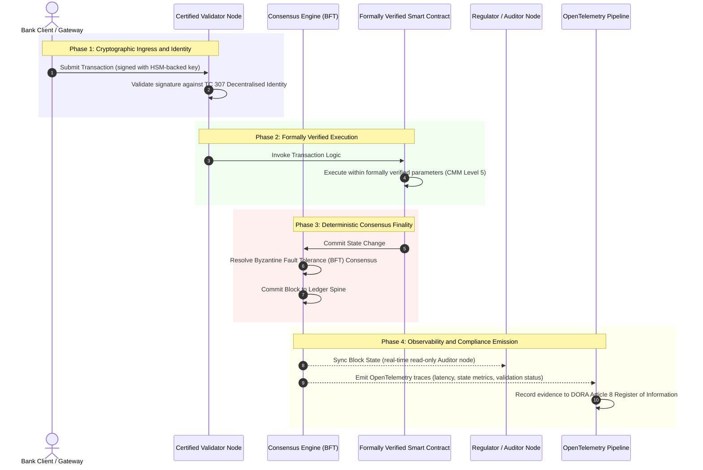

# از شواهد تا حقیقت: چرا بلاک‌چین‌های گواهی‌شده دوران بعدی اعتماد بانکی را تعریف خواهند کرد

**تغییرناپذیر با مورد‌اعتماد یکی نیست.** همان‌طور که بانکداری کلان به سمت تسویه بی‌درنگ و هوش مصنوعی احتمالاتی حرکت می‌کند، دفتر کلی که تصمیم می‌گیرد چه چیزی حقیقت است، به تنها لایه‌ای بدل شده که بانک‌ها هنوز نمی‌توانند آن را گواهی کنند. آنها نهاد را ذیل Basel III، ابر را ذیل ISO 27001 و هوش مصنوعی خود را ذیل ISO 42001 گواهی می‌کنند، اما دفتر کل توزیع‌شده، حاکمیت، اجماع، رمزنگاری و قراردادهای هوشمند آن، به فرض‌های مختص هر فروشنده واگذار می‌شود. این گزارش استدلال می‌کند که بستن این شکاف امانی مستلزم گذار از رهنمود ISO/IEC TC 307 به تضمین تجویزی است: امتیازدهی دفتر کل در برابر یک شاخص بلاک‌چین گواهی‌شده پنج‌سطحی که سنجه‌های مهندسی را به حقیقتی قابل‌حسابرسی برای هیئت‌مدیره و قابل‌دفاع در برابر DORA بدل می‌کند.

<!-- lead-start -->
<aside class="post-lead" aria-label="خلاصهٔ مقاله">

<strong>خلاصه.</strong> بانک‌ها نهاد، ابر و هوش مصنوعی خود را گواهی می‌کنند، اما دفتر کلی را که به‌طور فزاینده تعیین می‌کند چه چیزی حقیقت است، نه. ISO/IEC TC 307 رهنمود می‌دهد، نه تضمین. یک شاخص بلاک‌چین گواهی‌شده پنج‌سطحی، حاکمیت دفتر کل، یکپارچگی اجماع، هویت و رمزنگاری، تضمین قرارداد هوشمند و رصدپذیری را در برابر یک مدل بلوغ قابلیت امتیازدهی می‌کند، شکاف امانی را می‌بندد و به هوش مصنوعی احتمالاتی یک ستون فقرات حسابرسی قطعی می‌دهد.

<strong>نکات کلیدی</strong>

<ul class="post-lead-takeaways">
  <li><strong>شکاف اصطکاکی امانی.</strong> بانک (Basel III)، ابر (ISO 27001) و سامانه حاکمیت هوش مصنوعی (ISO 42001) قابل‌گواهی هستند؛ دفتر کل توزیع‌شده‌ای که تصمیم می‌گیرد چه چیزی حقیقت است، هنوز نه. این عدم‌تقارن یک آسیب‌پذیری عملیاتی زنده است.</li>
  <li><strong>DORA آن را شخصی می‌کند.</strong> ذیل DORA Article 5، هیئت‌مدیره بانک‌ها مسئولیت مستقیم و غیرقابل‌تفویض تاب‌آوری استقرارهای شخص‌ثالث و دفتر کل را بر عهده دارند، با جریمه‌های شخصی SM&amp;CR در صورت قصور.</li>
  <li><strong>ستون فقرات حسابرسی هوش مصنوعی.</strong> یادگیری ماشین بازتولیدپذیر نیست؛ یک بلاک‌چین گواهی‌شده نسخه‌های مدل، ورودی‌ها و تصمیم‌های اعتبارسنجی را به‌طور قطعی روی‌زنجیره ثبت می‌کند و ISO 42001 و استانداردهای مدیریت ریسک مدل را برآورده می‌سازد.</li>
  <li><strong>شاخص بلاک‌چین گواهی‌شده.</strong> حاکمیت، اجماع، رمزنگاری، قراردادهای هوشمند و رصدپذیری به یک کارنامه CMM از 0 تا 5 بدل می‌شوند که سنجه‌های مهندسی را به بیانیه‌های اشتهای ریسک مصوب هیئت‌مدیره ترجمه می‌کند.</li>
</ul>

<strong>مطالعه مرتبط:</strong> <a href="https://sebastienrousseau.com/2026-07-02-certified-blockchains-banking-trust-tc307-assurance-2026">بلاک‌چین‌های گواهی‌شده و اعتماد بانکی: تضمین TC 307</a>، <a href="https://sebastienrousseau.com/2026-07-24-global-payments-outlook-operating-model-risk-revenue">چشم‌انداز جهانی پرداخت‌ها در 2026</a>.

</aside>
<!-- lead-end -->

> **خلاصه اجرایی**
>
> - **بانکداری کلان در یک نقطه عطف است.** تسویه بی‌درنگ و هوش مصنوعی احتمالاتی، مدل تضمین آنالوگ و گذشته‌نگر را می‌شکنند: حسابرسی‌های ایستا و مبتنی بر نهاد دیگر پاسخگوی مطالبات نوین مدیریت ریسک یا امانی نیستند.
> - **TC 307 یک خط‌مبنا است، نه یک گواهی‌نامه.** ISO/IEC TC 307 واژگان، معماری مرجع و رهنمود امنیتی دفاتر کل توزیع‌شده را استاندارد کرده است، اما توصیفی است. آنچه را که خوب به نظر می‌رسد تعریف می‌کند؛ اما راستی‌آزمایی تجویزی‌ای را که افسران ریسک و ناظران برای مجوز استقرار در محیط عملیاتی نیاز دارند، فراهم نمی‌کند.
> - **تضمین یعنی امتیازدهی دفتر کل.** حاکمیت، یکپارچگی اجماع، ایمنی قرارداد هوشمند و چابکی رمزنگاری، امتیازدهی‌شده در برابر یک مدل بلوغ قابلیت پنج‌سطحی سختگیرانه، بانک‌ها را از فرض‌های وصله‌ای و مختص فروشنده به سمت حقیقت مالی قابل‌گواهی و قابل‌حسابرسی برای هیئت‌مدیره حرکت می‌دهند.
> - **دفتر کل، ستون فقرات حسابرسی برای هوش مصنوعی است.** لنگرانداختن نسخه‌های مدل، ورودی‌ها و تصمیم‌های اعتبارسنجی به اجماع قطعی، به یادگیری ماشین بازتولیدناپذیر یک سابقه شواهدی قابل‌دفاع و قابل‌بازسازی ذیل ISO 42001، SR 11-7 و PRA SS1/23 می‌دهد.

## شکاف اصطکاکی امانی در بانکداری دیجیتال

در بانکداری کلاسیک، اعتماد رابطه‌ای، نهادی و گذشته‌نگر است. به حسابرسان مستقل شخص‌ثالثی بستگی دارد که وضعیت مالی را در نقاط زمانی ایستا بازبینی می‌کنند و مغایرت‌ها را در سیلوهای دفتر کل دوطرفه تطبیق می‌دهند. در بازارهای بی‌درنگ و مبتنی بر API سال 2026، این مدل تأخیرهای بازدارنده و ریسک‌های ساختاری را وارد می‌کند.

هنگامی که تراکنش‌ها آنی تسویه می‌شوند، استخرهای نقدینگی درون‌روزی به‌طور پویا توسط دروازه‌های API مدیریت می‌شوند، و مالکیت دارایی در دفاتر کل مشترک توکنیزه می‌شود، حسابرسی‌های گذشته‌نگر به تمرین‌های پزشکی‌قانونی بدل می‌شوند تا کنترل‌های پیشگیرانه. امانت‌داران دیگر نمی‌توانند صرفاً به گواهی نهاد شرکتی تکیه کنند. آنها باید خودِ بستر دیجیتال را گواهی کنند.

در حال حاضر، بانک‌ها ذیل یک عدم‌تقارن معماری آشکار عمل می‌کنند:

1. **زیرساخت ابری گواهی‌شده**: گره‌های سخت‌افزاری، کانتینرهای مجازی‌سازی‌شده و مراکز داده فیزیکی در برابر کنترل‌های ISO/IEC 27001 و SOC 2 Type II اعتبارسنجی می‌شوند.  
2. **فرآیندهای مدیریتی گواهی‌شده**: سیاست‌های ریسک عملیاتی، طرح‌های تداوم کسب‌وکار و استقرارهای الگوریتمی ذیل چارچوب‌های ریسک سختگیرانه اداره می‌شوند.  
3. **موتورهای دفتر کل گواهی‌نشده**: سازوکارهای اجماع توزیع‌شده هسته، زنجیره‌های تأمین گره اعتبارسنج، مرزهای قرارداد هوشمند و مدل‌های حاکمیت شبکه به فرض‌های گواهی‌نشده، سفارشی یا مختص کنسرسیوم واگذار می‌شوند.

این عدم‌تقارن یک نقطه شکست عمده است. یک بانک می‌تواند یک برنامه اعتبارسنجی‌شده را درون یک کانتینر ابری امن و گواهی‌شده با ISO 27001 اجرا کند، اما اگر آن کانتینر روی یک دفتر کل توزیع‌شده با کنترل اعتبارسنج متمرکز، پارامترهای اجماع آسیب‌پذیر، یا قراردادهای هوشمند حسابرسی‌نشده بنویسد، یکپارچگی تراکنش به خطر می‌افتد. برای پل‌زدن این شکاف، خودِ موتور دفتر کل باید به یک شیء تضمین قابل‌گواهی بدل شود.

## خط‌مبنای استانداردسازی ISO/IEC TC 307

کار بنیادین لازم برای استانداردسازی دفاتر کل توزیع‌شده توسط کمیته فنی ISO/IEC 307 (TC 307) (بلاک‌چین و فناوری‌های دفتر کل توزیع‌شده) در حال شکل‌گیری است. TC 307 به‌جای برخورد با بلاک‌چین به‌مثابه یک پروتکل فنی منزوی، آن را به‌عنوان یک زیرساخت اعتماد نهادی می‌نگرد و کار خود را حول پنج ستون اصلی سازمان می‌دهد:

1. **رده‌بندی و واژگان (ISO 22739)**: یک نام‌گذاری مشترک را برقرار می‌کند و تعاریف حقوقی و عملیاتی سازگار را در حوزه‌های قضایی، طرح‌های مالی و نهادهای مختلف تضمین می‌کند.  
2. **معماری مرجع (ISO/TR 23245)**: مرزها، لایه‌ها، جریان‌های داده و مؤلفه‌های کارکردی یک سامانه دفتر کل توزیع‌شده منطبق را تعریف می‌کند.  
3. **امنیت، حریم خصوصی و قراردادهای هوشمند (ISO/TR 23244 / ISO 23613)**: رهنمودهای امنیتی خط‌مبنا را برای سامانه‌های دارایی دیجیتال برقرار می‌کند و بهترین شیوه‌ها را برای کاهش آسیب‌پذیری قرارداد هوشمند و حاکمیت چرخه عمر تشریح می‌کند.  
4. **چارچوب‌های تعامل‌پذیری**: سازوکارهای تبادل داده و دارایی میان شبکه‌های دفتر کل ناهمگون را می‌پردازد و از شکل‌گیری سیلوهای توکنیزه منزوی جلوگیری می‌کند.  
5. **هویت غیرمتمرکز و لنگرهای اعتماد**: شناسه‌های رمزنگاری مبتنی بر دفتر کل را با زیرساخت‌های رسمی کلید عمومی (PKI) و سجل‌های مورد‌تأیید دولت یکپارچه می‌کند.

روی‌هم‌رفته، TC 307 نشانگر گذار DLT از یک انتخاب مهندسی سفارشی به یک انضباط معماری استاندارد است. با این حال، TC 307 عمدتاً توصیفی باقی می‌ماند. آنچه را که خوب به نظر می‌رسد تعریف می‌کند (رهنمود)، اما پروتکل راستی‌آزمایی تجویزی (تضمین) را که افسران ریسک و ناظران برای مجوز استقرار عملیاتی کارکردهای حیاتی یا مهم (CIFs) نیاز دارند، فراهم نمی‌کند.

## رهنمود در برابر تضمین: تمایز امانی

مشارکت‌کنندگان بازار مالی فناوری را به این دلیل که نوآورانه یا زیباست به کار نمی‌گیرند؛ آنها آن را زمانی به کار می‌گیرند که بتوان بر آن حاکمیت کرد، آن را حسابرسی، دفاع و با الزامات ذخیره سرمایه تطبیق داد. به همین دلیل است که استانداردسازی در بانکداری به‌طور طبیعی به دو لایه فرو می‌کاهد:

* **رهنمود (چارچوب)**: بهترین شیوه‌ها، اهداف مرجع و رهنمودهای معماری را ترسیم می‌کند (مثلاً ISO/IEC TC 307، چارچوب‌های NIST).  
* **تضمین (اثبات)**: شواهد مستقل، پیوسته و قابل‌راستی‌آزمایی توسط شخص‌ثالث را فراهم می‌کند مبنی بر اینکه چارچوب پیاده‌سازی شده و آن‌گونه که طراحی شده عمل می‌کند (مثلاً گواهی ISO 27001، حسابرسی‌های SOC 2، بررسی‌های نظارتی).

تکیه بر اجماع دفتر کل گواهی‌نشده در حالی که زیرساخت ابری گواهی می‌شود، یک شکاف مقرراتی حیاتی است. بلاک‌چینی که «تغییرناپذیر» است، لزوماً «مورد‌اعتماد نهادی» نیست. تغییرناپذیری تنها تضمین می‌کند که داده واردشده بدون تغییر است؛ راستی‌آزمایی نمی‌کند که گره‌های اعتبارسنج امن هستند، پروتکل اجماع در برابر تبانی تاب‌آور است، منطق قرارداد هوشمند از نظر ریاضی درست است، یا مدیریت کلید رمزنگاری با الزامات پساکوانتومی منطبق است.

برای بستن این شکاف، شاخص بلاک‌چین گواهی‌شده 2026 این الزامات را در قالب یک مدل بلوغ قابلیت (CMM) کمّی و نگاشت‌شده به مقررات بانکی جهانی رسمیت می‌بخشد.

## شاخص بلاک‌چین گواهی‌شده 2026

برای توانمندسازی مدیریت ارشد به‌منظور ارزیابی و گواهی سکوهای دفتر کل خود، این شاخص زیرساخت دفتر کل توزیع‌شده را در قالب پنج لایه عملیاتی قابل‌حسابرسی، امتیازدهی‌شده در مقیاس CMM از 0 تا 5، ساختاربندی می‌کند.

### جدول 1: معماری شاخص بلاک‌چین گواهی‌شده

| لایه شاخص | سطح بلوغ قابلیت (CMM) | سنجه فنی و عملیاتی | مرجع کنترل مقرراتی / امانی |
| ---- | ---- | ---- | ---- |
| **حاکمیت دفتر کل** | **Level 0**: کنسرسیوم موقتی**Level 3**: بررسی صلاحیت و چرخش خودکار اعتبارسنج**Level 5**: لنگرانداختن هویت رمزنگاری غیرمتمرکز و چندطرفه | درصد گره‌های اعتبارسنج که توسط نهادهای مالی بررسی‌صلاحیت‌شده اداره می‌شوند؛ میانگین زمان حل اختلافات اعتبارسنج؛ توزیع جغرافیایی گره‌ها | **DORA Article 5** (حاکمیت و سازمان)؛ **CPMI-IOSCO PFMI Principle 2** (حاکمیت) و **Principle 3** (چارچوب مدیریت جامع ریسک‌ها) |
| **یکپارچگی اجماع** | **Level 0**: تک‌گره یا POW مبهم**Level 3**: BFT حسابرسی‌شده با نهایی‌سازی قطعی**Level 5**: اجماع چندحوزه‌قضایی و رسماً راستی‌آزمایی‌شده با پایش پیوسته تأخیر | حداکثر تأخیر اجماع قابل‌تحمل؛ آستانه مقاومت در برابر تبانی؛ توافق‌نامه سطح خدمات (SLA) دسترس‌پذیری تحت پارتیشن گره شبیه‌سازی‌شده | **DORA Article 6** (چارچوب مدیریت ریسک ICT)؛ **CPMI-IOSCO PFMI Principle 8** (نهایی‌سازی تسویه) |
| **هویت و رمزنگاری** | **Level 0**: کلیدهای ضعیف RSA / ECDSA**Level 3**: چندامضایی با مدیریت کلید پشتیبانی‌شده با HSM**Level 5**: کلیدهای ترکیبی مقاوم در برابر کوانتوم (FIPS 203 ML-KEM) و دروازه‌های حریم خصوصی دانش‌صفر | درصد تراکنش‌های دفتر کل امضاشده با کلیدهای پشتیبانی‌شده با HSM؛ امتیاز آمادگی مهاجرت PQC؛ تأخیر اثبات ZK | **NIST FIPS 203 / 204**؛ **ISO/IEC 27001** (مدیریت امنیت اطلاعات) |
| **تضمین قرارداد هوشمند** | **Level 0**: اسکریپت‌های solidity حسابرسی‌نشده**Level 3**: اعتبارسنجی خودکار کامپایلر و حسابرسی بیرونی**Level 5**: قراردادهای هوشمند رسماً راستی‌آزمایی‌شده و تغییرناپذیر با ارتقاهای قطع‌کننده مدار | درصد قراردادهای هوشمند با راستی‌آزمایی رسمی ریاضی؛ شمار هشدارهای کامپایلر؛ پوشش پویش آسیب‌پذیری | **EBA Guidelines on Outsourcing Arrangements** (پاراگراف‌های 81، 113-117)؛ **DORA Article 30** (بندهای قراردادی حداقلی) |
| **حسابرسی و رصدپذیری** | **Level 0**: استخراج دستی لاگ**Level 3**: ردیابی‌های ساختاریافته OTel و گره‌های حسابرس فقط‌خواندنی**Level 5**: تطبیق خودکار و پیوسته با سجل Article 8 | درصد تراکنش‌های پوشش‌داده‌شده با ردیابی‌های OpenTelemetry؛ تأخیر از ثبت بلوک دفتر کل تا همگام‌سازی گره حسابرس | **BCBS 239** (تجمیع داده ریسک)؛ **DORA Article 8** (سجل اطلاعات / طرح‌واره‌های ITS) |

### جدول 2: سیگنال‌های کلیدی اعتماد نگاشت‌شده به استانداردهای بانکی جهانی

| سیگنال / معیار سنجش | سنجه | تأثیر بر سکوهای بانکی | منبع مقرراتی |
| ---- | ---- | ---- | ---- |
| **پیشرفت ISO/IEC TC 307** | گذار از گزارش‌های فنی ISO/TR به طرح‌های گواهی رسمی | نخستین چارچوب استاندارد را برای گواهی موتورهای دفتر کل توزیع‌شده برقرار می‌کند | **ISO/IEC JTC 1 / SC 44** (فناوری‌های دفتر کل توزیع‌شده) |
| **فاز نمونه اولیه Project Agorá** | بیش از 40 بانک تجاری مشارکت‌کننده؛ آزمون دفتر کل یکپارچه سپرده‌های توکنیزه | انتقال تسویه فرامرزی از پیام‌رسانی (SWIFT) به تسویه اتمی توکنیزه | **مرکز نوآوری بانک تسویه بین‌المللی (BIS)** |
| **حسابرسی شخص‌ثالث DORA Article 30** | 100% از ارائه‌دهندگان گره و میزبان‌های زیرساخت در برابر معیارهای امنیتی حسابرسی‌شده | «گره‌های اعتبارسنج سایه» را حذف می‌کند؛ شفافیت کامل زنجیره تأمین را الزامی می‌سازد | **مقامات نظارتی اروپا (ESA)** |
| **ISO/IEC 42001 (حاکمیت هوش مصنوعی)** | مدل هوش مصنوعی و لاگ‌های آموزش، به‌طور رمزنگاری تغییرناپذیر و روی‌زنجیره | بلاک‌چین را به‌مثابه دفتر کل شواهدی تغییرناپذیر («ستون فقرات حسابرسی») برای یادگیری ماشین به کار می‌گیرد | **ISO/IEC 42001:2023** (فناوری اطلاعات، هوش مصنوعی) |
| **کفایت سرمایه Basel III** | کاهش بافرهای سرمایه ریسک عملیاتی بر پایه کاهش پیچیدگی مستند | چارچوب‌های استاندارد ریسک عملیاتی مستقیماً تاب‌آوری دفتر کل راستی‌آزمایی‌شده را اعتبار می‌دهند | **کمیته نظارت بانکی Basel (BCBS)** |

## «ستون فقرات حسابرسی» هوش مصنوعی: هوش احتمالاتی بر زیرساخت قطعی

یکی از نیرومندترین نقش‌های راهبردی برای یک بلاک‌چین گواهی‌شده در سال 2026، ایفای نقش **«ستون فقرات حسابرسی»** برای استقرارهای هوش مصنوعی است. سامانه‌های مالی نوین به‌طور فزاینده احتمالاتی هستند. امتیازدهی اعتباری، کشف تقلب بی‌درنگ، معاملات الگوریتمی و تعاملات خودگردان با مشتری توسط مدل‌های یادگیری ماشینی هدایت می‌شوند که در طول زمان تکامل می‌یابند، رانش می‌کنند و سازگار می‌شوند. این مدل‌ها غیرقطعی هستند: با ورودی یکسان در دو زمان متفاوت، ممکن است به‌دلیل وزن‌های پویا و آموزش پیوسته، خروجی‌های متفاوتی تولید کنند.

این عدم‌قطعیت یک چالش حاکمیتی ژرف را ذیل **ISO/IEC 42001 (حاکمیت هوش مصنوعی)** و استانداردهای **مدیریت ریسک مدل (MRM)** (مانند **US Federal Reserve SR 11-7** و **UK PRA SS1/23**) وارد می‌کند: *چگونه تصمیم‌هایی را که به‌طور دقیق بازتولیدپذیر نیستند، حسابرسی، تبیین و دفاع می‌کنید؟*

یک دفتر کل توزیع‌شده گواهی‌شده وزنه تعادل قطعی را فراهم می‌کند. در حالی که مدل‌های هوش مصنوعی به‌طور احتمالاتی عمل می‌کنند، بلاک‌چین گواهی‌شده پارامترهای آنها را به‌طور قطعی ثبت می‌کند و یک ستون فقرات شواهدی تغییرناپذیر برقرار می‌سازد:

* **نسخه‌بندی مدل و لنگرانداختن وزن**: هر نسخه مدل مستقرشده، وزن‌های مرتبط آن و کنترل‌مجموع‌های داده آموزشی آن، در زمان ساخت درهم‌سازی و روی دفتر کل نوشته می‌شوند و الزامات زنجیره تأمین **SLSA Level 3** را برآورده می‌سازند.  
* **ثبت ورودی زمینه‌ای**: هنگامی که یک مدل هوش مصنوعی یک تصمیم حیاتی را اجرا می‌کند (مثلاً تأیید یک وام یا نشانه‌گذاری یک تراکنش)، ورودی‌های زمینه‌ای دقیق و درهم‌سازی‌های مدل روی دفتر کل نوشته می‌شوند و تاریخچه‌ای دستکاری‌آشکار ایجاد می‌کنند.  
* **قابلیت‌حسابرسی بدون دسترسی به کد**: اگر یک ناظر بپرسد «چرا مدل شما این درخواست اعتباری را در 3 ژوئن رد کرد؟» بانک نیازی به افشای کد اختصاصی یا تلاش برای بازآفرینی وضعیت دقیق مدل ندارد. بانک سابقه دفتر کل روی‌زنجیره و امضاشده به‌طور رمزنگاری از ورودی‌ها، وزن‌ها و وضعیت اعتبارسنجی را ارائه می‌کند.

با لنگرانداختن تصمیم‌های احتمالاتی مدل‌های یادگیری ماشین به اجماع قطعی یک بلاک‌چین گواهی‌شده، نهاد یک جدول زمانی قابل‌دفاع، قابل‌بازسازی و به‌طور مستقل قابل‌راستی‌آزمایی از کنش‌های خودکار ایجاد می‌کند.

## بصری‌سازی خط‌لوله اجماع-تا-حسابرسی گواهی‌شده

نمودار توالی زیر چرخه عمر یک تراکنش را که از یک سکوی بلاک‌چین گواهی‌شده عبور می‌کند نشان می‌دهد و نمایان می‌سازد که چگونه دروازه‌های اعتبارسنجی، یکپارچگی اجماع، اجرای قرارداد هوشمند و انتشار سنجش از راه دور در هم قفل می‌شوند تا شواهد مقرراتی آماده برای هیئت‌مدیره تولید کنند:

مسیر بحرانی این توالی تراکنشی مستلزم آن است که هر گام اعتبارسنجی، اجرا و اجماع به‌طور رمزنگاری امضا شود تا اصالت سرتاسری تضمین گردد. گره حسابرس ناظر، وضعیت بلوک را به‌صورت بی‌درنگ همگام‌سازی می‌کند و نیاز به تطبیق مالی دستی و گذشته‌نگر را از میان می‌برد.

## راهنمای عملیاتی اتاق هیئت‌مدیره برای مدیران ارشد

برای مدیریت موفق گذار از اعتماد سازمانی به اعتماد زیرساختی، مدیران اجرایی و مدیران ارشد بانک باید بی‌درنگ چهار دستور کلیدی را اجرا کنند:

1. **الزامی‌کردن حسابرسی‌های دفتر کل در مدیریت ریسک بنگاه (ERM)**: یک سیاست را اعمال کنید که بر اساس آن هیچ سکوی دفتر کل توزیع‌شده‌ای، خواه خصوصی، عمومی یا کنسرسیوم‌محور، نمی‌تواند برای کارکردهای حیاتی یا مهم (CIFs) مستقر شود مگر آنکه در برابر **معماری شاخص بلاک‌چین گواهی‌شده** پنج‌لایه‌ای حسابرسی شده باشد (حداقل CMM Level 3).  
2. **یکپارچه‌سازی بلاک‌چین‌ها به‌مثابه ستون فقرات شواهدی هوش مصنوعی ISO 42001**: به مدیر ارشد ریسک و معمار ارشد هوش مصنوعی دستور دهید تا همه مدل‌های یادگیری ماشین پرتأثیر را با یک بلاک‌چین گواهی‌شده یکپارچه کنند و یک دفتر کل حسابرسی دستکاری‌آشکار از نسخه‌های مدل، وزن‌ها، ورودی‌ها و تصمیم‌ها ایجاد کنند.  
3. **حسابرسی زنجیره تأمین گره اعتبارسنج (DORA Article 30)**: از بخش تدارکات بخواهید تا همه نهادهای شخص‌ثالث میزبان گره‌های اعتبارسنج یا مدیریت‌کننده میزبانی ابری برای شبکه‌های DLT را حسابرسی کند و انطباق با همان استانداردهای امنیت سایبری و تاب‌آوری عملیاتی اعمال‌شده بر گره‌های ابری داخلی بانک را الزامی سازد.  
4. **هم‌راستاسازی معماری‌های دفتر کل با CPMI-IOSCO و BCBS 239**: به تیم مهندسی سکو دستور دهید تا سنجش از راه دور خروجی دفتر کل را مستقیماً با الزامات گزارش‌دهی داده **BCBS 239** هم‌راستا کند، و اطمینان حاصل کند که پارامترهای اجماع و نهایی‌سازی تسویه به‌طور سختگیرانه با **CPMI-IOSCO Principles 8 and 9** منطبق‌اند.

## پرسش‌های پرتکرار

**آیا ISO/IEC TC 307 یک استاندارد گواهی است?**  
خیر. ISO/IEC TC 307 یک کمیته فنی است که واژگان، معماری‌های مرجع و رهنمودهای امنیتی را برقرار می‌کند. هرچند «آنچه را که خوب به نظر می‌رسد» تعریف می‌کند (رهنمود)، صنعت باید این اسناد را به طرح‌های گواهی رسمی و قابل‌حسابرسی (تضمین) عملیاتی کند تا ناظران بانکی را راضی سازد.

**یک بلاک‌چین گواهی‌شده چگونه از انطباق با DORA پشتیبانی می‌کند?**  
ذیل DORA Article 5، هیئت‌مدیره بانک‌ها مسئولیت مستقیم و شخصی تاب‌آوری فناوری را بر عهده دارند. یک بلاک‌چین گواهی‌شده شواهد رمزنگاری قابل‌راستی‌آزمایی از یکپارچگی اجماع، کنترل زنجیره تأمین اعتبارسنج و ایمنی قرارداد هوشمند را فراهم می‌کند و به اعضای هیئت‌مدیره «گام‌های معقول» مستندی را می‌دهد که برای دفاع در برابر ادعاهای مسئولیت شخصی SM\&CR لازم است.

**تفاوت میان حسابرسی دفتر کل سنتی و حسابرسی بلاک‌چین گواهی‌شده چیست?**  
یک حسابرسی سنتی گذشته‌نگر است و ورودی‌های دستی و فایل‌های ایستا را پس از تسویه تراکنش‌ها راستی‌آزمایی می‌کند. یک حسابرسی بلاک‌چین گواهی‌شده پیوسته و بی‌درنگ است؛ گره‌های اعتبارسنج، موتور اجماع BFT و قراردادهای هوشمند رسماً راستی‌آزمایی‌شده گواهی می‌شوند تا تراکنش‌ها را به‌طور قطعی اجرا کنند و سنجش از راه دور ساختاریافته (OpenTelemetry) منتشر کنند که به‌طور پیوسته سلامت سامانه را اعتبارسنجی می‌کند.

**آیا بلاک‌چین‌های عمومی می‌توانند برای کاربرد بانکی گواهی شوند?**  
در بیشتر حوزه‌های قضایی، بلاک‌چین‌های عمومی صرفاً بدون‌مجوز به‌دلیل نبود راستی‌آزمایی هویت اعتبارسنج، هزینه‌های غیرقابل‌پیش‌بینی گس/تراکنش و نهایی‌سازی غیرقطعی (مثلاً انشعاب‌های احتمالاتی اثبات‌کار/اثبات‌سهام) از برآورده‌ساختن مقررات بانکی بازمی‌مانند. بلاک‌چین‌های گواهی‌شده در بانکداری معمولاً از معماری‌های سازمانی مجوزدار یا عمومی-ترکیبی به‌شدت تنظیم‌شده بهره می‌گیرند که در آنها گردانندگان گره اعتبارسنج، نهادهای مالی شناسایی‌شده و حسابرسی‌شده هستند.

## منابع

* کمیته نظارت بانکی Basel (BCBS)، 2013. *اصولی برای تجمیع و گزارش‌دهی مؤثر داده ریسک (BCBS 239)*. Basel: بانک تسویه بین‌المللی. در دسترس در: [کمیته نظارت بانکی Basel (BCBS)، 2013.](https://www.bis.org/publ/bcbs239.pdf "کمیته نظارت بانکی Basel (BCBS)، 2013.").  
* کمیته پرداخت‌ها و زیرساخت‌های بازار و کمیته فنی سازمان بین‌المللی کمیسیون‌های اوراق بهادار (CPMI-IOSCO)، 2012. *اصولی برای زیرساخت‌های بازار مالی*. Basel: بانک تسویه بین‌المللی. در دسترس در: [کمیته پرداخت‌ها و زیرساخت‌های بازار و کمیته فنی سازمان بین‌المللی کمیسیون‌های اوراق بهادار (CPMI-IOSCO)، 2012.](https://www.bis.org/cpmi/publ/d101a.pdf "کمیته پرداخت‌ها و زیرساخت‌های بازار و کمیته فنی سازمان بین‌المللی کمیسیون‌های اوراق بهادار (CPMI-IOSCO)، 2012.").  
* مرجع بانکی اروپا (EBA)، 2019. *EBA/GL/2019/02، رهنمودهای مربوط به ترتیبات برون‌سپاری*. Paris: EBA. در دسترس در: [مرجع بانکی اروپا (EBA)، 2019.](https://www.eba.europa.eu/regulation-and-policy/internal-governance/guidelines-on-outsourcing-arrangements "مرجع بانکی اروپا (EBA)، 2019.").  
* پارلمان اروپا و شورای اتحادیه اروپا، 2022. *مقرره (EU) 2022/2554 در باب تاب‌آوری عملیاتی دیجیتال برای بخش مالی (DORA)*. Brussels: روزنامه رسمی اتحادیه اروپا. در دسترس در: [پارلمان اروپا و شورای اتحادیه اروپا، 2022.](https://eur-lex.europa.eu/legal-content/EN/TXT/?uri=CELEX%3A32022R2554 "پارلمان اروپا و شورای اتحادیه اروپا، 2022.").  
* ISO/IEC JTC 1/SC 42، 2023. *ISO/IEC 42001:2023، فناوری اطلاعات، هوش مصنوعی، سامانه مدیریت*. Geneva: سازمان بین‌المللی استانداردسازی. در دسترس در: [ISO/IEC JTC 1/SC 42، 2023.](https://www.iso.org/standard/81230.html "ISO/IEC JTC 1/SC 42، 2023.").  
* کمیته فنی ISO/IEC 307، 2020. *ISO/IEC 22739:2020، بلاک‌چین و فناوری‌های دفتر کل توزیع‌شده، واژگان*. Geneva: سازمان بین‌المللی استانداردسازی. در دسترس در: [کمیته فنی ISO/IEC 307، 2020.](https://www.iso.org/standard/73771.html "کمیته فنی ISO/IEC 307، 2020.").  
* مؤسسه ملی استانداردها و فناوری (NIST)، 2026. *سه استاندارد نخست نهایی‌شده رمزنگاری پساکوانتومی (FIPS 203، 204 و 205)*. Gaithersburg: وزارت بازرگانی ایالات متحده. در دسترس در: [مؤسسه ملی استانداردها و فناوری (NIST)، 2026.](https://www.nist.gov/news-events/news/2024/08/nist-releases-first-3-finalised-post-quantum-encryption-standards "مؤسسه ملی استانداردها و فناوری (NIST)، 2026.").

