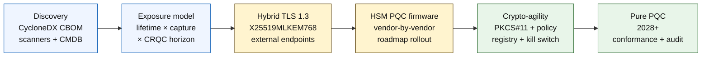

# Ang Quantum-Safe Banking Index sa 2026: Post-Quantum Cryptography, QKD, Crypto-Agility, at Harvest-Now-Decrypt-Later Risk

<!-- lead-start: manual -->
<aside class="post-lead" aria-label="Buod ng artikulo">

<strong>TL;DR.</strong> Ang quantum-safe banking sa 2026 ay isang delivery programme na ang deadline ay nakatakda sa interseksyon ng dalawang kurba — ang confidentiality lifetime ng datos na hawak ngayon ng institusyon, at ang arrival horizon ng isang Cryptographically Relevant Quantum Computer (CRQC). Final na ang NIST FIPS 203 / 204 / 205 mula Agosto 2024; itinakda ng CNSA 2.0 ang US federal end-state sa 2033; nangyayari na ang harvest-now-decrypt-later sa long-lived data. Sinusubaybayan ng Board-Level Quantum Scorecard ang apat na eksaktong porsiyento: inventory completeness, HNDL exposure, NIST migration progress, crypto-agility readiness.

<strong>Mga pangunahing punto</strong>

<ul class="post-lead-takeaways">
  <li><strong>Sarado na ang debate sa algorithm noong 13 Agosto 2024.</strong> Sagot na ang ML-KEM (FIPS 203), ML-DSA (FIPS 204), SLH-DSA (FIPS 205). Ang mga bangkong patuloy pa ring nagsasagawa ng internal evaluation para "pumili ng panalo" ay 18 buwan nang luma.</li>
  <li><strong>Aplikable na ang harvest-now-decrypt-later.</strong> Anumang may confidentiality lifetime na lumalampas sa kapani-paniwalang pagdating ng CRQC — 30-taong mortgage, life-insurance underwriting, MiFID II / GDPR transaction recordings, M&amp;A retention archives — ay dapat lumipat na ngayon sa hybrid quantum-safe key encapsulation, hindi paghihintayin ang anunsyo ng CRQC.</li>
  <li><strong>Inventory ang gating maturity.</strong> Ang Cryptographic Bill of Materials (CBOM) — protocol, library, certificate, HSM partition, vendor dependency, application owner, data-classification lifetime — ay pinakamababang kailangan para sa lahat ng iba pa. Subaybayan ang freshness, hindi ang coverage.</li>
  <li><strong>Hybrid TLS 1.3 ang deployment ng 2026.</strong> Ang X25519MLKEM768 hybrid key share ang aktwal na nine-negotiate ngayon ng Chrome / Firefox / Cloudflare / Akamai. Naghihintay pa ang purong ML-KEM TLS ng HSM firmware at CA readiness.</li>
  <li><strong>Ang crypto-agility ang matibay na deliverable.</strong> PKCS#11 abstraction, labelled keys, policy registry na nag-uugnay ng business service sa pinapayagang algorithm set. Kung wala ito, ang susunod na algorithm transition ay isa na namang programa na tatagal ng maraming taon.</li>
</ul>
</aside>
<!-- lead-end -->

Ang quantum-safe banking sa 2026 ay tungkol sa operational migration, hindi spekulasyon. Final na ng NIST ang unang tatlong post-quantum cryptography standards, at kailangang malaman ng mga bangko ngayon kung aling mga sistema ang nakadepende sa RSA, ECC, TLS, signatures, HSMs, certificates, payment channels, archives, at long-lived confidential data. Simple ang tanong ng index: kaya bang palitan ng institusyon ang cryptography bago maging operational ang banta?

---

> **Executive Summary / Mga Pangunahing Punto**
>
> - **Konkreto na ang mga NIST standard.** Tinutukoy ng FIPS 203 ang ML-KEM para sa key encapsulation, ng FIPS 204 ang ML-DSA para sa signatures, at ng FIPS 205 ang SLH-DSA bilang stateless hash-based signature standard.
> - **Inventory ang unang maturity gate.** Hindi maililipat ng bangko ang hindi nito makita: dapat ma-map ang certificates, keys, protocols, applications, vendors, HSMs, APIs, archives, at embedded systems.
> - **Crypto-agility ang matagalang layunin.** Hindi ito basta isahang algorithm swap; ito ang kakayahang baguhin ang cryptographic primitives nang hindi muling idinidisenyo ang buong application.
> - **Binabago ng long-lived data ang antas ng pagkaapurahan.** Sa harvest-now-decrypt-later risk, ang datos na nakuha ngayon ay maaaring maging mababasa sa hinaharap kung mananatiling mahalaga ito nang sapat na panahon.
> - **Espesyalisadong komplemento ang QKD.** Maaaring maging angkop ang quantum key distribution sa mga pinakamahalagang channel, ngunit hindi nito pinapalitan ang institution-wide na PQC migration.
>
---

## Bakit 2026 ang Taon kung Kailan Mahalaga ang Index na Ito

Tatlong pagbabago sa 2024-2025 ang gumawa sa quantum-safe bilang nasusukat na bank programme sa halip na research watchpoint. Una, ni-finalize ng NIST ang pangunahing post-quantum standards noong 13 Agosto 2024: [FIPS 203 (ML-KEM) ⧉](https://nvlpubs.nist.gov/nistpubs/FIPS/NIST.FIPS.203.pdf "FIPS 203 — Module-Lattice-Based Key-Encapsulation Mechanism"), [FIPS 204 (ML-DSA) ⧉](https://nvlpubs.nist.gov/nistpubs/FIPS/NIST.FIPS.204.pdf "FIPS 204 — Module-Lattice-Based Digital Signature Standard"), [FIPS 205 (SLH-DSA) ⧉](https://nvlpubs.nist.gov/nistpubs/FIPS/NIST.FIPS.205.pdf "FIPS 205 — Stateless Hash-Based Digital Signature Standard"). Sa petsang iyon nagsara ang debate sa algorithm selection; ang mga bangkong patuloy pa ring nagpapatakbo ng internal workstream tungkol sa "alin ang mananalo" sa 2026 ay 18 buwan nang luma.

Pangalawa, itinakda ng [CNSA 2.0 ng NSA ⧉](https://media.defense.gov/2022/Sep/07/2003071834/-1/-1/0/CSA_CNSA_2.0_ALGORITHMS_.PDF "Commercial National Security Algorithm Suite 2.0") ang US federal end-state sa 2033, na may intermediate cutoff na nagsisimula sa 2027 para sa software at firmware signing, at 2030 para sa browsers at operating systems. Anumang bangkong may US federal counterparty exposure — FedNow, Treasury operations, federal customer accounts — ay nasa loob ng perimeter na iyon para sa mga sistemang humihipo sa federal data. Hindi na abstract ang orasan.

Pangatlo, ang [Harvest-Now-Decrypt-Later (HNDL) ⧉](https://csrc.nist.gov/Projects/post-quantum-cryptography "NIST Post-Quantum Cryptography programme") ang load-bearing na argumento ng panganib para sa pagkaapurahan. Tumatangay na ngayon ng mga sopistikadong adbersaryo ang TLS-protected payment messages, SWIFT envelopes, KYC documentation, at long-lived archive ciphertext sa mga pangunahing financial centre. Ang datos na nakuha sa 2026 ay kailangan lamang manatiling confidentiality-sensitive sa sandali ng decryption — para sa 30-taong mortgage, life-insurance underwriting, MiFID II / GDPR transaction recordings, at M&A retention archives, ang window na iyon ay lumampas nang husto sa bawat kapani-paniwalang pagtataya para sa Cryptographically Relevant Quantum Computer (CRQC). Hindi kailangan ng adbersaryo ng quantum computer ngayon. Kailangan nila ito bago tumigil sa kahalagahan ang datos.

Sinusukat ng Quantum-Safe Banking Index kung kaya bang ipadala ng institusyon mo ang migration bago dumating ang interseksyong iyon. Hindi na tanong kung dapat ba o hindi mag-migrate; ang tanong ay kung makukumpleto ang migration sa nadedepensahang timeline.

## Ang Arkitektura ng Index sa 2026

| Layer ng Index | Direksyon sa 2026 | Readiness Metric | Panganib kung Mali ang Pagkahawak |
|---|---|---|---|
| **Inventory** | I-map ang cryptographic assets, protocols, certificates, vendors, at data classes | Porsiyento ng estate na nai-inventory | Hindi kilalang quantum-vulnerable na dependency |
| **Exposure** | I-classify ang mga sistema ayon sa confidentiality lifetime at transaction criticality | High-risk asset ayon sa halaga at lifetime | Maling prayoridad ng migration |
| **Migration** | Magpatibay ng hybrid at PQC-ready pattern na aligned sa NIST standards | ML-KEM at ML-DSA readiness | Emergency re-platforming sa ilalim ng deadline |
| **Crypto-agility** | Ihiwalay ang application logic mula sa cryptographic primitives | Coverage ng policy-controlled crypto | Hard-coded algorithm sa kabuuan ng estate |
| **Assurance** | I-test ang interoperability, performance, suporta sa HSM, certificates, at vendor readiness | Test pass rate at exception backlog | Sirang channel o mahinang fallback control |

### Ang Board-Level Quantum Scorecard

Ang kapani-paniwalang quantum readiness scorecard ay nangangailangan ng pagsubaybay sa eksaktong porsiyento, hindi lamang project status:

1. **Inventory Completeness:** Ang porsiyento ng tier-1 application na may ganap na na-map na Cryptographic Bill of Materials (CBOM).
2. **HNDL Exposure:** Ang volume ng long-lived confidential data (hal., PII, trade secrets) na ipinapadala sa network nang walang hybrid quantum-safe key encapsulation.
3. **NIST Migration Progress:** Ang porsiyento ng asymmetric encryption keys at digital signatures na nailipat na sa FIPS 203 (ML-KEM) at FIPS 204 (ML-DSA) standards.
4. **Crypto-Agility Readiness:** Ang porsiyento ng critical systems kung saan maaaring iikot ang cryptographic algorithms sa pamamagitan ng centralized policy nang walang kailangang code recompilation.

## Mga Kasalukuyang Signal na Susubaybayan

| Signal | Ano ang Kahulugan Nito sa mga Bangko | Pinagmulan |
|---|---|---|
| **FIPS 203 ML-KEM** | Pangunahing NIST standard para sa general encryption key establishment | [NIST ⧉](https://www.nist.gov/news-events/news/2024/08/nist-releases-first-3-finalized-post-quantum-encryption-standards "First three finalized post-quantum encryption standards") |
| **FIPS 204 ML-DSA** | Pangunahing NIST standard para sa digital signatures | [NIST ⧉](https://www.nist.gov/news-events/news/2024/08/nist-releases-first-3-finalized-post-quantum-encryption-standards "First three finalized post-quantum encryption standards") |
| **FIPS 205 SLH-DSA** | Hash-based signature alternative at backup design | [NIST ⧉](https://www.nist.gov/news-events/news/2024/08/nist-releases-first-3-finalized-post-quantum-encryption-standards "First three finalized post-quantum encryption standards") |
| **Hinihikayat ang agarang integration** | Hayagang sinasabi ng NIST sa mga administrator na simulang i-integrate ang standards dahil matagal ang full integration | [NIST ⧉](https://www.nist.gov/news-events/news/2024/08/nist-releases-first-3-finalized-post-quantum-encryption-standards "First three finalized post-quantum encryption standards") |
| **Lumalawak ang quantum programme ng mga bangko** | Tinutuklas ng mga pangunahing bangko ang quantum technologies habang inihahanda ang PQC transition | [Quantum Insider ⧉](https://thequantuminsider.com/2026/03/27/15-plus-global-banks-probing-the-wonderful-world-of-quantum-technologies/ "Overview of global banks exploring quantum technologies") |

## Nagsisimula ang Migration sa Ledger ng Cryptography

Naunawaan na sa puntong ito ang sequence ng migration. Ang bawat gate ay nagbibigay ng ebidensiyang nagtutulak sa susunod; ang paglaktaw o pag-compress ng gate ang gumagawa ng emergency re-platforming risk na lumalabas sa failure column ng Index Architecture.

Ang unang deliverable ay hindi bagong algorithm; ito ay isang Cryptographic Bill of Materials (CBOM). Kailangan ng mga bangko ng buhay na inventory na nag-uugnay sa business services sa algorithms, libraries, certificates, key lengths, HSMs, data lifetimes, vendors, at operational owners. Kung wala ang ledger na iyon, nagiging hula-hula ang quantum-safe migration.

Para sa bawat cryptographic primitive, dapat ma-capture ng CBOM record set: ang protocol o interface (TLS 1.3, IPsec, SSH, custom payment-message format), ang algorithm at parameter set (RSA-2048, ECDH P-256, ML-KEM-768, ML-DSA-65), ang library at bersyon (OpenSSL 3.4, BoringSSL commit hash, vendor SDK build), ang hardware boundary (HSM partition, TPM, secure enclave, o wala), ang certificate identity kung may applicable, ang application owner, at ang data-classification lifetime. Ang mga tool na lumalabas sa produksyon sa 2025-2026 — IBM Quantum Safe Inventory, ang open-source na [CycloneDX CBOM specification ⧉](https://cyclonedx.org/capabilities/cbom/ "CycloneDX Cryptography Bill of Materials"), enterprise scanner mula sa CryptoNext / Sandbox / PQShield — ay nag-iintegrate sa kasalukuyang CMDB pipelines. Wala sa kanilang lubos na kumpleto nang mag-isa; asahan ang 12-18 buwang CBOM build cycle kahit may vendor tooling at dedikadong headcount.

Freshness, hindi coverage, ang metric na susubaybayan. Ang CBOM na dalawang buwan na luma ay mas masama pa kaysa walang CBOM dahil binibigyan nito ng maling tiwala ang security team tungkol sa kung ano ang nailipat na.

## Hybrid Muna, Agile sa Lahat ng Pagkakataon

Hindi mag-aalis ang karamihan ng bangko ng lahat sabay-sabay. Ang makatotohanang pattern ay hybrid deployment, kung saan magkasama ang classical at post-quantum mechanism habang nag-mature ang vendors, protocols, certificates, at operational tooling. Ang pangmatagalang layunin ay crypto-agility: policy-controlled cryptographic choice na maaaring baguhin nang hindi muling itinatayo ang business application.

[Insert Interactive Component: Harvest-Now-Decrypt-Later (HNDL) Risk Calculator — Slider-based tool kung saan inilalagay ng mga executive ang data shelf-life laban sa tinantiyang quantum timeline upang makita ang kanilang exposure window.]

> **Pangunahing insight:** Kung kailangang manatiling confidential ang datos mo nang 10 taon, at ang Cryptographically Relevant Quantum Computer (CRQC) ay 7 taon ang layo, hindi sa loob ng 7 taon ang migration deadline mo — 3 taon na ang nakalipas.

Sa pagsasanay, ibig sabihin nito ay TLS 1.3 na may hybrid `X25519MLKEM768` key share para sa externally-facing endpoints (lahat ng Chrome / Firefox / Cloudflare / Akamai ay sumusuporta nito ngayon), classical signature chain hanggang umabot ang HSM at CA infrastructure, at PKCS#11 abstraction layer na nagpapahintulot sa policy registry na iikot ang algorithms nang hindi muling kine-compile ang business application. Ang crypto-agility ang nagpapasiya kung ang susunod na algorithm transition (kailan, hindi kung) ay anim-na-linggong rotation o isa pang pitong taong programa.

## Saan Pumapasok ang QKD

Bahagi ng index ang quantum key distribution bilang opsyon sa high-sensitivity channel, lalo na para sa financial-market infrastructure, central-bank connectivity, at lubhang sensitibong institutional flows. Dapat ito tratuhin bilang komplemento sa PQC, hindi bilang dahilan upang ipagpaliban ang enterprise migration.

## Ano ang Ibig Sabihin Nito ayon sa Uri ng Bangko

### Global Systemically Important Banks

Ang mahirap na problema ay sukat: sampu-sampung libong TLS endpoint, daan-daang HSM partition, dose-dosenang internal certificate authority, daan-daang business application na may embedded cryptographic primitives, at vendor SDK na hindi mababago ng bangko. Hindi pilot ang inbestasyon; ang CBOM tooling, ang PKCS#11 abstraction layer na nakakabit sa bawat bagong build, ang HSM consolidation plan na pumipili ng isang vendor na manguna sa PQC firmware at tatanggap ng multi-year na buntot para sa iba, at ang policy registry na magiging durable na crypto-agility surface matagal pagkatapos makumpleto ang FIPS 203 / 204 / 205 migration.

### Transaction at Corporate Banks

Mas makitid ang migration scope kaysa sa G-SIB tier ngunit malala ang HNDL exposure: SWIFT cross-border messaging, structured payment data na nagdadala ng corporate-counterparty PII, document-exchange platform na humahawak ng trade-finance documentation, at long-retention reporting archive. Prayoridad ang hybrid TLS sa bawat customer-facing endpoint at PQC at rest para sa retention archive. Itulak ang HSM-vendor accountability — ang corporate-banking platform team ay may direktang procurement leverage na madalas ay wala sa wholesale technology team.

### Regional Banks

Bilhin ang vendor stack na may crypto-agility primitives na. Pumili ng core banking platform na ang vendor ay naglalathala ng CBOM at nakatali sa ML-KEM / ML-DSA support timeline. I-validate na ang HSM roadmap ng vendor ay naka-align sa migration deadline ng bangko. Ang engineering capacity na kailangan para gumawa ng crypto-agility mula sa simula ay multi-year; binabayaran ng vendor ang gastusing iyon sa maraming customer at minamana ng bangko ang benepisyo. Ang validation work — pagtiyak na nakapasa sa MRM process ng institusyon ang mga claim ng vendor — ang lehitimong internal na saklaw.

### Fintechs, PSPs, at Infrastructure Providers

Para sa mga vendor na nagbebenta sa bangko sa 2026, ang competitive na tanong ay hindi "sumusuporta ka ba sa PQC." Ito ay "kaya mo bang gumawa ng CycloneDX CBOM para sa iyong platform, HSM-vendor support matrix, at nakasulat na algorithm-rotation SLA." Ang mga vendor na sumagot ng oo ay papasa sa tier-1 procurement gate sa 2026-2027. Ang hindi kakaya ay matatalo sa renewal cycle laban sa kakumpitensiyang kaya.

## Konklusyon

Ang quantum-safe banking sa 2026 ay hindi research watchpoint; ito ay delivery programme na ang deadline ay nakatakda sa interseksyon ng dalawang kurba — ang confidentiality lifetime ng datos na hawak ngayon ng institusyon, at ang arrival horizon ng Cryptographically Relevant Quantum Computer. Ang mga institusyong magmumukhang kapani-paniwala sa regulator at counterparty sa 2030 ay ang mga nagsimula ng CBOM construction sa 2024, nag-deploy ng hybrid TLS sa bawat external endpoint pagsapit ng end-2026, at nag-engineer ng crypto-agility sa bawat bagong build mula araw isa. Ang hindi gumawa nito ay makakatuklas kung sarado na ang kanilang migration window para sa datos na tinatangay ng kanilang adbersaryo ngayon.

Sukatin ang migration tulad ng pagsukat sa anumang operational programme: alam ang saklaw, prayoridad ang pagkakasunod-sunod, kumpirmado ang deadline, tapat ang exception register. Habang mas malapit mong tinitingnan ang sarili mong estate, mas lumiliit ang dating malaking migration window.

## Mga Madalas na Itinatanong

**Ano ang dapat unang i-inventory ng bangko?**

Magsimula sa externally exposed TLS, payment channels, customer authentication, interbank connectivity, HSM-backed services, long-term archives, at sistemang humahawak ng confidential data na may mahabang useful life.

**Cybersecurity issue lang ba ang PQC?**

Hindi. Nakakaapekto ito sa payments, identity, legal evidence, transaction signing, customer trust, data retention, vendor management, at operational resilience.

**Ano ang ibig sabihin ng crypto-agility?**

Crypto-agility ang kakayahang baguhin ang cryptographic primitives sa pamamagitan ng policy at platform control, hindi ng hard-coded application change.

**Dapat ba maghintay ang bangko ng mas maraming standard?**

Hindi. Hinikayat ng NIST ang mga administrator na simulang i-integrate ang unang final na standards dahil matagal ang full integration.

## Mga Reference

- NIST, (2026). [First three finalized post-quantum encryption standards ⧉](https://www.nist.gov/news-events/news/2024/08/nist-releases-first-3-finalized-post-quantum-encryption-standards "First three finalized post-quantum encryption standards").

<!-- enrich-start -->
<aside class="author-card" aria-label="Tungkol sa may-akda"><strong class="author-card-name"><a href="/about/index.html">Sebastien Rousseau</a></strong>Senior na teknologist sa pagbabangko na sumusulat tungkol sa applied AI, payments infrastructure, tokenised money, ISO 20022, post-quantum security, cloud-native financial services, at regulated digital markets.Mahigit 20 taon sa HSBC Commercial &amp; Investment Bank, PayPal, Barclays, Shazam, AKQA, Virgin Group. <a href="/about/index.html">Buong profile</a> &middot; <a href="https://www.linkedin.com/in/sebastienrousseau/" rel="external noopener">LinkedIn</a> &middot; <a href="https://github.com/sebastienrousseau" rel="external noopener">GitHub</a></aside>

Huling pagsusuri <time datetime="2026-06-04">2026-06-04</time>.

<aside class="related-posts" aria-labelledby="related-heading">
<h2 id="related-heading" class="related-heading">Karagdagang babasahin</h2>

<article class="related-card"><footer class="related-body"><h3><a href="https://sebastienrousseau.com/2026-05-31-post-quantum-payments-infrastructure-replace-rather-than-retrofit-2026">Post-Quantum Payments Infrastructure in 2026: Replace, Don't Retrofit</a></h3>
<time datetime="2026-05-31">2026-05-31</time>
</footer></article>
<article class="related-card"><footer class="related-body"><h3><a href="https://sebastienrousseau.com/2026-05-18-quantum-cryptography-standards-developments-2026">The Quantum Cryptography Reset in 2026: PQC Standards, QKD Assurance, and the Migration Work Banks Cannot Defer</a></h3>
<time datetime="2026-05-18">2026-05-18</time>
</footer></article>
<article class="related-card"><footer class="related-body"><h3><a href="https://sebastienrousseau.com/2026-05-14-securing-the-ledger-post-quantum-migration-corporate-finance">Securing the Ledger: A Board-Level Guide to Post-Quantum Migration for Corporate Finance</a></h3>
<time datetime="2026-05-14">2026-05-14</time>
</footer></article>

</aside>
<!-- enrich-end -->
