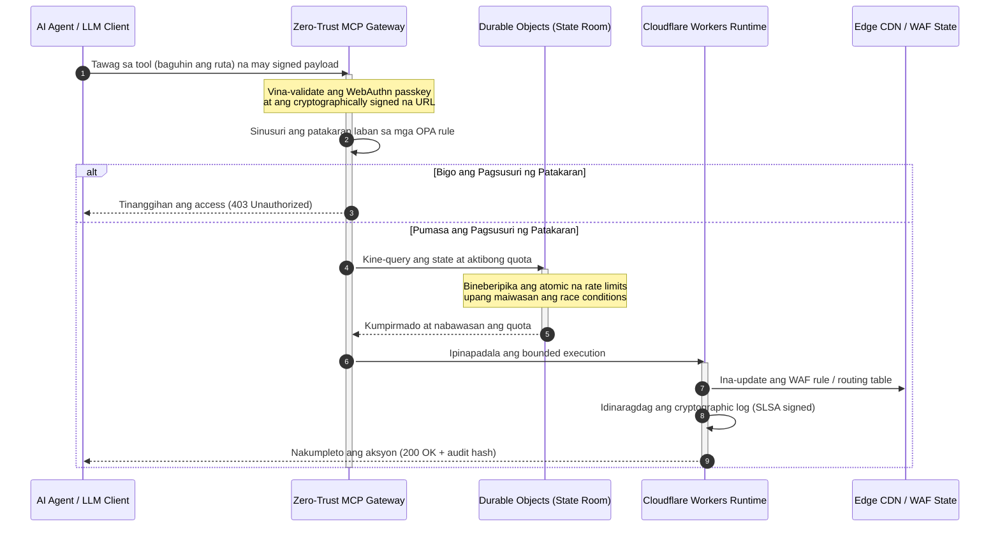

# CloudCDN: Open-Source na Blueprint para sa AI-Native Edge sa 2026

<!-- lead-start: manual -->
<aside class="post-lead" aria-label="Buod ng artikulo">

<strong>TL;DR.</strong> Ang enterprise technology sa 2026 ay binubuo ng pagtatagpo ng globally distributed na serverless execution at agentic AI. Ang mga karaniwang CDN — na itinayo para sa static file caching at payak na traffic routing — ay structurally obsolete na sa panahon ng aktibo at real-time na orkestrasyon ng datos. Ang CloudCDN ay open-source na blueprint na ginagawang aktibong control plane ang edge: mga serverless runtime, stateful na coordination sa pamamagitan ng Cloudflare Durable Objects, at zero-trust na Model Context Protocol (MCP) gateway na nagpapahintulot sa mga autonomous na AI agent na patakbuhin ang web infrastructure sa loob ng mga bounded at cryptographically secured na operational envelope.

<strong>Mga pangunahing tinik</strong>

<ul class="post-lead-takeaways">
  <li><strong>Mula sa static cache tungo sa bounded na control plane.</strong> Inililipat ng CloudCDN ang operational boundary sa edge, at ginagawang aktibong policy gate ang mga CDN node na nagpapatupad ng sub-millisecond na mga desisyon sa seguridad, routing, at access control.</li>
  <li><strong>Stateful na coordination sa edge.</strong> Ipinatutupad ng Cloudflare Durable Objects ang atomic at real-time na rate limiting at state coordination sa buong mundo — walang distributed race conditions, walang systemic na pang-aabuso ng quota sa pagitan ng mga edge region.</li>
  <li><strong>Ligtas na agentic na pamamahala ng imprastraktura sa pamamagitan ng MCP.</strong> Inilalantad ng isang zero-trust gateway ang 42 na specialised na MCP tool, na nagpapahintulot sa mga AI agent na suriin, i-configure, at patakbuhin ang imprastraktura sa ilalim ng mga cryptographically signed na hangganan.</li>
  <li><strong>Supply-chain security bilang deliverable ng pipeline.</strong> SLSA Level 3 na build provenance sa pamamagitan ng Sigstore/Cosign at 3,185 na unit test sa 100% na coverage sa bawat release.</li>
  <li><strong>Ebidensya para sa board, hindi mga dashboard.</strong> Direktang naka-map ang edge telemetry sa accountability ng board sa ilalim ng DORA Article 5, sa risk reporting ng BCBS 239, at sa mga panuntunan ng Basel III sa operational-risk capital.</li>
</ul>

<strong>Karagdagang pagbabasa:</strong> <a href="/2026-05-16-best-cloud-infrastructure-architecture-2026/">Arkitektura ng cloud infrastructure 2026</a> · <a href="/2026-06-05-cloud-native-banking-index-dora-resilience-platform-engineering-2026/">Cloud Native Banking Index 2026</a> · <a href="/2026-06-03-agentic-ai-index-banks-autonomy-governance-auditability-2026/">Agentic AI Index para sa mga bangko 2026</a>.

</aside>
<!-- lead-end -->

Tapos na ang debate sa CDN. Hindi na cache ang edge; ito na ang control plane para sa AI-native na software. Habang tumatawag ng mga tool ang mga agent, naglilipat ng datos, nagpa-purge ng cache, humihingi ng signed URLs, at nagko-coordinate ng mga workflow, ang lumang modelo ng mga opaque na dashboard at proprietary na control plane ay hindi na lamang abala — nagiging pananagutan ito sa regulasyon. Iginigiit ng CloudCDN ang ibang modelo: isang bukás, masusuri, at agent-controllable na edge platform na itinuturing ang seguridad, accessibility, performance, at kakayahang i-audit bilang mga maipatutupad na default sa halip na mga pangako ng vendor.

Ang open-source na reference para sa artikulong ito ay [cloudcdn.pro ⧉](https://github.com/sebastienrousseau/cloudcdn.pro "cloudcdn.pro"). Ang repository ay multi-tenant, AI-native na CDN na maaaring basahin mula simula hanggang katapusan at i-deploy nang nakapag-iisa: sub-100ms TTFB sa mga Cloudflare PoP, kontrol ng MCP, rate limiting ng Durable Objects, WCAG-AA na accessibility, signed URLs, passkeys, SLSA Level 3, at 3,185 na pagsubok sa 100% na coverage.

---

> **Buod ng Ehekutibo / Mga Pangunahing Tinik**
>
> - **Ang edge na ang nagiging operational boundary.** Ginagawa ng CloudCDN na aktibong policy gate ang mga karaniwang CDN node na nagpapatupad ng sub-millisecond na seguridad, routing, at access control.
> - **Ginagawa ng Durable Objects na atomic ang rate limiting.** Ang real-time at globally consistent na pagpapatupad ng quota ang nagsasara ng race-condition window na iniiwang bukas ng mga eventually consistent na limiter sa mga attacker at sirang agent.
> - **Pinatatakbo ng mga agent ang imprastraktura sa pamamagitan ng 42 na bounded na MCP tool.** Bawat invocation ay vina-validate laban sa WebAuthn passkeys, signed payloads, at OPA policy bago ang anumang pagpapatupad.
> - **Bahagi ng produkto ang supply chain.** Ang SLSA Level 3 na provenance sa pamamagitan ng Sigstore/Cosign ay cryptographically na nag-uugnay sa bawat release sa na-audit nitong source.
> - **Ebidensya ng compliance ang telemetry.** Naka-map ang mga operasyon sa edge sa DORA Article 5, BCBS 239, at Basel III operational-risk capital — nang direkta, hindi sa pamamagitan ng after-the-fact na reporting.
>
---

## Bakit Mahalaga ang Open-Source na Proyektong Ito sa 2026

Ang enterprise IT sa 2026 ay lumipat na mula sa static na infrastructure provisioning tungo sa real-time at event-driven na orkestrasyon ng datos. Dalawang puwersa ng merkado ang nagtutulak ng pagbabago.

Ang una ay ang paglaganap ng agentic AI. Ang mga autonomous na modelo at software agent ay nagsasagawa na ngayon ng mga kumplikadong operational na gawain — automated na threat mitigation, mga desisyon sa routing, real-time na pagbabalanse ng ledger. Hindi sila gumagamit ng mga dashboard. Tumatawag sila ng mga tool.

Ang ikalawa ay ang aktibong pagpapatupad ng [Digital Operational Resilience Act (DORA) ⧉](https://eur-lex.europa.eu/legal-content/EN/TXT/?uri=CELEX%3A32022R2554 "Regulation (EU) 2022/2554 tungkol sa digital operational resilience para sa sektor ng pananalapi"). Hindi na maaaring umasa ang mga institusyong pampagbabangko sa mga opaque at proprietary na third-party CDN. Hinihingi ng mga regulator ang kumpletong visibility sa software supply chain, mapatutunayang exit capability, at mga hindi mababagong cryptographic na audit trail.

Ang mga sentralisadong arkitektura ng server ay nagpapataw ng latency penalties na hindi kayang sipsipin ng real-time na orkestrasyon. Ang mga proprietary na CDN ay kumikilos bilang mga black box na naglalantad sa mga institusyon sa supply-chain compromise na hindi nila nakikita, lalo nang hindi mapatutunayan. Sinasara ng CloudCDN ang puwang na iyon gamit ang isang transparent, zero-trust, at open-source na blueprint na ginagawang aktibong control plane ang edge. Para sa mga technology executive, inililipat nito ang usapan mula sa halaga ng compliance tungo sa Return on Resilience: kapital na napangangalagaan ng mga automated at audit-ready na operational pipeline.

## Ang Lente ng Arkitektura

Ang arkitektura ng CloudCDN ay nakabalangkas sa limang layer, na pinapalitan ang sentralisadong middleware ng mga lokal at stateful na edge primitive:

| Layer | Desisyon sa Disenyo | Bakit Mahalaga | Panganib Kung Mali ang Pamamahala |
|---|---|---|---|
| **Edge runtime** | Cloudflare Workers at Pages | Inaalis ang latency ng sentralisadong VM; nagpapatupad ng sub-millisecond na mga patakaran sa buong mundo | Ang pakinabang sa performance nang walang disiplina sa patakaran ay lumilikha ng magulong edge drift |
| **State coordination** | Durable Objects | Ginagarantiyahan ang atomic at real-time na consistency para sa rate limits at shared state sa pagitan ng mga rehiyon | Distributed race conditions, pang-aabuso sa API resources, nala-lampasang quota ng perimeter |
| **Agent interface** | Zero-trust na MCP gateway | Inilalantad ang 42 na specialised na MCP tool upang patakbuhin ng mga AI agent ang imprastraktura sa ilalim ng pinamamahalaang hangganan | Walang hangganang tool invocation at hindi awtorisadong pagbabago ng configuration |
| **Access control** | WebAuthn passkeys at signed URLs | Pinapalitan ang mga static na password ng cryptographic signatures para sa mga operasyong maaaring i-audit | Mahinang naka-attribute na mga pagbabago; pagnanakaw ng credential na humahantong sa perimeter breach |
| **Quality gates** | SLSA Level 3 at 100% na test coverage | Mathematically na bineberipika ang pinagmulan ng build; hinaharangan ang malisyosong dependency injection | Malisyosong code na isinisingit sa pamamagitan ng software supply chain |

## Mga Operasyonal na Senyas na Dapat Subaybayan

Nasusukat ang edge readiness. Ito ang mga quantitative indicator na nagpapakita ng kakayahang magpatupad sa halip na intensyon lamang:

| Senyas | Sukatan / Benchmark | Reference sa Regulasyon | Implementasyon sa Platform |
|---|---|---|---|
| **42 na MCP tools** | Bounded na bilang ng tool registry para sa automated na pamamahala | COBIT 2019 (BAI06) | MCP gateway na nagva-validate ng mga agent signature laban sa mga OPA policy |
| **Durable Objects** | Zero-leak at sub-millisecond na atomic na pagpapatupad ng quota | DORA Article 6 | Durable Objects na sumusubaybay sa pandaigdigang state ng API quota |
| **Passkeys at signed URLs** | 100% ng mga admin session na-verify sa pamamagitan ng FIDO2 WebAuthn | DORA Article 30 | Mga cryptographic signature check na naka-embed sa edge router |
| **SLSA Level 3** | Mga cryptographically signed na build manifest (Sigstore) | DORA Article 30 | Mga GitHub Actions pipeline na lumilikha ng signed na build metadata |
| **3,185 na unit test** | 100% na coverage; regression gates sa bawat release | NIST CSF 2.0 (PR.DS-01) | Mga CI pipeline na humihinto ng deployment sa anumang test failure |

## Ang CDN ay Nagiging Aktibong Control Plane

Ang mga tradisyonal na CDN ay idinisenyo sa palibot ng passive at static na pagpapabilis ng content. Binabago ng CloudCDN ang modelo. Sa integrasyon ng Cloudflare Workers at Durable Objects, ang edge ay gumagana bilang aktibo at stateful na policy gate.

Kapag humiling ang isang AI agent o automated na proseso ng pagbabago sa configuration ng imprastraktura o ng pag-aayos ng routing, hindi ito nakikipag-usap sa isang vulnerable at sentralisadong database. Hinaharang ang request sa pinakamalapit na edge node at dinadaanan ito sa mga pagsusuri ng pagkakakilanlan, patakaran, at quota bago ang anumang pagpapatupad:

Bawat hakbang sa sequence na iyon ay lumilikha ng attributable at signed na record. Iyan ang pagkakaiba sa pagitan ng CDN na nagpapabilis ng content at ng control plane na maaaring pamahalaan.

## Bakit Binabago ng Open Source ang Modelo ng Tiwala

Para sa mga Chief Information Security Officer, ang mga opaque at proprietary na CDN ay nagdadala ng panganib na patuloy na lumalaki. Ang mga closed-source na edge network ay mga black box: kapag dumanas ang vendor ng panloob na compromise, zero ang visibility ng bangko hanggang sa maisapubliko ang breach.

Pinapalitan ng CloudCDN ang asymmetry na iyon ng isang ganap na maa-audit at open-source na modelo ng tiwala na nakatayo sa tatlong mekanismo:

1. **Mathematical na build provenance.** Sa ilalim ng SLSA Level 3, bawat release ay cryptographically na nakaugnay sa open-source nitong GitHub repository. Mabeberipika ng isang CISO — sa matematika, hindi sa kontrata — na ang binary na tumatakbo sa mga pandaigdigang edge node ng Cloudflare ay naglalaman nang eksakto ng na-audit na source code.
2. **Tuloy-tuloy at pampublikong security audits.** Ang codebase ay dumadaan sa mga automated scan, pampublikong vulnerability disclosure, at peer-reviewed na code audit. Hindi kontrol ang obscurity; ang pagsusuri ang kontrol.
3. **Walang vendor lock-in (DORA Article 28).** Hinihingi ng DORA na patunayan ng mga bangko ang malinaw at nasubok na exit strategy mula sa mga kritikal na third-party provider. Dahil open source ang CloudCDN at nakatayo sa mga standard na serverless primitive, maaaring ilipat ng mga institusyon ang mga edge configuration mula sa Cloudflare patungo sa ibang serverless runtimes o sa mga pribadong Kubernetes cluster — at maipakita ang kakayahang iyon sa regulator.

## Ang Pattern ng Bank-Grade na Edge

Ang CloudCDN ay ininhinyero upang matugunan ang mga pamantayan ng compliance ng pandaigdigang sektor ng pananalapi, na direktang nagma-map ng mga teknikal na operasyon sa edge sa mga framework na talagang sinusuri ng mga supervisor:

- **Model risk management ([US Fed SR 11-7 ⧉](https://www.federalreserve.gov/supervisionreg/srletters/sr1107.htm "Supervisory Guidance on Model Risk Management") / UK PRA SS1/23).** Ang mga autonomous na modelo na nagsasagawa ng mga operational na gawain ay sakop ng model-risk governance. Itinuturing ng MCP gateway ng CloudCDN ang mga agentic tool bilang mga quantitative model: mahigpit na hangganan ng patakaran, real-time na logging, at mandatoryong human-in-the-loop overrides para sa mga aksyong may mataas na epekto.
- **BCBS 239 (risk data aggregation).** Sa pagkuha, pag-tag, at pagbubuo ng transaction data sa edge, nalilikha ang mga operational metric sa real time — tugma sa mga kinakailangan ng BCBS 239 sa integridad ng datos, pagiging napapanahon, at regulatory traceability.
- **DORA Article 5 (accountability ng board).** Ang board ang may panghuling personal na pananagutan sa operational resilience. Isinasalin ng CloudCDN ang edge telemetry sa quantified at mapatutunayang ebidensya na maaaring dalhin ng mga non-technical na director sa isang personal-liability audit.
- **Basel III operational-risk capital.** Nagtatabi ang mga bangko ng regulatory capital laban sa operational risk. Binabawasan ng automated na DR failover at SLSA Level 3 na provenance ang operational risk profile ng institusyon — napangangalagaan ang kapital sa balance sheet, hindi lamang napapasa ang audit.

## Ano ang Ibig Sabihin Nito Ayon sa Uri ng Bangko

### Global Systemically Important Banks (G-SIBs)

Pinatatakbo ng mga G-SIB ang napakalaking dami ng transaksyon sa maraming hurisdiksyon. Ang prayoridad ay palitan ang mga pira-pirasong legacy na kontrol ng perimeter ng iisang pinag-isang edge plane. Sa pag-deploy ng CloudCDN pattern, maaaring i-standardise ng isang G-SIB ang mga security policy, API gateway, at agentic governance sa buong mundo — at lumikha ng mga ebidensyang pipeline na sumusunod sa DORA bilang by-product ng operasyon sa halip na quarterly na pagmamadali.

### Mga Transaction at Corporate Bank

Para sa mga transaction bank, ang produktong nakaharap sa kliyente ay isang bundle ng bilis ng pagpapatupad, seguridad, at transparency ng datos. Pinapayagan ng CloudCDN pattern ang mga bangkong ito na maglantad ng mga secure na API dashboard at real-time na cash-tracking na serbisyo sa mga corporate treasurer — isang matatag na edge posture na nagtatanggol sa mga enterprise deposit.

### Mga Rehiyonal at Mas Maliliit na Bangko

Hinaharap ng mga rehiyonal na bangko ang parehong mga threat actor na hinaharap ng mga G-SIB nang walang badyet sa engineering. Ang isang open-source at bank-grade na edge blueprint ay nagbibigay ng mga kontrol out of the box: agarang pagkakahanay sa regulasyon nang walang gastos sa proprietary na lisensya, at ang source code upang patunayan ito.

## Ang Playbook ng Boardroom

Ang operational resilience ay hindi na isang hindi nakikitang back-office na IT metric; isa na itong prayoridad ng boardroom na may kalakip na personal na pananagutan. Ang mga institusyong nananatili sa tiwala ng mga regulator, kliyente, at shareholder sa 2026 ay itinuturing ang teknolohiya bilang isang mapatutunayan at masusubaybayang asset.

Maikli ang roadmap para sa mga senior na lider ng teknolohiya:

1. **Iatas ang ebidensya bilang produkto.** Maglaan ng badyet para sa mga automated at self-documenting na pipeline sa edge — ebidensyang nalilikha ng operasyon, hindi binubuo para sa auditor.
2. **Lumipat sa stateful na kontrol sa edge.** Ilipat ang rate limiting, WAF, at identity verification mula sa mga sentralisadong server tungo sa mga atomic na edge primitive.
3. **Magtatag ng cryptographic na agentic na hangganan.** Ipatupad ang mga zero-trust na MCP gateway na may passkey at OPA validation para sa bawat automated na tool invocation.
4. **Hingin ang open-source na build audits.** Gawing kondisyon ng deployment ang SLSA Level 3 na build provenance, hindi isang adhikain lamang.

## Mga Madalas Itanong

**Handa ba ang CloudCDN para sa mga DORA audit?**

Oo. Ininhinyero ang CloudCDN upang lumikha ng automated na ebidensya ng compliance na direktang naka-map sa mga ITS template ng Register of Information (RT.01 hanggang RT.15) at sa mga contractual clause ng DORA Article 30.

**Ano ang bentahe ng paggamit ng Durable Objects para sa rate limiting?**

Ang mga tradisyonal na distributed rate limiter ay umaasa sa eventual consistency, na nag-iiwan ng latency window na maaaring pagsamantalahan ng mga attacker o sirang agent. Ginagarantiyahan ng Durable Objects ang agaran at atomic na consistency sa buong mundo, na ganap na nagsasara ng race-condition window.

**Ano ang gumagawa sa CloudCDN na AI-native?**

Ang MCP-controlled na mga operasyon nito at ang agent-aware na modelo ng kontrol. Pinatatakbo ang imprastraktura sa pamamagitan ng 42 na pinamamahalaang tool na may cryptographic na pagkakakilanlan at hangganan ng patakaran — idinisenyo para sa mga autonomous na workflow, hindi lamang para sa mga human dashboard.

**Pinapataas ba ng open-source na code ang panganib ng mga zero-day exploit?**

Hindi. Ang mga proprietary at closed-source na CDN ay umaasa sa security through obscurity. Ang codebase ng CloudCDN ay tuloy-tuloy na dumadaan sa automated testing, pampublikong peer review, at SLSA Level 3 na validation — isang mapatutunayang mas mataas na threshold ng tiwala.

## Mga Reference

- European Parliament and Council of the European Union, (2022). [Regulation (EU) 2022/2554 tungkol sa digital operational resilience para sa sektor ng pananalapi (DORA) ⧉](https://eur-lex.europa.eu/legal-content/EN/TXT/?uri=CELEX%3A32022R2554 "Regulation (EU) 2022/2554 tungkol sa digital operational resilience para sa sektor ng pananalapi (DORA)"). Brussels: Official Journal of the European Union.
- Basel Committee on Banking Supervision (BCBS), (2013). [Principles for effective risk data aggregation and risk reporting (BCBS 239) ⧉](https://www.bis.org/publ/bcbs239.htm "Principles for effective risk data aggregation and risk reporting (BCBS 239)"). Basel: Bank for International Settlements.
- Board of Governors of the Federal Reserve System, (2011). [Supervisory Guidance on Model Risk Management (SR Letter 11-7) ⧉](https://www.federalreserve.gov/supervisionreg/srletters/sr1107.htm "Supervisory Guidance on Model Risk Management (SR Letter 11-7)"). Washington D.C.: Federal Reserve.
- Cloudflare, (2026). [Dokumentasyon ng Durable Objects: stateful na coordination sa edge ⧉](https://developers.cloudflare.com/durable-objects/ "Dokumentasyon ng Durable Objects"). San Francisco: Cloudflare.
- Cloudflare, (2026). [Pagbuo ng mga AI agent gamit ang MCP, authentication at Durable Objects ⧉](https://blog.cloudflare.com/building-ai-agents-with-mcp-authn-authz-and-durable-objects/ "Pagbuo ng mga AI agent gamit ang MCP, authentication at Durable Objects").
- GitHub, (2026). [Repository ng cloudcdn.pro ⧉](https://github.com/sebastienrousseau/cloudcdn.pro "Repository ng cloudcdn.pro").

<!-- enrich-start -->
<aside class="author-card" aria-label="Tungkol sa may-akda"><strong class="author-card-name"><a href="/about/index.html">Sebastien Rousseau</a></strong>Senior na teknologist sa pagbabangko na sumusulat tungkol sa applied AI, imprastraktura ng pagbabayad, tokenisadong pera, ISO 20022, post-quantum security, cloud-native na serbisyong pinansyal, open-source na imprastraktura, at regulado digital markets.Mahigit 20 taon sa HSBC Commercial &amp; Investment Bank, PayPal, Barclays, Shazam, AKQA, Virgin Group. <a href="/about/index.html">Buong profile</a> &middot; <a href="https://www.linkedin.com/in/sebastienrousseau/" rel="external noopener">LinkedIn</a> &middot; <a href="https://github.com/sebastienrousseau" rel="external noopener">GitHub</a></aside>

Huling sinuri <time datetime="2026-06-11">2026-06-11</time>.

<!-- enrich-end -->
