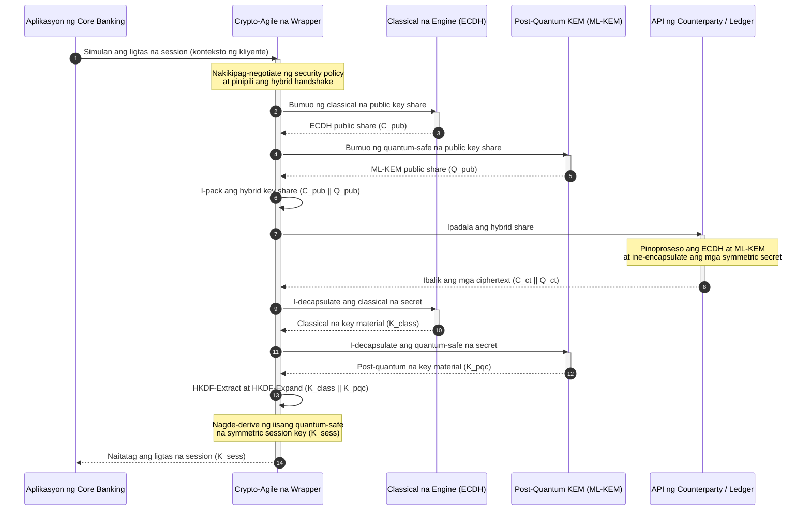

# KyberLib at ang Post-Quantum Migration ng Bangko 2026: Mula sa mga Pamantayan Patungo sa Code

<!-- lead-start: manual -->
<aside class="post-lead" aria-label="Buod ng artikulo">

<strong>TL;DR.</strong> Humaharap ang imprastraktura ng pagbabangko sa 2026 sa isang sistemikong banta na may alam nang hangganan: babasagin ng quantum-scale na computation ang RSA at ECC key exchange na nagpoprotekta sa transit traffic ngayon. Itinaas ng mga pederal na pamantayan at mga supervisory policy paper ang kamalayan; nananatiling hiwa-hiwalay ang teknikal na pagpapatupad. Ang <a href="https://github.com/sebastienrousseau/kyberlib">KyberLib</a> ay isang open-source na blueprint ng inhinyeriya na naglilipat ng post-quantum na naratibo tungo sa konkreto at memory-safe na Rust code — ipinapatupad nito ang ML-KEM na pinamantayan ng NIST (FIPS 203) sa likod ng crypto-agile na mga hangganan ng abstraction, upang ma-upgrade ng mga institusyon ang transport security at key encapsulation bago umabot sa kanilang mga archive ang mga atakeng "Store Now, Decrypt Later".

<strong>Mga pangunahing tinik</strong>

<ul class="post-lead-takeaways">
  <li><strong>Mula patakaran tungo sa masusuring code.</strong> Inililipat ng KyberLib ang post-quantum cryptography mula sa mga abstract na estratehikong roadmap tungo sa konkreto, high-performance, at naia-audit na mga implementasyon sa Rust.</li>
  <li><strong>Pinamantayang FIPS 203 ML-KEM execution.</strong> Ipinapatupad ng library ang ML-KEM — ang key-establishment algorithm na pinal sa ilalim ng NIST FIPS 203 — kaya nananatiling nakahanay ang conformance sa mga pandaigdigang inaasahan ng regulasyon.</li>
  <li><strong>Crypto-agility mula sa disenyo.</strong> Pinapayagan ng matatag na mga hangganan ng abstraction na palitan ng mga aplikasyon ng bangko ang mga cryptographic primitive nang walang magastos at madaling magkamaling muling pagsusulat ng aplikasyon.</li>
  <li><strong>Memory safety na hatid ng Rust.</strong> Binubura ng mga ownership rule sa compile time ang mga buffer overflow at memory leak na sumasalot sa mga legacy na C-based na cryptographic library, sa bilis ng zero-cost abstraction.</li>
  <li><strong>Pagbawas sa pananagutang fiduciary.</strong> Ang naoobserbahan at nasusubok na ebidensya ng migration ang nagbibigay sa mga direktor ng rekord ng "makatwirang hakbang" na hinihingi ng mga personal-accountability audit sa ilalim ng DORA Article 5.</li>
</ul>

<strong>Karagdagang babasahin:</strong> <a href="/2026-05-18-quantum-cryptography-standards-developments-2026/">Mga pamantayan ng quantum cryptography 2026</a> · <a href="/2026-05-28-dora-ai-act-data-sovereignty-banking-compliance-stack-2026/">Compliance stack ng DORA + AI Act</a> · <a href="/2026-05-20-cloud-native-banking-financial-institutions-2026/">Cloud-native na pagbabangko</a>.

</aside>
<!-- lead-end -->

Hindi na isang ehersisyo sa pagpaplano ang post-quantum migration. Sa 2026, isa na itong aktibong pangangailangang operasyonal, at ang agwat sa pagitan ng intensyon ng regulasyon at pagpapatupad ng inhinyeriya ang kinaroroonan ngayon ng panganib. Isinasara ng [KyberLib ⧉](https://github.com/sebastienrousseau/kyberlib "kyberlib") ang bahagi ng agwat na iyon: isang production-oriented at memory-safe na Rust library na nagpapatupad ng ML-KEM ayon sa pinal na mga parameter ng FIPS 203 at bumabalot dito sa crypto-agile na mga hangganan na aktwal na kailangan ng transactional estate ng isang bangko.

---

> **Buod ng Ehekutibo / Mga Pangunahing Tinik**
>
> - **Operasyonal na ang banta.** Pinapatakbo na ng mga adversary ang pag-aaning "Store Now, Decrypt Later" ngayon; mabibigo nang paatras ang kumpidensyalidad ng datos sa araw na dumating ang isang cryptographically relevant na quantum computer.
> - **Pinal na ang mga pamantayan.** Binibigyan ng NIST FIPS 203 (ML-KEM) at FIPS 204 (ML-DSA) ang mga audit committee ng malinaw at nasusubok na benchmark — wala nang depensang "naghihintay pa ng mga pamantayan".
> - **Ang KyberLib ang blueprint ng inhinyeriya.** Memory-safe na Rust, `no_std` compilation para sa mga HSM at smart card, at mga pattern ng hybrid handshake na nagpapanatili ng classical na interoperability.
> - **Crypto-agility ang matatagalang layunin.** Pinapayagan ng matatag na mga hangganan ng abstraction na magbago ang mga primitive nang walang muling pagsusulat ng aplikasyon — ang aral na mas matagal pa sa anumang iisang algorithm.
> - **Mga board ang may pasan ng pananagutan.** Inilalagay ng DORA Article 5 ang personal na responsibilidad sa mga direktor; ang masusuri at naoobserbahang migration code ang ebidensyang tutugon dito.
>
---

## Bakit Mahalaga ang Open-Source na Proyektong Ito sa 2026

Habang papalapit sa pagiging obsolete ang asymmetric cryptography, hindi naghihintay ang banta na maitayo ang isang cryptographically relevant na quantum computer. Isinasagawa na ngayon ng mga adversary ang mga atakeng **"Store Now, Decrypt Later" (SNDL)** — inaani nila ang mga naka-encrypt na transit stream ng mga transaksyon ng corporate banking, mga trade secret, at mga komunikasyong institusyonal, na may layuning i-decrypt ang mga ito kapag huminog na ang kakayahang quantum. Para sa isang bangko, ang bawat classical na handshake sa wire ngayon ay paglabag sa kumpidensyalidad na may naantalang petsa ng pagsabog.

Tumugon ang mga regulator nang may konkretong mga obligasyon:

1. Hinihingi ng **DORA Article 6 (pamamahala ng panganib sa ICT)** sa mga institusyon na i-map, tukuyin, at bawasan ang mga kahinaan sa kabuuan ng kanilang cryptographic estate — kabilang ang asymmetric key exchange na nakabaon sa middleware na walang nag-inventory.
2. Itinatakda ng **NIST FIPS 203 at 204** ang mga opisyal na post-quantum na pamantayan para sa key encapsulation (ML-KEM) at digital signature (ML-DSA), na nagbibigay sa mga audit committee ng pinamantayang benchmark kung saan sinusukat ang progreso ng migration.

Ang pagpapatupad ng migration na ito nang hindi nagagambala ang live na operasyon ay nangangailangan ng paglampas sa mga policy paper tungo sa **masusuri at open-source na cryptographic na imprastraktura**. Iyon mismo ang hatid ng [KyberLib ⧉](https://github.com/sebastienrousseau/kyberlib "kyberlib"): isang memory-safe na Rust library na sumusunod sa FIPS 203 na ginagawang masusukat at nabe-verify na pipeline ng inhinyeriya ang post-quantum na transisyon — at inililipat ang usapan sa pamumuhunan sa teknolohiya tungo sa nahahawakang Return on Resilience.

## Lente ng Arkitektura

Nakaupo ang KyberLib sa likod ng matatag na mga hangganan ng API, na pinoprotektahan ang mga pangunahing transactional na aplikasyon ng bangko mula sa mga pagbabago sa low-level na mga cryptographic primitive.

| Layer | Desisyon sa Disenyo | Bakit Ito Mahalaga | Panganib Kapag Napangasiwaang Mali |
|---|---|---|---|
| **Primitive** | FIPS 203 ML-KEM key encapsulation | Pinapalitan ang classical na Diffie-Hellman at RSA key exchange ng mga istrukturang lattice-based | Hindi pagsunod sa pinal na mga parameter ng FIPS 203, na hahantong sa mga bigong compliance audit |
| **Wika** | Memory-safe na implementasyon sa Rust | Inaalis ang mga memory-corruption na kahinaan (buffer overflow, use-after-free) na endemiko sa C/C++ | Lumalawak na dependency sprawl na sumisira sa integridad ng build chain |
| **Abstraction** | Matatag na crypto-agile na mga hangganan | Nakakapagpalit ng algorithm ang mga aplikasyon sa likod ng iisang interface habang umuusad ang mga pamantayan | Mga hard-coded na primitive na pumipilit ng manu-manong muling pagsusulat sa bawat susunod na migration |
| **Deployment** | Hybrid encryption handshake | Pinagsasama ang mga post-quantum KEM at classical na algorithm sa isang dual-wrapped na envelope | Pagkawala ng legacy interoperability o tahimik na configuration drift |
| **Pagtitiyak** | SLSA Level 3 provenance at masusuring mga test | Ginagarantiyahan ang pinagmulan at provenance ng code; maaaring i-audit ang mga halimbawa nang linya por linya | Teatro ng seguridad — mga black-box na library na ang mga error sa implementasyon ay lumilitaw sa produksyon |

## Mga Senyas na Operasyonal na Dapat Subaybayan

Ang pagpapakita ng post-quantum compliance sa mga supervisory board at regulator ay nangangahulugan ng pagsubaybay sa mga tiyak at masusukat na sukatan:

| Senyas | Sukatan | Sanggunian sa Regulasyon | Implementasyon sa Platform |
|---|---|---|---|
| **Conformance sa FIPS 203 ML-KEM** | 100% na pagsunod sa pinal na mga parameter (ML-KEM-512/768/1024) | NIST FIPS 203 | Parameter-verified na lattice cryptography na naka-compile sa loob ng mga module ng KyberLib |
| **Cryptographic inventory** | Kumpletong inventory ng paggamit ng asymmetric key exchange sa lahat ng sistema | NIST SP 1800-38 | Mga automated na scanning agent na nagla-log ng mga aktibong cipher suite sa isang sentral na registry |
| **Hybrid key exchange** | Porsyento ng mga transport-layer handshake na tumatakbo sa hybrid na envelope | DORA Article 6 | Mga network proxy na bumabalot sa classical na TLS 1.3 handshake sa PQC encapsulation |
| **`no_std` compilation** | Kakayahang mag-compile nang walang standard library ng Rust para sa mga limitadong target | DORA Article 30 | Conditional na `no_std` compilation sa KyberLib para sa mga Hardware Security Module |
| **Crypto-agility index** | Oras sa minuto upang magpalit ng cryptographic primitive sa buong API gateway | UK PRA SS1/23 | Mga abstracted na routing registry na namamahala sa alokasyon ng algorithm sa pamamagitan ng mga runtime variable |

## Bakit Mahalaga ang Rust para sa Post-Quantum Cryptography

Ang pagpapatupad ng mga post-quantum algorithm tulad ng ML-KEM ay nangangailangan ng kumplikado at low-level na mga operasyong matematikal sa mga polynomial ring. Sa kasaysayan, ang pagpapatakbo ng mga operasyong iyon sa bilis ng produksyon ay nangahulugan ng hand-written na C/C++ o assembly — malaking attack surface para sa memory corruption, sa mismong code na pinakahindi kayang magkamali ng isang bangko.

Binabago ng Rust ang security posture ng cryptographic engineering sa tatlong konkretong paraan:

1. **Memory safety sa compile time.** Ginagarantiyahan ng ownership model ng Rust na napipigilan sa compile time ang mga buffer overflow, double free, at use-after-free na error. Lalo itong mahalaga para sa mga post-quantum library, kung saan kapansin-pansing mas malaki ang mga key size at ciphertext kaysa sa mga classical na katapat ng mga ito.
2. **Deterministiko at zero-cost na mga abstraction.** Nagko-compile ang Rust sa native machine code nang walang garbage collector, kaya ang bilis ng execution at memory footprint ay tumutugma o humihigit sa mga C-based na library habang napapanatili ang kaligtasan.
3. **Pagiging compatible sa `no_std`.** Nagko-compile ang KyberLib nang walang standard library ng Rust, kaya tumatakbo ito sa mga limitado at bare-metal na kapaligiran — kabilang ang mga Hardware Security Module at smart card — at nananatili ang bank-grade na cryptography sa loob ng mga pisikal na hangganan ng seguridad.

## Pagdidisenyo ng Crypto-Agile na Arkitektura

Ang klasikong failure mode sa mga cryptographic migration ay ang hard-coding: mga palagay na partikular sa algorithm na nakabaon nang direkta sa lohika ng aplikasyon, na masakit na natutuklasan muli sa bawat transisyon. Ang matatagalang layunin para sa 2026 ay **crypto-agility** — isang abstraction layer na itinuturing na mga napapalitang module ang mga algorithm sa likod ng matatag na interface, upang ang susunod na migration ay maging pagbabago ng configuration sa halip na muling pagsusulat sa buong estate.

Ipinapakita ng sequence sa ibaba kung paano kino-coordinate ng crypto-agile na wrapper ng KyberLib ang isang hybrid (classical kasama ang post-quantum) na key-exchange handshake:

Ang hybrid na envelope ang detalyeng mahalaga sa operasyon. Hangga't hindi pa nakakaipon ng mga taon ng production scrutiny ang mga post-quantum primitive, ang session key ay hinahango mula sa parehong classical at post-quantum na secret: kailangang basagin ng umaatake ang ECDH **at** ang ML-KEM upang mabawi ang channel. Patuloy na gumagana ang mga counterparty na hindi pa nagmi-migrate; ang mga nakapag-migrate na ay agad na nakikinabang sa lattice-based na proteksyon.

## Ang Playbook ng Boardroom

Ang post-quantum security ay hindi usapin ng back-office encryption; isa itong isyu ng pamamahala sa boardroom na may personal na taya. Dapat i-frame ng mga senior manager ang migration sa pamamagitan ng responsibilidad na fiduciary:

- Inilalagay ng **DORA Article 5 (pamamahala at organisasyon)** ang personal na responsibilidad para sa seguridad ng ICT sa board of directors. Ang open-source at naoobserbahang mga test ang direktang ebidensyang hinihingi ng isang personal-liability audit — ang "pumili kami ng masusuring implementasyon ng FIPS 203 at narito ang mga conformance run nito" ay maipagtatanggol na sagot; ang "tiniyak sa amin ng aming vendor" ay hindi.
- Ang **model risk management (US Fed SR 11-7 / UK PRA SS1/23)** ay umaabot sa mga arkitektura ng cryptographic wrapper gaya ng pag-abot nito sa mga pricing model. Dapat dumaan sa MRM validation ang mga abstraction layer, kabilang ang performance sa ilalim ng matitinding senaryo ng disruption.
- Ginagantimpalaan ng **Basel III operational-risk capital** ang napatunayang kahustuhan ng kontrol. Pinabababa ng mga nasubok na hybrid handshake ang pangmatagalang operational risk profile ng institusyon, binabawasan ang capital premium at nagpapalaya ng kapasidad sa balance sheet para sa aktibong deployment ng treasury.

## Ano ang Kahulugan Nito ayon sa Uri ng Bangko

### Mga Global Systemically Important Bank (G-SIB)

Pinapatakbo ng mga G-SIB ang mga transactional estate na mabigat sa legacy, kaya ang kanilang binding constraint ay ang discovery: ang pag-alam kung saan talaga nagaganap ang asymmetric key exchange. Nauuna ang tuloy-tuloy na cryptographic inventory sa ilalim ng gabay ng NIST SP 1800-38; pagkatapos, ang KyberLib ang nagbibigay ng pinamantayan at memory-safe na library upang ipatupad ang post-quantum key encapsulation sa bawat modernong node na ilalabas ng inventory.

### Mga Transaction at Corporate Bank

Ang kumpidensyalidad sa mga payment rail ang mismong franchise. Dahil nagko-compile ang KyberLib sa mga bare-metal na `no_std` target, maaaring i-deploy ng mga transaction bank ang mga post-quantum handshake nang direkta sa loob ng hardware ng edge payment routing at liquidity management — hindi lamang sa application tier.

### Mga Rehiyonal at Mas Maliit na Bangko

Hinaharap ng mga rehiyonal na institusyon ang parehong state-sponsored na pag-aani nang walang badyet sa pananaliksik ng isang G-SIB. Ang isang masusuri at open-source na implementasyon sa Rust ang nagbibigay sa kanila ng turn-key na landas tungo sa agarang conformance sa NIST FIPS 203, nang hindi nakikipagnegosasyon sa mga black-box na roadmap ng vendor.

## Mula sa mga Roadmap Tungo sa Code na Nagko-compile

Ang post-quantum na transisyon ay isang aktibong gawain ng inhinyeriya, at ang mga institusyong mapapanatili ang tiwala ng mga supervisor, counterparty, at corporate treasurer hanggang 2026 ay ang mga lilipat mula sa mga abstract na roadmap tungo sa naoobserbahan at nagko-compile na code. Direktang sumusunod ang mandato ng ehekutibo: i-audit ang mga legacy na punto ng key exchange, i-deploy ang mga hybrid handshake sa mga channel na may pinakamataas na halaga, at itayo ang matatag na mga hangganan ng abstraction na gagawing routine ang bawat susunod na pagpapalit ng primitive. Ginagawa ng KyberLib na masusukat na kakayahang operasyonal ang bawat isa sa mga hakbang na iyon sa halip na pangakong slideware.

## Mga Madalas Itanong

**Sumusunod ba ang KyberLib sa mga pinal na pamantayan ng NIST?**

Oo. Idinisenyo ang KyberLib sa palibot ng mga parameter ng ML-KEM gaya ng pagka-pinal nito sa FIPS 203, kaya nananatiling nakahanay ang naka-compile na library sa mga pederal at pandaigdigang inaasahan ng regulasyon.

**Nangangailangan ba ng espesyal na hardware ang isang post-quantum library?**

Hindi. Ang implementasyon ng KyberLib sa Rust ay nagko-compile sa mga karaniwang arkitektura ng sistema. Dagdag pa, pinapayagan ito ng kakayahan nitong `no_std` na tumakbo sa mga espesyal na Hardware Security Module at smart card kung saan kailangan ang pisikal na pag-iingat ng susi.

**Paano nakakaapekto ang "Store Now, Decrypt Later" sa kasalukuyang compliance?**

Kung umaasa ang transport layer sa classical na RSA o ECC, maaaring anihin ng mga adversary ang traffic ngayon at i-decrypt ito kapag huminog na ang kakayahang quantum. Ang hybrid key exchange na idine-deploy ngayon ang nagpapanatili sa nakuhang datos sa likod ng lattice-based na proteksyon.

**Bakit hybrid handshake sa halip na diretsong lumipat sa mga post-quantum primitive?**

Hinahango ng mga hybrid na envelope ang session key mula sa parehong classical at post-quantum na secret, kaya nananatili ang seguridad maliban kung kapwa silang mabasag. Pinapanatili nito ang interoperability sa mga counterparty na hindi pa nagmi-migrate habang nakakaipon ng production scrutiny ang mga bagong primitive.

## Mga Sanggunian

- National Institute of Standards and Technology, (2024). [FIPS 203: Pamantayan ng Module-Lattice-Based Key-Encapsulation Mechanism ⧉](https://www.nist.gov/news-events/news/2024/08/nist-releases-first-3-finalized-post-quantum-encryption-standards "Anunsyo ng NIST FIPS 203").
- Board of Governors of the Federal Reserve System, (2011). [Supervisory Guidance on Model Risk Management (SR Letter 11-7) ⧉](https://www.federalreserve.gov/supervisionreg/srletters/sr1107.htm "Federal Reserve SR 11-7").
- European Parliament and Council of the European Union, (2022). [Regulation (EU) 2022/2554 tungkol sa digital operational resilience para sa sektor ng pananalapi (DORA) ⧉](https://eur-lex.europa.eu/legal-content/EN/TXT/?uri=CELEX%3A32022R2554 "Regulasyon ng DORA").
- NIST National Cybersecurity Center of Excellence, (2025). [Migration patungong Post-Quantum Cryptography (NIST SP 1800-38) ⧉](https://www.nccoe.nist.gov/projects/migration-post-quantum-cryptography "NIST SP 1800-38").
- GitHub, (2026). [Open-source na repository ng kyberlib ⧉](https://github.com/sebastienrousseau/kyberlib "Repository ng kyberlib").

<!-- enrich-start -->
<aside class="author-card" aria-label="Tungkol sa may-akda"><strong class="author-card-name"><a href="/about/index.html">Sebastien Rousseau</a></strong>Senior na teknologist sa pagbabangko na sumusulat tungkol sa applied AI, imprastraktura ng pagbabayad, tokenisadong pera, ISO 20022, post-quantum security, cloud-native na serbisyong pinansyal, open source na imprastraktura, at regulado digital markets.Mahigit 20 taon sa HSBC Commercial &amp; Investment Bank, PayPal, Barclays, Shazam, AKQA, Virgin Group. <a href="/about/index.html">Buong profile</a> &middot; <a href="https://www.linkedin.com/in/sebastienrousseau/" rel="external noopener">LinkedIn</a> &middot; <a href="https://github.com/sebastienrousseau" rel="external noopener">GitHub</a></aside>

Huling sinuri <time datetime="2026-06-12">2026-06-12</time>.

<!-- enrich-end -->
