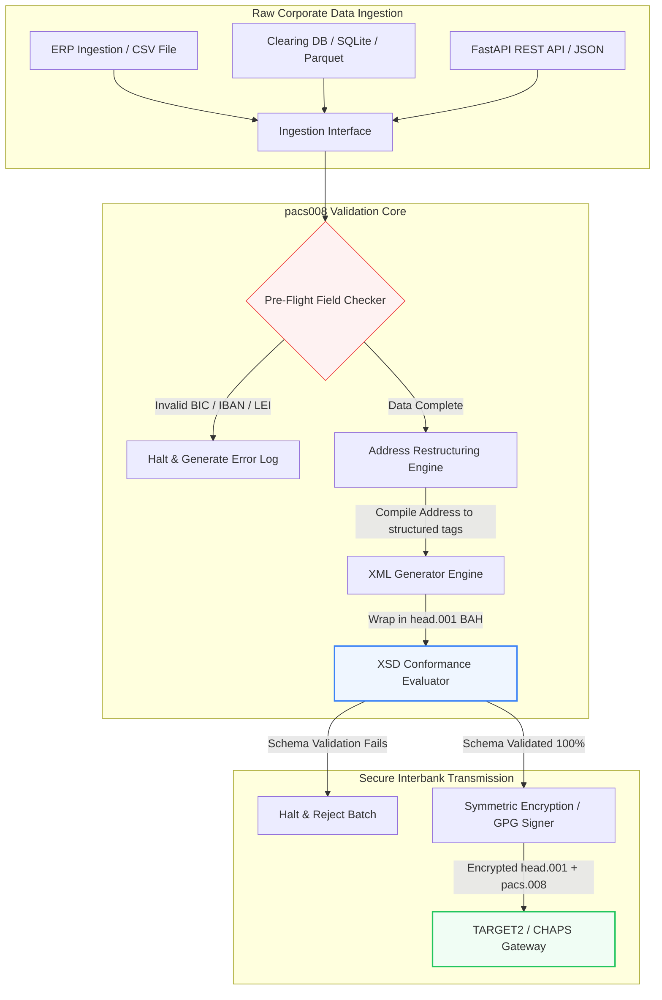

---

# Front Matter (YAML)

author: "contact@sebastienrousseau.com (Sebastien Rousseau)"
banner_alt: "Empleyado sa opisina na may voice assistant at laptop — sumisimbolo sa istrukturado at machine-readable na interbank payment messages na ginagawang programmable ng pacs.008 automation"
banner_height: "1597"
banner_width: "2584"
banner: "https://cloudcdn.pro/stocks/images/tyler-prahm-lmV3gJSAgbo.webp"
cdn: "https://cloudcdn.pro"
charset: "UTF-8"
cname: "sebastienrousseau.com"
copyright: "© Copyright 2025 - 2026 - Sebastien Rousseau. All rights reserved."
date: "Hunyo 15, 2026"
description: "Open-source na Python library ang Pacs008 na nag-aautomate sa pagbuo at validation ng ISO 20022 pacs.008 FI-to-FI customer credit transfer — structured address, BAH head.001 wrapping, BIC/LEI/IBAN checksum, OpenTelemetry UETR tracing — handa para sa SWIFT cutover sa Nobyembre 2026."
format-detection: "telephone=no"
hreflang: "fil"
icon: "https://cloudcdn.pro/clients/sebastienrousseau/v1/logos/sebastienrousseau.svg"
id: "https://sebastienrousseau.com/2026-06-15-pacs008-automation-iso-20022-interbank-payments-2026"
image_alt: "Black and White Portrait of Sebastien Rousseau"
image_height: "162"
image_width: "162"
image: "https://cloudcdn.pro/stocks/images/sebastienrousseau.webp"
keywords: "pacs008, ISO 20022 pacs.008, FI to FI customer credit transfer, structured address, SWIFT CBPR+, BAH head.001, TARGET2, CHAPS, Fedwire, DORA, BCBS 239, Basel III, UETR, LEI validation, SEPA VoP"
language: "fil-PH"
last_reviewed: "2026-06-15"
layout: "report"
locale: "fil_PH"
logo_alt: "Logo for Sebastien Rousseau"
logo_height: "44"
logo_width: "44"
logo: "https://cloudcdn.pro/clients/sebastienrousseau/v1/logos/sebastienrousseau.svg"
menu: ""
measurementID: "G-169G4ET5HQ"
name: "Sebastien Rousseau"
permalink: "https://sebastienrousseau.com/2026-06-15-pacs008-automation-iso-20022-interbank-payments-2026"
rating: "general"
referrer: "no-referrer"
robots: "index, follow"
schema: "FAQPage, Article"
seo_title: "pacs.008 Automation para sa Panahon ng ISO 20022"
short_name: "sebastienrousseau"
subtitle: "Sa pacs.008 message nagtatagpo ang interbank payment data, structured address, compliance, routing, at settlement operations."
tags: "pacs008, ISO 20022, interbank payments, wholesale payments, Python"
theme-color: "0, 83, 191"
title: "Pagbuo ng pacs.008 Automation para sa ISO 20022 Interbank Era sa 2026"
url: "https://sebastienrousseau.com/2026-06-15-pacs008-automation-iso-20022-interbank-payments-2026"
viewport: "width=device-width, initial-scale=1, shrink-to-fit=no"

# RSS - The RSS feed front matter (YAML).
atom_link: "https://sebastienrousseau.com/2026-06-15-pacs008-automation-iso-20022-interbank-payments-2026/rss.xml"
category: "Finance"
docs: https://validator.w3.org/feed/docs/rss2.html
generator: "Static Site Generator (SSG) (version 0.0.26)"
item_description: "Naghahatid ang pacs008 ng open-source na pundasyon sa Python para sa pag-automate ng ISO 20022 FI-to-FI customer credit transfer messages sa panahon ng interbank payments."
item_guid: "https://sebastienrousseau.com/2026-06-15-pacs008-automation-iso-20022-interbank-payments-2026/rss.xml"
item_link: "https://sebastienrousseau.com/2026-06-15-pacs008-automation-iso-20022-interbank-payments-2026/rss.xml"
item_pub_date: "Mon, 15 Jun 2026 06:06:06 +0000"
item_title: "Pagbuo ng pacs.008 Automation para sa ISO 20022 Interbank Era sa 2026"
last_build_date: "Mon, 15 Jun 2026 06:06:06 +0000"
managing_editor: "contact@sebastienrousseau.com (Sebastien Rousseau)"
pub_date: "Mon, 15 Jun 2026 06:06:06 +0000"
ttl: "60"
type: "article"
webmaster: "contact@sebastienrousseau.com"

# Apple - The Apple front matter (YAML).
apple_mobile_web_app_orientations: "portrait"
apple_touch_icon_sizes: "192x192"
apple-mobile-web-app-capable: "yes"
apple-mobile-web-app-status-bar-inset: "black"
apple-mobile-web-app-status-bar-style: "black-translucent"
apple-mobile-web-app-title: "pacs.008 Automation para sa ISO 20022"
apple-touch-fullscreen: "yes"

# MS Application - The MS Application front matter (YAML).

msapplication-navbutton-color: "0, 83, 191"

# Twitter Card - The Twitter Card front matter (YAML).

twitter_card: "summary_large_image"
twitter_creator: "@wwdseb"
twitter_description: "Naghahatid ang pacs008 ng open-source na pundasyon sa Python para sa pag-automate ng ISO 20022 FI-to-FI customer credit transfer messages sa panahon ng interbank payments."
twitter_image: "https://cloudcdn.pro/clients/sebastienrousseau/v1/logos/sebastienrousseau.svg"
twitter_image_alt: "Logo of Sebastien Rousseau"
twitter_site: "@wwdseb"
twitter_title: "pacs.008 Automation para sa Panahon ng ISO 20022"
twitter_url: "https://sebastienrousseau.com/2026-06-15-pacs008-automation-iso-20022-interbank-payments-2026"

excerpt: "Ang pacs008 ay open-source na Python toolkit na nagpapa-programmable sa ISO 20022 FI-to-FI customer credit transfer messages — structured address, validation, routing, compliance hooks, at ang SWIFT November 2026 deadline na nakabake bilang default."

# Humans.txt - The Humans.txt front matter (YAML).
author_website: "https://sebastienrousseau.com"
author_twitter: "@wwdseb"
author_location: "London, UK"
thanks: "Salamat sa pagbabasa!"
site_last_updated: "2026-06-15"
site_standards: "HTML5, CSS3, RSS, Atom, JSON, XML, YAML, Markdown, TOML"
site_components: "Kaishi, Kaishi Builder, Kaishi CLI, Kaishi Templates, Kaishi Themes"
site_software: "Static Site Generator, Rust"

---

# Pag-automate ng ISO 20022 pacs.008 Interbank Payments gamit ang Open-Source Python sa 2026

<!-- lead-start -->
<aside class="post-lead" aria-label="Buod ng artikulo">

<strong>TL;DR.</strong> Sa ilalim ng SWIFT CBPR+ guidelines, ide-decommission ng Structured Address Cliff sa Nobyembre 14, 2026 ang unstructured postal addresses sa TARGET2, CHAPS, Fedwire, Lynx, at SEPA. Ang Pacs008 ay isang open-source na Python library na nag-aautomate sa pagbuo at validation ng ISO 20022 FI-to-FI customer credit transfer (pacs.008) messages, binabalot ang mga bayad sa Business Application Headers (BAH head.001), at isinasanib ang structured address compliance sa data path bago man lang madampian ng mensahe ang clearing network.

<strong>Mga pangunahing punto</strong>

<ul class="post-lead-takeaways">
  <li><strong>Absoluto ang Structured Address Deadline.</strong> Pagkatapos ng Nobyembre 14, 2026, retirado na ang unstructured address blocks. Ipinapatupad ng Pacs008 ang structured postal address elements (<code>&lt;TwnNm&gt;</code>, <code>&lt;Ctry&gt;</code>, <code>&lt;PstCd&gt;</code>) sa data compilation upang maiwasan ang border rejections.</li>
  <li><strong>Pinag-isang orkestrasyon ng mensahe.</strong> Binabalot ang core pacs.008 payment payload sa isang compliant Business Application Header (head.001) envelope, na nagbibigay ng standard na round-trip processing model.</li>
  <li><strong>Algorithmic na integridad.</strong> Built-in na validators para sa BIC at Legal Entity Identifiers (LEIs) gamit ang ISO 7064 Modulo 97-10 checksum calculations.</li>
  <li><strong>Traceability na DORA-grade.</strong> Buong OpenTelemetry instrumentation na naka-key sa Unique End-to-End Transaction Reference (UETR) para sa real-time audit logs at cryptographic audit signatures.</li>
  <li><strong>Proteksyon ng fiduciary sa antas ng board.</strong> Iniaalinsunod ang katumpakan ng interbank message sa DORA Article 5, BCBS 239 reporting, at Basel III Operational Risk capital savings.</li>
</ul>

<strong>Karagdagang babasahin:</strong> <a href="https://sebastienrousseau.com/2026-05-19-global-wholesale-payments-economics-2026">Global Wholesale Payments sa 2026: ISO 20022, RTGS Renewal, at ang Ekonomiya ng Interoperability</a>, <a href="https://sebastienrousseau.com/2026-05-27-ai-operating-system-payments-fraud-routing-resilience-compliance-2026">Ang AI bilang Operating System ng Payments: Fraud, Routing, Resilience, at Compliance sa 2026</a>, <a href="https://sebastienrousseau.com/2026-05-12-iso-20022-pacs008-structured-address-deadline">Ang Nobyembre 2026 pacs.008 Structured-Address Deadline: Isang Anim na Buwang Pananaw</a>.

</aside>
<!-- lead-end -->

Pagbubuklod sa puwang sa pagitan ng legacy financial data at structured interbank messaging sa pamamagitan ng auditable at schema-validated na Python pipeline.

Ang open-source na sangguniang punto sa artikulong ito ay [pacs008 ⧉](https://github.com/sebastienrousseau/pacs008 "pacs008 — open-source Python library"). Itinatakda ang repository bilang Python library para sa pag-automate ng ISO 20022 pacs.008 FI-to-FI customer credit transfer XML messages.

## Bakit Mahalaga ang Open-Source na Proyektong Ito sa 2026

Sumasailalim ang global interbank payment clearing infrastructure sa pinakamalalim nitong modernisasyon sa loob ng halos kalahating siglo.

Sa Hunyo 2026, mabilis nang papalapit ang sektor ng financial services sa **SWIFT Structured Address Cliff sa Nobyembre 14, 2026**. Mula sa petsang ito, opisyal nang ide-decommission ng SWIFT CBPR+ guidelines, kasama ang TARGET2, CHAPS, Fedwire, at Canadian Lynx, ang unstructured postal address lines (na gumagamit lamang ng `<AdrLine>` sa loob ng `<PstlAdr>` blocks). Lahat ng kalahok na financial institutions ay dapat magpadala ng mga address sa hybrid format (structured `<TwnNm>` at `<Ctry>`, na may maximum na dalawang `<AdrLine>` elements para sa natitirang detalye) o sa fully structured format (indibidwal na elements para sa street name, building number, at postal code). Ang bawat mensaheng hindi tumutupad sa criterion na ito ay ire-reject sa network border.

Para sa financial institutions, lumilikha ang transisyong ito ng mga pangunahing operational constraint:

1. **Ang border-rejection penalty.** Magdurusa ng agarang network rejections ang mga bayad na hindi nakakatugon sa structured-address criteria, na magbubunsod ng mga pagkaantala sa transaksyon, liquidity blockages, at operational backlogs.
2. **SEPA Verification of Payee (VoP).** Inuutos sa lahat ng Payment Service Providers (PSPs) sa loob ng SEPA zone na i-verify ang tugma ng pangalan ng beneficiary at IBAN bago isagawa ang mga credit transfer, na nagdadagdag ng isa pang validation gate sa pagsisimula ng mensahe.

Nilulutas ng [Pacs008](https://github.com/sebastienrousseau/pacs008) ang problemang ito. Ito ay isang open-source at magaang Python library na nag-aautomate sa conversion ng raw financial data patungo sa fully validated at schema-compliant na ISO 20022 pacs.008 interbank customer credit transfer messages. Sa pamamagitan ng pagbubuklod sa legacy-to-structured data gap, naghahatid ang pacs008 ng mataas na Return on Resilience (RoR), na pinananatili ang working capital at sinisiguro ang real-time execution sa lahat ng global rails.

## Ang Architecture Lens ng pacs008 sa 2026

Binuo ang pacs008 library bilang isang insulated validation at generation engine, na tinitiyak na ang raw inputs ay sistematikong pinapro-proseso, pinapayaman, at binabalot sa mga standard envelope:

| Layer | Desisyon sa Disenyo | Bakit Ito Mahalaga | Panganib Kapag Hindi Mahusay na Hinandaan |
|---|---|---|---|
| **Input Layer** | Ingestion ng CSV, JSON, SQLite, at Parquet | Hinaharap ang banking integration teams kung saan na nakatira ang data nila, na pumipigil sa platform migrations. | Ingestion ng raw, hindi validated, o sirang data payloads. |
| **Validation Layer** | Pre-flight validation laban sa opisyal na XSD schemas at custom business rules | Pinipigilan ang execution at tina-tag ang mga error bago maipadala ang payment file sa clearing network. | Invalid XML files na nagdudulot ng agarang network rejects at clearing delays. |
| **BAH Envelope Layer** | Awtomatikong Business Application Header (head.001) wrapping | Sina-standardise ang pag-despatch at routing ng mensahe batay sa `<MsgDefIdr>` tag. | Pagpapadala ng raw pacs.008 payloads na walang kinakailangang outer envelope, na nagdudulot ng system rejection. |
| **Serialization Layer** | Standard XML at ISO-compliant JSON (TS 23029) support | Nagbibigay-daan sa direktang pagsasalin sa pagitan ng XML at JSON payloads, na sumusuporta sa modernong REST API at Kafka streaming. | Pira-pirasong data representations na lumalabag sa opisyal na ISO guidelines. |
| **Observability Layer** | OpenTelemetry tracing na naka-key sa UETR | Nakukuha ang detalyadong execution paths at logs, na nagbibigay ng real-time auditability. | Mga puwang sa tracing na humaharang sa operational visibility at auditing. |

## Mga Pangunahing Interbank Signal at Regulatory Milestones

Upang ipakita ang transactional operational resilience, dapat subaybayan ng senior technology at risk managers ang mga tiyak at masusukat na compliance indicators:

| Senyas | Metric / Operational Benchmark | Sanggunian sa G20 / SWIFT / DORA | Implementasyon sa Technical Platform |
|---|---|---|---|
| **Structured Address Compliance** | % ng pacs.008 messages na gumagamit ng fully structured na `<PstlAdr>` fields na may itinakdang `<TwnNm>` at `<Ctry>`. | SWIFT SR 2026 Deadline | Pre-flight schema checks sa pacs008 na nagre-reject sa unstructured address lines. |
| **SEPA Verification of Payee** | Validation ng tugma sa pagitan ng pangalan ng beneficiary at IBAN bago isagawa ang mensahe. | SEPA VoP Regulation | Built-in na VoP helper classes na nagsasagawa ng pre-validation queries sa IBAN/BIC. |
| **BAH head.001 Integration** | Porsyento ng papalabas na payment payloads na matagumpay na binalot sa Business Application Headers. | TARGET2 / CBPR+ Guidelines | BAH wrapping subsystem na awtomatikong nag-iipon ng outer XML envelope. |
| **LEI Modulo Checksum** | ISO 7064 Modulo 97-10 check-digit validation sa debtor at creditor `<LEI>` blocks. | Mandato ng Bank of England | Algorithmic checker na nag-vverify sa integridad ng 20-character identifier. |
| **UETR Tracking Accuracy** | 100% ng nabuo na mga bayad na inilagyan ng valid na Unique End-to-End Transaction Reference. | SWIFT UETR Specifications | Awtomatikong pagbuo at tracing ng 36-character UUIDv4 reference code. |

## Bakit Python ang Tamang On-Ramp para sa Interbank Automation

Ang modernong payment hubs at treasury operations teams sa 2026 ay umaasa nang malaki sa Python para sa data transformation, financial modelling, at ERP database integration.

Sa paggamit ng open-source Python library, nakakamit ng mga institusyon ang makabuluhang bentahe:

1. **Mababang cognitive load at mataas na interoperability.** Kumikilos ang Python bilang isang magkakaugnay na tulay. Pinahihintulutan nito ang mga developer na sumulat ng simpleng scripts na kumukuha ng raw payment instructions mula sa legacy databases, i-validate ang mga ito laban sa kumplikadong international banking rules, at maglabas ng compliant XML sa loob ng isang nag-iisa at pinag-isang workflow.
2. **Pag-aalis ng "black-box" o opaque translators.** Madalas naniningil ng mataas na licensing fees ang mga proprietary banking portals para sa custom payment file translators. Ang mga translator na ito ay proprietary black box, na imposibleng ma-audit ng security teams kung paano pino-proseso ang data o kung saan iniimbak ang mga key. Tinitiyak ng inspectable at open-source na library tulad ng pacs008 ang kumpletong transparency sa code.
3. **Tuluyang integrasyon sa CI/CD.** Direktang sumasanib ang pacs008 sa continuous integration at deployment pipelines, na nagpapahintulot sa mga developer na i-automate ang payment file testing bilang bahagi ng karaniwan nilang software delivery lifecycle.

## Pagdidisenyo ng Bounded Interbank Pipeline

Isang malaking kahinaan sa interbank clearing ang "uncontrolled batch generation" — pagbuo ng mga file nang walang malinaw at bounded verification loop. Idinisenyo ang pacs008 upang gumana bilang core validation engine sa loob ng mahigpit na kinokontrol at multi-stage transaction pipeline.

Ipinapakita ng operational flow sa ibaba kung paano dumadaan ang raw transactional data sa pacs008 pipeline upang makabuo ng cryptographically secure at schema-compliant na pacs.008 file na nakabalot sa BAH envelope:

## Ang Boardroom Playbook at Fiduciary Liability

Ang interbank payment automation ay isang board-level risk-management at corporate-governance na isyu. Dapat tugunan ng senior managers ang kalidad ng transaction data sa pamamagitan ng lente ng fiduciary responsibility at operational risk reduction:

- **DORA Article 5 (Board Accountability).** Naglalagay ng direkta at personal na liability sa mga miyembro ng board para sa resilience at security ng ICT operations ng institusyon. Dahil ang interbank clearing ay isang kritikal na corporate function, dapat patunayan ng mga board na ipinatupad nila ang matibay, validated, at automated na transactional controls upang maiwasan ang operational disruptions o naantalang bayad.
- **BCBS 239 (Risk Data Aggregation and Reporting).** Hinihingi na ang financial transaction reporting ay tumpak, kumpleto, at nabuo sa real time. Tinutulungan ng pacs008 ang mga institusyon na makamit ang BCBS 239 compliance sa pamamagitan ng pagtiyak na ang payment data ay malinis na nakaayos at validated sa pinagmulan, na inaalis ang mga puwang sa data at mga error sa manwal na reconciliation na nagpapahirap sa legacy spreadsheets.
- **Pagpigil sa Operational Risk Capital Charges (Basel III).** Sa ilalim ng Basel III guidelines, pinapataas ng matataas na payment error rates at manwal na intervention overhead ang operational risk capital requirements ng bangko, na nagtatali ng kapital na kung hindi ay maaaring gamitin sa pagpapautang o pamumuhunan. Direktang pinapababa ng pag-automate ng payment pipeline ang capital premiums na ito, na pinananatili ang halaga sa balance-sheet.

## Ano ang Ibig Sabihin Nito Ayon sa Uri ng Bangko

### Global Systemically Important Banks (G-SIBs)

Namamahala ang mga G-SIB ng napakalaki at cross-border na corporate transaction volumes. Ang kanilang pangunahing hamon ay ang remediation ng unstructured legacy data bago ito makarating sa clearing network. Sa pamamagitan ng pagsasanib ng pacs008 sa kanilang corporate banking gateways, maaaring magbigay ang mga G-SIB ng automated validation utilities sa kanilang corporate clients, na nagpapababa sa overhead ng manwal na payment repairs at sumisiguro sa real-time execution sa buong SWIFT network.

### Transaction at Corporate Banks

Para sa transaction banks, ang kalidad ng payment data ay isang competitive differentiator. Sa pamamagitan ng pag-aalok ng open-source at inspectable na validation tool tulad ng pacs008 sa corporate treasury clients, mapapabilis ng mga bangkong ito ang onboarding, mababawasan ang payment file rejections, at mababalangkas ang tiwala ng customer sa pamamagitan ng nakahihigit na straight-through processing rates.

### Mga Regional at Mas Maliit na Bangko

Dapat panatilihin ng mga regional bank ang compliance sa international payment standards nang walang malalaking technology budget ng mga G-SIB. Naghahatid ang pacs008 ng magaan, cost-effective, at fully compliant na Python-based na solusyon, na nagbibigay-daan sa mas maliliit na institusyon na mag-alok ng moderno at structured na payment initiation capabilities nang walang mamahaling proprietary middleware licences.

## Konklusyon: Ang Roadmap sa Interbank Clearing

Ang paparating na SWIFT structured-address deadline sa Nobyembre 2026 ay kumakatawan sa isang matigas na hangganan para sa corporate treasury operations. Ang pag-asa sa legacy spreadsheets, manwal na data entry, at unstructured payment files ay isang aktibong business risk.

Upang siguraduhin ang pagpapatuloy ng transaksyon at mabawasan ang operational overhead, dapat isagawa ng senior technology at finance managers ang isang malinaw na clearing roadmap ngayon:

1. **Ipatupad ang validation sa pinagmulan.** I-mandato na ang lahat ng payment instructions ay validated at na-format ayon sa opisyal na ISO 20022 XSD schemas bago lumabas sa hangganan ng corporate ERP.
2. **I-audit ang data pipeline.** Lumayo mula sa manwal na spreadsheet processing at ipatupad ang automated at inspectable na Python-based workflows gamit ang pacs008.
3. **Ipatupad ang hybrid security.** Tiyaking ang nabuong payment files ay cryptographically signed at encrypted bago ipadala, na tumutupad sa zero-trust network expectations.
4. **Iayon sa fiduciary priorities.** Pormal na iulat ang payment automation at data quality metrics sa board, na binabalangkas ang investment bilang isang kritikal na operational risk reduction programme sa ilalim ng DORA.

## Mga Madalas Itanong

**Sumusunod ba ang pacs008 sa paparating na SWIFT SR 2026 address rules?**

Oo. Idinisenyo ang pacs008 upang suportahan ang mahigpit na SWIFT structured address milestone sa Nobyembre 2026, na nagpapatupad ng obligadong paghihiwalay ng postal address elements (town, country, postcode) sa mga itinakdang ISO 20022 XML fields.

**Maaari bang balutin ng pacs008 ang payment payloads sa Business Application Headers?**

Oo. Dahil natively na sinusuportahan ng pacs008 ang Business Application Header (BAH head.001) wrapping, awtomatiko nitong inihahanda ang outer envelope na kailangan ng TARGET2, CHAPS, at CBPR+ networks.

**Bakit mas mainam ang open-source library kaysa sa proprietary file translators?**

Ang proprietary translators ay opaque black box, na ginagawang imposible ang security audits. Naghahatid ang open-source at peer-reviewed na library tulad ng pacs008 ng kumpletong transparency sa code, na nagpapahintulot sa security teams na patunayan na walang sensitibong payment data na nailalantad sa panahon ng processing.

**Anong identifiers ang vina-validate ng pacs008?**

Mayroong built-in na validators ang pacs008 para sa Bank Identifier Codes (BICs) at Legal Entity Identifiers (LEIs) gamit ang ISO 7064 Modulo 97-10 checksum calculations, kasama ang IBAN check-digit validation at UETR uniqueness checks.

## Mga Sanggunian

- SWIFT, (2024). *ISO 20022 November 2026 Structured Address Milestone*. La Hulpe: SWIFT. Available at: [SWIFT ISO 20022 Milestone ⧉](https://www.swift.com/standards/iso-20022/iso-20022-bytes/call-action-november-2026 "SWIFT ISO 20022 milestone").
- Basel Committee on Banking Supervision (BCBS), (2013). *Principles for effective risk data aggregation and risk reporting (BCBS 239)*. Basel: Bank for International Settlements. Available at: [BCBS 239 Principles ⧉](https://www.bis.org/publ/bcbs239.htm "BCBS 239 principles").
- European Parliament and Council of the European Union, (2022). *Regulation (EU) 2022/2554 on digital operational resilience for the financial sector (DORA)*. Brussels: Official Journal of the European Union. Available at: [DORA Regulation ⧉](https://eur-lex.europa.eu/legal-content/EN/TXT/?uri=CELEX%3A32022R2554 "DORA regulation").
- GitHub, (2026). *pacs008 open-source repository*. Available at: [pacs008 Repository ⧉](https://github.com/sebastienrousseau/pacs008 "pacs008 repository").

<!-- enrich-start -->
<aside class="author-card" aria-label="Tungkol sa may-akda"><strong class="author-card-name"><a href="/about/index.html">Sebastien Rousseau</a></strong>Senior na banking technologist na sumusulat tungkol sa applied AI, ISO 20022 migration, post-quantum cryptography para sa financial services, at ang istrukturang pagbabago ng wholesale payments.Mahigit 20 taon sa HSBC Commercial &amp; Investment Bank, PayPal, Barclays, Shazam, AKQA, Virgin Group. <a href="/about/index.html">Buong profile</a> &middot; <a href="https://www.linkedin.com/in/sebastienrousseau/" rel="external noopener">LinkedIn</a> &middot; <a href="https://github.com/sebastienrousseau" rel="external noopener">GitHub</a></aside>

Huling sinuri <time datetime="2026-06-15">2026-06-15</time>.

<aside class="related-posts" aria-labelledby="related-heading">
<h2 id="related-heading" class="related-heading">Karagdagang babasahin</h2>

<article class="related-card"><footer class="related-body"><h3><a href="https://sebastienrousseau.com/2026-05-19-global-wholesale-payments-economics-2026">Global Wholesale Payments sa 2026: ISO 20022, RTGS Renewal, at ang Ekonomiya ng Interoperability</a></h3>
<time datetime="2026-05-19">2026-05-19</time>
</footer></article>
<article class="related-card"><footer class="related-body"><h3><a href="https://sebastienrousseau.com/2026-05-27-ai-operating-system-payments-fraud-routing-resilience-compliance-2026">Ang AI bilang Operating System ng Payments: Fraud, Routing, Resilience, at Compliance sa 2026</a></h3>
<time datetime="2026-05-27">2026-05-27</time>
</footer></article>
<article class="related-card"><footer class="related-body"><h3><a href="https://sebastienrousseau.com/2026-05-12-iso-20022-pacs008-structured-address-deadline">Ang Nobyembre 2026 pacs.008 Structured-Address Deadline: Isang Anim na Buwang Pananaw</a></h3>
<time datetime="2026-05-12">2026-05-12</time>
</footer></article>

</aside>
<!-- enrich-end -->
