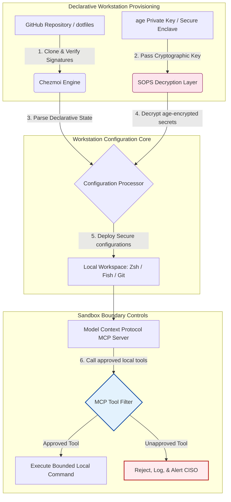

---

# Front Matter (YAML)

author: "contact@sebastienrousseau.com (Sebastien Rousseau)"
banner_alt: "Developer workstation sa malabong ilaw — sumisimbolo sa AI-aware, reproducible, at ligtas na dotfiles para sa MCP servers, SLSA signing, mga sikretong age/SOPS, at multi-shell parity"
banner_height: "1597"
banner_width: "2584"
banner: "https://cloudcdn.pro/stocks/images/almas-salakhov-Vq2ap8aFFEs.webp"
cdn: "https://cloudcdn.pro"
charset: "UTF-8"
cname: "sebastienrousseau.com"
copyright: "© Copyright 2025 - 2026 - Sebastien Rousseau. All rights reserved."
date: "Hunyo 16, 2026"
description: "Ang AI-aware dotfiles ay isang ligtas, reproducible na pattern ng workstation para sa MCP era — declarative na configuration sa pamamagitan ng Chezmoi, SOPS/age na mga sikreto, SLSA Level 3 provenance, multi-shell parity, at bounded sandbox boundaries para sa mga lokal na AI agent."
format-detection: "telephone=no"
hreflang: "fil"
icon: "https://cloudcdn.pro/clients/sebastienrousseau/v1/logos/sebastienrousseau.svg"
id: "https://sebastienrousseau.com/2026-06-16-ai-aware-dotfiles-secure-reproducible-workstation-2026"
image_alt: "Black and White Portrait of Sebastien Rousseau"
image_height: "162"
image_width: "162"
image: "https://cloudcdn.pro/stocks/images/sebastien-rousseau.png"
keywords: "dotfiles, Chezmoi, MCP, Model Context Protocol, SLSA, SOPS, age encryption, declarative configuration, developer workstation, DORA Article 5, NIST CSF 2.0, supply chain security, agentic AI, multi-shell parity, Zsh, Fish, Nushell"
language: "fil-PH"
last_reviewed: "2026-06-16"
layout: "report"
locale: "fil_PH"
logo_alt: "Logo for Sebastien Rousseau"
logo_height: "44"
logo_width: "44"
logo: "https://cloudcdn.pro/clients/sebastienrousseau/v1/logos/sebastienrousseau.svg"
menu: ""
measurementID: "G-169G4ET5HQ"
name: "Sebastien Rousseau"
permalink: "https://sebastienrousseau.com/2026-06-16-ai-aware-dotfiles-secure-reproducible-workstation-2026"
rating: "general"
referrer: "no-referrer"
robots: "index, follow"
schema: "FAQPage, Article"
seo_title: "AI-Aware Dotfiles para sa Ligtas na Developer Workstation"
short_name: "sebastienrousseau"
subtitle: "Bahagi na ng AI supply chain ang developer workstation; kailangan ng dotfiles ang seguridad, reproducibility, kalinisan ng mga sikreto, at MCP-aware na mga workflow."
tags: "dotfiles, developer tools, MCP, SLSA, ligtas na workstation, chezmoi, macOS, Linux, WSL"
theme-color: "0, 83, 191"
title: "AI-Aware Dotfiles sa 2026: Pagbuo ng Ligtas at Reproducible na Developer Workstation para sa MCP, SLSA, at Multi-Shell Parity"
url: "https://sebastienrousseau.com/2026-06-16-ai-aware-dotfiles-secure-reproducible-workstation-2026"
viewport: "width=device-width, initial-scale=1, shrink-to-fit=no"

# RSS - The RSS feed front matter (YAML).
atom_link: "https://sebastienrousseau.com/2026-06-16-ai-aware-dotfiles-secure-reproducible-workstation-2026/rss.xml"
category: "Technology"
docs: https://validator.w3.org/feed/docs/rss2.html
generator: "Static Site Generator (SSG) (version 0.0.26)"
item_description: "Pagtingin sa declarative na dotfiles para sa ligtas at reproducible na developer workstation sa macOS, Linux, at WSL, na may MCP awareness, SLSA, age, SOPS, at multi-shell parity."
item_guid: "https://sebastienrousseau.com/2026-06-16-ai-aware-dotfiles-secure-reproducible-workstation-2026/rss.xml"
item_link: "https://sebastienrousseau.com/2026-06-16-ai-aware-dotfiles-secure-reproducible-workstation-2026/rss.xml"
item_pub_date: "Tue, 16 Jun 2026 06:06:06 +0000"
item_title: "AI-Aware Dotfiles sa 2026: Pagbuo ng Ligtas at Reproducible na Developer Workstation para sa MCP, SLSA, at Multi-Shell Parity"
last_build_date: "Tue, 16 Jun 2026 06:06:06 +0000"
managing_editor: "contact@sebastienrousseau.com (Sebastien Rousseau)"
pub_date: "Tue, 16 Jun 2026 06:06:06 +0000"
ttl: "60"
type: "article"
webmaster: "contact@sebastienrousseau.com"

# Apple - The Apple front matter (YAML).
apple_mobile_web_app_orientations: "portrait"
apple_touch_icon_sizes: "192x192"
apple-mobile-web-app-capable: "yes"
apple-mobile-web-app-status-bar-inset: "black"
apple-mobile-web-app-status-bar-style: "black-translucent"
apple-mobile-web-app-title: "AI-Aware Dotfiles para sa Ligtas na Developer Workstation"
apple-touch-fullscreen: "yes"

# MS Application - The MS Application front matter (YAML).

msapplication-navbutton-color: "0, 83, 191"

# Twitter Card - The Twitter Card front matter (YAML).

twitter_card: "summary_large_image"
twitter_creator: "@wwdseb"
twitter_description: "Pagtingin sa declarative na dotfiles para sa ligtas at reproducible na developer workstation sa macOS, Linux, at WSL, na may MCP awareness, SLSA, age, SOPS, at multi-shell parity."
twitter_image: "https://cloudcdn.pro/clients/sebastienrousseau/v1/logos/sebastienrousseau.svg"
twitter_image_alt: "Logo of Sebastien Rousseau"
twitter_site: "@wwdseb"
twitter_title: "AI-Aware Dotfiles para sa Ligtas na Developer Workstation"
twitter_url: "https://sebastienrousseau.com/2026-06-16-ai-aware-dotfiles-secure-reproducible-workstation-2026"

excerpt: "Itinuturing ng AI-aware dotfiles sa 2026 ang developer workstation bilang supply-chain infrastructure — declarative na chezmoi-managed na configuration na may MCP awareness, SLSA-signed na mga release, age/SOPS na mga sikreto, sub-second na startup, at macOS/Linux/WSL parity."

# Humans.txt - The Humans.txt front matter (YAML).
author_website: "https://sebastienrousseau.com"
author_twitter: "@wwdseb"
author_location: "London, UK"
thanks: "Salamat sa pagbabasa!"
site_last_updated: "2026-06-16"
site_standards: "HTML5, CSS3, RSS, Atom, JSON, XML, YAML, Markdown, TOML"
site_components: "Kaishi, Kaishi Builder, Kaishi CLI, Kaishi Templates, Kaishi Themes"
site_software: "Static Site Generator, Rust"

---

# AI-Aware Dotfiles sa 2026: Pagbuo ng Ligtas at Reproducible na Developer Workstation para sa MCP, SLSA, at Multi-Shell Parity

<!-- lead-start -->
<aside class="post-lead" aria-label="Buod ng artikulo">

<strong>TL;DR.</strong> Hindi na lamang endpoint ang developer workstation; aktibong kalahok na ito sa software supply chain at direktang interface para sa lokal na AI control plane. Direktang nag-eehekyusyon ng mga lokal na shell command, sumusuri ng mga repository, at nagbabasa ng mga sensitibong configuration file ang terminal-based na mga AI assistant at <a href="https://modelcontextprotocol.io">Model Context Protocol (MCP)</a> servers. Ang <a href="https://github.com/sebastienrousseau/dotfiles">Sebastien Rousseau's Dotfiles</a> ay isang declarative, open-source na framework na bumubuo ng ligtas at reproducible na mga workstation sa macOS, Linux, at Windows Subsystem for Linux (WSL) — pinagsasama ang <a href="https://www.chezmoi.io/">Chezmoi</a>, <a href="https://github.com/getsops/sops">SOPS, age</a>, at SLSA Level 3 build provenance para sa memory-safe na paghihiwalay ng mga sikreto at bounded execution pathways para sa mga lokal na AI model.

<strong>Mga pangunahing punto</strong>

<ul class="post-lead-takeaways">
  <li><strong>Supply-chain infrastructure ang mga workstation.</strong> Dapat tratuhin ang mga configuration ng developer environment na may parehong declarative na higpit gaya ng deployment ng production server, na inaalis ang manu-manong configuration drift.</li>
  <li><strong>Ang hamon ng AI control plane.</strong> May access sa mga lokal na directory ang terminal-based na mga AI model at MCP tool. Dapat ipatupad ng dotfiles ang bounded sandbox boundaries, mahigpit na listahan ng pahintulot sa tool, at hindi mababagong lokal na log upang maiwasan ang pagtagas ng data.</li>
  <li><strong>Ganap na cross-platform parity.</strong> Magkapareho at sub-second na shell performance at security profile sa macOS, Linux (Zsh, Fish, Nushell), at WSL, binabawasan ang oras ng onboarding ng developer mula linggo tungo sa minuto.</li>
  <li><strong>Cryptographically secure na paghihiwalay ng mga sikreto.</strong> Pinipigilan ng SOPS at age file encryption ang hardcoded na kredensyal (GitHub token, cloud access key) na ma-commit sa Git o mabasa ng mga lokal na LLM.</li>
  <li><strong>Halaga sa antas ng board ng fiduciary.</strong> Isinasalin ang pagsunod sa configuration ng workstation tungo sa malinaw na mga priyoridad ng boardroom, sumusuporta sa DORA Article 5, mga endpoint standard ng NIST CSF 2.0, at pagbabawas ng Operational Risk sa ilalim ng Basel III.</li>
</ul>

<strong>Kaugnay na babasahin:</strong> <a href="https://sebastienrousseau.com/2026-05-23-agentic-payments-banking-consent-liability-new-payment-ux-2026">Agentic Payments in Banking: Consent, Liability, and the New Payment UX in 2026</a>, <a href="https://sebastienrousseau.com/2024-03-12-revolutionising-real-time-speech-recognition-on-macos-with-openai-whisper/index.html">Fast Real-Time Speech Recognition on macOS: OpenAI Whisper</a>, <a href="https://sebastienrousseau.com/2024-02-26-google-gemma-ai-transforming-open-source-ai-development/index.html">Google Gemma AI: Transforming Open-Source AI Development</a>.

</aside>
<!-- lead-end -->

Pinupunan ang puwang sa pagitan ng declarative na configuration ng workstation at ligtas na mga software supply chain sa panahon ng mga lokal na AI model at agentic na developer tool.

Ang open-source na reperensiya para sa artikulong ito ay [dotfiles ⧉](https://github.com/sebastienrousseau/dotfiles "dotfiles — declarative workstation configuration"). Ang repository ay itinatakda bilang: declarative na dotfiles para sa macOS, Linux, at WSL, na nag-aalok ng multi-shell parity, sub-second na startup, SLSA-signed na mga release, at AI/MCP-aware na configuration.

## Bakit Mahalaga ang Open-Source na Proyektong Ito sa 2026

Sa Hunyo 2026, ang developer workstation ang pinakamahinang link sa software supply chain at mataas na halagang target para sa mga sopistikadong state-sponsored at criminal cyber syndicate.

Radikal na nagbago ang security profile ng development environment sa pag-akyat ng terminal-based na mga AI coding assistant (gaya ng Claude Code) at pag-ampon sa Model Context Protocol (MCP). Naninirahan na ngayon sa lokal na mga developer terminal ang mga aktibo at autonomous na AI agent na may kakayahang:

- Magbasa at mag-edit ng mga lokal na source file.
- Tumawag sa mga lokal na CLI tool (`git`, `npm`, `aws`, `kubectl`).
- Suriin ang mga shell environment variable, lokal na database, at configuration setting.

Kung walang mahigpit na hangganan ang lokal na environment ng developer, maaaring hindi sinasadyang basahin ng mga autonomous na AI tool na ito ang sensitibong personal na data, pakawalan ang mga cloud credential sa mga public LLM API, o mag-execute ng mga malisyosong package sa mga awtomatikong build.

Sa ilalim ng Digital Operational Resilience Act (DORA) at NIST Cybersecurity Framework (CSF) 2.0, legal na inaatasan ang mga institusyong pinansyal na patunayan ang provenance at integridad ng seguridad ng bawat aparato na nag-aaccess sa software supply chain. Hindi na sumusunod ang "snowflake laptops" — manu-manong naka-configure, hindi nasuri, drifting na mga configuration — sa mga pandaigdigang pamantayan sa pagbabangko.

Niresolba ng [Sebastien Rousseau's Dotfiles](https://github.com/sebastienrousseau/dotfiles) ang problemang ito. Isa itong open-source at declarative na framework sa pamamahala ng workstation na nagtatag ng ligtas at reproducible na mga developer workstation. Sa pamamagitan ng pagpapatupad ng standardisado at auditable na configuration baseline, naghahatid ang proyekto ng mataas na Return on Resilience (RoR), pinababawas ang oras ng onboarding ng developer mula linggo tungo sa oras at pinoprotektahan ang mga sensitibong financial supply chain mula sa mga endpoint vulnerability.

## Ang Lente ng Arkitektura ng AI-Aware na Workstation 2026

Gumagana ang dotfiles framework bilang isang ligtas at declarative na manager ng environment — sistematikong pinamamahalaan, sinusuri, at hiwalay ang lahat ng lokal na shell, tool, at sikreto:

| Layer | Desisyon sa Disenyo | Bakit Ito Mahalaga | Panganib Kung Hindi Tama ang Paghawak |
|---|---|---|---|
| **Provisioning Layer** | Declarative na pamamahala ng configuration sa pamamagitan ng Chezmoi | Bumubuo ng ganap na reproducible na mga workstation sa macOS, Linux, at WSL, inaalis ang drift. | Snowflake na mga configuration na may hindi nasuri at mahihinang lokal na estado. |
| **Shell Layer** | Multi-shell parity (Zsh, Fish, Nushell) | Tinitiyak ang magkapareho at sub-second na startup at pare-parehong gawi ng alias sa magkakaibang environment. | Hindi pare-parehong shell command na nagdudulot ng hindi inaasahang resulta sa script. |
| **Secrets Layer** | File encryption gamit ang SOPS at age | Pinipigilan ang hardcoded na kredensyal at raw na key na ma-commit sa Git o malantad sa mga lokal na LLM. | Tumagas na mga kredensyal sa public na repository history o nakompromiso ng mga lokal na agent. |
| **AI/MCP Layer** | Mga kontrol sa hangganan ng Model Context Protocol | Pinaghihigpitan ang mga lokal na AI agent sa isang tiyak na listahan ng inaprubahang mga tool, ina-log ang lahat ng lokal na execution. | Hindi nakahangganang mga AI agent na nag-eehekyusyon ng runaway o mapaminsalang command sa lokal. |
| **Supply Chain Layer** | SLSA-signed na mga release at Sigstore verification | Cryptographically pinatutunayan ang pagiging authentic ng mga bootstrap script at configuration file. | Nakompromisong setup script na nag-iinject ng malisyosong backdoor sa developer environment. |

## Mga Pangunahing Hudyat sa Seguridad at Automation ng Workstation

Upang mapanatili ang absolutong seguridad sa buong development estate, dapat subaybayan ng mga Chief Information Security Officer (CISO) at technology manager ang mga tiyak at masusukat na operational indicator:

| Hudyat | Metric / Operational Benchmark | NIST CSF / DORA Reference | Technical Platform Implementation |
|---|---|---|---|
| **Reproducibility ng Workstation** | % ng mga developer laptop na ganap na pinamamahalaan sa pamamagitan ng declarative na dotfile repository nang walang configuration drift. | NIST CSF 2.0 (PR.DS-01) | Mga audit ng Chezmoi drift detection na awtomatikong isinasagawa sa terminal startup. |
| **Kalinisan ng Kredensyal** | Zero unencrypted na sikreto o key na nakaimbak sa plain text sa lokal na mga configuration file. | DORA Article 6 (ICT Security) | Git pre-commit hook at lokal na scan na tinatanggihan ang mga unencrypted na file. |
| **Build Provenance** | 100% ng mga utility sa workstation bootstrap na sinuri gamit ang cryptographically signed na mga manifest. | DORA Article 30 (Supply Chain) | Sigstore at SLSA Level 3 verification na nakapaloob sa setup pipeline. |
| **Oras ng Onboarding ng Developer** | Lumipas na oras mula sa raw hardware provision tungo sa ganap na naka-configure at sumusunod na development workspace. | Return on Resilience (RoR) | Awtomatiko at declarative na setup script na nag-iipon ng environment sa loob ng 15 minuto. |
| **Bounded Access ng AI Agent** | Pagpapatunay na gumagana ang mga lokal na AI tool sa loob ng tinukoy na mga limitasyon ng directory na may read-only na default. | Model Risk Management | Mga profile ng MCP configuration na nagpapahigpit sa katalogo ng tool ng agent sa mga inaprubahang operasyon. |

## Bakit Ang Declarative na Configuration ang Ubod ng Seguridad ng Workstation

Lubhang manu-mano ang mga tradisyonal na paraan ng setup ng developer workstation, na nagreresulta sa "snowflake laptops" — mga environment kung saan dumadausdos ang mga configuration sa paglipas ng panahon habang nag-iinstall ang mga developer ng mga custom na tool, naka-adjust ang mga variable, at binabago ang mga lokal na script. Lumilikha ang drift na ito ng ilang kritikal na vulnerability:

1. **Hindi nasusubaybayang shadow configuration.** Madalas na nagpapatakbo ang mga drifting na laptop ng mga lumang at mahinang software package o lokal na script na lumalampas sa corporate security tool.
2. **Pagtagas ng mga sikreto.** Madalas na hardcode ng mga developer ang mga API key, GitHub token, o AWS credential nang direkta sa plain-text na script o shell profile, na nagpapahinto sa kanila sa pagnanakaw.
3. **Hindi mahusay na onboarding.** Maaaring tumagal ng hanggang dalawang linggo ng oras ng engineering ang manu-manong pag-set up ng isang bagong developer workstation, na nakaka-apekto sa bilis ng koponan.

Sa paglilipat sa declarative at model-driven na configuration gamit ang Chezmoi, ang buong developer workspace ay nagiging version-controlled at reproducible na system of record. Bawat pagbabago, alias, package dependency, at security default ay dokumentado sa Git, validated laban sa mga patakaran sa pagsunod ng organisasyon, at cryptographically pinatutunayan bago ito i-apply sa pisikal na laptop.

## Pagdidisenyo ng Bounded na AI Developer Environment

Upang maiwasang magkaroon ng hindi nakahangganang access sa mga lokal na asset ang mga lokal na AI agent at MCP tool, dapat gumana ang workstation bilang isang bounded execution plane.

Ipinapakita ng operational flow sa ibaba kung paano kinokoordina ng dotfiles framework ang Chezmoi, SOPS, at age upang mag-decrypt at mag-deploy ng mga ligtas na dotfile habang pinananatili ang isang hiwalay at sandboxed na hangganan ng execution para sa mga lokal na AI agent na tumatawag sa MCP tool:

## Ang Boardroom Playbook at Fiduciary Liability

Kritikal na priyoridad ng boardroom ang seguridad ng developer workstation at integridad ng supply-chain. Dapat tugunan ng mga senior manager ang panganib sa developer environment sa pamamagitan ng lente ng fiduciary responsibility, regulatory compliance, at pangangalaga ng halaga ng negosyo:

- **DORA Article 5 (Pananagutan ng Board).** Inaatasan na ang management body (ang board) ang may ultimate responsibility sa pamamahala ng ICT risk ng institusyon. Dahil ang mga developer workstation ang gateway sa software supply chain, dapat patunayan ng mga direktor ng board na ang mga endpoint ay ligtas, ganap na auditable, at pinamamahalaan sa ilalim ng mahigpit at reproducible na configuration framework upang matugunan ang regulatory audit.
- **Pagsunod sa NIST CSF 2.0 (Endpoint Security).** Hinihingi na ang mga awtorisado at validated na aparato lamang, na nagpapatakbo ng standardized at ligtas na configuration, ang makaka-access sa corporate network at repository. Pinapayagan ng declarative na dotfiles ang mga security team na mathematically patunayan na ang lahat ng developer environment ay sumusunod sa security baseline ng organisasyon, inaalis ang panganib ng hindi nasuri na "snowflake" setup.
- **Pangangalaga ng Halaga ng Balance Sheet.** Maaaring magkaroon ang isang nakompromisong developer credential o supply-chain breach ng halagang milyun-milyong dolyar sa remediation, regulatory fine, at reputational damage. Direktang binabawasan ng paglipat sa ligtas at declarative na developer environment ang panganib na ito, pinangangalagaan ang halaga ng balance sheet at pinoprotektahan ang tiwala ng customer.

## Ano ang Ibig Sabihin Nito Ayon sa Uri ng Bangko

### Global Systemically Important Banks (G-SIBs)

Namamahala ang mga G-SIB ng libu-libong developer workstation sa maraming kontinente at regulatory jurisdiction. Ang kanilang pangunahing hamon ay pagpapanatili ng pagkakapareho ng configuration at pagpigil sa pagtagas ng credential sa napakalalaking engineering team. Sa pag-ampon ng declarative at open-source na modelo ng dotfiles gamit ang Chezmoi, maaaring i-standardize ng mga G-SIB ang endpoint security, awtomatikong pag-audit ng compliance, at bawasan ang oras ng onboarding ng developer mula linggo tungo sa minuto sa buong global na organisasyon.

### Mga Transaction at Corporate Bank

Pinapatakbo ng mga transaction bank ang mga sensitibong payment gateway at wholesale clearing infrastructure. Hindi pwedeng kompromisuhin na regulatory demand ang pagpapatunay sa ganap na integridad ng code na na-deploy sa mga production environment na ito. Sa pag-standardize ng mga developer workstation sa ilalim ng ligtas at SLSA-compliant na dotfiles framework, ginagarantiyahan na ganap na nasusuri at protektado ang software supply chain mula sa mga vulnerability ng lokal na developer endpoint.

### Mga Regional at Mas Maliliit na Bangko

Dapat panatilihin ng mga regional bank ang mataas na pamantayan ng cybersecurity nang walang malalaking security budget ng mga G-SIB. Nagbibigay ang open-source na dotfiles framework na ito ng magaan, cost-effective, at lubos na ligtas na Python at Rust-friendly na solusyon, na nagbibigay-daan sa mas maliliit na institusyon na ipatupad ang enterprise-grade na endpoint security at proteksyon sa supply-chain nang walang mamahaling proprietary software license.

## Konklusyon: Ang Roadmap ng Developer Workstation

Hindi na peripheral na aparato ang developer workstation; ito ay isang kritikal na control plane sa software supply chain. Ang pagpayag sa manu-manong naka-configure at hindi nasuri na "snowflake laptops" na mag-aaccess sa corporate asset ay matinding operational at regulatory risk.

Upang ma-secure ang software supply chain at maprotektahan ang mga endpoint mula sa mga vulnerability ng lokal na AI agent, dapat magsagawa ang mga senior technology at security manager ng malinaw na development roadmap ngayon:

1. **Iutos ang declarative na provisioning.** Alisin ang manu-mano at document-led na setup process at iutos na ang lahat ng developer environment ay i-provision nang declarative gamit ang Chezmoi.
2. **Ipatupad ang kalinisan ng mga sikreto.** Ipatupad ang mahigpit na pre-commit hook at scanning utility upang matiyak na zero raw na kredensyal, key, o API token ang nakaimbak sa plain text sa lokal na configuration ng workstation.
3. **Magtatag ng AI sandbox boundaries.** Magpatupad ng ligtas at bounded na MCP configuration profile upang paghigpitan ang mga lokal na AI coding assistant at agent sa mga inaprubahan at read-only na tool at directory.
4. **I-secure ang supply chain.** Tiyakin na ang lahat ng bootstrap script at configuration ng environment ay cryptographically pinatutunayan gamit ang SLSA Level 3 provenance bago i-deploy.

## Mga Madalas Itanong

**Ano ang Chezmoi at bakit ito ginagamit para sa dotfiles?**

Ang Chezmoi ay isang open-source, ligtas, at declarative na dotfile manager. Pinapayagan nito ang mga developer na pamahalaan ang kanilang mga lokal na configuration bilang isang version-controlled na repository, tinitiyak ang absolutong pagkakapareho at reproducibility sa magkakaibang operating system (macOS, Linux, WSL).

**Paano pinoprotektahan ng framework ang mga sikreto?**

Gumagamit ang framework ng SOPS (Secrets Operations) at age file encryption upang i-encrypt ang mga sensitibong kredensyal (gaya ng GitHub token o cloud access key) nang direkta sa loob ng dotfile repository. Pinipigilan nito ang mga key na ma-commit sa plain text o mabasa ng mga hindi awtorisadong lokal na AI agent.

**Ano ang Model Context Protocol (MCP) at paano ito nakakaapekto sa seguridad?**

Ang MCP ay isang open standard na nagpapahintulot sa mga AI model na ligtas na mag-execute ng mga lokal na tool at mag-access ng mga file. Nagpapatupad ang dotfiles framework ng mahigpit na MCP configuration file upang paghigpitan ang mga lokal na AI tool at agent sa mga inaprubahang directory at command.

**Aling mga shell ang sinusuportahan ng framework?**

Bash, Zsh, Fish, Nushell, at PowerShell — na may parity sa macOS, Linux, at WSL upang manatiling magkapareho ang gawi ng command kahit aling terminal ang buksan ng developer.

## Mga Reperensiya

- Open Source Security Foundation (OpenSSF), (2024). *Supply-chain Levels for Software Artifacts (SLSA)*. Available at: [SLSA Framework ⧉](https://slsa.dev/ "SLSA framework").
- NIST, (2024). *NIST Cybersecurity Framework 2.0*. Gaithersburg: National Institute of Standards and Technology. Available at: [NIST CSF 2.0 ⧉](https://www.nist.gov/cyberframework "NIST Cybersecurity Framework 2.0").
- European Parliament and Council of the European Union, (2022). *Regulation (EU) 2022/2554 on digital operational resilience for the financial sector (DORA)*. Brussels: Official Journal of the European Union. Available at: [DORA Regulation ⧉](https://eur-lex.europa.eu/legal-content/EN/TXT/?uri=CELEX%3A32022R2554 "DORA regulation").
- GitHub, (2026). *dotfiles open-source repository*. Available at: [dotfiles Repository ⧉](https://github.com/sebastienrousseau/dotfiles "dotfiles repository").

<!-- enrich-start -->
<aside class="author-card" aria-label="Tungkol sa may-akda"><strong class="author-card-name"><a href="/about/index.html">Sebastien Rousseau</a></strong>Senior na teknologist sa pagbabangko na sumusulat tungkol sa applied AI, ISO 20022 migration, post-quantum cryptography para sa mga serbisyong pinansyal, at structural na pagbabago ng wholesale payments.Mahigit 20 taon sa HSBC Commercial &amp; Investment Bank, PayPal, Barclays, Shazam, AKQA, Virgin Group. <a href="/about/index.html">Buong profile</a> &middot; <a href="https://www.linkedin.com/in/sebastienrousseau/" rel="external noopener">LinkedIn</a> &middot; <a href="https://github.com/sebastienrousseau" rel="external noopener">GitHub</a></aside>

Huling sinuri <time datetime="2026-06-16">2026-06-16</time>.

<aside class="related-posts" aria-labelledby="related-heading">
<h2 id="related-heading" class="related-heading">Kaugnay na babasahin</h2>

<article class="related-card"><footer class="related-body"><h3><a href="https://sebastienrousseau.com/2026-05-23-agentic-payments-banking-consent-liability-new-payment-ux-2026">Agentic Payments in Banking: Consent, Liability, and the New Payment UX in 2026</a></h3>
<time datetime="2026-05-23">2026-05-23</time>
</footer></article>
<article class="related-card"><footer class="related-body"><h3><a href="https://sebastienrousseau.com/2024-03-12-revolutionising-real-time-speech-recognition-on-macos-with-openai-whisper/index.html">Fast Real-Time Speech Recognition on macOS: OpenAI Whisper</a></h3>
<time datetime="2024-03-12">2024-03-12</time>
</footer></article>
<article class="related-card"><footer class="related-body"><h3><a href="https://sebastienrousseau.com/2024-02-26-google-gemma-ai-transforming-open-source-ai-development/index.html">Google Gemma AI: Transforming Open-Source AI Development</a></h3>
<time datetime="2024-02-26">2024-02-26</time>
</footer></article>

</aside>
<!-- enrich-end -->
