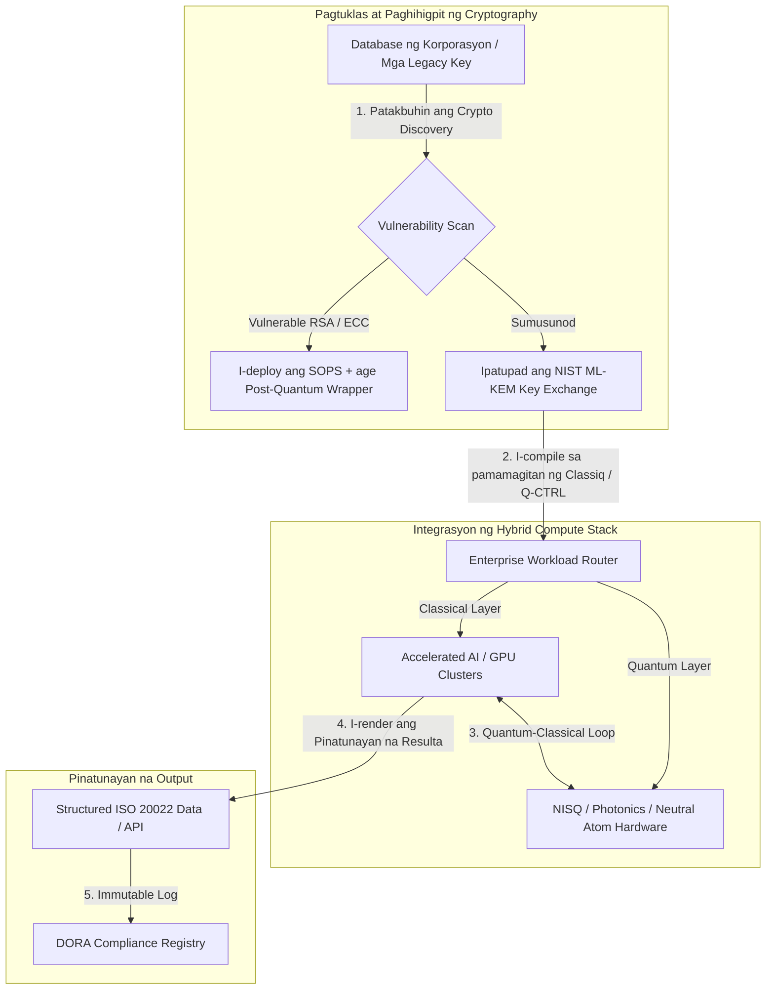

---

# Front Matter (YAML)

author: "contact@sebastienrousseau.com (Sebastien Rousseau)"
banner_alt: "Tanawin ng entablado mula sa Economist Impact 5th Annual Commercialising Quantum Global 2026 summit sa London — sumisimbolo sa paglipat ng quantum technology mula sa physics research patungong enterprise-ready na mga workflow"
banner_height: "1597"
banner_width: "2584"
banner: "https://cloudcdn.pro/stocks/images/sebastien-rousseau-20260617-5th-commercialising-quantum-2.webp"
cdn: "https://cloudcdn.pro"
charset: "UTF-8"
cname: "sebastienrousseau.com"
copyright: "© Copyright 2025 - 2026 - Sebastien Rousseau. All rights reserved."
date: "Hunyo 17, 2026"
description: "Mga boardroom takeaway mula sa Economist Impact 5th Annual Commercialising Quantum Global 2026 summit — $1.3B funding surge, no-regrets hybrid stack, agarang post-quantum cryptography migration, komersyalisasyon ng quantum sensing, at ang direktiba ng HSBC na ang paghihintay ay isang unforced error."
format-detection: "telephone=no"
hreflang: "fil"
icon: "https://cloudcdn.pro/clients/sebastienrousseau/v1/logos/sebastienrousseau.svg"
id: "https://sebastienrousseau.com/2026-06-17-economist-commercialising-quantum-summit-2026"
image_alt: "Black and White Portrait of Sebastien Rousseau"
image_height: "162"
image_width: "162"
image: "https://cloudcdn.pro/stocks/images/sebastien-rousseau.png"
keywords: "Commercialising Quantum Global 2026, Economist Impact summit, post-quantum cryptography, NIST ML-KEM, harvest-now decrypt-later, SNDL, HSBC quantum, Philip Intallura, quantum sensing, GPS-independent navigation, NQCC, EU Quantum Act, Quantcore, qBIG prize, Lord Vallance, hybrid quantum-classical, DORA Article 6"
language: "fil-PH"
last_reviewed: "2026-06-17"
layout: "report"
locale: "fil_PH"
logo_alt: "Logo for Sebastien Rousseau"
logo_height: "44"
logo_width: "44"
logo: "https://cloudcdn.pro/clients/sebastienrousseau/v1/logos/sebastienrousseau.svg"
menu: ""
measurementID: "G-169G4ET5HQ"
name: "Sebastien Rousseau"
permalink: "https://sebastienrousseau.com/2026-06-17-economist-commercialising-quantum-summit-2026"
rating: "general"
referrer: "no-referrer"
robots: "index, follow"
schema: "FAQPage, Article"
seo_title: "Commercialising Quantum 2026: Mga Boardroom Takeaway"
short_name: "sebastienrousseau"
subtitle: "Tumawid na ang quantum mula sa speculative laboratory science patungo sa hybrid enterprise workflow; dapat tumugon ang boardroom sa $1.3B funding sa 2026, agarang post-quantum migration, at sa direktiba ng HSBC na tigilan na ang paghihintay."
tags: "quantum, post-quantum cryptography, NIST ML-KEM, harvest-now decrypt-later, quantum sensing, HSBC, Economist Impact, hybrid compute, DORA, EU Quantum Act, NQCC, mga takeaway sa summit"
theme-color: "0, 83, 191"
title: "Mula Qubits Tungong Tubo: Mga Strategic Takeaway mula sa 5th Annual Commercialising Quantum Global 2026 Summit ng Economist"
url: "https://sebastienrousseau.com/2026-06-17-economist-commercialising-quantum-summit-2026"
viewport: "width=device-width, initial-scale=1, shrink-to-fit=no"

# RSS - The RSS feed front matter (YAML).
atom_link: "https://sebastienrousseau.com/2026-06-17-economist-commercialising-quantum-summit-2026/rss.xml"
category: "Technology"
docs: https://validator.w3.org/feed/docs/rss2.html
generator: "Static Site Generator (SSG) (version 0.0.26)"
item_description: "Mga boardroom takeaway mula sa Economist Impact 5th Annual Commercialising Quantum Global 2026 summit — $1.3B funding surge, no-regrets hybrid stack, agarang post-quantum cryptography migration, komersyalisasyon ng quantum sensing, at ang direktiba ng HSBC na ang paghihintay ay isang unforced error."
item_guid: "https://sebastienrousseau.com/2026-06-17-economist-commercialising-quantum-summit-2026/rss.xml"
item_link: "https://sebastienrousseau.com/2026-06-17-economist-commercialising-quantum-summit-2026/rss.xml"
item_pub_date: "Wed, 17 Jun 2026 06:06:06 +0000"
item_title: "Mula Qubits Tungong Tubo: Mga Strategic Takeaway mula sa 5th Annual Commercialising Quantum Global 2026 Summit ng Economist"
last_build_date: "Wed, 17 Jun 2026 06:06:06 +0000"
managing_editor: "contact@sebastienrousseau.com (Sebastien Rousseau)"
pub_date: "Wed, 17 Jun 2026 06:06:06 +0000"
ttl: "60"
type: "article"
webmaster: "contact@sebastienrousseau.com"

# Apple - The Apple front matter (YAML).
apple_mobile_web_app_orientations: "portrait"
apple_touch_icon_sizes: "192x192"
apple-mobile-web-app-capable: "yes"
apple-mobile-web-app-status-bar-inset: "black"
apple-mobile-web-app-status-bar-style: "black-translucent"
apple-mobile-web-app-title: "Commercialising Quantum 2026: Mga Boardroom Takeaway"
apple-touch-fullscreen: "yes"

# MS Application - The MS Application front matter (YAML).

msapplication-navbutton-color: "0, 83, 191"

# Twitter Card - The Twitter Card front matter (YAML).

twitter_card: "summary_large_image"
twitter_creator: "@wwdseb"
twitter_description: "Mga boardroom takeaway mula sa Economist Impact 5th Annual Commercialising Quantum Global 2026 summit — $1.3B funding surge, no-regrets hybrid stack, agarang post-quantum cryptography migration, komersyalisasyon ng quantum sensing, at ang direktiba ng HSBC na ang paghihintay ay isang unforced error."
twitter_image: "https://cloudcdn.pro/clients/sebastienrousseau/v1/logos/sebastienrousseau.svg"
twitter_image_alt: "Logo of Sebastien Rousseau"
twitter_site: "@wwdseb"
twitter_title: "Commercialising Quantum 2026: Mga Boardroom Takeaway"
twitter_url: "https://sebastienrousseau.com/2026-06-17-economist-commercialising-quantum-summit-2026"

excerpt: "Pinatunayan ng Economist Impact 5th Annual Commercialising Quantum Global 2026 summit ang pivot ng quantum tungo sa enterprise workflow: $1.3B ang nalikom sa loob ng limang buwan, ang post-quantum cryptography ay isang board-level na fiduciary issue sa ilalim ng SNDL harvesting, ipinapadala na ngayon ang quantum sensing para sa GPS-independent navigation, at inihayag ni Philip Intallura ng HSBC ang direktiba na ang paghihintay sa fault-tolerant hardware ay isang unforced error."

# Humans.txt - The Humans.txt front matter (YAML).
author_website: "https://sebastienrousseau.com"
author_twitter: "@wwdseb"
author_location: "London, UK"
thanks: "Salamat sa pagbabasa!"
site_last_updated: "2026-06-17"
site_standards: "HTML5, CSS3, RSS, Atom, JSON, XML, YAML, Markdown, TOML"
site_components: "Kaishi, Kaishi Builder, Kaishi CLI, Kaishi Templates, Kaishi Themes"
site_software: "Static Site Generator, Rust"

---

# Mula Qubits Tungong Tubo: Mga Strategic Takeaway mula sa 5th Annual Commercialising Quantum Global 2026 Summit ng Economist

Enterprise readiness, mga post-quantum cryptography migration, hybrid compute stack, at ang umuusbong na komersyal na tanawin ng quantum sensing at networking.

**TL;DR.** Ang 5th Annual Commercialising Quantum Global 2026 conference, na ginanap ng Economist Impact noong Hunyo 16–17, 2026, sa Business Design Centre sa London, ay nagtipon ng higit sa 1,100 na pandaigdigang leader sa enterprise, finance, policy, at research. Malinaw na structural pivot ang sentral na tema: lumipat na ang quantum technology mula sa speculative laboratory science tungong praktikal at hybrid na enterprise workflow. Sinuportahan ng $1.3 bilyon na venture capital na nalikom sa unang limang buwan pa lamang ng 2026, hindi na nakatuon ang boardroom discussion sa pagbilang ng physical qubit, kundi sa pagtatatag ng "no-regrets" na hybrid compute stack, pagseseguro ng digital asset laban sa "harvest-now, decrypt-later" (SNDL) cryptographic threat, at pag-deploy ng near-term quantum sensing system para sa GPS-independent navigation.

## Mga pangunahing takeaway

- **Paglipat ng enterprise tungo sa praktikal na workflow.** Binigyang-diin ng mga industry leader ([Steve Suarez](https://www.linkedin.com/in/stevesuarez) ng HorizonX, [Phil Intallura](https://www.linkedin.com/in/intallura) ng HSBC) na hindi na problemang pisika kundi operational na ang quantum integration. Nagde-deploy ng hybrid quantum-classical na mga pilot ang mga bangko at enterprise upang maghanda ng talento at i-optimise ang mga aktibong workload.
- **Priyoridad ng board ang post-quantum cryptography (PQC).** Nagbabala ang mga eksperto sa seguridad at legal (CMS UK, [Joanne Miller](https://www.linkedin.com/in/joanne-miller-nso) ng Microsoft, [Craig Farrell](https://www.linkedin.com/in/craig-farrell) ng EY) na hindi maaaring maghintay ang mga organisasyon ng fault-tolerant hardware bago mag-deploy ng PQC. Nagaganap na ngayon ang "harvest-now, decrypt-later" harvesting, kaya't ang migration tungo sa mga NIST ML-KEM standard ay isang agarang fiduciary concern.
- **Pinangungunahan ng quantum sensing ang near-term profitability.** Habang ilang taon pa ang layo ng fault-tolerant computing, mabilis na nag-i-scale ang quantum sensing ([Matthew Kinsella](https://www.linkedin.com/in/matthewkinsella) ng Infleqtion). Ipinapadala na ang mga quantum clock at inertial sensor sa GPS-independent navigation, national security, at ultra-stable na mga energy grid.
- **Pagkasarili, mga cluster, at policy urgency.** Inilatag ng UK Science Minister [Lord Vallance](https://www.linkedin.com/in/patrick-vallance) at [Lord William Hague](https://www.linkedin.com/in/williamhague) ang mga national mission upang gawing industrial-scale na "supercluster" ang research na nakikipag-ugnayan sa National Quantum Computing Centre (NQCC). Lalo pang binibigyang-diin ng paparating na EU Quantum Act ang geopolitical na pagmamadali para sa sovereign computing capacity.
- **Nanalo ng qBIG prize ang Quantcore.** Nakuha ng spin-out ng University of Glasgow na Quantcore ang IOP qBIG prize para sa kanilang breakthrough na niobium-based na superconducting component, na gumagana sa mas mataas na temperatura kaysa sa mga tradisyonal na materyal, na lubos na nagbabawas ng cryogenic infrastructure overhead.

**Kaugnay na babasahin:** [KyberLib and the Post-Quantum Banking Migration in 2026: From Standards to Code](https://sebastienrousseau.com/2026-06-12-kyberlib-post-quantum-banking-migration-standards-code-2026/), [The Banking Resilience Index in 2026: AI, Cloud, Quantum, Payments, and Third-Party Concentration Risk](https://sebastienrousseau.com/2026-06-08-banking-resilience-index-ai-cloud-quantum-payments-third-party-risk-2026/), [The Cloud Native Banking Index in 2026: DORA, Platform Engineering, Sovereign Cloud, and Operational Resilience](https://sebastienrousseau.com/2026-06-05-cloud-native-banking-index-dora-resilience-platform-engineering-2026/).

## 01. Bakit Mahalaga sa Boardroom ang 2026 Summit

Minarkahan ng 2026 edition ng Commercialising Quantum Global summit ng Economist ang permanenteng pagbabago sa pagsusuri ng korporasyon sa deep tech.

Sa nakaraan, ang quantum computing ay isang multi-decade na siyentipikong gawain na inilaan sa mga R&D department. Sa Hunyo 2026, lipas na ang pananaw na ito. Kailangang lumipat ang mga organisasyon mula sa "physics-centric" na curiosity tungo sa "business-centric" na implementation. Dalawa ang dahilan:

1. **Ang convergence ng quantum at AI.** Pinagsasama ng mga high-performance computing (HPC) stack ang classical, accelerated AI, at NISQ (Noisy Intermediate-Scale Quantum) na mga node sa iisang unified compute layer. Matutuklasan ng mga organisasyong magpapaliban ng pagbuo ng quantum-ready na application na mas mabilis na nagsasara ang bintana upang makamit ang strategic advantage kaysa sa inaasahan.
2. **Geopolitical at fiduciary urgency.** Sa mission-led na quantum programme ng UK at sa paparating na EU Quantum Act, naging usapin na ng national sovereignty at corporate continuity ang quantum capacity.

Higit pa rito, hindi na future compliance requirement ang post-quantum cybersecurity. Ang banta ng mga adversarial na "store now, decrypt later" (SNDL) attack ay nangangahulugang ma-decrypt ang mga corporate data na naharang ngayon kapag nag-scale na ang mga komersyal na quantum system, na lumilikha ng agarang pananagutan sa ilalim ng mga pandaigdigang operational resilience mandate gaya ng Digital Operational Resilience Act (DORA).

## 02. Ang Strategic Lens ng Commercialising Quantum 2026

Dapat i-map ng mga enterprise technology leader ang quantum maturity sa limang magkakaibang operational layer, sinusuri ang mga timeline horizon at balance-sheet risk.

### Table 1: Ang strategic lens ng Commercialising Quantum 2026

| Layer | Focus ng korporasyon | Timeline / horizon | Pangunahing panganib sa korporasyon |
| ---- | ---- | ---- | ---- |
| **Hardware at compiler** | Pagpili sa mga magkakaribal na approach (superconducting, trapped ions, neutral atoms, photonics) | 3 – 5 taon (fault-tolerance) | Pagkalock sa dead-end architecture o maagang pagsuporta sa isang platform lamang. |
| **Cryptographic hardening** | Pagtuklas at imbentaryo ng mga cryptographic dependency; migration tungo sa NIST ML-KEM | Agad (aktibong migration) | Mga systemic data breach at compliance failure sa ilalim ng DORA at NIST CSF 2.0. |
| **Quantum sensing** | Deployment ng GPS-independent navigation, ultra-stable na mga orasan, at gravimeter | 1 – 2 taon (agarang komersyal) | Operational disruption ng logistics, shipping, at mga energy grid dahil sa GPS jamming. |
| **System integration** | Pagkonekta ng quantum hardware sa mga umiiral na classical HPC at supercomputing data centre | 1 – 3 taon (hybrid phase) | High latency, mga data-transfer bottleneck, at fragmented na compute silo. |
| **Enterprise software** | Paglalantad ng quantum algorithm sa pamamagitan ng high-level abstraction layer at API (Classiq, Q-CTRL) | Agad (skills building) | Pagkahiwalay ng talento at workflow mula sa aktwal na engineering execution. |

## 03. Mga Pangunahing Quantum Signal at Boardroom Trigger

Dapat subaybayan ng mga technology leader ang mga tiyak at masusukat na market at regulatory metric upang gabayan ang kanilang quantum investment.

### Table 2: Mga pangunahing quantum signal at boardroom trigger

| Signal | Quantitative metric | Regulatory / policy reference | Actionable platform priority |
| ---- | ---- | ---- | ---- |
| **Quantum funding surge** | $1.3 bilyon ang nalikom sa buong mundo sa unang limang buwan ng 2026 | Return on Resilience (RoR) | Ilipat ang badyet mula sa mga speculative pilot tungo sa "no-regrets" na hybrid quantum-classical na workload. |
| **Pagkalantad sa data decryption** | 100% ng encrypted data na ipinadala sa public channel ay nakalantad sa SNDL harvesting | DORA Article 6 (ICT security) | Ipatupad ang cryptographic discovery tool upang matukoy ang mga vulnerable na RSA/ECC key sa buong estate. |
| **Sovereign infrastructure** | £2.5 bilyon na alokasyon ng UK National Quantum Strategy | UK Quantum Missions / Lord Vallance | Magtatag ng lokal na partnership sa mga national supercluster gaya ng NQCC. |
| **Mga deadline ng compliance** | Hunyo 14, 2026 SWIFT structured-address cutover | SWIFT SR 2026 directive | Linisin at i-format ang mga interbank database upang matugunan ang structured XML specification. |

## 04. Malalim na Pagsisiyasat sa mga Pangunahing Tema ng Summit

### Naabot ng quantum ang investment tipping point

Lumakas nang malaki ang venture capital funding, na nakalikom ng **$1.3 bilyon** sa unang limang buwan pa lamang ng 2026. Hindi gaya ng mga speculative hype cycle ng mga naunang taon, ang kasalukuyang capital wave ay nakasandig sa mga real-world at near-term na workload. Ipinakita ng mga tagapagsalita mula sa Classiq at IBM Quantum Platform kung paano pinapayagan ng mga software abstraction layer at automated compiler ang mga non-specialist na developer team na mag-execute ng hybrid quantum-classical na algorithm sa kasalukuyang classical infrastructure. Pinapayagan ng "no-regrets" na estratehiyang ito ang mga organisasyon na magtayo ng quantum-ready na talento at workflow nang agaran.

### Mga babala ng legal at regulatory sa "harvest now, decrypt later"

Nag-udyok ng malaking pakikipag-ugnayan ang mga legal partner at cybersecurity executive sa agarang panganib sa data. Naghatid ang mga kinatawan ng sponsoring law firm na CMS UK at ng Microsoft CSO na si [Joanne Miller](https://www.linkedin.com/in/joanne-miller-nso) ng matinding babala sa senior management: *ang paghihintay sa pagdating ng fault-tolerant hardware bago mag-deploy ng post-quantum cryptography ay isang kritikal na fiduciary failure.*

Sa ilalim ng "store now, decrypt later" (SNDL) na paradigm, aktibong nag-aani ngayon ng encrypted corporate data ang mga hostile actor na may layuning i-decrypt ito sa sandaling lumitaw ang mga cryptographically relevant na quantum computer. Dapat mag-deploy ng post-quantum na mga proteksyon (gaya ng NIST ML-KEM) ang mga organisasyon nang agad upang protektahan ang matagalang sensitibong dataset, intellectual property, at historical na mga customer record.

### Ang realignment ng "quantum sensing" hype

Habang ilang taon pa ang layo ng fault-tolerant quantum computing, itinampok ng summit ang quantum sensing bilang unang tunay na kumikitang alon ng real-world deployment. Inilarawan ng Chief Executive na si [Matthew Kinsella](https://www.linkedin.com/in/matthewkinsella) ng Infleqtion kung paano mabilis na nag-i-scale ang mga quantum clock, inertial sensor, at radio-frequency system sa iba't ibang industriya.

Dahil sinusukat ng mga teknolohiyang ito ang mga physical constant na may sub-atomic na katumpakan, pinapagana nila ang **GPS-independent navigation**, ultra-stable na mga energy grid, at deep-space telecommunication. Lubhang relevant ang mga aplikasyong ito para sa aviation, maritime transport, at mga national-defence system na humaharap sa lumalaking banta ng GPS jamming.

### Pakikipagtulungan sa ecosystem at cluster

Ginamit ng UK quantum ecosystem ang London summit upang ipakita ang mga domestic innovation supercluster. Ipinaliwanag ng mga live update mula sa National Quantum Computing Centre (NQCC) at Digital Catapult kung paano malalampasan ng mga early-stage na deep-tech spin-out ang "technology divide" sa pamamagitan ng direktang pagsasama ng quantum hardware sa mga classical na supercomputing data centre.

Tinanggap ni [Wridhdhisom Karar](https://www.linkedin.com/in/wridhdhisomkarar), co-founder ng Scottish quantum startup na Quantcore, ang prestihiyosong Institute of Physics (IOP) Quantum Business Innovation and Growth (qBIG) prize para sa mga niobium-based na superconducting component ng kumpanya. Gumagana ang mga component na ito sa mas mataas na temperatura kaysa sa mga tradisyonal na materyal, na lubos na nagbabawas ng cryogenic infrastructure overhead na kinakailangan upang mag-scale ng quantum processor.

### Ang HSBC case study: bakit ang paghihintay sa quantum ay isang "unforced error"

Naghatid ng makapangyarihang boardroom directive ang mga insight mula kay [**Philip Intallura, Ph.D.**](https://www.linkedin.com/in/intallura) (Global Head of Quantum Technologies sa HSBC, UK Government Advisor, at Board Advisor) sa 5th Annual Commercialising Quantum Event (2026) ng Economist: *"Ang paghihintay sa fault-tolerant quantum bago ka magsimula ay isang unforced error."*

Iginiit ni Dr Intallura na ang karaniwang "wait-and-see" na approach sa mga institusyong pinansyal ay isang own goal na itinayo sa tatlong maling palagay:

- **Tunay ang near-term ROI.** Sa empirical testing, nahigitan ng HSBC ang mga modelong kasalukuyang tumatakbo sa production, ikinonekta ang quantum work sa ibang bahagi ng negosyo, ginamit ang quantum upang palalimin ang relasyon sa ilan sa kanilang pinakamalalaking kliyente, at nakatawag ng malaking bagong negosyo sa **HSBC Innovation Banking**.
- **Matarik na adoption curve ang quantum.** Hindi maikling gawain ang pagbuo ng kakayahan, pagtatakda ng estratehiya, pag-secure ng pondo, at pagpapatakbo ng experiment cycle sa loob ng isang heavily regulated na organisasyon. Dapat sistematikong subukan at iangkop ang mga proseso para sa teknolohiya.
- **Isang ecosystem ang quantum.** Walang nag-iisang player ang nakakarating doon. Bawat research paper, POC, at pilot na isinagawa ng HSBC ay ginawa sa malapit na pakikipagtulungan sa isang quantum provider — at sa ilang kaso, umaabot ang collaboration sa akademya, mga regulator, at gobyerno.

**Pangwakas na boardroom directive:** *"Ang kakayahang kakailanganin mo sa unang araw ng fault tolerance ay ang kakayahang itinatayo mo ngayon."*

## 05. Quantum Integration ng Korporasyon at Cryptography Pipeline

Upang ma-secure ang digital asset habang itinatayo ang quantum readiness, dapat magtatag ang enterprise ng malinaw na integration pipeline.

## 06. Ang Boardroom Playbook: Mga Actionable Imperative

Upang isalin ang mga insight ng Commercialising Quantum Global 2026 summit sa agarang business value, dapat isagawa ng senior management ang sumusunod na apat na hakbang na boardroom playbook:

1. **Iutos ang cryptographic discovery.** Iutos sa Chief Information Security Officer (CISO) na i-katalogo ang lahat ng cryptographic asset, mina-map ang bawat legacy RSA at ECC key sa buong enterprise upang maghanda para sa post-quantum migration.
2. **Mag-deploy ng "no-regrets" na hybrid strategy.** Iwasan ang paghihintay sa perpektong hardware. Mamuhunan sa quantum-inspired na software at hybrid classical-quantum na pilot upang bumuo ng in-house na talento at i-optimise ang komplikadong logistics o risk portfolio ngayon.
3. **Suriin ang quantum sensing para sa logistics.** Kung umaasa ang inyong organisasyon sa pandaigdigang supply chain, shipping, o critical infrastructure, aktibong suriin ang mga quantum sensing system (gaya ng GPS-independent navigation) upang mabawasan ang panganib ng geopolitical disruption.
4. **Magparehistro para sa Hunyo 30 Insight Hour.** Tiyaking magparehistro ang inyong mga technology leader para sa virtual na **Commercialising Quantum Global Insight Hour** sa Hunyo 30, 2026, sa 3:00 PM BST (suportado ng IonQ) upang patuloy na masubaybayan ang enterprise risk management at mga estratehiya sa paglalaan ng talento.

## 07. Mga Madalas Itanong

**Ano ang "harvest now, decrypt later" (SNDL) at bakit mahalaga ito ngayon?**
Ang SNDL ay ang gawain ng pag-intercept at pag-iimbak ng encrypted data ngayon, na may layuning i-decrypt ito kapag naging available ang mga cryptographically relevant na quantum computer. Tinitingnan na ngayon ang matagalang sensitibong dataset — intellectual property, customer record, government communication. Ang paglipat sa NIST ML-KEM ay isang fiduciary decision na hindi maaaring ipagpaliban ng board.

**Bakit ang quantum sensing ang unang commercial wave sa halip na computing?**
Sinusukat ng mga quantum sensor ang mga physical constant na may sub-atomic na katumpakan at hindi kailangan ang fault-tolerant hardware na kinakailangan ng quantum computing. Naka-pilot deployment na ang mga quantum clock, gravimeter, at inertial sensor para sa GPS-independent navigation, ultra-stable na mga energy grid, at deep-space communication.

**R&D lamang ba ang quantum work ng HSBC o naghatid na ito ng masusukat na ROI?**
Ayon kay Philip Intallura sa summit, nahigitan ng HSBC ang mga modelong kasalukuyang tumatakbo sa production, ginamit ang quantum upang palalimin ang relasyon sa pinakamalalaking kliyente nito, at nakatawag ng malaking bagong negosyo sa HSBC Innovation Banking. Lumipat na ang trabaho mula sa research patungo sa operational integration.

## 08. Mga Reperensiya

- **Economist Impact, (2026).** *5th Annual Commercialising Quantum Global 2026.* Live conference proceedings, Hunyo 16–17, 2026. London: Business Design Centre. Available at: [Economist Impact](https://events.economist.com/commercialising-quantum/).
- **National Institute of Standards and Technology (NIST), (2024).** *First Three Finalized Post-Quantum Encryption Standards (FIPS 203, 204, and 205).* Gaithersburg: U.S. Department of Commerce. Available at: [NIST Standards](https://www.nist.gov/news-events/news/2024/08/nist-releases-first-3-finalized-post-quantum-encryption-standards).
- **European Parliament and Council of the European Union, (2022).** *Regulation (EU) 2022/2554 on digital operational resilience for the financial sector (DORA).* Brussels: Official Journal of the European Union. Available at: [DORA Regulation](https://eur-lex.europa.eu/legal-content/EN/TXT/?uri=CELEX%3A32022R2554).
- **SWIFT, (2024).** *ISO 20022 November 2026 Structured Address Milestone.* La Hulpe: SWIFT. Available at: [SWIFT ISO 20022 milestone](https://www.swift.com/standards/iso-20022/iso-20022-bytes/call-action-november-2026).
