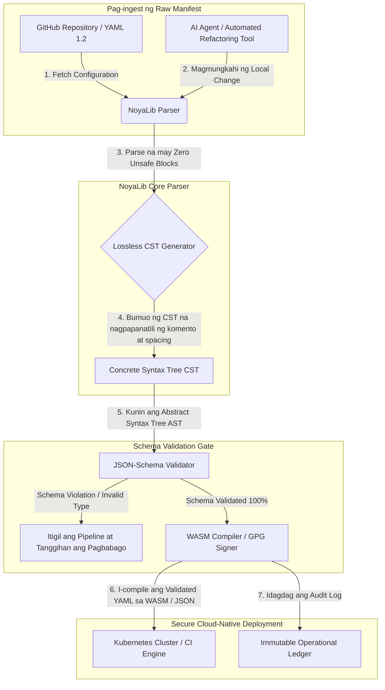

---

# Front Matter (YAML)

author: "contact@sebastienrousseau.com (Sebastien Rousseau)"
banner_alt: "Architectural geometry sa ilalim ng dramatic light — sumisimbolo sa papel ng NoyaLib bilang load-bearing safe Rust YAML parser sa ilalim ng CI, Kubernetes, MCP, at financial-services configuration"
banner_height: "1597"
banner_width: "2584"
banner: "https://cloudcdn.pro/stocks/images/ken-cheung-KonWFWUaAuk.webp"
cdn: "https://cloudcdn.pro"
charset: "UTF-8"
cname: "sebastienrousseau.com"
copyright: "© Copyright 2025 - 2026 - Sebastien Rousseau. All rights reserved."
date: "Hunyo 18, 2026"
description: "NoyaLib, isang zero-unsafe Rust YAML 1.2 parser na may 406/406 spec compliance, JSON-Schema validation, lossless CST at MCP/WASM bindings."
format-detection: "telephone=no"
hreflang: "fil"
icon: "https://cloudcdn.pro/clients/sebastienrousseau/v1/logos/sebastienrousseau.svg"
id: "https://sebastienrousseau.com/2026-06-18-noyalib-safe-yaml-rust-ai-mcp-financial-infrastructure-2026"
image_alt: "Black and White Portrait of Sebastien Rousseau"
image_height: "162"
image_width: "162"
image: "https://cloudcdn.pro/stocks/images/sebastienrousseau.webp"
keywords: "safer Rust YAML parser, NoyaLib, YAML 1.2 spec compliance, zero-unsafe Rust, JSON-Schema validation, lossless Concrete Syntax Tree, CST, MCP, Model Context Protocol, WebAssembly, Kubernetes manifests, CI/CD configuration, DORA Article 5, BCBS 239, Basel III operational risk, financial infrastructure, configuration security, software supply chain"
language: "fil-PH"
last_reviewed: "2026-06-18"
layout: "report"
locale: "fil_PH"
logo_alt: "Logo for Sebastien Rousseau"
logo_height: "44"
logo_width: "44"
logo: "https://cloudcdn.pro/clients/sebastienrousseau/v1/logos/sebastienrousseau.svg"
menu: ""
measurementID: "G-169G4ET5HQ"
name: "Sebastien Rousseau"
permalink: "https://sebastienrousseau.com/2026-06-18-noyalib-safe-yaml-rust-ai-mcp-financial-infrastructure-2026"
rating: "general"
referrer: "no-referrer"
robots: "index, follow"
schema: "FAQPage, Article"
seo_title: "Safer Rust YAML Parser para sa AI, MCP at Finance"
short_name: "sebastienrousseau"
subtitle: "Isang safer Rust YAML stack — ang NoyaLib — ang nagpapalit sa YAML 1.2 mula convenience markup tungong cryptographically secure at spec-compliant na configuration control plane para sa AI agents, MCP, Kubernetes, at financial-services infrastructure."
tags: "safer Rust YAML parser, NoyaLib, YAML 1.2, zero-unsafe Rust, JSON-Schema, MCP, WebAssembly, Kubernetes, DORA, BCBS 239, Basel III, financial infrastructure, supply chain security"
theme-color: "0, 83, 191"
title: "Bakit Kailangan ng YAML ang isang Safer Rust Stack para sa AI, MCP, at Financial Infrastructure sa 2026"
url: "https://sebastienrousseau.com/2026-06-18-noyalib-safe-yaml-rust-ai-mcp-financial-infrastructure-2026"
viewport: "width=device-width, initial-scale=1, shrink-to-fit=no"

# RSS - The RSS feed front matter (YAML).
atom_link: "https://sebastienrousseau.com/2026-06-18-noyalib-safe-yaml-rust-ai-mcp-financial-infrastructure-2026/rss.xml"
category: "Technology"
docs: https://validator.w3.org/feed/docs/rss2.html
generator: "Static Site Generator (SSG) (version 0.0.26)"
item_description: "NoyaLib, isang zero-unsafe Rust YAML 1.2 parser na may 406/406 spec compliance, JSON-Schema validation, lossless CST at MCP/WASM bindings."
item_guid: "https://sebastienrousseau.com/2026-06-18-noyalib-safe-yaml-rust-ai-mcp-financial-infrastructure-2026/rss.xml"
item_link: "https://sebastienrousseau.com/2026-06-18-noyalib-safe-yaml-rust-ai-mcp-financial-infrastructure-2026/rss.xml"
item_pub_date: "Thu, 18 Jun 2026 06:06:06 +0000"
item_title: "Bakit Kailangan ng YAML ang isang Safer Rust Stack para sa AI, MCP, at Financial Infrastructure sa 2026"
last_build_date: "Thu, 18 Jun 2026 06:06:06 +0000"
managing_editor: "contact@sebastienrousseau.com (Sebastien Rousseau)"
pub_date: "Thu, 18 Jun 2026 06:06:06 +0000"
ttl: "60"
type: "article"
webmaster: "contact@sebastienrousseau.com"

# Apple - The Apple front matter (YAML).
apple_mobile_web_app_orientations: "portrait"
apple_touch_icon_sizes: "192x192"
apple-mobile-web-app-capable: "yes"
apple-mobile-web-app-status-bar-inset: "black"
apple-mobile-web-app-status-bar-style: "black-translucent"
apple-mobile-web-app-title: "Safer Rust YAML Parser para sa AI, MCP at Finance"
apple-touch-fullscreen: "yes"

# MS Application - The MS Application front matter (YAML).

msapplication-navbutton-color: "0, 83, 191"

# Twitter Card - The Twitter Card front matter (YAML).

twitter_card: "summary_large_image"
twitter_creator: "@wwdseb"
twitter_description: "NoyaLib, isang zero-unsafe Rust YAML 1.2 parser na may 406/406 spec compliance, JSON-Schema validation, lossless CST at MCP/WASM bindings."
twitter_image: "https://cloudcdn.pro/clients/sebastienrousseau/v1/logos/sebastienrousseau.svg"
twitter_image_alt: "Logo of Sebastien Rousseau"
twitter_site: "@wwdseb"
twitter_title: "Safer Rust YAML Parser para sa AI, MCP at Finance"
twitter_url: "https://sebastienrousseau.com/2026-06-18-noyalib-safe-yaml-rust-ai-mcp-financial-infrastructure-2026"

excerpt: "Ang NoyaLib ay isang safer Rust YAML stack — zero unsafe blocks, 406/406 YAML 1.2 spec compliance, lossless Concrete Syntax Tree, JSON-Schema (Draft 2020-12) validation, at MCP/WASM bindings — na ginawa para sa AI agents, Kubernetes, CI/CD, at sa configuration control plane sa likod ng financial infrastructure."

# Humans.txt - The Humans.txt front matter (YAML).
author_website: "https://sebastienrousseau.com"
author_twitter: "@wwdseb"
author_location: "London, UK"
thanks: "Salamat sa pagbabasa!"
site_last_updated: "2026-06-18"
site_standards: "HTML5, CSS3, RSS, Atom, JSON, XML, YAML, Markdown, TOML"
site_components: "Kaishi, Kaishi Builder, Kaishi CLI, Kaishi Templates, Kaishi Themes"
site_software: "Static Site Generator, Rust"

---

# Bakit Kailangan ng YAML ang isang Safer Rust Stack para sa AI, MCP, at Financial Infrastructure sa 2026

Mahalaga ang isang safer Rust YAML stack dahil ang YAML ngayon ay nagdadala ng mga CI/CD pipeline, Kubernetes manifest, mga panuntunan ng [Open Policy Agent](https://www.openpolicyagent.org/), at mga tool registry ng Model Context Protocol (MCP) — at ang isang ambiguous parse lamang ay maaaring sumira sa isang clearing system, mag-misconfigure ng security group, o magbigay sa isang local AI agent ng maling permission. Ang [NoyaLib](https://github.com/sebastienrousseau/noyalib) ay isang pure-Rust, zero-unsafe na [YAML 1.2](https://yaml.org/spec/1.2.2/) parsing at validation ecosystem na ginawa upang gawing ligtas-bilang-default ang infrastructure na ito.

## Mabilis na sagot

**Ano ang NoyaLib sa isang pangungusap?** Ang NoyaLib ay isang open-source, pure-Rust YAML 1.2 parser at validation ecosystem na may zero `unsafe` code, 100% spec compliance sa buong opisyal na 406-test YAML suite, isang lossless Concrete Syntax Tree, at real-time na [JSON Schema](https://json-schema.org/) validation — ginawa upang gawing ligtas-bilang-default ang configuration ng AI-agent, MCP, Kubernetes, at financial-infrastructure.

## Executive summary

Mukhang simple lang ang YAML hanggang sa makasira ang isang ambiguous parse o schema violation sa isang multi-billion-dollar na production clearing system. Sa 2026, ang YAML ang de-facto standard para sa mga [CI/CD](https://docs.github.com/en/actions/learn-github-actions/workflow-syntax-for-github-actions) pipeline, [Kubernetes](https://kubernetes.io/docs/concepts/configuration/overview/) manifest, panuntunan ng [Open Policy Agent](https://www.openpolicyagent.org/), at mga tool registry ng Model Context Protocol (MCP). Ang mga opaque legacy parser — na may memory vulnerability at destructive parsing — ay isang hindi katanggap-tanggap na security risk. Ang NoyaLib ay isang pure-Rust, zero-unsafe YAML 1.2 ecosystem: 100% spec compliance sa lahat ng 406 opisyal na suite test, isang lossless Concrete Syntax Tree (CST) na nagpapanatili ng mga komento at spacing, at built-in na JSON-Schema validation. Ang resulta ay ang YAML na muling itinatag bilang isang auditable, secure, at agent-accessible na configuration control plane.

## Mga pangunahing takeaway

- **Production code ang configuration.** Ang isang malformed YAML file lamang ay maaaring mag-misconfigure ng cloud-native security group o ng permission ng AI-agent. Itinuturing ng NoyaLib ang YAML bilang critical infrastructure.
- **Zero-unsafe design.** Ganap na binuo sa safe Rust na walang `unsafe` block, inaalis ng NoyaLib ang mga memory-safety vulnerability — buffer overflow, remote code execution — sa core parsing layer.
- **Absolute 406/406 spec compliance.** Matematikal na nagva-validate ng mga configuration structure, inaalis ang mga parsing discrepancy at structural drift sa pagitan ng staging at production environment.
- **Lossless Concrete Syntax Tree.** Hindi tulad ng mga legacy parser na nagtatapon ng mga komento at formatting, pinapanatili ng NoyaLib ang spacing at mga annotation, na nagbibigay-daan sa secure at round-trip na automated refactoring ng mga AI agent.
- **Board-level fiduciary value.** Iniuugnay ang configuration integrity sa [DORA Article 5](https://eur-lex.europa.eu/legal-content/EN/TXT/?uri=CELEX%3A32022R2554) at sa mga metric ng operational-risk capital ng [Basel III](https://www.bis.org/bcbs/publ/d424.htm), direktang nagpoprotekta sa senior management mula sa personal liability.

**Kaugnay na babasahin:** [KyberLib and the Post-Quantum Banking Migration in 2026: From Standards to Code](https://sebastienrousseau.com/2026-06-12-kyberlib-post-quantum-banking-migration-standards-code-2026/), [The Cloud Native Banking Index in 2026: DORA, Platform Engineering, Sovereign Cloud, and Operational Resilience](https://sebastienrousseau.com/2026-06-05-cloud-native-banking-index-dora-resilience-platform-engineering-2026/), [AI-Aware Dotfiles in 2026: Building a Secure, Reproducible Developer Workstation for MCP, SLSA, and Multi-Shell Parity](https://sebastienrousseau.com/2026-06-16-ai-aware-dotfiles-secure-reproducible-workstation-2026/).

## 01. Bakit Mahalaga ang Isang Safer Rust YAML Stack sa 2026

Sa Hunyo 2026, lubos nang distributed at lalo nang automated ang mga enterprise IT infrastructure.

Tahimik na naging load-bearing configuration language ang YAML para sa buong software-engineering stack. Dinadala nito ang continuous-integration (CI) workflow na nag-compile ng production artefact, ang mga manifest ng [Kubernetes](https://kubernetes.io/docs/concepts/overview/) na nag-orchestrate sa mga global cloud-native cluster, at ang mga server schema ng [Model Context Protocol](https://modelcontextprotocol.io/) (MCP) na nagbibigay sa mga local AI agent ng pahintulot na magpatakbo ng local operation.

Ang mga legacy YAML parser — ang [PyYAML](https://pyyaml.org/), [yaml-cpp](https://github.com/jbeder/yaml-cpp), [libyaml](https://github.com/yaml/libyaml) — ay nagdadala ng dalawang structural risk:

1. **Type-coercion vulnerability (ang "Norway problem").** Madalas na pinipilit ng mga legacy parser ang mga unquoted string (ang country code na `NO` ay nagiging boolean `false`, ang `yes`/`no` ay ganoon din) — tingnan ang [YAML 1.1 vs 1.2 boolean tag](https://yaml.org/type/bool.html) — na sanhi ng kritikal na system failure o tahimik na security misconfiguration.
2. **Memory-safety exploit.** Ang mga opaque parser na isinulat sa C/C++ ay dumaranas ng memory-leak at buffer-overflow exploit, na maaaring humantong sa remote code execution (RCE) sa mga core build server.

Niresolba ng [NoyaLib](https://github.com/sebastienrousseau/noyalib) ang mga hamong ito. Ito ay isang pure-Rust, zero-unsafe na YAML 1.2 parsing at validation ecosystem. Sa pamamagitan ng pagkamit ng absolute 406/406 spec compliance at pagpapatupad ng strict JSON-Schema validation direkta sa panahon ng parse, naghahatid ang NoyaLib ng mataas na **Return on Resilience (RoR)** — pinipigilan ang configuration-induced downtime at sineseguro ang mga financial-grade software supply chain.

## 02. Ang Architecture Lens ng NoyaLib 2026

Gumagana ang NoyaLib ecosystem bilang isang secure at lossless configuration parser. Bawat local at cloud manifest ay structurally validated at protektado sa pinakamababang execution layer.

### Table 1: Mga architecture layer ng NoyaLib at risk mitigation

| Layer | Design decision | Bakit ito mahalaga | Panganib kung mali ang paghawak |
| ---- | ---- | ---- | ---- |
| **Parser layer** | YAML 1.2 compliant na pure-Rust parser na walang `unsafe` block | Inaalis ang memory-safety vulnerability at buffer overflow sa pinakamababang execution layer. | Remote code execution (RCE) sa mga core build server. |
| **Conformance layer** | 100% compliance sa buong 406/406 opisyal na YAML 1.2 suite test | Inaalis ang mga parsing discrepancy at type-coercion drift sa pagitan ng staging at production. | "Norway problem" type-coercion error na nagdi-disable ng mga security group. |
| **Syntax-tree layer** | Lossless Concrete Syntax Tree (CST) | Pinapanatili ang mga komento, spacing at ordering sa panahon ng round-trip parsing at programmatic refactoring. | Sinisira ng automated AI refactoring ang mga annotation ng developer. |
| **Validation layer** | [JSON Schema (Draft 2020-12)](https://json-schema.org/draft/2020-12/release-notes) validation sa panahon ng parsing | Nagpapatupad ng strict data model sa mga configuration file bago sila maabot ang production cluster. | Mga malformed configuration file na nagti-trigger ng cloud-native cluster crash. |
| **Interface layer** | WebAssembly (WASM) at MCP bindings | Pinapayagan ang configuration validation na tumakbo direkta sa loob ng mga browser, edge node, at local agent toolkit. | Mga tooling silo kung saan hindi maaaring tumakbo ang validation sa mga edge device. |

## 03. Mga Pangunahing Workstation at Configuration Security Signal

Upang mapanatili ang absolute security sa buong development at operations estate, dapat subaybayan ng mga Chief Information Security Officer (CISO) ang mga tiyak at masusukat na metric.

### Table 2: Mga workstation at configuration security signal

| Signal | Metric / operational benchmark | NIST CSF / DORA reference | Technical platform implementation |
| ---- | ---- | ---- | ---- |
| **Parser conformance** | 100% pass rate sa opisyal na YAML 1.2 test suite (406/406 tests). | [DORA Article 6](https://eur-lex.europa.eu/legal-content/EN/TXT/?uri=CELEX%3A32022R2554) (ICT security) | NoyaLib parser core na nagva-validate ng lahat ng manifest bago ang CI execution. |
| **Memory safety profile** | Zero `unsafe` Rust block sa loob ng parser at serializer dependency. | DORA Article 30 (supply chain) | Automated compiler check ([`forbid(unsafe_code)`](https://doc.rust-lang.org/reference/attributes/diagnostics.html#the-forbid-attribute)) sa cargo build. |
| **Schema validation** | 100% ng mga parsed configuration file ay na-verify laban sa valid na mga [JSON Schema](https://json-schema.org/) model. | [NIST CSF 2.0](https://www.nist.gov/cyberframework) (PR.DS-01) | Real-time validation gate na pinipigilan ang mga build pipeline sa schema violation. |
| **Configuration drift** | Real-time na pagtuklas at pagbawi ng mga local configuration file pabalik sa git-versioned state. | Return on Resilience (RoR) | Continuous telemetry na nagla-log sa lahat ng local file modification. |
| **Agent access control** | Bounded at read-only na mga permission para sa mga local AI tool na umaandar sa pamamagitan ng MCP configuration. | Model risk management ([SR 11-7](https://www.federalreserve.gov/supervisionreg/srletters/sr1107.htm)) | MCP server boundary na naglilimita sa agent operation sa mga aprubadong directory. |

## 04. Ang Pagkakamali ng Opaque Configuration Parsing

Isang malaking vulnerability sa cloud-native operation ang *opaque parsing* — paggamit ng mga parser na nagtatapon ng structural metadata (mga komento, whitespace, document ordering) o tahimik na pinipilit ang mga type sa panahon ng compilation. Nagpapakilala ang gawaing ito ng dalawang malubhang security risk:

1. **Destructive refactoring.** Kapag nag-update ng deployment manifest ang isang AI coding assistant o automated refactoring tool, tinatapon ng mga traditional parser ang mga komento at formatting ng developer, na sumisira sa konteksto na kinakailangan para sa human review at post-incident forensic.
2. **Mga parsing discrepancy.** Kung gumagamit ang isang staging environment ng Python-based parser at tumatakbo ang production sa C-based parser, ang mga maliliit na pagkakaiba sa YAML 1.2 spec compliance ay maaaring magdulot ng pagkabigo o pagkakaiba ng pag-uugali ng isang valid na staging manifest sa production, na lumilikha ng mga nakatago na security vulnerability.

Niresolba ng **lossless Concrete Syntax Tree (CST)** ng NoyaLib ito. Pinapanatili nito ang bawat space, komento, at document line sa panahon ng parse-and-serialise loop. Maaaring i-edit, i-refactor, at i-commit ng mga automated AI assistant ang mga configuration file habang pinapanatili ang 100% ng mga annotation na isinulat ng tao — isang absolute audit trail.

## 05. Pagdidisenyo ng Bounded AI Configuration Pipeline

Upang mapigilan ang mga malisyosong pagbabago sa configuration na maabot ang production environment, dapat magpatupad ang organisasyon ng isang mahigpit na bounded at schema-validated configuration pipeline.

Ipinapakita ng operational flow sa ibaba kung paano nagpa-parse ang NoyaLib ng raw YAML, bumubuo ng lossless CST, nagva-validate ng AST laban sa JSON-Schema model, at nagko-compile ng WebAssembly bindings para sa browser o edge environment.

## 06. Ang Boardroom Playbook at Fiduciary Liability

Ang configuration security at software-supply-chain integrity ay mga kritikal na boardroom priority. Dapat lapitan ng senior manager ang configuration management sa pamamagitan ng lens ng fiduciary duty at operational resilience.

- **DORA Article 5 (board accountability).** Iniuutos na ang board ay may pangwakas at hindi maipapasang responsibilidad sa pamamahala ng ICT risk ng institusyon. Dahil kinokontrol ng mga configuration file ang mga kritikal na cloud-native security group at payment-routing pathway, dapat patunayan ng mga board na ang mga sistema na nagpa-parse sa mga manifest na ito ay memory-safe at fully spec-compliant upang masiyahan ang mga regulatory audit. ([Regulation (EU) 2022/2554](https://eur-lex.europa.eu/legal-content/EN/TXT/?uri=CELEX%3A32022R2554))
- **BCBS 239 (risk data aggregation at reporting).** Iniaatas na ang risk reporting at infrastructure metric ay dapat tumpak, kumpleto, at nabuo sa ilalim ng mahigpit na data-quality control. Sinusuportahan ng NoyaLib ang BCBS 239 sa pamamagitan ng pag-parse at pagva-validate ng mga configuration file laban sa strict schema sa pinagmulan, pinipigilan ang tahimik na data leakage o misconfiguration-induced outage. ([BCBS 239 standard](https://www.bis.org/publ/bcbs239.htm))
- **Pagpigil sa operational-risk capital charge (Basel III).** Direktang pinalalaki ng mga configuration-induced outage ang mga operational-risk capital charge sa ilalim ng Basel III, na nagti-tie up sa balance-sheet capital. Ang pag-standardise ng enterprise configuration stack sa isang secure at pure-Rust parser tulad ng NoyaLib ay nagmi-minimise ng panganib na ito, pinapanatili ang capital at pinoprotektahan ang tiwala ng customer. ([Basel III standards](https://www.bis.org/bcbs/publ/d424.htm))

## 07. Ang Ibig Sabihin Nito ayon sa Uri ng Bangko

### Global Systemically Important Banks (G-SIBs)

Namamahala ang mga G-SIB ng libu-libong microservice at deployment pipeline sa maraming hurisdiksyon. Ang kanilang pangunahing hamon ay ang pagpapanatili ng configuration consistency at pagpigil sa security drift sa malalaking cloud-native estate. Ang pag-standardise sa isang safer Rust YAML stack tulad ng NoyaLib ay ginagarantiyahan na lahat ng Kubernetes manifest, CI/CD pipeline, at security policy ay na-parse at na-validate sa ilalim ng isang uniform at memory-safe framework — inaalis ang panganib ng mga hindi na-audit na "snowflake" configuration.

### Transaction at corporate banks

Nagpapatakbo ang mga transaction bank ng mga sensitibong payment gateway at wholesale clearing infrastructure. Ang pagpapatunay sa absolute security ng code at configuration na na-deploy sa mga production environment na ito ay isang non-negotiable na regulatory demand. Ginagarantiyahan ng pag-integrate ng NoyaLib na ang software supply chain ay ganap na na-audit, lossless, at protektado mula sa mga parsing vulnerability — isang kontrol na malinaw na nakahanay sa DORA Article 6 at sa seksyon 6 ng [PCI DSS v4.0](https://www.pcisecuritystandards.org/document_library/).

### Mga regional at mas maliliit na bangko

Dapat panatilihin ng mga regional bank ang mataas na cybersecurity standard nang walang G-SIB-scale na technology budget. Nagbibigay ang open-source NoyaLib framework ng isang magaan, cost-effective, at lubos na secure na Rust-friendly na solusyon, na nagbibigay-daan sa mas maliliit na institusyon na magpatupad ng enterprise-grade na configuration security at supply-chain protection nang walang mga proprietary licence fee.

## 08. Konklusyon: Ang Configuration Security Roadmap

Ang developer workstation at cloud-native infrastructure configuration ay mga kritikal na control plane sa software supply chain. Ang pagpapahintulot sa mga hindi na-audit, ambiguous, o hindi ligtas na configuration file na maabot ang mga corporate asset ay isang hindi katanggap-tanggap na operational at regulatory risk.

Upang ma-secure ang software supply chain at protektahan ang mga endpoint mula sa configuration vulnerability, dapat isagawa ng senior technology at security manager ang isang malinaw na development roadmap ngayon:

1. **Iutos ang declarative configuration.** Tapusin ang manual at hindi na-audit na mga configuration adjustment at iutos na lahat ng manifest ay pamahalaan bilang isang version-controlled at declarative system of record.
2. **Ipatupad ang schema validation.** Ipatupad ang strict pre-commit hook at scanning utility upang matiyak na lahat ng configuration file ay na-validate laban sa valid na mga JSON-Schema model bago i-deploy.
3. **Magpatupad ng lossless round-tripping.** Tiyaking lahat ng automated AI coding assistant at refactoring tool ay gumagamit ng lossless parsing upang mapanatili ang mga komento, spacing, at konteksto ng developer.
4. **I-secure ang supply chain.** Tiyaking lahat ng configuration setup at parsing utility ay cryptographically verified gamit ang pure-Rust at zero-unsafe na library tulad ng NoyaLib bago i-execute. ([SLSA framework](https://slsa.dev/))

## 09. Mga Madalas Itanong

**Ano ang NoyaLib at bakit ito ginagamit para sa YAML parsing?**
Ang NoyaLib ay isang open-source, pure-Rust, at zero-unsafe na YAML 1.2 parser. Nakakamit nito ang 100% spec compliance sa opisyal na 406-test suite, ipinapatupad ang strict [JSON Schema](https://json-schema.org/) validation sa panahon ng parsing, at inilalantad ang WASM at [MCP](https://modelcontextprotocol.io/) bindings — na ginagawa itong isang safer Rust YAML stack para sa AI agent, Kubernetes, at financial infrastructure.

**Bakit mahalaga ang zero-unsafe design para sa configuration parsing?**
Ang mga memory-safety vulnerability — buffer overflow, use-after-free — sa loob ng mga legacy parser na isinulat sa C/C++ ay maaaring humantong sa remote code execution sa mga core build server. Ang pure-Rust design ng NoyaLib na may [`#![forbid(unsafe_code)]`](https://doc.rust-lang.org/reference/attributes/diagnostics.html#the-forbid-attribute) ay matematikal na nag-aalis ng mga vulnerability na ito sa compile time.

**Ano ang isang lossless Concrete Syntax Tree (CST) at bakit ito mahalaga?**
Tinatapon ng mga traditional parser ang mga komento at formatting, na ginagawang destructive ang mga automated edit ng mga AI agent. Pinapanatili ng lossless Concrete Syntax Tree ng NoyaLib ang bawat komento, space, at document line — kaya't maaaring ligtas na i-edit at i-refactor ng mga AI assistant ang mga configuration file habang pinananatiling buo ang konteksto ng developer, post-incident forensic, at audit trail.

**Paano nakahanay ang NoyaLib sa DORA, BCBS 239, at Basel III?**
Inilalagay ng DORA Article 5 ang ICT-risk accountability sa board; iniaatas ng BCBS 239 ang data-quality control sa risk reporting; binubuwisan ng Basel III ang operational-risk capital. Nagbibigay ang NoyaLib ng schema-validated at memory-safe parse layer na hinihiling ng mga regulasyong iyon para sa configuration-as-code — ginagawang tahimik ang regulatory mapping at mas maliit ang operational-risk capital charge.

## 10. Mga Reperensiya

- **YAML, (2026).** *YAML 1.2 specification*. Available at: [YAML 1.2 spec](https://yaml.org/spec/1.2.2/).
- **JSON Schema, (2026).** *JSON Schema Draft 2020-12 release notes*. Available at: [JSON Schema Draft 2020-12](https://json-schema.org/draft/2020-12/release-notes).
- **European Parliament and Council of the European Union, (2022).** *Regulation (EU) 2022/2554 on digital operational resilience for the financial sector (DORA)*. Brussels: Official Journal of the European Union. Available at: [DORA regulation](https://eur-lex.europa.eu/legal-content/EN/TXT/?uri=CELEX%3A32022R2554).
- **Basel Committee on Banking Supervision, (2013).** *Principles for effective risk data aggregation and risk reporting (BCBS 239)*. Basel: Bank for International Settlements. Available at: [BCBS 239 standard](https://www.bis.org/publ/bcbs239.htm).
- **Basel Committee on Banking Supervision, (2017).** *Basel III: finalising post-crisis reforms*. Basel: Bank for International Settlements. Available at: [Basel III standards](https://www.bis.org/bcbs/publ/d424.htm).
- **Anthropic, (2025).** *Model Context Protocol (MCP) specification*. Available at: [Model Context Protocol](https://modelcontextprotocol.io/).
- **GitHub, (2026).** *noyalib open-source repository*. Available at: [NoyaLib repository](https://github.com/sebastienrousseau/noyalib).
