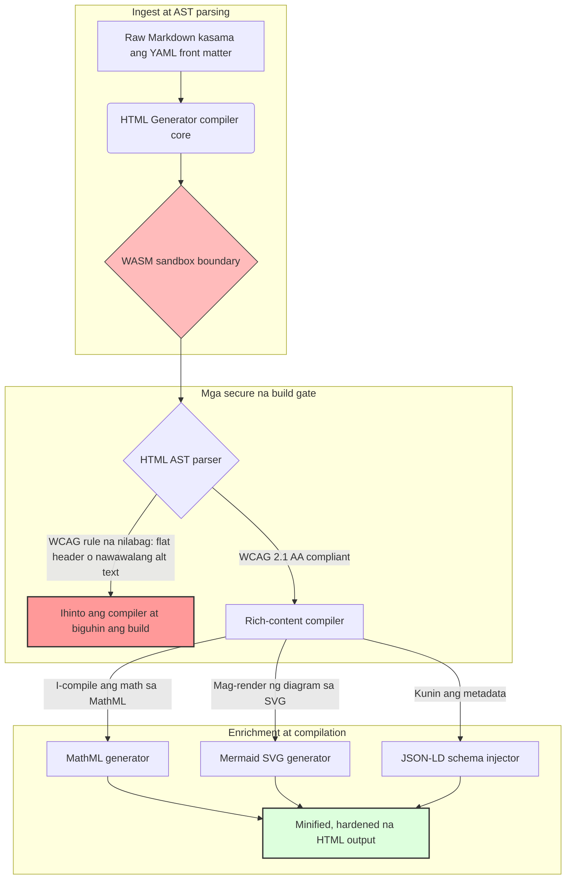

---

# Front Matter (YAML)

author: "contact@sebastienrousseau.com (Sebastien Rousseau)"
banner_alt: "Arkitekturang heometriya sa ilalim ng nakabalangkas na liwanag — sumasalamin sa papel ng HTML Generator bilang compile-gated na pipeline mula Markdown patungong HTML para sa naa-access, handa sa SEO, at sandboxed na imprastraktura ng paglalathala"
banner_height: "1597"
banner_width: "2584"
banner: "https://cloudcdn.pro/stocks/images/markus-winkler-IrRbSND5EUc-unsplash-1200.webp"
cdn: "https://cloudcdn.pro"
charset: "UTF-8"
cname: "sebastienrousseau.com"
copyright: "© Copyright 2025 - 2026 - Sebastien Rousseau. All rights reserved."
date: "June 20, 2026"
description: "Ang HTML Generator ay isang Rust library na nagko-convert ng Markdown tungo sa WCAG-compliant, SEO-ready, JSON-LD-enriched na HTML — accessibility-as-code, suporta sa MathML at Mermaid, at WebAssembly-sandboxed na pagpapatakbo para sa ligtas na enterprise publishing."
format-detection: "telephone=no"
hreflang: "fil"
icon: "https://cloudcdn.pro/clients/sebastienrousseau/v1/logos/sebastienrousseau.svg"
id: "https://sebastienrousseau.com/2026-06-20-html-generator-accessible-seo-structured-markdown-rust-2026"
image_alt: "Itim at Puting Larawan ni Sebastien Rousseau"
image_height: "162"
image_width: "162"
image: "https://cloudcdn.pro/stocks/images/sebastienrousseau.webp"
keywords: "html-generator, Rust Markdown to HTML, accessibility as code, WCAG 2.1 AA, SEO-ready HTML, JSON-LD, MathML, Mermaid, WebAssembly, EAA, DORA, ADA Title III, accessible publishing, sandboxed parsing, open source"
language: "fil-PH"
last_reviewed: "2026-06-20"
layout: "report"
locale: "fil_PH"
logo_alt: "Logo ni Sebastien Rousseau"
logo_height: "44"
logo_width: "44"
logo: "https://cloudcdn.pro/clients/sebastienrousseau/v1/logos/sebastienrousseau.svg"
menu: ""
measurementID: "G-169G4ET5HQ"
name: "Sebastien Rousseau"
permalink: "https://sebastienrousseau.com/2026-06-20-html-generator-accessible-seo-structured-markdown-rust-2026"
rating: "general"
referrer: "no-referrer"
robots: "index, follow"
schema: "FAQPage, Article"
seo_title: "Accessibility-as-Code: Markdown patungong AAA HTML gamit ang Rust sa 2026"
short_name: "sebastienrousseau"
subtitle: "Binabago ang corporate web publishing, dokumentasyon ng produkto, at mga portal ng kliyente mula sa hindi naa-access na text file patungong highly structured, compliant, at sandboxed na digital na asset."
tags: "html-generator, Rust, Markdown, accessibility, WCAG, SEO, JSON-LD, MathML, Mermaid, WebAssembly, EAA, DORA, ADA, AI-discovery, RAG, open source, banking infrastructure"
theme-color: "0, 83, 191"
title: "Pag-convert ng Markdown tungo sa Naa-access, Handa sa SEO, at Nakabalangkas na HTML gamit ang Rust sa 2026"
url: "https://sebastienrousseau.com/2026-06-20-html-generator-accessible-seo-structured-markdown-rust-2026"
viewport: "width=device-width, initial-scale=1, shrink-to-fit=no"

# RSS - The RSS feed front matter (YAML).
atom_link: "https://sebastienrousseau.com/2026-06-20-html-generator-accessible-seo-structured-markdown-rust-2026/rss.xml"
category: "Technology"
docs: https://validator.w3.org/feed/docs/rss2.html
generator: "Static Site Generator (SSG) (version 0.0.40)"
item_description: "Ang HTML Generator ay isang Rust library na nagko-convert ng Markdown tungo sa WCAG-compliant, SEO-ready, JSON-LD-enriched na HTML — accessibility-as-code, suporta sa MathML at Mermaid, at WebAssembly-sandboxed na pagpapatakbo para sa ligtas na enterprise publishing."
item_guid: "https://sebastienrousseau.com/2026-06-20-html-generator-accessible-seo-structured-markdown-rust-2026/rss.xml"
item_link: "https://sebastienrousseau.com/2026-06-20-html-generator-accessible-seo-structured-markdown-rust-2026/rss.xml"
item_pub_date: "Sat, 20 Jun 2026 06:06:06 +0000"
item_title: "Pag-convert ng Markdown tungo sa Naa-access, Handa sa SEO, at Nakabalangkas na HTML gamit ang Rust sa 2026"
last_build_date: "Sat, 20 Jun 2026 06:06:06 +0000"
managing_editor: "contact@sebastienrousseau.com (Sebastien Rousseau)"
pub_date: "Sat, 20 Jun 2026 06:06:06 +0000"
ttl: "60"
type: "article"
webmaster: "contact@sebastienrousseau.com"

# Apple - The Apple front matter (YAML).
apple_mobile_web_app_orientations: "portrait"
apple_touch_icon_sizes: "192x192"
apple-mobile-web-app-capable: "yes"
apple-mobile-web-app-status-bar-inset: "black"
apple-mobile-web-app-status-bar-style: "black-translucent"
apple-mobile-web-app-title: "Markdown patungong AAA HTML gamit ang Rust"
apple-touch-fullscreen: "yes"

# MS Application - The MS Application front matter (YAML).

msapplication-navbutton-color: "0, 83, 191"

# Twitter Card - The Twitter Card front matter (YAML).

twitter_card: "summary_large_image"
twitter_creator: "@wwdseb"
twitter_description: "Ang HTML Generator ay isang Rust library na nagko-convert ng Markdown tungo sa WCAG-compliant, SEO-ready, JSON-LD-enriched na HTML — accessibility-as-code, suporta sa MathML at Mermaid, at WebAssembly-sandboxed na pagpapatakbo para sa ligtas na enterprise publishing."
twitter_image: "https://cloudcdn.pro/clients/sebastienrousseau/v1/logos/sebastienrousseau.svg"
twitter_image_alt: "Logo ni Sebastien Rousseau"
twitter_site: "@wwdseb"
twitter_title: "Accessibility-as-Code: Markdown patungong AAA HTML gamit ang Rust"
twitter_url: "https://sebastienrousseau.com/2026-06-20-html-generator-accessible-seo-structured-markdown-rust-2026"

# Humans.txt - The Humans.txt front matter (YAML).
author_website: "https://sebastienrousseau.com"
author_twitter: "@wwdseb"
author_location: "London, UK"
thanks: "Salamat sa pagbabasa!"
site_last_updated: "2026-06-20"
site_standards: "HTML5, CSS3, RSS, Atom, JSON, XML, YAML, Markdown, TOML"
site_components: "Kaishi, Kaishi Builder, Kaishi CLI, Kaishi Templates, Kaishi Themes"
site_software: "Static Site Generator, Rust"

---

# Pag-convert ng Markdown tungo sa Naa-access, Handa sa SEO, at Nakabalangkas na HTML gamit ang Rust sa 2026

<!-- lead-start -->
<aside class="post-lead" aria-label="Buod ng artikulo">

<strong>TL;DR.</strong> Ang HTML Generator ay isang purong Rust na Markdown-to-HTML compiler na nagpapatupad ng WCAG 2.1 AA sa oras ng build, nag-iinjection ng schema-compliant na JSON-LD, nagre-render ng MathML at Mermaid SVG nang natively, at nagiisolate ng pag-parse sa loob ng WebAssembly sandbox — ginagawang compile-gated na control plane ang paglalathala para sa accessibility, SEO, at seguridad ng ICT.

<strong>Mga pangunahing punto</strong>

<ul class="post-lead-takeaways">
  <li><strong>Mabilis na sagot.</strong> Ano ang HTML Generator sa isang pangungusap?</li>
  <li><strong>Executive summary.</strong> Mukhang simple ang pag-render ng Markdown; ang pagkuha ng publishing-grade na HTML nang tama ay isang problema sa compliance.</li>
  <li><strong>01. Bakit mahalaga ang accessibility-first HTML compiler sa 2026.</strong> Ginawa ng EAA at ADA Title III ang accessibility na mula sa engineering hygiene patungong fiduciary na pananagutan.</li>
  <li><strong>02. Ang arkitektura ng HTML Generator sa 2026.</strong> Isang multi-stage, compiler-gated na pipeline mula sa raw Markdown hanggang sa hardened na HTML output.</li>
</ul>

<strong>Kaugnay na pagbabasa:</strong> <a href="https://sebastienrousseau.com/2026-06-18-noyalib-safe-yaml-rust-ai-mcp-financial-infrastructure-2026">Bakit Kailangan ng YAML ng Mas Ligtas na Rust Stack para sa AI, MCP, at Imprastraktura ng Pananalapi sa 2026</a>, <a href="https://sebastienrousseau.com/2026-06-17-static-site-generator-secure-default-ai-era-publishing-2026">Isang Secure-by-Default na Static Site Generator para sa AI-Era Publishing sa 2026</a>, <a href="https://sebastienrousseau.com/2026-06-11-cloudcdn-open-source-blueprint-ai-native-edge-2026">CloudCDN: Isang Open-Source Blueprint para sa AI-Native Edge sa 2026</a>.

</aside>
<!-- lead-end -->

Sa 2026, ang web content ay kasing daming kinokonsumo ng mga AI search crawler, LLM-backed na search engine, at Retrieval-Augmented Generation (RAG) pipeline kumpara sa mga human reader. Ang flat o malformed na HTML ay nakakasagabal sa machine discoverability, habang ang pagkabigo na sumunod sa mahigpit na pandaigdigang regulasyon tulad ng [European Accessibility Act (EAA)](https://www.accessibility-act.eu/) at [US ADA Title III](https://www.ada.gov/topics/title-iii/) ay malinaw na civil liability na ngayon. Ang [HTML Generator](https://github.com/sebastienrousseau/html-generator) ay isang high-performance na Rust library na dinisenyo upang tugunan ang mga pagkukulang na iyon — sa compiler, hindi sa mga post-deployment patch.

## Mabilis na sagot

**Ano ang HTML Generator sa isang pangungusap?** Ang HTML Generator ay isang open-source, purong Rust na Markdown-to-HTML compiler na nagpapatupad ng [WCAG 2.1 AA](https://www.w3.org/TR/WCAG21/) sa oras ng build, awtomatikong nagge-generate ng semantic landmark at ARIA attribute, nag-iinjection ng schema-compliant na [JSON-LD](https://json-ld.org/) metadata mula sa YAML front matter, nagre-render ng Mermaid diagram at matematika sa accessible na SVG at MathML, at tumatakbo sa loob ng [WebAssembly](https://webassembly.org/) sandbox — ginagawang compile-gated, fiduciary-grade na control plane ang corporate publishing.

## Executive summary

Mukhang simple ang pag-render ng Markdown. Ang publishing-grade na HTML ay isang problema sa compliance. Noong Hunyo 2026, bawat corporate touchpoint — investor relations portal, regulatory filing, dokumentasyon ng customer, API reference, marketing estate — ay pine-parse ng parehong tao at makina. Dalawang presyon ang nagtatagpo sa bawat pahina: ginagawa ng [EAA](https://www.accessibility-act.eu/) at [ADA Title III](https://www.ada.gov/topics/title-iii/) ang accessibility na isang board-level na legal na exposure, habang ang AI ingestion at RAG pipeline ay nagbibigay-gantimpala sa nakabalangkas, machine-readable na output. Ang mga karaniwang Markdown library ay gumagawa ng flat na HTML na nabibigo sa parehong gate. Tinatrato ng HTML Generator ang document generation bilang compile-gated na pipeline: ang WCAG validation ay isang build error, ang JSON-LD ay nagmumula sa YAML front matter nang walang manual na pag-stamp, nagre-render nang accessible ang MathML at Mermaid, at ang buong engine ay nagpapadala bilang WebAssembly target upang ang pag-parse ng mga hindi pinagkakatiwalaang dokumento ay mananatiling sandboxed mula sa host.

## Mga pangunahing punto

- **Ang accessibility-as-code ay ang bagong baseline.** Inaatasan ng EAA ang accessibility para sa mga consumer digital service. Sinusuri ng HTML Generator ang document tree sa oras ng compile, awtomatikong nagge-generate ng semantic landmark at ARIA attribute — mas kaunting post-deployment na pag-aayos, mas maliit na remediation budget, walang nawawalang alt-text na napadala sa produksyon.
- **Nakabalangkas na data para sa AI discovery.** Ang modernong search at RAG ay nakasalalay sa machine-readable na metadata. Ina-parse ng compiler ang YAML front matter at direktang nag-iinjection ng [Schema.org-compliant na JSON-LD](https://schema.org/) sa document head, na ginagawang ganap na naiintindihan ang content ng [Google Rich Results](https://developers.google.com/search/docs/appearance/structured-data/intro-structured-data), [Bing Webmaster](https://www.bing.com/webmasters), at mga LLM-backed crawler.
- **Kahusayan sa teknikal na nilalaman.** Ang teknikal na paglalathala ay hindi flat na teksto. Kino-compile ng HTML Generator ang mga raw Markdown math extension patungong accessible na [MathML](https://www.w3.org/Math/), at nagre-render ng [Mermaid.js](https://mermaid.js.org/) diagram sa responsive na SVG — parehong nagpapanatili ng WCAG-compliant na istruktura kaysa sa pagbagsak sa mga hindi malinaw na imahe.
- **WebAssembly sandboxing.** Ang pag-parse ng hindi pinagkakatiwalaang Markdown ay isang panganib sa seguridad. Sa pamamagitan ng pag-target ng [WASM](https://webassembly.org/), nagpapatakbo ang HTML Generator sa loob ng isang isolated na sandbox na pumipigil sa arbitrary code execution at nagpoprotekta sa host system — direktang natutugunan ang mga obligasyon sa seguridad ng ICT ng [DORA Article 6](https://eur-lex.europa.eu/legal-content/EN/TXT/?uri=CELEX%3A32022R2554).
- **Fiduciary na proteksyon para sa mga board.** Ang teknikal na hindi pagsunod ay lumipat na sa boardroom. Ang pag-standardize sa compiler-gated na HTML engine ay nagpoprotekta sa mga direktor at senior management mula sa personal na civil at regulatory na exposure sa ilalim ng DORA, EAA, at ADA Title III.

**Kaugnay na pagbabasa:** [Bakit Kailangan ng YAML ng Mas Ligtas na Rust Stack para sa AI, MCP, at Imprastraktura ng Pananalapi sa 2026](https://sebastienrousseau.com/2026-06-18-noyalib-safe-yaml-rust-ai-mcp-financial-infrastructure-2026/), [Isang Secure-by-Default na Static Site Generator para sa AI-Era Publishing sa 2026](https://sebastienrousseau.com/2026-06-17-static-site-generator-secure-default-ai-era-publishing-2026/), [CloudCDN: Isang Open-Source Blueprint para sa AI-Native Edge sa 2026](https://sebastienrousseau.com/2026-06-11-cloudcdn-open-source-blueprint-ai-native-edge-2026/).

## 01. Bakit Mahalaga ang Accessibility-First HTML Compiler sa 2026

Ang mga corporate web estate, dokumentasyon library, at help center ng produkto ay kritikal na digital touchpoint. Napapailalim na ngayon ang mga ito sa dalawang matinding magkakaugnay na presyon.

Ang una ay **AI ingestion at discoverability**. Ang nilalaman ay lalong pinoproseso ng mga large language model at Retrieval-Augmented Generation pipeline. Ang flat o malformed na HTML ay nagliligaw sa crawler parsing, na nag-iiwan ng corporate research at dokumentasyon na hindi nakikita ng modernong paradigm ng search — kabilang ang [Google Search Generative Experience](https://blog.google/products/search/generative-ai-search/), [ChatGPT](https://chat.openai.com/) browsing, at enterprise RAG agent.

Ang pangalawa ay **mahigpit na pandaigdigang batas sa accessibility**. Sa ilalim ng [European Accessibility Act](https://www.accessibility-act.eu/) (ganap na naaangkop mula Hunyo 2025) at [US ADA Title III](https://www.ada.gov/topics/title-iii/), ang mga corporate publishing platform ay dapat garantiyahan ang kumpletong digital accessibility. Ang pagkabigo na matugunan ang [WCAG 2.1 AA](https://www.w3.org/TR/WCAG21/) ay hindi na isang engineering oversight; ito ay isang civil at regulatory na pananagutan na nagresulta sa milyun-milyong dolyar na settlements.

Tinutugunan ng [HTML Generator](https://github.com/sebastienrousseau/html-generator) ang parehong presyon nang direkta. Ito ay isang thread-safe na Rust library na dinisenyo upang i-transform ang Markdown sa accessible, SEO-ready, nakabalangkas na HTML. Sa pamamagitan ng pagtrato sa document generation bilang compiler-gated na pipeline, naghahatid ang engine ng mataas na **Return on Resilience (RoR)** — nagpoprotekta sa mga balanse mula sa accessibility litigation habang pinapalaki ang machine-readability para sa AI discovery.

## 02. Ang Arkitektura ng HTML Generator sa 2026

Ang framework ay idinisenyo bilang isang ligtas, multi-stage na compilation pipeline na nagko-convert ng raw Markdown text sa cryptographically verified, highly accessible na static asset.

### Talahanayan 1: Mga layer ng arkitektura ng HTML Generator at pagpapagaan ng panganib

| Layer | Desisyon sa disenyo | Bakit ito mahalaga | Panganib kung hindi pinamamahalaan |
| ---- | ---- | ---- | ---- |
| **Input layer** | Markdown kasama ang YAML front matter parser | Tinutugunan ang mga manunulat kung nasaan sila; pinaghihiwalay ang prosa mula sa structural metadata. | Hindi pare-parehong metadata, sirang sitemap, gaps sa indexing. |
| **Structure layer** | Automated Table of Contents at semantic landmark na may ARIA tag | Gumagawa ng navigable, accessible na document tree sa pamamagitan ng konstruksyon. | Flat na HTML na sumisira sa screen reader at lumalabag sa WCAG. |
| **Rich-content layer** | Native na MathML at Mermaid.js SVG rendering | Kino-compile ang formula at diagram sa accessible na SVG at MathML. | Client-side na JS rendering lag at sirang assistive-technology output. |
| **SEO at data layer** | Integrated na JSON-LD at structured-metadata generation | Direktang nag-iinjection ng [Schema.org](https://schema.org/) compliant na JSON-LD sa head. | Maling pagbabasa ng search engine at AI crawler sa may-akda, konteksto, lisensya. |
| **Runtime layer** | Native na Rust compiler na may WebAssembly target | Nagbibigay-daan sa ligtas, sandboxed na pagpapatakbo sa server, edge node, at browser. | Arbitrary code execution sa panahon ng pag-parse ng hindi pinagkakatiwalaang Markdown. |

## 03. Mga Pangunahing Signal ng Web Security at Accessibility

Upang ma-verify na ang mga pampublikong digital asset ay nakakatugon sa modernong regulatory at security audit, ang mga senior technology officer ay dapat subaybayan ang mga tiyak, mabibilang na sukatan.

### Talahanayan 2: Mga signal ng web security at accessibility

| Signal | Sukatan / operational benchmark | EAA / DORA / W3C reference | Teknikal na implementasyon |
| ---- | ---- | ---- | ---- |
| **Accessibility conformance** | 100% ng mga compiled na pahina na na-validate laban sa mga panuntunan ng WCAG 2.1 AA. | [EAA](https://www.accessibility-act.eu/) at [ADA Title III](https://www.ada.gov/topics/title-iii/) | Build-time na HTML parser na sinusuri ang image alt tag at semantic landmark. |
| **WASM execution sandbox** | 100% ng mga hindi pinagkakatiwalaang Markdown input na na-compile sa isolated na WebAssembly runtime. | [DORA Article 6](https://eur-lex.europa.eu/legal-content/EN/TXT/?uri=CELEX%3A32022R2554) (seguridad ng ICT) | Isolation ng parsing environment mula sa host server. |
| **Structured-metadata coverage** | 100% ng mga nai-publish na artikulo na naka-inject ng valid, schema-compliant na JSON-LD header. | Mga detalye ng [Schema.org](https://schema.org/) | Awtomatikong pag-parse ng front-matter at conversion sa JSON-LD object. |
| **Compilation throughput** | Target na pahina-kada-segundo na higit sa 10,000 sa commodity hardware. | Return on Resilience (RoR) | Lubos na parallel na Rust AST compiler. |
| **Rich-snippet verification** | Zero parsing error sa [Google Rich Results](https://search.google.com/test/rich-results) at [Schema validator](https://validator.schema.org/) na run. | Mga alituntunin ng Google Search | Structural validation ng generated na JSON-LD sa panahon ng build pipeline. |

## 04. Ang Mito ng Simple na Markdown Rendering

Isang karaniwang maling kuru-kuro sa mga technology manager na ang pag-convert ng Markdown sa HTML ay isang simpleng text-replacement na ehersisyo. Maraming karaniwang library ang nagsasalin ng Markdown formatting sa flat, unstructured na HTML. Nagre-render ang output sa isang sighted reader sa browser, ngunit kumakatawan ito sa isang compliance trap.

Karaniwang kulang ang flat na HTML sa tatlong bagay.

1. **Tamang heading hierarchy.** Hindi nagpapatupad ng heading order ang karaniwang Markdown. Ang paglukso mula sa isang `<h1>` patungong `<h4>` ay lumalabag sa WCAG 2.1 AA at sinisira ang document navigation para sa mga screen reader.
2. **Malinaw na table semantic.** Ang mga karaniwang Markdown table ay bihirang i-render nang may tamang `<th>` scope at `<tbody>` attribute na kinakailangan para sa accessible na pag-parse.
3. **Machine-readable na metadata.** Kulang ang karaniwang HTML ng mga JSON-LD hook na pinagkakautangan ng modernong AI search platform at RAG ingest system.

Niresolba ito ng HTML Generator sa pamamagitan ng pag-parse ng Markdown sa isang **Abstract Syntax Tree (AST)**. Sinusuri ng engine ang istruktura ng dokumento bago mag-emit ng HTML, nagva-validate ng heading nesting, nag-iinjecting ng naaangkop na ARIA attribute, at nagsisiguro na ang bawat media asset ay may alternatibong teksto — ginagawang mula sa manual audit patungong garantisadong compile-time invariant ang accessibility.

## 05. Pagdidisenyo ng Accessibility-as-Code Build Pipeline

Upang maiwasang maabot ng mga hindi naa-access o hindi naka-index na asset ang pampublikong deployment, ang accessibility ay dapat maging mahigpit na compiler gate. Ipinapakita ng sumusunod na pipeline kung paano sinusuri ng HTML Generator ang Markdown, nagpapatakbo ng WebAssembly-isolated na validation, at nag-eemit ng hardened, nakabalangkas na HTML.

## 06. Ang Boardroom Playbook at Fiduciary Liability

Ang modernong accessibility at web-security compliance ay hindi maaaring ipagpaliban na mga isyu sa boardroom. Ang senior management ay dapat lumapit sa publishing infrastructure sa pamamagitan ng lens ng legal na panganib, pangangalaga ng pananalapi, at regulatory exposure.

- **Ang European Accessibility Act (EAA).** Nagpapataw ng direkta, legally binding na compliance mandate sa mga pampubliko at pribadong digital portal. Ang hindi pagsunod ay maaaring magdulot ng malubhang multa sa pananalapi, civil litigation, at agarang pag-aalis ng asset mula sa EU market. Sa pamamagitan ng pag-integrate ng accessibility-as-code, maaaring sertipikahan ng mga board na ang hindi compliant na code ay hindi kayang ipadala — pinapalitan ang reaktibong remediation ng structural na legal na kalasag.
- **DORA Article 6 (Secure ICT Environments).** Nagtatakda ng mahigpit na panuntunan para sa seguridad ng ICT environment. Sa pamamagitan ng pag-isolate ng Markdown compilation sa loob ng WebAssembly sandbox, tinitiyak ng mga organisasyon na ang pag-parse ng dokumentasyong na-upload ng customer o partner feed ay hindi makapag-expose ng host server sa arbitrary code execution, nagpoprotekta ng kritikal na banking portal.
- **Pagbabawas ng gastos sa compliance audit.** Ang tradisyonal na accessibility compliance ay nakasalalay sa mahal, retrospective na post-deployment audit — sampung libo hanggang daan-daang libong dolyar bawat taon bawat site. Ang pagpapatupad ng WCAG validation bilang compile-time block ay inaalis ang mga retrospective na gastos na iyon, inililipat ang compliance budget mula sa depensa patungong inobasyon.

## 07. Ano ang Ibig Sabihin Nito Ayon sa Uri ng Bangko / Enterprise

### Global Systemically Important Bank (G-SIB)

Nagpapatakbo ang mga G-SIB ng malawak, multilingual na pampublikong estate na nag-lalathala ng libu-libong research paper, regulatory disclosure, at investor-relations na dokumento sa maraming hurisdiksyon. Ang kanilang hamon ay scale at multi-language na pagkakatugma. Ang WebAssembly target ng HTML Generator at high-throughput na Rust engine ay nagbibigay-daan sa malalaking naka-localize na research library na mabilis na ma-update, ma-compile, at ma-deploy sa buong mundo — nang walang rendering lag o accessibility regression.

### Transaction at Corporate Bank

Para sa mga transaction bank, ang mga customer portal, documentation hub, at developer API guide ay kritikal na digital touchpoint. Ang pag-compile ng mga asset na iyon sa pamamagitan ng HTML Generator ay nangangahulugang ang mga client-facing channel ay walang XSS exposure, walang dependency-hijack vector, at walang accessibility deficit — pinapanatili ang institutional trust at binabawasan ang litigation surface.

### Regional na Bangko at Fintech

Ang mga regional na bangko at agile na fintech ay nagkokompetensya sa digital experience nang walang G-SIB engineering budget. Binibigyan ng HTML Generator ang mga team na iyon ng enterprise-grade na publishing pipeline out of the box, na nagbibigay-daan sa mas maliliit na estate na mag-ship ng accessible, SEO-ready, sandboxed na asset na kayang tiisin ang pagmamasid ng parehong regulator at potensyal na corporate client.

## 08. Ang Publishing Infrastructure Roadmap

Ang mga corporate pampublikong web estate ay isang pangunahing bahagi ng operational resilience. Ang pag-asa sa mabagal, dynamically vulnerable, database-backed na web engine — o unsigned na static asset — ay isang hindi katanggap-tanggap na panganib sa negosyo.

Upang ma-secure ang mga pampublikong digital touchpoint at maprotektahan ang mga balanse mula sa accessibility litigation, ang senior technology at security manager ay dapat magsagawa ng malinaw na roadmap.

1. **Lumipat sa static na arkitektura.** I-phase out ang mga legacy dynamic CMS platform para sa research, marketing, at dokumentasyon na estate. Ilipat ang nilalaman sa mga compiler-gated na pipeline tulad ng HTML Generator.
2. **Ipatupad ang accessibility sa oras ng build.** Ipatupad ang accessibility-as-code. Biguin ang mga compilation pipeline nang awtomatiko sa anumang paglabag sa WCAG 2.1 AA.
3. **Isolahin ang pag-parse sa WebAssembly.** I-sandbox ang lahat ng pag-parse ng dokumento at nilalaman sa loob ng WASM runtime upang ang hindi pinagkakatiwalaang input ay hindi kailanman makaabot sa host system.
4. **Mag-inject ng rich na JSON-LD metadata.** Tiyaking ang bawat nai-publish na asset ay may schema-compliant na JSON-LD header upang mapakinabangan ang AI discoverability.

## 09. Mga Madalas Itanong

**Paano nagpapatupad ang HTML Generator ng accessibility?**

Ina-parse nito ang generated na HTML Abstract Syntax Tree sa oras ng build, sinusuri ang dokumento laban sa mga panuntunan ng [WCAG 2.1 AA](https://www.w3.org/TR/WCAG21/). Kung nilalabag ang isang panuntunan — isang nawawalang alt attribute, isang heading skip, isang walang label na form control — ihihinto ng compiler ang build, tinatrato ang accessibility bilang compile-time invariant kaysa sa post-deployment audit task.

**Bakit mahalaga ang WebAssembly isolation?**

Nagbibigay-daan ang [WebAssembly](https://webassembly.org/) sa Markdown parsing engine na mag-execute sa loob ng isolated na sandbox, nakahiwalay mula sa host server. Kahit mag-upload ang isang marahas na aktor ng crafted na Markdown na dokumento na dinisenyo upang samantalahin ang mga kahinaan ng parser, ang pagpapatakbo ay nabitag — nagpoprotekta sa host system at nakakatugon sa mga obligasyon sa seguridad ng ICT ng DORA Article 6.

**Paano nakikinabang ang JSON-LD sa search discoverability sa 2026?**

Nagbibigay ang [JSON-LD](https://json-ld.org/) ng nakabalangkas, machine-readable na metadata sa document head. Agad na kinilala ng [Google Rich Results](https://developers.google.com/search/docs/appearance/structured-data/intro-structured-data), Bing crawler, at LLM-backed search agent ang may-akda, lisensya, petsa ng publikasyon, at semantic context — nilalampasan ang kalabuan ng karaniwang HTML at pinapalaki ang surface area sa AI-driven discovery.

**Sino ang target na gumagamit ng HTML Generator?**

Mga static-site builder, dokumentasyon team, teknikal na manunulat, Rust developer, at platform engineer na nagpapadala ng accessibility-critical o regulator-facing na estate. Ito rin ay isang angkop na content-processing layer sa loob ng mas malalaking secure-publishing pipeline tulad ng [Static Site Generator (SSG)](https://github.com/sebastienrousseau/static-site-generator).

## 10. Mga Sanggunian

- World Wide Web Consortium (W3C), 2024. [Web Content Accessibility Guidelines (WCAG) 2.1 ⧉](https://www.w3.org/TR/WCAG21/ "Mga Alituntunin ng Web Content Accessibility 2.1").
- Schema.org, 2026. [Mga detalye ng structured-data ng Schema.org ⧉](https://schema.org/ "Mga detalye ng structured-data ng Schema.org").
- European Parliament and Council of the European Union, 2022. [Regulation (EU) 2022/2554 sa digital operational resilience para sa sektor ng pananalapi (DORA) ⧉](https://eur-lex.europa.eu/legal-content/EN/TXT/?uri=CELEX%3A32022R2554 "DORA Regulation").
- European Commission, 2025. [European Accessibility Act ⧉](https://www.accessibility-act.eu/ "European Accessibility Act").
- US Department of Justice, 2024. [ADA Title III ⧉](https://www.ada.gov/topics/title-iii/ "ADA Title III").
- WebAssembly Community Group, 2026. [Detalye ng WebAssembly ⧉](https://webassembly.org/ "WebAssembly").
- GitHub, 2026. [Repository ng HTML Generator ⧉](https://github.com/sebastienrousseau/html-generator "HTML Generator open-source repository").

<!-- enrich-start -->
<aside class="author-card" aria-label="Tungkol sa may-akda"><strong class="author-card-name"><a href="/about/index.html">Sebastien Rousseau</a></strong>Senior banking technologist na sumusulat tungkol sa applied AI, payments infrastructure, tokenised money, ISO 20022, post-quantum security, cloud-native financial services, open-source infrastructure, at regulated digital market.20+ taon sa HSBC Commercial &amp; Investment Bank, PayPal, Barclays, Shazam, AKQA, Virgin Group. <a href="/about/index.html">Kumpletong profile</a> &middot; <a href="https://www.linkedin.com/in/sebastienrousseau/" rel="external noopener">LinkedIn</a> &middot; <a href="https://github.com/sebastienrousseau" rel="external noopener">GitHub</a></aside>

Huling sinuri <time datetime="2026-06-20">2026-06-20</time>.

<!-- enrich-end -->
