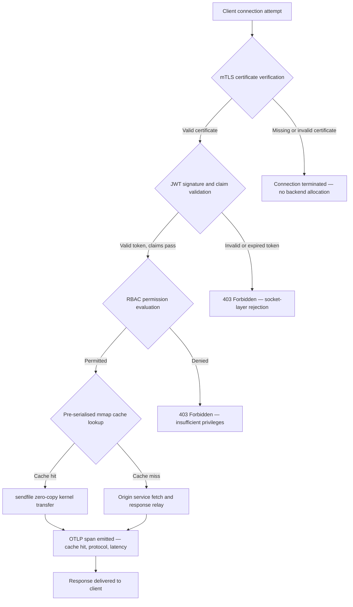

---

# Front Matter (YAML)

author: "contact@sebastienrousseau.com (Sebastien Rousseau)"
banner_alt: "Abstraktong gabi na cityscape ng circuit-board — nagpapakita ng banking edge kung saan nagtatagpo ang kernel-level zero-copy transfers, mTLS handshakes, at JWT validation sa isang statically linked binary"
banner_height: "1597"
banner_width: "2584"
banner: "https://cloudcdn.pro/stocks/images/bit-cloud-GlqbGLCPnQ4.webp"
cdn: "https://cloudcdn.pro"
charset: "UTF-8"
cname: "sebastienrousseau.com"
copyright: "© Copyright 2025 - 2026 - Sebastien Rousseau. All rights reserved."
date: "June 20, 2026"
description: "Ang http-handle ay isang statically linked na Rust binary na naghahatid ng 180,000 kahilingan bawat segundo sa banking edge nang walang runtime dependencies, na may integrated mTLS at JWT validation, ALPN-negotiated HTTP/2 at HTTP/3, at OTLP observability — na tinatapatan ang mga security at resilience gaps na iniwan ng Nginx at Envoy."
format-detection: "telephone=no"
hreflang: "fil"
icon: "https://cloudcdn.pro/clients/sebastienrousseau/v1/logos/sebastienrousseau.svg"
id: "https://sebastienrousseau.com/2026-06-20-http-handle-zero-dependency-edge-ingress-banking-rust-2026"
image_alt: "Black at White na Larawan ni Sebastien Rousseau"
image_height: "162"
image_width: "162"
image: "https://cloudcdn.pro/stocks/images/sebastienrousseau.webp"
keywords: "http-handle, Rust edge ingress, zero dependency proxy, imprastraktura ng bangko, mTLS JWT, sendfile zero-copy, ALPN HTTP3, DORA compliance, Basel III, OTLP observability, static binary, ARM64 banking, zero trust banking, magaan na ingress, Rust banking security"
language: "fil-PH"
last_reviewed: "2026-06-20"
layout: "report"
locale: "fil_PH"
logo_alt: "Logo ni Sebastien Rousseau"
logo_height: "44"
logo_width: "44"
logo: "https://cloudcdn.pro/clients/sebastienrousseau/v1/logos/sebastienrousseau.svg"
menu: ""
measurementID: "G-169G4ET5HQ"
name: "Sebastien Rousseau"
permalink: "https://sebastienrousseau.com/2026-06-20-http-handle-zero-dependency-edge-ingress-banking-rust-2026"
rating: "general"
referrer: "no-referrer"
robots: "index, follow"
schema: "FAQPage, Article"
seo_title: "http-handle: Zero-Dependency Rust Ingress para sa Banking sa 180k req/s"
short_name: "sebastienrousseau"
subtitle: "Paano naghahatid ang isang statically linked na Rust binary ng 180,000 kahilingan bawat segundo na may mTLS, JWT, at ALPN sa banking edge — at ano ang kahulugan nito para sa DORA at Basel III compliance."
tags: "http-handle, Rust, banking, edge-ingress, mTLS, JWT, ALPN, HTTP3, DORA, Basel-III, zero-copy, sendfile, ARM64, zero-trust, OTLP, observability, open-source, infrastructure"
theme-color: "0, 83, 191"
title: "http-handle: High-Performance, Zero-Dependency Edge Ingress para sa Banking noong 2026"
url: "https://sebastienrousseau.com/2026-06-20-http-handle-zero-dependency-edge-ingress-banking-rust-2026"
viewport: "width=device-width, initial-scale=1, shrink-to-fit=no"

# RSS - The RSS feed front matter (YAML).
atom_link: "https://sebastienrousseau.com/2026-06-20-http-handle-zero-dependency-edge-ingress-banking-rust-2026/rss.xml"
category: "Technology"
docs: https://validator.w3.org/feed/docs/rss2.html
generator: "Static Site Generator (SSG) (version 0.0.40)"
item_description: "Ang http-handle ay isang statically linked na Rust binary na naghahatid ng 180,000 kahilingan bawat segundo sa banking edge nang walang runtime dependencies, na may integrated mTLS at JWT validation, ALPN-negotiated HTTP/2 at HTTP/3, at OTLP observability — na tinatapatan ang mga security at resilience gaps na iniwan ng Nginx at Envoy."
item_guid: "https://sebastienrousseau.com/2026-06-20-http-handle-zero-dependency-edge-ingress-banking-rust-2026/rss.xml"
item_link: "https://sebastienrousseau.com/2026-06-20-http-handle-zero-dependency-edge-ingress-banking-rust-2026/rss.xml"
item_pub_date: "Sat, 20 Jun 2026 07:07:07 +0000"
item_title: "http-handle: High-Performance, Zero-Dependency Edge Ingress para sa Banking noong 2026"
last_build_date: "Sat, 20 Jun 2026 07:07:07 +0000"
managing_editor: "contact@sebastienrousseau.com (Sebastien Rousseau)"
pub_date: "Sat, 20 Jun 2026 07:07:07 +0000"
ttl: "60"
type: "article"
webmaster: "contact@sebastienrousseau.com"

# Apple - The Apple front matter (YAML).
apple_mobile_web_app_orientations: "portrait"
apple_touch_icon_sizes: "192x192"
apple-mobile-web-app-capable: "yes"
apple-mobile-web-app-status-bar-inset: "black"
apple-mobile-web-app-status-bar-style: "black-translucent"
apple-mobile-web-app-title: "Zero-Dependency Banking Edge"
apple-touch-fullscreen: "yes"

# MS Application - The MS Application front matter (YAML).

msapplication-navbutton-color: "0, 83, 191"

# Twitter Card - The Twitter Card front matter (YAML).

twitter_card: "summary_large_image"
twitter_creator: "@wwdseb"
twitter_description: "Ang http-handle ay isang statically linked na Rust binary na naghahatid ng 180,000 kahilingan bawat segundo sa banking edge nang walang runtime dependencies, na may mTLS, JWT, at OTLP observability."
twitter_image: "https://cloudcdn.pro/clients/sebastienrousseau/v1/logos/sebastienrousseau.svg"
twitter_image_alt: "Logo of Sebastien Rousseau"
twitter_site: "@wwdseb"
twitter_title: "http-handle: Zero-Dependency Rust Ingress para sa Banking sa 180k req/s"
twitter_url: "https://sebastienrousseau.com/2026-06-20-http-handle-zero-dependency-edge-ingress-banking-rust-2026"

# Humans.txt - The Humans.txt front matter (YAML).
author_website: "https://sebastienrousseau.com"
author_twitter: "@wwdseb"
author_location: "London, UK"
thanks: "Thanks for reading!"
site_last_updated: "2026-06-20"
site_standards: "HTML5, CSS3, RSS, Atom, JSON, XML, YAML, Markdown, TOML"
site_components: "Kaishi, Kaishi Builder, Kaishi CLI, Kaishi Templates, Kaishi Themes"
site_software: "Static Site Generator, Rust"

---

# http-handle: High-Performance, Zero-Dependency Edge Ingress para sa Banking noong 2026

<!-- lead-start -->
<aside class="post-lead" aria-label="Buod ng artikulo">

<strong>Buod.</strong> Ang http-handle ay isang open-source, statically linked na Rust binary na pumapalit sa Nginx at Envoy sa banking edge. Naghahatid ito ng 180,000 kahilingan bawat segundo sa mga ARM64 node sa pamamagitan ng Linux <code>sendfile(2)</code> zero-copy transfers, nagpapatupad ng mTLS at JWT validation sa network socket layer bago tumakbo ang anumang application code, awtomatikong ninenosiyo ang HTTP/2 at HTTP/3 sa pamamagitan ng ALPN, at nag-eemit ng mga OpenTelemetry metric nang natively — lahat nang walang runtime dependencies na higit pa sa <code>libc</code>.

<strong>Mga pangunahing punto</strong>

<ul class="post-lead-takeaways">
  <li><strong>Ang problema ng mabigat na proxy.</strong> Ang Nginx at Envoy ay nagdadala ng mga dependency tree na nagpapalawak ng CVE surface at nagpapalubha ng mga DORA ICT-risk remediation cycle.</li>
  <li><strong>Zero-copy performance sa sukat.</strong> Ang mga pre-serialized mmap cache block at <code>sendfile(2)</code> kernel transfer ay nagpapanatili ng 180,000 req/s sa ARM64 na may sub-millisecond proxy overhead.</li>
  <li><strong>Seguridad sa socket, hindi sa application.</strong> Ang mTLS client verification, JWT validation, at RBAC evaluation ay nakumpleto bago maglaan ng anumang backend resource sa kahilingan.</li>
  <li><strong>Ang regulatory alignment ay built-in.</strong> Ang nabawasang attack surface at ang naa-audit na single-binary deployment ay direktang tumutugon sa DORA Articles 5 at 6, Basel III operational risk, at SM&CR accountability chains.</li>
</ul>

<strong>Kaugnay na pagbabasa:</strong> <a href="https://sebastienrousseau.com/2026-06-18-noyalib-safe-yaml-rust-ai-mcp-financial-infrastructure-2026">Bakit Kailangan ng YAML ang isang Mas Ligtas na Rust Stack para sa AI, MCP, at Financial Infrastructure noong 2026</a>, <a href="https://sebastienrousseau.com/2026-06-11-cloudcdn-open-source-blueprint-ai-native-edge-2026">CloudCDN: Isang Open-Source Blueprint para sa AI-Native Edge noong 2026</a>, <a href="https://sebastienrousseau.com/2026-05-16-best-cloud-infrastructure-architecture-2026">Pinakamahusay na Cloud Infrastructure Architecture para sa mga Bangko at Financial Institution noong 2026</a>.

</aside>
<!-- lead-end -->

Ang banking edge ay may problema sa dependency. Bawat instance ng Nginx o Envoy na nagro-route ng trapiko sa pagitan ng isang kliyente at isang core banking service ay nagdadala ng isang dependency tree: mga OpenSSL build, Lua module, gRPC library, at mga container layer — bawat isa ay potensyal na CVE, bawat isa ay nangangailangan ng dedikadong patching cycle, bawat isa ay nagdadagdag ng latency variance na nagpapalubha ng SLA measurement. Sa ilalim ng [Digital Operational Resilience Act (DORA)](https://eur-lex.europa.eu/eli/reg/2022/2554/oj), ang kompleksidad na iyon ay isang regulatory liability na katulad ng isang operational na isa.

Ang [http-handle](https://github.com/sebastienrousseau/http-handle) ay gumagamit ng ibang diskarte. Ito ay isang solong, statically linked na Rust binary na walang runtime dependencies na higit pa sa `libc`. Naghahatid ito ng 180,000 kahilingan bawat segundo sa mga ARM64 node, nagpapatupad ng mutual TLS at JWT authentication sa network socket layer, at awtomatikong ninenosiyo ang HTTP/2 at HTTP/3 — lahat sa loob ng isang deployment footprint na wala pang 20 MB ng RAM.

## Mabilis na sagot

**Ano ang http-handle sa isang pangungusap?** Ang http-handle ay isang open-source, statically linked na Rust binary na pumapalit sa mabibigat na proxy container sa banking edge, naghahatid ng 180,000 req/s sa ARM64 sa pamamagitan ng Linux `sendfile(2)` zero-copy kernel transfer, nagpapatupad ng mTLS, JWT, at RBAC sa socket layer bago mahawakan ang anumang backend resource, at nag-eemit ng native na [OpenTelemetry](https://opentelemetry.io/) metric — nang walang runtime library dependency na higit pa sa `libc`.

## Executive summary

Ang mga bangko ay nagpatakbo ng Nginx at Envoy sa kanilang edge sa loob ng isang dekada. Parehong may kakayahan; wala sa kanila ang idinisenyo para sa regulatory environment ng 2026. Ang mga container image na puno ng dependency ay naglilikha ng mga CVE queue na hindi mabilis na nalilinis ng mga compliance team, at ang bawat library version bump ay may kasamang regression risk. Ang DORA Articles 5 at 6 ay nangangailangan na ang ICT risk ay pinamamahalaan ng disenyo, hindi na-patch pagkatapos ng pagtuklas. Ang mga framework ng operational risk ng Basel III ay nagpaparusa sa mga arkitektura kung saan ang mga punto ng pagkabigo ay dumadami kasabay ng pagiging kumplikado ng sistema.

Inaalis ng http-handle ang problema ng dependency sa pinagmulan. Ang binary ay naipagsama nang isang beses, statically, nang walang mga panlabas na kinakailangan sa library sa runtime. Ang attack surface ay lumiliit sa Rust standard library kasama ang `libc`. Ang security enforcement — mTLS certificate verification, JWT claim validation, at role-based access control — ay naisasagawa sa network socket bago ang anumang backend allocation, binibigo ang Zero Trust perimeter sa pinakamaliit nitong posibleng ekspresyon. Ang performance ay sumusunod sa arkitektura: ang mga pre-serialized memory-mapped cache block na pinagsama sa `sendfile(2)` kernel transfer ay ganap na nag-aalis ng data mula sa CPU-to-memory copy path, nagpapanatili ng 180,000 req/s sa ARM64 hardware. Ang resulta ay isang ingress layer na nakakatugon sa mga kinakailangan ng DORA resilience, sumusuporta sa mga argumento ng pagbabawas ng operational risk ng Basel III, at nagbibigay sa mga senior IT leader sa ilalim ng SM&CR ng isang nave-verify na, single-component accountability chain para sa edge infrastructure.

## Mga pangunahing punto

- **Mas maliit na binary, mas maikling CVE queue.** Ang isang statically linked na single binary ay may isang pakete na i-patch, isang release na i-validate, at isang artifact na ia-audit. Ang Nginx na may standard module set ay lumalabas na may mahigit 30 shared library dependency; ang bawat isa ay nagdadala ng sarili nitong vulnerability lifecycle.
- **Ang zero-copy ay hindi isang optimization — ito ay isang design constraint.** Sa 180,000 req/s, ang anumang user-space data copy ay nagdadagdag ng nasusukat na latency variance. Inililipat ng `sendfile(2)` ang mga nilalaman ng file descriptor — o isang memory-mapped na rehiyon — sa isang network socket file descriptor, ganap sa loob ng kernel. Kasama ng mga mmap-pinned response cache block, ang CPU ay hindi kailanman humahawak sa data path para sa mga naka-cache na tugon.
- **Ang security perimeter ay kabilang sa socket.** Ang pag-validate ng mga JWT at mTLS certificate sa application middleware ay nangangahulugang ang backend ay naglaan na ng mga thread at memory bago tanggihan ang kahilingan. Ang socket-layer validation ay tinitiyak na ang mga hindi authenticated na kahilingan ay walang kinukuhang backend resource.
- **Inaalis ng OTLP ang observability gap.** Ang native na integrasyon ng OpenTelemetry ay nangangahulugang ang bawat kahilingan, bawat authentication decision, at bawat protocol negotiation ay gumagawa ng structured telemetry nang walang sidecar agent. Direktang nag-ingest ang mga kasalukuyang bank dashboard ng mga OTLP trace.

**Kaugnay na pagbabasa:** [Bakit Kailangan ng YAML ang isang Mas Ligtas na Rust Stack para sa AI, MCP, at Financial Infrastructure noong 2026](https://sebastienrousseau.com/2026-06-18-noyalib-safe-yaml-rust-ai-mcp-financial-infrastructure-2026/), [CloudCDN: Isang Open-Source Blueprint para sa AI-Native Edge noong 2026](https://sebastienrousseau.com/2026-06-11-cloudcdn-open-source-blueprint-ai-native-edge-2026/), [Pinakamahusay na Cloud Infrastructure Architecture para sa mga Bangko at Financial Institution noong 2026](https://sebastienrousseau.com/2026-05-16-best-cloud-infrastructure-architecture-2026/).

## 01. Ang Problema ng Mabigat na Proxy sa Banking

Itinayo ng Nginx at Envoy ang edge ng modernong internet. Parehong nako-configure, nasubok sa labanan, at sinusuportahan ng malalaking komunidad. Mga pagpili rin sila ng arkitektura na ginawa bago umiral ang DORA, bago ang mga framework ng operational risk ng Basel III ay nag-demand ng quantifiable na pagbabawas ng kumplikado, at bago binago ng mga ARM64 cloud node ang ekonomiya ng high-throughput computing.

Ang praktikal na resulta ay isang agwat sa pagitan ng kailangan ng mga bangko at ng inihahatid ng mga mabibigat na proxy container.

**Dependency surface.** Ang isang karaniwang Envoy deployment ay gumagamit ng OpenSSL, Abseil, Protobuf, gRPC, Lua, at dose-dosenang pangalawang library. Ang bawat isa ay nagdadala ng isang independiyenteng CVE lifecycle. Kapag nag-publish ang National Vulnerability Database ng isang kritikal na OpenSSL advisory, ang bawat instance ng Envoy sa estate ay nagiging isang compliance clock: suriin, i-patch, subukan, muling i-deploy, at muling i-certify — sa bawat kapaligiran kung saan tumatakbo ang binary. Sa ilalim ng DORA Article 6, kailangang ipakita ng mga bangko na ang mga proseso ng pamamahala ng ICT risk ay proporsyonal, naka-dokumento, at nave-verify. Ang isang multi-library dependency tree ay nagpapamahal ng pagpapanatili ng demonstrasyong iyon.

**Memory overhead.** Ang isang minimally configured na Nginx worker process ay kumukonsumo ng 40–80 MB ng resident memory sa ilalim ng katamtamang load. Sa sukat — daan-daang ingress node sa mga trading system, payment API, at mga portal na nakaharap sa customer — ang overhead na iyon ay nagiging isang nasusukat na gastos sa imprastraktura nang walang katumbas na benepisyo sa performance kaysa sa isang well-engineered single-binary na alternatibo.

**Patching velocity.** Ang mga container-image supply chain ay nagpapakilala ng multi-day na lag sa pagitan ng isang CVE publication at isang validated patch na umabot sa production. Ang base image ay kailangang muling itayo, ang application layer ay muling i-layer, ang buong test matrix ay muling patakbuhin, at ang deployment pipeline ay muling isagawa. Para sa mga kritikal na banking system na nag-ooperate sa ilalim ng mga DORA incident reporting window, ang cycle na ito ay isang structural risk.

Tinutugunan ng http-handle ang lahat ng tatlo. Isang binary. Isang CVE surface. Isang artifact na i-patch. Wala pang 20 MB ng RAM para sa isang production ingress node.

## 02. Ang http-handle 2026 Architecture Lens

Ang binary ay nakabalangkas bilang limang magkakaugnay na layer, bawat isa ay idinisenyo upang alisin ang isang partikular na kategorya ng risk na naiiipon ng mga tradisyonal na proxy arkitektura.

### Talahanayan 1: Mga layer ng arkitektura ng http-handle at pagbabawas ng risk

| Layer | Desisyon sa disenyo | Bakit ito mahalaga | Risk kung hindi maayos na pinamamahalaan |
| ---- | ---- | ---- | ---- |
| **Server core** | Solong Rust binary, statically linked, zero dependency higit pa sa `libc` | Isang artifact na i-patch; inaaalis ang pagpapakalat ng library CVE sa buong estate | Mga dependency confusion attack; akumulasyon ng library vulnerability |
| **Acceleration engine** | Pre-serialized mmap cache block at `sendfile(2)` zero-copy kernel transfer | 180,000 req/s sa ARM64 na may sub-millisecond proxy overhead; walang data na pumapasok sa user space para sa mga naka-cache na tugon | Mga memory-mapping leak; kernel-space bottleneck sa ilalim ng cache invalidation |
| **Cryptographic security** | Native mTLS na may hot-reload certificate support at ALPN negotiation | Tinitiyak ang integridad ng data at compatibility ng protocol; pag-ikot ng certificate nang walang mga drop na koneksyon | Pag-expire ng certificate na nagdudulot ng mga service outage; mahinang cipher suite default |
| **Access policy plane** | Socket-layer JWT validation at RBAC claim evaluation | Ang mga hindi authenticated na kahilingan ay walang kinukuhang backend resource; Zero Trust na ipinapatupad sa kernel boundary | Mga JWT algorithm confusion attack; RBAC misconfiguration na nagbibigay ng labis na pribilehiyong access |
| **Observability** | Native [OpenTelemetry (OTLP)](https://opentelemetry.io/docs/specs/otlp/) integration | Structured telemetry nang walang sidecar agent; direktang ingestion sa mga kasalukuyang bank monitoring estate | Mga blind spot sa panahon ng outage; hindi kumpleto na audit trail para sa DORA incident reporting |

## 03. Mga Pangunahing Signal ng Performance at Seguridad

Ang mga bangkong nag-ooperate ng http-handle sa edge ay kailangang mag-instrument ng limang quantifiable na signal upang matugunan ang mga kinakailangan ng DORA operational reporting at internal na SLA governance.

### Talahanayan 2: Mga operational benchmark at regulatory reference

| Signal | Benchmark | Regulatory reference | Technical implementation |
| ---- | ---- | ---- | ---- |
| **Throughput** | ≥ 180,000 req/s sa mga ARM64 node sa P99 ≤ 1 ms proxy overhead | Basel III operational risk — pagbabawas ng kumplikado ng sistema | `sendfile(2)` + mmap pre-serialized cache block; walang user-space data copy para sa mga cache hit |
| **Attack surface** | Zero runtime library dependency; isang binary artifact bawat release | [DORA Article 6](https://eur-lex.europa.eu/eli/reg/2022/2554/oj) — ICT risk management sa pamamagitan ng disenyo | Static compilation na may `cargo build --release --target aarch64-unknown-linux-musl` |
| **Authentication latency** | mTLS handshake + JWT validation na nakumpleto bago ang unang byte ng backend response | [DORA Article 5](https://eur-lex.europa.eu/eli/reg/2022/2554/oj) — ICT security protection | Socket-layer interception; JWT claim evaluation sa kernel-adjacent Rust bago ang backend routing |
| **Certificate availability** | Hot-reload ng mga mTLS certificate na may zero dropped na koneksyon sa panahon ng pag-ikot | SM&CR senior management accountability para sa edge availability | inotify-driven na certificate watcher; atomic file-descriptor swap sa panahon ng reload |
| **Observability coverage** | 100% ng mga kahilingang gumagawa ng mga OTLP span na may authentication outcome, protocol version, at cache status | DORA Article 17 — incident detection at reporting | Native OTLP exporter; walang sidecar na kinakailangan; gRPC o HTTP/Protobuf transport na nako-configure |

## 04. Ang Zero-Copy Engine: mmap at sendfile(2)

Ang network performance sa high-frequency banking — real-time payment, market-data API, authentication token service — ay limitado ng isang constraint higit sa anumang iba pa: ang gastos ng paglipat ng mga byte mula sa storage patungo sa network socket.

Ang mga conventional na HTTP server ay nagbabasa ng mga nilalaman ng file sa isang user-space buffer, pagkatapos ay isinusulat ang buffer na iyon sa socket. Ang sequence na iyon ay nangangailangan ng dalawang memory copy at dalawang context switch sa pagitan ng user space at kernel space para sa bawat tugon. Sa 180,000 kahilingan bawat segundo, ang naipon na overhead ay malaki.

Inaalis ng http-handle ang parehong kopya.

**Mga memory-mapped na cache block.** Kapag nagsimula ang serbisyo, ino-serialize nito ang static na nilalaman ng tugon sa mga memory-mapped na rehiyon gamit ang `mmap(2)`. Ang mga rehiyong ito ay nakakabit sa kernel's page cache. Kapag dumating ang isang kahilingan para sa isang naka-cache na resource, ang tugon ay naka-map na sa kernel memory — walang pagbabasa ng disk, walang buffer allocation.

**`sendfile(2)` kernel transfer.** Ang Linux `sendfile(2)` system call ay naglilipat ng data nang direkta mula sa isang file descriptor — o isang memory-mapped na rehiyon — sa isang network socket file descriptor, ganap sa loob ng kernel. Walang byte na pumapasok sa user space. Ang papel ng CPU ay nababawasan sa pag-issue ng system call at paghawak sa completion event. Sa mga ARM64 node na may arkitektura na ito, pinapanatili ng http-handle ang 180,000 req/s sa sub-millisecond proxy overhead sa ilalim ng napapanatiling load.

Para sa mga bangkong nagpapatakbo ng month-end batch reconciliation, intraday liquidity reporting, o real-time fraud-scoring API traffic, ang engineering consequence ay direkta: mas kaunting ARM64 node bawat traffic tier, mas mababang gastos sa imprastraktura, at mas maliit na DORA resilience risk mula sa mga kakulangan sa kapasidad.

## 05. Ang mTLS at JWT Access Policy Plane

Sa banking, ang authentication sa edge ay hindi isang feature — ito ay isang regulatory requirement. Inuutos ng DORA na ang mga ICT security control ay proporsyonal, naka-dokumento, at nave-verify. Inilalagay ng SM&CR ang personal na pananagutan para sa mga desisyon sa seguridad ng imprastraktura sa mga nabanggit na senior manager. Ang tanong ay hindi kung mag-a-authenticate sa edge, kundi sa aling layer.

Nagpapatupad ang http-handle ng isang three-stage Zero Trust policy bago maglaan ng anumang backend resource.

**Stage 1: mTLS client certificate verification.** Sa panahon ng TLS handshake, hinihingi at bine-validate ng http-handle ang client certificate laban sa isang configurable na trust store. Ang mga koneksyon nang walang valid na certificate ay tinatapusin sa handshake. Walang application thread na nispawn, walang memory pool na inilaan. Hindi kailanman nakikita ng backend ang kahilingan.

**Stage 2: JWT claim validation.** Para sa mga koneksyong pumasa sa mTLS, kinukuha at bine-validate ng http-handle ang JSON Web Token mula sa `Authorization` header sa socket layer. Ang signature verification, expiry check, at issuer validation ay nagaganap bago maabot ng kahilingan ang routing layer. Ang mga JWT algorithm confusion attack — kung saan tinatanggap ng server ang isang symmetric algorithm kapag inaasahan ang isang asymmetric key — ay hinaharangan ng explicit na algorithm allow-listing sa configuration.

**Stage 3: RBAC claim evaluation.** Ang mga validated JWT claim ay nagma-map sa isang in-memory role table. Ang mga kahilingang may hindi sapat na mga pahintulot ay tumatanggap ng 403 na tugon sa access policy plane. Ang backend service ay hindi kailanman na-invoke para sa hindi awtorisadong trapiko.

Ang pagkakasunud-sunod na ito ay mahalaga sa operasyon. Sa ilalim ng tradisyonal na modelo — kung saan ang authentication ay tumatakbo sa application middleware — maaaring mapagod ng isang umaatake ang mga backend thread pool ng mga hindi authenticated na kahilingan bago mag-isyu ng isang pagtanggi. Ganap na binibigo ng socket-layer authentication ang attack vector na iyon.

## 06. ALPN Routing at ang HTTP/3 Fallback Chain

Ang banking traffic ay dumarating sa iba't ibang kondisyon ng network: corporate fibre para sa mga trading desk, 5G para sa mga mobile banking client, satellite connectivity para sa mga remote na operasyon, at mga TLS inspection proxy sa mga regulated na kapaligiran. Ang isang single-protocol ingress ay lumilikha ng pinakamababang common denominator na constraint.

Gumagamit ang http-handle ng [Application-Layer Protocol Negotiation (ALPN)](https://www.rfc-editor.org/rfc/rfc7301) upang awtomatikong pumili ng pinakamainam na protocol para sa bawat koneksyon.

**HTTP/2** ang default para sa browser at API traffic sa TCP. Ang mga multiplexed stream sa isang solong koneksyon ay nag-aalis ng head-of-line blocking na ipinapakilala ng HTTP/1.1 sa ilalim ng mga concurrent request pattern.

**HTTP/3 (QUIC)** ay nag-a-activate kapag sinusuportahan ng network ang UDP at nag-a-advertise ang client ng `h3` sa ALPN extension nito. Ang independent stream multiplexing at connection migration ng QUIC ay nagpapalabas na mas mahusay ito para sa mga mobile banking client sa mga congested na cellular network kung saan madalas na bumabagsak at muling kumokonekta ang mga TCP connection.

**Graceful fallback.** Kung mabigo ang ALPN negotiation — dahil ang isang intermediate proxy ay nag-strip ng extension o inalis ito ng isang legacy client — ang http-handle ay bumabagsak sa HTTP/1.1 habang pinapanatili ang lahat ng security header, mTLS enforcement, at JWT validation. Walang security property na nagde-degrade sa panahon ng protocol fallback.

## 07. Ang Zero-Copy Request Lifecycle

Ipinapakita ng sumusunod na diagram ang kumpletong request path mula sa client connection hanggang sa response delivery, kabilang ang mga authentication gate at observability emission point.

Ang kritikal na path para sa mga cache-hit na tugon ay tumatawid ng tatlong security gate at isang system call. Walang user-space buffer na inilaan para sa response body. Kinukuha ng OTLP span ang authentication outcome, ang ALPN-negotiated protocol version, ang cache status, at ang end-to-end latency sa isang solong structured na tala.

## 08. Regulatory Alignment: DORA, Basel III, at SM&CR

### DORA Articles 5 at 6 — ICT risk management at proteksyon

Inaatasan ng [DORA Article 5](https://eur-lex.europa.eu/eli/reg/2022/2554/oj) ang mga financial entity na mapanatili ang mga framework ng pamamahala ng ICT risk. Inaatasan sila ng Article 6 na magpatupad ng mga hakbang sa proteksyon at pag-iwas na proporsyonal sa risk profile ng kanilang mga ICT system.

Ang isang statically linked na single binary ay mas mahusay na nakakatugon sa parehong kinakailangan kaysa sa isang multi-library container stack. Ang attack surface ay quantifiable — isang artifact, isang dependency (`libc`), isang CVE surface — at ang mga hakbang sa proteksyon ay structural kaysa procedural: ang mTLS at JWT enforcement ay hindi maaaring i-bypass ng misconfiguration dahil naisakatuparan ang mga ito sa socket layer bago tumakbo ang anumang nako-configure na application logic.

### Basel III — Mga kinakailangan sa kapital para sa operational risk

Iniuugnay ng [operational risk framework ng Basel III](https://www.bis.org/bcbs/basel3.htm) ang mga regulatory capital requirement sa demonstrable na pagbabawas ng risk. Ang mga bangkong makakapag-dokumento ng nasusukat na pagbaba sa kumplikado ng sistema at bilang ng ICT failure point ay may quantifiable na argumento para sa nabawasang operational risk capital allocation. Ang pagpapalit ng isang multi-container proxy estate ng mga single-binary ingress node ay tiyak na uri ng pagbabawas ng kumplikado na sumusuporta sa argumentong ito — basta ang engineering team ay makakagawa ng attestation documentation.

Ang mga naa-audit na release artifact ng http-handle — ang mga reproducible build, SBOM-compatible na dependency manifest, at OTLP-based na operational log — ay sumusuporta sa documentation chain na kinakailangan ng mga Basel III capital discussion.

### SM&CR — Senior manager accountability

Inilalagay ng [Senior Managers and Certification Regime (SM&CR)](https://www.fca.org.uk/firms/senior-managers-certification-regime) ang personal na pananagutan sa mga nabanggit na senior manager para sa ICT security posture ng mga sistema sa ilalim ng kanilang accountability. Ang isang single-binary ingress na nag-ho-hot-reload ng mga certificate nang walang service interruption, gumagawa ng structured audit log sa pamamagitan ng OTLP, at may isang version-pinned artifact bawat deployment ay nagbibigay sa nabanggit na senior manager ng isang nave-verify na, naidokumentong security chain. Ang isang multi-library container stack ay hindi.

## 09. Ano ang Kahulugan Nito Ayon sa Papel

### Lupon ng mga direktor at mga chief executive

Ang regulatory capital optimization sa ilalim ng mga framework ng operational risk ng Basel III ay nakasalalay sa demonstrable na pagbabawas ng kumplikado. Ang pagpapalit ng Nginx o Envoy ng isang solong statically linked na binary ay nagpapababa ng bilang ng ICT failure point sa paraang naa-audit at maipapakita sa mga prudential regulator. Ang nabawasang CVE surface ay sumusuporta rin sa muling pakikipag-negosasyon ng premium ng cyber-insurance — ang mga insurer ay nagpepresyo batay sa demonstrable na attack-surface metric, at ang isang single-dependency ingress binary ay isang kongkretong data point.

### Mga chief information security officer at chief risk officer

Ang DORA compliance ay nangangailangan na ang mga hakbang sa proteksyon ng ICT ay proporsyonal at nave-verify. Ang socket-layer mTLS at JWT enforcement ay nagbibigay ng nave-verify na, hindi maaaring i-bypass na authentication gate sa edge. Ang hot-reload certificate rotation ay nag-aalis ng service-window risk na dinadala ng mga tradisyonal na certificate update. Ang zero-dependency compilation model ay nangangahulugang kapag na-publish ang isang kritikal na `libc` advisory, ang buong estate ay maaaring muling itayo, subukan, at muling i-deploy mula sa isang solong Rust source artifact sa loob ng ilang oras sa halip na ilang araw.

### Engineering at IT management

Ang 180,000 req/s sa isang standard na ARM64 node ay binabago ang pag-uusap sa infrastructure-sizing para sa mga payment API at authentication service. Ang native na integrasyon ng OTLP ay nag-aalis ng pangangailangan para sa mga Prometheus exporter, sidecar agent, o custom na log shipper. Ang Kubernetes deployment model ay isang standard na pod — wala pang 20 MB ng RAM, walang privileged na container permission, walang host-network access. Ang certificate hot-reload ay nag-ooperate nang walang Kubernetes rolling-restart overhead.

## Mga Madalas Itanong

**Paano pinamamahalaan ng http-handle ang certificate rotation sa ilalim ng load?**
Minomonitor ng binary ang mga path ng certificate file gamit ang isang inotify watcher. Kapag natukoy ang mga bagong certificate at key file, nagsasagawa ito ng atomic swap ng aktibong TLS context — ang mga kasalukuyang koneksyon ay kumukumpleto gamit ang nakaraang certificate habang ang mga bagong koneksyon ay agad na gumagamit ng na-rotate na isa. Walang koneksyon na nahuhulog. Walang service window na kinakailangan.

**Maaari bang tumakbo ang http-handle sa loob ng isang Kubernetes cluster bilang ingress controller?**
Oo. Tumatakbo ang binary bilang isang standalone pod na may standard na ingress service annotation. Ang mga kinakailangan sa resource ay wala pang 20 MB ng RAM sa buong throughput, nang walang privileged na container permission at walang kinakailangan sa host-network access. Maaari rin itong tumakbo bilang isang sidecar sa mga service mesh kung saan ang mTLS enforcement sa sidecar layer ay mas pinipili kaysa sa centralized gateway authentication.

**Ano ang nasusukat na kontribusyon ng latency ng proxy mismo?**
Para sa mga cache-hit na tugon, ang proxy overhead — mula sa socket accept hanggang sa `sendfile(2)` completion — ay sub-millisecond sa ARM64 hardware. Para sa mga cache-miss na tugon na nangangailangan ng upstream fetch, ang overhead ay ang parehong sub-millisecond na numero kasama ang origin response time. Hindi nagdadagdag ang proxy mismo ng queuing latency dahil ang authentication ay nagaganap nang synchronously sa socket layer nang walang thread-pool allocation bago makumpleto ang credential validation.

**Paano naaangkop ang http-handle sa isang Zero Trust architecture kasama ang isang kasalukuyang API gateway?**
Nag-ooperate ang http-handle sa OSI Layer 4/7 boundary: nagpapatupad ito ng transport-layer mTLS at nagva-validate ng application-layer JWT bago mag-route sa mga upstream service. Maaari itong umupo sa harap ng isang buong API gateway — sumisipsip ng hindi authenticated na trapiko bago ito maabot ang mas mahal na processing layer ng gateway — o ganap na palitan ang gateway para sa mga serbisyo na ang access policy ay ganap na maaaring ipahayag sa mga JWT claim.

**Ang binary output ba ay reproducible para sa mga layunin ng supply-chain audit?**
Oo. Ang build ay reproducible na may pinned na Rust toolchain version at naka-lock na `Cargo.lock`. Ang SBOM generation sa pamamagitan ng `cargo cyclonedx` ay gumagawa ng isang CycloneDX-compatible na bill of materials para sa bawat release. Parehong artifact ay maaaring i-publish sa internal na software composition analysis toolchain ng bangko at nakakatugon sa mga kinakailangan ng DORA supply-chain risk documentation.

## Konklusyon

Ang banking edge ay hindi nangangailangan ng mas maraming feature — kailangan nito ng mas kaunting component, bawat isa ay gumagawa ng mas kaunti at ginagawa ito nang nave-verify. Binabawasan ng http-handle ang ingress layer sa pinakamaliit nitong irreducible: isang solong Rust binary na nagpapatupad ng authentication sa socket, naglilipat ng data nang hindi ito kinokopya, at nag-uulat ng lahat ng ginagawa nito sa structured telemetry. Para sa mga bangkong nagna-navigate ng mga timeline ng DORA compliance, mga review ng Basel III capital optimization, at mga kinakailangan ng SM&CR accountability, ang pagiging simple na iyon ay hindi isang kagustuhan sa engineering — ito ay isang regulatory argument.

Ang [source code ng http-handle](https://github.com/sebastienrousseau/http-handle) ay available sa ilalim ng dual MIT at Apache 2.0 na lisensya.

---

*Mga Sanggunian*

Basel Committee on Banking Supervision (2011). *Basel III: A global regulatory framework for more resilient banks and banking systems*. Bank for International Settlements. Available at: [https://www.bis.org/publ/bcbs189.pdf](https://www.bis.org/publ/bcbs189.pdf)

European Parliament and Council (2022). Regulation (EU) 2022/2554 on digital operational resilience for the financial sector (DORA). Available at: [https://eur-lex.europa.eu/legal-content/EN/TXT/?uri=CELEX:32022R2554](https://eur-lex.europa.eu/legal-content/EN/TXT/?uri=CELEX:32022R2554)

Financial Conduct Authority (2015). *Senior Managers and Certification Regime (SM&CR)*. Available at: [https://www.fca.org.uk/firms/senior-managers-certification-regime](https://www.fca.org.uk/firms/senior-managers-certification-regime)

Internet Engineering Task Force (2014). *RFC 7301: Transport Layer Security (TLS) Application-Layer Protocol Negotiation Extension*. Available at: [https://www.rfc-editor.org/rfc/rfc7301](https://www.rfc-editor.org/rfc/rfc7301)

OpenTelemetry Authors (2024). *OpenTelemetry Protocol Specification (OTLP)*. Available at: [https://opentelemetry.io/docs/specs/otlp/](https://opentelemetry.io/docs/specs/otlp/)
