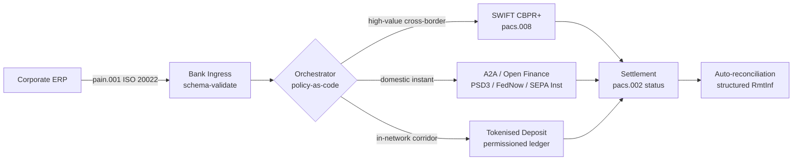

---

# Front Matter (YAML)

author: "contact@sebastienrousseau.com (Sebastien Rousseau)"
banner_alt: "Container ship sa isang deepwater port sa madaling-araw — sumisimbolo sa multi-rail, cross-border na paggalaw ng corporate value sa ISO 20022, open finance, at tokenised-deposit settlement networks sa 2026"
banner_height: "1597"
banner_width: "2584"
banner: "https://cloudcdn.pro/stocks/images/viktor-forgacs-KxVRDiFdTVo.webp"
cdn: "https://cloudcdn.pro"
charset: "UTF-8"
cname: "sebastienrousseau.com"
copyright: "© Copyright 2025 - 2026 - Sebastien Rousseau. All rights reserved."
date: "Hunyo 24, 2026"
description: "Paano binabago ng ISO 20022, A2A, open finance sa ilalim ng PSD3/FiDA, at tokenised deposits ang cross-border corporate treasury kasabay ng SWIFT sa 2026."
format-detection: "telephone=no"
hreflang: "fil"
icon: "https://cloudcdn.pro/clients/sebastienrousseau/v1/logos/sebastienrousseau.svg"
id: "https://sebastienrousseau.com/2026-06-24-cross-border-iso-20022-open-finance-tokenised-deposits-treasury-2026"
image_alt: "Black and White Portrait of Sebastien Rousseau"
image_height: "162"
image_width: "162"
image: "https://cloudcdn.pro/stocks/images/sebastien-rousseau.png"
keywords: "cross-border payments, ISO 20022, open finance, PSD3, FiDA, tokenised deposits, stablecoins, A2A, treasury, CIB, Nexi, Mastercard, multi-rail, pacs.008, pain.001, SWIFT, FedNow, SEPA Instant, RTP, CBPR+"
language: "fil-PH"
last_reviewed: "2026-06-24"
layout: "report"
locale: "fil_PH"
logo_alt: "Logo for Sebastien Rousseau"
logo_height: "44"
logo_width: "44"
logo: "https://cloudcdn.pro/clients/sebastienrousseau/v1/logos/sebastienrousseau.svg"
menu: ""
measurementID: "G-169G4ET5HQ"
name: "Sebastien Rousseau"
permalink: "https://sebastienrousseau.com/2026-06-24-cross-border-iso-20022-open-finance-tokenised-deposits-treasury-2026"
rating: "general"
referrer: "no-referrer"
robots: "index, follow"
schema: "FAQPage, Article"
seo_title: "Cross-Border 2026: ISO 20022, Open Finance, Tokenised Rails"
short_name: "sebastienrousseau"
subtitle: "Ang cross-border corporate treasury sa 2026 ay tumatakbo sa multi-rail na mechanics — ang ISO 20022 ang common grammar, ang A2A at open finance ang customer-facing rail, ang tokenised deposits ang wholesale settlement leg, habang ang SWIFT pa rin ang nag-aangkla sa long tail."
tags: "cross-border payments, ISO 20022, open finance, PSD3, FiDA, tokenised deposits, A2A, treasury, CIB, multi-rail, pacs.008, pain.001, SWIFT, FedNow, SEPA Instant, RTP, CBPR+"
theme-color: "0, 83, 191"
title: "Cross-Border 2026: ISO 20022, Open Finance at Tokenised Deposits sa Corporate Treasury"
url: "https://sebastienrousseau.com/2026-06-24-cross-border-iso-20022-open-finance-tokenised-deposits-treasury-2026"
viewport: "width=device-width, initial-scale=1, shrink-to-fit=no"

# RSS - The RSS feed front matter (YAML).
atom_link: "https://sebastienrousseau.com/2026-06-24-cross-border-iso-20022-open-finance-tokenised-deposits-treasury-2026/rss.xml"
category: "Technology"
docs: https://validator.w3.org/feed/docs/rss2.html
generator: "Static Site Generator (SSG) (version 0.0.26)"
item_description: "Paano binabago ng ISO 20022, A2A, open finance sa ilalim ng PSD3/FiDA, at tokenised deposits ang cross-border corporate treasury kasabay ng SWIFT sa 2026."
item_guid: "https://sebastienrousseau.com/2026-06-24-cross-border-iso-20022-open-finance-tokenised-deposits-treasury-2026/rss.xml"
item_link: "https://sebastienrousseau.com/2026-06-24-cross-border-iso-20022-open-finance-tokenised-deposits-treasury-2026/rss.xml"
item_pub_date: "Wed, 24 Jun 2026 07:07:07 +0000"
item_title: "Cross-Border 2026: ISO 20022, Open Finance at Tokenised Deposits sa Corporate Treasury"
last_build_date: "Wed, 24 Jun 2026 06:06:06 +0000"
managing_editor: "contact@sebastienrousseau.com (Sebastien Rousseau)"
pub_date: "Wed, 24 Jun 2026 07:07:07 +0000"
ttl: "60"
type: "article"
webmaster: "contact@sebastienrousseau.com"

# Apple - The Apple front matter (YAML).
apple_mobile_web_app_orientations: "portrait"
apple_touch_icon_sizes: "192x192"
apple-mobile-web-app-capable: "yes"
apple-mobile-web-app-status-bar-inset: "black"
apple-mobile-web-app-status-bar-style: "black-translucent"
apple-mobile-web-app-title: "Cross-Border 2026: ISO 20022, Open Finance, Tokenised Rails"
apple-touch-fullscreen: "yes"

# MS Application - The MS Application front matter (YAML).

msapplication-navbutton-color: "0, 83, 191"

# Twitter Card - The Twitter Card front matter (YAML).

twitter_card: "summary_large_image"
twitter_creator: "@wwdseb"
twitter_description: "Paano binabago ng ISO 20022, A2A, open finance sa ilalim ng PSD3/FiDA, at tokenised deposits ang cross-border corporate treasury kasabay ng SWIFT sa 2026."
twitter_image: "https://cloudcdn.pro/clients/sebastienrousseau/v1/logos/sebastienrousseau.svg"
twitter_image_alt: "Logo of Sebastien Rousseau"
twitter_site: "@wwdseb"
twitter_title: "Cross-Border 2026: ISO 20022, Open Finance, Tokenised Rails"
twitter_url: "https://sebastienrousseau.com/2026-06-24-cross-border-iso-20022-open-finance-tokenised-deposits-treasury-2026"

excerpt: "Ang cross-border corporate treasury sa 2026 ay isang multi-rail engineering problem. Ang ISO 20022 ang common grammar, ang A2A at open finance sa ilalim ng PSD3/FiDA ang customer-facing rail, hinahawakan ng tokenised deposits ang wholesale settlement leg, at nag-aangkla pa rin ang SWIFT sa long tail. Ang interesanteng trabaho ay nasa orchestration layer, hindi sa model."

# Humans.txt - The Humans.txt front matter (YAML).
author_website: "https://sebastienrousseau.com"
author_twitter: "@wwdseb"
author_location: "London, UK"
thanks: "Salamat sa pagbabasa!"
site_last_updated: "2026-06-24"
site_standards: "HTML5, CSS3, RSS, Atom, JSON, XML, YAML, Markdown, TOML"
site_components: "Kaishi, Kaishi Builder, Kaishi CLI, Kaishi Templates, Kaishi Themes"
site_software: "Static Site Generator, Rust"

---

# Cross-Border 2026: ISO 20022, Open Finance at Tokenised Deposits sa Corporate Treasury

<!-- lead-start -->
<aside class="post-lead" aria-label="Article summary">

<strong>TL;DR.</strong> Ang cross-border corporate treasury sa 2026 ay tumatakbo sa apat na rails nang sabay — SWIFT CBPR+, instant A2A sa ilalim ng PSD3/FiDA, tokenised deposits, at stablecoin rails — pinagdurugtong ng ISO 20022 bilang common grammar. Ang trabaho para sa CIB at corporate treasury teams ay orchestration, hindi rail selection.

<strong>Mga pangunahing punto</strong>

<ul class="post-lead-takeaways">
  <li><strong>Multi-rail ang default.</strong> Walang isang rail na kayang i-clear ang bawat corridor, bawat ticket size, bawat cut-off. Pinipili ng treasury ang rail kada payment, hindi kada bangko.</li>
  <li><strong>Ang ISO 20022 ang lingua franca.</strong> Ang pacs.008, pacs.009 at pain.001 ay nagdadala na ngayon ng remittance data sa RTGS, instant, A2A at tokenised-deposit rails — na nagiging data-driven ang routing decisions sa halip na rail-locked.</li>
  <li><strong>Pinapalawak ng open finance ang perimeter.</strong> Itinutulak ng PSD3 at FiDA ang open-banking model patungong pensions, insurance at treasury data; binubuo ng Nexi at Mastercard ang orchestration layer na ginagamit ng mga korporasyon.</li>
  <li><strong>Ang tokenised deposits ang wholesale leg.</strong> Ang bank-issued tokenised deposits at integrated stablecoin rails ay nakaupo sa ilalim ng customer-facing instant rail at nag-se-settle ng wholesale leg sa malapit-sa-T+0.</li>
</ul>

<strong>Karagdagang babasahin:</strong> <a href="https://sebastienrousseau.com/2026-06-07-autonomous-treasury-index-programmable-liquidity-tokenised-deposits-2026">The Autonomous Treasury Index 2026: Programmable Liquidity at Tokenised Deposits</a>, <a href="https://sebastienrousseau.com/2026-06-15-pacs008-automation-iso-20022-interbank-payments-2026">pacs.008 Automation: ISO 20022 Interbank Payments sa 2026</a>.

</aside>
<!-- lead-end -->

> **Buod para sa ehekutibo.** Ang cross-border corporate treasury sa 2026 ay isang multi-rail engineering problem bago ito maging relationship-management problem. Pinapalawak ng PSD3 at ng Financial Data Access (FiDA) regulation ang open-banking perimeter patungong corporate treasury data; ginagawa ng November 2026 SWIFT MT/MX cut-over ang CBPR+-compliant pacs.008 bilang tanging maaaring gamiting cross-border interbank format; hinahawakan ng tokenised deposits at regulated stablecoin rails ang wholesale settlement leg sa malapit-sa-T+0 sa loob ng permissioned networks. Ang CIB na mananalo sa cycle na ito ay hindi ang pumipili ng isang rail; ito ang nag-engineer ng orchestration layer na nagdurugtong sa lahat. Tinatahak ng artikulong ito ang four-rail architecture (A2A sa ilalim ng PSD3, SWIFT CBPR+, bank-issued tokenised deposits, regulated stablecoins) — kung ano ang ginagawa nang mabuti ng bawat rail, kung saan nahuhulog ang credit-exposure boundaries, at kung ano ang dapat ipatupad ng policy-as-code orchestration layer sa ibabaw nito upang ang corporate ay makakita ng isang bayad at ang supervisor ay makakita ng isang auditable trail.

Isang European industrial corporate ang nagbabayad sa isang Brazilian supplier ng EUR 4.2 million sa isang Miyerkules ng umaga. Hindi pumipili ng bangko ang treasury workstation. Pumipili ito ng rail — isang sequence ng mga rails. Ang customer-facing instruction ay dumarating bilang A2A pain.001 message na ni-route sa pamamagitan ng isang open finance provider sa ilalim ng PSD3. Tinatawid ito ng bangko sa dalawang correspondent jurisdictions sa pamamagitan ng tokenised deposits sa loob ng isang CIB private network. Ang long tail — isang USD 80,000 invoice clean-up sa isang sub-supplier na walang tokenised-deposit relationship — ay sumasakay pa rin sa SWIFT CBPR+ bilang pacs.008. Isang bayad lang ang nakikita ng customer. Apat na rails ang nakikita ng architecture. Ang ISO 20022 lang ang dahilan kung bakit nagkakadikit ang lahat.

Ito ang operating model na inilalarawan ng Mastercard kapag pinag-uusapan nito ang [ebolusyon mula open banking patungong open finance](https://www.mastercard.com/us/en/news-and-trends/Insights/2026/open-banking-to-open-finance-the-evolution-of-financial-data.html "Mastercard: open banking to open finance, ang ebolusyon ng financial data") — pinagsanib ang data at payments sa isang orchestration layer, na ang rail ay pinipili ng sistema, hindi ng customer. Ang interesanteng tanong para sa senior banking technologists ay hindi kung aling rail ang mananalo. Ito ay kung paano ini-engineer, pinamamahalaan, at nire-reconcile ang orchestration layer.

## 01. Mula cards patungong A2A — ang open finance shift

Hindi nawawala ang card rails. Binibigyang-bagong-konteksto lang ang mga ito.

Hanggang sa 2025 at patungong 2026, [pinalawak ng PSD3 at ng Financial Data Access (FiDA) regulation](https://www.consultancy.uk/news/42202/orchestrating-open-banking-for-platform-growth-2026-outlook "Consultancy.uk: orchestrating open banking for platform growth, 2026 outlook") ang open-banking obligation lampas sa payment accounts patungong pensions, mortgages, savings, insurance at corporate treasury data. Direkta ang implikasyon para sa corporate treasury: kaya na ngayon ng isang CIB relationship manager na kunin ang buong liquidity picture ng isang corporate sa maraming bangko sa pamamagitan ng isang API contract, base sa instruction ng corporate.

Dalawang operator ang nakikitang nagtatayo ng orchestration layer na gagamitin ng mga korporasyon. Pinalawak ng Nexi ang kanyang acquiring footprint patungong A2A initiation sa SEPA Instant at pan-European RTGS corridors, ISO 20022 native end-to-end. Ang open finance platform ng Mastercard — naka-angkla sa pagbili ng Aiia at Finicity — ang nagbibigay ng data-aggregation at consent layer sa ilalim, kung saan ang payment initiation ay lumalabas sa parehong API estate na dati ay naghahatid ng card authorisations.

Mahalaga ang shift na ito sa tatlong dahilan:

1. **Unit economics.** Inaalis ng A2A na inumpisahan sa ilalim ng PSD3 ang interchange sa payment. Para sa high-ticket B2B flows, materyal ang ipon; para sa low-ticket consumer flows, bumabagsak ang merchant cost stack.
2. **Data quality.** Ang A2A sa ilalim ng ISO 20022 ay nagdadala ng structured remittance data na hindi kayang gawin ng cards. Ang auto-reconciliation rates na lampas sa 95% ay table-stakes na ngayon.
3. **Risk model.** Credit transfer ang A2A, hindi card authorisation. Magkaiba lahat ang fraud surface, chargeback model, at dispute model. Kailangang maintindihan ng corporate treasury teams na muling itinatayo ang customer protection layer, hindi minamana.

Ang CIB na nagbebenta ng multi-rail proposition sa 2026 ay nagbebenta ng orchestration — hindi access. Reguladong-regulado na ang access.

## 02. Ang ISO 20022 bilang lingua franca sa kabuuan ng mga rails

Ang dahilan kung bakit kayang gawin ang multi-rail ay dahil consistent na ngayon ang message format sa lahat ng rails.

Ginawang malinaw ng BIS Committee on Payments and Market Infrastructures (CPMI) ang architectural case sa kanyang [ISO 20022 harmonisation requirements for enhancing cross-border payments](https://www.bis.org/cpmi/publ/d230.pdf "BIS CPMI: ISO 20022 harmonisation requirements for enhancing cross-border payments"). Isinara ng November 2025 cut-over patungong CBPR+ ang panahon ng MT103 / MT202 para sa cross-border interbank messaging. Mula doon, bawat malaking rail — SWIFT, FedNow, SEPA Instant, RTP, at ang mga pangunahing instant payment systems sa Asia at Latin America — ay nagsasalita ng iisang pacs.008 / pacs.009 / pain.001 grammar.

Ang praktikal na konsekwensya para sa corporate treasury:

- **Data-driven ang routing.** Kaya nang basahin ng treasury workstation ang isang pain.001 nang isang beses at magpasya ng rail kada payment base sa corridor, ticket size, cut-off, at counterparty relationship — nang hindi ina-remap ang message.
- **Nakakaligtas ang remittance data sa hop.** Ang structured remittance fields (`<RmtInf><Strd>`) ay dumadaan sa correspondent legs nang walang truncation. Tumataas ang auto-reconciliation rates dahil hindi na nawawala ang data sa rail boundary.
- **Auditable na ang sanctions screening.** Ang structured `<Dbtr>` / `<Cdtr>` / `<DbtrAgt>` / `<CdtrAgt>` fields na may LEI references ang pumapalit sa free-text name screening. Bumababa ang hit rates. Lumiliit ang investigation queues.

Sinusundan ng diagram sa ibaba ang isang pain.001 sa ingress ng bangko, papasok sa policy-as-code orchestrator, at palabas sa kung anumang rail ang hinihingi ng corridor at ticket size — isang mensahe, maraming rails, walang re-mapping.

Ang halaga ng consistency na ito ay engineering discipline. Permisibo ang ISO 20022. Dalawang bangko ay maaaring ganap na CBPR+ compliant at gumawa pa rin ng pacs.008 messages na nagkakaiba sa field usage, character set, at remittance-data structure. Ang CIB na nananalo sa cross-border sa 2026 ay nagpapatupad ng mas mahigpit na message profile kaysa sa kinakailangan ng standard — at tinatanggihan sa parse, hindi sa settlement.

## 03. Tokenised deposits at stable rails

Sa wholesale settlement leg nagiging interesante ang rail story.

Ang 2026 picture, na maayos na nakuha sa [Trade Treasury Payments analysis ng automation, contingency rails, ISO 20022 at stablecoins](https://tradetreasurypayments.com/articles/automation-contingency-rails-iso-20022-and-stablecoins-the-2026-trends-reshaping-corporate-finance-and-b2b-payments "Trade Treasury Payments: automation, contingency rails, ISO 20022 at stablecoins, ang 2026 trends na nagbabago sa corporate finance at B2B payments"), ay hinahati ang wholesale settlement layer sa dalawang structurally magkaibang modelo.

**Bank-issued tokenised deposits.** Naglalabas ang isang commercial bank ng tokenised liability sa isang permissioned ledger — JPM Coin, ang Orion-linked deposit token ng HSBC, ang mga katumbas sa pangunahing European CIB. Ang token ay direct claim sa nag-issue na bangko. Ang settlement ay malapit-sa-T+0 sa loob ng network. Responsibilidad ng nag-issue na bangko ang compliance. Ang rail ay ganap na regulated, ganap na traceable, at limitado sa mga participants na ino-onboard ng issuer.

**Integrated stablecoin rails.** Isang regulated stablecoin — ganap na may reserve, audited, at gumagana sa ilalim ng MiCA o ng katumbas na regional regime — ang nag-se-settle sa isang corridor kung saan hindi pa umaabot ang bank-issued tokenised deposits. Ang token ay claim sa reserve, hindi sa balance sheet ng isang bangko. Ang compliance ay hinati sa issuer, sa on-ramp, at sa off-ramp.

Hindi nag-aagawan ang dalawang modelo. Magkapatong ang mga ito. Ang isang CIB cross-border product sa 2026 ay karaniwang gumagamit ng bank-issued tokenised deposits para sa in-network leg at ng isang regulated stablecoin para sa corridor kung saan nagwawakas ang in-network rail. Isang ISO 20022 payment ang nakikita ng corporate. Multi-token ang settlement story sa ilalim.

Ang tanong sa board-level ay pareho lang sa itinatanong ng operational-risk committees mula nang unang programmable-liquidity pilots: sino ang nagdadala ng credit exposure sa token, at hanggang kailan? Malinaw ang sagot ng tokenised deposits — ang nag-issue na bangko, hanggang sa burn. Mas masalimuot ang sagot ng integrated stablecoin rails — ang reserve, na nakadepende sa audit cycle at redemption guarantee. Ang isang treasury team na hindi nagdo-dokumento ng sagot kada rail kada corridor ay nagdadala ng hindi nasusukat na credit risk sa balance sheet.

## 04. Ang autonomous treasury stack

Sa ibabaw ng rail layer ay nakaupo ang orchestration layer. Sa ibabaw ng orchestration layer ay nakaupo ang agent layer.

Inilatag ko ang architecture nang detalyado sa [The Autonomous Treasury Index 2026: Programmable Liquidity at Tokenised Deposits](https://sebastienrousseau.com/2026-06-07-autonomous-treasury-index-programmable-liquidity-tokenised-deposits-2026 "Sebastien Rousseau: The Autonomous Treasury Index 2026"). Ang maikling bersyon: ang agentic treasury sa 2026 ay ang orchestration layer, isinasakatuparan bilang policy-as-code, na may bounded agents na tumatakbo sa loob nito.

Ang stack ay:

1. **Rail layer.** SWIFT CBPR+, instant A2A, tokenised deposits, regulated stablecoins. Bawat rail ay may published profile, cut-off table, cost curve, at settlement-finality model.
2. **Orchestration layer.** ISO 20022 papasok, ISO 20022 palabas. Rail decision kada payment base sa corridor, ticket, cut-off, counterparty relationship, at policy. Ang policy ay versioned, signed, at auditable.
3. **Agent layer.** Tumatakbo ang bounded treasury agents sa orchestration policy na may tool-call boundaries, audit logs, at kill switches. Hindi pumipili ang agent ng rail. Ang policy ang pumipili ng rail. Pinapatakbo ng agent ang policy.
4. **Reconciliation layer.** Nire-reconcile ng ISO 20022 pacs.008 / pacs.002 / camt.054 messages laban sa orihinal na pain.001 instruction, kung saan ang structured remittance data ang nagsasara ng loop nang walang manual intervention.

Ang CIB na nagbebenta nitong stack sa 2026 ay nagbebenta ng apat na bagay nang sabay — at pinepresyuhan ang mga ito nang magkakahiwalay. Ang corporate na bumibili nito ay bumibili ng optionality sa kabuuan ng mga rails, na may isang message standard, isang policy layer, isang reconciliation feed. Iyan ang architectural shift. Implementation detail lang ang lahat ng iba.

## Mga madalas na tanong

**Ang "open finance" ba ay rebranded open banking lang?**
Hindi. Ang open banking sa ilalim ng PSD2 ay sumasaklaw lang sa payment accounts. Pinapalawak ng PSD3 at ng Financial Data Access (FiDA) regulation ang data-sharing obligation patungong pensions, mortgages, savings, insurance, at corporate treasury data. Direkta ang implikasyon para sa corporate-treasury: kaya na ngayon ng isang CIB relationship manager na kunin ang buong liquidity picture ng isang corporate sa maraming bangko sa pamamagitan ng isang API contract, base sa instruction ng corporate, hindi lang ang kasaysayan ng kanyang payment-account.

**Bakit ang orchestration layer ang architectural focus, hindi ang rail?**
Dahil nagiging commodity na ang mga rails. Ang SWIFT CBPR+ pacs.008, A2A sa ilalim ng PSD3, tokenised deposits, at regulated stablecoins ay lahat nagdadala ng parehong ISO 20022 grammar sa message level. Ang nagpapaiba sa isang 2026 CIB ay ang policy-as-code engine na pumipili ng rail kada payment base sa corridor, ticket size, settlement-finality requirement, at counterparty relationship — at nagre-record ng pagpili sa audit telemetry na hihingin ng supervisor. Kung wala ang engine na iyon, ang multi-rail ay optionality na walang governance.

**Saan nahuhulog ang credit-exposure boundary sa isang tokenised-deposit leg?**
Ang bank-issued tokenised deposits sa isang permissioned ledger ay direct claim sa nag-issue na bangko — nagtatapos ang credit exposure sa burn. Ang regulated stablecoin rails (MiCA-supervised sa EU, ang discussion-paper regime ng Bank of England sa UK, mga katumbas sa iba pa) ay claim sa reserve, na ang exposure window ay nakadepende sa audit cycle at sa redemption-guarantee terms. Ang isang treasury team na hindi nagdo-dokumento ng sagot kada rail kada corridor ay nagdadala ng hindi nasusukat na credit risk sa balance sheet.

**Ano ang nangyayari sa SWIFT sa architecture na ito?**
Hindi nawawala ang SWIFT — inaangkla nito ang long tail. Ang mga corridor kung saan hindi pa umaabot ang bank-issued tokenised deposits (karamihan ng emerging-market sub-supplier relationships, karamihan ng low-frequency / low-ticket cross-border flow), at ang mga corridor kung saan kinakailangan ng corporate o ng bangko ang CBPR+ correspondent-banking audit trail, ay nagpapatuloy sa SWIFT pacs.008. Ang 2026 architecture ay "SWIFT + bagong rails", hindi "bagong rails sa halip na SWIFT".

**Ano ang binibili ng corporate kapag binibili nito ang stack na ito?**
Optionality sa kabuuan ng mga rails, na may isang message standard (ISO 20022), isang policy layer (ang orchestration engine), at isang reconciliation feed (pacs.002 status + camt.054 confirmation + structured camt.053 statements). Hindi nagbabayad ang corporate para sa apat na hiwalay na rail connections. Nagbabayad ito para sa orchestration layer na nagpapakilos sa apat na rails bilang isa operationally — at ang audit trail na nagbibigay sa kanyang sagutin ang "aling rail ang sinakyan ng EUR 4.2 m payment na iyon, at bakit?" sa umaga matapos ang susunod na supervisory request.

## Konklusyon

Ang cross-border corporate treasury sa 2026 ay isang multi-rail engineering problem. Ang ISO 20022 ang grammar na nagpapadali sa multi-rail. Pinapalawak ng PSD3 at FiDA ang data perimeter at pinipilit ang open finance papasok sa corporate treasury workflow. Hinahawakan ng tokenised deposits at regulated stablecoins ang wholesale settlement leg. Nag-aangkla pa rin ang SWIFT sa long tail.

Ang CIB na mananalo ay ang isa na nagtatayo ng orchestration layer — hindi ang isa na pumipili ng isang rail at sinusugal ang prangkisa rito. Ang corporate treasury team na mananalo ay ang isa na nagdo-dokumento ng credit exposure kada rail kada corridor, nagpapatupad ng mas mahigpit na ISO 20022 profile kaysa sa kinakailangan ng regulator, at tinatrato ang rail decision bilang policy, hindi bilang isang per-payment judgment call.

Ang interesanteng trabaho ay nasa orchestration layer. Itayo ito nang maingat.

## Mga sanggunian

Bank for International Settlements, Committee on Payments and Market Infrastructures (2023). *Harmonised ISO 20022 data requirements for enhancing cross-border payments* (CPMI Papers No. 230). Available at: [https://www.bis.org/cpmi/publ/d230.htm](https://www.bis.org/cpmi/publ/d230.htm "BIS CPMI 230 — Harmonised ISO 20022 data requirements")

Bank for International Settlements (2024). *Project Agorá: cross-border payments with tokenised commercial bank deposits and central bank money*. BIS Innovation Hub. Available at: [https://www.bis.org/about/bisih/topics/fmis/agora.htm](https://www.bis.org/about/bisih/topics/fmis/agora.htm "BIS Project Agorá")

Bank of England (2023). *Regulatory regime for systemic payment systems using stablecoins and related service providers — Discussion Paper*. Available at: [https://www.bankofengland.co.uk/paper/2023/dp/regulatory-regime-for-systemic-payment-systems-using-stablecoins-and-related-service-providers](https://www.bankofengland.co.uk/paper/2023/dp/regulatory-regime-for-systemic-payment-systems-using-stablecoins-and-related-service-providers "Bank of England — Regulatory regime for stablecoins discussion paper")

European Commission (2023). *Proposal for a Directive on payment services and electronic money services (PSD3)*. Available at: [https://finance.ec.europa.eu/regulation-and-supervision/financial-services-legislation/implementing-and-delegated-acts/payment-services-directive_en](https://finance.ec.europa.eu/regulation-and-supervision/financial-services-legislation/implementing-and-delegated-acts/payment-services-directive_en "European Commission — Payment Services Directive proposal")

European Parliament and Council (2023). *Regulation (EU) 2023/1114 on markets in crypto-assets (MiCA)*. Available at: [https://eur-lex.europa.eu/eli/reg/2023/1114/oj](https://eur-lex.europa.eu/eli/reg/2023/1114/oj "Regulation (EU) 2023/1114 — Markets in Crypto-Assets (MiCA)")

Financial Action Task Force (2023). *International standards on combating money laundering and the financing of terrorism — Recommendation 16 on wire transfers*. Available at: [https://www.fatf-gafi.org/en/publications/Fatfrecommendations/Fatf-recommendations.html](https://www.fatf-gafi.org/en/publications/Fatfrecommendations/Fatf-recommendations.html "FATF Recommendations")

International Organization for Standardization (2020). *ISO 17442 Financial services — Legal entity identifier (LEI)*. Available at: [https://www.gleif.org/en/about-lei/iso-17442-the-lei-code-structure](https://www.gleif.org/en/about-lei/iso-17442-the-lei-code-structure "ISO 17442 — Legal Entity Identifier")

SWIFT (2024). *Cross-Border Payments and Reporting Plus (CBPR+) usage guidelines*. Available at: [https://www.swift.com/standards/iso-20022/iso-20022-programme](https://www.swift.com/standards/iso-20022/iso-20022-programme "SWIFT CBPR+ usage guidelines")

<!-- enrich-start -->
<aside class="author-card" aria-label="About the author"><strong class="author-card-name"><a href="/about/index.html">Sebastien Rousseau</a></strong>Senior banking technologist na nagsusulat tungkol sa applied AI, ISO 20022 migration, post-quantum cryptography para sa financial services, at ang structural transformation ng wholesale payments.20+ taon sa HSBC Commercial &amp; Investment Bank, PayPal, Barclays, Shazam, AKQA, Virgin Group. <a href="/about/index.html">Buong profile</a> &middot; <a href="https://www.linkedin.com/in/sebastienrousseau/" rel="external noopener">LinkedIn</a> &middot; <a href="https://github.com/sebastienrousseau" rel="external noopener">GitHub</a></aside>

Huling sinuri noong <time datetime="2026-06-24">2026-06-24</time>.

<!-- enrich-end -->
