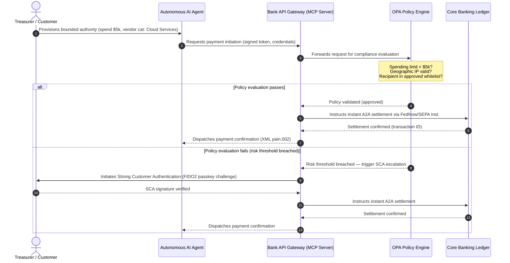

# Ang 2026 Global Payments Outlook: Operating Model, Risk, at Revenue sa Mundong Agentic, Invisible, at Real-Time

Ang 2026 global payments cycle ay tinutukoy ng tatlong sabay-sabay na puwersa — agentic commerce, invisible embedded payments, at real-time execution — na nakapatong sa isang tokenised unified ledger sa ilalim ng Project Agorá at sa isang matigas na November 2026 SWIFT structured-address cut-over.

<!-- lead-start -->
<aside class="post-lead" aria-label="Article summary">

<strong>TL;DR.</strong> Ang 2026 payments landscape ay lumipat mula sa messaging migration tungo sa isang multi-dimensional operating model kung saan dinidikta ng real-time execution ang risk at revenue. Pinagsasama ng piyesang ito ang 2026 outlook ng J.P. Morgan, Global Payments, HSBC, at Payments Association sa isang four-pillar G-SIB operating plan, sumasaklaw sa model-initiated agentic commerce, always-on treasury APIs, tokenised unified ledgers sa ilalim ng BIS Project Agorá, at ang November 14, 2026 SWIFT structured-address deadline.

<strong>Mga pangunahing punto</strong>

<ul class="post-lead-takeaways">
  <li><strong>Binubuksan ng agentic commerce ang frontier ng delegated liability.</strong> Inaasahang mamamagitan ang autonomous AI agents sa $3-$5 trillion ng taunang commerce pagsapit ng 2030. Kailangang tukuyin ng mga bangko ang MCP gatekeeping, SCA delegation sa ilalim ng PSD3/PSR, at ang pagmamay-ari ng KYC/AML sa loob ng multi-agent payment chains.</li>
  <li><strong>Ang always-on liquidity ay isa nang operational at regulatory baseline.</strong> Ang 24/7 treasury APIs at virtual accounts ay nagpapaliit ng trapped cash at nagtataas ng bar ng resilience. Sa ilalim ng DORA, ang real-time liquidity products ay dapat suportado ng geo-redundant, active-active infrastructure na may 99.999% availability.</li>
  <li><strong>Ang tokenisation ay lumipat na sa regulated unified ledgers.</strong> Ang Project Agorá ang pinakamalaking public-private framework para sa tokenised commercial bank deposits at central bank reserves. Kailangan ng mga bangko ng limang-hakbang na tokenisation journey, na may malinaw na prudential treatment.</li>
  <li><strong>Ang November 14, 2026 structured-address cut-over ay may matigas na petsa.</strong> Ang unstructured postal address fields sa CBPR+ at SEPA messages ay mag-uudyok ng agarang rejections. Kailangan ang malinis na data governance sa lahat ng product, technology, at compliance teams.</li>
</ul>

<strong>Kaugnay na babasahin:</strong> <a href="https://sebastienrousseau.com/2026-06-23-iso-20022-pain001-programmable-liquidity-autonomic-treasury-2026">From Pain.001 to Programmable Liquidity: ISO 20022 as the Autonomic Nervous System of Treasury in 2026</a>, <a href="https://sebastienrousseau.com/2026-06-24-cross-border-iso-20022-open-finance-tokenised-deposits-treasury-2026">Cross-Border 2026: ISO 20022, Open Finance and Tokenised Deposits in Corporate Treasury</a>, <a href="https://sebastienrousseau.com/2026-06-25-quantum-dawn-cib-kyberlib-quantum-resilient-payments-stack-2026">Quantum Dawn for CIB: From KyberLib to a Quantum-Resilient Payments Stack</a>.

</aside>
<!-- lead-end -->

Para sa global transaction banks, ang 2026-2028 cycle ay isang structural window. Ang modernong payment infrastructure ay hindi na isang administrative utility — ito na ang ubod ng bank-grade technology strategy. Sa loob ng mga G-SIB at malalaking regional institutions, ang technology, regulation, at customer expectation ay nagtagpo na sa iisang operating plane.

Tatlong puwersa ang tumutukoy sa cycle na ito, at bawat isa ay direktang tumutugma sa isang executive-suite na alalahanin.

- **Agentic commerce** — channel distribution, product design, liability assignment, at Model Risk Management sa ilalim ng supervisory scrutiny.
- **Invisible payments** — customer experience, na may panganib ng disintermediation kung mabigo ang mga bangko na i-embed ang kanilang ledger sa corporate at merchant front-ends.
- **Real-time execution** — capital velocity, kasama ang kaakibat na pagbabago sa liquidity management, credit risk, operational resilience, at fraud defense.

Materyal ang mga financial stakes. Ang fraud ay lumalawak sa bilis at pagkasopistikado; matitigas ang regulatory deadlines; at ang mga bangkong proactive na nagmo-modernize ng kanilang core systems ay nagbubukas ng malalaking fee-revenue opportunities. Kabaligtaran ang gastos ng pagwawalang-kibo: agarang transaction rejections, operational bottlenecks, regulatory penalties, at mabilis na pagkawala ng market share.

## Ang convergence ng global payment authorities

Pinagsasama ng ulat na ito ang 2026 payments at commerce outlooks mula sa apat na makapangyarihang industry voices — [J.P. Morgan Payments](https://www.jpmorgan.com/payments/newsroom/payments-outlook-2026-trends-report-released "J.P. Morgan Payments — Outlook 2026"), [Global Payments](https://investors.globalpayments.com/news-events/press-releases/detail/497/global-payments-releases-its-2026-commerce-and-payment "Global Payments — 2026 Commerce and Payment Trends Report"), HSBC, at The Payments Association — at itinatambis sa [G20 Roadmap for Enhancing Cross-Border Payments](https://www.fsb.org/2026/03/fsb-kicks-off-new-implementation-phase-to-enhance-cross-border-payments-through-public-private-partnership/ "FSB — cross-border payments implementation phase, March 2026").

Bawat organisasyon ay lumalapit sa ekosistema mula sa ibang market angle, ngunit ang kanilang mga findings ay nagtatagpo sa tatlong invariants.

1. **Ang instant, API-driven rails ang baseline.** Marginalised na ang legacy batch-processing models para sa cross-border at high-value flows; ang transaction velocity sa mga segment na iyon ay dinidikta ng always-on, real-time messaging.
2. **Ang AI ay parehong banta at depensa.** Ang generative tools at deepfakes ay nagpapalawak ng transaction fraud, na nag-uudyok ng real-time, multi-layered machine-learning counter-defenses.
3. **Ang tokenisation ay production-ready infrastructure na.** Nagkakaisa ang mga ledger upang i-host ang tokenised commercial liabilities at wholesale central bank digital currencies.

| Report | Pangunahing audience | Focus | Key pillar | Bank implication |
| --- | --- | --- | --- | --- |
| **J.P. Morgan Payments** | Corporate treasurers, G-SIBs | Real-time liquidity, fraud | APIs, AI biometrics | Itayong muli ang liquidity, FX, at risk systems para sa continuous 365-day settlement. |
| **Global Payments** | Merchants, e-commerce | POS evolution, omnichannel | Agentic commerce, frictionless checkout | Magtayo ng secure, API-gated merchant payment corridors para sa autonomous AI agents. |
| **HSBC Insights** | Multinational corporates | ERP integrations (SAP/Oracle), real-time cash | Treasury-as-a-Service, cash visibility | I-monetise ang transactional API suites at i-embed ang real-time cash ledger reporting sa pinagmulan. |
| **The Payments Association** | Fintechs, payment institutions | Stablecoins, tokenisation, global regulation | Regulated digital assets, policy compliance | Ihanda ang mga balance sheets para sa tokenised deposits at i-navigate ang PSD3/PSR liability structures. |

Sa kabuuan, tinutukoy ng apat na outlook ang private-sector operating stack na umaandar sa ibabaw ng public-sector G20 policy infrastructure, isinasalin ang policy intent sa kongkretong mga desisyon sa liquidity, tokenisation, data, at fraud control sa loob ng mga bangko.

## Pillar 1 — Agentic commerce at invisible payments

Ang agentic commerce ay ang transisyon mula sa human-driven, click-to-buy checkout patungo sa autonomous, model-driven transaction initiation. Nagtatagpo ang industry forecasts sa $3-$5 trillion ng taunang commerce na pamamagitan ng autonomous agents pagsapit ng 2030 — isang low-single-digit na bahagi ng global payment volume na nailalakad nang walang taong nag-click ng 'buy'.

May kaakibat na puwang ang retail at commercial ecosystem. Karamihan ng mga consumer ngayon ay inaasahan ang halos walang-friction na payments, ngunit mas mababa sa kalahati ng mga merchant ang nagbigay-prioridad sa one-click checkout o sa API-accessible product catalogues. Hindi kayang i-navigate ng AI agents ang legacy multi-page checkout screens na dinisenyo para sa mga mata ng tao; kailangan nila ng structured, machine-to-machine API handshakes.

### Mga bank priorities at operational impact

- **Pagmamay-ari ng KYC at AML.** Dapat tukuyin ng mga bangko kung sino ang nagtataglay ng compliance obligation sa loob ng isang agentic transaction chain. Kung ang personal AI agent ng isang consumer ay nag-uumpisa ng transaksyon sa pamamagitan ng agentic checkout ng isang merchant, dapat patotohanan ng bangko na ang nagmumulang delegated authority ay cryptographically bound sa pangunahing account holder.
- **Pag-redesign ng liability at chargeback.** Ang card schemes at A2A rails ay dinisenyo sa paligid ng human authorisation. Kapag ang isang AI agent ay nakagawa ng maling pagbili — halimbawa, pagbili ng maling industrial inventory dahil sa data-parsing error — dapat itong italaga ng mga bangko sa liability nang malinaw sa pagitan ng consumer, agent provider, at merchant.
- **Risk-rating ng agentic flows.** Dapat dynamic na i-risk-rate ng payment routing engines ang agentic payments, nag-aaplay ng mas mataas na reserve requirements o interchange rates sa non-human-initiated transactions hanggang magkaroon ng stable settlement track record.

### Bounded action at bounded authority

Upang mapagaan ang "unbounded action" — isang enterprise procurement agent na umaandar sa isang walang-katapusang recursive purchase loop dahil sa software glitch — dapat mag-deploy ang mga bangko ng **bounded-authority API gates**. Ipinapatupad ng gates ang policy-level limits sa tatlong dimensyon.

1. **Tiered financial limits** — ang pagkakagastos ng agent ay limitado ayon sa transaction size, daily cumulative value, at merchant category.
2. **Context-aware safeguards** — sinusuri ang secondary signals (time-of-day, IP geolocation, transaction frequency) bago palabasin ng ledger ang pondo.
3. **Human-in-the-loop escalation** — mandatory human authorisation na ina-trigger sa pamamagitan ng Strong Customer Authentication (SCA) sa ilalim ng PSD3 / PSR sa tuwing lalampas ang transaksyon sa risk thresholds.

Ipinapakita ng Mermaid sequence sa ibaba ang target architecture na makikilala ng maraming bangko bilang ang bounded-authority agentic payment flow.

### Ang Model Context Protocol (MCP)

Upang ikonekta ang localised AI models sa bank-governed execution layers, ang industriya ay nagsa-standardise sa paligid ng [Model Context Protocol (MCP)](https://modelcontextprotocol.io "Model Context Protocol — open standard for LLM tool integration") — isang open protocol na nagpapahintulot sa LLMs na tumawag ng malinaw na scoped, auditable tools at APIs nang walang raw access sa core systems.

Ang pagbalot ng banking APIs (payment initiation, balance enquiry, party verification) sa loob ng MCP server ay nagpapanatili ng LLMs na malayo sa database tables at system-root controls. Nakikipag-ugnayan ang model sa ledger sa pamamagitan lamang ng structured, audited, rate-limited endpoints — ang security ay ipinapatupad sa hangganan ng agentic tool execution sa halip na ilibing sa loob ng model.

## Pillar 2 — Treasury transformation at muling pagsisip sa liquidity

Ang velocity ng transaction banking sa 2026 ay itinakda ng paglipat mula sa end-of-day batch processing patungo sa always-on, real-time treasury operations. Hindi na pinapayagan ng mga multinational corporates ang trapped cash — liquidity na nakatambay sa local accounts sa weekends o holidays dahil sarado ang settlement systems.

### Ang ekonomikong kaso para sa real-time liquidity

Iniulat ng J.P. Morgan at HSBC na ang mga corporate na may abanteng real-time cash at data capabilities ay materyal na mas malamang na manaig sa mga peer sa revenue growth at capital efficiency, pangunahing dahil sa pagbabawas ng trapped liquidity at pag-optimise ng working-capital cycles.

Upang mahuli ang halagang iyon, ipinapadala ng mga bangko ang **Treasury-as-a-Service (TaaS) API products** na nagpapahintulot sa corporate ERPs (SAP, Oracle) na direktang mag-plug sa ledger ng bangko.

- **Real-time balance APIs** gamit ang `camt.052` schema — pinapalitan ang file-transfer protocols ng instant, event-driven cash-position reporting.
- **Bulk payment initiation APIs** gamit ang `pain.001` — direktang straight-through execution ng vendor payment batches mula sa ERP ledger.
- **Continuous FX APIs** — nilalock ng treasury engines ang real-time, algorithmic foreign-exchange rates para sa cross-border settlement, inaalis ang overnight market-gap risk.
- **Virtual account APIs** — dynamic na nagbubukas at nagsasara ang mga corporate ng libu-libong sub-accounts para sa automated receivables matching at ledger separation.

### Operational resilience at DORA

Ang pag-aalok ng always-on liquidity ay binabago ang risk profile ng bangko. Dapat hawakan ng platform ang **99.999% operational availability** sa ilalim ng continuous, real-time load.

Sa ilalim ng [Digital Operational Resilience Act (DORA)](https://eur-lex.europa.eu/legal-content/EN/TXT/?uri=CELEX%3A32022R2554 "Regulation (EU) 2022/2554 — Digital Operational Resilience Act"), iyan ay hindi isang IT KPI — ito ay isang mahigpit na regulatory requirement. Inaasahan ng mga regulator na patunayan ng mga bangko na ang real-time treasury API surface at ledger database ay kayang sumipsip ng severe-but-plausible cyberattacks, network outages, at hyperscaler disruptions nang walang pagkagambala sa kritikal na payments o pagsira sa systemic liquidity. Iyon ay nangangailangan ng geo-redundant, active-active multi-cloud database architectures, real-time threat-detection layers, at automated failover — nakikita sa change cost line, hindi lamang sa audit dossier.

### Continuous FX at cross-border innovation

Hindi maaaring manirahan ang real-time treasury sa loob ng isang single-currency boundary. Nag-de-deploy ang mga G-SIB ng continuous FX infrastructure — ang [Wire 365](https://www.jpmorgan.com/insights/payments/fx-cross-border/wire-365-global-clearing "J.P. Morgan — Wire 365 global clearing reinvented") platform ng J.P. Morgan ay nagpoproseso ng cross-border payments at FX conversions sa anumang araw ng taon, lampas sa tradisyonal na oras ng central-bank RTGS. Direktang nag-iinterlock ang layer na iyan sa tokenised-deposit at unified-ledger systems na tinatalakay sa Pillar 3.

## Pillar 3 — Tokenised deposits at ang unified ledger

Ang tokenisation ay lumipat mula sa nakahiwalay na proof-of-concept pilots tungo sa scaled, bank-grade monetary infrastructure. Lumipat ang focus mula sa private stablecoins at speculative cryptoassets patungo sa **tokenised commercial bank deposits** at **wholesale central bank digital currencies (wCBDCs)** na umaandar sa programmable unified ledgers.

Ang reference framework ay ang [Project Agorá](https://www.bis.org/about/bisih/topics/fmis/agora.htm "BIS Project Agorá — tokenisation of wholesale cross-border payments") — isang mayor public-private collaboration na pinangulo ng BIS at IIF, kinasasangkutan ng pitong central banks at mahigit 40 private financial institutions. Ginagalugad ng proyekto kung paano nag-iintegrate ang tokenised commercial bank deposits sa tokenised wholesale CBDCs sa isang shared programmable ledger upang alisin ang cross-border settlement friction, i-coordinate ang compliance checks, at paganahin ang 24/7 atomic finality.

### Ang limang-hakbang na tokenisation journey

Para sa mga G-SIB at malalaking regional banks, ang tokenisation ay isang stepwise journey mula sa internal optimisation patungo sa open-market interoperability.

1. **Internal treasury liquidity** — tokenising ng internal corporate cash balances (hal. JPM Coin o katumbas na private bank ledgers) upang paganahin ang instant, 24/7 cross-border transfer at netting sa mga sariling sangay ng bangko.
2. **Bounded multi-bank corridors** — sarado, regulated consortia (ang Project Agorá sandbox) upang subukin ang interbank settlement at shared ledger state sa iba't ibang institusyon.
3. **Continuous programmable FX** — ang smart contracts sa unified ledger ay nag-eexecute ng instant Payment-versus-Payment (PvP) FX, inaalis ang settlement risk sa mga time zone.
4. **Tokenised real-world assets (RWAs)** — nag-iintegrate ang tokenised cash leg sa tokenised securities, debt, o trade ledgers para sa instant Delivery-versus-Payment (DvP) finality, binabawasan ang capital lock-up mula sa araw patungo sa milliseconds.
5. **Regulated public/hybrid interoperability** — pinapahintulutan ng secure gateway wrappers ang institutional liquidity na ligtas na makipag-ugnayan sa open public networks.

### Prudential at balance-sheet implications

Dapat ma-navigate ang tokenised cash sa pamamagitan ng prudential frameworks nang mabuti. Binibigyang-diin ng supervisors na ang tokenised deposit ay dapat economically equivalent sa traditional commercial bank deposit — ibig sabihin, isang unsecured liability sa balance sheet ng bangko na may kaparehong deposit-insurance coverage.

Operationally, nagpapakilala ang tokenised deposits ng mga panganib na hindi nilayong gayahin ng classical liquidity stress models. Ina-execute ng smart contracts ang programmable withdrawals sa mga bilis at volumes na hindi nakukuha ng legacy assumptions. Sa ilalim ng Basel III, dapat tiyakin ng mga bangko na ang risk engine ay kayang i-model ang programmable cash run-offs at na ang tokenised ledger ay nakipag-interoperate nang malinis sa legacy RTGS systems sa daily liquidity cycle.

### Stablecoins vs tokenised deposits — isang masinsinang posisyon

Patuloy na nakukuha ng private fully-reserved stablecoins (USDC, atbp.) ang market share sa retail cross-border remittance at decentralised commerce, ngunit kulang sa credit-creation capacity at settlement finality ng commercial banking system.

Sa halip na makipagkumpitensya sa retail rails, nagtatayo ang transaction banks ng custody, naglalabas ng kanilang sariling regulated tokenised liability instruments, at nagtatayo ng secure on-/off-ramp gateways. Nakakakuha ang corporate clients ng programming flexibility habang pinanatili ang capital sa loob ng regulated perimeter.

### Mga tanong na dapat itanong ng board tungkol sa tokenised money

- **Pakikilahok sa unified ledger.** Ano ang aming aktibong strategic roadmap para sa pakikilahok sa wholesale public-private unified-ledger initiatives tulad ng Project Agorá?
- **Balance sheet at risk modelling.** Na-update na ba ng aming risk engines at capital-adequacy frameworks ang stress-testing upang isaalang-alang ang bilis ng smart-contract-triggered token run-offs?
- **First-mover client segments.** Alin sa aming corporate-treasury at commercial-banking client segments ang agarang makikinabang mula sa programmable, tokenised DvP/PvP settlement?

## Pillar 4 — Structured data at fraud defense

Ang infrastructure compliance sa 2026 ay pinangungunahan ng **November 14, 2026 structured-address cut-over** na itinatag sa ilalim ng [SWIFT Standards Release (SR) 2026](https://www.swift.com/standards/iso-20022/removal-unstructured-address "SWIFT — Removal of unstructured address, November 2026"). Mula sa petsang iyon, hihinto ang CBPR+ at SEPA payment networks sa pagtanggap ng ganap na unstructured, free-text postal address blocks (`<AdrLine>`) sa payment messages. Anumang cross-border o domestic message na nagdadala ng unstructured address kung saan inaasahan ang structured elements ay maaantala o tatanggihan ng network.

Alam ng karamihan ng institusyon ang petsa. Marami ang tumatrato dito bilang isang superficial mapping exercise sa interface layer. Ang totoo ay isang mas malalim na data-quality at data-governance challenge. Upang maiwasan ang catastrophic reject rates, kailangan ng payment operations ng malinaw na cross-functional governance frame.

- **Product at operations.** Data capture sa pinagmulan. Dapat ipatupad ng customer-facing digital portals, onboarding interfaces, at corporate ERP input fields ang structured address fields (`<StrtNm>`, `<PstCd>`, `<TwnNm>`, `<Ctry>`) sa puntong pinasisimulan ang pagbabayad.
- **Technology.** Parsing, mapping, schema validation. Hinaharang ng validation engines ang legacy files bago nila masagi ang SWIFT interface. Ang locally-deployed machine-learning models ay nagpa-parse ng legacy unstructured address blocks tungo sa XML-compliant tags sa ilalim ng `<PstlAdr>`.
- **Compliance at risk.** Ang sanctions screening, transaction monitoring, at AML logic ay na-update upang ma-ingest ang structured XML fields — pinapababa ang false-positive rates at manual investigations.

### Ang business case para sa structured data

Kapag itinuring bilang compliance cost, ang structured-data programme ay magastos. Kapag itinuring bilang revenue enabler, ito ay nagbabayad sa sarili.

1. **Advanced credit decisioning.** Ang structured invoice, remittance, at ultimate-debtor data ay nagpapahintulot sa mga bangko na bumuo ng automated, tumpak na working-capital financing at supply-chain invoice-factoring programmes para sa corporate clients.
2. **Automated receivables matching.** Ang paglalantad ng structured party at invoice identifiers ay sumusuporta sa premium cash-reconciliation at virtual-account pooling products, na bumubuo ng bagong transaction-fee revenue.
3. **Monetisable transaction analytics.** Ang mga bangko ay nag-papackage at nagbebenta ng granular real-time liquidity at purchasing-pattern analytics dashboards sa corporate CFOs at treasurers.

### Isang nakalayered na AI fraud defense

Habang bumibilis ang transaction speeds patungo sa real-time, lumalawak na rin ang fraud techniques. Ipinakikita ng kamakailang pananaliksik na ang deepfakes ay umaabot sa humigit-kumulang 40% ng biometric fraud attempts, kung saan ang synthetic media ay lumalago sa paggamit upang talunin ang voice at facial-recognition controls sa onboarding at payment flows.

Ang depensa ay isang **three-layer AI fraud model**.

1. **Identity layer.** Biometrically verified [FIDO2](https://fidoalliance.org/fido2/ "FIDO Alliance — FIDO2 specification") passkeys, cryptographically signed hardware device-binding, at decentralised digital ID wallets upang ma-secure ang payment access.
2. **Behavioural layer.** Continuous behavioural biometrics — session navigation pacing, typing cadence, device orientation — upang tuklasin ang automated bot execution o session-hijack attempts.
3. **Transaction layer.** Ang structured fields ng ISO 20022 ay nagpapakain sa real-time machine-learning risk engines, kinakambo ang transaction metadata sa shared network-level consortium intelligence upang matukoy ang mga kahina-hinalang transaksyon sa loob ng milliseconds ng pagsisimula.

Upang mapanatili ang supervisors, ang transaction-layer AI models ay kumukuha ng mahigpit na **explainability parameters** at umaandar sa ilalim ng nakalaang Model Risk Management (MRM) programme. Inaasahan ng mga regulator na ipaliwanag ng mga bangko ang partikular na data points at algorithmic logic na nag-trigger ng automated block o fraud alert, naaayon sa [US Federal Reserve SR 11-7](https://www.federalreserve.gov/frrs/guidance/supervisory-guidance-on-model-risk-management.htm "US Federal Reserve — Supervisory Guidance on Model Risk Management, SR 11-7") at sa [PRA SS1/23](https://www.bankofengland.co.uk/prudential-regulation/publication/2023/may/model-risk-management-principles-for-banks-ss "Bank of England PRA SS1/23 — Model Risk Management principles for banks") ng Bank of England.

## 2026-2028 boardroom agenda

Upang maisakatuparan ang apat na pillar, dapat ayusin ng G-SIB at regional bank management bodies ang operational at technology investments sa isang malinaw na three-horizon roadmap.

### Horizon 1 — Agarang compliance at core hardening (0-12 buwan)

- **Focus.** I-standardise ang ISO 20022 data quality at i-secure ang batayang real-time transaction paths.
- **Success indicator (KPI).** Walang unstructured-address rejections sa SWIFT at SEPA pagkatapos ng November 14, 2026 cut-over.
- **Executive owner.** Chief Operating Officer / Head of Payment Operations.
- **Uri ng deliverable.** No-regrets move. Mga update sa core database schema at ang SWIFT SR 2026 validation engine.

### Horizon 2 — Automation at agentic safeguards (12-24 buwan)

- **Focus.** Bounded agentic API gates at continuous fraud-defense architecture.
- **Success indicator (KPI).** 100% ng machine-to-machine at AI-initiated API transactions ay na-validate sa pamamagitan ng FIDO2 hardware binding at bounded-authority policy engines.
- **Executive owner.** Chief Information Officer / Chief Risk Officer.
- **Uri ng deliverable.** No-regrets move (fraud defense) kasama ang strategic option (agentic commerce). MCP rollout at ang three-layer fraud AI.

### Horizon 3 — Platform tokenisation at unified ledgers (24-36 buwan)

- **Focus.** Ilipat ang treasury assets sa tokenised deposits at lumahok sa shared cross-border ledgers.
- **Success indicator (KPI).** Hindi bababa sa 15% ng high-value corporate treasury settlement volume na pinoproseso natively sa pamamagitan ng tokenised deposit instruments o unified-ledger arrangements (hal. Project Agorá corridors).
- **Executive owner.** Group Treasurer / Head of Transaction Banking.
- **Uri ng deliverable.** Strategic option. Programmable ledger infrastructure, smart-contract liquidity rules, DvP/PvP settlement adapters.

## FAQ

**Aabot ba talaga ang agentic commerce sa $3-$5 trillion pagsapit ng 2030?**
Itinuturo ng McKinsey baseline ang $5 trillion sa agentic commerce sales pagsapit ng 2030, kung saan ang hanay ng mga independent forecasts ay nag-iipon sa pagitan ng $3 trillion at $5 trillion. Sinasalamin ng variance kung gaano kaagresibo ang mga merchant sa pag-deploy ng machine-readable checkout APIs at kung gaano kabilis pahihintulutan ng mga bangko ang agents na magtransact sa ilalim ng SCA delegation — ang bottleneck ay nasa banda ng bangko at merchant, hindi sa agent capability.

**Saklaw ba ng November 14, 2026 SWIFT cut-over ang domestic SEPA flows din?**
Oo. Ang structured-address requirement ay nalalapat sa CBPR+ cross-border at sa SEPA payment messages. Ang mga bangkong nagpapatakbo ng parehong rails ay nangangailangan ng iisang canonical address schema sa upstream ng SWIFT interface, hindi dalawang parallel mappings.

**Pareho ba ang tokenised deposit at stablecoin?**
Hindi. Ang tokenised deposit ay isang unsecured liability sa balance sheet ng isang regulated bank, na may parehong deposit-insurance coverage tulad ng traditional deposit. Ang stablecoin ay karaniwang isang fully-reserved instrument na inilalabas ng isang non-bank, walang credit-creation capacity. Ipinapalagay ng disenyo ng Project Agorá na ang tokenised deposits ay nakatabi sa wholesale CBDCs sa isang shared programmable ledger; hindi lumalabas ang stablecoins sa wholesale settlement leg.

**Paano nauugnay ang Project Agorá sa mga umiiral na wCBDC pilots?**
Ang Agorá ang integrating frame. Saklaw ng mga national wCBDC experiments ang central-bank-money leg; dinadala ng Agorá ang tokenised commercial deposits sa parehong programmable ledger upang ang cross-border settlement ay atomic sa magkabilang uri ng pera. Ginagawa ng pitong nakikilahok na central banks at 40+ private institutions itong pinakamalaking public-private design ground para sa wholesale tokenised money architecture.

**Ano ang minimum DORA compliance posture para sa isang TaaS API?**
Geo-redundant active-active deployment, dokumentado na severe-but-plausible cyber scenarios na may pinangalanang owners sa ilalim ng SM&CR (UK), at isang nasubok na failover na hindi nakakaabala sa kritikal na payments. Kung wala iyon, ang TaaS product ay isang regulatory liability bago ito maging revenue line.

## Mga Sanggunian

- Bank for International Settlements (BIS) Innovation Hub. (2026). *Project Agorá: exploring tokenisation of wholesale cross-border payments*. [BIS Project Agorá](https://www.bis.org/about/bisih/topics/fmis/agora.htm).
- Deutsche Bank. (2026). *Digital Money: a perspective on stablecoins, tokenised deposits and CBDCs*. [Deutsche Bank Flow](https://flow.db.com/publications/flow-white-papers-and-guides/digital-money-a-perspective-on-stablecoins-tokenised-deposits-and-cbdcs).
- European Parliament and Council. (2022). *Regulation (EU) 2022/2554 on Digital Operational Resilience (DORA)*. [DORA Regulation](https://eur-lex.europa.eu/legal-content/EN/TXT/?uri=CELEX%3A32022R2554).
- Financial Stability Board. (2026). *FSB kicks off new implementation phase to enhance cross-border payments*. [FSB statement](https://www.fsb.org/2026/03/fsb-kicks-off-new-implementation-phase-to-enhance-cross-border-payments-through-public-private-partnership/).
- Global Payments. (2025). *2026 Commerce and Payment Trends Report — press release*. [Global Payments press release](https://investors.globalpayments.com/news-events/press-releases/detail/497/global-payments-releases-its-2026-commerce-and-payment).
- J.P. Morgan Payments. (2026). *Payments Outlook 2026 Trends Report Released*. [J.P. Morgan Newsroom](https://www.jpmorgan.com/payments/newsroom/payments-outlook-2026-trends-report-released).
- J.P. Morgan Insights. (2026). *5 Payment Trends to Watch for in 2026*. [J.P. Morgan Trends](https://www.jpmorgan.com/insights/payments/trends-innovation/five-payment-trends-in-2026).
- J.P. Morgan FX & Cross-Border. (2026). *Wire 365: Global Clearing Reinvented*. [J.P. Morgan FX Wire 365](https://www.jpmorgan.com/insights/payments/fx-cross-border/wire-365-global-clearing).
- SWIFT. (2026). *ISO 20022 milestone for November 2026: unstructured addresses to be removed*. [SWIFT ISO 20022 Milestone](https://www.swift.com/news-events/news/iso-20022-milestone-november-2026-unstructured-addresses-be-removed).
- SWIFT Standards. (2026). *Removal of unstructured address*. [SWIFT Standards](https://www.swift.com/standards/iso-20022/removal-unstructured-address).
- Bank of England. (2023). *Supervisory Statement (SS1/23) — Model Risk Management principles for banks*. [Bank of England PRA SS1/23](https://www.bankofengland.co.uk/prudential-regulation/publication/2023/may/model-risk-management-principles-for-banks-ss).
- US Federal Reserve. (2011). *Supervisory Guidance on Model Risk Management (SR 11-7)*. [SR 11-7](https://www.federalreserve.gov/frrs/guidance/supervisory-guidance-on-model-risk-management.htm).
- McKinsey & Company. (2025). *McKinsey forecast: $5 trillion in agentic commerce sales by 2030* (via Digital Commerce 360). [McKinsey agentic forecast](https://www.digitalcommerce360.com/2025/10/20/mckinsey-forecast-5-trillion-agentic-commerce-sales-2030/).
- HSBC Business. (2026). *HSBC Business Insights*. [HSBC Insights](https://www.business.hsbc.com/en-gb/insights).
- Bright Defense. (2026). *Deepfake Statistics: A Growing Security Concern*. [Deepfake fraud statistics](https://www.brightdefense.com/resources/deepfake-statistics/).
- European Banking Authority. (2019). *Guidelines on outsourcing arrangements (EBA/GL/2019/02)*. [EBA Outsourcing Guidelines](https://www.eba.europa.eu/regulation-and-policy/internal-governance/guidelines-on-outsourcing-arrangements).

<!-- enrich-start -->
<aside class="author-card" aria-label="About the author"><strong class="author-card-name"><a href="/about/index.html">Sebastien Rousseau</a></strong>Senior banking technologist na sumusulat sa applied AI, ISO 20022 migration, post-quantum cryptography para sa financial services, at sa structural transformation ng wholesale payments.20+ taon sa HSBC Commercial &amp; Investment Bank, PayPal, Barclays, Shazam, AKQA, Virgin Group. <a href="/about/index.html">Buong profile</a> &middot; <a href="https://www.linkedin.com/in/sebastienrousseau/" rel="external noopener">LinkedIn</a> &middot; <a href="https://github.com/sebastienrousseau" rel="external noopener">GitHub</a></aside>

Huling nirepaso noong <time datetime="2026-06-25">2026-06-25</time>.

<!-- enrich-end -->
