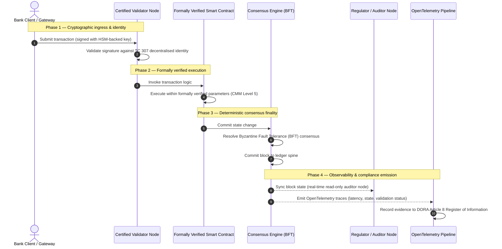

# Mula sa ebidensya tungo sa katotohanan: bakit tutukuyin ng mga sertipikadong blockchain ang susunod na panahon ng tiwala sa pagbabangko

## Estratehikong buod (ang pinakamahalaga)

Ang wholesale banking at mga pandaigdigang transaksyon noong 2026 ay nasa isang makasaysayang sandali ng pagbabago. Habang ang mga serbisyong pinansyal ay lumilipat tungo sa likas na digital, real-time na mga network ng clearing, at habang ang artipisyal na katalinuhan ay nagpapasok ng probabilistikong hindi-determinismo, ang tradisyonal na analog at retrospektibong mga modelo ng katiyakan (tulad ng static, entidad-batay na mga awdit) ay hindi na nakakatugon sa modernong mga hinihingi ng pamamahala ng panganib at mga tungkuling piduciaryo.

Ang ISO/IEC Technical Committee 307 (TC 307) ay nagtatag ng isang na-istandardisang pundasyon para sa mga teknolohiya ng distributed ledger. Gayunpaman, ang tunay na pag-ampon ng institusyon ay nangangailangan ng paglipat mula sa mapaglarawang gabay tungo sa preskriptibo, malayang masesertipikahang katiyakan ng blockchain. Sa pamamagitan ng pagmamarka sa pamamahala ng ledger, integridad ng konsenso, kaligtasan ng smart contract, at kaliksihan sa kriptograpiya laban sa isang mahigpit na limang-antas na Capability Maturity Model (CMM), ang mga bangko ay maaaring lumipat mula sa mga pira-piraso at partikular-sa-tagapagtustos na mga palagay tungo sa isang masesertipikahan at maaawdit-ng-lupon na katotohanang pinansyal.

## Mga pangunahing punto

* **Ang piduciaryong puwang ng friksyon**: kaya na nating sertipikahan ang bangko (Basel III), ang cloud (ISO 27001), at ang mga sistema ng pamamahala ng AI (ISO 42001), ngunit hindi pa natin masesertipikahan ang distributed ledger na lalong nagtatakda kung ano ang totoo. Ang asimetriyang ito ay isang malaking kahinaang pang-operasyon.  
* **Ipinapataw ng DORA ang direktang piduciaryong pananagutan**: sa ilalim ng Artikulo 5 ng DORA, ang mga lupon ng direktor ng bangko ay may direkta, hindi maidedelegang personal na pananagutan sa katatagang pang-operasyon ng lahat ng deployment ng third-party at ledger, na may mabibigat na personal na parusa sa ilalim ng rehimeng SM&CR sa mga pagkabigo.  
* **Ang gulugod ng awdit ng AI**: kung saan ang machine learning ay gumagawa ng hindi maulit, probabilistikong mga resulta, ang isang sertipikadong blockchain ay nagbibigay ng determinsitikong pagkuha ng estado. Ang pagtatala ng mga bersyon ng modelo, input, at desisyon ng validasyon sa chain ay nakakatugon sa ISO 42001 at mga pamantayan ng pamamahala ng panganib ng modelo.  
* **Ang Indeks ng mga Sertipikadong Blockchain**: pinormalisa ng indeks na ito ang pamamahala, konsenso, smart contract, at obserbabilidad tungo sa isang masusuri at handa-sa-awdit na scorecard sa iskala ng CMM na 0 hanggang 5, na nagsasalin ng mga sukatan sa inhinyeriya tungo sa mga pahayag ng gana sa panganib na inaprubahan ng lupon.

## 01. Ang piduciaryong puwang ng friksyon sa digital na pagbabangko

Sa klasikong pagbabangko, ang tiwala ay pang-ugnayan, pang-institusyon, at retrospektibo. Umaasa ito sa mga malayang third-party na awditor na sumusuri sa kalagayang pinansyal sa mga nakapirming punto ng oras, na nagkakasundo ng mga pagkakaiba sa mga silo ng bilateral na ledger. Sa real-time, API-driven na mga merkado ng 2026, ang modelong ito ay nagpapasok ng mahihigpit na latency at mga panganib na istruktural.

Kapag ang mga transaksyon ay agad na na-settle, ang mga intraday na pool ng liquidity ay dinamikong pinamamahalaan ng mga API gateway, at ang pagmamay-ari ng ari-arian ay na-token sa mga ibinahaging ledger, ang mga retrospektibong awdit ay nagiging mga forensic na ehersisyo sa halip na mga preventibong kontrol. Ang mga piduciaryo ay hindi na maaaring umasa lamang sa pagsertipika ng legal na entidad. Kailangan nilang sertipikahan ang mismong digital na substrato.

Sa kasalukuyan, ang mga bangko ay tumatakbo sa ilalim ng isang halatang asimetriya sa arkitektura:

1. **Sertipikadong imprastraktura ng cloud**: ang mga hardware node, virtualized na container, at pisikal na data center ay bini-validate laban sa mga kontrol ng ISO/IEC 27001 at SOC 2 Type II.  
2. **Sertipikadong mga proseso ng pamamahala**: ang mga patakaran sa panganib na pang-operasyon, mga plano ng pagpapatuloy ng negosyo, at mga algoritmikong deployment ay pinamamahalaan ng mahihigpit na balangkas ng panganib.  
3. **Hindi sertipikadong mga makina ng ledger**: ang mga mekanismo ng distributed na konsenso, mga supply chain ng validator node, mga hangganan ng smart contract, at mga modelo ng pamamahala ng network ay iniiwan sa hindi sertipikado, pasadya, o partikular-sa-konsorsyo na mga palagay.

Ang asimetriyang ito ay isang kritikal na puntong nabibigo. Maaaring patakbuhin ng isang bangko ang isang na-validate na aplikasyon sa loob ng isang ligtas, ISO 27001-sertipikadong cloud container, ngunit kung ang container na iyon ay nagsusulat sa isang distributed ledger na may sentralisadong kontrol ng validator, mahihinang parametro ng konsenso, o hindi naaawdit na mga smart contract, ang integridad ng transaksyon ay nakompromiso. Upang tulayan ang puwang na ito, ang mismong makina ng ledger ay dapat maging isang masesertipikahang bagay ng katiyakan.

## 02. Ang pundasyon ng istandardisasyon ng ISO/IEC TC 307

Ang pundasyong gawain na kailangan upang i-istandardisa ang mga distributed ledger ay itinatatag ng ISO/IEC Technical Committee 307 (Mga teknolohiya ng blockchain at distributed ledger). Sa halip na ituring ang blockchain bilang isang nakahiwalay na teknikal na protokol, tinutugunan ito ng TC 307 bilang isang institusyonal na imprastraktura ng tiwala, na inaayos ang trabaho nito sa palibot ng limang pangunahing haligi:

1. **Taksonomiya at bokabularyo (ISO 22739)**: nagtatatag ng isang karaniwang nomenclatura, na tinitiyak ang magkakatugmang legal at operasyonal na mga kahulugan sa iba't ibang hurisdiksyon, mga skema ng pinansyal, at mga institusyon.  
2. **Sanggunian na arkitektura (ISO/TR 23245)**: tinutukoy ang mga hangganan, layer, daloy ng datos, at mga functional na bahagi ng isang sumusunod na sistema ng distributed ledger.  
3. **Seguridad, privacy, at smart contract (ISO/TR 23244 / ISO 23613)**: nagtatatag ng mga baseline na gabay sa seguridad para sa mga sistema ng digital na ari-arian at inilalatag ang mga pinakamahusay na kasanayan para sa pagpapagaan ng kahinaan ng smart contract at pamamahala ng ikot ng buhay.  
4. **Mga balangkas ng interoperabilidad**: tinutugunan ang mga mekanismo ng palitan ng datos at ari-arian sa pagitan ng magkakaibang network ng ledger, na pinipigilan ang pagbuo ng mga nakahiwalay na na-token na silo.  
5. **Desentralisadong pagkakakilanlan at mga angkla ng tiwala**: pinag-iisa ang mga kriptograpikong identifier na batay sa ledger sa mga pormal na imprastraktura ng public key (PKI) at mga rehistrong pinahintulutan ng estado.

Sama-sama, tinutukoy ng TC 307 ang paglipat ng DLT mula sa isang pasadyang pagpili sa inhinyeriya tungo sa isang na-istandardisang disiplina sa arkitektura. Gayunpaman, ang TC 307 ay nananatiling pangunahing mapaglarawan. Tinutukoy nito kung ano ang hitsura ng kahusayan (gabay), ngunit hindi ito nagbibigay ng preskriptibong protokol ng pagpapatunay (katiyakan) na kailangan ng mga opisyal ng panganib at mga superbisor upang pahintulutan ang mga produksyong deployment ng mga kritikal o mahalagang tungkulin (CIF).

## 03. Gabay laban sa katiyakan: ang piduciaryong pagkakaiba

Ang mga kalahok sa merkado ng pinansyal ay hindi nagde-deploy ng teknolohiya dahil ito ay makabago o eleganteng; dine-deploy nila ito kapag maaari itong pamahalaan, awditin, ipagtanggol, at ipagkasundo sa mga kinakailangan sa reserbang kapital. Kaya naman ang istandardisasyon sa pagbabangko ay likas na nahahati sa dalawang layer:

* **Gabay (ang balangkas)**: binabalangkas ang mga pinakamahusay na kasanayan, mga target na sanggunian, at mga gabay sa arkitektura (hal. ISO/IEC TC 307, mga balangkas ng NIST).  
* **Katiyakan (ang patunay)**: nagbibigay ng malaya, tuloy-tuloy, at masusuri-ng-third-party na ebidensya na ang balangkas ay ipinatupad at gumagana ayon sa disenyo (hal. sertipikasyon ng ISO 27001, mga awdit ng SOC 2, mga pagsusuri ng regulasyon).

Ang pag-asa sa hindi sertipikadong konsenso ng ledger habang sinesertipikahan ang imprastraktura ng cloud ay isang kritikal na puwang sa regulasyon. Ang isang "hindi mababagong" blockchain ay hindi kinakailangang "pinagkakatiwalaan ng institusyon". Ang hindi pagbabago ay ginagarantiya lamang na ang inilagay na datos ay nananatiling hindi nagbabago; hindi nito bini-verify kung ang mga validator node ay ligtas, kung ang protokol ng konsenso ay matatag laban sa pagsasabwatan, kung ang lohika ng smart contract ay matematikal na wasto, o kung ang pamamahala ng kriptograpikong susi ay sumusunod sa mga mandato pagkatapos ng quantum.

Upang isara ang puwang na ito, pinormalisa ng Indeks ng mga Sertipikadong Blockchain 2026 ang mga kinakailangang ito tungo sa isang masusukat na Capability Maturity Model (CMM), na naka-map sa mga pandaigdigang regulasyon sa pagbabangko.

## 04. Ang Indeks ng mga Sertipikadong Blockchain 2026

Upang mabigyang-daan ang senior na pamamahala na suriin at sertipikahan ang kanilang mga platform ng ledger, isina-istruktura ng indeks na ito ang imprastraktura ng distributed ledger tungo sa limang masusuring layer ng operasyon, na minamarka sa iskala ng CMM na 0 hanggang 5.

## Talahanayan 1: ang arkitektura ng Indeks ng mga Sertipikadong Blockchain

| Layer ng indeks | Antas ng maturity (CMM) | Teknikal at operasyonal na sukatan | Sanggunian ng kontrol sa regulasyon / piduciaryo |
| ---- | ---- | ---- | ---- |
| **Pamamahala ng ledger** | **Antas 0**: ad hoc na konsorsyo**Antas 3**: awtomatikong pagsusuri at rotasyon ng validator**Antas 5**: desentralisado, multi-partidong kriptograpikong pag-angkla ng pagkakakilanlan | % ng mga validator node na pinatatakbo ng mga na-vet na entidad na pinansyal; karaniwang oras upang lutasin ang mga hidwaan ng validator; heograpikong pamamahagi ng mga node | **DORA Artikulo 5** (Pamamahala at organisasyon); **CPMI-IOSCO PFMI Prinsipyo 2** (Pamamahala) at **Prinsipyo 3** (Balangkas para sa komprehensibong pamamahala ng mga panganib) |
| **Integridad ng konsenso** | **Antas 0**: iisang node o malabong PoW**Antas 3**: na-awdit na BFT na may determinsitikong finality**Antas 5**: multi-hurisdiksyon, pormal na na-verify na konsenso na may tuloy-tuloy na pagsubaybay sa latency | pinakamataas na matitiis na latency ng konsenso; threshold ng paglaban sa pagsasabwatan; SLA ng availability sa simulADong paghahati ng node | **DORA Artikulo 6** (Balangkas ng pamamahala ng panganib ng ICT); **CPMI-IOSCO PFMI Prinsipyo 8** (Finality ng settlement) |
| **Pagkakakilanlan at kriptograpiya** | **Antas 0**: mahihinang RSA / ECDSA na susi**Antas 3**: multi-sig na may pamamahala ng susi na sinusuportahan ng HSM**Antas 5**: quantum-safe na hybrid na susi (FIPS 203 ML-KEM) at mga zero-knowledge na gate ng privacy | % ng mga transaksyon ng ledger na pinirmahan ng mga susing sinusuportahan ng HSM; iskor ng kahandaan sa migrasyon ng PQC; latency ng ZK-proof | **NIST FIPS 203 / 204**; **ISO/IEC 27001** (Pamamahala ng seguridad ng impormasyon) |
| **Katiyakan ng smart contract** | **Antas 0**: hindi naaawdit na mga script ng Solidity**Antas 3**: awtomatikong validasyon ng compiler at panlabas na awdit**Antas 5**: pormal na na-verify, hindi mababagong mga smart contract na may mga pag-upgrade na tipong circuit-breaker | % ng mga smart contract na may matematikal na pormal na pagpapatunay; bilang ng mga babala ng compiler; saklaw ng pag-scan ng kahinaan | **Mga gabay ng EBA sa outsourcing** (mga talata 81, 113-117); **DORA Artikulo 30** (Minimum na mga sugnay sa kontrata) |
| **Awdit at obserbabilidad** | **Antas 0**: manual na pag-scrape ng log**Antas 3**: nakabalangkas na OTel na mga trace at read-only na mga auditor node**Antas 5**: awtomatiko, tuloy-tuloy na pagkakasundo sa rehistro ng Artikulo 8 | % ng mga transaksyong saklaw ng mga OpenTelemetry na trace; latency mula sa commit ng block hanggang sa sync ng auditor node | **BCBS 239** (Pag-agrega ng datos ng panganib); **DORA Artikulo 8** (Rehistro ng impormasyon / mga skema ng ITS) |

## Talahanayan 2: mga pangunahing senyales ng tiwala na naka-map sa mga pandaigdigang pamantayan sa pagbabangko

| Senyales / benchmark | Sukatan | Epekto sa mga platform ng pagbabangko | Pinagmulan ng regulasyon |
| ---- | ---- | ---- | ---- |
| **Pag-usad ng ISO/IEC TC 307** | Paglipat mula sa ISO/TR na mga teknikal na ulat tungo sa pormal na mga skema ng sertipikasyon | Nagtatatag ng unang na-istandardisang balangkas para sa pagsertipika ng mga makina ng distributed ledger | **ISO/IEC JTC 1 / SC 44** (Mga teknolohiya ng distributed ledger) |
| **Yugto ng prototype ng Proyektong Agorá** | Mahigit 40 partisipanteng komersyal na bangko; pagsubok ng pinag-isang ledger para sa mga na-token na deposito | Inilipat ang cross-border na clearing mula sa mensahe (SWIFT) tungo sa atomikong na-token na settlement | **Innovation Hub ng Bank for International Settlements (BIS)** |
| **Third-party na awdit ng DORA Artikulo 30** | 100% ng mga tagapagbigay ng node at host ng imprastraktura na na-awdit laban sa mga pamantayan sa seguridad | Inaalis ang "mga anino na validator node"; nag-uutos ng buong transparency ng supply chain | **Mga Awtoridad ng Superbisyon ng Europa (ESA)** |
| **ISO/IEC 42001 (pamamahala ng AI)** | Mga log ng modelo at pagsasanay ng AI na ginawang hindi mababago sa kriptograpikong paraan sa chain | Ginagamit ang blockchain bilang hindi mababagong rehistro ng ebidensya ("gulugod ng awdit") para sa machine learning | **ISO/IEC 42001:2023** (Teknolohiya ng impormasyon — Artipisyal na katalinuhan) |
| **Kasapatan ng kapital ng Basel III** | Pagbawas ng mga buffer ng kapital para sa panganib na pang-operasyon batay sa naidokumentong pagbawas ng pagiging komplikado | Ang na-istandardisang mga balangkas ng panganib na pang-operasyon ay direktang kinikilala ang na-verify na katatagan ng ledger | **Komiteng Basel sa Superbisyon ng Bangko (BCBS)** |

## 05. Ang "gulugod ng awdit" ng AI: probabilistikong katalinuhan sa determinsitikong imprastraktura

Isa sa pinakamakapangyarihang estratehikong papel ng isang sertipikadong blockchain noong 2026 ay ang pagsilbi bilang isang **"gulugod ng awdit"** para sa mga deployment ng artipisyal na katalinuhan. Ang mga modernong sistema ng pinansyal ay lalong nagiging probabilistiko. Ang credit scoring, real-time na pagtukoy ng pandaraya, algoritmikong pangangalakal, at mga awtonomong pakikipag-ugnayan sa customer ay pinatatakbo ng mga modelo ng machine learning na umuunlad, gumagalaw, at umaangkop sa paglipas ng panahon. Ang mga modelong ito ay hindi determinsitiko: sa parehong input sa dalawang magkaibang oras, maaari silang magbigay ng magkaibang output dahil sa mga dinamikong timbang at tuloy-tuloy na pagsasanay.

Ang hindi-determinismong ito ay naglalahad ng isang malalim na hamon sa pamamahala sa ilalim ng **ISO/IEC 42001 (pamamahala ng AI)** at mga pamantayan ng pamamahala ng panganib ng modelo (MRM) (tulad ng **SR 11-7 ng Federal Reserve ng US** at **SS1/23 ng PRA ng UK**): *paano mo aawditin, ipapaliwanag, at ipagtatanggol ang mga desisyong hindi mahigpit na maulit?*

Ang isang sertipikadong distributed ledger ay nagbibigay ng determinsitikong kontra-timbang. Kung saan ang mga modelo ng AI ay gumagana nang probabilistiko, itinatala ng sertipikadong blockchain ang kanilang mga parametro nang determinsitiko, na nagtatatag ng isang hindi mababagong gulugod ng ebidensya:

* **Pag-bersyon ng modelo at pag-angkla ng timbang**: bawat na-deploy na bersyon ng modelo, ang mga kaugnay nitong timbang, at ang mga checksum ng datos ng pagsasanay nito ay hina-hash at isinusulat sa ledger sa oras ng build, na tumutugon sa mga kinakailangan ng supply chain na **SLSA Level 3**.  
* **Kontekstwal na pag-log ng input**: kapag ang isang modelo ng AI ay nagsasagawa ng isang kritikal na desisyon (hal. pag-apruba ng pautang o pag-flag ng transaksyon), ang eksaktong kontekstwal na mga input at mga hash ng modelo ay isinusulat sa ledger, na lumilikha ng isang kasaysayang lumalaban sa pakikialam.  
* **Kakayahang ma-awdit nang walang access sa code**: kung magtanong ang isang regulator na "bakit tinanggihan ng iyong modelo ang aplikasyong ito sa kredito noong Hunyo 3?", hindi kailangang ilantad ng bangko ang proprietary code nito o subukang muling likhain ang eksaktong estado ng modelo. Iniharap nito ang kriptograpikong nilagdaang tala sa chain ng mga input, timbang, at estado ng validasyon.

Sa pamamagitan ng pag-angkla ng mga probabilistikong desisyon ng mga modelo ng machine learning sa determinsitikong konsenso ng isang sertipikadong blockchain, ang institusyon ay lumilikha ng isang naipagtatanggol, muling-maitatayo, at malayang masusuring timeline ng mga awtomatikong aksyon.

## 06. Pagbibisualisa ng sertipikadong daluyan mula konsenso hanggang awdit

Inilalarawan ng sumusunod na sequence diagram ang siklo ng buhay ng isang transaksyong dumadaan sa isang sertipikadong platform ng blockchain, na nagpapakita kung paano nagkakabit-kabit ang mga gate ng validasyon, integridad ng konsenso, pagpapatupad ng smart contract, at paglabas ng telemetry upang makabuo ng ebidensya ng regulasyon na handa para sa lupon:

Ang kritikal na landas ng transaksyonal na pagkakasunod-sunod na ito ay nangangailangan na bawat hakbang ng validasyon, pagpapatupad, at konsenso ay kriptograpikong nilagdaan, na tinitiyak ang provenance mula dulo-hanggang-dulo. Sinisinkronisa ng auditor node ng regulator ang estado ng block nang real-time, na inaalis ang pangangailangan ng retrospektibo at manwal na pagkakasundo ng pinansyal.

## 07. Ang playbook ng lupon para sa mga senior na manedyer

Upang matagumpay na malampasan ang paglipat mula sa tiwala ng organisasyon tungo sa tiwala ng imprastraktura, ang mga ehekutibo ng bangko at mga senior na manedyer ay dapat agad na isakatuparan ang apat na pangunahing direktiba:

1. **Iutos ang mga awdit ng ledger sa pamamahala ng panganib ng negosyo (ERM)**: ipatupad ang isang patakaran na walang platform ng distributed ledger — pribado, publiko, o konsorsyo — ang maaaring i-deploy para sa mga kritikal o mahalagang tungkulin (CIF) nang hindi na-awdit laban sa limang-layer na **arkitektura ng Indeks ng mga Sertipikadong Blockchain** (minimum na CMM Antas 3).  
2. **Isama ang mga blockchain bilang gulugod ng ebidensya ng AI na ISO 42001**: atasan ang Chief Risk Officer at ang punong Arkitekto ng AI na isama ang lahat ng mataas na epektong mga modelo ng machine learning sa isang sertipikadong blockchain, na lumilikha ng isang rehistro ng awdit na lumalaban sa pakikialam ng mga bersyon ng modelo, timbang, input, at desisyon.  
3. **Awditin ang supply chain ng validator node (DORA Artikulo 30)**: atasan ang dibisyon ng pagbili na awditin ang lahat ng third-party na entidad na nagho-host ng mga validator node o namamahala ng cloud hosting para sa mga network ng DLT, na nag-uutos ng parehong mga pamantayan ng cybersecurity at katatagan ng operasyon na inilapat sa mga internal na cloud node ng bangko.  
4. **Ihanay ang mga arkitektura ng ledger sa CPMI-IOSCO at BCBS 239**: atasan ang koponan ng inhinyeriya ng platform na ihanay ang telemetry ng output ng ledger nang direkta sa mga kinakailangan ng pag-uulat ng datos ng **BCBS 239**, at tiyakin na ang mga parametro ng konsenso at finality ng settlement ay mahigpit na sumusunod sa **Mga Prinsipyo 8 at 9 ng CPMI-IOSCO**.

## 08. Mga madalas itanong

**Ang ISO/IEC TC 307 ba ay isang pamantayan ng sertipikasyon?**  
Hindi. Ang ISO/IEC TC 307 ay isang teknikal na komite na nagtatatag ng bokabularyo, mga sanggunian na arkitektura, at mga gabay sa seguridad. Bagama't tinutukoy nito kung "ano ang hitsura ng kahusayan" (gabay), dapat gawing operasyonal ng industriya ang mga dokumentong ito tungo sa pormal, masusuring mga skema ng sertipikasyon (katiyakan) upang bigyang-kasiyahan ang mga superbisor ng bangko.

**Paano sinusuportahan ng isang sertipikadong blockchain ang pagsunod sa DORA?**  
Sa ilalim ng Artikulo 5 ng DORA, ang mga lupon ng bangko ay may direktang personal na pananagutan sa katatagan ng teknolohiya. Ang isang sertipikadong blockchain ay nagbibigay ng masusuring kriptograpikong ebidensya ng integridad ng konsenso, kontrol ng supply chain ng validator, at kaligtasan ng smart contract, na nagbibigay sa mga miyembro ng lupon ng mga naidodokumentong "makatuwirang hakbang" na kailangan upang ipagtanggol laban sa mga paghahabol ng personal na pananagutan sa ilalim ng SM&CR.

Ano ang pagkakaiba ng tradisyonal na awdit ng ledger at ng awdit ng sertipikadong blockchain?  
Ang tradisyonal na awdit ay retrospektibo: bini-verify nito ang mga manwal na entry at static na file pagkatapos ma-settle ang mga transaksyon. Ang awdit ng sertipikadong blockchain ay tuloy-tuloy at real-time; ang mga validator node, ang makina ng konsenso na BFT, at ang mga pormal na na-verify na smart contract ay sertipikado upang isagawa ang mga transaksyon nang determinsitiko, na naglalabas ng nakabalangkas na telemetry (OpenTelemetry) na tuloy-tuloy na bini-validate ang kalusugan ng sistema.

Maaari bang sertipikahan ang mga publikong blockchain para sa paggamit sa pagbabangko?  
Sa karamihan ng mga hurisdiksyon, ang mga purong walang-pahintulot na publikong blockchain ay nabibigo na matugunan ang mga regulasyon sa pagbabangko dahil sa kawalan ng pagpapatunay ng pagkakakilanlan ng validator, hindi mahuhulaang mga gastos sa transaksyon, at hindi-determinsitikong finality (hal. mga probabilistikong fork ng proof-of-work/stake). Ang mga sertipikadong blockchain sa pagbabangko ay karaniwang gumagamit ng may-pahintulot na mga arkitektura ng enterprise o mahigpit na kinokontrol na mga arkitekturang publiko-hybrid, kung saan ang mga operator ng validator node ay mga natukoy at na-awdit na entidad na pinansyal.

## 09. Mga sanggunian

* Komiteng Basel sa Superbisyon ng Bangko (BCBS), 2013. *Principles for effective risk data aggregation and reporting (BCBS 239)*. Basel: Bank for International Settlements. Makukuha sa: [https://www.bis.org/publ/bcbs239.pdf](https://www.bis.org/publ/bcbs239.pdf).  
* Committee on Payments and Market Infrastructures at Technical Committee of the International Organization of Securities Commissions (CPMI-IOSCO), 2012. *Principles for financial market infrastructures*. Basel: Bank for International Settlements. Makukuha sa: [https://www.bis.org/cpmi/publ/d101a.pdf](https://www.bis.org/cpmi/publ/d101a.pdf).  
* European Banking Authority (EBA), 2019. *EBA/GL/2019/02 — Guidelines on outsourcing arrangements*. Paris: EBA. Makukuha sa: [https://www.eba.europa.eu/regulation-and-policy/internal-governance/guidelines-on-outsourcing-arrangements](https://www.eba.europa.eu/regulation-and-policy/internal-governance/guidelines-on-outsourcing-arrangements).  
* European Parliament at Council of the European Union, 2022. *Regulasyon (EU) 2022/2554 sa digital operational resilience para sa sektor pinansyal (DORA)*. Brussels: Opisyal na Journal ng European Union. Makukuha sa: [https://eur-lex.europa.eu/legal-content/EN/TXT/?uri=CELEX%3A32022R2554](https://eur-lex.europa.eu/legal-content/EN/TXT/?uri=CELEX%3A32022R2554).  
* ISO/IEC JTC 1/SC 42, 2023. *ISO/IEC 42001:2023 — Information technology — Artificial intelligence — Management system*. Geneva: International Organization for Standardization. Makukuha sa: [https://www.iso.org/standard/81230.html](https://www.iso.org/standard/81230.html).  
* Technical Committee ISO/IEC 307, 2020. *ISO/IEC 22739:2020 — Blockchain and distributed ledger technologies — Vocabulary*. Geneva: International Organization for Standardization. Makukuha sa: [https://www.iso.org/standard/73771.html](https://www.iso.org/standard/73771.html).  
* National Institute of Standards and Technology (NIST), 2026. *First Three Finalized Post-Quantum Encryption Standards (FIPS 203, 204, and 205)*. Gaithersburg: U.S. Department of Commerce. Makukuha sa: [https://www.nist.gov/news-events/news/2024/08/nist-releases-first-3-finalized-post-quantum-encryption-standards](https://www.nist.gov/news-events/news/2024/08/nist-releases-first-3-finalized-post-quantum-encryption-standards).
