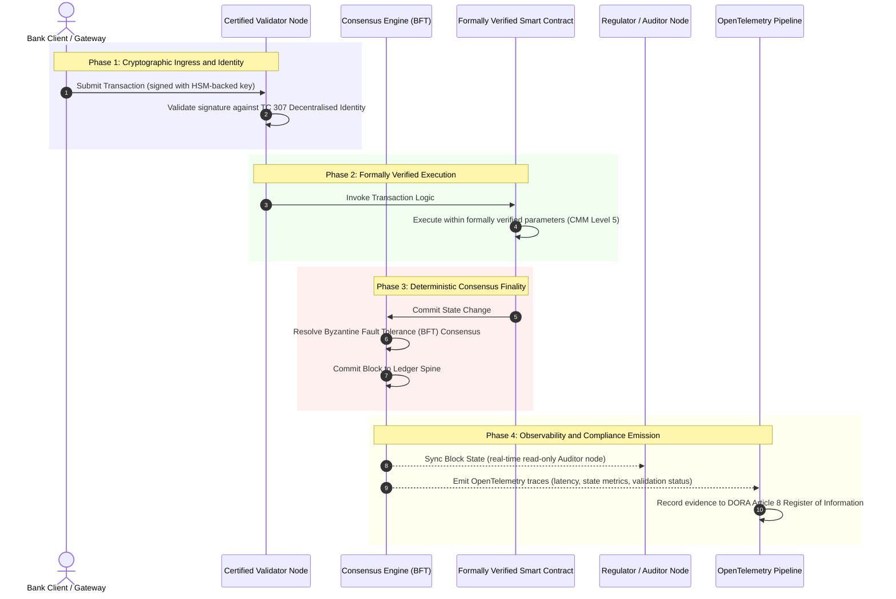

# Mula Ebidensya Tungo sa Katotohanan: Bakit Tutukuyin ng Certified Blockchains ang Susunod na Panahon ng Tiwala sa Banking

**Ang immutable ay hindi katumbas ng pinagkakatiwalaan.** Habang lumilipat ang wholesale banking tungo sa real-time settlement at probabilistic AI, ang ledger na nagpapasya kung ano ang totoo ay naging ang isang layer na hindi pa rin masesertipika ng mga bangko. Sinesertipika nila ang entidad sa ilalim ng Basel III, ang cloud sa ilalim ng ISO 27001 at ang kanilang AI sa ilalim ng ISO 42001, ngunit ang distributed ledger, ang governance nito, consensus, cryptography at smart contracts, ay iniiwan sa vendor-specific na palagay. Ipinapangatuwiran ng ulat na ito na ang pagsasara ng fiduciary gap na iyon ay nangangailangan ng paglipat mula sa gabay ng ISO/IEC TC 307 tungo sa prescriptive assurance: ang pag-score sa ledger laban sa isang 5-level Certified Blockchain Index na nagpapalit ng engineering metrics tungo sa board-auditable, DORA-defensible na katotohanan.

<!-- lead-start -->
<aside class="post-lead" aria-label="Buod ng artikulo">

<strong>TL;DR.</strong> Sinesertipika ng mga bangko ang entidad, ang cloud at ang kanilang AI, ngunit hindi ang ledger na lalong nagpapasya kung ano ang totoo. Ang ISO/IEC TC 307 ay nagbibigay ng gabay, hindi assurance. Ini-score ng isang 5-level Certified Blockchain Index ang ledger governance, consensus integrity, identity at cryptography, smart-contract assurance at observability laban sa isang Capability Maturity Model, na isinasara ang fiduciary gap at binibigyan ang probabilistic AI ng deterministic audit spine.

<strong>Mga pangunahing aral</strong>

<ul class="post-lead-takeaways">
  <li><strong>Ang fiduciary frictional gap.</strong> Ang bangko (Basel III), ang cloud (ISO 27001) at ang AI governance system (ISO 42001) ay masesertipika; ang distributed ledger na nagpapasya kung ano ang totoo ay hindi pa. Ang asimetriyang iyon ay isang buhay na operational vulnerability.</li>
  <li><strong>Ginagawang personal ito ng DORA.</strong> Sa ilalim ng DORA Article 5, may direkta, hindi maidedelegang pananagutan ang mga board ng bangko para sa resilience ng third-party at ledger deployments, kasama ang SM&amp;CR na personal na parusa sa pagkabigo.</li>
  <li><strong>Ang AI audit spine.</strong> Ang machine learning ay hindi maulit; kinukuha ng certified blockchain ang mga model version, input at validation decision nang deterministiko sa on-chain, na tumutugon sa ISO 42001 at mga pamantayan ng model-risk-management.</li>
  <li><strong>Ang Certified Blockchain Index.</strong> Ang governance, consensus, cryptography, smart contracts at observability ay nagiging isang 0-to-5 CMM scorecard na nagsasalin ng engineering metrics tungo sa board-approved na Risk Appetite Statements.</li>
</ul>

<strong>Kaugnay na babasahin:</strong> <a href="https://sebastienrousseau.com/2026-07-02-certified-blockchains-banking-trust-tc307-assurance-2026">Certified Blockchains at Tiwala sa Banking: TC 307 Assurance</a>, <a href="https://sebastienrousseau.com/2026-07-24-global-payments-outlook-operating-model-risk-revenue">Ang 2026 Global Payments Outlook</a>.

</aside>
<!-- lead-end -->

> **Executive Summary**
>
> - **Ang wholesale banking ay nasa isang inflection point.** Sinisira ng real-time clearing at probabilistic AI ang analogue, retrospective assurance model: ang mga static, entity-based na audit ay hindi na tumutugon sa modernong risk-management o fiduciary na pangangailangan.
> - **Ang TC 307 ay isang baseline, hindi isang sertipiko.** Isinapamantayan ng ISO/IEC TC 307 ang bokabularyo, reference architecture at security guidance para sa distributed ledgers, ngunit ito ay descriptive. Tinutukoy nito kung ano ang hitsura ng mabuti; hindi nito ibinibigay ang prescriptive verification na kailangan ng mga risk officer at supervisor upang pahintulutan ang production deployment.
> - **Ang assurance ay nangangahulugang pag-score sa ledger.** Ang governance, consensus integrity, smart-contract safety at cryptographic agility, na na-score laban sa isang mahigpit na 5-level Capability Maturity Model, ay naglilipat sa mga bangko mula sa patchwork, vendor-specific na palagay tungo sa certifiable, board-auditable na katotohanan sa pananalapi.
> - **Ang ledger ang audit spine para sa AI.** Ang pag-angkla sa mga model version, input at validation decision sa deterministic consensus ay nagbibigay sa hindi maulit na machine learning ng isang maipagtatanggol, muling maitatayong evidentiary record sa ilalim ng ISO 42001, SR 11-7 at PRA SS1/23.

## Ang Fiduciary Frictional Gap sa Digital Banking

Sa klasikong banking, ang tiwala ay relational, institutional, at retrospective. Nakasalalay ito sa independiyente, third-party na mga auditor na sumusuri sa katayuan sa pananalapi sa mga static na punto ng panahon, na inaayos ang mga pagkakaiba sa mga bilateral ledger silo. Sa real-time, API-driven na mga merkado ng 2026, ang modelong ito ay nagdadala ng napakalaking latency at structural na panganib.

Kapag ang mga transaksyon ay nakakaayos kaagad, ang mga intraday liquidity pool ay dinamikong pinamamahalaan ng mga API gateway, at ang pagmamay-ari ng asset ay tokenised sa mga shared ledger, ang mga retrospective audit ay nagiging forensic na ehersisyo sa halip na preventative na kontrol. Ang mga fiduciary ay hindi na maaaring umasa lamang sa pagsertipika ng corporate entity. Kailangan nilang sertipikahan ang digital substrate mismo.

Sa kasalukuyan, ang mga bangko ay nagpapatakbo sa ilalim ng isang malinaw na architectural asymmetry:

1. **Certified Cloud Infrastructure**: Ang mga hardware node, virtualised container, at pisikal na datacenter ay napapatunayan laban sa ISO/IEC 27001 at SOC 2 Type II na mga kontrol.  
2. **Certified Management Processes**: Ang mga patakaran sa operational risk, business continuity plan, at algorithmic deployment ay pinamamahalaan sa ilalim ng mahigpit na risk framework.  
3. **Uncertified Ledger Engines**: Ang core distributed consensus mechanisms, validator node supply chains, smart contract boundaries, at network governance models ay iniiwan sa uncertified, custom, o consortium-specific na mga palagay.

Ang asimetriyang ito ay isang malaking failure point. Maaaring magpatakbo ang isang bangko ng napapatunayang aplikasyon sa loob ng isang secure, ISO 27001-certified na cloud container, ngunit kung ang container na iyon ay sumusulat sa isang distributed ledger na may centralised validator control, mahihinang consensus parameter, o un-audited na smart contract, ang integridad ng transaksyon ay nakompromiso. Upang malampasan ang gap na ito, ang ledger engine mismo ay dapat maging isang certifiable assurance object.

## Ang ISO/IEC TC 307 Standardisation Baseline

Ang pundasyong gawain na kailangan upang isapamantayan ang distributed ledgers ay itinatatag ng ISO/IEC Technical Committee 307 (TC 307\) (Blockchain and distributed ledger technologies). Sa halip na tratuhin ang blockchain bilang isang nakahiwalay na teknikal na protocol, tinatalakay ito ng TC 307 bilang isang institutional trust infrastructure, na inaayos ang gawain nito sa limang pangunahing pillar:

1. **Taxonomy and Vocabulary (ISO 22739\)**: Nagtatatag ng karaniwang nomenclature, na tinitiyak ang tuloy-tuloy na legal at operational na kahulugan sa iba't ibang hurisdiksyon, financial scheme, at institusyon.  
2. **Reference Architecture (ISO/TR 23245\)**: Tinutukoy ang mga hangganan, layer, data flow, at functional component ng isang compliant na distributed ledger system.  
3. **Security, Privacy, and Smart Contracts (ISO/TR 23244 / ISO 23613\)**: Nagtatatag ng baseline security guidelines para sa digital asset systems at nagdedetalye ng best practices para sa smart contract vulnerability mitigation at lifecycle governance.  
4. **Interoperability Frameworks**: Tinatalakay ang mga mekanismo ng data at asset-exchange sa pagitan ng magkakaibang ledger network, na pinipigilan ang pagbuo ng nakahiwalay na tokenised silo.  
5. **Decentralised Identity and Trust Anchors**: Isinasama ang ledger-based cryptographic identifiers sa mga pormal na public-key infrastructure (PKI) at state-authorised registry.

Sa kabuuan, sinasenyasan ng TC 307 ang paglipat ng DLT mula sa isang custom engineering choice tungo sa isang standardised architectural discipline. Gayunpaman, ang TC 307 ay nananatiling pangunahing descriptive. Tinutukoy nito kung ano ang hitsura ng mabuti (gabay), ngunit hindi nito ibinibigay ang prescriptive verification protocol (assurance) na kailangan ng mga risk officer at supervisor upang pahintulutan ang production deployment ng critical or important functions (CIFs).

## Gabay vs. Assurance: Ang Fiduciary na Pagkakaiba

Ang mga kalahok sa financial market ay hindi naglalagay ng teknolohiya dahil ito ay makabago o eleganteng; inilalagay nila ito kapag ito ay maaaring pamahalaan, i-audit, ipagtanggol, at ibalik sa capital reserve requirements. Ito ang dahilan kung bakit ang standardisation sa banking ay natural na nauuwi sa dalawang layer:

* **Gabay (Ang Framework)**: Binabalangkas ang best practices, reference targets, at architectural guidelines (hal., ISO/IEC TC 307, NIST frameworks).  
* **Assurance (Ang Patunay)**: Nagbibigay ng independiyente, tuloy-tuloy, at third-party-verifiable na ebidensya na ang framework ay ipinatupad at gumagana ayon sa disenyo (hal., ISO 27001 certification, SOC 2 audits, regulatory examinations).

Ang pag-asa sa uncertified ledger consensus habang sinesertipika ang cloud infrastructure ay isang kritikal na regulatory gap. Ang isang blockchain na "immutable" ay hindi kinakailangang "institutionally trusted." Ang immutability ay ginagarantiyahan lamang na ang datos na ipinasok ay hindi nabago; hindi nito napapatunayan na ang validator nodes ay secure, na ang consensus protocol ay matatag laban sa collusion, na ang smart contract logic ay wasto sa matematika, o na ang cryptographic key management ay sumusunod sa post-quantum mandates.

Upang isara ang gap na ito, pinormaliza ng 2026 Certified Blockchain Index ang mga kinakailangang ito tungo sa isang nasusukat na Capability Maturity Model (CMM) na naka-mapa sa mga pandaigdigang regulasyon sa banking.

## Ang 2026 Certified Blockchain Index

Upang bigyang-kakayahan ang senior management na suriin at sertipikahan ang kanilang ledger platform, inaayos ng index na ito ang distributed ledger infrastructure sa limang auditable operational layer, na na-score sa isang 0-to-5 CMM scale.

### Talahanayan 1: Ang Arkitektura ng Certified Blockchain Index

| Index Layer | Capability Maturity Level (CMM) | Technical at Operational Metric | Regulatory / Fiduciary Control Reference |
| ---- | ---- | ---- | ---- |
| **Ledger Governance** | **Level 0**: Ad-hoc consortium**Level 3**: Automated validator vetting & rotation**Level 5**: Decentralised, multi-party cryptographic identity anchoring | % ng validator nodes na pinapatakbo ng mga vetted na financial entity; mean time upang lutasin ang validator disputes; heograpikong distribusyon ng mga node | **DORA Article 5** (Governance and Organisation); **CPMI-IOSCO PFMI Principle 2** (Governance) & **Principle 3** (Framework for the comprehensive management of risks) |
| **Consensus Integrity** | **Level 0**: Single-node o opaque POW**Level 3**: Audited BFT na may deterministic finality**Level 5**: Multi-jurisdictional, formally verified consensus na may tuloy-tuloy na latency monitoring | Max na matitiis na consensus latency; collusion-resistance threshold; uptime SLA sa ilalim ng simulated node partition | **DORA Article 6** (ICT Risk Management Framework); **CPMI-IOSCO PFMI Principle 8** (Settlement Finality) |
| **Identity & Cryptography** | **Level 0**: Mahihinang RSA / ECDSA key**Level 3**: Multi-sig na may HSM-backed key management**Level 5**: Quantum-safe hybrid keys (FIPS 203 ML-KEM) at zero-knowledge privacy gates | % ng ledger transactions na naka-sign gamit ang HSM-backed keys; PQC migration readiness score; ZK-proof latency | **NIST FIPS 203 / 204**; **ISO/IEC 27001** (Information Security Management) |
| **Smart Contract Assurance** | **Level 0**: Un-audited solidity scripts**Level 3**: Automated compiler validation & external audit**Level 5**: Formally verified, immutable smart contracts na may circuit-breaker upgrades | % ng smart contracts na may mathematical formal verification; bilang ng compiler warnings; vulnerability scan coverage | **EBA Guidelines on Outsourcing Arrangements** (Paragraphs 81, 113-117); **DORA Article 30** (Minimum Contractual Clauses) |
| **Audit & Observability** | **Level 0**: Manual log scraping**Level 3**: Structured OTel traces & read-only auditor nodes**Level 5**: Automated, tuloy-tuloy na reconciliation sa Article 8 register | % ng transaksyon na sakop ng OpenTelemetry traces; latency mula ledger block-commit tungo sa auditor-node sync | **BCBS 239** (Risk Data Aggregation); **DORA Article 8** (Register of Information / ITS Schemas) |

### Talahanayan 2: Mga Pangunahing Trust Signal na Naka-mapa sa Pandaigdigang Pamantayan sa Banking

| Signal / Benchmark | Metric | Epekto sa Banking Platforms | Regulatory Source |
| ---- | ---- | ---- | ---- |
| **ISO/IEC TC 307 Progress** | Paglipat mula ISO/TR technical reports tungo sa pormal na certification schemes | Nagtatatag ng unang standardised na framework para sertipikahan ang distributed ledger engines | **ISO/IEC JTC 1 / SC 44** (Distributed Ledger Technologies) |
| **Project Agorá Prototype Phase** | 40+ na kalahok na commercial bank; unified ledger testing ng tokenised deposits | Inililipat ang cross-border clearing mula messaging (SWIFT) tungo sa atomic tokenised settlement | **Bank for International Settlements (BIS) Innovation Hub** |
| **DORA Article 30 Third-Party Audit** | 100% ng node provider at infrastructure host na na-audit laban sa security criteria | Inaalis ang "shadow validator nodes"; nag-uutos ng ganap na supply-chain transparency | **European Supervisory Authorities (ESA)** |
| **ISO/IEC 42001 (AI Governance)** | Cryptographically immutabilised na AI model at training logs sa on-chain | Ginagamit ang blockchain bilang immutable evidentiary ledger ("audit spine") para sa machine learning | **ISO/IEC 42001:2023** (Information technology, Artificial intelligence) |
| **Basel III Capital Adequacy** | Pagbabawas sa operational risk capital buffers batay sa dokumentadong pagbabawas ng pagkakumplikado | Direktang kinikredito ng standardised operational risk frameworks ang napatunayang ledger resilience | **Basel Committee on Banking Supervision (BCBS)** |

## Ang AI "Audit Spine": Probabilistic Intelligence sa Deterministic Infrastructure

Isa sa pinakamakapangyarihang strategic na papel para sa isang certified blockchain sa 2026 ay ang pagkilos bilang isang **"Audit Spine"** para sa mga deployment ng artificial intelligence. Ang mga modernong financial system ay lalong probabilistic. Ang credit scoring, real-time fraud detection, algorithmic trading, at autonomous customer interactions ay hinihimok ng machine learning models na nagbabago, umaanod, at umaangkop sa paglipas ng panahon. Ang mga modelong ito ay non-deterministic: sa parehong input sa dalawang magkaibang oras, maaari silang magbigay ng iba't ibang output dahil sa dynamic na weights at tuloy-tuloy na training.

Ang non-determinism na ito ay nagdadala ng isang malalim na hamon sa governance sa ilalim ng **ISO/IEC 42001 (AI Governance)** at **Model Risk Management (MRM)** na mga pamantayan (tulad ng **US Federal Reserve SR 11-7** at **UK PRA SS1/23**): *Paano mo ia-audit, ipapaliwanag, at ipagtatanggol ang mga desisyon na hindi mahigpit na maulit?*

Ang isang certified distributed ledger ay nagbibigay ng deterministic na counterweight. Habang gumagana ang AI models nang probabilistiko, itinatala ng certified blockchain ang kanilang mga parameter nang deterministiko, na nagtatatag ng isang hindi mababagong evidentiary spine:

* **Model Versioning and Weight Anchoring**: Ang bawat na-deploy na model version, ang kaugnay na weights nito, at ang training data checksums nito ay hinash at isinusulat sa ledger sa build-time, na tumutugon sa **SLSA Level 3** supply-chain requirements.  
* **Contextual Input Logging**: Kapag ang isang AI model ay nagsasagawa ng isang kritikal na desisyon (hal., pag-apruba ng loan o pag-flag ng transaksyon), ang eksaktong contextual inputs at model hashes ay isinusulat sa ledger, na lumilikha ng isang tamper-evident na kasaysayan.  
* **Auditability without Code Access**: Kung magtanong ang isang regulator, "Bakit tinanggihan ng inyong model ang credit application na ito noong June 3?" hindi kailangan ng bangko na ilantad ang proprietary code o subukang muling likhain ang eksaktong estado ng model. Ipinapakita nito ang cryptographically signed, on-chain na ledger record ng mga input, weights, at validation state.

Sa pamamagitan ng pag-angkla ng probabilistic na mga desisyon ng machine learning models sa deterministic consensus ng isang certified blockchain, ang institusyon ay lumilikha ng isang maipagtatanggol, muling maitatayo, at independiyenteng napapatunayang timeline ng mga automated na aksyon.

## Pagbibiswalisa ng Certified Consensus-to-Audit Pipeline

Ang sumusunod na sequence diagram ay naglalarawan ng lifecycle ng isang transaksyon na dumaraan sa isang certified blockchain platform, na nagpapakita kung paano nag-iinterlock ang validation gates, consensus integrity, smart contract execution, at telemetry emission upang makabuo ng board-ready na regulatory evidence:

Ang kritikal na landas para sa transactional sequence na ito ay nangangailangan na ang bawat validation, execution, at consensus step ay cryptographically signed, na tinitiyak ang end-to-end provenance. Ang auditor node ng regulator ay nagsi-synchronise ng block state sa real-time, na inaalis ang pangangailangan para sa retrospective, manual na financial reconciliation.

## Ang Boardroom Playbook para sa mga Senior Manager

Upang matagumpay na pamahalaan ang paglipat mula organisational trust tungo sa infrastructural trust, ang mga executive at senior manager ng bangko ay dapat agad na isagawa ang apat na pangunahing direktiba:

1. **I-mandato ang Ledger Audits sa Enterprise Risk Management (ERM)**: Ipatupad ang isang patakaran na walang distributed ledger platform, maging pribado, publiko, o consortium-based, ang maaaring i-deploy para sa critical or important functions (CIFs) maliban kung ito ay na-audit laban sa 5-layer na **Certified Blockchain Index Architecture** (CMM Level 3 minimum).  
2. **Isama ang Blockchains bilang ang ISO 42001 AI Evidentiary Spine**: Utusan ang Chief Risk Officer at Lead AI Architect na isama ang lahat ng high-impact na machine learning models sa isang certified blockchain, na lumilikha ng isang tamper-evident na audit ledger ng model versions, weights, inputs, at desisyon.  
3. **I-audit ang Validator Node Supply Chain (DORA Article 30\)**: Atasan ang procurement division na i-audit ang lahat ng third-party na entidad na nagho-host ng validator nodes o namamahala ng cloud hosting para sa DLT networks, na nag-uutos ng pagsunod sa parehong cybersecurity at operational resilience na pamantayan na inilalapat sa internal cloud nodes ng bangko.  
4. **Ihanay ang Ledger Architectures sa CPMI-IOSCO at BCBS 239**: Utusan ang platform engineering team na ihanay ang ledger output telemetry nang direkta sa mga kinakailangan sa data reporting ng **BCBS 239**, at tiyakin na ang consensus at settlement finality parameters ay mahigpit na sumusunod sa **CPMI-IOSCO Principles 8 at 9**.

## Mga Madalas Itanong

**Ang ISO/IEC TC 307 ba ay isang certification standard?**  
Hindi. Ang ISO/IEC TC 307 ay isang technical committee na nagtatatag ng bokabularyo, reference architectures, at security guidelines. Bagama't tinutukoy nito kung "ano ang hitsura ng mabuti" (gabay), dapat gawing operational ng industriya ang mga dokumentong ito tungo sa pormal, auditable na certification schemes (assurance) upang tugunan ang mga banking supervisor.

**Paano sinusuportahan ng isang certified blockchain ang DORA compliance?**  
Sa ilalim ng DORA Article 5, ang mga board ng bangko ay may direkta, personal na pananagutan para sa technology resilience. Ang isang certified blockchain ay nagbibigay ng napapatunayang, cryptographic na ebidensya ng consensus integrity, validator supply-chain control, at smart contract safety, na nagbibigay sa mga miyembro ng board ng nadodokumentong "reasonable steps" na kailangan upang ipagtanggol laban sa SM\&CR na personal liability claims.

**Ano ang pagkakaiba ng isang tradisyonal na ledger audit at isang certified blockchain audit?**  
Ang isang tradisyonal na audit ay retrospective, na napapatunayan ang manual entries at static files pagkatapos maayos ang mga transaksyon. Ang isang certified blockchain audit ay tuloy-tuloy at real-time; ang validator nodes, BFT consensus engine, at formally verified smart contracts ay sertipikado na magsagawa ng mga transaksyon nang deterministiko, na naglalabas ng structured telemetry (OpenTelemetry) na tuloy-tuloy na napapatunayan ang kalusugan ng sistema.

**Maaari bang sertipikahan ang mga public blockchain para sa banking use?**  
Sa karamihan ng mga hurisdiksyon, ang purong permissionless na public blockchains ay nabibigong tugunan ang mga regulasyon sa banking dahil sa kawalan ng validator identity verification, hindi mahuhulaang gas/transaction costs, at non-deterministic finality (hal., probabilistic proof-of-work/stake forks). Ang certified blockchains sa banking ay karaniwang gumagamit ng enterprise permissioned o mataas na regulated na public-hybrid architectures kung saan ang validator node operators ay kinilalang at na-audit na mga financial entity.

## Mga Sanggunian

* Basel Committee on Banking Supervision (BCBS), 2013\. *Principles for effective risk data aggregation and reporting (BCBS 239\)*. Basel: Bank for International Settlements. Available at: [Basel Committee on Banking Supervision (BCBS), 2013\.](https://www.bis.org/publ/bcbs239.pdf "Basel Committee on Banking Supervision (BCBS), 2013\.").  
* Committee on Payments and Market Infrastructures and Technical Committee of the International Organisation of Securities Commissions (CPMI-IOSCO), 2012\. *Principles for financial market infrastructures*. Basel: Bank for International Settlements. Available at: [Committee on Payments and Market Infrastructures and Technical Committee of the International Organisation of Securities Commissions (CPMI-IOSCO), 2012\.](https://www.bis.org/cpmi/publ/d101a.pdf "Committee on Payments and Market Infrastructures and Technical Committee of the International Organisation of Securities Commissions (CPMI-IOSCO), 2012\.").  
* European Banking Authority (EBA), 2019\. *EBA/GL/2019/02, Guidelines on outsourcing arrangements*. Paris: EBA. Available at: [European Banking Authority (EBA), 2019\.](https://www.eba.europa.eu/regulation-and-policy/internal-governance/guidelines-on-outsourcing-arrangements "European Banking Authority (EBA), 2019\.").  
* European Parliament and Council of the European Union, 2022\. *Regulation (EU) 2022/2554 on digital operational resilience for the financial sector (DORA)*. Brussels: Official Journal of the European Union. Available at: [European Parliament and Council of the European Union, 2022\.](https://eur-lex.europa.eu/legal-content/EN/TXT/?uri=CELEX%3A32022R2554 "European Parliament and Council of the European Union, 2022\.").  
* ISO/IEC JTC 1/SC 42, 2023\. *ISO/IEC 42001:2023, Information technology, Artificial intelligence, Management system*. Geneva: International Organisation for Standardisation. Available at: [ISO/IEC JTC 1/SC 42, 2023\.](https://www.iso.org/standard/81230.html "ISO/IEC JTC 1/SC 42, 2023\.").  
* ISO/IEC Technical Committee 307, 2020\. *ISO/IEC 22739:2020, Blockchain and distributed ledger technologies, Vocabulary*. Geneva: International Organisation for Standardisation. Available at: [ISO/IEC Technical Committee 307, 2020\.](https://www.iso.org/standard/73771.html "ISO/IEC Technical Committee 307, 2020\.").  
* National Institute of Standards and Technology (NIST), 2026\. *First Three Finalised Post-Quantum Encryption Standards (FIPS 203, 204, and 205\)*. Gaithersburg: U.S. Department of Commerce. Available at: [National Institute of Standards and Technology (NIST), 2026\.](https://www.nist.gov/news-events/news/2024/08/nist-releases-first-3-finalised-post-quantum-encryption-standards "National Institute of Standards and Technology (NIST), 2026\.").
