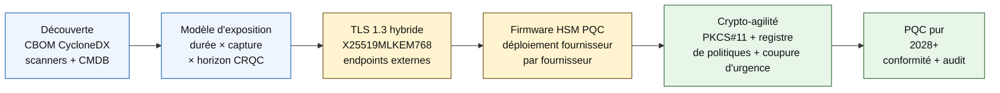

# Index 2026 de la banque quantum-safe : cryptographie post-quantique, QKD, crypto-agilité et risque harvest-now-decrypt-later

<!-- lead-start: manual -->
<aside class="post-lead" aria-label="Résumé de l'article">

<strong>TL;DR.</strong> La banque quantum-safe en 2026 est un programme de livraison dont l'échéance est fixée par l'intersection de deux courbes — la durée de confidentialité des données que l'institution détient aujourd'hui, et l'horizon d'arrivée d'un ordinateur quantique cryptographiquement pertinent (CRQC, Cryptographically Relevant Quantum Computer). Les standards NIST FIPS 203 / 204 / 205 sont finaux depuis août 2024 ; CNSA 2.0 fixe l'état cible fédéral américain à 2033 ; le harvest-now-decrypt-later s'exerce déjà sur les données à durée longue. Le tableau de bord quantique pour le conseil suit quatre pourcentages exacts : exhaustivité de l'inventaire, exposition HNDL, avancement de la migration NIST, préparation à la crypto-agilité.

<strong>Points clés</strong>

<ul class="post-lead-takeaways">
  <li><strong>Le débat sur les algorithmes s'est clos le 13 août 2024.</strong> ML-KEM (FIPS 203), ML-DSA (FIPS 204), SLH-DSA (FIPS 205) sont les réponses. Les banques qui pilotent encore en interne des évaluations pour « choisir le gagnant » accusent 18 mois de retard.</li>
  <li><strong>Le harvest-now-decrypt-later s'applique déjà.</strong> Tout actif dont la durée de confidentialité dépasse l'horizon crédible d'un CRQC — prêts immobiliers à 30 ans, souscription assurance-vie, enregistrements de transactions MiFID II / RGPD, archives de rétention M&amp;A — doit basculer dès maintenant vers une encapsulation de clé hybride quantum-safe, sans attendre l'annonce d'un CRQC.</li>
  <li><strong>L'inventaire est le palier de maturité bloquant.</strong> Une nomenclature cryptographique (CBOM, Cryptographic Bill of Materials) — protocole, bibliothèque, certificat, partition HSM, dépendance fournisseur, propriétaire applicatif, durée de classification des données — conditionne tout le reste. Suivez la fraîcheur, pas la couverture.</li>
  <li><strong>TLS 1.3 hybride est le déploiement 2026.</strong> Le key share hybride X25519MLKEM768 est ce que Chrome / Firefox / Cloudflare / Akamai négocient effectivement aujourd'hui. Le TLS ML-KEM pur attend les firmwares HSM et la maturité des autorités de certification.</li>
  <li><strong>La crypto-agilité est le livrable durable.</strong> Abstraction PKCS#11, clés étiquetées, registre de politiques associant chaque service métier à un jeu d'algorithmes autorisé. Sans cela, la prochaine transition d'algorithme sera un nouveau programme pluriannuel.</li>
</ul>
</aside>
<!-- lead-end -->

La banque quantum-safe en 2026 relève de la migration opérationnelle, pas de la spéculation. Le NIST a finalisé les trois premiers standards de cryptographie post-quantique, et les banques doivent désormais savoir précisément quels systèmes dépendent de RSA, ECC, TLS, des signatures, des HSM, des certificats, des canaux de paiement, des archives et des données confidentielles à durée longue. La question d'indice est simple : l'institution peut-elle remplacer sa cryptographie avant que la menace ne devienne opérationnelle ?

---

> **Résumé exécutif / Points clés**
>
> - **Les standards NIST sont désormais concrets.** FIPS 203 définit ML-KEM pour l'encapsulation de clé, FIPS 204 définit ML-DSA pour les signatures, et FIPS 205 définit SLH-DSA comme standard de signature sans état fondé sur des fonctions de hachage.
> - **L'inventaire est le premier palier de maturité.** Une banque ne migre pas ce qu'elle ne sait pas trouver : certificats, clés, protocoles, applications, fournisseurs, HSM, API, archives et systèmes embarqués doivent être cartographiés.
> - **La crypto-agilité est l'objectif durable.** Le but n'est pas un échange ponctuel d'algorithme ; c'est la capacité à changer de primitives cryptographiques sans refondre les applications.
> - **Les données à durée longue changent l'urgence.** Le risque harvest-now-decrypt-later implique que des données captées aujourd'hui peuvent devenir lisibles plus tard si leur valeur perdure assez longtemps.
> - **La QKD est un complément spécialisé.** La distribution quantique de clés peut être pertinente pour les canaux à plus forte valeur, mais elle ne remplace pas une migration PQC à l'échelle de l'institution.
>
---

## Pourquoi 2026 est l'année où cet index compte

Trois inflexions intervenues en 2024-2025 ont transformé le quantum-safe en programme bancaire mesurable, plutôt qu'en sujet de veille recherche. Premièrement, le NIST a finalisé les principaux standards post-quantiques le 13 août 2024 : [FIPS 203 (ML-KEM) ⧉](https://nvlpubs.nist.gov/nistpubs/FIPS/NIST.FIPS.203.pdf "FIPS 203 — Module-Lattice-Based Key-Encapsulation Mechanism"), [FIPS 204 (ML-DSA) ⧉](https://nvlpubs.nist.gov/nistpubs/FIPS/NIST.FIPS.204.pdf "FIPS 204 — Module-Lattice-Based Digital Signature Standard"), [FIPS 205 (SLH-DSA) ⧉](https://nvlpubs.nist.gov/nistpubs/FIPS/NIST.FIPS.205.pdf "FIPS 205 — Stateless Hash-Based Digital Signature Standard"). Le débat sur la sélection des algorithmes s'est clos ce jour-là ; les banques qui font tourner en 2026 des chantiers internes du type « quel schéma l'emportera » accusent 18 mois de retard.

Deuxièmement, le [CNSA 2.0 de la NSA ⧉](https://media.defense.gov/2022/Sep/07/2003071834/-1/-1/0/CSA_CNSA_2.0_ALGORITHMS_.PDF "Commercial National Security Algorithm Suite 2.0") fixe l'état cible fédéral américain à 2033, avec des jalons intermédiaires dès 2027 pour la signature de logiciels et de firmwares, et 2030 pour les navigateurs et systèmes d'exploitation. Toute banque exposée à des contreparties fédérales américaines — FedNow, opérations Treasury, comptes clients fédéraux — entre dans ce périmètre pour les systèmes qui touchent à la donnée fédérale. Le compte à rebours n'est plus abstrait.

Troisièmement, le [harvest-now-decrypt-later (HNDL) ⧉](https://csrc.nist.gov/Projects/post-quantum-cryptography "Programme Post-Quantum Cryptography du NIST") porte la charge de l'argument d'urgence. Des adversaires sophistiqués captent déjà des messages de paiement protégés par TLS, des enveloppes SWIFT, des dossiers KYC et du texte chiffré d'archives à durée longue dans les grandes places financières. Les données captées en 2026 n'ont besoin que d'être encore sensibles au moment du déchiffrement — pour les prêts immobiliers à 30 ans, la souscription assurance-vie, les enregistrements de transactions MiFID II / RGPD et les archives de rétention M&A, cette fenêtre dépasse largement toutes les estimations crédibles d'un ordinateur quantique cryptographiquement pertinent (CRQC). L'adversaire n'a pas besoin d'un ordinateur quantique aujourd'hui. Il lui en faut un avant que les données ne perdent leur valeur.

L'Index 2026 de la banque quantum-safe mesure si votre institution peut livrer la migration avant que cette intersection ne survienne. La question n'est plus de savoir s'il faut migrer ; c'est de savoir si la migration s'achève dans un calendrier défendable.

## L'architecture de l'index 2026

| Couche d'index | Direction 2026 | Indicateur de préparation | Risque en cas d'échec |
|---|---|---|---|
| **Inventaire** | Cartographier les actifs cryptographiques, protocoles, certificats, fournisseurs et classes de données | Pourcentage du parc inventorié | Dépendances quantum-vulnérables inconnues |
| **Exposition** | Classer les systèmes selon la durée de confidentialité et la criticité transactionnelle | Actifs à fort risque par valeur et durée | Priorisation erronée de la migration |
| **Migration** | Adopter des schémas hybrides et PQC-ready alignés sur les standards NIST | Préparation ML-KEM et ML-DSA | Replatformation d'urgence sous délai |
| **Crypto-agilité** | Séparer la logique applicative des primitives cryptographiques | Couverture cryptographique pilotée par politique | Algorithmes codés en dur dans tout le parc |
| **Assurance** | Tester l'interopérabilité, la performance, le support HSM, les certificats et la maturité fournisseur | Taux de réussite des tests et stock d'exceptions | Canaux rompus ou contrôles de repli faibles |

### Le tableau de bord quantique pour le conseil

Un tableau de bord de préparation quantique crédible exige le suivi de pourcentages exacts, pas seulement d'états d'avancement projet :

1. **Exhaustivité de l'inventaire :** le pourcentage d'applications de niveau 1 dotées d'une nomenclature cryptographique (CBOM) intégralement cartographiée.
2. **Exposition HNDL :** le volume de données confidentielles à durée longue (p. ex. PII, secrets d'affaires) transmises sur les réseaux sans encapsulation de clé hybride quantum-safe.
3. **Avancement de la migration NIST :** le pourcentage de clés de chiffrement asymétriques et de signatures numériques migrées vers les standards FIPS 203 (ML-KEM) et FIPS 204 (ML-DSA).
4. **Préparation à la crypto-agilité :** le pourcentage de systèmes critiques où les algorithmes cryptographiques peuvent être rotés via une politique centralisée, sans recompilation du code.

## Signaux à suivre

| Signal | Ce que cela signifie pour les banques | Source |
|---|---|---|
| **FIPS 203 ML-KEM** | Standard NIST principal pour l'établissement de clés de chiffrement | [NIST ⧉](https://www.nist.gov/news-events/news/2024/08/nist-releases-first-3-finalized-post-quantum-encryption-standards "Premiers trois standards finalisés de chiffrement post-quantique") |
| **FIPS 204 ML-DSA** | Standard NIST principal pour les signatures numériques | [NIST ⧉](https://www.nist.gov/news-events/news/2024/08/nist-releases-first-3-finalized-post-quantum-encryption-standards "Premiers trois standards finalisés de chiffrement post-quantique") |
| **FIPS 205 SLH-DSA** | Signature fondée sur le hachage : alternative et conception de repli | [NIST ⧉](https://www.nist.gov/news-events/news/2024/08/nist-releases-first-3-finalized-post-quantum-encryption-standards "Premiers trois standards finalisés de chiffrement post-quantique") |
| **Intégration immédiate encouragée** | Le NIST demande explicitement aux administrateurs d'amorcer l'intégration : la migration complète prend du temps | [NIST ⧉](https://www.nist.gov/news-events/news/2024/08/nist-releases-first-3-finalized-post-quantum-encryption-standards "Premiers trois standards finalisés de chiffrement post-quantique") |
| **Les programmes quantiques des banques s'élargissent** | Les grandes banques explorent les technologies quantiques tout en préparant leur transition PQC | [Quantum Insider ⧉](https://thequantuminsider.com/2026/03/27/15-plus-global-banks-probing-the-wonderful-world-of-quantum-technologies/ "Panorama des banques mondiales explorant les technologies quantiques") |

## La migration commence par le registre de cryptographie

La séquence de migration est bien comprise à ce stade. Chaque étape produit la preuve qui alimente la suivante ; sauter ou compresser une étape, c'est exactement ce qui génère le risque de replatformation d'urgence inscrit dans la colonne d'échec de l'architecture indicielle.

Le premier livrable n'est pas un nouvel algorithme ; c'est une nomenclature cryptographique (CBOM). Les banques ont besoin d'un inventaire vivant qui relie les services métier aux algorithmes, bibliothèques, certificats, longueurs de clé, HSM, durées de vie des données, fournisseurs et propriétaires opérationnels. Sans ce registre, la migration quantum-safe devient un exercice à l'aveugle.

Le jeu d'enregistrements CBOM doit capter, pour chaque primitive cryptographique : le protocole ou l'interface (TLS 1.3, IPsec, SSH, format propriétaire de message de paiement), l'algorithme et le jeu de paramètres (RSA-2048, ECDH P-256, ML-KEM-768, ML-DSA-65), la bibliothèque et sa version (OpenSSL 3.4, empreinte de commit BoringSSL, build de SDK fournisseur), la frontière matérielle (partition HSM, TPM, enclave sécurisée, ou aucune), l'identité du certificat le cas échéant, le propriétaire applicatif et la durée de classification des données. Les outils qui entrent en production en 2025-2026 — IBM Quantum Safe Inventory, la [spécification open source CycloneDX CBOM ⧉](https://cyclonedx.org/capabilities/cbom/ "CycloneDX Cryptography Bill of Materials"), les scanners entreprise de CryptoNext / Sandbox / PQShield — s'intègrent dans les chaînes CMDB existantes. Aucun n'est complet à lui seul ; tablez sur un cycle de construction CBOM de 12 à 18 mois, même avec outillage fournisseur et équipe dédiée.

L'indicateur à suivre est la fraîcheur, pas la couverture. Un CBOM vieux de deux mois est pire que pas de CBOM du tout, parce qu'il donne à l'équipe sécurité une fausse confiance sur ce qui a été migré.

## Hybride d'abord, agile toujours

La plupart des banques ne basculeront pas tout d'un seul coup. Le schéma réaliste est le déploiement hybride, où les mécanismes classiques et post-quantiques tournent ensemble pendant que fournisseurs, protocoles, certificats et outillage opérationnel mûrissent. La cible à long terme est la crypto-agilité : des choix cryptographiques pilotés par politique, modifiables sans reconstruire l'application métier.

[Insérer composant interactif : calculateur de risque harvest-now-decrypt-later (HNDL) — outil à curseurs où les dirigeants saisissent la durée de vie des données face au calendrier quantique estimé, pour visualiser leur fenêtre d'exposition.]

> **À retenir :** si vos données doivent rester confidentielles pendant 10 ans, et qu'un ordinateur quantique cryptographiquement pertinent (CRQC) se trouve à 7 ans, votre échéance de migration n'est pas dans 7 ans — elle se situait il y a 3 ans.

Concrètement, cela signifie TLS 1.3 avec le key share hybride `X25519MLKEM768` pour les points de terminaison externes (Chrome / Firefox / Cloudflare / Akamai le supportent tous aujourd'hui), des chaînes de signature classiques tant que l'infrastructure HSM et CA n'a pas rattrapé son retard, et une couche d'abstraction PKCS#11 qui permet au registre de politiques de rotr les algorithmes sans recompiler les applications métier. La crypto-agilité décide si la prochaine transition d'algorithme (qui aura lieu, c'est une question de quand, pas de si) sera une rotation de six semaines ou un nouveau programme de sept ans.

## La place de la QKD

La distribution quantique de clés a sa place dans l'index comme option pour les canaux à très haute sensibilité, notamment pour les infrastructures de marché, la connectivité avec les banques centrales et les flux institutionnels extrêmement sensibles. Elle doit être traitée comme un complément à la PQC, pas comme un prétexte à différer la migration de l'entreprise.

## Ce que cela signifie selon le type de banque

### Banques d'importance systémique mondiale

Le problème difficile est l'échelle : dizaines de milliers de points de terminaison TLS, centaines de partitions HSM, dizaines d'autorités de certification internes, centaines d'applications métier intégrant des primitives cryptographiques et des SDK fournisseurs que la banque ne peut pas modifier. L'investissement n'est pas un énième pilote ; c'est l'outillage CBOM, la couche d'abstraction PKCS#11 câblée dans chaque nouveau build, le plan de consolidation HSM qui désigne un fournisseur pivot pour les firmwares PQC en acceptant une traîne pluriannuelle sur les autres, et le registre de politiques qui devient la surface durable de crypto-agilité bien après la fin de la migration FIPS 203 / 204 / 205.

### Banques de transaction et de financement aux entreprises

Le périmètre de migration est plus étroit qu'au niveau G-SIB, mais l'exposition HNDL est aiguë : messagerie SWIFT transfrontière, données de paiement structurées portant des PII de contreparties corporate, plateformes d'échange documentaire abritant la documentation de trade finance, et archives de reporting à rétention longue. Priorisez le TLS hybride sur chaque point de terminaison client et la PQC au repos pour les archives de rétention. Exigez la responsabilité du fournisseur HSM — l'équipe de plateforme corporate banking dispose d'un levier d'achat direct qui fait souvent défaut à l'équipe technologie wholesale.

### Banques régionales

Achetez la pile fournisseur qui dispose déjà des primitives de crypto-agilité. Sélectionnez une plateforme core banking dont l'éditeur publie un CBOM et s'engage sur des calendriers de support ML-KEM / ML-DSA. Validez que la feuille de route HSM de l'éditeur s'aligne sur l'échéance de migration de la banque. La capacité d'ingénierie nécessaire pour construire la crypto-agilité ex nihilo se compte en années ; l'éditeur paie ce coût mutualisé sur l'ensemble de ses clients, et la banque en hérite. Le travail de validation — vérifier que les déclarations de l'éditeur résistent au processus MRM de l'institution — constitue le périmètre interne légitime.

### Fintechs, PSP et fournisseurs d'infrastructure

La question concurrentielle pour les éditeurs qui vendent aux banques en 2026 n'est pas « supportez-vous la PQC ». C'est « pouvez-vous produire un CBOM CycloneDX pour votre plateforme, une matrice de support HSM par fournisseur et un SLA écrit de rotation d'algorithmes ». Les éditeurs qui répondent oui passeront les portes d'achat Tier 1 en 2026-2027. Ceux qui ne le peuvent pas perdront le cycle de renouvellement face à un concurrent qui le peut.

## Conclusion

La banque quantum-safe en 2026 n'est pas un sujet de veille recherche ; c'est un programme de livraison dont l'échéance est fixée par l'intersection de deux courbes — la durée de confidentialité des données que l'institution détient aujourd'hui, et l'horizon d'arrivée d'un ordinateur quantique cryptographiquement pertinent. Les institutions qui paraîtront crédibles devant les régulateurs et les contreparties en 2030 sont celles qui ont entamé la construction du CBOM en 2024, déployé le TLS hybride sur chaque point de terminaison externe d'ici fin 2026, et ingénié la crypto-agilité dans chaque nouveau build dès le premier jour. Celles qui ne l'ont pas fait découvriront si leur fenêtre de migration s'est déjà refermée pour les données que leur adversaire collecte aujourd'hui.

Mesurez la migration comme tout programme opérationnel : périmètre connu, séquencement priorisé, échéances tenues, registres d'exceptions honnêtes. Plus vous regardez votre propre parc en face, plus la fenêtre de migration paraît étroite.

## Questions fréquentes

**Par quoi une banque doit-elle commencer son inventaire ?**

Commencez par le TLS exposé en externe, les canaux de paiement, l'authentification client, la connectivité interbancaire, les services adossés à un HSM, les archives long terme, et les systèmes qui traitent des données confidentielles à longue durée de vie utile.

**La PQC n'est-elle qu'un sujet de cybersécurité ?**

Non. Elle affecte les paiements, l'identité, la preuve juridique, la signature des transactions, la confiance client, la rétention des données, la gestion fournisseur et la résilience opérationnelle.

**Que signifie la crypto-agilité ?**

La crypto-agilité, c'est la capacité à changer les primitives cryptographiques via la politique et le plan de contrôle de la plateforme, plutôt que par des modifications applicatives codées en dur.

**Les banques doivent-elles attendre d'autres standards ?**

Non. Le NIST a explicitement encouragé les administrateurs à commencer à intégrer les premiers standards finaux, l'intégration complète prenant du temps.

## Références

- NIST, (2026). [Premiers trois standards finalisés de chiffrement post-quantique ⧉](https://www.nist.gov/news-events/news/2024/08/nist-releases-first-3-finalized-post-quantum-encryption-standards "Premiers trois standards finalisés de chiffrement post-quantique").

<!-- enrich-start -->
<aside class="author-card" aria-label="À propos de l'auteur"><strong class="author-card-name"><a href="/about/index.html">Sebastien Rousseau</a></strong>Technologue bancaire senior, écrivant sur l'IA appliquée, les infrastructures de paiement, la monnaie tokenisée, ISO 20022, la sécurité post-quantique, les services financiers cloud-natifs et les marchés numériques régulés.Plus de 20 ans à HSBC Commercial &amp; Investment Bank, PayPal, Barclays, Shazam, AKQA, Virgin Group. <a href="/about/index.html">Profil complet</a> &middot; <a href="https://www.linkedin.com/in/sebastienrousseau/" rel="external noopener">LinkedIn</a> &middot; <a href="https://github.com/sebastienrousseau" rel="external noopener">GitHub</a></aside>

Dernière revue <time datetime="2026-06-04">2026-06-04</time>.

<!-- enrich-end -->
