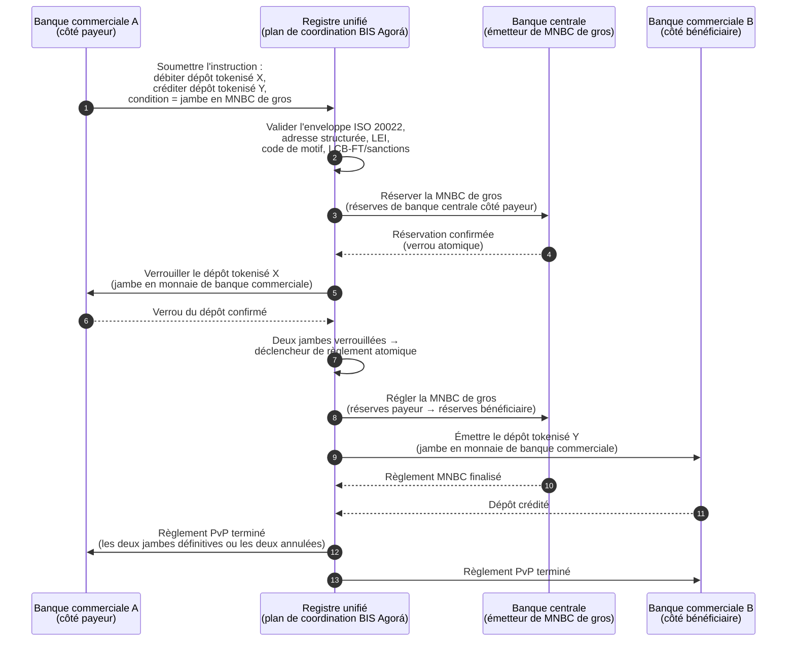

<!-- lead-start: manual -->
<aside class="post-lead" aria-label="Résumé de l'article">

<strong>TL;DR.</strong> Les paiements de gros en 2026 se situent à l'intersection de deux basculements structurels : ISO 20022 qui impose des données de paiement structurées au modèle opérationnel, et les dépôts tokenisés associés au Project Agorá du BIS qui font évoluer le règlement transfrontalier vers des rails atomiques, programmables et disponibles en permanence. La question 2026 pour une banque n'est plus « avons-nous migré les messages » mais « nos opérations de paiement sont-elles mesurables, routées et supervisables » — et l'index décompose cette question en quatre pourcentages exacts : complétude des données structurées, optimalité du routage des rails, latence du caractère définitif du règlement et couverture des corridors Agorá.

<strong>Points clés</strong>

<ul class="post-lead-takeaways">
  <li><strong>Novembre 2026 est une échéance ferme, pas une orientation.</strong> SWIFT retire la prise en charge des adresses non structurées dans SR 2026 ; les paiements sans ville ni pays dans les champs désignés ne passent plus la compensation. Coût de réparation, taux de rejet et capacité d'exploitation passent tous du statut de « métrique » à celui de « posture visible par le superviseur ».</li>
  <li><strong>Les dépôts tokenisés l'emportent sur les stablecoins pour le gros régulé.</strong> Ils préservent la relation banque-déposant et l'actif de règlement de banque centrale tout en exposant la programmabilité. Les stablecoins gardent un rôle à la périphérie ; les dépôts tokenisés ancrent le cœur.</li>
  <li><strong>Le Project Agorá du BIS est la référence des corridors.</strong> Si le produit transfrontalier d'une banque ne peut pas s'exécuter dans un corridor Agorá d'ici 2027, elle se bat sur un rail que le reste du marché est déjà en train de quitter.</li>
  <li><strong>L'orchestration des rails temps réel est le modèle opérationnel.</strong> La décision multi-rails 2026 (FedNow / RTP / TIPS / SEPA Inst / on-chain) n'est pas « quel rail » — c'est le registre de politiques, le profil de liquidité et le moteur de routage qui choisissent le rail à chaque paiement.</li>
  <li><strong>Mesurer ou être mesuré.</strong> Quatre pourcentages — complétude des données structurées, optimalité du routage des rails, latence du caractère définitif du règlement, couverture des corridors Agorá — transforment la posture des paiements en preuve prête pour le superviseur avant la fenêtre d'audit 2026/27.</li>
</ul>
</aside>
<!-- lead-end -->

# Index 2026 des paiements de gros : ISO 20022, dépôts tokenisés, rails temps réel et règlement transfrontalier

Les paiements de gros en 2026 sont remodelés par deux basculements simultanés : données de paiement structurées et règlement programmable. Le jalon SWIFT des adresses structurées de novembre 2026 impose la qualité des données au modèle opérationnel, tandis que le Project Agorá du BIS et les dépôts tokenisés testent si le règlement transfrontalier peut devenir plus atomique, transparent et disponible en permanence.

---

> **Résumé exécutif / Points clés**
>
> - **Novembre 2026 est un jalon ferme sur les données.** SWIFT indique que les paiements contenant des adresses non structurées ne seront plus pris en charge après le changement SR 2026.
> - **Les données structurées deviennent une infrastructure produit.** Ville et pays doivent figurer au minimum dans les champs désignés, ce qui fait de la qualité des données de paiement un sujet client, opérationnel et de conformité.
> - **Les dépôts tokenisés sont une option de conception pour le gros.** Le Project Agorá explore les dépôts de banques commerciales tokenisés et les réserves de banque centrale tokenisées dans un modèle de registre unifié.
> - **L'index doit mesurer la qualité du règlement, pas seulement la vitesse.** Caractère définitif, transparence, taux de réparation, usage de liquidité, données de conformité et visibilité client comptent autant que l'exécution instantanée.
> - **Les paiements transfrontaliers restent un agenda public-privé.** Le FSB continue de piloter la feuille de route G20 jusqu'à la mise en œuvre, avec une coordination entre secteurs public et privé.
>
---

## Pourquoi 2026 est l'année où cet index compte

L'index Stanford AI est utile parce qu'il traite un domaine technologique en évolution rapide comme quelque chose de mesurable : production de recherche, performance technique, déploiement responsable, économie, adoption sectorielle, politique et sentiment public sont rassemblés dans un cadre unique ([Stanford HAI ⧉](https://hai.stanford.edu/ai-index/2026-ai-index-report "The 2026 AI Index Report")). Les banques et institutions financières ont désormais besoin de la même discipline pour l'infrastructure. IA agentique, sécurité quantum-safe, résilience cloud-natif et paiements de gros ne sont plus des pistes d'innovation séparées ; elles convergent en un seul modèle opérationnel.

La question pratique pour une banque n'est pas de savoir si chaque domaine est important. C'est de savoir si l'institution peut mesurer la préparation à travers tous ces domaines en même temps. Une banque peut déployer de l'IA agentique et rester fragile si sa cryptographie n'est pas prête à la migration. Elle peut moderniser ses plateformes cloud et échouer si les données de paiement restent non structurées. Elle peut faire tourner des pilotes de tokenisation et créer du risque systémique si les couches de règlement, liquidité, identité et audit ne sont pas conçues ensemble.

## L'architecture de l'index 2026

| Couche d'index | Direction 2026 | Indicateur de préparation | Risque en cas de mauvaise exécution |
|---|---|---|---|
| **Données ISO 20022** | Passer du texte non structuré aux champs structurés gouvernés | Préparation aux adresses structurées et taux de rejet | Rejets de paiement et réparation manuelle |
| **Orchestration des rails** | Router à travers RTGS, instantanés, correspondants, stablecoins et rails tokenisés | Routage tenant compte du coût, de la vitesse, du caractère définitif et de la juridiction | Rails fragmentés avec contrôles redondants |
| **Règlement tokenisé** | Utiliser dépôts tokenisés et monnaie de banque centrale là où ils réduisent la friction | Couverture DvP, PvP, règlement atomique | Actifs pilotes sans valeur de workflow métier |
| **Liquidité** | Optimiser liquidité intraday, cash piégé et fenêtres de règlement | Liquidité économisée et réduction des échecs de règlement | Drains plus rapides sur la liquidité |
| **Conformité** | Intégrer LCB-FT, sanctions, GAFI et exigences d'audit dans les données de paiement | Conformité STP et explicabilité | Données plus riches sans contrôles plus forts |

## Signaux clés des paiements de gros face aux priorités mondiales

L'ensemble des signaux 2026 n'est pas un agenda de recherche. C'est une liste de livraison sur laquelle le directeur des paiements d'une banque est déjà évalué. Le chantier de remédiation se matérialise à trois endroits : l'enveloppe du message, la couche d'orchestration des rails et le registre de règlement.

| Signal | Référence G20 / SWIFT / BIS | Mise en œuvre sur la plateforme technique |
|---|---|---|
| **65 % des messages de paiement contiennent encore des adresses non structurées** | [SWIFT SR 2026 — jalon des adresses structurées, novembre 2026 ⧉](https://www.swift.com/news-events/news/iso-20022-milestone-november-2026-unstructured-addresses-be-removed "Jalon ISO 20022 adresses structurées novembre 2026") | Validation de schéma dans l'intergiciel de paiement avant que le message n'atteigne l'adaptateur SWIFTNet ; analyse automatisée des adresses à l'entrée des canaux entreprise et des banques correspondantes. |
| **Cible FSB G20 : 75 % des paiements transfrontaliers exécutés en moins d'une heure d'ici 2027** | [Feuille de route FSB sur les paiements transfrontaliers, phase de mise en œuvre 2026 ⧉](https://www.fsb.org/2026/03/fsb-kicks-off-new-implementation-phase-to-enhance-cross-border-payments-through-public-private-partnership/ "Phase de mise en œuvre des paiements transfrontaliers FSB") | Passerelles de conversion FX en temps réel avec fenêtres de liquidité préagréées ; crochets de confirmation T+0 vers le portail client ; moteur de routage des rails qui exclut tout corridor incapable de tenir l'enveloppe d'une heure. |
| **Cible FSB G20 : coût moyen des transactions transfrontalières inférieur à 1 %, retail inférieur à 3 %** | [Cibles quantitatives FSB G20 ⧉](https://www.fsb.org/2026/03/fsb-kicks-off-new-implementation-phase-to-enhance-cross-border-payments-through-public-private-partnership/ "Phase de mise en œuvre des paiements transfrontaliers FSB") | Télémétrie d'attribution des coûts sur chaque corridor (écart FX, commission correspondant, coût de levée) ; registre de politique tarifaire qui fait remonter tout tarif non conforme avant l'émission du devis. |
| **Le Project Agorá du BIS entre en phase prototype avec sept banques centrales et 41 banques commerciales** | [Project Agorá du BIS ⧉](https://www.bis.org/about/bisih/topics/fmis/agora.htm "Project Agorá") | Spécification d'intégration au registre unifié : nœud du registre de dépôts tokenisés + plan de règlement en MNBC de gros + crochets KYC/LCB-FT ; pools de liquidité on-chain dimensionnés à la part de corridor de la banque. |
| **Le cadre « monnaie numérique » de Deutsche Bank se cristallise dans l'architecture client** | [Deutsche Bank — Digital Money: stablecoins, tokenised deposits and CBDCs ⧉](https://flow.db.com/publications/flow-white-papers-and-guides/digital-money-a-perspective-on-stablecoins-tokenised-deposits-and-cbdcs "Digital Money: stablecoins, tokenised deposits and CBDCs") | API de règlement agnostique du portefeuille qui abstrait le choix stablecoin / dépôt tokenisé / MNBC par paiement ; conditions programmables évaluées contre le registre de politique de la banque, pas celui du client. |

## Le point d'inflexion des données de paiement

ISO 20022 est passé d'un projet de format de messagerie à un modèle opérationnel de qualité des données. Si les données bénéficiaire, débiteur, créancier, agent, ville, pays, motif et partie sont faibles, la banque essuiera rejets, réparations, friction sur les sanctions, frustration client et analytique faible.

**SR 2026 transforme cette exigence en contrat ferme, pas en orientation.** La Standards Release 2026 de SWIFT (novembre 2026) applique la règle de l'adresse structurée au niveau du réseau — les messages dont l'élément `<PstlAdr>` ne porte pas `<TwnNm>` et `<Ctry>` seront rejetés à la réception par la pile de validation SWIFTNet, et non signalés pour réparation. La file de réparation cesse d'être une ligne de coût back-office et devient un événement d'échec de règlement avec délai visible côté client. Les équipes d'exploitation qui ont traité SR 2026 comme « une orientation resserrée » travaillent avec le mauvais manuel.

### Conformité des données de paiement structurées sous ISO 20022

La surface de remédiation est étroite et bien définie. Les éléments XML ci-dessous sont ceux sur lesquels la pile de validation SWIFTNet de novembre 2026 fait réellement échouer les messages ; tout le reste est conséquence en aval.

| Élément de donnée | Balise XML ISO 20022 | Exigence SWIFT de novembre 2026 | Stratégie de remédiation technique |
|---|---|---|---|
| **Adresse structurée** | `<PstlAdr>` contenant `<TwnNm>` + `<Ctry>` | Obligatoire. Un texte non structuré `<AdrLine>` déclenche un rejet réseau à l'adaptateur SWIFTNet récepteur. | Analyse automatisée des adresses à l'initiation du paiement ; réécriture des formulaires des canaux entreprise ; nettoyage de back-book sur chaque contrepartie avant le prochain débit. |
| **Identifiant d'entité juridique (LEI)** | `<Id>` sous `<OrgId>` | Fortement recommandé pour la vérification des contreparties financières non particulières ; obligatoire dans plusieurs corridors CBPR+. | Recherche LEI + recoupement GLEIF lors de l'onboarding entreprise ; enrichissement automatique des contreparties de back-book via des services de données de référence. |
| **Codes de motif de paiement** | `<Purp>` contenant `<Cd>` | Obligatoire dans plusieurs corridors régionaux temps réel (CBPR+, SEPA Inst, TIPS) pour le filtrage LCB-FT / sanctions automatisé. | Cartographier les codes de transaction internes hérités vers la liste standard ExternalPurposeCode d'ISO 20022 ; exposer la sélection du motif dans l'interface du canal entreprise ; refus par défaut sur les codes inconnus. |
| **Parties ultimes** | `<UltmtDbtr>` / `<UltmtCdtr>` | Exposer le contexte du bénéficiaire ultime pour satisfaire les paramètres de la travel rule GAFI G20 et des sanctions ; obligatoire pour plusieurs codes de type de paiement. | Extraire les noms de parties bout-en-bout des sous-comptes du grand livre ; rapprocher avec le graphe KYC ; faire remonter la partie ultime sur chaque confirmation. |
| **Informations de remise (structurées)** | `<RmtInf><Strd>` avec `<RfrdDocInf>` | Requis pour les paiements d'entreprise réconciliables liés à une facture sous CBPR+ Phase 2. | Capturer la remise structurée au moment du devis dans le portail entreprise ; refuser le repli en texte libre pour les flux à fort montant. |

## Dépôts tokenisés et MNBC de gros

Les dépôts tokenisés préservent le modèle de monnaie de banque commerciale tout en ajoutant la programmabilité. La monnaie de banque centrale de gros préserve le caractère définitif du règlement. Le motif de conception intéressant est la combinaison : monnaie de banque commerciale pour les relations client et l'intermédiation de crédit, monnaie de banque centrale pour le règlement final et la confiance systémique.

Le Project Agorá rend cette combinaison concrète. L'architecture ci-dessous est le modèle de référence du BIS pour un règlement transfrontalier atomique en paiement-contre-paiement (PvP) utilisant à la fois un registre de dépôts de banque commerciale et un plan de règlement en MNBC de gros, coordonnés à travers un registre unifié.

Le règlement est atomique par construction : les deux jambes valident ou les deux annulent. Le caractère définitif du règlement sur la jambe en MNBC de gros rend le transfert de dépôt tokenisé de banque commerciale effectif sans risque de correspondant. Le registre unifié est le plan de coordination, pas un système de paiement à part entière — la banque centrale émet toujours l'actif de règlement et la banque commerciale enregistre toujours le passif de dépôt.

## Le nouveau produit de paiement de gros

Le produit n'est plus simplement un paiement. C'est un ensemble groupant exécution, données, liquidité, conformité, traçabilité et gestion des exceptions. Les banques capables d'exposer ces capacités via API et tableaux de bord client transformeront la conformité d'infrastructure en valeur client.

## Ce que cela signifie selon le type de banque

### Banques d'importance systémique mondiale

Les banques mondiales doivent traiter cet index comme un tableau de bord d'architecture d'entreprise. La priorité n'est pas un nouveau proof of concept ; c'est la preuve que workflows autonomes, migration cryptographique, dépendance cloud et modernisation des paiements peuvent être gouvernés comme un système unique de risque et de valeur.

### Banques de transaction et banques d'entreprise

Les banques de transaction doivent se concentrer sur les paiements de gros, les données structurées, la liquidité, les dépôts tokenisés et les services de trésorerie agentiques. La proposition de valeur client la plus précieuse n'est pas le mouvement de fonds plus rapide à lui seul ; c'est un mouvement de fonds explicable, auditable et programmable, avec moins d'investigations et une meilleure visibilité sur le besoin en fonds de roulement.

### Banques régionales

Les banques régionales doivent utiliser l'index pour éviter la dispersion des programmes. Elles n'ont pas besoin de mener sur chaque front, mais elles ont besoin de positions crédibles sur la gouvernance IA, l'inventaire post-quantique, la preuve de sortie cloud et la préparation des données de paiement.

### Fintechs, PSP et fournisseurs d'infrastructure

Fintechs et fournisseurs d'infrastructure doivent aligner leurs feuilles de route produit sur une préparation mesurable des banques. Les meilleures propositions réduiront le risque d'intégration, renforceront la preuve et rendront l'infrastructure complexe plus facile à gouverner pour les banques.

## Conclusion

La valeur d'un rapport au format index est de convertir un agenda technologique fragmenté en un modèle opérationnel mesurable. En 2026, les gagnants de l'infrastructure financière ne seront pas les institutions ayant le plus de pilotes. Ce seront les institutions capables de prouver leur préparation à la fois sur autonomie, sécurité, résilience, règlement, économie et gouvernance.

## Questions fréquentes

**Pourquoi ISO 20022 reste-t-il un sujet 2026 ?**

Parce que la migration n'est pas achevée tant que les données de paiement ne sont pas structurées, gouvernées, capturées à la source et utilisables à travers canaux, clients et infrastructures de marché.

**Qu'est-ce qu'un dépôt tokenisé ?**

Un dépôt tokenisé est une représentation numérique de la monnaie de banque commerciale, conçue pour préserver la relation banque-déposant tout en permettant un règlement programmable.

**Les dépôts tokenisés remplacent-ils les stablecoins ?**

Pas partout. Les stablecoins peuvent rester utiles dans certains contextes d'actifs numériques et transfrontaliers, tandis que les dépôts tokenisés sont structurellement attractifs pour la banque de gros régulée.

**Que doivent mesurer les banques ?**

Mesurez la préparation aux données structurées, les rejets de paiement, le coût de réparation, le temps de règlement, l'usage de liquidité, les résultats de routage des rails et la visibilité client.

## Références

- SWIFT, (2026). [Jalon ISO 20022 adresses structurées novembre 2026 ⧉](https://www.swift.com/news-events/news/iso-20022-milestone-november-2026-unstructured-addresses-be-removed "Jalon ISO 20022 adresses structurées novembre 2026").
- BIS Innovation Hub, (2026). [Project Agorá ⧉](https://www.bis.org/about/bisih/topics/fmis/agora.htm "Project Agorá").
- FSB, (2026). [Phase de mise en œuvre des paiements transfrontaliers ⧉](https://www.fsb.org/2026/03/fsb-kicks-off-new-implementation-phase-to-enhance-cross-border-payments-through-public-private-partnership/ "Phase de mise en œuvre des paiements transfrontaliers").
- Deutsche Bank, (2026). [Digital Money: stablecoins, tokenised deposits and CBDCs ⧉](https://flow.db.com/publications/flow-white-papers-and-guides/digital-money-a-perspective-on-stablecoins-tokenised-deposits-and-cbdcs "Digital Money: stablecoins, tokenised deposits and CBDCs").

<!-- enrich-start -->
<aside class="author-card" aria-label="À propos de l'auteur"><strong class="author-card-name"><a href="/about/index.html">Sebastien Rousseau</a></strong>Technologue bancaire senior, écrivant sur l'IA appliquée, les infrastructures de paiement, la monnaie tokenisée, ISO 20022, la sécurité post-quantique, les services financiers cloud-natifs et les marchés numériques régulés.Plus de 20 ans à HSBC Commercial &amp; Investment Bank, PayPal, Barclays, Shazam, AKQA, Virgin Group. <a href="/about/index.html">Profil complet</a> &middot; <a href="https://www.linkedin.com/in/sebastienrousseau/" rel="external noopener">LinkedIn</a> &middot; <a href="https://github.com/sebastienrousseau" rel="external noopener">GitHub</a></aside>

Dernière revue <time datetime="2026-06-06">2026-06-06</time>.

<!-- enrich-end -->
