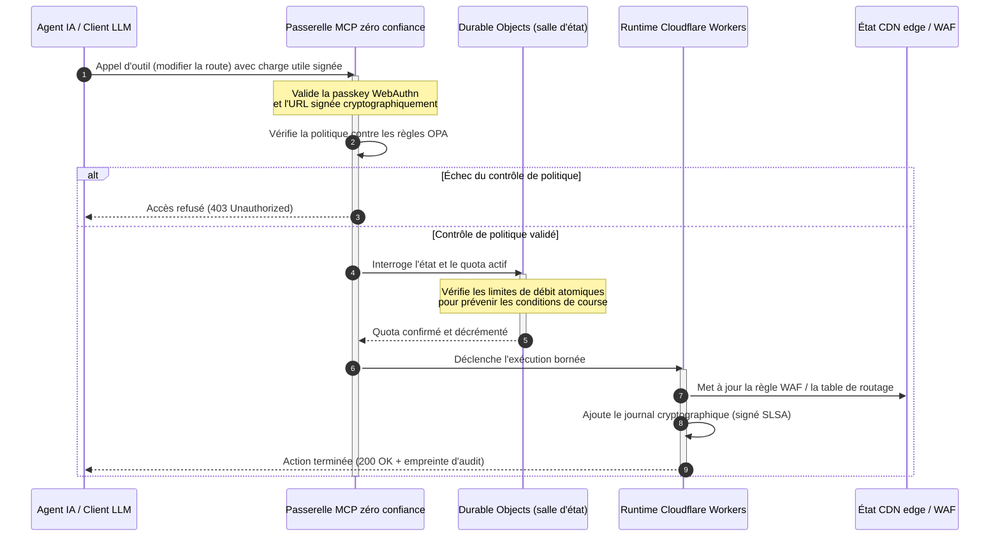

# CloudCDN : un plan open source pour l'edge nativement IA en 2026

<!-- lead-start: manual -->
<aside class="post-lead" aria-label="Résumé de l'article">

<strong>En bref.</strong> La technologie d'entreprise en 2026 se définit par la convergence de l'exécution serverless distribuée mondialement et de l'IA agentique. Les CDN classiques — conçus pour le cache de fichiers statiques et le routage de trafic de base — sont structurellement obsolètes à l'ère de l'orchestration de données active en temps réel. CloudCDN est un plan open source qui reconvertit l'edge en plan de contrôle actif : runtimes serverless, coordination d'état via les Durable Objects de Cloudflare, et une passerelle Model Context Protocol (MCP) zéro confiance qui permet aux agents IA autonomes d'opérer l'infrastructure web dans des enveloppes opérationnelles bornées et sécurisées par cryptographie.

<strong>Points clés à retenir</strong>

<ul class="post-lead-takeaways">
  <li><strong>Du cache statique au plan de contrôle borné.</strong> CloudCDN déplace la frontière opérationnelle vers l'edge et convertit les nœuds CDN en portes de politique actives qui exécutent des décisions de sécurité, de routage et de contrôle d'accès en moins d'une milliseconde.</li>
  <li><strong>Coordination d'état à l'edge.</strong> Les Durable Objects de Cloudflare appliquent une limitation de débit atomique en temps réel et une coordination d'état à l'échelle mondiale — pas de conditions de course distribuées, pas d'abus systémique de quotas entre régions edge.</li>
  <li><strong>Gestion agentique sûre de l'infrastructure via MCP.</strong> Une passerelle zéro confiance expose 42 outils MCP spécialisés et permet aux agents IA d'inspecter, de configurer et d'opérer l'infrastructure sous des bornes signées cryptographiquement.</li>
  <li><strong>La sécurité de la chaîne d'approvisionnement comme livrable du pipeline.</strong> Provenance de build SLSA Level 3 via Sigstore/Cosign et 3 185 tests unitaires à 100 % de couverture à chaque version.</li>
  <li><strong>Des preuves pour le conseil, pas des tableaux de bord.</strong> La télémétrie edge se mappe directement sur la responsabilité du conseil au titre de l'article 5 de DORA, le reporting des risques BCBS 239 et les règles de capital pour risque opérationnel de Basel III.</li>
</ul>

<strong>Lectures connexes :</strong> <a href="/2026-05-16-best-cloud-infrastructure-architecture-2026/">Architecture d'infrastructure cloud 2026</a> · <a href="/2026-06-05-cloud-native-banking-index-dora-resilience-platform-engineering-2026/">Index de la banque cloud-native 2026</a> · <a href="/2026-06-03-agentic-ai-index-banks-autonomy-governance-auditability-2026/">Index de l'IA agentique pour les banques 2026</a>.

</aside>
<!-- lead-end -->

Le débat sur le CDN est clos. L'edge n'est plus un cache ; c'est le plan de contrôle des logiciels nativement IA. À mesure que les agents appellent des outils, déplacent des données, purgent des caches, demandent des URLs signées et coordonnent des flux de travail, l'ancien modèle des tableaux de bord opaques et des plans de contrôle propriétaires cesse d'être un désagrément et devient un passif réglementaire. CloudCDN défend un modèle différent : une plateforme edge ouverte, inspectable et pilotable par agent, qui traite la sécurité, l'accessibilité, la performance et l'auditabilité comme des valeurs par défaut opposables plutôt que comme des promesses de fournisseur.

La référence open source de cet article est [cloudcdn.pro ⧉](https://github.com/sebastienrousseau/cloudcdn.pro "cloudcdn.pro"). Le dépôt est un CDN multi-tenant nativement IA, lisible de bout en bout et déployable de façon indépendante : TTFB inférieur à 100 ms à travers les PoP de Cloudflare, contrôle MCP, limitation de débit via Durable Objects, accessibilité WCAG-AA, URLs signées, passkeys, SLSA Level 3 et 3 185 tests à 100 % de couverture.

---

> **Synthèse exécutive / Points clés à retenir**
>
> - **L'edge devient la frontière opérationnelle.** CloudCDN convertit les nœuds CDN classiques en portes de politique actives exécutant sécurité, routage et contrôle d'accès en moins d'une milliseconde.
> - **Les Durable Objects rendent la limitation de débit atomique.** L'application de quotas en temps réel, cohérente à l'échelle mondiale, ferme la fenêtre de condition de course que les limiteurs à cohérence éventuelle laissent ouverte aux attaquants et aux agents défaillants.
> - **Les agents opèrent l'infrastructure via 42 outils MCP bornés.** Chaque invocation est validée contre des passkeys WebAuthn, des charges utiles signées et la politique OPA avant toute exécution.
> - **La chaîne d'approvisionnement fait partie du produit.** La provenance SLSA Level 3 via Sigstore/Cosign relie cryptographiquement chaque version à sa source auditée.
> - **La télémétrie est une preuve de conformité.** Les opérations edge se mappent sur l'article 5 de DORA, BCBS 239 et le capital pour risque opérationnel de Basel III — directement, pas via un reporting a posteriori.
>
---

## Pourquoi ce projet open source compte en 2026

L'IT d'entreprise en 2026 est passée du provisionnement d'infrastructure statique à l'orchestration de données en temps réel, pilotée par les événements. Deux forces de marché portent ce basculement.

La première est la prolifération de l'IA agentique. Modèles autonomes et agents logiciels exécutent désormais des tâches opérationnelles complexes — atténuation automatisée des menaces, décisions de routage, équilibrage de registres en temps réel. Ils n'utilisent pas de tableaux de bord. Ils appellent des outils.

La seconde est l'application active du [règlement sur la résilience opérationnelle numérique (DORA) ⧉](https://eur-lex.europa.eu/legal-content/EN/TXT/?uri=CELEX%3A32022R2554 "Règlement (UE) 2022/2554 sur la résilience opérationnelle numérique du secteur financier"). Les institutions bancaires ne peuvent plus s'appuyer sur des CDN tiers opaques et propriétaires. Les régulateurs exigent une visibilité complète sur la chaîne d'approvisionnement logicielle, une capacité de sortie vérifiable et des pistes d'audit cryptographiques inaltérables.

Les architectures de serveurs centralisés imposent des pénalités de latence que l'orchestration en temps réel ne peut pas absorber. Les CDN propriétaires fonctionnent comme des boîtes noires qui exposent les institutions à des compromissions de chaîne d'approvisionnement qu'elles ne peuvent ni voir, ni a fortiori documenter. CloudCDN comble cet écart avec un plan open source transparent et zéro confiance qui transforme l'edge en plan de contrôle actif. Pour les dirigeants technologiques, il déplace la conversation du coût de la conformité vers le Return on Resilience : du capital préservé par des pipelines opérationnels automatisés et prêts pour l'audit.

## Grille d'architecture

L'architecture CloudCDN se structure en cinq couches et remplace le middleware centralisé par des primitives edge locales et avec état :

| Couche | Décision de conception | Pourquoi cela compte | Risque en cas de mauvaise gestion |
|---|---|---|---|
| **Runtime edge** | Cloudflare Workers et Pages | Élimine la latence des VM centralisées ; exécute des politiques en moins d'une milliseconde à l'échelle mondiale | Des gains de performance sans discipline de politique produisent une dérive edge chaotique |
| **Coordination d'état** | Durable Objects | Garantit une cohérence atomique en temps réel pour les limites de débit et l'état partagé entre régions | Conditions de course distribuées, abus de ressources API, quotas de périmètre contournés |
| **Interface agent** | Passerelle MCP zéro confiance | Expose 42 outils MCP spécialisés pour que les agents IA opèrent l'infrastructure sous bornes gouvernées | Invocation d'outils sans bornes et modifications de configuration non autorisées |
| **Contrôle d'accès** | Passkeys WebAuthn et URLs signées | Remplace les mots de passe statiques par des signatures cryptographiques pour des opérations auditables | Modifications faiblement attribuées ; vol d'identifiants menant à une brèche du périmètre |
| **Garde-fous qualité** | SLSA Level 3 et 100 % de couverture de tests | Vérifie mathématiquement la source du build ; bloque l'injection de dépendances malveillantes | Code malveillant inséré via la chaîne d'approvisionnement logicielle |

## Signaux opérationnels à suivre

La préparation à l'edge se mesure. Voici les indicateurs quantitatifs qui démontrent une capacité d'exécution plutôt qu'une intention :

| Signal | Métrique / référence | Référence réglementaire | Implémentation plateforme |
|---|---|---|---|
| **42 outils MCP** | Registre d'outils borné pour la gestion automatisée | COBIT 2019 (BAI06) | Passerelle MCP validant les signatures d'agents contre les politiques OPA |
| **Durable Objects** | Application de quotas atomique, sans fuite, en moins d'une milliseconde | Article 6 de DORA | Durable Objects suivant l'état global des quotas API |
| **Passkeys et URLs signées** | 100 % des sessions administrateur vérifiées via FIDO2 WebAuthn | Article 30 de DORA | Contrôles de signature cryptographique intégrés au routeur edge |
| **SLSA Level 3** | Manifestes de build signés cryptographiquement (Sigstore) | Article 30 de DORA | Pipelines GitHub Actions générant des métadonnées de build signées |
| **3 185 tests unitaires** | 100 % de couverture ; barrières de régression à chaque version | NIST CSF 2.0 (PR.DS-01) | Pipelines CI stoppant le déploiement à la moindre défaillance de test |

## Le CDN devient un plan de contrôle actif

Les CDN traditionnels ont été conçus autour de l'accélération passive de contenu statique. CloudCDN redéfinit le modèle. Avec Cloudflare Workers et les Durable Objects intégrés, l'edge fonctionne comme une porte de politique active et avec état.

Quand un agent IA ou un processus automatisé demande un changement de configuration d'infrastructure ou un ajustement de routage, il ne s'adresse pas à une base de données centralisée vulnérable. La requête est interceptée au nœud edge le plus proche et passe par des contrôles d'identité, de politique et de quota avant toute exécution :

Chaque étape de cette séquence produit un enregistrement signé et imputable. C'est la différence entre un CDN qui accélère du contenu et un plan de contrôle qui peut être gouverné.

## Pourquoi l'open source change le modèle de confiance

Pour les responsables de la sécurité des systèmes d'information, les CDN propriétaires opaques présentent un risque qui se cumule. Les réseaux edge à code fermé sont des boîtes noires : si le fournisseur subit une compromission interne, la banque n'a aucune visibilité jusqu'à la divulgation publique de la brèche.

CloudCDN remplace cette asymétrie par un modèle de confiance open source entièrement auditable, bâti sur trois mécanismes :

1. **Provenance de build mathématique.** Sous SLSA Level 3, chaque version est cryptographiquement reliée à son dépôt GitHub open source. Un RSSI peut vérifier — mathématiquement, pas contractuellement — que le binaire exécuté sur les nœuds edge mondiaux de Cloudflare contient exactement le code source audité.
2. **Audits de sécurité publics et continus.** La base de code est soumise à des analyses automatisées, à une divulgation publique des vulnérabilités et à des revues de code par les pairs. L'obscurité n'est pas un contrôle ; la revue, si.
3. **Pas de dépendance fournisseur (article 28 de DORA).** DORA impose aux banques de prouver une stratégie de sortie claire et testée vis-à-vis des prestataires tiers critiques. Parce que CloudCDN est open source et bâti sur des primitives serverless standard, les institutions peuvent migrer leurs configurations edge de Cloudflare vers d'autres runtimes serverless ou des clusters Kubernetes privés — et en apporter la preuve au régulateur.

## Le motif de l'edge de qualité bancaire

CloudCDN est conçu pour satisfaire les standards de conformité du secteur financier mondial, en mappant les opérations techniques de l'edge directement sur les cadres que les superviseurs examinent réellement :

- **Gestion du risque de modèle ([SR 11-7 de la Fed américaine ⧉](https://web.archive.org/web/20260414150921/https://www.federalreserve.gov/supervisionreg/srletters/sr1107.htm "Supervisory Guidance on Model Risk Management") / SS1/23 de la PRA britannique).** Les modèles autonomes qui exécutent des tâches opérationnelles relèvent de la gouvernance du risque de modèle. La passerelle MCP de CloudCDN traite les outils agentiques comme des modèles quantitatifs : bornes de politique strictes, journalisation en temps réel et dérogations obligatoires avec humain dans la boucle pour les actions à fort impact.
- **BCBS 239 (agrégation des données de risque).** Capturer, étiqueter et structurer les données de transaction à l'edge génère les métriques opérationnelles en temps réel — en ligne avec les exigences BCBS 239 d'intégrité des données, de fraîcheur et de traçabilité réglementaire.
- **Article 5 de DORA (responsabilité du conseil).** Le conseil porte la responsabilité personnelle ultime de la résilience opérationnelle. CloudCDN traduit la télémétrie edge en preuves quantifiées et vérifiables que des administrateurs non techniques peuvent présenter lors d'un audit engageant leur responsabilité personnelle.
- **Capital pour risque opérationnel Basel III.** Les banques détiennent du capital réglementaire en regard du risque opérationnel. Le basculement automatisé de reprise après sinistre et la provenance SLSA Level 3 réduisent le profil de risque opérationnel de l'institution — et préservent du capital au bilan, au lieu de seulement satisfaire un audit.

## Ce que cela signifie selon le type de banque

### Banques d'importance systémique mondiale (G-SIB)

Les G-SIB traitent des volumes massifs de transactions à travers plusieurs juridictions. La priorité est de remplacer des contrôles de périmètre hérités et fragmentés par un plan edge unique et unifié. Déployer le motif CloudCDN permet à une G-SIB de standardiser mondialement politiques de sécurité, passerelles API et gouvernance agentique — et de générer des pipelines de preuves conformes à DORA comme sous-produit de l'exploitation plutôt que comme une course trimestrielle.

### Banques de transaction et banques d'entreprise

Pour les banques de transaction, le produit destiné au client est un ensemble fait de vitesse d'exécution, de sécurité et de transparence des données. Le motif CloudCDN permet à ces banques d'exposer des tableaux de bord API sécurisés et des services de suivi de trésorerie en temps réel aux trésoriers d'entreprise — une posture edge résiliente qui défend les dépôts des entreprises.

### Banques régionales et de plus petite taille

Les banques régionales affrontent les mêmes acteurs de menace que les G-SIB sans les budgets d'ingénierie. Un plan edge open source de qualité bancaire fournit les contrôles prêts à l'emploi : alignement réglementaire immédiat sans coûts de licence propriétaire, et le code source pour le prouver.

## Le plan d'action du conseil

La résilience opérationnelle n'est plus une métrique IT invisible de back-office ; c'est une priorité de conseil d'administration assortie d'une responsabilité personnelle. Les institutions qui conservent la confiance des régulateurs, des clients et des actionnaires en 2026 traitent la technologie comme un actif vérifiable et observable.

La feuille de route pour les dirigeants technologiques est courte :

1. **Exiger la preuve comme produit.** Budgéter des pipelines automatisés et auto-documentés à l'edge — des preuves générées par l'exploitation, pas assemblées pour l'auditeur.
2. **Passer au contrôle edge avec état.** Retirer la limitation de débit, le WAF et la vérification d'identité des serveurs centralisés pour les confier à des primitives edge atomiques.
3. **Établir des bornes agentiques cryptographiques.** Imposer des passerelles MCP zéro confiance avec validation par passkey et OPA pour chaque invocation d'outil automatisée.
4. **Exiger des audits de build open source.** Faire de la provenance de build SLSA Level 3 une condition de déploiement, pas une aspiration.

## Foire aux questions

**CloudCDN est-il prêt pour les audits DORA ?**

Oui. CloudCDN est conçu pour produire des preuves de conformité automatisées qui se mappent directement sur les modèles ITS du registre d'information (RT.01 à RT.15) et sur les clauses contractuelles de l'article 30 de DORA.

**Quel est l'avantage des Durable Objects pour la limitation de débit ?**

Les limiteurs de débit distribués traditionnels reposent sur la cohérence éventuelle, qui laisse une fenêtre de latence exploitable par des attaquants ou des agents défaillants. Les Durable Objects garantissent une cohérence atomique immédiate à l'échelle mondiale et ferment entièrement la fenêtre de condition de course.

**Qu'est-ce qui rend CloudCDN nativement IA ?**

Ses opérations pilotées par MCP et son modèle de contrôle conscient des agents. L'infrastructure s'opère via 42 outils gouvernés avec identité cryptographique et bornes de politique — une conception pensée pour des flux de travail autonomes, pas seulement pour des tableaux de bord humains.

**Le code open source augmente-t-il le risque d'exploits zero-day ?**

Non. Les CDN propriétaires à code fermé s'appuient sur la sécurité par l'obscurité. La base de code de CloudCDN est soumise en continu à des tests automatisés, à la revue publique par les pairs et à la validation SLSA Level 3 — un seuil de confiance vérifiablement plus élevé.

## Références

- Parlement européen et Conseil de l'Union européenne, (2022). [Règlement (UE) 2022/2554 sur la résilience opérationnelle numérique du secteur financier (DORA) ⧉](https://eur-lex.europa.eu/legal-content/EN/TXT/?uri=CELEX%3A32022R2554 "Règlement (UE) 2022/2554 sur la résilience opérationnelle numérique du secteur financier (DORA)"). Bruxelles : Journal officiel de l'Union européenne.
- Comité de Bâle sur le contrôle bancaire (BCBS), (2013). [Principes aux fins de l'agrégation des données sur les risques et de la notification des risques (BCBS 239) ⧉](https://www.bis.org/publ/bcbs239.htm "Principes aux fins de l'agrégation des données sur les risques et de la notification des risques (BCBS 239)"). Bâle : Banque des règlements internationaux.
- Board of Governors of the Federal Reserve System, (2011). [Supervisory Guidance on Model Risk Management (SR Letter 11-7) ⧉](https://web.archive.org/web/20260414150921/https://www.federalreserve.gov/supervisionreg/srletters/sr1107.htm "Supervisory Guidance on Model Risk Management (SR Letter 11-7)"). Washington D.C. : Réserve fédérale.
- Cloudflare, (2026). [Documentation Durable Objects : coordination d'état à l'edge ⧉](https://developers.cloudflare.com/durable-objects/ "Documentation Durable Objects"). San Francisco : Cloudflare.
- Cloudflare, (2026). [Construire des agents IA avec MCP, authentification et Durable Objects ⧉](https://blog.cloudflare.com/building-ai-agents-with-mcp-authn-authz-and-durable-objects/ "Construire des agents IA avec MCP, authentification et Durable Objects").
- GitHub, (2026). [Dépôt cloudcdn.pro ⧉](https://github.com/sebastienrousseau/cloudcdn.pro "Dépôt cloudcdn.pro").

<!-- enrich-start -->
<aside class="author-card" aria-label="À propos de l'auteur"><strong class="author-card-name"><a href="/about/index.html">Sebastien Rousseau</a></strong>Technologue bancaire senior, écrivant sur l'IA appliquée, les infrastructures de paiement, la monnaie tokenisée, ISO 20022, la sécurité post-quantique, les services financiers cloud-native et les marchés numériques régulés.Plus de 20 ans à HSBC Commercial &amp; Investment Bank, PayPal, Barclays, Shazam, AKQA, Virgin Group. <a href="/about/index.html">Profil complet</a> &middot; <a href="https://www.linkedin.com/in/sebastienrousseau/" rel="external noopener">LinkedIn</a> &middot; <a href="https://github.com/sebastienrousseau" rel="external noopener">GitHub</a></aside>

Dernière révision <time datetime="2026-06-11">11 juin 2026</time>.

<!-- enrich-end -->
