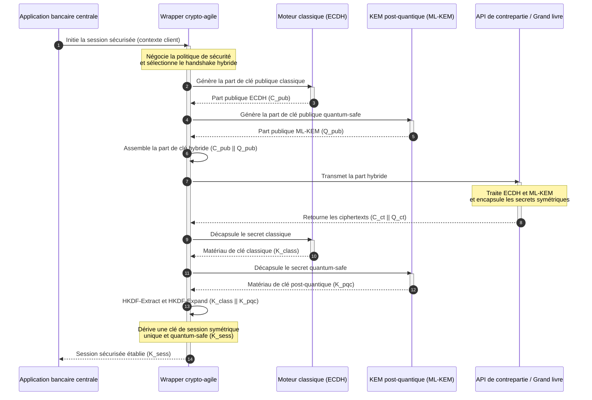

# KyberLib et la migration post-quantique des banques en 2026 : des normes au code

<!-- lead-start: manual -->
<aside class="post-lead" aria-label="Résumé de l'article">

<strong>En bref.</strong> Les infrastructures bancaires affrontent en 2026 une menace systémique au dénouement connu : le calcul à l'échelle quantique cassera l'échange de clés RSA et ECC qui protège aujourd'hui le trafic en transit. Les normes fédérales et les notes de supervision ont fait monter la prise de conscience ; l'exécution technique reste cloisonnée. <a href="https://github.com/sebastienrousseau/kyberlib">KyberLib</a> est un plan d'ingénierie open source qui fait passer le récit post-quantique dans du code Rust concret et sûr en mémoire — il implémente ML-KEM normalisé par le NIST (FIPS 203) derrière des frontières d'abstraction crypto-agiles, afin que les établissements modernisent la sécurité de transport et l'encapsulation de clé avant que les attaques « Store Now, Decrypt Later » n'atteignent leurs archives.

<strong>Points clés à retenir</strong>

<ul class="post-lead-takeaways">
  <li><strong>De la politique au code inspectable.</strong> KyberLib fait passer la cryptographie post-quantique des feuilles de route stratégiques abstraites à des implémentations Rust concrètes, performantes et auditables.</li>
  <li><strong>Exécution normalisée de ML-KEM FIPS 203.</strong> La bibliothèque implémente ML-KEM — l'algorithme d'établissement de clé finalisé sous NIST FIPS 203 — et maintient la conformité alignée sur les attentes réglementaires mondiales.</li>
  <li><strong>Crypto-agilité dès la conception.</strong> Des frontières d'abstraction stables permettent aux applications bancaires de remplacer leurs primitives cryptographiques sans réécritures applicatives coûteuses et sources d'erreurs.</li>
  <li><strong>Sûreté mémoire portée par Rust.</strong> Les règles de propriété vérifiées à la compilation éliminent les débordements de tampon et les fuites mémoire qui minent les bibliothèques cryptographiques héritées en C, à la vitesse des abstractions à coût nul.</li>
  <li><strong>Atténuation de la responsabilité fiduciaire.</strong> Des preuves de migration observables et testables donnent aux administrateurs le dossier de « mesures raisonnables » qu'exigent les audits de responsabilité personnelle de l'article 5 de DORA.</li>
</ul>

<strong>À lire également :</strong> <a href="/2026-05-18-quantum-cryptography-standards-developments-2026/">Normes de cryptographie quantique 2026</a>, <a href="/2026-05-28-dora-ai-act-data-sovereignty-banking-compliance-stack-2026/">Pile de conformité DORA + AI Act</a>, <a href="/2026-05-20-cloud-native-banking-financial-institutions-2026/">Banque cloud-native</a>.

</aside>
<!-- lead-end -->

La migration post-quantique a cessé d'être un exercice de planification. En 2026, c'est une exigence opérationnelle active, et l'écart entre l'intention réglementaire et l'exécution d'ingénierie est désormais le lieu du risque. [KyberLib ⧉](https://github.com/sebastienrousseau/kyberlib "kyberlib") comble une partie de cet écart : une bibliothèque Rust orientée production, sûre en mémoire, qui implémente ML-KEM selon les paramètres finalisés de FIPS 203 et l'enveloppe dans les frontières crypto-agiles dont le parc transactionnel d'une banque a réellement besoin.

---

> **Synthèse exécutive / Points clés à retenir**
>
> - **La menace est déjà opérationnelle.** Les adversaires mènent dès aujourd'hui des campagnes de collecte « Store Now, Decrypt Later » ; la confidentialité des données tombera rétroactivement le jour où arrivera un ordinateur quantique cryptographiquement pertinent.
> - **Les normes sont finalisées.** NIST FIPS 203 (ML-KEM) et FIPS 204 (ML-DSA) donnent aux comités d'audit un référentiel clair et testable — la défense « nous attendons les normes » n'existe plus.
> - **KyberLib est le plan d'ingénierie.** Rust sûr en mémoire, compilation `no_std` pour les HSM et les cartes à puce, et schémas de handshake hybride qui préservent l'interopérabilité classique.
> - **La crypto-agilité est l'objectif durable.** Des frontières d'abstraction stables permettent de changer de primitive sans réécrire les applications — la leçon qui survit à n'importe quel algorithme.
> - **Les conseils portent la responsabilité.** L'article 5 de DORA fait peser une responsabilité personnelle sur les administrateurs ; un code de migration inspectable et observable est la preuve qui y répond.
>
---

## Pourquoi ce projet open source compte en 2026

À mesure que la cryptographie asymétrique approche de l'obsolescence, la menace n'attend pas qu'un ordinateur quantique cryptographiquement pertinent soit construit. Les adversaires exécutent dès maintenant des attaques **« Store Now, Decrypt Later » (SNDL)** — ils captent les flux chiffrés en transit des transactions bancaires d'entreprise, des secrets industriels et des communications institutionnelles, avec l'intention de les déchiffrer une fois les capacités quantiques arrivées à maturité. Pour une banque, chaque handshake classique qui circule aujourd'hui sur le réseau est une violation de confidentialité à détonation différée.

Les régulateurs ont répondu par des obligations concrètes :

1. **L'article 6 de DORA (gestion du risque TIC)** impose aux établissements de cartographier, d'identifier et d'atténuer les vulnérabilités de l'ensemble de leur parc cryptographique — y compris l'échange de clés asymétrique enfoui dans des middlewares que personne n'a inventoriés.
2. **NIST FIPS 203 et 204** établissent les normes post-quantiques officielles pour l'encapsulation de clé (ML-KEM) et les signatures numériques (ML-DSA), donnant aux comités d'audit un référentiel normalisé pour mesurer l'avancement de la migration.

Exécuter cette migration sans perturber l'exploitation en production exige de dépasser les notes de politique pour s'appuyer sur une **infrastructure cryptographique open source et inspectable**. [KyberLib ⧉](https://github.com/sebastienrousseau/kyberlib "kyberlib") fournit exactement cela : une bibliothèque Rust sûre en mémoire, conforme à FIPS 203, qui transforme la transition post-quantique en un pipeline d'ingénierie mesurable et vérifiable — et déplace la conversation sur l'investissement technologique vers un retour sur résilience tangible.

## Grille d'architecture

KyberLib se place derrière des frontières d'API stables, isolant les applications transactionnelles cœur d'une banque des changements de primitives cryptographiques bas niveau.

| Couche | Décision de conception | Pourquoi cela compte | Risque en cas de mauvaise gestion |
|---|---|---|---|
| **Primitive** | Encapsulation de clé ML-KEM FIPS 203 | Remplace l'échange de clés Diffie-Hellman et RSA classiques par des structures à base de réseaux | Non-conformité aux paramètres finalisés de FIPS 203, donc échec des audits de conformité |
| **Langage** | Implémentation Rust sûre en mémoire | Élimine les vulnérabilités de corruption mémoire (débordements de tampon, use-after-free) endémiques au C/C++ | Prolifération de dépendances compromettant l'intégrité de la chaîne de build |
| **Abstraction** | Frontières crypto-agiles stables | Les applications changent d'algorithme derrière une interface unifiée à mesure que les normes évoluent | Primitives codées en dur imposant des réécritures manuelles à chaque migration future |
| **Déploiement** | Handshakes de chiffrement hybride | Combine les KEM post-quantiques et les algorithmes classiques dans une enveloppe à double encapsulation | Perte d'interopérabilité héritée ou dérive de configuration silencieuse |
| **Assurance** | Provenance SLSA Level 3 et tests inspectables | Garantit l'origine et la provenance du code ; les exemples s'auditent ligne à ligne | Théâtre sécuritaire — bibliothèques boîtes noires dont les erreurs d'implémentation émergent en production |

## Signaux opérationnels à suivre

Démontrer la conformité post-quantique aux conseils de surveillance et aux régulateurs suppose de suivre des métriques précises et quantifiables :

| Signal | Métrique | Référence réglementaire | Mise en œuvre plateforme |
|---|---|---|---|
| **Conformité ML-KEM FIPS 203** | Conformité à 100 % aux paramètres finalisés (ML-KEM-512/768/1024) | NIST FIPS 203 | Cryptographie à base de réseaux, paramètres vérifiés, compilée dans les modules KyberLib |
| **Inventaire cryptographique** | Inventaire complet des usages d'échange de clés asymétrique sur l'ensemble des systèmes | NIST SP 1800-38 | Agents de scan automatisés consignant les suites cryptographiques actives dans un registre central |
| **Échange de clés hybride** | Pourcentage des handshakes de la couche transport exécutés dans une enveloppe hybride | Article 6 de DORA | Proxys réseau enveloppant les handshakes TLS 1.3 classiques dans une encapsulation PQC |
| **Compilation `no_std`** | Capacité à compiler sans la bibliothèque standard de Rust pour les cibles contraintes | Article 30 de DORA | Compilation conditionnelle `no_std` dans KyberLib pour les Hardware Security Modules |
| **Indice de crypto-agilité** | Temps en minutes pour remplacer une primitive cryptographique sur la passerelle API | PRA britannique SS1/23 | Registres de routage abstraits gérant l'allocation d'algorithmes via des variables d'exécution |

## Pourquoi Rust compte pour la cryptographie post-quantique

Implémenter des algorithmes post-quantiques comme ML-KEM exige des opérations mathématiques complexes et bas niveau sur des anneaux de polynômes. Historiquement, exécuter ces opérations à la vitesse de la production passait par du C/C++ ou de l'assembleur écrits à la main — une large surface d'attaque pour la corruption mémoire, précisément dans le code qu'une banque peut le moins se permettre de rater.

Rust change la posture de sécurité de l'ingénierie cryptographique de trois manières concrètes :

1. **Sûreté mémoire à la compilation.** Le modèle de propriété de Rust garantit que les débordements de tampon, les doubles libérations et les erreurs use-after-free sont prévenus à la compilation. C'est crucial pour les bibliothèques post-quantiques, dont les tailles de clés et de ciphertexts dépassent nettement leurs équivalents classiques.
2. **Abstractions déterministes à coût nul.** Rust compile en code machine natif sans ramasse-miettes : la vitesse d'exécution et l'empreinte mémoire égalent ou dépassent les bibliothèques en C tout en préservant la sûreté.
3. **Compatibilité `no_std`.** KyberLib compile sans la bibliothèque standard de Rust et fonctionne donc dans des environnements contraints, au plus près du matériel — Hardware Security Modules et cartes à puce compris — en maintenant la cryptographie de niveau bancaire à l'intérieur des frontières de sécurité physique.

## Concevoir une architecture crypto-agile

Le mode de défaillance classique des migrations cryptographiques est le codage en dur : des hypothèses propres à un algorithme incrustées directement dans la logique applicative, redécouvertes douloureusement à chaque transition. L'objectif durable pour 2026 est la **crypto-agilité** — une couche d'abstraction qui traite les algorithmes comme des modules interchangeables derrière une interface stable, pour que la prochaine migration soit un changement de configuration plutôt qu'une réécriture à l'échelle du parc.

La séquence ci-dessous montre comment le wrapper crypto-agile de KyberLib coordonne un handshake d'échange de clés hybride (classique plus post-quantique) :

L'enveloppe hybride est le détail qui compte opérationnellement. Tant que les primitives post-quantiques n'auront pas accumulé des années d'examen en production, la clé de session dérive à la fois du secret classique et du secret post-quantique : un attaquant doit casser ECDH **et** ML-KEM pour récupérer le canal. Les contreparties qui n'ont pas migré continuent de fonctionner ; celles qui ont migré gagnent immédiatement la protection à base de réseaux.

## Le manuel du conseil d'administration

La sécurité post-quantique n'est pas un sujet de chiffrement de back-office ; c'est une question de gouvernance au niveau du conseil, avec des enjeux personnels. Les dirigeants doivent cadrer la migration sous l'angle de la responsabilité fiduciaire :

- **L'article 5 de DORA (gouvernance et organisation)** fait peser la responsabilité personnelle de la sécurité TIC sur le conseil d'administration. Des tests open source et observables constituent la preuve directe qu'exige un audit de responsabilité personnelle — « nous avons retenu une implémentation FIPS 203 inspectable et voici ses exécutions de conformité » est une réponse défendable ; « notre fournisseur nous a rassurés » ne l'est pas.
- **La gestion du risque de modèle (Fed américaine SR 11-7 / PRA britannique SS1/23)** s'applique aux architectures de wrappers cryptographiques autant qu'aux modèles de valorisation. Les couches d'abstraction doivent passer la validation MRM, y compris la performance sous scénarios de perturbation extrême.
- **Le capital de risque opérationnel Basel III** récompense la maturité démontrée des contrôles. Des handshakes hybrides testés abaissent le profil de risque opérationnel de long terme de l'établissement, réduisent la prime de capital et libèrent de la capacité de bilan pour le déploiement actif de trésorerie.

## Ce que cela signifie selon le type de banque

### Banques d'importance systémique mondiale (G-SIB)

Les G-SIB exploitent des parcs transactionnels lourds en systèmes hérités ; leur contrainte déterminante est donc la découverte : savoir où l'échange de clés asymétrique se produit réellement. Les inventaires cryptographiques continus selon les orientations NIST SP 1800-38 viennent en premier ; KyberLib fournit ensuite la bibliothèque normalisée et sûre en mémoire pour exécuter l'encapsulation de clé post-quantique sur chaque nœud moderne que l'inventaire fait remonter.

### Banques de transaction et banques d'entreprise

La confidentialité des rails de paiement est le fonds de commerce. KyberLib compilant vers des cibles `no_std` au plus près du matériel, les banques de transaction peuvent déployer des handshakes post-quantiques directement dans les équipements de routage des paiements et de gestion de liquidité en périphérie — pas seulement dans la couche applicative.

### Banques régionales et de plus petite taille

Les établissements régionaux affrontent la même collecte étatique sans les budgets de recherche des G-SIB. Une implémentation Rust open source et inspectable leur offre une voie clé en main vers la conformité NIST FIPS 203 immédiatement, sans négocier des feuilles de route fournisseurs opaques.

## Des feuilles de route au code qui compile

La transition post-quantique est une tâche d'ingénierie active, et les établissements qui conserveront la confiance des superviseurs, des contreparties et des trésoriers d'entreprise tout au long de 2026 sont ceux qui passeront des feuilles de route abstraites au code observable qui compile. Le mandat exécutif en découle directement : auditer les points d'échange de clés hérités, déployer des handshakes hybrides sur les canaux à plus forte valeur, et bâtir les frontières d'abstraction stables qui rendront routinier chaque remplacement futur de primitive. KyberLib fait de chacune de ces étapes une capacité opérationnelle mesurable plutôt qu'un engagement de présentation.

## Foire aux questions

**KyberLib est-elle conforme aux normes NIST finalisées ?**

Oui. KyberLib est conçue autour des paramètres de ML-KEM tels que finalisés dans FIPS 203, ce qui maintient la bibliothèque compilée alignée sur les attentes réglementaires fédérales et mondiales.

**Une bibliothèque post-quantique exige-t-elle du matériel spécialisé ?**

Non. L'implémentation Rust de KyberLib compile vers les architectures système standard. Sa capacité `no_std` lui permet en outre de fonctionner sur des Hardware Security Modules spécialisés et des cartes à puce lorsque la garde physique des clés est requise.

**Comment « Store Now, Decrypt Later » affecte-t-il la conformité actuelle ?**

Si la couche transport repose sur RSA ou ECC classiques, les adversaires peuvent capter le trafic aujourd'hui et le déchiffrer quand la capacité quantique aura mûri. Un échange de clés hybride déployé maintenant maintient les données capturées derrière une protection à base de réseaux.

**Pourquoi des handshakes hybrides plutôt qu'un passage direct aux primitives post-quantiques ?**

Les enveloppes hybrides dérivent la clé de session à la fois d'un secret classique et d'un secret post-quantique : la sécurité tient tant que les deux ne sont pas cassés. Cela préserve l'interopérabilité avec les contreparties non migrées pendant que les nouvelles primitives accumulent l'examen de la production.

## Références

- National Institute of Standards and Technology, (2024). [FIPS 203: Module-Lattice-Based Key-Encapsulation Mechanism Standard ⧉](https://www.nist.gov/news-events/news/2024/08/nist-releases-first-3-finalized-post-quantum-encryption-standards "Annonce NIST FIPS 203").
- Board of Governors of the Federal Reserve System, (2011). [Supervisory Guidance on Model Risk Management (SR Letter 11-7) ⧉](https://www.federalreserve.gov/supervisionreg/srletters/sr1107.htm "Federal Reserve SR 11-7").
- Parlement européen et Conseil de l'Union européenne, (2022). [Règlement (UE) 2022/2554 sur la résilience opérationnelle numérique du secteur financier (DORA) ⧉](https://eur-lex.europa.eu/legal-content/EN/TXT/?uri=CELEX%3A32022R2554 "Règlement DORA").
- NIST National Cybersecurity Center of Excellence, (2025). [Migration vers la cryptographie post-quantique (NIST SP 1800-38) ⧉](https://www.nccoe.nist.gov/projects/migration-post-quantum-cryptography "NIST SP 1800-38").
- GitHub, (2026). [Dépôt open source kyberlib ⧉](https://github.com/sebastienrousseau/kyberlib "Dépôt kyberlib").

<!-- enrich-start -->
<aside class="author-card" aria-label="À propos de l'auteur"><strong class="author-card-name"><a href="/about/index.html">Sebastien Rousseau</a></strong>Technologue bancaire senior, écrivant sur l'IA appliquée, les infrastructures de paiement, la monnaie tokenisée, ISO 20022, la sécurité post-quantique, les services financiers cloud-native, l'infrastructure open source et les marchés numériques régulés.Plus de 20 ans à HSBC Commercial &amp; Investment Bank, PayPal, Barclays, Shazam, AKQA, Virgin Group. <a href="/about/index.html">Profil complet</a> &middot; <a href="https://www.linkedin.com/in/sebastienrousseau/" rel="external noopener">LinkedIn</a> &middot; <a href="https://github.com/sebastienrousseau" rel="external noopener">GitHub</a></aside>

Dernière révision <time datetime="2026-06-12">12 juin 2026</time>.

<!-- enrich-end -->
