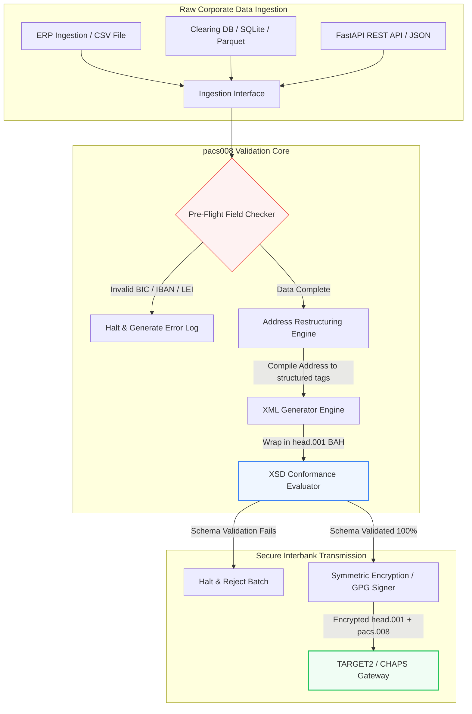

---

# Front Matter (YAML)

author: "contact@sebastienrousseau.com (Sebastien Rousseau)"
banner_alt: "Collaborateur de bureau avec assistant vocal et ordinateur portable — symbolisant les messages de paiement interbancaires structurés et lisibles par machine que l'automatisation pacs.008 rend programmables"
banner_height: "1597"
banner_width: "2584"
banner: "https://cloudcdn.pro/stocks/images/tyler-prahm-lmV3gJSAgbo.webp"
cdn: "https://cloudcdn.pro"
charset: "UTF-8"
cname: "sebastienrousseau.com"
copyright: "© Copyright 2025 - 2026 - Sebastien Rousseau. All rights reserved."
date: "15 juin 2026"
description: "pacs008 est une bibliothèque Python open source qui automatise la génération et la validation des messages ISO 20022 pacs.008 de virement client FI-to-FI — adresses structurées, encapsulation BAH head.001, sommes de contrôle BIC/LEI/IBAN, traçage UETR OpenTelemetry — pensée pour la bascule SWIFT de novembre 2026."
format-detection: "telephone=no"
hreflang: "fr"
icon: "https://cloudcdn.pro/clients/sebastienrousseau/v1/logos/sebastienrousseau.svg"
id: "https://sebastienrousseau.com/2026-06-15-pacs008-automation-iso-20022-interbank-payments-2026"
image_alt: "Portrait noir et blanc de Sebastien Rousseau"
image_height: "162"
image_width: "162"
image: "https://cloudcdn.pro/stocks/images/sebastien-rousseau.png"
keywords: "pacs008, ISO 20022 pacs.008, virement client FI to FI, adresse structurée, SWIFT CBPR+, BAH head.001, TARGET2, CHAPS, Fedwire, DORA, BCBS 239, Basel III, UETR, validation LEI, SEPA VoP"
language: "fr-FR"
last_reviewed: "2026-06-15"
layout: "report"
locale: "fr_FR"
logo_alt: "Logo de Sebastien Rousseau"
logo_height: "44"
logo_width: "44"
logo: "https://cloudcdn.pro/clients/sebastienrousseau/v1/logos/sebastienrousseau.svg"
menu: ""
measurementID: "G-169G4ET5HQ"
name: "Sebastien Rousseau"
permalink: "https://sebastienrousseau.com/2026-06-15-pacs008-automation-iso-20022-interbank-payments-2026"
rating: "general"
referrer: "no-referrer"
robots: "index, follow"
schema: "FAQPage, Article"
seo_title: "Automatisation pacs.008 pour l'ère ISO 20022"
short_name: "sebastienrousseau"
subtitle: "Le message pacs.008 est le point où convergent les données de paiement interbancaires, les adresses structurées, la conformité, le routage et les opérations de règlement."
tags: "pacs008, ISO 20022, paiements interbancaires, paiements de gros, Python"
theme-color: "0, 83, 191"
title: "Construire l'automatisation pacs.008 pour l'ère interbancaire ISO 20022 en 2026"
url: "https://sebastienrousseau.com/2026-06-15-pacs008-automation-iso-20022-interbank-payments-2026"
viewport: "width=device-width, initial-scale=1, shrink-to-fit=no"

# RSS - The RSS feed front matter (YAML).
atom_link: "https://sebastienrousseau.com/2026-06-15-pacs008-automation-iso-20022-interbank-payments-2026/rss.xml"
category: "Finance"
docs: https://validator.w3.org/feed/docs/rss2.html
generator: "Static Site Generator (SSG) (version 0.0.26)"
item_description: "pacs008 fournit une base Python open source pour automatiser les messages ISO 20022 pacs.008 de virement client FI-to-FI dans l'ère des paiements interbancaires."
item_guid: "https://sebastienrousseau.com/2026-06-15-pacs008-automation-iso-20022-interbank-payments-2026/rss.xml"
item_link: "https://sebastienrousseau.com/2026-06-15-pacs008-automation-iso-20022-interbank-payments-2026/rss.xml"
item_pub_date: "Mon, 15 Jun 2026 06:06:06 +0000"
item_title: "Construire l'automatisation pacs.008 pour l'ère interbancaire ISO 20022 en 2026"
last_build_date: "Mon, 15 Jun 2026 06:06:06 +0000"
managing_editor: "contact@sebastienrousseau.com (Sebastien Rousseau)"
pub_date: "Mon, 15 Jun 2026 06:06:06 +0000"
ttl: "60"
type: "article"
webmaster: "contact@sebastienrousseau.com"

# Apple - The Apple front matter (YAML).
apple_mobile_web_app_orientations: "portrait"
apple_touch_icon_sizes: "192x192"
apple-mobile-web-app-capable: "yes"
apple-mobile-web-app-status-bar-inset: "black"
apple-mobile-web-app-status-bar-style: "black-translucent"
apple-mobile-web-app-title: "Automatisation pacs.008 ISO 20022"
apple-touch-fullscreen: "yes"

# MS Application - The MS Application front matter (YAML).

msapplication-navbutton-color: "0, 83, 191"

# Twitter Card - The Twitter Card front matter (YAML).

twitter_card: "summary_large_image"
twitter_creator: "@wwdseb"
twitter_description: "pacs008 fournit une base Python open source pour automatiser les messages ISO 20022 pacs.008 de virement client FI-to-FI dans l'ère des paiements interbancaires."
twitter_image: "https://cloudcdn.pro/clients/sebastienrousseau/v1/logos/sebastienrousseau.svg"
twitter_image_alt: "Logo de Sebastien Rousseau"
twitter_site: "@wwdseb"
twitter_title: "Automatisation pacs.008 pour l'ère ISO 20022"
twitter_url: "https://sebastienrousseau.com/2026-06-15-pacs008-automation-iso-20022-interbank-payments-2026"

excerpt: "pacs008 est une boîte à outils Python open source qui rend les messages ISO 20022 pacs.008 de virement client FI-to-FI programmables — adresses structurées, validation, routage, points d'ancrage de conformité, et échéance SWIFT de novembre 2026 intégrés par défaut."

# Humans.txt - The Humans.txt front matter (YAML).
author_website: "https://sebastienrousseau.com"
author_twitter: "@wwdseb"
author_location: "London, UK"
thanks: "Merci de votre lecture !"
site_last_updated: "2026-06-15"
site_standards: "HTML5, CSS3, RSS, Atom, JSON, XML, YAML, Markdown, TOML"
site_components: "Kaishi, Kaishi Builder, Kaishi CLI, Kaishi Templates, Kaishi Themes"
site_software: "Static Site Generator, Rust"

---

# Automatiser les paiements interbancaires ISO 20022 pacs.008 avec Python open source en 2026

<!-- lead-start -->
<aside class="post-lead" aria-label="Résumé de l'article">

<strong>En bref.</strong> Sous les lignes directrices SWIFT CBPR+, l'échéance dite « Structured Address Cliff » du 14 novembre 2026 met hors service les adresses postales non structurées sur TARGET2, CHAPS, Fedwire, Lynx et SEPA. pacs008 est une bibliothèque Python open source qui automatise la génération et la validation des messages ISO 20022 de virement client FI-to-FI (pacs.008), encapsule les paiements dans des Business Application Headers (BAH head.001) et intègre la conformité d'adresse structurée dans le chemin de données avant que le message n'atteigne un réseau de compensation.

<strong>Points clés à retenir</strong>

<ul class="post-lead-takeaways">
  <li><strong>L'échéance de l'adresse structurée est absolue.</strong> Après le 14 novembre 2026, les blocs d'adresse non structurés sont retirés. pacs008 impose les éléments d'adresse postale structurés (<code>&lt;TwnNm&gt;</code>, <code>&lt;Ctry&gt;</code>, <code>&lt;PstCd&gt;</code>) lors de la compilation des données pour éviter les rejets en bordure de réseau.</li>
  <li><strong>Orchestration unifiée des messages.</strong> Encapsule la charge utile pacs.008 dans une enveloppe conforme Business Application Header (head.001), fournissant un modèle de traitement standard aller-retour.</li>
  <li><strong>Intégrité algorithmique.</strong> Validateurs intégrés pour les BIC et les Legal Entity Identifiers (LEI) utilisant les sommes de contrôle ISO 7064 Modulo 97-10.</li>
  <li><strong>Traçabilité de niveau DORA.</strong> Instrumentation OpenTelemetry complète indexée sur l'Unique End-to-End Transaction Reference (UETR) pour des journaux d'audit en temps réel et des signatures d'audit cryptographiques.</li>
  <li><strong>Préservation de la responsabilité fiduciaire au niveau du conseil.</strong> Aligne la précision des messages interbancaires avec l'Article 5 de DORA, le reporting BCBS 239 et les économies de capital de risque opérationnel de Basel III.</li>
</ul>

<strong>Lectures complémentaires :</strong> <a href="https://sebastienrousseau.com/2026-05-19-global-wholesale-payments-economics-2026">Les paiements de gros mondiaux en 2026 : ISO 20022, renouvellement RTGS et économie de l'interopérabilité</a>, <a href="https://sebastienrousseau.com/2026-05-27-ai-operating-system-payments-fraud-routing-resilience-compliance-2026">L'IA comme système d'exploitation des paiements : fraude, routage, résilience et conformité en 2026</a>, <a href="https://sebastienrousseau.com/2026-05-12-iso-20022-pacs008-structured-address-deadline">L'échéance pacs.008 d'adresse structurée de novembre 2026 : vue à six mois</a>.

</aside>
<!-- lead-end -->

Combler l'écart entre les données financières héritées et la messagerie interbancaire structurée via un pipeline Python auditable et validé par schéma.

La référence open source de cet article est [pacs008 ⧉](https://github.com/sebastienrousseau/pacs008 "pacs008 — bibliothèque Python open source"). Le dépôt se positionne comme une bibliothèque Python pour automatiser les messages XML ISO 20022 pacs.008 de virement client FI-to-FI.

## Pourquoi ce projet open source compte en 2026

L'infrastructure mondiale de compensation des paiements interbancaires vit sa modernisation la plus profonde depuis près d'un demi-siècle.

En juin 2026, le secteur des services financiers approche rapidement du **Structured Address Cliff SWIFT du 14 novembre 2026**. À partir de cette date, les lignes directrices SWIFT CBPR+, conjointement avec TARGET2, CHAPS, Fedwire et le Lynx canadien, mettront officiellement hors service les lignes d'adresse postale non structurées (utilisant uniquement `<AdrLine>` à l'intérieur des blocs `<PstlAdr>`). Toutes les institutions financières participantes devront transmettre les adresses soit en format hybride (`<TwnNm>` et `<Ctry>` structurés, avec un maximum de deux éléments `<AdrLine>` pour les détails restants), soit en format entièrement structuré (éléments individuels pour le nom de rue, le numéro de bâtiment et le code postal). Tout message ne respectant pas ce critère sera rejeté à la frontière du réseau.

Pour les institutions financières, cette transition crée des contraintes opérationnelles majeures :

1. **La pénalité de rejet en bordure de réseau.** Les paiements ne respectant pas les critères d'adresse structurée subiront des rejets immédiats du réseau, déclenchant des retards transactionnels, des blocages de liquidité et des arriérés opérationnels.
2. **Vérification du bénéficiaire SEPA (VoP).** Impose à tous les prestataires de services de paiement (PSP) à l'intérieur de la zone SEPA de vérifier la correspondance entre le nom du bénéficiaire et son IBAN avant d'exécuter les virements, ajoutant une porte de validation supplémentaire à l'initiation du message.

[pacs008](https://github.com/sebastienrousseau/pacs008) résout ce problème. C'est une bibliothèque Python open source et légère qui automatise la conversion de données financières brutes en messages pacs.008 de virement client interbancaire ISO 20022 entièrement validés et conformes au schéma. En comblant l'écart entre les données héritées et structurées, pacs008 délivre un Return on Resilience (RoR) élevé, préservant le fonds de roulement et sécurisant l'exécution en temps réel sur les rails mondiaux.

## La grille de lecture architecturale pacs008 en 2026

La bibliothèque pacs008 est structurée comme un moteur isolé de validation et de génération, garantissant que les entrées brutes sont systématiquement analysées, enrichies et encapsulées dans des enveloppes standard :

| Couche | Choix de conception | Pourquoi cela compte | Risque en cas de mauvaise gestion |
|---|---|---|---|
| **Couche d'entrée** | Ingestion de CSV, JSON, SQLite et Parquet | Rejoint les équipes d'intégration bancaires là où leurs données résident déjà, évitant les migrations de plateforme. | Ingestion de charges utiles de données brutes, non validées ou corrompues. |
| **Couche de validation** | Validation préalable au vol contre les schémas XSD officiels et règles métier sur mesure | Stoppe l'exécution et signale les erreurs avant la transmission du fichier de paiement au réseau de compensation. | Fichiers XML invalides déclenchant rejets réseau immédiats et retards de compensation. |
| **Couche d'enveloppe BAH** | Encapsulation automatique Business Application Header (head.001) | Standardise la diffusion et le routage des messages en s'appuyant sur la balise `<MsgDefIdr>`. | Transmission de charges utiles pacs.008 brutes sans l'enveloppe externe requise, provoquant un rejet système. |
| **Couche de sérialisation** | Prise en charge XML standard et JSON conforme ISO (TS 23029) | Permet la traduction directe entre charges utiles XML et JSON, soutenant les API REST modernes et le streaming Kafka. | Représentations de données fragmentées violant les directives ISO officielles. |
| **Couche d'observabilité** | Traçage OpenTelemetry indexé sur l'UETR | Capture les chemins d'exécution et les journaux détaillés, offrant une auditabilité en temps réel. | Lacunes de traçage bloquant la visibilité opérationnelle et l'audit. |

## Signaux interbancaires et jalons réglementaires clés

Pour démontrer la résilience opérationnelle transactionnelle, les responsables technologie et risque seniors doivent suivre des indicateurs de conformité spécifiques et quantifiables :

| Signal | Métrique / Repère opérationnel | Référence G20 / SWIFT / DORA | Implémentation technique sur la plateforme |
|---|---|---|---|
| **Conformité d'adresse structurée** | % de messages pacs.008 utilisant des champs `<PstlAdr>` entièrement structurés avec `<TwnNm>` et `<Ctry>` désignés. | Échéance SWIFT SR 2026 | Contrôles de schéma préalables au vol dans pacs008 rejetant les lignes d'adresse non structurées. |
| **Vérification du bénéficiaire SEPA** | Validation de la correspondance entre le nom du bénéficiaire et son IBAN avant l'exécution du message. | Règlement SEPA VoP | Classes d'aide VoP intégrées exécutant des requêtes de pré-validation sur IBAN/BIC. |
| **Intégration BAH head.001** | Pourcentage de charges utiles de paiement sortantes encapsulées avec succès dans des Business Application Headers. | Lignes directrices TARGET2 / CBPR+ | Sous-système d'encapsulation BAH compilant l'enveloppe XML externe automatiquement. |
| **Somme de contrôle Modulo LEI** | Validation du chiffre de contrôle ISO 7064 Modulo 97-10 sur les blocs `<LEI>` du débiteur et du créancier. | Mandat de la Bank of England | Contrôleur algorithmique vérifiant l'intégrité de l'identifiant à 20 caractères. |
| **Précision du suivi UETR** | 100% des paiements générés injectés avec une Unique End-to-End Transaction Reference valide. | Spécifications UETR SWIFT | Génération et traçage automatisés du code de référence UUIDv4 à 36 caractères. |

## Pourquoi Python est la voie d'entrée idéale pour l'automatisation interbancaire

Les hubs de paiement modernes et les équipes opérations trésorerie en 2026 s'appuient massivement sur Python pour la transformation des données, la modélisation financière et l'intégration des bases ERP.

En s'appuyant sur une bibliothèque Python open source, les institutions obtiennent des avantages significatifs :

1. **Faible charge cognitive et forte interopérabilité.** Python agit comme un pont cohérent. Il permet aux développeurs d'écrire des scripts simples qui extraient les instructions de paiement brutes des bases de données héritées, les valident contre des règles bancaires internationales complexes et produisent du XML conforme dans un flux de travail unique et unifié.
2. **Élimination des traducteurs opaques en « boîte noire ».** Les portails bancaires propriétaires facturent souvent des frais de licence élevés pour les traducteurs de fichiers de paiement sur mesure. Ces traducteurs sont des boîtes noires propriétaires, rendant impossible aux équipes de sécurité l'audit du traitement des données ou du stockage des clés. Une bibliothèque open source et inspectable comme pacs008 garantit une transparence complète du code.
3. **Intégration CI/CD fluide.** pacs008 s'intègre directement dans les pipelines d'intégration et de déploiement continus, permettant aux développeurs d'automatiser les tests de fichiers de paiement dans le cadre de leur cycle de livraison logicielle standard.

## Concevoir un pipeline interbancaire délimité

Une vulnérabilité majeure de la compensation interbancaire est la « génération de lots incontrôlée » — la génération de fichiers sans boucle de vérification claire et délimitée. pacs008 est conçu pour fonctionner comme le moteur de validation central à l'intérieur d'un pipeline transactionnel strictement contrôlé et multi-étapes.

Le flux opérationnel ci-dessous montre comment les données transactionnelles brutes traversent le pipeline pacs008 pour générer un fichier pacs.008 cryptographiquement sécurisé, conforme au schéma et encapsulé dans une enveloppe BAH :

## Le playbook du conseil et la responsabilité fiduciaire

L'automatisation des paiements interbancaires est un sujet de gestion des risques et de gouvernance d'entreprise au niveau du conseil. Les dirigeants seniors doivent traiter la qualité des données transactionnelles sous l'angle de la responsabilité fiduciaire et de la réduction du risque opérationnel :

- **Article 5 de DORA (responsabilité du conseil).** Place une responsabilité directe et personnelle sur les membres du conseil pour la résilience et la sécurité des opérations TIC de l'institution. La compensation interbancaire étant une fonction d'entreprise critique, les conseils doivent démontrer qu'ils ont mis en place des contrôles transactionnels robustes, validés et automatisés pour éviter les perturbations opérationnelles ou les paiements retardés.
- **BCBS 239 (agrégation et reporting des données de risque).** Exige que le reporting des transactions financières soit précis, complet et généré en temps réel. pacs008 aide les institutions à atteindre la conformité BCBS 239 en garantissant que les données de paiement sont structurées proprement et validées à la source, éliminant les lacunes de données et les erreurs de rapprochement manuel qui affectent les tableurs hérités.
- **Atténuation des charges de capital pour risque opérationnel (Basel III).** Sous les lignes directrices Basel III, des taux d'erreur de paiement élevés et la surcharge d'intervention manuelle augmentent les exigences de capital pour risque opérationnel de la banque, immobilisant du capital qui pourrait autrement être déployé en prêts ou investissements. Automatiser le pipeline de paiement minimise directement ces primes de capital, préservant la valeur du bilan.

## Ce que cela signifie selon le type de banque

### Banques d'importance systémique mondiale (G-SIB)

Les G-SIB gèrent d'immenses volumes de transactions corporate transfrontalières. Leur défi principal est l'assainissement des données héritées non structurées avant qu'elles n'atteignent le réseau de compensation. En intégrant pacs008 dans leurs passerelles bancaires corporate, les G-SIB peuvent fournir des utilitaires de validation automatisés à leurs clients corporate, réduisant la surcharge des réparations de paiement manuelles et sécurisant l'exécution en temps réel sur le réseau SWIFT.

### Banques de transaction et de financement corporate

Pour les banques de transaction, la qualité des données de paiement est un facteur de différenciation concurrentielle. En offrant un outil de validation open source et inspectable comme pacs008 aux clients de trésorerie corporate, ces banques peuvent accélérer l'onboarding, minimiser les rejets de fichiers de paiement et bâtir la confiance client grâce à des taux de straight-through processing supérieurs.

### Banques régionales et de plus petite taille

Les banques régionales doivent maintenir la conformité aux normes internationales de paiement sans disposer des budgets technologiques massifs des G-SIB. pacs008 fournit une solution Python légère, économique et entièrement conforme, permettant aux institutions plus petites d'offrir des capacités d'initiation de paiement modernes et structurées sans coûteuses licences de middleware propriétaire.

## Conclusion : la feuille de route de la compensation interbancaire

L'échéance SWIFT à venir de novembre 2026 sur les adresses structurées représente une frontière dure pour les opérations de trésorerie corporate. S'appuyer sur des tableurs hérités, la saisie manuelle des données et des fichiers de paiement non structurés est un risque métier actif.

Pour sécuriser la continuité des transactions et minimiser la surcharge opérationnelle, les responsables seniors technologie et finance doivent exécuter dès aujourd'hui une feuille de route de compensation claire :

1. **Imposer la validation à la source.** Exiger que toutes les instructions de paiement soient validées et formatées selon les schémas XSD ISO 20022 officiels avant de quitter les frontières ERP de l'entreprise.
2. **Auditer le pipeline de données.** Abandonner le traitement par tableur manuel et mettre en place des workflows Python automatisés et inspectables s'appuyant sur pacs008.
3. **Mettre en place une sécurité hybride.** Garantir que les fichiers de paiement générés sont signés cryptographiquement et chiffrés avant transmission, satisfaisant aux attentes de réseau zero-trust.
4. **S'aligner sur les priorités fiduciaires.** Rapporter formellement au conseil les métriques d'automatisation des paiements et de qualité des données, en présentant l'investissement comme un programme critique de réduction du risque opérationnel sous DORA.

## Foire aux questions

**pacs008 est-il conforme aux règles d'adresse SWIFT SR 2026 à venir ?**

Oui. pacs008 est conçu pour soutenir le jalon SWIFT strict de novembre 2026 sur l'adresse structurée, en imposant la séparation obligatoire des éléments d'adresse postale (ville, pays, code postal) dans les champs XML ISO 20022 désignés.

**pacs008 peut-il encapsuler les charges utiles de paiement dans des Business Application Headers ?**

Oui. pacs008 prend en charge nativement l'encapsulation Business Application Header (BAH head.001) ; il compile automatiquement l'enveloppe externe requise par les réseaux TARGET2, CHAPS et CBPR+.

**Pourquoi privilégier une bibliothèque open source plutôt que des traducteurs de fichiers propriétaires ?**

Les traducteurs propriétaires sont des boîtes noires opaques, rendant les audits de sécurité impossibles. Une bibliothèque open source et revue par les pairs comme pacs008 offre une transparence complète du code, permettant aux équipes de sécurité de vérifier qu'aucune donnée de paiement sensible n'est exposée pendant le traitement.

**Quels identifiants pacs008 valide-t-il ?**

pacs008 est livré avec des validateurs intégrés pour les Bank Identifier Codes (BIC) et les Legal Entity Identifiers (LEI) utilisant les sommes de contrôle ISO 7064 Modulo 97-10, plus la validation du chiffre de contrôle IBAN et les contrôles d'unicité UETR.

## Références

- SWIFT, (2024). *ISO 20022 November 2026 Structured Address Milestone*. La Hulpe : SWIFT. Disponible sur : [Jalon ISO 20022 SWIFT ⧉](https://www.swift.com/standards/iso-20022/iso-20022-bytes/call-action-november-2026 "Jalon ISO 20022 SWIFT").
- Comité de Bâle sur le contrôle bancaire (BCBS), (2013). *Principles for effective risk data aggregation and risk reporting (BCBS 239)*. Bâle : Banque des règlements internationaux. Disponible sur : [Principes BCBS 239 ⧉](https://www.bis.org/publ/bcbs239.htm "Principes BCBS 239").
- Parlement européen et Conseil de l'Union européenne, (2022). *Règlement (UE) 2022/2554 sur la résilience opérationnelle numérique du secteur financier (DORA)*. Bruxelles : Journal officiel de l'Union européenne. Disponible sur : [Règlement DORA ⧉](https://eur-lex.europa.eu/legal-content/EN/TXT/?uri=CELEX%3A32022R2554 "Règlement DORA").
- GitHub, (2026). *Dépôt open source pacs008*. Disponible sur : [Dépôt pacs008 ⧉](https://github.com/sebastienrousseau/pacs008 "Dépôt pacs008").

<!-- enrich-start -->
<aside class="author-card" aria-label="À propos de l'auteur"><strong class="author-card-name"><a href="/about/index.html">Sebastien Rousseau</a></strong>Technologue bancaire senior, écrivant sur l'IA appliquée, la migration ISO 20022, la cryptographie post-quantique pour les services financiers et la transformation structurelle des paiements de gros.Plus de 20 ans à HSBC Commercial &amp; Investment Bank, PayPal, Barclays, Shazam, AKQA, Virgin Group. <a href="/about/index.html">Profil complet</a> &middot; <a href="https://www.linkedin.com/in/sebastienrousseau/" rel="external noopener">LinkedIn</a> &middot; <a href="https://github.com/sebastienrousseau" rel="external noopener">GitHub</a></aside>

Dernière révision <time datetime="2026-06-15">2026-06-15</time>.

<aside class="related-posts" aria-labelledby="related-heading">
<h2 id="related-heading" class="related-heading">Lectures complémentaires</h2>

<article class="related-card"><footer class="related-body"><h3><a href="https://sebastienrousseau.com/2026-05-19-global-wholesale-payments-economics-2026">Les paiements de gros mondiaux en 2026 : ISO 20022, renouvellement RTGS et économie de l'interopérabilité</a></h3>
<time datetime="2026-05-19">2026-05-19</time>
</footer></article>
<article class="related-card"><footer class="related-body"><h3><a href="https://sebastienrousseau.com/2026-05-27-ai-operating-system-payments-fraud-routing-resilience-compliance-2026">L'IA comme système d'exploitation des paiements : fraude, routage, résilience et conformité en 2026</a></h3>
<time datetime="2026-05-27">2026-05-27</time>
</footer></article>
<article class="related-card"><footer class="related-body"><h3><a href="https://sebastienrousseau.com/2026-05-12-iso-20022-pacs008-structured-address-deadline">L'échéance pacs.008 d'adresse structurée de novembre 2026 : vue à six mois</a></h3>
<time datetime="2026-05-12">2026-05-12</time>
</footer></article>

</aside>
<!-- enrich-end -->
