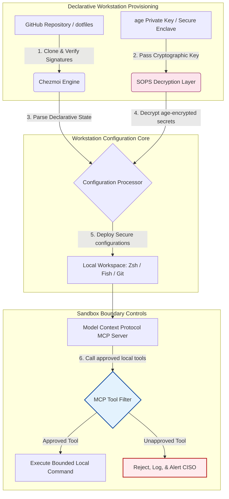

---

# Front Matter (YAML)

author: "contact@sebastienrousseau.com (Sebastien Rousseau)"
banner_alt: "Poste de développeur en lumière tamisée — symbolisant des dotfiles agent-conscients, reproductibles et sécurisés pour serveurs MCP, signature SLSA, secrets age/SOPS et parité multi-shell"
banner_height: "1597"
banner_width: "2584"
banner: "https://cloudcdn.pro/stocks/images/almas-salakhov-Vq2ap8aFFEs.webp"
cdn: "https://cloudcdn.pro"
charset: "UTF-8"
cname: "sebastienrousseau.com"
copyright: "© Copyright 2025 - 2026 - Sebastien Rousseau. All rights reserved."
date: "16 juin 2026"
description: "Les dotfiles agent-conscients sont un modèle de poste de développeur sécurisé et reproductible pour l'ère MCP — configuration déclarative via Chezmoi, secrets SOPS/age, provenance SLSA niveau 3, parité multi-shell et bacs à sable bornés pour les agents IA locaux."
format-detection: "telephone=no"
hreflang: "fr"
icon: "https://cloudcdn.pro/clients/sebastienrousseau/v1/logos/sebastienrousseau.svg"
id: "https://sebastienrousseau.com/2026-06-16-ai-aware-dotfiles-secure-reproducible-workstation-2026"
image_alt: "Portrait en noir et blanc de Sebastien Rousseau"
image_height: "162"
image_width: "162"
image: "https://cloudcdn.pro/stocks/images/sebastienrousseau.webp"
keywords: "dotfiles, Chezmoi, MCP, Model Context Protocol, SLSA, SOPS, chiffrement age, configuration déclarative, poste de développeur, DORA article 5, NIST CSF 2.0, sécurité de la chaîne d'approvisionnement, IA agentique, parité multi-shell, Zsh, Fish, Nushell"
language: "fr-FR"
last_reviewed: "2026-06-16"
layout: "report"
locale: "fr_FR"
logo_alt: "Logo de Sebastien Rousseau"
logo_height: "44"
logo_width: "44"
logo: "https://cloudcdn.pro/clients/sebastienrousseau/v1/logos/sebastienrousseau.svg"
menu: ""
measurementID: "G-169G4ET5HQ"
name: "Sebastien Rousseau"
permalink: "https://sebastienrousseau.com/2026-06-16-ai-aware-dotfiles-secure-reproducible-workstation-2026"
rating: "general"
referrer: "no-referrer"
robots: "index, follow"
schema: "FAQPage, Article"
seo_title: "Dotfiles agent-conscients : poste de développeur sécurisé"
short_name: "sebastienrousseau"
subtitle: "Le poste de développeur fait désormais partie de la chaîne d'approvisionnement IA ; les dotfiles exigent sécurité, reproductibilité, hygiène des secrets et flux MCP-conscients."
tags: "dotfiles, outils de développement, MCP, SLSA, poste sécurisé, chezmoi, macOS, Linux, WSL"
theme-color: "0, 83, 191"
title: "Dotfiles agent-conscients en 2026 : un poste de développeur sécurisé et reproductible pour MCP, SLSA et la parité multi-shell"
url: "https://sebastienrousseau.com/2026-06-16-ai-aware-dotfiles-secure-reproducible-workstation-2026"
viewport: "width=device-width, initial-scale=1, shrink-to-fit=no"

# RSS - The RSS feed front matter (YAML).
atom_link: "https://sebastienrousseau.com/2026-06-16-ai-aware-dotfiles-secure-reproducible-workstation-2026/rss.xml"
category: "Technology"
docs: https://validator.w3.org/feed/docs/rss2.html
generator: "Static Site Generator (SSG) (version 0.0.26)"
item_description: "Analyse des dotfiles déclaratifs pour un poste de développeur sécurisé et reproductible sur macOS, Linux et WSL, avec MCP, SLSA, age, SOPS et parité multi-shell."
item_guid: "https://sebastienrousseau.com/2026-06-16-ai-aware-dotfiles-secure-reproducible-workstation-2026/rss.xml"
item_link: "https://sebastienrousseau.com/2026-06-16-ai-aware-dotfiles-secure-reproducible-workstation-2026/rss.xml"
item_pub_date: "Tue, 16 Jun 2026 06:06:06 +0000"
item_title: "Dotfiles agent-conscients en 2026 : un poste de développeur sécurisé et reproductible pour MCP, SLSA et la parité multi-shell"
last_build_date: "Tue, 16 Jun 2026 06:06:06 +0000"
managing_editor: "contact@sebastienrousseau.com (Sebastien Rousseau)"
pub_date: "Tue, 16 Jun 2026 06:06:06 +0000"
ttl: "60"
type: "article"
webmaster: "contact@sebastienrousseau.com"

# Apple - The Apple front matter (YAML).
apple_mobile_web_app_orientations: "portrait"
apple_touch_icon_sizes: "192x192"
apple-mobile-web-app-capable: "yes"
apple-mobile-web-app-status-bar-inset: "black"
apple-mobile-web-app-status-bar-style: "black-translucent"
apple-mobile-web-app-title: "Dotfiles agent-conscients : poste sécurisé"
apple-touch-fullscreen: "yes"

# MS Application - The MS Application front matter (YAML).

msapplication-navbutton-color: "0, 83, 191"

# Twitter Card - The Twitter Card front matter (YAML).

twitter_card: "summary_large_image"
twitter_creator: "@wwdseb"
twitter_description: "Analyse des dotfiles déclaratifs pour un poste de développeur sécurisé et reproductible sur macOS, Linux et WSL, avec MCP, SLSA, age, SOPS et parité multi-shell."
twitter_image: "https://cloudcdn.pro/clients/sebastienrousseau/v1/logos/sebastienrousseau.svg"
twitter_image_alt: "Logo de Sebastien Rousseau"
twitter_site: "@wwdseb"
twitter_title: "Dotfiles agent-conscients : poste de développeur sécurisé"
twitter_url: "https://sebastienrousseau.com/2026-06-16-ai-aware-dotfiles-secure-reproducible-workstation-2026"

excerpt: "Les dotfiles agent-conscients en 2026 traitent le poste de développeur comme une infrastructure de chaîne d'approvisionnement — configuration déclarative gérée par Chezmoi, conscience MCP, versions signées SLSA, secrets age/SOPS, démarrage sous la seconde et parité macOS/Linux/WSL."

# Humans.txt - The Humans.txt front matter (YAML).
author_website: "https://sebastienrousseau.com"
author_twitter: "@wwdseb"
author_location: "London, UK"
thanks: "Merci de votre lecture !"
site_last_updated: "2026-06-16"
site_standards: "HTML5, CSS3, RSS, Atom, JSON, XML, YAML, Markdown, TOML"
site_components: "Kaishi, Kaishi Builder, Kaishi CLI, Kaishi Templates, Kaishi Themes"
site_software: "Static Site Generator, Rust"

---

# Dotfiles agent-conscients en 2026 : un poste de développeur sécurisé et reproductible pour MCP, SLSA et la parité multi-shell

<!-- lead-start -->
<aside class="post-lead" aria-label="Résumé de l'article">

<strong>En bref.</strong> Le poste de développeur n'est plus un simple terminal ; c'est un participant actif de la chaîne d'approvisionnement logicielle et une interface directe avec le plan de contrôle IA local. Les assistants IA en terminal et les serveurs <a href="https://modelcontextprotocol.io">Model Context Protocol (MCP)</a> exécutent des commandes shell locales, inspectent des dépôts et lisent directement des fichiers de configuration sensibles. <a href="https://github.com/sebastienrousseau/dotfiles">Les Dotfiles de Sebastien Rousseau</a> sont un cadre déclaratif open source qui bâtit des postes sécurisés et reproductibles sur macOS, Linux et Windows Subsystem for Linux (WSL) — intégrant <a href="https://www.chezmoi.io/">Chezmoi</a>, <a href="https://github.com/getsops/sops">SOPS, age</a> et la provenance de build SLSA niveau 3 pour isoler les secrets en mémoire et borner les chemins d'exécution des modèles IA locaux.

<strong>Points clés à retenir</strong>

<ul class="post-lead-takeaways">
  <li><strong>Le poste est une infrastructure de chaîne d'approvisionnement.</strong> La configuration de l'environnement de développement doit être traitée avec la même rigueur déclarative que les déploiements de serveurs de production, en éliminant la dérive manuelle de configuration.</li>
  <li><strong>Le défi du plan de contrôle IA.</strong> Les modèles IA en terminal et les outils MCP peuvent accéder aux répertoires locaux. Les dotfiles doivent imposer des bacs à sable bornés, des listes de permissions d'outils strictes et des journaux locaux inaltérables pour prévenir les fuites de données.</li>
  <li><strong>Parité multiplateforme absolue.</strong> Performance et profils de sécurité identiques, sous la seconde, sur macOS, Linux (Zsh, Fish, Nushell) et WSL, faisant passer l'onboarding développeur de semaines à minutes.</li>
  <li><strong>Isolation cryptographique des secrets.</strong> Le chiffrement de fichiers via SOPS et age empêche les identifiants codés en dur (jetons GitHub, clés d'accès cloud) d'être commités dans Git ou lus par les LLM locaux.</li>
  <li><strong>Valeur fiduciaire au niveau du conseil.</strong> Traduit la conformité de la configuration des postes en priorités lisibles par le conseil, en soutien de DORA article 5, des standards d'endpoint NIST CSF 2.0 et de la réduction du risque opérationnel Basel III.</li>
</ul>

<strong>Lectures complémentaires :</strong> <a href="https://sebastienrousseau.com/2026-05-23-agentic-payments-banking-consent-liability-new-payment-ux-2026">Paiements agentiques en banque : consentement, responsabilité et nouvelle UX de paiement en 2026</a>, <a href="https://sebastienrousseau.com/2024-03-12-revolutionising-real-time-speech-recognition-on-macos-with-openai-whisper/index.html">Reconnaissance vocale temps réel rapide sur macOS : OpenAI Whisper</a>, <a href="https://sebastienrousseau.com/2024-02-26-google-gemma-ai-transforming-open-source-ai-development/index.html">Google Gemma AI : transformer le développement IA open source</a>.

</aside>
<!-- lead-end -->

Faire le lien entre configuration déclarative du poste de travail et chaînes d'approvisionnement logicielles sécurisées à l'ère des modèles IA locaux et des outils développeur agentiques.

La référence open source de cet article est [dotfiles ⧉](https://github.com/sebastienrousseau/dotfiles "dotfiles — configuration déclarative du poste de travail"). Le dépôt se positionne ainsi : dotfiles déclaratifs pour macOS, Linux et WSL, offrant parité multi-shell, démarrage sous la seconde, versions signées SLSA et configuration consciente d'IA/MCP.

## Pourquoi ce projet open source compte en 2026

En juin 2026, le poste de développeur est le maillon faible de la chaîne d'approvisionnement logicielle et une cible de grande valeur pour les syndicats cyber criminels et les acteurs étatiques sophistiqués.

La sécurité de l'environnement de développement a basculé radicalement avec la montée des assistants de code IA en terminal (tels que Claude Code) et l'adoption de Model Context Protocol (MCP). Les terminaux développeur locaux hébergent désormais des agents IA actifs et autonomes capables de :

- Lire et modifier les fichiers sources locaux.
- Appeler des outils CLI locaux (`git`, `npm`, `aws`, `kubectl`).
- Inspecter les variables d'environnement du shell, les bases de données locales et les paramètres de configuration.

Si l'environnement local du développeur manque de frontières strictes, ces outils IA autonomes peuvent lire par inadvertance des données personnelles sensibles, faire fuiter des identifiants cloud vers des API LLM publiques, ou exécuter des paquets malveillants pendant des builds automatisés.

Au titre du règlement sur la résilience opérationnelle numérique (DORA) et du cadre de cybersécurité NIST (CSF) 2.0, les institutions financières sont légalement tenues de vérifier la provenance et l'intégrité de sécurité de chaque appareil accédant à la chaîne d'approvisionnement logicielle. Les « ordinateurs portables snowflake » — configurations manuelles, non auditées et dérivantes — ne sont plus conformes aux standards bancaires mondiaux.

[Les Dotfiles de Sebastien Rousseau](https://github.com/sebastienrousseau/dotfiles) résolvent ce problème. C'est un cadre open source et déclaratif de gestion du poste de travail qui établit des postes de développeur sécurisés et reproductibles. En imposant une base de configuration standardisée et auditable, le projet délivre un Return on Resilience (RoR) élevé, faisant passer l'onboarding développeur de semaines à heures et protégeant les chaînes d'approvisionnement financières sensibles des vulnérabilités d'endpoint.

## Le prisme architectural du poste agent-conscient 2026

Le cadre dotfiles fonctionne comme un gestionnaire d'environnement déclaratif et sécurisé — tous les shells, outils et secrets locaux gérés, audités et isolés de façon systématique :

| Couche | Décision de conception | Pourquoi cela compte | Risque en cas de mauvaise gestion |
|---|---|---|---|
| **Couche de provisionnement** | Gestion de configuration déclarative via Chezmoi | Bâtit des postes entièrement reproductibles sur macOS, Linux et WSL, en éliminant la dérive. | Configurations snowflake aux états locaux non audités et vulnérables. |
| **Couche shell** | Parité multi-shell (Zsh, Fish, Nushell) | Garantit un démarrage identique et sous la seconde, et un comportement d'alias cohérent entre environnements. | Incohérences de commandes shell provoquant des résultats de script inattendus. |
| **Couche secrets** | Chiffrement de fichiers via SOPS et age | Empêche les identifiants codés en dur et les clés brutes d'être commités dans Git ou exposés aux LLM locaux. | Identifiants fuités dans l'historique d'un dépôt public ou compromis par des agents locaux. |
| **Couche AI/MCP** | Contrôles de frontière Model Context Protocol | Restreint les agents IA locaux à une liste précise d'outils approuvés, en journalisant toutes les exécutions locales. | Agents IA sans bornes exécutant des commandes incontrôlées ou destructrices localement. |
| **Couche chaîne d'approvisionnement** | Versions signées SLSA et vérification Sigstore | Prouve cryptographiquement l'authenticité des scripts d'amorçage et fichiers de configuration. | Scripts d'installation compromis injectant des portes dérobées malveillantes dans les environnements développeur. |

## Signaux clés de sécurité et d'automatisation du poste

Pour maintenir une sécurité absolue sur le parc de développement, les Chief Information Security Officers (CISO) et responsables technologiques doivent suivre des indicateurs opérationnels précis et quantifiables :

| Signal | Mesure / Référence opérationnelle | Référence NIST CSF / DORA | Mise en œuvre technique de la plateforme |
|---|---|---|---|
| **Reproductibilité du poste** | % d'ordinateurs portables développeurs entièrement gérés via des dépôts dotfiles déclaratifs sans dérive de configuration. | NIST CSF 2.0 (PR.DS-01) | Audits de détection de dérive Chezmoi exécutés automatiquement au démarrage du terminal. |
| **Hygiène des identifiants** | Zéro secret ou clé non chiffrés stockés en clair dans les fichiers de configuration locaux. | DORA article 6 (sécurité TIC) | Hooks Git pre-commit et analyses locales rejetant les fichiers non chiffrés. |
| **Provenance du build** | 100 % des utilitaires d'amorçage du poste vérifiés via des manifestes signés cryptographiquement. | DORA article 30 (chaîne d'approvisionnement) | Vérification Sigstore et SLSA niveau 3 intégrée aux pipelines d'installation. |
| **Délai d'onboarding développeur** | Temps écoulé entre la fourniture matérielle brute et un espace de travail conforme et entièrement configuré. | Return on Resilience (RoR) | Scripts d'installation automatisés et déclaratifs compilant l'environnement en moins de 15 minutes. |
| **Accès agent IA borné** | Vérification que les outils IA locaux opèrent dans des limites de répertoires définies, avec lecture seule par défaut. | Gestion du risque modèle | Profils de configuration MCP restreignant les catalogues d'outils des agents aux opérations approuvées. |

## Pourquoi la configuration déclarative est le cœur de la sécurité du poste

Les approches traditionnelles d'installation du poste de développeur sont très manuelles et produisent des « ordinateurs portables snowflake » — des environnements où les configurations dérivent au fil du temps à mesure que les développeurs installent des outils personnalisés, ajustent des variables et modifient des scripts locaux. Cette dérive crée plusieurs vulnérabilités critiques :

1. **Configurations fantômes non suivies.** Les ordinateurs portables qui dérivent font souvent tourner des paquets logiciels obsolètes et vulnérables, ou des scripts locaux qui contournent les outils de sécurité de l'entreprise.
2. **Fuite de secrets.** Les développeurs codent fréquemment en dur des clés API, des jetons GitHub ou des identifiants AWS directement dans des scripts en clair ou des profils shell, les rendant hautement vulnérables au vol.
3. **Onboarding inefficace.** Mettre en place manuellement un nouveau poste de développeur peut prendre jusqu'à deux semaines d'effort d'ingénierie, pesant sur la vélocité de l'équipe.

En passant à une configuration déclarative et pilotée par modèle avec Chezmoi, l'espace de travail développeur devient un système de référence versionné et reproductible. Chaque modification, alias, dépendance de paquet et valeur de sécurité par défaut est documenté dans Git, validé contre les politiques de conformité de l'organisation et vérifié cryptographiquement avant d'être appliqué à l'ordinateur portable physique.

## Concevoir un environnement développeur IA borné

Pour empêcher les agents IA locaux et les outils MCP de gagner un accès sans bornes aux ressources locales, le poste doit fonctionner comme un plan d'exécution borné.

Le flux opérationnel ci-dessous montre comment le cadre dotfiles coordonne Chezmoi, SOPS et age pour déchiffrer et déployer des dotfiles sécurisés, tout en maintenant une frontière d'exécution isolée, en bac à sable, pour les agents IA locaux qui appellent des outils MCP :

## Le manuel du conseil et la responsabilité fiduciaire

La sécurité du poste de développeur et l'intégrité de la chaîne d'approvisionnement sont des priorités critiques au niveau du conseil. Les dirigeants doivent traiter le risque de l'environnement développeur sous l'angle de la responsabilité fiduciaire, de la conformité réglementaire et de la préservation de la valeur :

- **DORA article 5 (responsabilité du conseil).** Impose que l'organe de direction (le conseil) porte la responsabilité ultime de la gestion du risque TIC de l'institution. Les postes de développeur étant la porte d'entrée vers la chaîne d'approvisionnement logicielle, les administrateurs doivent vérifier que les endpoints sont sécurisés, entièrement auditables et gérés sous des cadres de configuration stricts et reproductibles pour satisfaire aux audits réglementaires.
- **Conformité NIST CSF 2.0 (sécurité des endpoints).** Exige que seuls des appareils autorisés et validés, exécutant des configurations standardisées et sécurisées, puissent accéder aux réseaux et aux dépôts de l'entreprise. Les dotfiles déclaratifs permettent aux équipes sécurité de prouver mathématiquement que tous les environnements développeur respectent la base de sécurité de l'organisation, en éliminant le risque de configurations « snowflake » non auditées.
- **Préservation de la valeur du bilan.** Un seul identifiant développeur compromis ou une brèche dans la chaîne d'approvisionnement peut coûter à une institution des millions de dollars en remédiation, en amendes réglementaires et en atteinte à la réputation. Passer à un environnement développeur sécurisé et déclaratif minimise directement ce risque, en préservant la valeur du bilan et la confiance des clients.

## Ce que cela signifie selon le type de banque

### Banques d'importance systémique mondiale (G-SIBs)

Les G-SIBs gèrent des milliers de postes de développeur sur plusieurs continents et juridictions réglementaires. Leur défi premier est de maintenir la cohérence de configuration et d'empêcher la fuite d'identifiants à travers des équipes d'ingénierie massives. En adoptant un modèle de dotfiles déclaratif et open source via Chezmoi, les G-SIBs peuvent standardiser la sécurité des endpoints, automatiser l'audit de conformité et faire passer les délais d'onboarding développeur de semaines à minutes à l'échelle de l'organisation mondiale.

### Banques de transaction et de financement aux entreprises

Les banques de transaction opèrent des passerelles de paiement sensibles et des infrastructures de compensation de gros. Prouver l'intégrité absolue du code déployé dans ces environnements de production est une exigence réglementaire non négociable. Standardiser les postes de développeur sous un cadre dotfiles conforme SLSA garantit que la chaîne d'approvisionnement logicielle est entièrement auditée et protégée des vulnérabilités d'endpoint développeur locales.

### Banques régionales et plus petites

Les banques régionales doivent maintenir des standards élevés de cybersécurité sans disposer des budgets de sécurité massifs des G-SIBs. Ce cadre dotfiles open source fournit une solution légère, économique, hautement sécurisée et compatible Python et Rust, permettant aux institutions plus petites de mettre en œuvre une sécurité d'endpoint et une protection de la chaîne d'approvisionnement de niveau entreprise sans licences logicielles propriétaires onéreuses.

## Conclusion : la feuille de route du poste de développeur

Le poste de développeur n'est plus un appareil périphérique ; c'est un plan de contrôle critique de la chaîne d'approvisionnement logicielle. Permettre à des « ordinateurs portables snowflake » configurés manuellement et non audités d'accéder aux ressources de l'entreprise est un risque opérationnel et réglementaire majeur.

Pour sécuriser la chaîne d'approvisionnement logicielle et protéger les endpoints des vulnérabilités d'agents IA locaux, les responsables technologie et sécurité doivent exécuter dès aujourd'hui une feuille de route claire :

1. **Imposer le provisionnement déclaratif.** Éliminer progressivement les processus d'installation manuels et documentés, et imposer que tous les environnements développeur soient provisionnés de façon déclarative via Chezmoi.
2. **Faire appliquer l'hygiène des secrets.** Imposer des hooks pre-commit stricts et des utilitaires d'analyse pour garantir zéro identifiant, clé ou jeton API brut stocké en clair dans les configurations locales des postes.
3. **Établir des bacs à sable IA.** Mettre en place des profils de configuration MCP sécurisés et bornés pour restreindre les assistants et agents de code IA locaux à des outils et répertoires approuvés, en lecture seule.
4. **Sécuriser la chaîne d'approvisionnement.** S'assurer que tous les scripts d'amorçage et configurations d'environnement sont vérifiés cryptographiquement via la provenance SLSA niveau 3 avant déploiement.

## Foire aux questions

**Qu'est-ce que Chezmoi et pourquoi est-il utilisé pour les dotfiles ?**

Chezmoi est un gestionnaire de dotfiles open source, sécurisé et déclaratif. Il permet aux développeurs de gérer leurs configurations locales comme un dépôt versionné, garantissant cohérence et reproductibilité absolues sur différents systèmes d'exploitation (macOS, Linux, WSL).

**Comment le cadre protège-t-il les secrets ?**

Le cadre utilise SOPS (Secrets Operations) et le chiffrement de fichiers age pour chiffrer les identifiants sensibles (tels que jetons GitHub ou clés d'accès cloud) directement à l'intérieur du dépôt de dotfiles. Cela empêche les clés d'être commités en clair ou lues par des agents IA locaux non autorisés.

**Qu'est-ce que Model Context Protocol (MCP) et comment affecte-t-il la sécurité ?**

MCP est un standard ouvert qui permet aux modèles IA d'exécuter en sécurité des outils locaux et d'accéder à des fichiers. Le cadre dotfiles met en œuvre des fichiers de configuration MCP stricts pour restreindre les outils et agents IA locaux à des répertoires et commandes approuvés.

**Quels shells le cadre prend-il en charge ?**

Bash, Zsh, Fish, Nushell et PowerShell — avec parité sur macOS, Linux et WSL, de sorte que le comportement des commandes reste identique quel que soit le terminal ouvert par le développeur.

## Références

- Open Source Security Foundation (OpenSSF), (2024). *Supply-chain Levels for Software Artifacts (SLSA)*. Disponible sur : [Cadre SLSA ⧉](https://slsa.dev/ "Cadre SLSA").
- NIST, (2024). *NIST Cybersecurity Framework 2.0*. Gaithersburg : National Institute of Standards and Technology. Disponible sur : [NIST CSF 2.0 ⧉](https://www.nist.gov/cyberframework "Cadre de cybersécurité NIST 2.0").
- Parlement européen et Conseil de l'Union européenne, (2022). *Règlement (UE) 2022/2554 sur la résilience opérationnelle numérique du secteur financier (DORA)*. Bruxelles : Journal officiel de l'Union européenne. Disponible sur : [Règlement DORA ⧉](https://eur-lex.europa.eu/legal-content/EN/TXT/?uri=CELEX%3A32022R2554 "Règlement DORA").
- GitHub, (2026). *Dépôt open source dotfiles*. Disponible sur : [Dépôt dotfiles ⧉](https://github.com/sebastienrousseau/dotfiles "Dépôt dotfiles").

<!-- enrich-start -->
<aside class="author-card" aria-label="À propos de l'auteur"><strong class="author-card-name"><a href="/about/index.html">Sebastien Rousseau</a></strong>Technologue bancaire senior, écrivant sur l'IA appliquée, la migration ISO 20022, la cryptographie post-quantique pour les services financiers et la transformation structurelle des paiements de gros.Plus de 20 ans à HSBC Commercial &amp; Investment Bank, PayPal, Barclays, Shazam, AKQA, Virgin Group. <a href="/about/index.html">Profil complet</a> &middot; <a href="https://www.linkedin.com/in/sebastienrousseau/" rel="external noopener">LinkedIn</a> &middot; <a href="https://github.com/sebastienrousseau" rel="external noopener">GitHub</a></aside>

Dernière révision <time datetime="2026-06-16">2026-06-16</time>.

<aside class="related-posts" aria-labelledby="related-heading">
<h2 id="related-heading" class="related-heading">Lectures complémentaires</h2>

<article class="related-card"><footer class="related-body"><h3><a href="https://sebastienrousseau.com/2026-05-23-agentic-payments-banking-consent-liability-new-payment-ux-2026">Paiements agentiques en banque : consentement, responsabilité et nouvelle UX de paiement en 2026</a></h3>
<time datetime="2026-05-23">2026-05-23</time>
</footer></article>
<article class="related-card"><footer class="related-body"><h3><a href="https://sebastienrousseau.com/2024-03-12-revolutionising-real-time-speech-recognition-on-macos-with-openai-whisper/index.html">Reconnaissance vocale temps réel rapide sur macOS : OpenAI Whisper</a></h3>
<time datetime="2024-03-12">2024-03-12</time>
</footer></article>
<article class="related-card"><footer class="related-body"><h3><a href="https://sebastienrousseau.com/2024-02-26-google-gemma-ai-transforming-open-source-ai-development/index.html">Google Gemma AI : transformer le développement IA open source</a></h3>
<time datetime="2024-02-26">2024-02-26</time>
</footer></article>

</aside>
<!-- enrich-end -->
