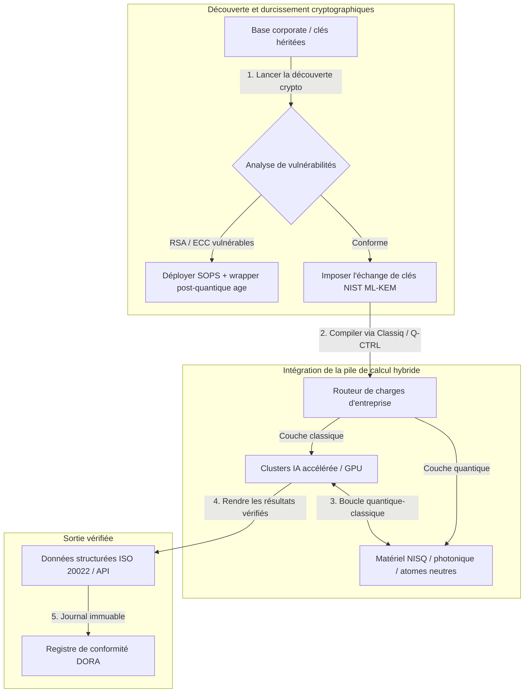

---

# Front Matter (YAML)

author: "contact@sebastienrousseau.com (Sebastien Rousseau)"
banner_alt: "Vue depuis la scène du sommet Economist Impact 5th Annual Commercialising Quantum Global 2026 à Londres — symbolisant la transition du quantique de la recherche en physique vers des flux de travail d'entreprise opérationnels"
banner_height: "1597"
banner_width: "2584"
banner: "https://cloudcdn.pro/stocks/images/sebastien-rousseau-20260617-5th-commercialising-quantum-2.webp"
cdn: "https://cloudcdn.pro"
charset: "UTF-8"
cname: "sebastienrousseau.com"
copyright: "© Copyright 2025 - 2026 - Sebastien Rousseau. All rights reserved."
date: "17 juin 2026"
description: "Enseignements pour le conseil d'administration tirés du sommet Economist Impact 5th Annual Commercialising Quantum Global 2026 — afflux de 1,3 Md$ de financement, piles hybrides « sans regret », urgence de la migration vers la cryptographie post-quantique, commercialisation des capteurs quantiques et directive de HSBC : attendre est une faute non provoquée."
format-detection: "telephone=no"
hreflang: "fr"
icon: "https://cloudcdn.pro/clients/sebastienrousseau/v1/logos/sebastienrousseau.svg"
id: "https://sebastienrousseau.com/2026-06-17-economist-commercialising-quantum-summit-2026"
image_alt: "Portrait en noir et blanc de Sebastien Rousseau"
image_height: "162"
image_width: "162"
image: "https://cloudcdn.pro/stocks/images/sebastienrousseau.webp"
keywords: "Commercialising Quantum Global 2026, sommet Economist Impact, cryptographie post-quantique, NIST ML-KEM, harvest-now decrypt-later, SNDL, HSBC quantique, Philip Intallura, capteurs quantiques, navigation indépendante du GPS, NQCC, EU Quantum Act, Quantcore, prix qBIG, Lord Vallance, hybride quantique-classique, DORA article 6"
language: "fr-FR"
last_reviewed: "2026-06-17"
layout: "report"
locale: "fr_FR"
logo_alt: "Logo de Sebastien Rousseau"
logo_height: "44"
logo_width: "44"
logo: "https://cloudcdn.pro/clients/sebastienrousseau/v1/logos/sebastienrousseau.svg"
menu: ""
measurementID: "G-169G4ET5HQ"
name: "Sebastien Rousseau"
permalink: "https://sebastienrousseau.com/2026-06-17-economist-commercialising-quantum-summit-2026"
rating: "general"
referrer: "no-referrer"
robots: "index, follow"
schema: "FAQPage, Article"
seo_title: "Commercialising Quantum 2026 : enseignements pour le conseil"
short_name: "sebastienrousseau"
subtitle: "Le quantique a quitté le terrain spéculatif des laboratoires pour entrer dans les flux hybrides d'entreprise ; le conseil doit répondre aux 1,3 Md$ de financement en 2026, à la migration post-quantique immédiate et à la directive de HSBC : cesser d'attendre."
tags: "quantique, cryptographie post-quantique, NIST ML-KEM, harvest-now decrypt-later, capteurs quantiques, HSBC, Economist Impact, calcul hybride, DORA, EU Quantum Act, NQCC, enseignements du sommet"
theme-color: "0, 83, 191"
title: "Des qubits aux profits : enseignements stratégiques du 5e sommet annuel Commercialising Quantum Global 2026 de l'Economist"
url: "https://sebastienrousseau.com/2026-06-17-economist-commercialising-quantum-summit-2026"
viewport: "width=device-width, initial-scale=1, shrink-to-fit=no"

# RSS - The RSS feed front matter (YAML).
atom_link: "https://sebastienrousseau.com/2026-06-17-economist-commercialising-quantum-summit-2026/rss.xml"
category: "Technology"
docs: https://validator.w3.org/feed/docs/rss2.html
generator: "Static Site Generator (SSG) (version 0.0.26)"
item_description: "Enseignements pour le conseil d'administration tirés du sommet Economist Impact 5th Annual Commercialising Quantum Global 2026 — afflux de 1,3 Md$ de financement, piles hybrides « sans regret », urgence de la migration vers la cryptographie post-quantique, commercialisation des capteurs quantiques et directive de HSBC : attendre est une faute non provoquée."
item_guid: "https://sebastienrousseau.com/2026-06-17-economist-commercialising-quantum-summit-2026/rss.xml"
item_link: "https://sebastienrousseau.com/2026-06-17-economist-commercialising-quantum-summit-2026/rss.xml"
item_pub_date: "Wed, 17 Jun 2026 06:06:06 +0000"
item_title: "Des qubits aux profits : enseignements stratégiques du 5e sommet annuel Commercialising Quantum Global 2026 de l'Economist"
last_build_date: "Wed, 17 Jun 2026 06:06:06 +0000"
managing_editor: "contact@sebastienrousseau.com (Sebastien Rousseau)"
pub_date: "Wed, 17 Jun 2026 06:06:06 +0000"
ttl: "60"
type: "article"
webmaster: "contact@sebastienrousseau.com"

# Apple - The Apple front matter (YAML).
apple_mobile_web_app_orientations: "portrait"
apple_touch_icon_sizes: "192x192"
apple-mobile-web-app-capable: "yes"
apple-mobile-web-app-status-bar-inset: "black"
apple-mobile-web-app-status-bar-style: "black-translucent"
apple-mobile-web-app-title: "Commercialising Quantum 2026 : enseignements"
apple-touch-fullscreen: "yes"

# MS Application - The MS Application front matter (YAML).

msapplication-navbutton-color: "0, 83, 191"

# Twitter Card - The Twitter Card front matter (YAML).

twitter_card: "summary_large_image"
twitter_creator: "@wwdseb"
twitter_description: "Enseignements pour le conseil d'administration tirés du sommet Economist Impact 5th Annual Commercialising Quantum Global 2026 — afflux de 1,3 Md$ de financement, piles hybrides « sans regret », urgence de la migration post-quantique, commercialisation des capteurs quantiques et directive de HSBC : attendre est une faute non provoquée."
twitter_image: "https://cloudcdn.pro/clients/sebastienrousseau/v1/logos/sebastienrousseau.svg"
twitter_image_alt: "Logo de Sebastien Rousseau"
twitter_site: "@wwdseb"
twitter_title: "Commercialising Quantum 2026 : enseignements pour le conseil"
twitter_url: "https://sebastienrousseau.com/2026-06-17-economist-commercialising-quantum-summit-2026"

excerpt: "Le sommet Economist Impact 5th Annual Commercialising Quantum Global 2026 a confirmé le basculement du quantique vers les flux d'entreprise : 1,3 Md$ levés en cinq mois, la cryptographie post-quantique est devenue un enjeu fiduciaire de conseil face au harvesting SNDL, les capteurs quantiques sont déjà livrés pour la navigation indépendante du GPS, et Philip Intallura (HSBC) a martelé qu'attendre le matériel tolérant aux fautes est une faute non provoquée."

# Humans.txt - The Humans.txt front matter (YAML).
author_website: "https://sebastienrousseau.com"
author_twitter: "@wwdseb"
author_location: "London, UK"
thanks: "Merci de votre lecture !"
site_last_updated: "2026-06-17"
site_standards: "HTML5, CSS3, RSS, Atom, JSON, XML, YAML, Markdown, TOML"
site_components: "Kaishi, Kaishi Builder, Kaishi CLI, Kaishi Templates, Kaishi Themes"
site_software: "Static Site Generator, Rust"

---

# Des qubits aux profits : enseignements stratégiques du 5e sommet annuel Commercialising Quantum Global 2026 de l'Economist

Maturité d'entreprise, migrations vers la cryptographie post-quantique, piles de calcul hybride et paysage commercial émergent des capteurs et réseaux quantiques.

**En bref.** Le 5e sommet annuel Commercialising Quantum Global 2026, organisé par Economist Impact les 16 et 17 juin 2026 au Business Design Centre de Londres, a réuni plus de 1 100 dirigeants mondiaux issus de l'entreprise, de la finance, des politiques publiques et de la recherche. Le fil conducteur a marqué un pivot structurel net : la technologie quantique a quitté la science spéculative des laboratoires pour s'installer dans des flux hybrides et opérationnels d'entreprise. Adossé à 1,3 milliard de dollars de capital-risque levés sur les seuls cinq premiers mois de 2026, le débat de conseil ne tourne plus autour du décompte de qubits physiques, mais autour de l'établissement de piles de calcul hybride « sans regret », de la protection des actifs numériques contre la menace cryptographique « harvest-now, decrypt-later » (SNDL) et du déploiement à court terme de capteurs quantiques pour la navigation indépendante du GPS.

## Points clés à retenir

- **Bascule de l'entreprise vers des flux opérationnels.** Les dirigeants du secteur ([Steve Suarez](https://www.linkedin.com/in/stevesuarez) de HorizonX, [Phil Intallura](https://www.linkedin.com/in/intallura) de HSBC) ont souligné que l'intégration quantique n'est plus un problème de physique, mais un problème opérationnel. Banques et entreprises déploient des pilotes hybrides quantique-classique pour préparer leurs talents et optimiser des charges de travail actives.
- **La cryptographie post-quantique (PQC) est une priorité de conseil.** Les experts sécurité et juridiques (CMS UK, [Joanne Miller](https://www.linkedin.com/in/joanne-miller-nso) de Microsoft, [Craig Farrell](https://www.linkedin.com/in/craig-farrell) de EY) ont averti que les organisations ne peuvent pas attendre le matériel tolérant aux fautes pour déployer la PQC. Le harvesting « harvest-now, decrypt-later » a lieu aujourd'hui, faisant de la migration vers les standards NIST ML-KEM un sujet fiduciaire immédiat.
- **Les capteurs quantiques en tête de la rentabilité à court terme.** Tandis que le calcul tolérant aux fautes reste à plusieurs années, les capteurs quantiques ([Matthew Kinsella](https://www.linkedin.com/in/matthewkinsella) d'Infleqtion) montent en charge rapidement. Horloges et capteurs inertiels quantiques sont déployés pour la navigation indépendante du GPS, la sécurité nationale et les réseaux énergétiques ultra-stables.
- **Souveraineté, clusters et urgence politique.** Le ministre des sciences britannique [Lord Vallance](https://www.linkedin.com/in/patrick-vallance) et [Lord William Hague](https://www.linkedin.com/in/williamhague) ont décrit les missions nationales visant à convertir la recherche en « superclusters » industriels coordonnés avec le NQCC. L'EU Quantum Act à venir accentue la course géopolitique à la capacité de calcul souveraine.
- **Quantcore remporte le prix qBIG.** La spin-out de l'Université de Glasgow, Quantcore, a obtenu le prix IOP qBIG pour ses composants supraconducteurs à base de niobium, qui opèrent à des températures supérieures aux matériaux traditionnels, réduisant nettement les coûts d'infrastructure cryogénique.

**Lectures complémentaires :** [KyberLib et la migration bancaire post-quantique en 2026 : des standards au code](https://sebastienrousseau.com/2026-06-12-kyberlib-post-quantum-banking-migration-standards-code-2026/), [L'indice de résilience bancaire 2026 : IA, cloud, quantique, paiements et risque de concentration tiers](https://sebastienrousseau.com/2026-06-08-banking-resilience-index-ai-cloud-quantum-payments-third-party-risk-2026/), [L'indice du banking cloud natif en 2026 : DORA, ingénierie de plateforme, cloud souverain et résilience opérationnelle](https://sebastienrousseau.com/2026-06-05-cloud-native-banking-index-dora-resilience-platform-engineering-2026/).

## 01. Pourquoi le sommet 2026 compte pour le conseil

L'édition 2026 du sommet Commercialising Quantum Global de l'Economist a marqué un basculement durable dans la manière dont le monde corporatif évalue la deep tech.

Historiquement, le calcul quantique était relégué aux départements R&D comme une aventure scientifique pluridécennale. En juin 2026, cette perspective est obsolète. Les organisations doivent passer d'une curiosité « centrée physique » à une mise en œuvre « centrée métier ». La raison est double :

1. **La convergence quantique-IA.** Les piles de calcul haute performance (HPC) fusionnent les nœuds classiques, l'IA accélérée et les nœuds NISQ (Noisy Intermediate-Scale Quantum) en une couche de calcul unifiée. Les organisations qui retarderont la construction d'applications « quantum-ready » découvriront que la fenêtre pour capter un avantage stratégique se referme plus vite qu'attendu.
2. **Urgence géopolitique et fiduciaire.** Avec le programme quantique britannique piloté par missions et l'EU Quantum Act à venir, la capacité quantique est devenue un enjeu de souveraineté nationale et de continuité d'entreprise.

Par ailleurs, la cybersécurité post-quantique n'est plus une obligation de conformité future. La menace d'attaques adverses « store now, decrypt later » (SNDL) implique que les données d'entreprise interceptées aujourd'hui seront déchiffrées dès que les systèmes quantiques commerciaux monteront en charge, créant une responsabilité immédiate au regard des mandats mondiaux de résilience opérationnelle comme DORA.

## 02. Le prisme stratégique Commercialising Quantum 2026

Les dirigeants technologiques d'entreprise doivent cartographier la maturité quantique selon cinq couches opérationnelles distinctes, en évaluant horizons temporels et risques bilanciels.

### Tableau 1 : le prisme stratégique Commercialising Quantum 2026

| Couche | Priorité corporate | Horizon temporel | Principal risque corporate |
| ---- | ---- | ---- | ---- |
| **Matériel et compilateur** | Choix entre approches concurrentes (supraconducteurs, ions piégés, atomes neutres, photonique) | 3 – 5 ans (tolérance aux fautes) | Verrouillage sur une architecture sans issue ou pari trop précoce sur une plateforme unique. |
| **Durcissement cryptographique** | Découverte et inventaire des dépendances cryptographiques ; migration vers NIST ML-KEM | Immédiat (migration active) | Brèches systémiques de données et défaut de conformité DORA et NIST CSF 2.0. |
| **Capteurs quantiques** | Déploiement de la navigation indépendante du GPS, d'horloges ultra-stables et de gravimètres | 1 – 2 ans (commercial immédiat) | Perturbation opérationnelle de la logistique, du transport maritime et des réseaux énergétiques liée au brouillage GPS. |
| **Intégration système** | Connexion du matériel quantique aux centres HPC et superordinateurs classiques existants | 1 – 3 ans (phase hybride) | Latence élevée, goulots d'étranglement de transfert de données et silos de calcul fragmentés. |
| **Logiciel d'entreprise** | Exposition des algorithmes quantiques via des couches d'abstraction et des API de haut niveau (Classiq, Q-CTRL) | Immédiat (montée en compétences) | Isolement des talents et des flux de travail vis-à-vis de l'exécution opérationnelle réelle. |

## 03. Signaux quantiques clés et déclencheurs pour le conseil

Les responsables technologie doivent suivre des métriques précises et quantifiables — marché et réglementation — pour orienter leurs investissements quantiques.

### Tableau 2 : signaux quantiques clés et déclencheurs pour le conseil

| Signal | Métrique quantitative | Référence réglementaire / politique | Priorité plateforme actionnable |
| ---- | ---- | ---- | ---- |
| **Afflux de financement quantique** | 1,3 Md$ levés au niveau mondial sur les cinq premiers mois de 2026 | Return on Resilience (RoR) | Réorienter les budgets des pilotes spéculatifs vers des charges hybrides quantique-classique « sans regret ». |
| **Exposition au déchiffrement de données** | 100 % des données chiffrées transmises sur canaux publics exposées au harvesting SNDL | DORA article 6 (sécurité TIC) | Mettre en œuvre des outils de découverte cryptographique pour identifier les clés RSA / ECC vulnérables sur le parc. |
| **Infrastructure souveraine** | Enveloppe de 2,5 Md£ de la stratégie nationale britannique pour le quantique | UK Quantum Missions / Lord Vallance | Établir des partenariats locaux avec des superclusters nationaux comme le NQCC. |
| **Échéances de conformité** | Bascule SWIFT vers les adresses structurées au 14 novembre 2026 | Directive SWIFT SR 2026 | Nettoyer et formater les bases interbancaires pour respecter les spécifications XML structurées. |

## 04. Plongée dans les thèmes centraux du sommet

### Le quantique atteint un point de bascule d'investissement

Le financement par capital-risque a connu une accélération marquée, atteignant **1,3 Md$** sur les cinq premiers mois de 2026. À la différence des cycles spéculatifs des années précédentes, la vague de capitaux actuelle est adossée à des charges de travail réelles et à court terme. Les intervenants de Classiq et de l'IBM Quantum Platform ont montré comment les couches d'abstraction logicielle et les compilateurs automatisés permettent à des équipes de développeurs non spécialistes d'exécuter des algorithmes hybrides quantique-classique sur l'infrastructure classique d'aujourd'hui. Cette stratégie « sans regret » permet aux organisations de bâtir dès maintenant talents et flux de travail « quantum-ready ».

### Avertissements juridiques et réglementaires sur le « harvest now, decrypt later »

Les associés des cabinets d'avocats et les dirigeants cybersécurité ont suscité un fort engagement sur l'immédiateté du risque de données. Les représentants du cabinet partenaire CMS UK et la CSO de Microsoft [Joanne Miller](https://www.linkedin.com/in/joanne-miller-nso) ont délivré un avertissement sans détour à la direction générale : *attendre l'arrivée du matériel tolérant aux fautes pour déployer la cryptographie post-quantique est un manquement fiduciaire critique.*

Sous le paradigme « store now, decrypt later » (SNDL), des acteurs hostiles collectent activement, aujourd'hui, les données d'entreprise chiffrées dans l'intention de les déchiffrer dès l'émergence d'ordinateurs quantiques cryptographiquement pertinents. Les organisations doivent déployer immédiatement des protections post-quantiques (telles que NIST ML-KEM) afin de protéger les jeux de données sensibles à longue durée de vie, la propriété intellectuelle et les historiques clients.

### Le recalibrage du « hype » autour des capteurs quantiques

Tandis que le calcul quantique tolérant aux fautes reste à plusieurs années, le sommet a mis en avant les capteurs quantiques comme la première vague véritablement rentable de déploiements concrets. Le directeur général [Matthew Kinsella](https://www.linkedin.com/in/matthewkinsella) d'Infleqtion a détaillé comment horloges quantiques, capteurs inertiels et systèmes radiofréquences montent en charge rapidement dans de multiples industries.

Parce que ces technologies mesurent des constantes physiques avec une précision sub-atomique, elles rendent possibles la **navigation indépendante du GPS**, des réseaux énergétiques ultra-stables et des télécommunications dans l'espace lointain. Ces applications sont particulièrement pertinentes pour l'aviation, le transport maritime et les systèmes de défense nationale confrontés à des menaces croissantes de brouillage GPS.

### Écosystème et collaboration entre clusters

L'écosystème quantique britannique s'est appuyé sur le sommet londonien pour mettre en lumière ses superclusters d'innovation domestiques. Les mises à jour en direct du NQCC et de Digital Catapult ont détaillé comment les spin-outs deep tech en phase précoce peuvent franchir la « fracture technologique » en intégrant le matériel quantique directement aux centres de données HPC classiques.

[Wridhdhisom Karar](https://www.linkedin.com/in/wridhdhisomkarar), cofondateur de la start-up quantique écossaise Quantcore, a accepté le prestigieux prix Quantum Business Innovation and Growth (qBIG) de l'Institute of Physics (IOP) pour les composants supraconducteurs à base de niobium de l'entreprise. Ces composants opèrent à des températures supérieures aux matériaux traditionnels, réduisant nettement les coûts d'infrastructure cryogénique nécessaires à la montée en charge des processeurs quantiques.

### L'étude de cas HSBC : pourquoi attendre le quantique est une « faute non provoquée »

Les éclairages de [**Philip Intallura, Ph.D.**](https://www.linkedin.com/in/intallura) (Global Head of Quantum Technologies chez HSBC, conseiller auprès du gouvernement britannique et conseiller de conseil d'administration) lors du 5e événement annuel Commercialising Quantum de l'Economist (2026) ont livré une directive forte aux conseils : *« Attendre le quantique tolérant aux fautes avant de commencer est une faute non provoquée. »*

Le Dr Intallura a soutenu que l'approche attentiste répandue parmi les institutions financières est un autogoal bâti sur trois hypothèses erronées :

- **Le ROI à court terme est réel.** Lors de tests empiriques, HSBC a surpassé des modèles actuellement en production, raccordé les travaux quantiques à d'autres pans du métier, utilisé le quantique pour approfondir ses relations avec certains de ses plus grands clients, et attiré de nouvelles affaires significatives au sein de **HSBC Innovation Banking**.
- **Le quantique est une courbe d'adoption abrupte.** Bâtir les capacités, fixer la stratégie, sécuriser le financement et conduire des cycles d'expérimentation au sein d'une organisation lourdement régulée n'est pas un court chantier. Les processus doivent être systématiquement testés et adaptés à la technologie.
- **Le quantique est un écosystème.** Aucun acteur seul n'y parvient. Chaque article de recherche, POC et pilote exécuté par HSBC l'a été en étroite collaboration avec un fournisseur quantique — et, dans certains cas, la collaboration s'étend au monde académique, aux régulateurs et aux pouvoirs publics.

**Directive de clôture au conseil :** *« La capacité dont vous aurez besoin au jour 1 de la tolérance aux fautes est la capacité que vous bâtissez maintenant. »*

## 05. Pipeline d'intégration quantique et de cryptographie en entreprise

Pour sécuriser les actifs numériques tout en bâtissant la maturité quantique, l'entreprise doit établir un pipeline d'intégration clair.

## 06. Le playbook du conseil : impératifs actionnables

Pour traduire les enseignements du sommet Commercialising Quantum Global 2026 en valeur immédiate, la direction générale doit exécuter le playbook de conseil suivant en quatre étapes :

1. **Mandater une découverte cryptographique.** Demander au Chief Information Security Officer (CISO) de cataloguer tous les actifs cryptographiques, en cartographiant chaque clé RSA et ECC héritée à l'échelle de l'entreprise pour préparer la migration post-quantique.
2. **Déployer une stratégie hybride « sans regret ».** Éviter d'attendre le matériel parfait. Investir dans des logiciels d'inspiration quantique et des pilotes hybrides classique-quantique pour développer les talents internes et optimiser dès aujourd'hui des problèmes complexes de logistique ou de portefeuilles de risque.
3. **Évaluer les capteurs quantiques pour la logistique.** Si votre organisation dépend de chaînes d'approvisionnement mondiales, du transport maritime ou d'infrastructures critiques, évaluer activement les capteurs quantiques (tels que la navigation indépendante du GPS) pour atténuer les risques géopolitiques de perturbation.
4. **S'inscrire à l'Insight Hour du 30 juin.** Veiller à ce que vos responsables technologie s'inscrivent à la **Commercialising Quantum Global Insight Hour** virtuelle du 30 juin 2026 à 15:00 BST (soutenue par IonQ) pour continuer à suivre les stratégies de gestion des risques et d'allocation des talents.

## 07. Foire aux questions

**Qu'est-ce que le « harvest now, decrypt later » (SNDL) et pourquoi est-ce important dès aujourd'hui ?**
Le SNDL consiste à intercepter et stocker dès aujourd'hui des données chiffrées, avec l'intention de les déchiffrer une fois disponibles des ordinateurs quantiques cryptographiquement pertinents. Les jeux de données sensibles à longue durée de vie — propriété intellectuelle, dossiers clients, communications gouvernementales — sont déjà ciblés. Migrer vers NIST ML-KEM est une décision fiduciaire que le conseil ne peut différer.

**Pourquoi les capteurs quantiques constituent-ils la première vague commerciale, plutôt que le calcul ?**
Les capteurs quantiques mesurent des constantes physiques avec une précision sub-atomique et n'exigent pas le matériel tolérant aux fautes requis par le calcul quantique. Horloges quantiques, gravimètres et capteurs inertiels sont déjà en déploiement pilote pour la navigation indépendante du GPS, les réseaux énergétiques ultra-stables et les communications dans l'espace lointain.

**Les travaux quantiques de HSBC se limitent-ils à de la R&D ou ont-ils délivré des retours mesurables ?**
Selon Philip Intallura au sommet, HSBC a surpassé des modèles actuellement en production, utilisé le quantique pour approfondir ses relations avec ses plus grands clients et attiré de nouvelles affaires significatives au sein de HSBC Innovation Banking. Les travaux sont passés de la recherche à l'intégration opérationnelle.

## 08. Références

- **Economist Impact, (2026).** *5th Annual Commercialising Quantum Global 2026.* Actes de la conférence en direct, 16-17 juin 2026. Londres : Business Design Centre. Disponible sur : [Economist Impact](https://events.economist.com/commercialising-quantum/).
- **National Institute of Standards and Technology (NIST), (2024).** *First Three Finalized Post-Quantum Encryption Standards (FIPS 203, 204, and 205).* Gaithersburg : U.S. Department of Commerce. Disponible sur : [Standards NIST](https://www.nist.gov/news-events/news/2024/08/nist-releases-first-3-finalized-post-quantum-encryption-standards).
- **Parlement européen et Conseil de l'Union européenne, (2022).** *Règlement (UE) 2022/2554 sur la résilience opérationnelle numérique du secteur financier (DORA).* Bruxelles : Journal officiel de l'Union européenne. Disponible sur : [Règlement DORA](https://eur-lex.europa.eu/legal-content/EN/TXT/?uri=CELEX%3A32022R2554).
- **SWIFT, (2024).** *Jalon ISO 20022 — adresses structurées de novembre 2026.* La Hulpe : SWIFT. Disponible sur : [Jalon SWIFT ISO 20022](https://www.swift.com/standards/iso-20022/iso-20022-bytes/call-action-november-2026).
