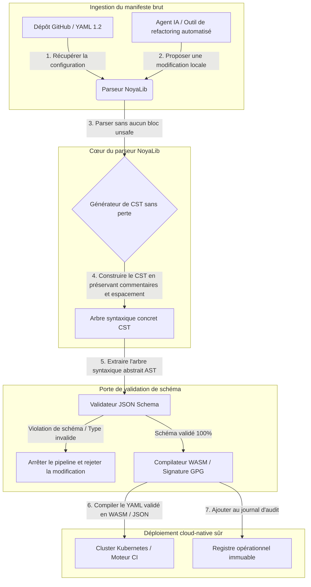

---

# Front Matter (YAML)

author: "contact@sebastienrousseau.com (Sebastien Rousseau)"
banner_alt: "Géométrie architecturale sous une lumière spectaculaire — symbolisant le rôle porteur de NoyaLib comme parseur YAML Rust sûr sous CI, Kubernetes, MCP et la configuration des services financiers"
banner_height: "1597"
banner_width: "2584"
banner: "https://cloudcdn.pro/stocks/images/ken-cheung-KonWFWUaAuk.webp"
cdn: "https://cloudcdn.pro"
charset: "UTF-8"
cname: "sebastienrousseau.com"
copyright: "© Copyright 2025 - 2026 - Sebastien Rousseau. All rights reserved."
date: "June 18, 2026"
description: "NoyaLib, parseur YAML 1.2 en Rust zéro-unsafe — 406/406 de conformité, validation JSON Schema, CST sans perte et bindings MCP/WASM pour l'infrastructure financière."
format-detection: "telephone=no"
hreflang: "fr"
icon: "https://cloudcdn.pro/clients/sebastienrousseau/v1/logos/sebastienrousseau.svg"
id: "https://sebastienrousseau.com/2026-06-18-noyalib-safe-yaml-rust-ai-mcp-financial-infrastructure-2026"
image_alt: "Portrait en noir et blanc de Sebastien Rousseau"
image_height: "162"
image_width: "162"
image: "https://cloudcdn.pro/stocks/images/sebastienrousseau.webp"
keywords: "parseur YAML Rust plus sûr, NoyaLib, conformité spec YAML 1.2, Rust zéro-unsafe, validation JSON Schema, arbre syntaxique concret sans perte, CST, MCP, Model Context Protocol, WebAssembly, manifestes Kubernetes, configuration CI/CD, DORA article 5, BCBS 239, risque opérationnel Basel III, infrastructure financière, sécurité de la configuration, chaîne d'approvisionnement logicielle"
language: "fr-FR"
last_reviewed: "2026-06-18"
layout: "report"
locale: "fr_FR"
logo_alt: "Logo de Sebastien Rousseau"
logo_height: "44"
logo_width: "44"
logo: "https://cloudcdn.pro/clients/sebastienrousseau/v1/logos/sebastienrousseau.svg"
menu: ""
measurementID: "G-169G4ET5HQ"
name: "Sebastien Rousseau"
permalink: "https://sebastienrousseau.com/2026-06-18-noyalib-safe-yaml-rust-ai-mcp-financial-infrastructure-2026"
rating: "general"
referrer: "no-referrer"
robots: "index, follow"
schema: "FAQPage, Article"
seo_title: "NoyaLib : parseur YAML Rust sûr pour l'IA, MCP et la finance"
short_name: "sebastienrousseau"
subtitle: "Une pile YAML Rust plus sûre — NoyaLib — transforme YAML 1.2 d'un balisage de confort en plan de contrôle de configuration conforme à la spécification, cryptographiquement sûr, pour les agents IA, MCP, Kubernetes et l'infrastructure des services financiers."
tags: "parseur YAML Rust plus sûr, NoyaLib, YAML 1.2, Rust zéro-unsafe, JSON Schema, MCP, WebAssembly, Kubernetes, DORA, BCBS 239, Basel III, infrastructure financière, sécurité de la chaîne d'approvisionnement"
theme-color: "0, 83, 191"
title: "Pourquoi YAML exige une pile Rust plus sûre pour l'IA, MCP et l'infrastructure financière en 2026"
url: "https://sebastienrousseau.com/2026-06-18-noyalib-safe-yaml-rust-ai-mcp-financial-infrastructure-2026"
viewport: "width=device-width, initial-scale=1, shrink-to-fit=no"

# RSS - The RSS feed front matter (YAML).
atom_link: "https://sebastienrousseau.com/2026-06-18-noyalib-safe-yaml-rust-ai-mcp-financial-infrastructure-2026/rss.xml"
category: "Technology"
docs: https://validator.w3.org/feed/docs/rss2.html
generator: "Static Site Generator (SSG) (version 0.0.26)"
item_description: "NoyaLib, parseur YAML 1.2 en Rust zéro-unsafe — 406/406 de conformité, validation JSON Schema, CST sans perte et bindings MCP/WASM pour l'infrastructure financière."
item_guid: "https://sebastienrousseau.com/2026-06-18-noyalib-safe-yaml-rust-ai-mcp-financial-infrastructure-2026/rss.xml"
item_link: "https://sebastienrousseau.com/2026-06-18-noyalib-safe-yaml-rust-ai-mcp-financial-infrastructure-2026/rss.xml"
item_pub_date: "Thu, 18 Jun 2026 06:06:06 +0000"
item_title: "Pourquoi YAML exige une pile Rust plus sûre pour l'IA, MCP et l'infrastructure financière en 2026"
last_build_date: "Thu, 18 Jun 2026 06:06:06 +0000"
managing_editor: "contact@sebastienrousseau.com (Sebastien Rousseau)"
pub_date: "Thu, 18 Jun 2026 06:06:06 +0000"
ttl: "60"
type: "article"
webmaster: "contact@sebastienrousseau.com"

# Apple - The Apple front matter (YAML).
apple_mobile_web_app_orientations: "portrait"
apple_touch_icon_sizes: "192x192"
apple-mobile-web-app-capable: "yes"
apple-mobile-web-app-status-bar-inset: "black"
apple-mobile-web-app-status-bar-style: "black-translucent"
apple-mobile-web-app-title: "NoyaLib : parseur YAML Rust sûr"
apple-touch-fullscreen: "yes"

# MS Application - The MS Application front matter (YAML).

msapplication-navbutton-color: "0, 83, 191"

# Twitter Card - The Twitter Card front matter (YAML).

twitter_card: "summary_large_image"
twitter_creator: "@wwdseb"
twitter_description: "NoyaLib, parseur YAML 1.2 en Rust zéro-unsafe — 406/406 de conformité, validation JSON Schema, CST sans perte et bindings MCP/WASM pour l'infrastructure financière."
twitter_image: "https://cloudcdn.pro/clients/sebastienrousseau/v1/logos/sebastienrousseau.svg"
twitter_image_alt: "Logo de Sebastien Rousseau"
twitter_site: "@wwdseb"
twitter_title: "NoyaLib : parseur YAML Rust sûr pour l'IA, MCP et la finance"
twitter_url: "https://sebastienrousseau.com/2026-06-18-noyalib-safe-yaml-rust-ai-mcp-financial-infrastructure-2026"

excerpt: "NoyaLib est une pile YAML en Rust plus sûre — zéro bloc unsafe, 406/406 de conformité à la spécification YAML 1.2, arbre syntaxique concret (CST) sans perte, validation JSON Schema (Draft 2020-12) et bindings MCP/WASM — conçue pour les agents IA, Kubernetes, CI/CD et le plan de contrôle de configuration derrière l'infrastructure financière."

# Humans.txt - The Humans.txt front matter (YAML).
author_website: "https://sebastienrousseau.com"
author_twitter: "@wwdseb"
author_location: "London, UK"
thanks: "Merci de votre lecture !"
site_last_updated: "2026-06-18"
site_standards: "HTML5, CSS3, RSS, Atom, JSON, XML, YAML, Markdown, TOML"
site_components: "Kaishi, Kaishi Builder, Kaishi CLI, Kaishi Templates, Kaishi Themes"
site_software: "Static Site Generator, Rust"

---

# Pourquoi YAML exige une pile Rust plus sûre pour l'IA, MCP et l'infrastructure financière en 2026

Une pile YAML en Rust plus sûre s'impose parce que YAML porte désormais les pipelines CI/CD, les manifestes Kubernetes, les règles [Open Policy Agent](https://www.openpolicyagent.org/) et les registres d'outils Model Context Protocol (MCP) — et un seul parse ambigu peut casser un système de compensation, mal configurer un groupe de sécurité ou octroyer à un agent IA local les mauvaises permissions. [NoyaLib](https://github.com/sebastienrousseau/noyalib) est un écosystème de parsing et de validation [YAML 1.2](https://yaml.org/spec/1.2.2/), pur Rust et zéro-unsafe, conçu pour rendre cette infrastructure sûre par défaut.

## En bref

**Qu'est-ce que NoyaLib en une phrase ?** NoyaLib est un écosystème open source de parsing et de validation YAML 1.2, en pur Rust, sans aucun code `unsafe`, avec 100 % de conformité à la spécification sur la suite officielle de 406 tests YAML, un arbre syntaxique concret (CST) sans perte et une validation [JSON Schema](https://json-schema.org/) en temps réel — conçu pour sécuriser par défaut la configuration des agents IA, de MCP, de Kubernetes et de l'infrastructure financière.

## Synthèse exécutive

YAML paraît anodin jusqu'à ce qu'un parse ambigu ou une violation de schéma fasse tomber un système de compensation de production à plusieurs milliards de dollars. En 2026, YAML est devenu le standard de facto des pipelines [CI/CD](https://docs.github.com/en/actions/learn-github-actions/workflow-syntax-for-github-actions), des manifestes [Kubernetes](https://kubernetes.io/docs/concepts/configuration/overview/), des règles [Open Policy Agent](https://www.openpolicyagent.org/) et des registres d'outils Model Context Protocol (MCP). Les parseurs hérités opaques — assortis de vulnérabilités mémoire et de parsing destructif — constituent un risque de sécurité inacceptable. NoyaLib est un écosystème YAML 1.2 en pur Rust, zéro-unsafe : 100 % de conformité sur les 406 tests officiels de la suite, un arbre syntaxique concret (CST) sans perte qui préserve commentaires et espacement, et une validation JSON Schema intégrée. Résultat : YAML redevient un plan de contrôle de configuration auditable, sûr et accessible aux agents.

## Points clés à retenir

- **La configuration est du code de production.** Un seul fichier YAML mal formé peut mal configurer des groupes de sécurité cloud-native ou les permissions d'un agent IA. NoyaLib traite YAML comme une infrastructure critique.
- **Conception zéro-unsafe.** Bâti intégralement en Rust sûr, sans aucun bloc `unsafe`, NoyaLib élimine les vulnérabilités de sécurité mémoire — débordements de tampon, exécution de code à distance — dans les couches de parsing centrales.
- **Conformité absolue 406/406 à la spécification.** Valide mathématiquement les structures de configuration, éliminant les écarts de parsing et les dérives structurelles entre environnements de préproduction et de production.
- **Arbre syntaxique concret sans perte.** Contrairement aux parseurs hérités qui suppriment commentaires et mise en forme, NoyaLib préserve espacement et annotations, permettant un refactoring automatisé aller-retour sûr par les agents IA.
- **Valeur fiduciaire au niveau du conseil.** Relie l'intégrité de la configuration aux métriques de capital pour risque opérationnel de l'[article 5 de DORA](https://eur-lex.europa.eu/legal-content/EN/TXT/?uri=CELEX%3A32022R2554) et de [Basel III](https://www.bis.org/bcbs/publ/d424.htm), protégeant directement la direction générale contre la responsabilité personnelle.

**Lectures complémentaires :** [KyberLib et la migration bancaire post-quantique en 2026 : des standards au code](https://sebastienrousseau.com/2026-06-12-kyberlib-post-quantum-banking-migration-standards-code-2026/), [L'indice du banking cloud natif en 2026 : DORA, ingénierie de plateforme, cloud souverain et résilience opérationnelle](https://sebastienrousseau.com/2026-06-05-cloud-native-banking-index-dora-resilience-platform-engineering-2026/), [Dotfiles AI-aware en 2026 : bâtir un poste de travail développeur sûr et reproductible pour MCP, SLSA et la parité multi-shell](https://sebastienrousseau.com/2026-06-16-ai-aware-dotfiles-secure-reproducible-workstation-2026/).

## 01. Pourquoi une pile YAML Rust plus sûre compte en 2026

En juin 2026, les infrastructures IT d'entreprise sont fortement distribuées et de plus en plus automatisées.

YAML est silencieusement devenu le langage de configuration porteur de l'ensemble de la pile d'ingénierie logicielle. Il porte les workflows d'intégration continue (CI) qui compilent les artefacts de production, les manifestes [Kubernetes](https://kubernetes.io/docs/concepts/overview/) qui orchestrent les clusters cloud-native mondiaux, et les schémas de serveurs [Model Context Protocol](https://modelcontextprotocol.io/) (MCP) qui autorisent les agents IA locaux à exécuter des opérations locales.

Les parseurs YAML hérités — [PyYAML](https://pyyaml.org/), [yaml-cpp](https://github.com/jbeder/yaml-cpp), [libyaml](https://github.com/yaml/libyaml) — portent deux risques structurels :

1. **Vulnérabilités de coercition de type (le « problème norvégien »).** Les parseurs hérités convertissent souvent des chaînes non quotées (le code pays `NO` en booléen `false`, `yes`/`no` de même) — voir le [tag booléen YAML 1.1 vs 1.2](https://yaml.org/type/bool.html) — provoquant des défaillances systémiques critiques ou des mauvaises configurations de sécurité silencieuses.
2. **Exploits de sécurité mémoire.** Les parseurs opaques écrits en C/C++ souffrent de fuites mémoire et d'exploits par débordement de tampon, susceptibles d'aboutir à une exécution de code à distance (RCE) sur les serveurs de build centraux.

[NoyaLib](https://github.com/sebastienrousseau/noyalib) répond à ces défis. C'est un écosystème de parsing et de validation YAML 1.2, en pur Rust et zéro-unsafe. En atteignant une conformité absolue de 406/406 à la spécification et en imposant une validation JSON Schema stricte directement pendant le parse, NoyaLib délivre un **Return on Resilience (RoR)** élevé — prévenant les interruptions induites par la configuration et sécurisant les chaînes d'approvisionnement logicielles de qualité financière.

## 02. Le prisme d'architecture NoyaLib 2026

L'écosystème NoyaLib opère comme un parseur de configuration sûr et sans perte. Chaque manifeste local et cloud est structurellement validé et protégé à la couche d'exécution la plus basse.

### Tableau 1 : couches d'architecture NoyaLib et atténuation des risques

| Couche | Décision de conception | Pourquoi cela compte | Risque en cas de mauvaise gestion |
| ---- | ---- | ---- | ---- |
| **Couche parseur** | Parseur conforme YAML 1.2, pur Rust, sans aucun bloc `unsafe` | Élimine les vulnérabilités de sécurité mémoire et les débordements de tampon à la couche d'exécution la plus basse. | Exécution de code à distance (RCE) sur les serveurs de build centraux. |
| **Couche de conformité** | 100 % de conformité aux 406/406 tests officiels de la suite YAML 1.2 | Élimine les écarts de parsing et les dérives de coercition de type entre préproduction et production. | Erreurs de coercition de type « problème norvégien » désactivant des groupes de sécurité. |
| **Couche arbre syntaxique** | Arbre syntaxique concret (CST) sans perte | Préserve commentaires, espacement et ordonnancement lors du parse aller-retour et du refactoring programmatique. | Refactoring IA automatisé détruisant les annotations des développeurs. |
| **Couche de validation** | Validation [JSON Schema (Draft 2020-12)](https://json-schema.org/draft/2020-12/release-notes) pendant le parsing | Impose des modèles de données stricts sur les fichiers de configuration avant qu'ils n'atteignent les clusters de production. | Fichiers de configuration mal formés provoquant l'effondrement des clusters cloud-native. |
| **Couche d'interface** | Bindings WebAssembly (WASM) et MCP | Permet à la validation de configuration de s'exécuter directement dans les navigateurs, les nœuds edge et les toolkits d'agents locaux. | Silos d'outillage où la validation ne peut s'exécuter sur les équipements edge. |

## 03. Signaux clés de sécurité du poste de travail et de la configuration

Pour maintenir une sécurité absolue à travers le parc de développement et d'exploitation, les Chief Information Security Officers (CISO) doivent surveiller des métriques précises et quantifiables.

### Tableau 2 : signaux de sécurité du poste de travail et de la configuration

| Signal | Métrique / référence opérationnelle | Référence NIST CSF / DORA | Mise en œuvre sur la plateforme technique |
| ---- | ---- | ---- | ---- |
| **Conformité du parseur** | 100 % de réussite sur la suite officielle de tests YAML 1.2 (406/406 tests). | [DORA article 6](https://eur-lex.europa.eu/legal-content/EN/TXT/?uri=CELEX%3A32022R2554) (sécurité TIC) | Cœur de parseur NoyaLib validant tous les manifestes avant l'exécution CI. |
| **Profil de sécurité mémoire** | Zéro bloc `unsafe` Rust dans les dépendances de parseur et de sérialiseur. | DORA article 30 (chaîne d'approvisionnement) | Vérifications automatisées du compilateur ([`forbid(unsafe_code)`](https://doc.rust-lang.org/reference/attributes/diagnostics.html#the-forbid-attribute)) dans les builds cargo. |
| **Validation de schéma** | 100 % des fichiers de configuration parsés vérifiés contre des modèles [JSON Schema](https://json-schema.org/) valides. | [NIST CSF 2.0](https://www.nist.gov/cyberframework) (PR.DS-01) | Porte de validation temps réel stoppant les pipelines de build en cas de violation de schéma. |
| **Dérive de configuration** | Détection et restauration temps réel des fichiers de configuration locaux vers l'état git versionné. | Return on Resilience (RoR) | Télémétrie continue consignant toutes les modifications de fichiers locaux. |
| **Contrôle d'accès des agents** | Permissions bornées et en lecture seule pour les outils IA locaux opérant via des configurations MCP. | Gestion du risque modèle ([SR 11-7](https://www.federalreserve.gov/supervisionreg/srletters/sr1107.htm)) | Frontières des serveurs MCP restreignant les opérations des agents aux répertoires approuvés. |

## 04. Le sophisme du parsing de configuration opaque

Une vulnérabilité majeure des opérations cloud-native est le *parsing opaque* — recourir à des parseurs qui suppriment les métadonnées structurelles (commentaires, espaces, ordre des documents) ou convertissent silencieusement les types pendant la compilation. Ce comportement introduit deux risques de sécurité sévères :

1. **Refactoring destructif.** Lorsqu'un assistant de code IA ou un outil de refactoring automatisé met à jour un manifeste de déploiement, les parseurs traditionnels suppriment commentaires et mise en forme des développeurs, détruisant le contexte nécessaire aux revues humaines et à la criminalistique post-incident.
2. **Écarts de parsing.** Si un environnement de préproduction utilise un parseur Python et la production un parseur C, des différences mineures de conformité à la spécification YAML 1.2 peuvent faire échouer un manifeste valide en préproduction ou le faire se comporter différemment en production, créant des vulnérabilités de sécurité cachées.

L'**arbre syntaxique concret (CST) sans perte** de NoyaLib résout ce problème. Il préserve chaque espace, commentaire et ligne de document durant la boucle parse-sérialise. Les assistants IA automatisés peuvent éditer, refactoriser et committer des fichiers de configuration tout en préservant 100 % des annotations rédigées par les humains — une piste d'audit absolue.

## 05. Concevoir un pipeline de configuration IA borné

Pour empêcher que des modifications de configuration malveillantes n'atteignent les environnements de production, l'organisation doit mettre en œuvre un pipeline de configuration strictement borné et validé par schéma.

Le flux opérationnel ci-dessous montre comment NoyaLib parse le YAML brut, construit un CST sans perte, valide l'AST contre un modèle JSON Schema et compile des bindings WebAssembly pour les environnements navigateur ou edge.

## 06. Le playbook du conseil et la responsabilité fiduciaire

La sécurité de la configuration et l'intégrité de la chaîne d'approvisionnement logicielle sont des priorités critiques de conseil. Les dirigeants doivent aborder la gestion de la configuration sous l'angle du devoir fiduciaire et de la résilience opérationnelle.

- **DORA article 5 (responsabilité du conseil).** Dispose que le conseil assume une responsabilité ultime et non délégable dans la gestion du risque TIC de l'institution. Parce que les fichiers de configuration contrôlent les groupes de sécurité cloud-native critiques et les chemins de routage des paiements, les conseils doivent vérifier que les systèmes qui parsent ces manifestes sont sûrs en mémoire et pleinement conformes à la spécification, afin de satisfaire les audits réglementaires. ([Règlement (UE) 2022/2554](https://eur-lex.europa.eu/legal-content/EN/TXT/?uri=CELEX%3A32022R2554))
- **BCBS 239 (agrégation et reporting des données de risque).** Exige que le reporting de risque et les métriques d'infrastructure soient exacts, complets et produits sous des contrôles stricts de qualité des données. NoyaLib soutient BCBS 239 en parsant et validant les fichiers de configuration contre des schémas stricts à la source, prévenant la fuite silencieuse de données ou les pannes induites par mauvaise configuration. ([Standard BCBS 239](https://www.bis.org/publ/bcbs239.htm))
- **Atténuation des exigences de capital pour risque opérationnel (Basel III).** Les pannes induites par la configuration gonflent directement les exigences de capital pour risque opérationnel sous Basel III, immobilisant le capital bilanciel. Standardiser la pile de configuration d'entreprise sur un parseur sûr en pur Rust comme NoyaLib minimise ce risque, préservant le capital et protégeant la confiance des clients. ([Standards Basel III](https://www.bis.org/bcbs/publ/d424.htm))

## 07. Ce que cela signifie selon le type de banque

### Banques d'importance systémique mondiale (G-SIB)

Les G-SIB gèrent des milliers de microservices et de pipelines de déploiement à travers de multiples juridictions. Leur principal défi est de maintenir la cohérence de la configuration et de prévenir la dérive de sécurité sur des parcs cloud-native massifs. Standardiser sur une pile YAML Rust plus sûre comme NoyaLib garantit que tous les manifestes Kubernetes, pipelines CI/CD et politiques de sécurité sont parsés et validés sous un cadre uniforme et sûr en mémoire — éliminant le risque de configurations « flocon de neige » non auditées.

### Banques transactionnelles et corporate

Les banques transactionnelles opèrent des passerelles de paiement sensibles et des infrastructures de compensation de gros. Prouver la sécurité absolue du code et de la configuration déployés dans ces environnements de production est une exigence réglementaire non négociable. Intégrer NoyaLib garantit que la chaîne d'approvisionnement logicielle est pleinement auditée, sans perte et protégée contre les vulnérabilités de parsing — un contrôle qui se mappe proprement à l'article 6 de DORA et à la section 6 de [PCI DSS v4.0](https://www.pcisecuritystandards.org/document_library/).

### Banques régionales et de plus petite taille

Les banques régionales doivent maintenir des standards de cybersécurité élevés sans disposer de budgets technologiques à l'échelle des G-SIB. Le cadre open source NoyaLib fournit une solution légère, économique et hautement sûre, compatible Rust, permettant aux plus petites institutions de mettre en œuvre une sécurité de configuration et une protection de la chaîne d'approvisionnement de niveau entreprise sans frais de licence propriétaire.

## 08. Conclusion : la feuille de route de la sécurité de la configuration

Le poste de travail développeur et les configurations d'infrastructure cloud-native sont des plans de contrôle critiques de la chaîne d'approvisionnement logicielle. Laisser des fichiers de configuration non audités, ambigus ou non sûrs atteindre les actifs corporate est un risque opérationnel et réglementaire inacceptable.

Pour sécuriser la chaîne d'approvisionnement logicielle et protéger les endpoints des vulnérabilités de configuration, les responsables technologie et sécurité doivent exécuter dès aujourd'hui une feuille de route de développement claire :

1. **Imposer la configuration déclarative.** Sortir progressivement les ajustements de configuration manuels et non audités, et imposer que tous les manifestes soient gérés comme un système d'enregistrement déclaratif et versionné.
2. **Imposer la validation de schéma.** Mettre en place des hooks de pré-commit stricts et des utilitaires de scan pour garantir que tous les fichiers de configuration sont validés contre des modèles JSON Schema valides avant déploiement.
3. **Mettre en œuvre l'aller-retour sans perte.** Veiller à ce que tous les assistants de code IA et outils de refactoring automatisés utilisent un parsing sans perte pour préserver commentaires, espacement et contexte développeur.
4. **Sécuriser la chaîne d'approvisionnement.** Veiller à ce que tous les paramétrages de configuration et utilitaires de parsing soient vérifiés cryptographiquement à l'aide de bibliothèques en pur Rust, zéro-unsafe, comme NoyaLib avant exécution. ([Cadre SLSA](https://slsa.dev/))

## 09. Foire aux questions

**Qu'est-ce que NoyaLib et pourquoi est-il utilisé pour le parsing YAML ?**
NoyaLib est un parseur YAML 1.2 open source, en pur Rust et zéro-unsafe. Il atteint 100 % de conformité à la spécification sur la suite officielle de 406 tests, impose une validation [JSON Schema](https://json-schema.org/) stricte pendant le parsing et expose des bindings WASM et [MCP](https://modelcontextprotocol.io/) — ce qui en fait une pile YAML Rust plus sûre pour les agents IA, Kubernetes et l'infrastructure financière.

**Pourquoi la conception zéro-unsafe est-elle importante pour le parsing de configuration ?**
Les vulnérabilités de sécurité mémoire — débordements de tampon, use-after-free — au sein des parseurs hérités écrits en C/C++ peuvent conduire à une exécution de code à distance sur les serveurs de build centraux. La conception en pur Rust de NoyaLib avec [`#![forbid(unsafe_code)]`](https://doc.rust-lang.org/reference/attributes/diagnostics.html#the-forbid-attribute) élimine mathématiquement ces vulnérabilités à la compilation.

**Qu'est-ce qu'un arbre syntaxique concret (CST) sans perte et pourquoi cela compte-t-il ?**
Les parseurs traditionnels suppriment commentaires et mise en forme, rendant destructrices les éditions automatisées par les agents IA. Le CST sans perte de NoyaLib préserve chaque commentaire, espace et ligne de document — les assistants IA peuvent ainsi éditer et refactoriser des fichiers de configuration en toute sûreté, tout en conservant intacts le contexte développeur, la criminalistique post-incident et la piste d'audit.

**Comment NoyaLib se mappe-t-il à DORA, BCBS 239 et Basel III ?**
L'article 5 de DORA place la responsabilité du risque TIC sur le conseil ; BCBS 239 exige des contrôles de qualité des données sur le reporting de risque ; Basel III taxe le capital pour risque opérationnel. NoyaLib fournit la couche de parse validée par schéma et sûre en mémoire qu'exigent ces réglementations pour la configuration en tant que code — rendant le mapping réglementaire direct et la charge en capital pour risque opérationnel plus faible.

## 10. Références

- **YAML, (2026).** *Spécification YAML 1.2*. Disponible sur : [Spécification YAML 1.2](https://yaml.org/spec/1.2.2/).
- **JSON Schema, (2026).** *Notes de version JSON Schema Draft 2020-12*. Disponible sur : [JSON Schema Draft 2020-12](https://json-schema.org/draft/2020-12/release-notes).
- **Parlement européen et Conseil de l'Union européenne, (2022).** *Règlement (UE) 2022/2554 sur la résilience opérationnelle numérique du secteur financier (DORA)*. Bruxelles : Journal officiel de l'Union européenne. Disponible sur : [Règlement DORA](https://eur-lex.europa.eu/legal-content/EN/TXT/?uri=CELEX%3A32022R2554).
- **Comité de Bâle sur le contrôle bancaire, (2013).** *Principes aux fins de l'agrégation des données sur les risques et de la notification des risques (BCBS 239)*. Bâle : Banque des règlements internationaux. Disponible sur : [Standard BCBS 239](https://www.bis.org/publ/bcbs239.htm).
- **Comité de Bâle sur le contrôle bancaire, (2017).** *Basel III : finalisation des réformes de l'après-crise*. Bâle : Banque des règlements internationaux. Disponible sur : [Standards Basel III](https://www.bis.org/bcbs/publ/d424.htm).
- **Anthropic, (2025).** *Spécification Model Context Protocol (MCP)*. Disponible sur : [Model Context Protocol](https://modelcontextprotocol.io/).
- **GitHub, (2026).** *Dépôt open source noyalib*. Disponible sur : [Dépôt NoyaLib](https://github.com/sebastienrousseau/noyalib).
