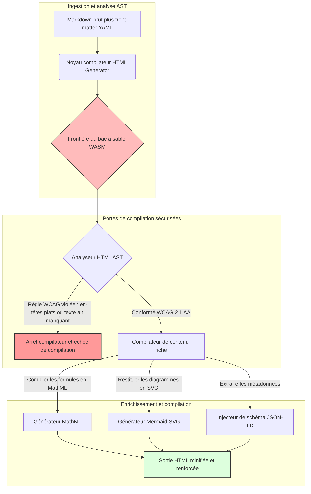

---

# Front Matter (YAML)

author: "contact@sebastienrousseau.com (Sebastien Rousseau)"
banner_alt: "Géométrie architecturale sous lumière structurée — symbolisant le rôle de HTML Generator en tant que pipeline Markdown-vers-HTML à contrôle compilateur pour une infrastructure éditoriale accessible, optimisée SEO et isolée"
banner_height: "1597"
banner_width: "2584"
banner: "https://cloudcdn.pro/api/transform?url=/stocks/images/markus-winkler-IrRbSND5EUc-unsplash.webp&w=1200&format=webp&q=80"
cdn: "https://cloudcdn.pro"
charset: "UTF-8"
cname: "sebastienrousseau.com"
copyright: "© Copyright 2025 - 2026 - Sebastien Rousseau. All rights reserved."
date: "June 20, 2026"
description: "HTML Generator est une bibliothèque Rust qui convertit Markdown en HTML conforme WCAG, optimisé SEO et enrichi JSON-LD — accessibilité-par-le-code, prise en charge MathML et Mermaid, exécution isolée WebAssembly pour une publication d'entreprise sécurisée."
format-detection: "telephone=no"
hreflang: "fr"
icon: "https://cloudcdn.pro/clients/sebastienrousseau/v1/logos/sebastienrousseau.svg"
id: "https://sebastienrousseau.com/2026-06-20-html-generator-accessible-seo-structured-markdown-rust-2026"
image_alt: "Portrait en noir et blanc de Sebastien Rousseau"
image_height: "162"
image_width: "162"
image: "https://cloudcdn.pro/stocks/images/sebastien-rousseau.png"
keywords: "html-generator, Rust Markdown vers HTML, accessibilité par le code, WCAG 2.1 AA, HTML optimisé SEO, JSON-LD, MathML, Mermaid, WebAssembly, EAA, DORA, ADA Title III, publication accessible, analyse en bac à sable, open source"
language: "fr-FR"
last_reviewed: "2026-06-20"
layout: "report"
locale: "fr_FR"
logo_alt: "Logo de Sebastien Rousseau"
logo_height: "44"
logo_width: "44"
logo: "https://cloudcdn.pro/clients/sebastienrousseau/v1/logos/sebastienrousseau.svg"
menu: ""
measurementID: "G-169G4ET5HQ"
name: "Sebastien Rousseau"
permalink: "https://sebastienrousseau.com/2026-06-20-html-generator-accessible-seo-structured-markdown-rust-2026"
rating: "general"
referrer: "no-referrer"
robots: "index, follow"
schema: "FAQPage, Article"
seo_title: "Accessibilité-par-le-code : Markdown vers HTML AAA avec Rust en 2026"
short_name: "sebastienrousseau"
subtitle: "Transformer la publication web d'entreprise, la documentation produit et les portails clients depuis des fichiers texte inaccessibles vers des actifs numériques hautement structurés, conformes et isolés."
tags: "html-generator, Rust, Markdown, accessibilité, WCAG, SEO, JSON-LD, MathML, Mermaid, WebAssembly, EAA, DORA, ADA, découverte-IA, RAG, open source, infrastructure bancaire"
theme-color: "0, 83, 191"
title: "Convertir Markdown en HTML Accessible, Optimisé SEO et Structuré avec Rust en 2026"
url: "https://sebastienrousseau.com/2026-06-20-html-generator-accessible-seo-structured-markdown-rust-2026"
viewport: "width=device-width, initial-scale=1, shrink-to-fit=no"

# RSS - The RSS feed front matter (YAML).
atom_link: "https://sebastienrousseau.com/2026-06-20-html-generator-accessible-seo-structured-markdown-rust-2026/rss.xml"
category: "Technology"
docs: https://validator.w3.org/feed/docs/rss2.html
generator: "Static Site Generator (SSG) (version 0.0.40)"
item_description: "HTML Generator est une bibliothèque Rust qui convertit Markdown en HTML conforme WCAG, optimisé SEO et enrichi JSON-LD — accessibilité-par-le-code, prise en charge MathML et Mermaid, exécution isolée WebAssembly pour une publication d'entreprise sécurisée."
item_guid: "https://sebastienrousseau.com/2026-06-20-html-generator-accessible-seo-structured-markdown-rust-2026/rss.xml"
item_link: "https://sebastienrousseau.com/2026-06-20-html-generator-accessible-seo-structured-markdown-rust-2026/rss.xml"
item_pub_date: "Sat, 20 Jun 2026 06:06:06 +0000"
item_title: "Convertir Markdown en HTML Accessible, Optimisé SEO et Structuré avec Rust en 2026"
last_build_date: "Sat, 20 Jun 2026 06:06:06 +0000"
managing_editor: "contact@sebastienrousseau.com (Sebastien Rousseau)"
pub_date: "Sat, 20 Jun 2026 06:06:06 +0000"
ttl: "60"
type: "article"
webmaster: "contact@sebastienrousseau.com"

# Apple - The Apple front matter (YAML).
apple_mobile_web_app_orientations: "portrait"
apple_touch_icon_sizes: "192x192"
apple-mobile-web-app-capable: "yes"
apple-mobile-web-app-status-bar-inset: "black"
apple-mobile-web-app-status-bar-style: "black-translucent"
apple-mobile-web-app-title: "Markdown vers HTML AAA avec Rust"
apple-touch-fullscreen: "yes"

# MS Application - The MS Application front matter (YAML).

msapplication-navbutton-color: "0, 83, 191"

# Twitter Card - The Twitter Card front matter (YAML).

twitter_card: "summary_large_image"
twitter_creator: "@wwdseb"
twitter_description: "HTML Generator est une bibliothèque Rust qui convertit Markdown en HTML conforme WCAG, optimisé SEO et enrichi JSON-LD — accessibilité-par-le-code, prise en charge MathML et Mermaid, exécution isolée WebAssembly pour une publication d'entreprise sécurisée."
twitter_image: "https://cloudcdn.pro/clients/sebastienrousseau/v1/logos/sebastienrousseau.svg"
twitter_image_alt: "Logo de Sebastien Rousseau"
twitter_site: "@wwdseb"
twitter_title: "Accessibilité-par-le-code : Markdown vers HTML AAA avec Rust"
twitter_url: "https://sebastienrousseau.com/2026-06-20-html-generator-accessible-seo-structured-markdown-rust-2026"

# Humans.txt - The Humans.txt front matter (YAML).
author_website: "https://sebastienrousseau.com"
author_twitter: "@wwdseb"
author_location: "London, UK"
thanks: "Merci pour votre lecture !"
site_last_updated: "2026-06-20"
site_standards: "HTML5, CSS3, RSS, Atom, JSON, XML, YAML, Markdown, TOML"
site_components: "Kaishi, Kaishi Builder, Kaishi CLI, Kaishi Templates, Kaishi Themes"
site_software: "Static Site Generator, Rust"

---

# Convertir Markdown en HTML Accessible, Optimisé SEO et Structuré avec Rust en 2026

<!-- lead-start -->
<aside class="post-lead" aria-label="Résumé de l'article">

<strong>En bref.</strong> HTML Generator est un compilateur Markdown-vers-HTML en Rust pur qui applique WCAG 2.1 AA à la compilation, injecte du JSON-LD conforme aux schémas, restitue nativement MathML et Mermaid SVG, et isole l'analyse syntaxique dans un bac à sable WebAssembly — transformant la publication en un plan de contrôle à porte compilateur pour l'accessibilité, le SEO et la sécurité ICT.

<strong>Points clés</strong>

<ul class="post-lead-takeaways">
  <li><strong>Réponse rapide.</strong> Qu'est-ce que HTML Generator en une phrase ?</li>
  <li><strong>Résumé exécutif.</strong> Le rendu Markdown paraît trivial ; produire un HTML de qualité éditoriale est un problème de conformité.</li>
  <li><strong>01. Pourquoi un compilateur HTML axé accessibilité est essentiel en 2026.</strong> L'EAA et l'ADA Title III ont fait de l'accessibilité une responsabilité fiduciaire, et non plus une simple bonne pratique d'ingénierie.</li>
  <li><strong>02. L'architecture de HTML Generator en 2026.</strong> Un pipeline de compilation multi-étapes, à porte compilateur, depuis du Markdown brut vers une sortie HTML renforcée.</li>
</ul>

<strong>Lectures associées :</strong> <a href="https://sebastienrousseau.com/2026-06-18-noyalib-safe-yaml-rust-ai-mcp-financial-infrastructure-2026">Pourquoi YAML a besoin d'une pile Rust plus sûre pour l'IA, MCP et l'infrastructure financière en 2026</a>, <a href="https://sebastienrousseau.com/2026-06-17-static-site-generator-secure-default-ai-era-publishing-2026">Un générateur de sites statiques sécurisé par défaut pour la publication à l'ère de l'IA en 2026</a>, <a href="https://sebastienrousseau.com/2026-06-11-cloudcdn-open-source-blueprint-ai-native-edge-2026">CloudCDN : un modèle open source pour le réseau périphérique cloud-natif en 2026</a>.

</aside>
<!-- lead-end -->

En 2026, le contenu web est autant consommé par des robots d'exploration de recherche IA, des moteurs de recherche adossés à des LLM et des pipelines de Retrieval-Augmented Generation (RAG) que par des lecteurs humains. Un HTML plat ou malformé compromet la découvrabilité machine, tandis que le non-respect des réglementations mondiales strictes comme l'[European Accessibility Act (EAA)](https://www.accessibility-act.eu/) et l'[ADA Title III](https://www.ada.gov/topics/title-iii/) américaine constitue désormais une responsabilité civile avérée. [HTML Generator](https://github.com/sebastienrousseau/html-generator) est une bibliothèque Rust haute performance conçue pour combler ces lacunes — au niveau du compilateur, et non dans des correctifs post-déploiement.

## Réponse rapide

**Qu'est-ce que HTML Generator en une phrase ?** HTML Generator est un compilateur open source, en Rust pur, de Markdown vers HTML, qui applique [WCAG 2.1 AA](https://www.w3.org/TR/WCAG21/) à la compilation, génère automatiquement des points de repère sémantiques et des attributs ARIA, injecte des métadonnées [JSON-LD](https://json-ld.org/) conformes aux schémas depuis le front matter YAML, restitue les diagrammes Mermaid et les formules mathématiques en SVG accessible et MathML, et s'exécute dans un bac à sable [WebAssembly](https://webassembly.org/) — transformant la publication d'entreprise en un plan de contrôle à porte compilateur, de qualité fiduciaire.

## Résumé exécutif

Le rendu Markdown paraît trivial. Un HTML de qualité éditoriale est un problème de conformité. En juin 2026, chaque point de contact d'entreprise — portails relations investisseurs, dépôts réglementaires, documentation client, références API, propriétés marketing — est analysé par des humains et des machines. Deux pressions convergent sur chaque page : l'[EAA](https://www.accessibility-act.eu/) et l'[ADA Title III](https://www.ada.gov/topics/title-iii/) font de l'accessibilité une exposition juridique au niveau du conseil d'administration, tandis que l'ingestion IA et les pipelines RAG récompensent les sorties structurées et lisibles par les machines. Les bibliothèques Markdown standard produisent un HTML plat qui échoue aux deux contrôles. HTML Generator traite la génération de documents comme un pipeline à porte compilateur : la validation WCAG est une erreur de compilation, le JSON-LD provient du front matter YAML sans estampillage manuel, MathML et Mermaid restituent de manière accessible, et l'ensemble du moteur est disponible en tant que cible WebAssembly — l'analyse de documents non fiables reste ainsi isolée de l'hôte.

## Points clés

- **L'accessibilité-par-le-code est le nouveau socle de référence.** L'EAA impose l'accessibilité des services numériques grand public. HTML Generator évalue l'arbre documentaire à la compilation, générant automatiquement des points de repère sémantiques et des attributs ARIA — moins de correctifs post-déploiement, moins de budgets de remédiation, aucun texte alternatif manquant en production.
- **Données structurées pour la découverte IA.** La recherche moderne et les pipelines RAG dépendent de métadonnées lisibles par les machines. Le compilateur analyse le front matter YAML et injecte du [JSON-LD conforme à Schema.org](https://schema.org/) directement dans l'en-tête du document, rendant le contenu pleinement interprétable par [Google Rich Results](https://developers.google.com/search/docs/appearance/structured-data/intro-structured-data), [Bing Webmaster](https://www.bing.com/webmasters) et les robots d'exploration adossés à des LLM.
- **Excellence du contenu technique.** La publication technique n'est pas du texte plat. HTML Generator compile les extensions mathématiques Markdown brutes en [MathML](https://www.w3.org/Math/) accessible, et restitue les diagrammes [Mermaid.js](https://mermaid.js.org/) en SVG responsive — en préservant dans les deux cas une structure conforme WCAG plutôt qu'en produisant des images opaques.
- **Isolation WebAssembly.** L'analyse syntaxique de Markdown non fiable représente un risque de sécurité. En ciblant [WASM](https://webassembly.org/), HTML Generator s'exécute dans un bac à sable isolé qui empêche l'exécution de code arbitraire (RCE) et protège le système hôte — satisfaisant directement les obligations de sécurité ICT de l'[article 6 du DORA](https://eur-lex.europa.eu/legal-content/EN/TXT/?uri=CELEX%3A32022R2554).
- **Protection fiduciaire pour les conseils d'administration.** La non-conformité technique a fait son entrée dans les salles de conseil. Standardiser sur un moteur HTML à porte compilateur protège les administrateurs et la direction générale contre une exposition civile et réglementaire personnelle dans le cadre du DORA, de l'EAA et de l'ADA Title III.

**Lectures associées :** [Pourquoi YAML a besoin d'une pile Rust plus sûre pour l'IA, MCP et l'infrastructure financière en 2026](https://sebastienrousseau.com/2026-06-18-noyalib-safe-yaml-rust-ai-mcp-financial-infrastructure-2026/), [Un générateur de sites statiques sécurisé par défaut pour la publication à l'ère de l'IA en 2026](https://sebastienrousseau.com/2026-06-17-static-site-generator-secure-default-ai-era-publishing-2026/), [CloudCDN : un modèle open source pour le réseau périphérique cloud-natif en 2026](https://sebastienrousseau.com/2026-06-11-cloudcdn-open-source-blueprint-ai-native-edge-2026/).

## 01. Pourquoi un compilateur HTML axé accessibilité est essentiel en 2026

Les propriétés web d'entreprise, les bibliothèques de documentation et les centres d'aide aux produits constituent des points de contact numériques critiques. Ils sont désormais soumis à deux pressions intenses et convergentes.

La première est l'**ingestion et la découvrabilité IA**. Le contenu est de plus en plus traité par des grands modèles de langage et des pipelines de Retrieval-Augmented Generation. Un HTML plat ou malformé perturbe l'analyse des robots d'exploration, rendant la recherche et la documentation d'entreprise invisibles aux nouveaux paradigmes de recherche — notamment le [Google Search Generative Experience](https://blog.google/products/search/generative-ai-search/), la navigation [ChatGPT](https://chat.openai.com/) et les agents RAG d'entreprise.

La seconde est la **législation mondiale stricte sur l'accessibilité**. Au titre de l'[European Accessibility Act](https://www.accessibility-act.eu/) (pleinement applicable depuis juin 2025) et de l'[ADA Title III](https://www.ada.gov/topics/title-iii/) américaine, les plateformes de publication d'entreprise doivent garantir une accessibilité numérique complète. Le non-respect de [WCAG 2.1 AA](https://www.w3.org/TR/WCAG21/) n'est plus une négligence d'ingénierie ; c'est une responsabilité civile et réglementaire qui a produit des règlements de plusieurs dizaines de millions de dollars.

[HTML Generator](https://github.com/sebastienrousseau/html-generator) répond directement à ces deux pressions. C'est une bibliothèque Rust thread-safe conçue pour transformer Markdown en HTML accessible, optimisé SEO et structuré. En traitant la génération de documents comme un pipeline à porte compilateur, le moteur délivre un **Return on Resilience (RoR)** élevé — protégeant les bilans contre le contentieux en matière d'accessibilité tout en maximisant la lisibilité machine pour la découverte IA.

## 02. L'architecture de HTML Generator en 2026

Le framework est conçu comme un pipeline de compilation sécurisé et multi-étapes qui convertit du texte Markdown brut en actifs statiques hautement accessibles et cryptographiquement vérifiés.

### Tableau 1 : Couches architecturales de HTML Generator et atténuation des risques

| Couche | Décision de conception | Pourquoi c'est important | Risque en cas de mauvaise gestion |
| ---- | ---- | ---- | ---- |
| **Couche d'entrée** | Analyseur syntaxique Markdown et front matter YAML | Rencontre les rédacteurs là où ils travaillent ; sépare la prose des métadonnées structurelles. | Métadonnées incohérentes, plans de site cassés, lacunes d'indexation. |
| **Couche structure** | Table des matières automatisée et points de repère sémantiques avec balises ARIA | Produit par construction des arbres documentaires navigables et accessibles. | HTML plat qui casse les lecteurs d'écran et viole WCAG. |
| **Couche contenu riche** | Rendu natif MathML et Mermaid.js SVG | Compile les formules et diagrammes en SVG et MathML accessibles. | Latence de rendu JS côté client et sortie de technologie d'assistance défaillante. |
| **Couche SEO et données** | Génération intégrée JSON-LD et de métadonnées structurées | Injecte du JSON-LD conforme à [Schema.org](https://schema.org/) directement dans l'en-tête. | Les moteurs de recherche et les robots IA mal interprètent l'auteur, le contexte et la licence. |
| **Couche d'exécution** | Compilateur Rust natif avec une cible WebAssembly | Permet une exécution sécurisée et isolée sur les serveurs, nœuds périphériques et navigateurs. | Exécution de code arbitraire (RCE) lors de l'analyse de Markdown non fiable. |

## 03. Signaux clés de sécurité web et d'accessibilité

Pour vérifier que les actifs de publication publics satisfont aux audits réglementaires et de sécurité modernes, les responsables technologiques seniors doivent surveiller des métriques spécifiques et quantifiables.

### Tableau 2 : Signaux de sécurité web et d'accessibilité

| Signal | Métrique / référence opérationnelle | Référence EAA / DORA / W3C | Mise en œuvre technique |
| ---- | ---- | ---- | ---- |
| **Conformité accessibilité** | 100 % des pages compilées validées selon les règles WCAG 2.1 AA. | [EAA](https://www.accessibility-act.eu/) et [ADA Title III](https://www.ada.gov/topics/title-iii/) | Analyseur HTML à la compilation évaluant les attributs alt des images et les points de repère sémantiques. |
| **Bac à sable d'exécution WASM** | 100 % des entrées Markdown non fiables compilées dans un runtime WebAssembly isolé. | [DORA article 6](https://eur-lex.europa.eu/legal-content/EN/TXT/?uri=CELEX%3A32022R2554) (sécurité ICT) | Isolation de l'environnement d'analyse par rapport au serveur hôte. |
| **Couverture des métadonnées structurées** | 100 % des articles publiés avec des en-têtes JSON-LD valides et conformes aux schémas. | Spécifications [Schema.org](https://schema.org/) | Analyse automatique du front matter et conversion en objets JSON-LD. |
| **Débit de compilation** | Objectif de pages par seconde supérieur à 10 000 sur du matériel courant. | Return on Resilience (RoR) | Compilateur AST Rust hautement parallélisé. |
| **Vérification des extraits enrichis** | Zéro erreur d'analyse sur les outils [Google Rich Results](https://search.google.com/test/rich-results) et [Schema validator](https://validator.schema.org/). | Consignes de Google Search | Validation structurelle du JSON-LD généré pendant le pipeline de compilation. |

## 04. Le mythe du rendu Markdown simple

Une idée reçue commune chez les directeurs technologiques est que la conversion de Markdown en HTML se résume à un simple remplacement de texte. De nombreuses bibliothèques standard traduisent le formatage Markdown en HTML plat et non structuré. Le résultat s'affiche correctement pour un lecteur voyant dans un navigateur, mais constitue un piège en matière de conformité.

Un HTML plat manque généralement de trois éléments.

1. **Des hiérarchies de titres correctes.** Le Markdown standard n'impose pas l'ordre des titres. Passer d'un `<h1>` à un `<h4>` viole WCAG 2.1 AA et casse la navigation documentaire pour les lecteurs d'écran.
2. **La sémantique explicite des tableaux.** Les tableaux Markdown standard sont rarement rendus avec les attributs de portée `<th>` et les attributs `<tbody>` corrects requis pour une analyse accessible.
3. **Des métadonnées lisibles par les machines.** Le HTML standard manque des hooks JSON-LD dont dépendent les plateformes de recherche IA modernes et les systèmes d'ingestion RAG.

HTML Generator résout ce problème en analysant Markdown dans un **Abstract Syntax Tree (AST)**. Le moteur évalue la structure du document avant d'émettre du HTML, valide l'imbrication des titres, injecte les attributs ARIA appropriés et s'assure que chaque ressource média porte un texte alternatif — transformant l'accessibilité d'un audit manuel en un invariant garanti à la compilation.

## 05. Concevoir un pipeline de compilation Accessibilité-par-le-code

Pour empêcher tout actif inaccessible ou non indexé d'atteindre le déploiement public, l'accessibilité doit constituer une porte compilateur stricte. Le pipeline suivant montre comment HTML Generator évalue Markdown, exécute une validation isolée WebAssembly et émet un HTML renforcé et structuré.

## 06. Le manuel d'action des conseils d'administration et la responsabilité fiduciaire

La conformité en matière d'accessibilité et de sécurité web est désormais un sujet de conseil d'administration incontournable. La direction générale doit aborder l'infrastructure de publication sous l'angle du risque juridique, de la préservation financière et de l'exposition réglementaire.

- **L'European Accessibility Act (EAA).** Impose des mandats de conformité juridiquement contraignants sur les portails numériques publics et privés. La non-conformité peut entraîner de lourdes sanctions financières, des contentieux civils et le retrait immédiat de l'actif du marché européen. En intégrant l'accessibilité-par-le-code, les conseils d'administration peuvent certifier qu'aucun code non conforme ne peut être déployé — convertissant la remédiation réactive en bouclier juridique structurel.
- **DORA article 6 (Environnements ICT sécurisés).** Établit des règles strictes pour la sécurité des environnements ICT. En isolant la compilation Markdown dans un bac à sable WebAssembly, les organisations s'assurent que l'analyse de la documentation téléchargée par les clients ou des flux partenaires ne peut pas exposer les serveurs hôtes à une exécution de code arbitraire (RCE), protégeant ainsi les portails bancaires critiques.
- **Réduction des coûts des audits de conformité.** La conformité accessibilité traditionnelle repose sur des audits post-déploiement rétrospectifs coûteux — plusieurs dizaines de milliers d'euros annuels par site. Implémenter la validation WCAG comme un blocage à la compilation élimine ces coûts rétrospectifs, réorientant le budget de conformité de la défense vers l'innovation.

## 07. Ce que cela implique par type de banque / entreprise

### Banques d'importance systémique mondiale (G-SIBs)

Les G-SIBs gèrent d'immenses propriétés multilingues qui publient des milliers d'études, de divulgations réglementaires et de documents de relations investisseurs dans de multiples juridictions. Leur défi est celui de l'échelle et de la parité multilingue. La cible WebAssembly de HTML Generator et son moteur Rust à haut débit permettent à des bibliothèques de recherche localisées et à grande échelle d'être mises à jour, compilées et déployées mondialement en quelques secondes — sans latence de rendu ni régression d'accessibilité.

### Banques de transaction et corporate

Pour les banques de transaction, les portails clients, les hubs de documentation et les guides API développeurs sont des points de contact numériques critiques. Compiler ces actifs via HTML Generator signifie que les canaux clients ne présentent aucune exposition XSS, aucun vecteur de détournement de dépendances et aucun déficit d'accessibilité — préservant la confiance institutionnelle et réduisant la surface de contentieux.

### Banques régionales et fintechs

Les banques régionales et les fintechs agiles rivalisent sur l'expérience numérique sans les budgets d'ingénierie des G-SIBs. HTML Generator donne à ces équipes un pipeline de publication de qualité entreprise prêt à l'emploi, permettant à des propriétés plus modestes de déployer des actifs accessibles, optimisés SEO et isolés, capables de résister à l'examen des régulateurs et des clients corporate potentiels.

## 08. La feuille de route de l'infrastructure de publication

Les propriétés web publiques d'entreprise constituent un composant central de la résilience opérationnelle. S'appuyer sur des moteurs web dynamiques lents et vulnérables, adossés à des bases de données — ou sur des actifs statiques non signés — représente un risque commercial inacceptable.

Pour sécuriser les points de contact numériques publics et protéger les bilans contre le contentieux en matière d'accessibilité, les responsables technologiques et sécurité seniors doivent exécuter une feuille de route claire.

1. **Transition vers des architectures statiques.** Éliminer progressivement les plateformes CMS dynamiques héritées pour les propriétés de recherche, marketing et documentation. Migrer le contenu vers des pipelines à porte compilateur comme HTML Generator.
2. **Appliquer l'accessibilité à la compilation.** Implémenter l'accessibilité-par-le-code. Faire échouer automatiquement les pipelines de compilation sur toute violation WCAG 2.1 AA.
3. **Isoler l'analyse dans WebAssembly.** Isoler toute l'analyse syntaxique de documents et de contenu dans un runtime WASM afin que les entrées non fiables ne touchent jamais les systèmes hôtes.
4. **Injecter des métadonnées JSON-LD enrichies.** S'assurer que chaque actif publié porte des en-têtes JSON-LD conformes aux schémas pour maximiser la découvrabilité IA.

## 09. Foire aux questions

**Comment HTML Generator applique-t-il l'accessibilité ?**

Il analyse l'Abstract Syntax Tree HTML généré à la compilation, évaluant le document selon les règles [WCAG 2.1 AA](https://www.w3.org/TR/WCAG21/). Si une règle est violée — un attribut alt manquant, un saut de titre, un contrôle de formulaire sans libellé — le compilateur arrête la compilation, traitant l'accessibilité comme un invariant à la compilation plutôt que comme une tâche d'audit post-déploiement.

**Pourquoi l'isolation WebAssembly est-elle importante ?**

[WebAssembly](https://webassembly.org/) permet au moteur d'analyse Markdown de s'exécuter dans un bac à sable isolé, séparé du serveur hôte. Même lorsqu'un acteur malveillant télécharge un document Markdown conçu pour exploiter des vulnérabilités de l'analyseur, l'exécution est cloisonnée — protégeant les systèmes hôtes et satisfaisant les obligations de sécurité ICT de l'article 6 du DORA.

**En quoi JSON-LD profite-t-il à la découvrabilité sur les moteurs de recherche en 2026 ?**

[JSON-LD](https://json-ld.org/) fournit des métadonnées structurées et lisibles par les machines dans l'en-tête du document. [Google Rich Results](https://developers.google.com/search/docs/appearance/structured-data/intro-structured-data), les robots d'exploration Bing et les agents de recherche adossés à des LLM identifient immédiatement l'auteur, la licence, la date de publication et le contexte sémantique — contournant l'ambiguïté du HTML standard et augmentant la surface de visibilité dans la découverte pilotée par l'IA.

**À qui s'adresse HTML Generator ?**

Aux développeurs de sites statiques, aux équipes de documentation, aux rédacteurs techniques, aux développeurs Rust et aux ingénieurs de plateforme déployant des propriétés critiques en matière d'accessibilité ou destinées aux régulateurs. C'est également une couche de traitement de contenu viable au sein de pipelines de publication sécurisée plus importants comme le [Static Site Generator (SSG)](https://github.com/sebastienrousseau/static-site-generator).

## 10. Références

- World Wide Web Consortium (W3C), 2024. [Règles pour l'accessibilité des contenus Web (WCAG) 2.1 ⧉](https://www.w3.org/TR/WCAG21/ "Web Content Accessibility Guidelines 2.1").
- Schema.org, 2026. [Spécifications des données structurées Schema.org ⧉](https://schema.org/ "Schema.org structured-data specifications").
- Parlement européen et Conseil de l'Union européenne, 2022. [Règlement (UE) 2022/2554 sur la résilience opérationnelle numérique du secteur financier (DORA) ⧉](https://eur-lex.europa.eu/legal-content/EN/TXT/?uri=CELEX%3A32022R2554 "DORA Regulation").
- Commission européenne, 2025. [European Accessibility Act ⧉](https://www.accessibility-act.eu/ "European Accessibility Act").
- Département américain de la Justice, 2024. [ADA Title III ⧉](https://www.ada.gov/topics/title-iii/ "ADA Title III").
- WebAssembly Community Group, 2026. [Spécification WebAssembly ⧉](https://webassembly.org/ "WebAssembly").
- GitHub, 2026. [Dépôt HTML Generator ⧉](https://github.com/sebastienrousseau/html-generator "HTML Generator open-source repository").

<!-- enrich-start -->
<aside class="author-card" aria-label="À propos de l'auteur"><strong class="author-card-name"><a href="/about/index.html">Sebastien Rousseau</a></strong>Technologue bancaire senior, auteur d'articles sur l'IA appliquée, l'infrastructure des paiements, la monnaie tokenisée, ISO 20022, la sécurité post-quantique, les services financiers cloud-natifs, l'infrastructure open source et les marchés numériques réglementés.Plus de 20 ans d'expérience à la HSBC Banque Commerciale et d'Investissement, PayPal, Barclays, Shazam, AKQA, Virgin Group. <a href="/about/index.html">Profil complet</a> &middot; <a href="https://www.linkedin.com/in/sebastienrousseau/" rel="external noopener">LinkedIn</a> &middot; <a href="https://github.com/sebastienrousseau" rel="external noopener">GitHub</a></aside>

Dernière révision le <time datetime="2026-06-20">2026-06-20</time>.

<!-- enrich-end -->
