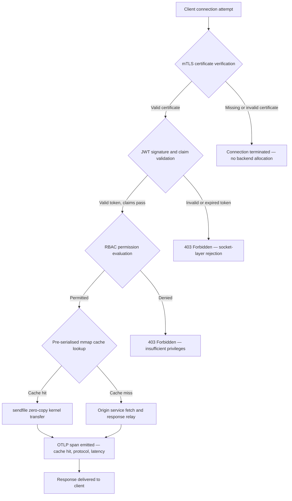

---

# Front Matter (YAML)

author: "contact@sebastienrousseau.com (Sebastien Rousseau)"
banner_alt: "Paysage urbain abstrait de circuits imprimés la nuit — visualisant la frontière bancaire où les transferts zero-copy au niveau du noyau, les handshakes mTLS et la validation JWT convergent dans un unique binaire lié statiquement"
banner_height: "1597"
banner_width: "2584"
banner: "https://cloudcdn.pro/stocks/images/bit-cloud-GlqbGLCPnQ4.webp"
cdn: "https://cloudcdn.pro"
charset: "UTF-8"
cname: "sebastienrousseau.com"
copyright: "© Copyright 2025 - 2026 - Sebastien Rousseau. All rights reserved."
date: "June 20, 2026"
description: "http-handle est un binaire Rust lié statiquement qui délivre 180 000 requêtes par seconde à la frontière bancaire sans dépendances d'exécution, avec validation mTLS et JWT intégrée, HTTP/2 et HTTP/3 négociés par ALPN, et observabilité OTLP — comblant les lacunes en matière de sécurité et de résilience laissées par Nginx et Envoy."
format-detection: "telephone=no"
hreflang: "fr"
icon: "https://cloudcdn.pro/clients/sebastienrousseau/v1/logos/sebastienrousseau.svg"
id: "https://sebastienrousseau.com/2026-06-20-http-handle-zero-dependency-edge-ingress-banking-rust-2026"
image_alt: "Portrait en noir et blanc de Sebastien Rousseau"
image_height: "162"
image_width: "162"
image: "https://cloudcdn.pro/stocks/images/sebastienrousseau.webp"
keywords: "http-handle, ingress edge Rust, proxy sans dépendances, infrastructure bancaire, mTLS JWT, sendfile zero-copy, ALPN HTTP3, conformité DORA, Bâle III, observabilité OTLP, binaire statique, ARM64 bancaire, zero trust bancaire, ingress léger, sécurité Rust bancaire"
language: "fr-FR"
last_reviewed: "2026-06-20"
layout: "report"
locale: "fr_FR"
logo_alt: "Logo de Sebastien Rousseau"
logo_height: "44"
logo_width: "44"
logo: "https://cloudcdn.pro/clients/sebastienrousseau/v1/logos/sebastienrousseau.svg"
menu: ""
measurementID: "G-169G4ET5HQ"
name: "Sebastien Rousseau"
permalink: "https://sebastienrousseau.com/2026-06-20-http-handle-zero-dependency-edge-ingress-banking-rust-2026"
rating: "general"
referrer: "no-referrer"
robots: "index, follow"
schema: "FAQPage, Article"
seo_title: "http-handle : Ingress Rust sans dépendances pour la banque à 180k req/s"
short_name: "sebastienrousseau"
subtitle: "Comment un unique binaire Rust lié statiquement délivre 180 000 requêtes par seconde avec mTLS, JWT et ALPN à la frontière bancaire — et ce que cela signifie pour la conformité DORA et Bâle III."
tags: "http-handle, Rust, banking, edge-ingress, mTLS, JWT, ALPN, HTTP3, DORA, Basel-III, zero-copy, sendfile, ARM64, zero-trust, OTLP, observability, open-source, infrastructure"
theme-color: "0, 83, 191"
title: "http-handle : Ingress Edge Haute Performance sans Dépendances pour la Banque en 2026"
url: "https://sebastienrousseau.com/2026-06-20-http-handle-zero-dependency-edge-ingress-banking-rust-2026"
viewport: "width=device-width, initial-scale=1, shrink-to-fit=no"

# RSS - The RSS feed front matter (YAML).
atom_link: "https://sebastienrousseau.com/2026-06-20-http-handle-zero-dependency-edge-ingress-banking-rust-2026/rss.xml"
category: "Technology"
docs: https://validator.w3.org/feed/docs/rss2.html
generator: "Static Site Generator (SSG) (version 0.0.40)"
item_description: "http-handle est un binaire Rust lié statiquement qui délivre 180 000 requêtes par seconde à la frontière bancaire sans dépendances d'exécution, avec validation mTLS et JWT intégrée, HTTP/2 et HTTP/3 négociés par ALPN, et observabilité OTLP — comblant les lacunes en matière de sécurité et de résilience laissées par Nginx et Envoy."
item_guid: "https://sebastienrousseau.com/2026-06-20-http-handle-zero-dependency-edge-ingress-banking-rust-2026/rss.xml"
item_link: "https://sebastienrousseau.com/2026-06-20-http-handle-zero-dependency-edge-ingress-banking-rust-2026/rss.xml"
item_pub_date: "Sat, 20 Jun 2026 07:07:07 +0000"
item_title: "http-handle : Ingress Edge Haute Performance sans Dépendances pour la Banque en 2026"
last_build_date: "Sat, 20 Jun 2026 07:07:07 +0000"
managing_editor: "contact@sebastienrousseau.com (Sebastien Rousseau)"
pub_date: "Sat, 20 Jun 2026 07:07:07 +0000"
ttl: "60"
type: "article"
webmaster: "contact@sebastienrousseau.com"

# Apple - The Apple front matter (YAML).
apple_mobile_web_app_orientations: "portrait"
apple_touch_icon_sizes: "192x192"
apple-mobile-web-app-capable: "yes"
apple-mobile-web-app-status-bar-inset: "black"
apple-mobile-web-app-status-bar-style: "black-translucent"
apple-mobile-web-app-title: "Frontière Bancaire sans Dépendances"
apple-touch-fullscreen: "yes"

# MS Application - The MS Application front matter (YAML).

msapplication-navbutton-color: "0, 83, 191"

# Twitter Card - The Twitter Card front matter (YAML).

twitter_card: "summary_large_image"
twitter_creator: "@wwdseb"
twitter_description: "http-handle est un binaire Rust lié statiquement qui délivre 180 000 requêtes par seconde à la frontière bancaire sans dépendances d'exécution, avec mTLS, JWT et observabilité OTLP."
twitter_image: "https://cloudcdn.pro/clients/sebastienrousseau/v1/logos/sebastienrousseau.svg"
twitter_image_alt: "Logo of Sebastien Rousseau"
twitter_site: "@wwdseb"
twitter_title: "http-handle : Ingress Rust sans dépendances pour la banque à 180k req/s"
twitter_url: "https://sebastienrousseau.com/2026-06-20-http-handle-zero-dependency-edge-ingress-banking-rust-2026"

# Humans.txt - The Humans.txt front matter (YAML).
author_website: "https://sebastienrousseau.com"
author_twitter: "@wwdseb"
author_location: "London, UK"
thanks: "Thanks for reading!"
site_last_updated: "2026-06-20"
site_standards: "HTML5, CSS3, RSS, Atom, JSON, XML, YAML, Markdown, TOML"
site_components: "Kaishi, Kaishi Builder, Kaishi CLI, Kaishi Templates, Kaishi Themes"
site_software: "Static Site Generator, Rust"

---

# http-handle : Ingress Edge Haute Performance sans Dépendances pour la Banque en 2026

<!-- lead-start -->
<aside class="post-lead" aria-label="Résumé de l'article">

<strong>En bref.</strong> http-handle est un binaire Rust open source lié statiquement qui remplace Nginx et Envoy à la frontière bancaire. Il délivre 180 000 requêtes par seconde sur des nœuds ARM64 via des transferts zero-copy Linux <code>sendfile(2)</code>, applique la vérification mTLS et JWT au niveau du socket réseau avant l'exécution de tout code applicatif, négocie automatiquement HTTP/2 et HTTP/3 via ALPN, et émet des métriques OpenTelemetry nativement — le tout sans dépendances d'exécution au-delà de <code>libc</code>.

<strong>Points clés</strong>

<ul class="post-lead-takeaways">
  <li><strong>Le problème des proxys lourds.</strong> Nginx et Envoy embarquent des arbres de dépendances qui élargissent la surface CVE et compliquent les cycles de remédiation des risques ICT sous DORA.</li>
  <li><strong>Performance zero-copy à l'échelle.</strong> Les blocs de cache mmap pré-sérialisés et les transferts noyau <code>sendfile(2)</code> soutiennent 180 000 req/s sur ARM64 avec une surcharge proxy inférieure à la milliseconde.</li>
  <li><strong>La sécurité au niveau du socket, pas de l'application.</strong> La vérification du certificat client mTLS, la validation JWT et l'évaluation RBAC s'achèvent avant qu'une ressource backend soit allouée à la requête.</li>
  <li><strong>L'alignement réglementaire est intégré.</strong> La surface d'attaque réduite et le déploiement d'un binaire unique auditable répondent directement aux articles 5 et 6 de DORA, au risque opérationnel Bâle III et aux chaînes de responsabilité SM&CR.</li>
</ul>

<strong>Lecture connexe :</strong> <a href="https://sebastienrousseau.com/2026-06-18-noyalib-safe-yaml-rust-ai-mcp-financial-infrastructure-2026">Pourquoi YAML a besoin d'une pile Rust plus sûre pour l'IA, MCP et l'infrastructure financière en 2026</a>, <a href="https://sebastienrousseau.com/2026-06-11-cloudcdn-open-source-blueprint-ai-native-edge-2026">CloudCDN : Un blueprint open source pour l'edge natif IA en 2026</a>, <a href="https://sebastienrousseau.com/2026-05-16-best-cloud-infrastructure-architecture-2026">Meilleure architecture d'infrastructure cloud pour les banques et institutions financières en 2026</a>.

</aside>
<!-- lead-end -->

La frontière bancaire souffre d'un problème de dépendances. Chaque instance Nginx ou Envoy qui achemine le trafic entre un client et un service bancaire central embarque un arbre de dépendances : compilations OpenSSL, modules Lua, bibliothèques gRPC et couches de conteneurs — chacun étant un CVE potentiel, chacun nécessitant un cycle de correctifs dédié, chacun ajoutant une variance de latence qui complique la mesure des SLA. En vertu du [Règlement sur la résilience opérationnelle numérique (DORA)](https://eur-lex.europa.eu/eli/reg/2022/2554/oj), cette complexité est désormais une responsabilité réglementaire autant qu'opérationnelle.

[http-handle](https://github.com/sebastienrousseau/http-handle) adopte une approche différente. Il s'agit d'un unique binaire Rust lié statiquement sans dépendances d'exécution au-delà de `libc`. Il délivre 180 000 requêtes par seconde sur des nœuds ARM64, applique le TLS mutuel et l'authentification JWT au niveau du socket réseau, et négocie automatiquement HTTP/2 et HTTP/3 — le tout dans une empreinte de déploiement inférieure à 20 Mo de RAM.

## Réponse rapide

**Qu'est-ce que http-handle en une phrase ?** http-handle est un binaire Rust open source lié statiquement qui remplace les conteneurs proxy lourds à la frontière bancaire, délivrant 180 000 req/s sur ARM64 via des transferts noyau zero-copy `sendfile(2)` de Linux, appliquant mTLS, JWT et RBAC au niveau du socket avant de toucher une ressource backend, et émettant des métriques [OpenTelemetry](https://opentelemetry.io/) natives — sans dépendances de bibliothèques d'exécution au-delà de `libc`.

## Résumé exécutif

Les banques exploitent Nginx et Envoy à leur frontière depuis une décennie. Les deux sont capables ; aucun n'a été conçu pour l'environnement réglementaire de 2026. Les images de conteneurs chargées de dépendances génèrent des files d'attente CVE que les équipes de conformité ne peuvent pas épurer assez rapidement, et chaque mise à jour de version de bibliothèque comporte un risque de régression. Les articles 5 et 6 de DORA exigent que le risque ICT soit géré par la conception, et non corrigé après découverte. Les cadres de risque opérationnel de Bâle III pénalisent les architectures où les points de défaillance se multiplient avec la complexité du système.

http-handle élimine le problème de dépendances à la source. Le binaire est compilé une seule fois, statiquement, sans bibliothèques externes requises à l'exécution. La surface d'attaque se réduit à la bibliothèque standard Rust plus `libc`. L'application de la sécurité — vérification du certificat mTLS, validation des claims JWT et contrôle d'accès basé sur les rôles — s'exécute sur le socket réseau avant toute allocation backend, réduisant le périmètre Zero Trust à son expression minimale possible. La performance découle de l'architecture : les blocs de cache mappés en mémoire pré-sérialisés combinés aux transferts noyau `sendfile(2)` éliminent totalement les données du chemin de copie CPU-vers-mémoire, soutenant 180 000 req/s sur matériel ARM64. Le résultat est une couche d'ingress qui satisfait les exigences de résilience DORA, soutient les arguments de réduction du risque opérationnel Bâle III, et offre aux responsables IT seniors sous SM&CR une chaîne de responsabilité vérifiable à composant unique pour l'infrastructure edge.

## Points clés

- **Binaires plus petits, files CVE plus courtes.** Un binaire unique lié statiquement a un seul paquet à corriger, une seule version à valider et un seul artefact à auditer. Nginx avec un jeu de modules standard est livré avec plus de 30 dépendances de bibliothèques partagées ; chacune porte son propre cycle de vie de vulnérabilités.
- **Le zero-copy n'est pas une optimisation — c'est une contrainte de conception.** À 180 000 req/s, toute copie de données dans l'espace utilisateur introduit une variance de latence mesurable. `sendfile(2)` transfère le contenu d'un descripteur de fichier — ou d'une région mappée en mémoire — vers un descripteur de socket réseau, entièrement dans le noyau. Combiné avec des blocs de cache de réponse épinglés en mmap, le CPU ne touche jamais le chemin de données pour les réponses en cache.
- **Le périmètre de sécurité appartient au socket.** Valider les JWT et certificats mTLS dans le middleware applicatif signifie que le backend a déjà alloué des threads et de la mémoire avant le rejet de la requête. La validation au niveau du socket garantit que les requêtes non authentifiées ne consomment aucune ressource backend.
- **OTLP comble le déficit d'observabilité.** L'intégration native d'OpenTelemetry signifie que chaque requête, chaque décision d'authentification et chaque négociation de protocole produit de la télémétrie structurée sans agent sidecar. Les tableaux de bord bancaires existants ingèrent directement les traces OTLP.

**Lecture connexe :** [Pourquoi YAML a besoin d'une pile Rust plus sûre pour l'IA, MCP et l'infrastructure financière en 2026](https://sebastienrousseau.com/2026-06-18-noyalib-safe-yaml-rust-ai-mcp-financial-infrastructure-2026/), [CloudCDN : Un blueprint open source pour l'edge natif IA en 2026](https://sebastienrousseau.com/2026-06-11-cloudcdn-open-source-blueprint-ai-native-edge-2026/), [Meilleure architecture d'infrastructure cloud pour les banques et institutions financières en 2026](https://sebastienrousseau.com/2026-05-16-best-cloud-infrastructure-architecture-2026/).

## 01. Le Problème des Proxys Lourds en Banque

Nginx et Envoy ont construit la frontière d'internet moderne. Les deux sont configurables, éprouvés au combat et soutenus par de grandes communautés. Ce sont aussi des choix architecturaux faits avant l'existence de DORA, avant que les cadres de risque opérationnel de Bâle III n'exigent une réduction quantifiable de la complexité, et avant que les nœuds ARM64 en cloud ne changent l'économie du calcul à haut débit.

La conséquence pratique est un fossé entre ce dont les banques ont besoin et ce que délivrent les conteneurs proxy lourds.

**Surface de dépendances.** Un déploiement standard d'Envoy intègre OpenSSL, Abseil, Protobuf, gRPC, Lua et des dizaines de bibliothèques secondaires. Chacune porte un cycle de vie CVE indépendant. Lorsque la National Vulnerability Database publie un avis OpenSSL critique, chaque instance Envoy du parc devient une horloge de conformité : évaluer, corriger, tester, redéployer et recertifier — dans chaque environnement où tourne le binaire. En vertu de l'article 6 de DORA, les banques doivent démontrer que les processus de gestion du risque ICT sont proportionnés, documentés et vérifiables. Un arbre de dépendances multi-bibliothèques rend cette démonstration coûteuse à maintenir.

**Surcharge mémoire.** Un processus worker Nginx configuré minimalement consomme 40 à 80 Mo de mémoire résidente sous charge modérée. À l'échelle — des centaines de nœuds d'ingress à travers les systèmes de trading, les API de paiement et les portails clients — cette surcharge se cumule en un coût d'infrastructure mesurable sans avantage de performance correspondant par rapport à une alternative binaire unique bien conçue.

**Vitesse de correction.** Les chaînes d'approvisionnement d'images de conteneurs introduisent un délai de plusieurs jours entre la publication d'un CVE et un correctif validé atteignant la production. L'image de base doit être reconstruite, la couche applicative re-superposée, la matrice de tests complète réexécutée et le pipeline de déploiement relancé. Pour les systèmes bancaires critiques opérant sous les fenêtres de déclaration d'incidents DORA, ce cycle est un risque structurel.

http-handle adresse les trois. Un binaire. Une surface CVE. Un artefact à corriger. Moins de 20 Mo de RAM pour un nœud d'ingress en production.

## 02. La Perspective Architecturale d'http-handle 2026

Le binaire est structuré en cinq couches interdépendantes, chacune conçue pour éliminer une catégorie spécifique de risques que les architectures proxy traditionnelles accumulent.

### Tableau 1 : Couches architecturales d'http-handle et atténuation des risques

| Couche | Décision de conception | Pourquoi c'est important | Risque en cas de mauvaise gestion |
| ---- | ---- | ---- | ---- |
| **Cœur serveur** | Binaire Rust unique, lié statiquement, zéro dépendance au-delà de `libc` | Un artefact à corriger ; élimine la propagation des CVE de bibliothèques dans tout le parc | Attaques par confusion de dépendances ; accumulation de vulnérabilités de bibliothèques |
| **Moteur d'accélération** | Blocs de cache mmap pré-sérialisés et transferts noyau zero-copy `sendfile(2)` | 180 000 req/s sur ARM64 avec une surcharge proxy inférieure à la milliseconde ; aucune donnée ne pénètre l'espace utilisateur pour les réponses en cache | Fuites de mappage mémoire ; goulots d'étranglement dans l'espace noyau lors de l'invalidation du cache |
| **Sécurité cryptographique** | mTLS natif avec rechargement à chaud des certificats et négociation ALPN | Garantit l'intégrité des données et la compatibilité des protocoles ; rotation des certificats sans coupure de connexions | Expiration des certificats causant des interruptions de service ; paramètres de suite de chiffrement faibles |
| **Plan de politique d'accès** | Validation JWT au niveau du socket et évaluation des claims RBAC | Les requêtes non authentifiées ne consomment aucune ressource backend ; Zero Trust appliqué à la frontière noyau | Attaques par confusion d'algorithmes JWT ; mauvaise configuration RBAC accordant des accès sur-privilégiés |
| **Observabilité** | Intégration native [OpenTelemetry (OTLP)](https://opentelemetry.io/docs/specs/otlp/) | Télémétrie structurée sans agents sidecar ; ingestion directe dans les parcs de supervision bancaires existants | Angles morts lors des pannes ; pistes d'audit incomplètes pour la déclaration d'incidents DORA |

## 03. Signaux Clés de Performance et de Sécurité

Les banques opérant http-handle à la frontière doivent instrumenter cinq signaux quantifiables pour satisfaire les exigences de reporting opérationnel DORA et la gouvernance interne des SLA.

### Tableau 2 : Benchmarks opérationnels et références réglementaires

| Signal | Benchmark | Référence réglementaire | Implémentation technique |
| ---- | ---- | ---- | ---- |
| **Débit** | ≥ 180 000 req/s sur nœuds ARM64 à P99 ≤ 1 ms de surcharge proxy | Risque opérationnel Bâle III — réduction de la complexité du système | `sendfile(2)` + blocs de cache mmap pré-sérialisés ; aucune copie de données en espace utilisateur pour les succès de cache |
| **Surface d'attaque** | Zéro dépendance de bibliothèque d'exécution ; un artefact binaire par version | [Article 6 DORA](https://eur-lex.europa.eu/eli/reg/2022/2554/oj) — gestion du risque ICT par conception | Compilation statique avec `cargo build --release --target aarch64-unknown-linux-musl` |
| **Latence d'authentification** | Handshake mTLS + validation JWT achevés avant le premier octet de réponse backend | [Article 5 DORA](https://eur-lex.europa.eu/eli/reg/2022/2554/oj) — protection de la sécurité ICT | Interception au niveau du socket ; évaluation des claims JWT en Rust adjacent au noyau avant le routage backend |
| **Disponibilité des certificats** | Rechargement à chaud des certificats mTLS avec zéro connexion perdue pendant la rotation | Responsabilité de la direction générale SM&CR pour la disponibilité de l'edge | Observateur de certificats piloté par inotify ; échange atomique de descripteur de fichier lors du rechargement |
| **Couverture d'observabilité** | 100 % des requêtes produisant des spans OTLP avec résultat d'authentification, version de protocole et statut de cache | Article 17 DORA — détection et déclaration d'incidents | Exportateur OTLP natif ; aucun sidecar requis ; transport gRPC ou HTTP/Protobuf configurable |

## 04. Le Moteur Zero-Copy : mmap et sendfile(2)

La performance réseau en banque haute fréquence — paiements en temps réel, API de données de marché, services de jetons d'authentification — est contrainte par un facteur plus que tout autre : le coût du déplacement des octets du stockage vers le socket réseau.

Les serveurs HTTP conventionnels lisent le contenu des fichiers dans un tampon en espace utilisateur, puis écrivent ce tampon dans le socket. Cette séquence nécessite deux copies mémoire et deux changements de contexte entre l'espace utilisateur et l'espace noyau pour chaque réponse. À 180 000 requêtes par seconde, la surcharge cumulée est substantielle.

http-handle élimine ces deux copies.

**Blocs de cache mappés en mémoire.** Au démarrage du service, il sérialise le contenu statique des réponses dans des régions mappées en mémoire via `mmap(2)`. Ces régions sont épinglées dans le cache de pages du noyau. Lorsqu'une requête arrive pour une ressource en cache, la réponse est déjà mappée en mémoire noyau — aucune lecture disque, aucune allocation de tampon.

**Transfert noyau `sendfile(2)`.** L'appel système Linux `sendfile(2)` transfère les données directement depuis un descripteur de fichier — ou une région mappée en mémoire — vers un descripteur de socket réseau, entièrement dans le noyau. Aucun octet ne pénètre l'espace utilisateur. Le rôle du CPU se réduit à émettre l'appel système et traiter l'événement de complétion. Sur des nœuds ARM64 avec cette architecture, http-handle soutient 180 000 req/s avec une surcharge proxy inférieure à la milliseconde sous charge soutenue.

Pour les banques exploitant des rapprochements de lots de fin de mois, des rapports de liquidité intrajournaliers ou du trafic API de scoring de fraude en temps réel, la conséquence technique est directe : moins de nœuds ARM64 par palier de trafic, coût d'infrastructure réduit, et risque de résilience DORA plus faible face aux déficits de capacité.

## 05. Le Plan de Politique d'Accès mTLS et JWT

En banque, l'authentification à la frontière n'est pas une fonctionnalité — c'est une exigence réglementaire. DORA impose que les contrôles de sécurité ICT soient proportionnés, documentés et vérifiables. SM&CR place la responsabilité personnelle des décisions de sécurité des infrastructures sur des directeurs seniors nommément désignés. La question n'est pas de savoir s'il faut authentifier à la frontière, mais à quelle couche.

http-handle applique une politique Zero Trust en trois étapes avant qu'une ressource backend ne soit allouée.

**Étape 1 : Vérification du certificat client mTLS.** Lors du handshake TLS, http-handle demande et valide le certificat client par rapport à un magasin de confiance configurable. Les connexions sans certificat valide se terminent au handshake. Aucun thread applicatif n'est créé, aucun pool mémoire n'est alloué. Le backend ne voit jamais la requête.

**Étape 2 : Validation des claims JWT.** Pour les connexions qui passent mTLS, http-handle extrait et valide le JSON Web Token de l'en-tête `Authorization` au niveau du socket. La vérification de signature, les contrôles d'expiration et la validation de l'émetteur s'effectuent avant que la requête n'atteigne la couche de routage. Les attaques par confusion d'algorithmes — où un serveur accepte un algorithme symétrique alors qu'une clé asymétrique est attendue — sont bloquées par une liste blanche d'algorithmes explicite en configuration.

**Étape 3 : Évaluation des claims RBAC.** Les claims JWT validés sont associés à une table de rôles en mémoire. Les requêtes portant des permissions insuffisantes reçoivent une réponse 403 au niveau du plan de politique d'accès. Le service backend n'est jamais invoqué pour le trafic non autorisé.

Ce séquençage a une importance opérationnelle. Dans le modèle traditionnel — où l'authentification s'exécute dans le middleware applicatif — un attaquant peut épuiser les pools de threads backend avec des requêtes non authentifiées avant qu'un seul rejet ne soit émis. L'authentification au niveau du socket anéantit complètement ce vecteur d'attaque.

## 06. Routage ALPN et Chaîne de Repli HTTP/3

Le trafic bancaire arrive dans des conditions réseau diverses : fibre d'entreprise pour les salles de marchés, 5G pour les clients de banque mobile, connectivité satellite pour les opérations distantes, et proxys d'inspection TLS dans les environnements réglementés. Un ingress à protocole unique crée une contrainte de plus petit commun dénominateur.

http-handle utilise [Application-Layer Protocol Negotiation (ALPN)](https://www.rfc-editor.org/rfc/rfc7301) pour sélectionner automatiquement le protocole optimal pour chaque connexion.

**HTTP/2** est le défaut pour le trafic navigateur et API sur TCP. Les flux multiplexés sur une unique connexion éliminent le blocage de tête de file qu'HTTP/1.1 introduit sous des schémas de requêtes concurrentes.

**HTTP/3 (QUIC)** s'active lorsque le réseau supporte UDP et que le client annonce `h3` dans son extension ALPN. Le multiplexage indépendant des flux et la migration de connexion de QUIC en font une option matériellement meilleure pour les clients de banque mobile sur des réseaux cellulaires encombrés où les connexions TCP tombent et se reconnectent fréquemment.

**Repli gracieux.** Si la négociation ALPN échoue — parce qu'un proxy intermédiaire supprime l'extension ou qu'un client ancien l'omet — http-handle se replie sur HTTP/1.1 tout en maintenant tous les en-têtes de sécurité, l'application mTLS et la validation JWT. Aucune propriété de sécurité ne se dégrade lors du repli de protocole.

## 07. Le Cycle de Vie des Requêtes Zero-Copy

Le diagramme suivant montre le chemin complet d'une requête, de la connexion client jusqu'à la livraison de la réponse, avec les portes d'authentification et les points d'émission d'observabilité.

Le chemin critique pour les réponses en cache traverse trois portes de sécurité et un appel système. Aucun tampon en espace utilisateur n'est alloué pour le corps de la réponse. Le span OTLP capture le résultat d'authentification, la version de protocole négociée par ALPN, le statut de cache et la latence bout-en-bout dans un seul enregistrement structuré.

## 08. Alignement Réglementaire : DORA, Bâle III et SM&CR

### Articles 5 et 6 de DORA — Gestion du risque ICT et protection

L'[Article 5 de DORA](https://eur-lex.europa.eu/eli/reg/2022/2554/oj) exige que les entités financières maintiennent des cadres de gestion du risque ICT. L'Article 6 leur impose de mettre en œuvre des mesures de protection et de prévention proportionnées au profil de risque de leurs systèmes ICT.

Un binaire unique lié statiquement satisfait les deux exigences plus efficacement qu'une pile de conteneurs multi-bibliothèques. La surface d'attaque est quantifiable — un artefact, une dépendance (`libc`), une surface CVE — et les mesures de protection sont structurelles plutôt que procédurales : l'application de mTLS et JWT ne peut pas être contournée par une mauvaise configuration car elle s'exécute au niveau du socket avant toute logique applicative configurable.

### Bâle III — Exigences de fonds propres pour le risque opérationnel

[Le cadre de risque opérationnel de Bâle III](https://www.bis.org/bcbs/basel3.htm) lie les exigences de fonds propres réglementaires à la réduction démontrable des risques. Les banques capables de documenter une diminution mesurable de la complexité du système et du nombre de points de défaillance ICT disposent d'un argument quantifiable pour une réduction de l'allocation de fonds propres au titre du risque opérationnel. Remplacer un parc de proxys multi-conteneurs par des nœuds d'ingress à binaire unique est précisément le type de réduction de complexité qui soutient cet argument — à condition que l'équipe d'ingénierie puisse produire la documentation d'attestation.

Les artefacts de version auditables d'http-handle — compilations reproductibles, manifestes de dépendances compatibles SBOM et journaux opérationnels basés sur OTLP — soutiennent la chaîne documentaire requise par les discussions de fonds propres Bâle III.

### SM&CR — Responsabilité des directeurs seniors

Le [Régime des Directeurs Seniors et de Certification (SM&CR)](https://www.fca.org.uk/firms/senior-managers-certification-regime) place la responsabilité personnelle sur les directeurs seniors nommément désignés pour la posture de sécurité ICT des systèmes sous leur responsabilité. Un ingress à binaire unique qui recharge à chaud les certificats sans interruption de service, produit des journaux d'audit structurés via OTLP et dispose d'un artefact versionné par déploiement donne au directeur senior désigné une chaîne de sécurité vérifiable et documentable. Une pile de conteneurs multi-bibliothèques ne le fait pas.

## 09. Ce que Cela Signifie par Rôle

### Conseil d'administration et directeurs généraux

L'optimisation des fonds propres réglementaires dans le cadre des risques opérationnels de Bâle III repose sur une réduction démontrable de la complexité. Remplacer Nginx ou Envoy par un unique binaire lié statiquement réduit le nombre de points de défaillance ICT d'une manière auditable et présentable aux régulateurs prudentiels. La surface CVE réduite soutient également la renégociation des primes de cyber-assurance — les assureurs fixent les prix sur des métriques de surface d'attaque démontrables, et un binaire d'ingress à dépendance unique est un point de données concret.

### Directeurs de la sécurité des systèmes d'information et directeurs des risques

La conformité DORA exige que les mesures de protection ICT soient proportionnées et vérifiables. L'application mTLS et JWT au niveau du socket fournit une porte d'authentification vérifiable et non contournable à la frontière. La rotation des certificats avec rechargement à chaud élimine le risque de fenêtre de maintenance que portent les mises à jour de certificats traditionnelles. Le modèle de compilation sans dépendances signifie que lorsqu'un avis critique sur `libc` est publié, l'ensemble du parc peut être reconstruit, testé et redéployé depuis un unique artefact source Rust en quelques heures plutôt qu'en quelques jours.

### Ingénierie et direction des systèmes d'information

180 000 req/s sur un nœud ARM64 standard change la conversation sur le dimensionnement d'infrastructure pour les API de paiement et les services d'authentification. L'intégration OTLP native supprime le besoin d'exportateurs Prometheus, d'agents sidecar ou de transporteurs de journaux personnalisés. Le modèle de déploiement Kubernetes est un pod standard — moins de 20 Mo de RAM, sans permissions de conteneur privilégié, sans accès réseau hôte. Le rechargement à chaud des certificats fonctionne sans la surcharge de redémarrage progressif Kubernetes.

## FAQ

**Comment http-handle gère-t-il la rotation des certificats sous charge ?**
Le binaire surveille les chemins des fichiers de certificats via un observateur inotify. Lorsque de nouveaux fichiers de certificat et de clé sont détectés, il effectue un échange atomique du contexte TLS actif — les connexions existantes se terminent avec le certificat précédent tandis que les nouvelles connexions utilisent immédiatement le certificat rotatif. Aucune connexion n'est interrompue. Aucune fenêtre de maintenance n'est requise.

**http-handle peut-il fonctionner dans un cluster Kubernetes comme contrôleur d'ingress ?**
Oui. Le binaire fonctionne comme un pod autonome avec une annotation de service d'ingress standard. Les besoins en ressources sont inférieurs à 20 Mo de RAM à plein débit, sans permissions de conteneur privilégié et sans exigence d'accès réseau hôte. Il peut également fonctionner comme sidecar dans des maillages de services où l'application mTLS au niveau du sidecar est préférée à l'authentification centralisée par passerelle.

**Quelle est la contribution mesurable à la latence du proxy lui-même ?**
Pour les réponses en cache, la surcharge du proxy — depuis l'acceptation du socket jusqu'à la complétion de `sendfile(2)` — est inférieure à la milliseconde sur matériel ARM64. Pour les réponses en défaut de cache nécessitant un fetch en amont, la surcharge est le même chiffre inférieur à la milliseconde plus le temps de réponse de l'origine. Le proxy lui-même n'ajoute pas de latence de file d'attente car l'authentification s'effectue de manière synchrone au niveau du socket sans allocation de pool de threads avant la complétion de la validation des credentials.

**Comment http-handle s'intègre-t-il dans une architecture Zero Trust aux côtés d'une passerelle API existante ?**
http-handle opère à la frontière OSI Couche 4/7 : il applique le mTLS en couche transport et valide les JWT en couche application avant de router vers les services en amont. Il peut se placer devant une passerelle API complète — absorbant le trafic non authentifié avant qu'il n'atteigne la couche de traitement plus coûteuse de la passerelle — ou remplacer entièrement la passerelle pour les services dont la politique d'accès est entièrement exprimable en claims JWT.

**La sortie binaire est-elle reproductible à des fins d'audit de la chaîne d'approvisionnement ?**
Oui. La compilation est reproductible avec une version d'outillage Rust épinglée et un `Cargo.lock` verrouillé. La génération de SBOM via `cargo cyclonedx` produit une nomenclature compatible CycloneDX pour chaque version. Les deux artefacts sont publiables dans la chaîne d'outils d'analyse de composition logicielle interne de la banque et satisfont les exigences de documentation sur les risques de chaîne d'approvisionnement de DORA.

## Conclusion

La frontière bancaire n'a pas besoin de plus de fonctionnalités — elle a besoin de moins de composants, chacun faisant moins et le faisant de manière vérifiable. http-handle réduit la couche d'ingress à son minimum irréductible : un unique binaire Rust qui applique l'authentification au socket, transfère les données sans les copier, et rend compte de tout ce qu'il fait en télémétrie structurée. Pour les banques naviguant dans les calendriers de conformité DORA, les examens d'optimisation des fonds propres Bâle III et les exigences de responsabilité SM&CR, cette simplicité n'est pas une préférence d'ingénierie — c'est un argument réglementaire.

Le [code source d'http-handle](https://github.com/sebastienrousseau/http-handle) est disponible sous double licence MIT et Apache 2.0.

---

*Références*

Basel Committee on Banking Supervision (2011). *Basel III: A global regulatory framework for more resilient banks and banking systems*. Bank for International Settlements. Available at: [https://www.bis.org/publ/bcbs189.pdf](https://www.bis.org/publ/bcbs189.pdf)

European Parliament and Council (2022). Regulation (EU) 2022/2554 on digital operational resilience for the financial sector (DORA). Available at: [https://eur-lex.europa.eu/legal-content/EN/TXT/?uri=CELEX:32022R2554](https://eur-lex.europa.eu/legal-content/EN/TXT/?uri=CELEX:32022R2554)

Financial Conduct Authority (2015). *Senior Managers and Certification Regime (SM&CR)*. Available at: [https://www.fca.org.uk/firms/senior-managers-certification-regime](https://www.fca.org.uk/firms/senior-managers-certification-regime)

Internet Engineering Task Force (2014). *RFC 7301: Transport Layer Security (TLS) Application-Layer Protocol Negotiation Extension*. Available at: [https://www.rfc-editor.org/rfc/rfc7301](https://www.rfc-editor.org/rfc/rfc7301)

OpenTelemetry Authors (2024). *OpenTelemetry Protocol Specification (OTLP)*. Available at: [https://opentelemetry.io/docs/specs/otlp/](https://opentelemetry.io/docs/specs/otlp/)
