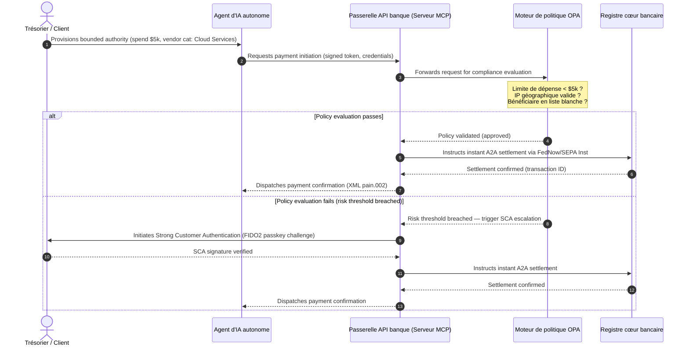

# Perspectives paiements mondiaux 2026 : modèle opérationnel, risque et revenu dans un monde agentique, invisible et en temps réel

Le cycle mondial des paiements 2026 repose sur trois forces convergentes — commerce agentique, paiements intégrés invisibles et exécution en temps réel — posées sur un registre unifié tokenisé sous Project Agorá et la bascule SWIFT vers l'adresse structurée du 14 novembre 2026.

<!-- lead-start -->
<aside class="post-lead" aria-label="Article summary">

<strong>En bref.</strong> Le paysage des paiements 2026 ne se réduit plus à une migration de messagerie : c'est un modèle opérationnel multidimensionnel où le risque et le revenu sont dictés par l'exécution en temps réel. Cette analyse synthétise les perspectives 2026 de J.P. Morgan, Global Payments, HSBC et The Payments Association en un plan opérationnel G-SIB à quatre piliers — commerce agentique initié par modèle, API de trésorerie en continu, registres unifiés tokenisés sous Project Agorá (BIS) et échéance SWIFT de l'adresse structurée du 14 novembre 2026.

<strong>Points clés</strong>

<ul class="post-lead-takeaways">
  <li><strong>Le commerce agentique ouvre un front de responsabilité déléguée.</strong> Les agents d'IA autonomes devraient intermédier $3-$5 trillion de commerce annuel d'ici 2030. Les banques doivent définir la garde via MCP, la délégation SCA sous PSD3/PSR et la responsabilité KYC/AML dans les chaînes de paiement multi-agents.</li>
  <li><strong>La liquidité en continu devient un socle opérationnel et réglementaire.</strong> Les API de trésorerie 24/7 et les comptes virtuels réduisent la trésorerie immobilisée et relèvent le seuil de résilience. Sous DORA, les produits de liquidité en temps réel doivent reposer sur une infrastructure géo-redondante et active-active tenant 99.999% de disponibilité.</li>
  <li><strong>La tokenisation est passée aux registres unifiés régulés.</strong> Project Agorá est le plus vaste cadre public-privé pour les dépôts bancaires commerciaux tokenisés et les réserves de banque centrale. Les banques ont besoin d'un parcours de tokenisation en cinq étapes, avec un traitement prudentiel explicite.</li>
  <li><strong>La bascule du 14 novembre 2026 vers l'adresse structurée est à date ferme.</strong> Les champs d'adresse postale non structurés dans les messages CBPR+ et SEPA déclencheront des rejets immédiats. Une gouvernance de la donnée rigoureuse, transversale aux équipes produit, technologie et conformité, est requise.</li>
</ul>

<strong>À lire également :</strong> <a href="https://sebastienrousseau.com/2026-06-23-iso-20022-pain001-programmable-liquidity-autonomic-treasury-2026" title="Du Pain.001 à la liquidité programmable : ISO 20022 comme système nerveux autonome de la trésorerie en 2026">Du Pain.001 à la liquidité programmable : ISO 20022 comme système nerveux autonome de la trésorerie en 2026</a>, <a href="https://sebastienrousseau.com/2026-06-24-cross-border-iso-20022-open-finance-tokenised-deposits-treasury-2026" title="Transfrontalier 2026 : ISO 20022, open finance et dépôts tokenisés dans la trésorerie d'entreprise">Transfrontalier 2026 : ISO 20022, open finance et dépôts tokenisés dans la trésorerie d'entreprise</a>, <a href="https://sebastienrousseau.com/2026-06-25-quantum-dawn-cib-kyberlib-quantum-resilient-payments-stack-2026" title="Aube quantique pour les CIB : de KyberLib à une pile de paiements résiliente au quantique">Aube quantique pour les CIB : de KyberLib à une pile de paiements résiliente au quantique</a>.

</aside>
<!-- lead-end -->

Pour les banques transactionnelles mondiales, le cycle 2026-2028 ouvre une fenêtre structurelle. L'infrastructure de paiement moderne n'est plus une utilité administrative : elle constitue le cœur de la stratégie technologique de niveau bancaire. Au sein des G-SIB et des grands établissements régionaux, technologie, régulation et attentes clients ont convergé en un seul plan opérationnel.

Trois forces définissent ce cycle, et chacune renvoie directement à une préoccupation de comité exécutif.

- **Commerce agentique** — distribution des canaux, conception produit, allocation de responsabilité et Model Risk Management sous supervision prudentielle.
- **Paiements invisibles** — expérience client, avec un risque de désintermédiation lorsque les banques échouent à intégrer leur registre aux front-ends corporate et marchands.
- **Exécution en temps réel** — vélocité du capital, avec un impact direct sur la gestion de liquidité, le risque de crédit, la résilience opérationnelle et la défense anti-fraude.

Les enjeux financiers sont matériels. La fraude gagne en vitesse et en sophistication ; les échéances réglementaires sont fermes ; et les banques qui modernisent activement leurs systèmes cœur ouvrent des relais substantiels de revenus de commissions. Le coût de l'inaction est l'inverse : rejets immédiats de transactions, goulots opérationnels, sanctions réglementaires et érosion rapide des parts de marché.

## La convergence des autorités mondiales du paiement

Cette analyse synthétise les perspectives 2026 de quatre voix sectorielles de référence — [J.P. Morgan Payments](https://www.jpmorgan.com/payments/newsroom/payments-outlook-2026-trends-report-released "J.P. Morgan Payments — Outlook 2026"), [Global Payments](https://investors.globalpayments.com/news-events/press-releases/detail/497/global-payments-releases-its-2026-commerce-and-payment "Global Payments — 2026 Commerce and Payment Trends Report"), HSBC et The Payments Association — et les triangule avec la [feuille de route G20 pour l'amélioration des paiements transfrontaliers](https://www.fsb.org/2026/03/fsb-kicks-off-new-implementation-phase-to-enhance-cross-border-payments-through-public-private-partnership/ "FSB — phase de mise en œuvre des paiements transfrontaliers, mars 2026").

Chaque organisation aborde l'écosystème sous un angle de marché distinct, mais leurs conclusions convergent sur trois invariants.

1. **Les rails instantanés pilotés par API sont le socle.** Les modèles de traitement par lots hérités sont marginalisés pour les flux transfrontaliers et de gros montants ; la vélocité transactionnelle y est désormais dictée par une messagerie en temps réel, en continu.
2. **L'IA est à la fois menace et défense.** Les outils génératifs et les hypertrucages amplifient la fraude transactionnelle, ce qui impose des contre-défenses d'apprentissage automatique en temps réel et à plusieurs couches.
3. **La tokenisation est une infrastructure prête pour la production.** Les registres s'unifient pour héberger les passifs commerciaux tokenisés et les monnaies numériques de banque centrale de gros.

| Rapport | Public principal | Focus | Pilier clé | Implication bancaire |
| --- | --- | --- | --- | --- |
| **J.P. Morgan Payments** | Trésoriers d'entreprise, G-SIBs | Liquidité temps réel, fraude | API, biométrie IA | Refondre les systèmes de liquidité, de change et de risque pour un règlement continu 365 jours. |
| **Global Payments** | Marchands, e-commerce | Évolution POS, omnicanal | Commerce agentique, paiement sans friction | Construire des corridors marchands API sécurisés et délimités pour les agents d'IA autonomes. |
| **HSBC Insights** | Multinationales | Intégrations ERP (SAP/Oracle), trésorerie temps réel | Treasury-as-a-Service, visibilité de trésorerie | Monétiser des suites d'API transactionnelles et intégrer le reporting de trésorerie en temps réel à la source. |
| **The Payments Association** | Fintechs, établissements de paiement | Stablecoins, tokenisation, régulation mondiale | Actifs numériques régulés, conformité politique | Préparer les bilans aux dépôts tokenisés et naviguer les structures de responsabilité PSD3/PSR. |

Ces quatre perspectives définissent en pratique la pile opérationnelle du secteur privé qui s'exécute au-dessus de l'infrastructure de politique publique du G20, traduisant l'intention politique en décisions concrètes sur la liquidité, la tokenisation, la donnée et le contrôle de la fraude au sein des banques.

## Pilier 1 — Commerce agentique et paiements invisibles

Le commerce agentique marque le passage du paiement à clic, pilotĂŠ par l'humain, à une initiation transactionnelle autonome, pilotée par modèle. Les prévisions sectorielles convergent sur $3-$5 trillion de commerce annuel intermédié par des agents autonomes d'ici 2030 — soit une part à un chiffre faible du volume mondial de paiements exécutée sans qu'un humain ne clique sur « acheter ».

L'écosystème retail et commercial accuse un retard correspondant. Une large majorité de consommateurs attend désormais des paiements quasi sans friction, alors qu'à peine la moitié des marchands ont priorisé le paiement en un clic ou les catalogues produits accessibles par API. Les agents d'IA ne peuvent pas naviguer dans des écrans de paiement multi-pages hérités, conçus pour l'œil humain ; ils exigent des handshakes API structurés, machine à machine.

### Priorités bancaires et impact opérationnel

- **Responsabilité KYC et AML.** Les banques doivent déterminer qui porte l'obligation de conformité à l'intérieur d'une chaîne transactionnelle agentique. Lorsque l'agent d'IA personnel d'un consommateur initie une transaction via le paiement agentique d'un marchand, la banque doit vérifier que l'autorité déléguée d'origine est cryptographiquement liée au titulaire principal du compte.
- **Refonte de la responsabilité et de la rétrofacturation.** Les schémas cartes et les rails A2A ont été conçus autour d'une autorisation humaine. Quand un agent d'IA effectue un achat erroné — par exemple, en commandant un inventaire industriel inexact à cause d'une erreur de parsing — les banques doivent allouer la responsabilité de façon explicite entre consommateur, fournisseur d'agent et marchand.
- **Notation de risque des flux agentiques.** Les moteurs de routage des paiements doivent noter dynamiquement le risque des paiements agentiques, en appliquant des exigences de réserve ou des taux d'interchange supérieurs aux transactions non initiées par un humain tant qu'un historique de règlement stable n'est pas constitué.

### Action délimitée et autorité délimitée

Pour atténuer l'« action non délimitée » — un agent d'approvisionnement d'entreprise lançant une boucle d'achat récursive infinie suite à un bug logiciel — les banques doivent déployer des **portes API à autorité délimitée**. Ces portes appliquent des limites de niveau politique sur trois dimensions.

1. **Limites financières échelonnées** — dépenses de l'agent restreintes par taille de transaction, valeur cumulée quotidienne et catégorie de marchand.
2. **Garde-fous contextuels** — signaux secondaires (heure de la journée, géolocalisation IP, fréquence transactionnelle) évalués avant que le registre ne libère les fonds.
3. **Escalade avec humain dans la boucle** — autorisation humaine obligatoire déclenchée via Strong Customer Authentication (SCA) sous PSD3 / PSR dès qu'une transaction franchit les seuils de risque.

Le diagramme de séquence Mermaid ci-dessous illustre l'architecture cible que de nombreuses banques reconnaîtront comme le flux de paiement agentique à autorité délimitée.

### Le Model Context Protocol (MCP)

Pour relier des modèles d'IA localisés aux couches d'exécution gouvernées par la banque, le secteur se standardise autour du [Model Context Protocol (MCP)](https://modelcontextprotocol.io "Model Context Protocol — standard ouvert pour l'intégration d'outils LLM") — un protocole ouvert qui permet aux LLM d'appeler des outils et des API clairement délimités et auditables, sans accès brut aux systèmes cœur.

Encapsuler les API bancaires (initiation de paiement, consultation de solde, vérification de partie) dans un serveur MCP tient les LLM à l'écart des tables de base de données et des contrôles système racine. Le modèle interagit avec le registre uniquement via des points d'extrémité structurés, audités et limités en débit — la sécurité s'applique à la frontière de l'exécution agentique plutôt que d'être enfouie dans le modèle.

## Pilier 2 — Transformation de la trésorerie et liquidité repensée

La vélocité de la banque transactionnelle en 2026 est dictée par le passage du traitement par lots de fin de journée à des opérations de trésorerie en continu, en temps réel. Les multinationales ne tolèrent plus la trésorerie immobilisée — des liquidités dormantes dans des comptes locaux le week-end ou les jours fériés parce que les systèmes de règlement sont fermés.

### L'argumentaire économique de la liquidité en temps réel

J.P. Morgan et HSBC observent tous deux que les entreprises dotées de capacités avancées de trésorerie et de donnée en temps réel sont sensiblement plus susceptibles de surperformer leurs pairs en croissance du revenu et en efficacité du capital, principalement en réduisant la liquidité immobilisée et en optimisant les cycles de fonds de roulement.

Pour capter cette valeur, les banques livrent des **produits d'API Treasury-as-a-Service (TaaS)** qui permettent aux ERP d'entreprise (SAP, Oracle) de se brancher directement sur le registre de la banque.

- **API de solde temps réel** exploitant le schéma `camt.052` — remplaçant les protocoles de transfert de fichiers par un reporting de position de trésorerie instantané, événementiel.
- **API d'initiation de paiement en masse** exploitant `pain.001` — exécution directe et de bout en bout des batches de paiement fournisseurs depuis le registre de l'ERP.
- **API de change en continu** — les moteurs de trésorerie verrouillent en temps réel des taux de change algorithmiques pour le règlement transfrontalier, éliminant le risque de gap de marché overnight.
- **API de comptes virtuels** — les entreprises ouvrent et clôturent dynamiquement des milliers de sous-comptes pour le rapprochement automatisé des créances et la séparation comptable.

### Résilience opérationnelle et DORA

Offrir une liquidité en continu transforme le profil de risque de la banque. La plateforme doit tenir **99.999% de disponibilité opérationnelle** sous charge continue, en temps réel.

Sous le [Digital Operational Resilience Act (DORA)](https://eur-lex.europa.eu/legal-content/EN/TXT/?uri=CELEX%3A32022R2554 "Règlement (UE) 2022/2554 — Digital Operational Resilience Act"), ce n'est pas un KPI IT — c'est une exigence réglementaire stricte. Les superviseurs attendent des banques qu'elles démontrent que la surface d'API de trésorerie temps réel et la base de données du registre absorbent des cyberattaques, des coupures réseau et des perturbations d'hyperscalers sévères mais plausibles, sans interrompre les paiements critiques ni compromettre la liquidité systémique. Cela exige des architectures de base de données multi-cloud géo-redondantes et active-active, des couches de détection de menace en temps réel et un basculement automatisé — visibles sur la ligne de coût du change, pas seulement dans le dossier d'audit.

### Change en continu et innovation transfrontalière

La trésorerie en temps réel ne peut pas vivre à l'intérieur d'une frontière monocourante. Les G-SIB déploient des infrastructures de change en continu — la plateforme [Wire 365](https://www.jpmorgan.com/insights/payments/fx-cross-border/wire-365-global-clearing "J.P. Morgan — Wire 365 global clearing reinvented") de J.P. Morgan traite les paiements transfrontaliers et les conversions de change tous les jours de l'année, au-delà des horaires RTGS traditionnels des banques centrales. Cette couche s'imbrique directement avec les dépôts tokenisés et les systèmes de registre unifié évoqués au pilier 3.

## Pilier 3 — Dépôts tokenisés et registre unifié

La tokenisation est passée de pilotes de preuve de concept isolés à une infrastructure monétaire de niveau bancaire à grande échelle. Le focus s'est déplacé des stablecoins privés et des cryptoactifs spéculatifs vers les **dépôts bancaires commerciaux tokenisés** et les **monnaies numériques de banque centrale de gros (wCBDC)** s'exécutant sur des registres unifiés programmables.

Le cadre de référence est [Project Agorá](https://www.bis.org/about/bisih/topics/fmis/agora.htm "BIS Project Agorá — tokenisation des paiements transfrontaliers de gros") — une collaboration public-privé d'envergure convoquée par la BIS et l'IIF, réunissant seven central banks et plus de 40+ institutions financières privées. Le projet explore comment les dépôts bancaires commerciaux tokenisés s'intègrent aux wholesale CBDC tokenisés sur un registre programmable partagé pour éliminer la friction de règlement transfrontalier, coordonner les contrôles de conformité et permettre une finalité atomique 24/7.

### Le parcours de tokenisation en cinq étapes

Pour les G-SIB et les grandes banques régionales, la tokenisation est un parcours par paliers, de l'optimisation interne à l'interopérabilité de marché ouverte.

1. **Liquidité interne de trésorerie** — tokeniser les soldes de trésorerie corporate internes (p. ex. JPM Coin ou registres bancaires privés équivalents) pour permettre transfert et compensation transfrontaliers instantanés, 24/7, entre les succursales de la banque.
2. **Corridors multi-bancaires délimités** — consortiums fermés et régulés (le sandbox Project Agorá) pour tester le règlement interbancaire et l'état de registre partagé entre établissements distincts.
3. **Change programmable en continu** — des contrats intelligents sur le registre unifié exécutent un change Payment-versus-Payment (PvP) instantané, supprimant le risque de règlement entre fuseaux horaires.
4. **Actifs réels tokenisés (RWA)** — la jambe espèces tokenisée s'intègre aux registres de titres, dette ou commerce tokenisés pour une finalité Delivery-versus-Payment (DvP) instantanée, faisant passer le blocage de capital de jours à millisecondes.
5. **Interopérabilité publique/hybride régulée** — des passerelles sécurisées laissent la liquidité institutionnelle interagir sans danger avec les réseaux publics ouverts.

### Implications prudentielles et bilancielles

Les espèces tokenisées doivent être pilotées avec rigueur à travers les cadres prudentiels. Les superviseurs soulignent qu'un dépôt tokenisé doit être économiquement équivalent à un dépôt bancaire commercial traditionnel — c'est-à-dire un passif non garanti au bilan de la banque, avec la même couverture d'assurance-dépôts.

Opérationnellement, les dépôts tokenisés introduisent des risques que les modèles classiques de stress de liquidité n'ont pas été conçus pour simuler. Les contrats intelligents exécutent des retraits programmables à des vitesses et des volumes que les hypothèses héritées ne capturent pas. Sous Basel III, les banques doivent garantir que le moteur de risque sait modéliser des fuites d'espèces programmables et que le registre tokenisé interopère proprement avec les systèmes RTGS hérités tout au long du cycle quotidien de liquidité.

### Stablecoins vs dépôts tokenisés — une position nuancée

Les stablecoins privés intégralement adossés (USDC, etc.) continuent à capter des parts de marché dans les transferts transfrontaliers retail et le commerce décentralisé, mais ils n'ont ni la capacité de création de crédit ni la finalité de règlement du système bancaire commercial.

Plutôt que de concurrencer les rails retail, les banques transactionnelles établissent une activité de conservation, émettent leurs propres instruments tokenisés de passif régulé et bâtissent des passerelles sécurisées d'entrée/sortie. Les clients corporate gagnent en flexibilité de programmation tout en maintenant le capital à l'intérieur du périmètre régulé.

### Questions qu'un conseil d'administration devrait poser sur la monnaie tokenisée

- **Participation au registre unifié.** Quelle est notre feuille de route stratégique active pour participer aux initiatives publiques-privées de registre unifié de gros telles que Project Agorá ?
- **Modélisation du bilan et du risque.** Nos moteurs de risque et nos cadres d'adéquation des fonds propres ont-ils mis à jour les stress tests pour intégrer la vitesse des fuites de jetons déclenchées par contrat intelligent ?
- **Segments clients pionniers.** Lesquels de nos segments trésorerie corporate et banque commerciale bénéficieraient immédiatement d'un règlement DvP/PvP tokenisé et programmable ?

## Pilier 4 — Donnée structurée et défense anti-fraude

La conformité d'infrastructure en 2026 est dominée par la **bascule du 14 novembre 2026 vers l'adresse structurée** établie par la [SWIFT Standards Release (SR) 2026](https://www.swift.com/standards/iso-20022/removal-unstructured-address "SWIFT — Removal of unstructured address, novembre 2026"). À partir de cette date, les réseaux de paiement CBPR+ et SEPA cesseront d'accepter les blocs d'adresse postale entièrement non structurés, en texte libre (`<AdrLine>`), dans les messages de paiement. Tout message transfrontalier ou domestique transportant une adresse non structurée là où des éléments structurés sont attendus sera retardé ou rejeté par le réseau.

La plupart des établissements connaissent la date. Beaucoup la traitent comme un simple exercice de mapping en couche d'interface. La réalité est un défi plus profond de qualité et de gouvernance de la donnée. Pour éviter des taux de rejet catastrophiques, les opérations de paiement ont besoin d'un cadre de gouvernance transverse clair.

- **Produit et opérations.** Capture de la donnée à la source. Les portails numériques clients, les interfaces d'onboarding et les champs d'entrée des ERP d'entreprise doivent imposer des champs d'adresse structurée (`<StrtNm>`, `<PstCd>`, `<TwnNm>`, `<Ctry>`) au point d'initiation du paiement.
- **Technologie.** Parsing, mapping, validation de schéma. Les moteurs de validation bloquent les fichiers hérités avant qu'ils n'atteignent l'interface SWIFT. Des modèles d'apprentissage automatique déployés localement parsent les blocs d'adresse non structurés hérités vers des balises XML conformes sous `<PstlAdr>`.
- **Conformité et risque.** Screening de sanctions, monitoring transactionnel et logique AML mis à jour pour ingérer les champs XML structurés — ce qui fait baisser les taux de faux positifs et les enquêtes manuelles.

### L'argumentaire métier de la donnée structurée

Traité comme un coût de conformité, le programme de donnée structurée est onéreux. Traité comme un levier de revenu, il s'autofinance.

1. **Décisionnement de crédit avancé.** Les données structurées de facture, de remise et de débiteur ultime permettent aux banques de construire des programmes automatisés et précis de financement du fonds de roulement et d'affacturage de chaîne d'approvisionnement pour les clients corporate.
2. **Rapprochement automatisé des créances.** L'exposition d'identifiants structurés de parties et de factures soutient des produits premium de rapprochement de trésorerie et de pooling de comptes virtuels, générant de nouveaux revenus de commissions transactionnelles.
3. **Analytique transactionnelle monétisable.** Les banques empaquètent et vendent des tableaux de bord analytiques granulaires, en temps réel, sur la liquidité et les schémas d'achat, à destination des CFO et des trésoriers corporate.

### Une défense anti-fraude par IA en couches

À mesure que les vitesses de transaction passent au temps réel, les techniques de fraude se sont industrialisées. Des recherches récentes indiquent que les hypertrucages représentent environ 40 % des tentatives de fraude biométrique, les médias synthétiques étant de plus en plus utilisés pour contourner les contrôles de reconnaissance vocale et faciale dans les flux d'onboarding et de paiement.

La défense est un **modèle de fraude IA à trois couches**.

1. **Couche identité.** Clés d'accès [FIDO2](https://fidoalliance.org/fido2/ "FIDO Alliance — spécification FIDO2") vérifiées biométriquement, liaison cryptographique signée à l'appareil matériel et portefeuilles d'identité numérique décentralisés pour sécuriser l'accès au paiement.
2. **Couche comportementale.** Biométrie comportementale continue — cadence de navigation en session, rythme de frappe, orientation de l'appareil — pour détecter une exécution bot automatisée ou des tentatives de détournement de session.
3. **Couche transactionnelle.** Les champs structurés d'ISO 20022 alimentent des moteurs de risque d'apprentissage automatique en temps réel, croisant les métadonnées de transaction avec une intelligence consortiale partagée au niveau réseau pour identifier les transactions suspectes en quelques millisecondes après leur initiation.

Pour satisfaire les superviseurs, les modèles d'IA de la couche transactionnelle intègrent des **paramètres d'explicabilité** stricts et fonctionnent sous un programme dédié de Model Risk Management (MRM). Les régulateurs attendent des banques qu'elles expliquent les points de donnée et la logique algorithmique précis ayant déclenché un blocage automatisé ou une alerte de fraude, en cohérence avec la [SR 11-7 de la Federal Reserve américaine](https://www.federalreserve.gov/frrs/guidance/supervisory-guidance-on-model-risk-management.htm "US Federal Reserve — Supervisory Guidance on Model Risk Management, SR 11-7") et la [PRA SS1/23](https://www.bankofengland.co.uk/prudential-regulation/publication/2023/may/model-risk-management-principles-for-banks-ss "Bank of England PRA SS1/23 — Model Risk Management principles for banks") de la Banque d'Angleterre.

## Agenda du conseil 2026-2028

Pour exécuter sur les quatre piliers, les organes de direction des G-SIB et des banques régionales devraient organiser leurs investissements opérationnels et technologiques selon une feuille de route claire à trois horizons.

### Horizon 1 — Conformité immédiate et durcissement du cœur (0-12 mois)

- **Focus.** Standardiser la qualité de la donnée ISO 20022 et sécuriser les voies de transaction temps réel de base.
- **Indicateur de succès (KPI).** Zéro rejet pour adresse non structurée sur SWIFT et SEPA après la bascule du 14 novembre 2026.
- **Sponsor exécutif.** Chief Operating Officer / Responsable des opérations de paiement.
- **Type de livrable.** Mouvement sans regret. Mise à jour des schémas de base de données cœur et moteur de validation SWIFT SR 2026.

### Horizon 2 — Automatisation et garde-fous agentiques (12-24 mois)

- **Focus.** Portes API agentiques délimitées et architecture de défense anti-fraude en continu.
- **Indicateur de succès (KPI).** 100 % des transactions API machine à machine et initiées par IA validées via liaison matérielle FIDO2 et moteurs de politique à autorité délimitée.
- **Sponsor exécutif.** Chief Information Officer / Chief Risk Officer.
- **Type de livrable.** Mouvement sans regret (défense anti-fraude) plus option stratégique (commerce agentique). Déploiement MCP et IA de fraude à trois couches.

### Horizon 3 — Tokenisation de la plateforme et registres unifiés (24-36 mois)

- **Focus.** Faire basculer les actifs de trésorerie vers des dépôts tokenisés et participer aux registres transfrontaliers partagés.
- **Indicateur de succès (KPI).** Au moins 15 % du volume de règlement de trésorerie corporate de gros montant traité nativement via des instruments de dépôt tokenisé ou des arrangements de registre unifié (p. ex. corridors Project Agorá).
- **Sponsor exécutif.** Group Treasurer / Responsable de la banque transactionnelle.
- **Type de livrable.** Option stratégique. Infrastructure de registre programmable, règles de liquidité par contrat intelligent, adaptateurs de règlement DvP/PvP.

## FAQ

**Le commerce agentique atteindra-t-il réellement $3-$5 trillion d'ici 2030 ?**
Le scénario de référence McKinsey table sur $5 trillion de ventes en commerce agentique d'ici 2030, avec un éventail de prévisions indépendantes qui s'agrègent entre 3 trillion et 5 trillion. L'écart reflète la rapidité avec laquelle les marchands livreront des API de paiement lisibles par machine et l'agilité avec laquelle les banques laisseront les agents transiger sous délégation SCA — le goulot est du côté banque et marchand, pas du côté capacité des agents.

**La bascule SWIFT du 14 novembre 2026 s'applique-t-elle aussi aux flux SEPA domestiques ?**
Oui. L'exigence d'adresse structurée s'applique au transfrontalier CBPR+ et aux messages de paiement SEPA. Les banques opérant sur les deux rails ont besoin d'un schéma d'adresse canonique unique en amont de l'interface SWIFT, pas de deux mappings parallèles.

**Un dépôt tokenisé est-il identique à un stablecoin ?**
Non. Un dépôt tokenisé est un passif non garanti au bilan d'une banque régulée, avec la même couverture d'assurance-dépôts qu'un dépôt traditionnel. Un stablecoin est typiquement un instrument intégralement adossé émis par un non-bancaire, sans capacité de création de crédit. La conception de Project Agorá suppose que les dépôts tokenisés coexistent avec des wholesale CBDC sur un registre programmable partagé ; les stablecoins ne figurent pas dans la jambe de règlement de gros.

**Comment Project Agorá s'articule-t-il avec les pilotes wCBDC existants ?**
Agorá est le cadre intégrateur. Les expérimentations nationales de wCBDC couvrent la jambe monnaie de banque centrale ; Agorá amène les dépôts commerciaux tokenisés sur le même registre programmable, pour que le règlement transfrontalier soit atomique sur les deux types de monnaie. Les seven central banks participantes et 40+ institutions privées en font le plus vaste terrain de conception public-privé pour l'architecture monétaire tokenisée de gros.

**Quelle est la posture minimale de conformité DORA pour une API TaaS ?**
Déploiement actif-actif géo-redondant, scénarios cyber sévères mais plausibles documentés avec propriétaires nommés sous SM&CR (Royaume-Uni), et basculement testé qui n'interrompt pas les paiements critiques. Sans cela, le produit TaaS est un passif réglementaire avant d'être une ligne de revenu.

## Références

- Bank for International Settlements (BIS) Innovation Hub. (2026). *Project Agorá: exploring tokenisation of wholesale cross-border payments*. [BIS Project Agorá](https://www.bis.org/about/bisih/topics/fmis/agora.htm).
- Deutsche Bank. (2026). *Digital Money: a perspective on stablecoins, tokenised deposits and CBDCs*. [Deutsche Bank Flow](https://flow.db.com/publications/flow-white-papers-and-guides/digital-money-a-perspective-on-stablecoins-tokenised-deposits-and-cbdcs).
- Parlement européen et Conseil. (2022). *Règlement (UE) 2022/2554 relatif à la résilience opérationnelle numérique (DORA)*. [Règlement DORA](https://eur-lex.europa.eu/legal-content/EN/TXT/?uri=CELEX%3A32022R2554).
- Financial Stability Board. (2026). *FSB kicks off new implementation phase to enhance cross-border payments*. [Communiqué FSB](https://www.fsb.org/2026/03/fsb-kicks-off-new-implementation-phase-to-enhance-cross-border-payments-through-public-private-partnership/).
- Global Payments. (2025). *2026 Commerce and Payment Trends Report — communiqué*. [Communiqué Global Payments](https://investors.globalpayments.com/news-events/press-releases/detail/497/global-payments-releases-its-2026-commerce-and-payment).
- J.P. Morgan Payments. (2026). *Payments Outlook 2026 Trends Report Released*. [J.P. Morgan Newsroom](https://www.jpmorgan.com/payments/newsroom/payments-outlook-2026-trends-report-released).
- J.P. Morgan Insights. (2026). *5 Payment Trends to Watch for in 2026*. [J.P. Morgan Trends](https://www.jpmorgan.com/insights/payments/trends-innovation/five-payment-trends-in-2026).
- J.P. Morgan FX & Cross-Border. (2026). *Wire 365: Global Clearing Reinvented*. [J.P. Morgan FX Wire 365](https://www.jpmorgan.com/insights/payments/fx-cross-border/wire-365-global-clearing).
- SWIFT. (2026). *Jalon ISO 20022 de novembre 2026 : suppression des adresses non structurées*. [SWIFT ISO 20022 Milestone](https://www.swift.com/news-events/news/iso-20022-milestone-november-2026-unstructured-addresses-be-removed).
- SWIFT Standards. (2026). *Removal of unstructured address*. [SWIFT Standards](https://www.swift.com/standards/iso-20022/removal-unstructured-address).
- Bank of England. (2023). *Supervisory Statement (SS1/23) — Model Risk Management principles for banks*. [Bank of England PRA SS1/23](https://www.bankofengland.co.uk/prudential-regulation/publication/2023/may/model-risk-management-principles-for-banks-ss).
- US Federal Reserve. (2011). *Supervisory Guidance on Model Risk Management (SR 11-7)*. [SR 11-7](https://www.federalreserve.gov/frrs/guidance/supervisory-guidance-on-model-risk-management.htm).
- McKinsey & Company. (2025). *Prévision McKinsey : $5 trillion de ventes en commerce agentique d'ici 2030* (via Digital Commerce 360). [Prévision agentique McKinsey](https://www.digitalcommerce360.com/2025/10/20/mckinsey-forecast-5-trillion-agentic-commerce-sales-2030/).
- HSBC Business. (2026). *HSBC Business Insights*. [HSBC Insights](https://www.business.hsbc.com/en-gb/insights).
- Bright Defense. (2026). *Statistiques sur les hypertrucages : une préoccupation de sécurité croissante*. [Statistiques fraude par hypertrucage](https://www.brightdefense.com/resources/deepfake-statistics/).
- Autorité bancaire européenne. (2019). *Orientations sur les accords d'externalisation (EBA/GL/2019/02)*. [EBA Outsourcing Guidelines](https://www.eba.europa.eu/regulation-and-policy/internal-governance/guidelines-on-outsourcing-arrangements).

<!-- enrich-start -->
<aside class="author-card" aria-label="À propos de l'auteur"><strong class="author-card-name"><a href="/about/index.html">Sebastien Rousseau</a></strong>Technologue bancaire senior, qui écrit sur l'IA appliquée, la migration ISO 20022, la cryptographie post-quantique pour les services financiers et la transformation structurelle des paiements de gros.Plus de 20 ans chez HSBC Commercial &amp; Investment Bank, PayPal, Barclays, Shazam, AKQA, Virgin Group. <a href="/about/index.html">Profil complet</a> &middot; <a href="https://www.linkedin.com/in/sebastienrousseau/" rel="external noopener">LinkedIn</a> &middot; <a href="https://github.com/sebastienrousseau" rel="external noopener">GitHub</a></aside>

Dernière revue <time datetime="2026-06-25">2026-06-25</time>.

<!-- enrich-end -->
