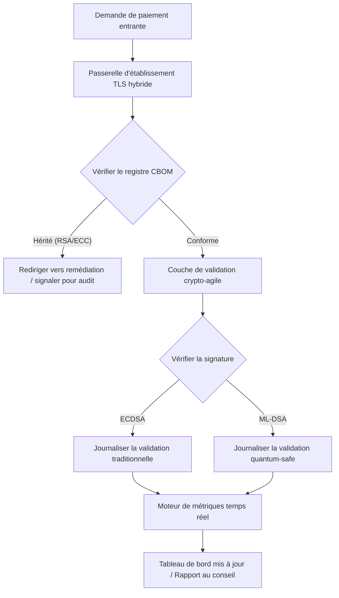

# Tableau de bord post-quantique 2026 : un cadre de métriques pour le conseil au service de l'agilité cryptographique fiduciaire

<aside class="post-lead" aria-label="Synthèse de l'article">

<strong>En bref.</strong> En juin 2026, la cryptographie post-quantique (PQC) est passée d'une préoccupation technique expérimentale à une obligation fiduciaire de premier rang. Les conseils doivent désormais superviser la migration systématique du chiffrement hérité vers les standards NIST FIPS 203 et 204, afin d'atténuer les risques financiers et opérationnels systémiques au titre de DORA.

<strong>Points clés à retenir</strong>

<ul class="post-lead-takeaways">
  <li><strong>Alignement G20 et échéances fermes.</strong> Les régulateurs internationaux ont fixé la fin des années 2020 comme échéance ferme pour les transitions quantum-safe, exigeant des institutions qu'elles démontrent une progression de migration quantifiable.</li>
  <li><strong>La nomenclature cryptographique (CBOM).</strong> Analogue à une nomenclature logicielle, un CBOM est un inventaire vivant et automatisé de tous les actifs cryptographiques, indispensable pour assurer la visibilité sur l'ensemble de la chaîne d'approvisionnement.</li>
  <li><strong>Exposition Harvest-Now-Decrypt-Later (HNDL).</strong> Des adversaires interceptent et stockent dès aujourd'hui des données de paiement de gros chiffrées de grande valeur ; atténuer ce risque exige le déploiement immédiat d'architectures PQC hybrides.</li>
  <li><strong>Gouvernance fiduciaire par l'agilité cryptographique.</strong> L'agilité cryptographique est une métrique de gouvernance mesurable. La capacité de substituer les primitives cryptographiques sans ré-ingénierie des systèmes centraux (à l'aide de bibliothèques comme KyberLib) relève désormais de la responsabilité personnelle au niveau du conseil au titre du SM&CR.</li>
</ul>

<strong>Lectures complémentaires :</strong> <a href="https://sebastienrousseau.com/2026-06-12-kyberlib-post-quantum-banking-migration-standards-code-2026">KyberLib et la migration bancaire post-quantique en 2026</a>, <a href="https://sebastienrousseau.com/2023-11-19-crystals-kyber-the-safeguarding-algorithm-in-a-quantum-age/index.html">CRYSTALS-Kyber : l'algorithme de protection à l'ère quantique</a>.

</aside>
La sécurité post-quantique n'est plus un projet de recherche. L'« horloge de surveillance » s'écoule vers les échéances de fin de décennie. La finalisation de [NIST FIPS 203 (ML-KEM)](https://csrc.nist.gov/pubs/fips/203/final) et de [NIST FIPS 204 (ML-DSA)](https://csrc.nist.gov/pubs/fips/204/final) a codifié les standards d'encapsulation de clés et de signatures numériques.

Les autorités de régulation attendent désormais des banques de premier rang qu'elles dépassent le stade des programmes pilotes. En 2026, l'attention s'est déplacée vers l'industrialisation de ces standards. L'incapacité à démontrer une trajectoire de migration claire entraîne de lourdes sanctions réglementaires au titre du [Digital Operational Resilience Act (DORA)](https://eur-lex.europa.eu/eli/reg/2022/2554/oj) et une responsabilité personnelle potentielle pour les dirigeants qui ignorent la menace prévisible du déchiffrement assisté par calcul quantique.

## 01. Le tableau de bord quantique au niveau du conseil

Les métriques qui suivent offrent aux conseils un cadre standardisé pour évaluer le niveau de préparation quantique et la santé cryptographique de l'ensemble des estates Commercial and Investment Banking (CIB).

### Tableau 1 : métriques et tolérances du tableau de bord PQC

| Métrique | Formule mathématique | Tolérances approuvées par le conseil | Risque en cas de dépassement |
| ---- | ---- | ---- | ---- |
| **Inventory Completeness Percentage (ICP)** | (Actifs cryptographiques identifiés / Actifs totaux estimés) × 100 | > 98 % | Chiffrement fantôme et angles morts dans les chemins de données de compensation à forte valeur. |
| **HNDL Exposure Rate (HER)** | (Données à longue durée de vie sous crypto héritée / Données totales à longue durée de vie) × 100 | < 5 % | Compromission permanente des secrets commerciaux, des livres de dette souveraine et des relevés de paiement de gros. |
| **NIST Migration Progress Rate (MPR)** | (Systèmes exécutant FIPS 203/204 / Systèmes critiques totaux) × 100 | > 60 % (à fin 2026) | Non-conformité réglementaire et exclusion des contreparties alignées G20. |
| **Crypto-Agility Readiness Index (CARI)** | (Applications avec couches cryptographiques abstraites / Applications centrales totales) × 100 | > 85 % | Dette technique sévère et incapacité à répondre aux futures dépréciations d'algorithmes. |

## 02. La nomenclature cryptographique (CBOM)

La métrique ICP est calibrée via une **phase de découverte CBOM** complète. Il s'agit d'un processus automatisé qui identifie chaque point d'usage cryptographique au sein de l'entreprise.

- **Découverte des endpoints :** balayage des réseaux internes et cloud pour repérer les sessions TLS actives reposant sur RSA ou ECC hérités.
- **Inventaire des clés :** cartographie des paires de clés publiques/privées vers leurs propriétaires respectifs et identification précise des dates d'expiration.
- **Cartographie des dépendances :** identification des bibliothèques et API tierces qui reposent sur des algorithmes dépréciés.

Cette phase de découverte crée une source unique de vérité, permettant au CISO de rendre compte de la santé cryptographique avec la même granularité que la performance financière.

## 03. Éliminer l'exposition HNDL dans les paiements de gros

Les adversaires ciblent activement les paiements de gros et les bases de données d'entreprise à longue durée de vie. Ces attaques « Harvest-Now-Decrypt-Later » (HNDL) consistent à intercepter et archiver le trafic chiffré d'aujourd'hui.

Même si aucun ordinateur quantique cryptographiquement pertinent (CRQC) n'existe à ce jour, les données interceptées maintenant seront vulnérables demain. Atténuer ce risque exige une migration hautement prioritaire des données à longue durée de vie (par exemple : registres d'identité, contrats d'obligations à 30 ans, archives juridiques), ce qui réduit directement la métrique HER. La mise à niveau des canaux de paiement vers un chiffrement hybride PQC-traditionnel (ML-KEM associé à X25519) offre une défense immédiate contre les menaces d'archivage.

## 04. Opérationnaliser l'agilité cryptographique via des interfaces bien conçues

L'agilité cryptographique se concrétise par des abstractions d'ingénierie. Des bibliothèques modernes comme [KyberLib](https://sebastienrousseau.com/2026-06-12-kyberlib-post-quantum-banking-migration-standards-code-2026) montrent comment les développeurs peuvent implémenter des modules quantum-safe sans réécrire toute la pile applicative.

- **Wrappers abstraits :** les applications appellent une fonction générique `encrypt()` ou `sign()` plutôt que des routines spécifiques à un algorithme.
- **Substitution à l'exécution :** le module sous-jacent peut être basculé d'ECDSA vers ML-DSA par simple changement de configuration plutôt que par des déploiements de code complexes.

Cette architecture garantit que, si un algorithme PQC particulier est compromis à l'avenir, l'organisation peut pivoter en heures plutôt qu'en années.

## 05. Le flux de validation d'ingress quantum-safe

Le schéma ci-dessous illustre le cycle de vie des données entrant dans le périmètre sécurisé d'un environnement bancaire quantum-agile.

## Conclusion

L'estate cryptographique d'une banque de premier rang n'est plus l'affaire du seul CISO. C'est une infrastructure fiduciaire. NIST FIPS 203 et 204 fixent les algorithmes ; l'article 5 de DORA fixe la surface de responsabilité ; le SM&CR la rattache à un dirigeant nommément désigné. Le tableau de bord ci-dessus — complétude de l'inventaire, exposition HNDL, progression de la migration, agilité cryptographique — donne au conseil les quatre chiffres nécessaires pour gouverner cet estate sans avoir à lire le code cryptographique.

Le chiffre qui compte le plus est l'exposition HNDL. Chaque enregistrement chiffré en mode hérité qui dort aujourd'hui dans une archive de paiements de gros sera lisible le jour où le premier ordinateur quantique cryptographiquement pertinent sera livré. Le compte à rebours est silencieux et asymétrique : les défenseurs ne peuvent agir que sur les données qu'ils détiennent, les adversaires peuvent agir sur des données qu'ils ont déjà exfiltrées il y a des années. Un contrat d'obligation d'entreprise à 30 ans chiffré en RSA-2048 en 2024 est un contrat qui perd sa garantie de confidentialité le jour où un CRQC entre en service.

[KyberLib](https://sebastienrousseau.com/2026-06-12-kyberlib-post-quantum-banking-migration-standards-code-2026) et ses pairs font passer ce dossier d'une réécriture de plateforme pluriannuelle à un changement de configuration. Le travail du conseil n'est pas d'écrire le code. Le travail du conseil est d'exiger que le Crypto-Agility Readiness Index — la part des applications centrales placées derrière une interface cryptographique abstraite — franchisse les 85 % en douze mois, et de lire le tableau de bord trimestriel.

<aside class="author-card" aria-label="À propos de l'auteur"><strong class="author-card-name"><a href="/about/index.html">Sebastien Rousseau</a></strong>Technologue bancaire senior écrivant sur l'IA appliquée, la migration ISO 20022, la cryptographie post-quantique pour les services financiers et la transformation structurelle des paiements de gros.Plus de 20 ans chez HSBC Commercial & Investment Bank, PayPal, Barclays, Shazam. <a href="https://www.linkedin.com/in/sebastienrousseau/" rel="external noopener">LinkedIn</a> &middot; <a href="https://github.com/sebastienrousseau" rel="external noopener">GitHub</a></aside>

Dernière revue <time datetime="2026-06-29">2026-06-29</time>.

