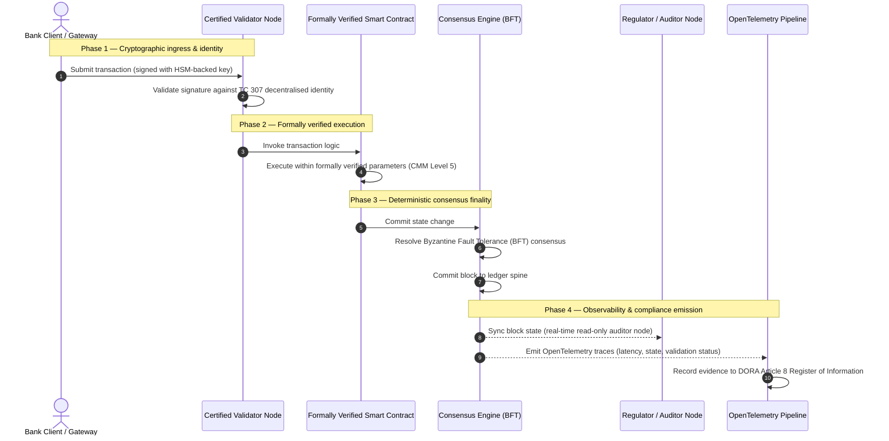

# De la preuve à la vérité : pourquoi les blockchains certifiées définiront la prochaine ère de la confiance bancaire

## Résumé stratégique (l'essentiel)

La banque de gros et les transactions mondiales se trouvent, en 2026, à un tournant historique. À mesure que les services financiers migrent vers des réseaux de compensation nativement numériques et en temps réel, et que l'intelligence artificielle introduit un indéterminisme probabiliste, les modèles d'assurance traditionnels — analogiques et rétrospectifs (tels que les audits statiques fondés sur l'entité) — ne répondent plus aux exigences modernes de gestion des risques et de responsabilité fiduciaire.

Le comité technique ISO/IEC TC 307 a établi une base normalisée pour les technologies de registre distribué. Toutefois, une véritable adoption institutionnelle exige de passer d'une orientation descriptive à une assurance blockchain prescriptive et certifiable de manière indépendante. En notant la gouvernance du registre, l'intégrité du consensus, la sûreté des contrats intelligents et l'agilité cryptographique au regard d'un modèle de maturité (CMM) strict à cinq niveaux, les banques peuvent passer d'hypothèses disparates et propres à chaque fournisseur à une vérité financière certifiable et auditable par le conseil.

## Points clés

* **L'écart frictionnel fiduciaire** : nous savons aujourd'hui certifier la banque (Bâle III), le cloud (ISO 27001) et les systèmes de gouvernance de l'IA (ISO 42001), mais nous ne savons pas encore certifier le registre distribué qui détermine de plus en plus ce qui est vrai. Cette asymétrie constitue une vulnérabilité opérationnelle majeure.  
* **DORA impose une responsabilité fiduciaire directe** : au titre de l'article 5 de DORA, les conseils d'administration des banques assument une responsabilité personnelle directe et non délégable quant à la résilience opérationnelle de tous les déploiements de tiers et de registres, avec de lourdes sanctions personnelles au titre du régime SM&CR en cas de défaillance.  
* **La colonne vertébrale d'audit de l'IA** : là où l'apprentissage automatique produit des résultats probabilistes et non reproductibles, une blockchain certifiée fournit une capture d'état déterministe. Consigner sur la chaîne les versions de modèles, les entrées et les décisions de validation satisfait aux normes ISO 42001 et de gestion du risque de modèle.  
* **L'Indice des blockchains certifiées** : cet indice formalise la gouvernance, le consensus, les contrats intelligents et l'observabilité en un tableau de bord vérifiable et prêt pour l'audit, sur une échelle CMM de 0 à 5, traduisant des métriques d'ingénierie en déclarations d'appétence au risque approuvées par le conseil.

## 01. L'écart frictionnel fiduciaire dans la banque numérique

Dans la banque classique, la confiance est relationnelle, institutionnelle et rétrospective. Elle repose sur des auditeurs tiers indépendants qui examinent l'état financier à des instants figés, en réconciliant les écarts entre des silos de registres bilatéraux. Sur les marchés en temps réel et pilotés par API de 2026, ce modèle introduit des latences prohibitives et des risques structurels.

Lorsque les transactions se règlent instantanément, que les réserves de liquidité intrajournalières sont gérées dynamiquement par des passerelles d'API et que la propriété des actifs est tokenisée sur des registres partagés, les audits rétrospectifs deviennent des exercices de criminalistique plutôt que des contrôles préventifs. Les fiduciaires ne peuvent plus se contenter de certifier l'entité juridique. Ils doivent certifier le substrat numérique lui-même.

Aujourd'hui, les banques opèrent sous une asymétrie architecturale flagrante :

1. **Infrastructure cloud certifiée** : les nœuds matériels, les conteneurs virtualisés et les centres de données physiques sont validés au regard des contrôles ISO/IEC 27001 et SOC 2 Type II.  
2. **Processus de gestion certifiés** : les politiques de risque opérationnel, les plans de continuité d'activité et les déploiements algorithmiques sont régis par des cadres de risque stricts.  
3. **Moteurs de registre non certifiés** : les mécanismes de consensus distribué, les chaînes d'approvisionnement des nœuds validateurs, les frontières des contrats intelligents et les modèles de gouvernance de réseau sont laissés à des hypothèses non certifiées, propres à chaque acteur ou consortium.

Cette asymétrie est un point de défaillance majeur. Une banque peut exécuter une application validée dans un conteneur cloud sécurisé et certifié ISO 27001, mais si ce conteneur écrit dans un registre distribué à contrôle centralisé des validateurs, aux paramètres de consensus vulnérables ou aux contrats intelligents non audités, l'intégrité de la transaction est compromise. Pour combler cet écart, le moteur de registre lui-même doit devenir un objet d'assurance certifiable.

## 02. La base de normalisation ISO/IEC TC 307

Le travail de fond nécessaire à la normalisation des registres distribués est mené par le comité technique ISO/IEC TC 307 (Technologies de la blockchain et des registres distribués). Plutôt que de traiter la blockchain comme un protocole technique isolé, le TC 307 l'aborde comme une infrastructure de confiance institutionnelle, en organisant ses travaux autour de cinq piliers fondamentaux :

1. **Taxonomie et vocabulaire (ISO 22739)** : établit une nomenclature commune, garantissant des définitions juridiques et opérationnelles cohérentes entre juridictions, dispositifs financiers et institutions.  
2. **Architecture de référence (ISO/TR 23245)** : définit les frontières, couches, flux de données et composants fonctionnels d'un système de registre distribué conforme.  
3. **Sécurité, confidentialité et contrats intelligents (ISO/TR 23244 / ISO 23613)** : établit des lignes directrices de sécurité de base pour les systèmes d'actifs numériques et détaille les bonnes pratiques d'atténuation des vulnérabilités des contrats intelligents et de gouvernance de leur cycle de vie.  
4. **Cadres d'interopérabilité** : traite des mécanismes d'échange de données et d'actifs entre réseaux de registres hétérogènes, prévenant la formation de silos tokenisés isolés.  
5. **Identité décentralisée et ancres de confiance** : intègre les identifiants cryptographiques fondés sur le registre à des infrastructures à clé publique (PKI) formelles et à des registres agréés par l'État.

Collectivement, le TC 307 marque le passage de la DLT d'un choix d'ingénierie sur mesure à une discipline architecturale normalisée. Néanmoins, le TC 307 demeure essentiellement descriptif. Il définit ce à quoi ressemble l'excellence (l'orientation), mais ne fournit pas le protocole de vérification prescriptif (l'assurance) dont les responsables des risques et les superviseurs ont besoin pour autoriser le déploiement en production de fonctions critiques ou importantes (CIF).

## 03. Orientation ou assurance : la distinction fiduciaire

Les acteurs des marchés financiers ne déploient pas une technologie parce qu'elle est innovante ou élégante ; ils la déploient lorsqu'elle peut être gouvernée, auditée, défendue et réconciliée avec les exigences de fonds propres. C'est pourquoi la normalisation bancaire se résout naturellement en deux couches :

* **Orientation (le cadre)** : décrit les bonnes pratiques, les cibles de référence et les lignes directrices architecturales (par ex. ISO/IEC TC 307, cadres du NIST).  
* **Assurance (la preuve)** : fournit des éléments probants indépendants, continus et vérifiables par un tiers, attestant que le cadre est mis en œuvre et fonctionne comme prévu (par ex. certification ISO 27001, audits SOC 2, examens réglementaires).

S'appuyer sur un consensus de registre non certifié tout en certifiant l'infrastructure cloud constitue une lacune réglementaire critique. Une blockchain « immuable » n'est pas nécessairement « institutionnellement digne de confiance ». L'immuabilité garantit seulement que la donnée saisie demeure inchangée ; elle ne vérifie pas que les nœuds validateurs sont sûrs, que le protocole de consensus résiste à la collusion, que la logique des contrats intelligents est mathématiquement solide ou que la gestion des clés cryptographiques respecte les mandats post-quantiques.

Pour combler cet écart, l'Indice des blockchains certifiées 2026 formalise ces exigences en un modèle de maturité (CMM) quantifiable, mis en correspondance avec les réglementations bancaires mondiales.

## 04. L'Indice des blockchains certifiées 2026

Pour permettre à la direction générale d'évaluer et de certifier ses plateformes de registre, cet indice structure l'infrastructure de registre distribué en cinq couches opérationnelles auditables, notées sur une échelle CMM de 0 à 5.

## Tableau 1 : l'architecture de l'Indice des blockchains certifiées

| Couche de l'indice | Niveau de maturité (CMM) | Métrique technique et opérationnelle | Référence de contrôle réglementaire / fiduciaire |
| ---- | ---- | ---- | ---- |
| **Gouvernance du registre** | **Niveau 0** : consortium ad hoc**Niveau 3** : vérification et rotation automatisées des validateurs**Niveau 5** : ancrage d'identité cryptographique décentralisé et multipartite | % de nœuds validateurs exploités par des entités financières vérifiées ; délai moyen de résolution des litiges entre validateurs ; répartition géographique des nœuds | **DORA article 5** (Gouvernance et organisation) ; **CPMI-IOSCO PFMI Principe 2** (Gouvernance) et **Principe 3** (Cadre de gestion globale des risques) |
| **Intégrité du consensus** | **Niveau 0** : nœud unique ou PoW opaque**Niveau 3** : BFT audité à finalité déterministe**Niveau 5** : consensus multi-juridictionnel, formellement vérifié, avec surveillance continue de la latence | Latence de consensus maximale tolérable ; seuil de résistance à la collusion ; SLA de disponibilité en cas de partition simulée des nœuds | **DORA article 6** (Cadre de gestion du risque lié aux TIC) ; **CPMI-IOSCO PFMI Principe 8** (Caractère définitif du règlement) |
| **Identité et cryptographie** | **Niveau 0** : clés RSA / ECDSA faibles**Niveau 3** : multi-signature avec gestion de clés adossée à un HSM**Niveau 5** : clés hybrides résistantes au quantique (FIPS 203 ML-KEM) et portes de confidentialité à divulgation nulle de connaissance | % de transactions du registre signées avec des clés adossées à un HSM ; score de préparation à la migration PQC ; latence des preuves ZK | **NIST FIPS 203 / 204** ; **ISO/IEC 27001** (Gestion de la sécurité de l'information) |
| **Assurance des contrats intelligents** | **Niveau 0** : scripts Solidity non audités**Niveau 3** : validation automatisée du compilateur et audit externe**Niveau 5** : contrats intelligents immuables et formellement vérifiés, avec mises à niveau à disjoncteur | % de contrats intelligents faisant l'objet d'une vérification formelle mathématique ; nombre d'avertissements du compilateur ; couverture des analyses de vulnérabilité | **Orientations de l'EBA sur l'externalisation** (paragraphes 81, 113-117) ; **DORA article 30** (Clauses contractuelles minimales) |
| **Audit et observabilité** | **Niveau 0** : extraction manuelle des journaux**Niveau 3** : traces OTel structurées et nœuds auditeurs en lecture seule**Niveau 5** : réconciliation automatisée et continue avec le registre de l'article 8 | % de transactions couvertes par des traces OpenTelemetry ; latence entre la validation d'un bloc et la synchronisation du nœud auditeur | **BCBS 239** (Agrégation des données sur les risques) ; **DORA article 8** (Registre d'informations / schémas ITS) |

## Tableau 2 : signaux de confiance clés mis en correspondance avec les normes bancaires mondiales

| Signal / référence | Métrique | Impact sur les plateformes bancaires | Source réglementaire |
| ---- | ---- | ---- | ---- |
| **Progression ISO/IEC TC 307** | Passage des rapports techniques ISO/TR à des schémas de certification formels | Établit le premier cadre normalisé de certification des moteurs de registre distribué | **ISO/IEC JTC 1 / SC 44** (Technologies des registres distribués) |
| **Phase prototype du Projet Agorá** | Plus de 40 banques commerciales participantes ; test d'un registre unifié de dépôts tokenisés | Fait passer la compensation transfrontalière de la messagerie (SWIFT) au règlement atomique tokenisé | **Pôle d'innovation de la Banque des règlements internationaux (BRI)** |
| **Audit tiers DORA article 30** | 100 % des fournisseurs de nœuds et des hébergeurs d'infrastructure audités selon des critères de sécurité | Élimine les « nœuds validateurs fantômes » ; impose une transparence totale de la chaîne d'approvisionnement | **Autorités européennes de surveillance (AES)** |
| **ISO/IEC 42001 (gouvernance de l'IA)** | Journaux de modèles et d'entraînement d'IA rendus immuables cryptographiquement sur la chaîne | Emploie la blockchain comme registre probatoire immuable (« colonne vertébrale d'audit ») pour l'apprentissage automatique | **ISO/IEC 42001:2023** (Technologies de l'information — Intelligence artificielle) |
| **Adéquation des fonds propres Bâle III** | Réduction des coussins de fonds propres pour risque opérationnel fondée sur une réduction documentée de la complexité | Les cadres normalisés de risque opérationnel valorisent directement la résilience vérifiée du registre | **Comité de Bâle sur le contrôle bancaire (CBCB)** |

## 05. La « colonne vertébrale d'audit » de l'IA : intelligence probabiliste sur infrastructure déterministe

L'un des rôles stratégiques les plus puissants d'une blockchain certifiée en 2026 est d'agir comme **« colonne vertébrale d'audit »** des déploiements d'intelligence artificielle. Les systèmes financiers modernes sont de plus en plus probabilistes. La notation de crédit, la détection de fraude en temps réel, le trading algorithmique et les interactions client autonomes sont pilotés par des modèles d'apprentissage automatique qui évoluent, dérivent et s'adaptent dans le temps. Ces modèles sont non déterministes : pour une même entrée à deux instants différents, ils peuvent produire des sorties différentes en raison de poids dynamiques et d'un entraînement continu.

Ce non-déterminisme soulève un défi de gouvernance profond au titre de l'**ISO/IEC 42001 (gouvernance de l'IA)** et des normes de gestion du risque de modèle (MRM) (telles que la **SR 11-7 de la Réserve fédérale américaine** et la **SS1/23 de la PRA britannique**) : *comment auditer, expliquer et défendre des décisions qui ne sont pas strictement reproductibles ?*

Un registre distribué certifié apporte le contrepoids déterministe. Là où les modèles d'IA opèrent de manière probabiliste, la blockchain certifiée enregistre leurs paramètres de manière déterministe, établissant une colonne vertébrale probante inaltérable :

* **Versionnage des modèles et ancrage des poids** : chaque version de modèle déployée, ses poids associés et les sommes de contrôle de ses données d'entraînement sont hachés et écrits sur le registre au moment de la construction, satisfaisant aux exigences de chaîne d'approvisionnement **SLSA niveau 3**.  
* **Journalisation contextuelle des entrées** : lorsqu'un modèle d'IA exécute une décision critique (par ex. approuver un prêt ou signaler une transaction), les entrées contextuelles exactes et les empreintes du modèle sont écrites sur le registre, créant un historique inviolable.  
* **Auditabilité sans accès au code** : si un régulateur demande « pourquoi votre modèle a-t-il rejeté cette demande de crédit le 3 juin ? », la banque n'a pas besoin d'exposer son code propriétaire ni de tenter de recréer l'état exact du modèle. Elle présente l'enregistrement sur la chaîne, signé cryptographiquement, des entrées, des poids et de l'état de validation.

En ancrant les décisions probabilistes des modèles d'apprentissage automatique au consensus déterministe d'une blockchain certifiée, l'institution crée une chronologie des actions automatisées défendable, reconstructible et vérifiable de manière indépendante.

## 06. Visualiser le pipeline certifié du consensus à l'audit

Le diagramme de séquence suivant illustre le cycle de vie d'une transaction traversant une plateforme de blockchain certifiée, montrant comment les portes de validation, l'intégrité du consensus, l'exécution des contrats intelligents et l'émission de télémétrie s'imbriquent pour produire des éléments probants réglementaires prêts pour le conseil :

Le chemin critique de cette séquence transactionnelle exige que chaque étape de validation, d'exécution et de consensus soit signée cryptographiquement, garantissant une provenance de bout en bout. Le nœud auditeur du régulateur synchronise l'état des blocs en temps réel, supprimant le besoin de réconciliation financière manuelle et rétrospective.

## 07. Le manuel du conseil pour les cadres dirigeants

Pour réussir la transition de la confiance organisationnelle vers la confiance infrastructurelle, les dirigeants et cadres supérieurs des banques devraient exécuter sans délai quatre directives clés :

1. **Rendre obligatoires les audits de registre dans la gestion des risques d'entreprise (ERM)** : imposer une politique selon laquelle aucune plateforme de registre distribué — privée, publique ou de consortium — ne peut être déployée pour des fonctions critiques ou importantes (CIF) sans avoir été auditée au regard de l'**architecture de l'Indice des blockchains certifiées** à cinq couches (CMM niveau 3 minimum).  
2. **Intégrer les blockchains comme colonne vertébrale probante de l'IA ISO 42001** : charger le directeur des risques et l'architecte IA principal d'intégrer tous les modèles d'apprentissage automatique à fort impact à une blockchain certifiée, créant un registre d'audit inviolable des versions de modèles, des poids, des entrées et des décisions.  
3. **Auditer la chaîne d'approvisionnement des nœuds validateurs (DORA article 30)** : exiger de la direction des achats qu'elle audite toutes les entités tierces hébergeant des nœuds validateurs ou gérant l'hébergement cloud des réseaux DLT, en imposant les mêmes normes de cybersécurité et de résilience opérationnelle que celles appliquées aux nœuds cloud internes de la banque.  
4. **Aligner les architectures de registre sur les principes CPMI-IOSCO et BCBS 239** : demander à l'équipe d'ingénierie plateforme d'aligner la télémétrie de sortie du registre directement sur les exigences de reporting de données **BCBS 239**, et de s'assurer que les paramètres de consensus et de finalité du règlement respectent strictement les **principes 8 et 9 de CPMI-IOSCO**.

## 08. Foire aux questions

**L'ISO/IEC TC 307 est-il une norme de certification ?**  
Non. L'ISO/IEC TC 307 est un comité technique qui établit un vocabulaire, des architectures de référence et des lignes directrices de sécurité. S'il définit « ce à quoi ressemble l'excellence » (l'orientation), l'industrie doit rendre ces documents opérationnels en schémas de certification formels et auditables (l'assurance) pour satisfaire les superviseurs bancaires.

**En quoi une blockchain certifiée soutient-elle la conformité à DORA ?**  
Au titre de l'article 5 de DORA, les conseils d'administration des banques assument une responsabilité personnelle directe quant à la résilience technologique. Une blockchain certifiée fournit des preuves cryptographiques et vérifiables de l'intégrité du consensus, du contrôle de la chaîne d'approvisionnement des validateurs et de la sûreté des contrats intelligents, donnant aux membres du conseil les « mesures raisonnables » documentables nécessaires pour se défendre contre les mises en cause de leur responsabilité personnelle au titre du SM&CR.

Quelle est la différence entre un audit de registre traditionnel et un audit de blockchain certifiée ?  
Un audit traditionnel est rétrospectif : il vérifie des écritures manuelles et des fichiers statiques après le règlement des transactions. Un audit de blockchain certifiée est continu et en temps réel ; les nœuds validateurs, le moteur de consensus BFT et les contrats intelligents formellement vérifiés sont certifiés pour exécuter les transactions de manière déterministe, en émettant une télémétrie structurée (OpenTelemetry) qui valide en continu la santé du système.

Les blockchains publiques peuvent-elles être certifiées pour un usage bancaire ?  
Dans la plupart des juridictions, les blockchains publiques purement sans permission ne satisfont pas aux réglementations bancaires en raison de l'absence de vérification de l'identité des validateurs, de coûts de transaction imprévisibles et d'une finalité non déterministe (par ex. forks probabilistes de preuve de travail/d'enjeu). Les blockchains certifiées dans la banque utilisent généralement des architectures d'entreprise avec permission ou hybrides publiques fortement réglementées, où les opérateurs de nœuds validateurs sont des entités financières identifiées et auditées.

## 09. Références

* Comité de Bâle sur le contrôle bancaire (CBCB), 2013. *Principles for effective risk data aggregation and reporting (BCBS 239)*. Bâle : Banque des règlements internationaux. Disponible à : [https://www.bis.org/publ/bcbs239.pdf](https://www.bis.org/publ/bcbs239.pdf).  
* Committee on Payments and Market Infrastructures et Technical Committee of the International Organization of Securities Commissions (CPMI-IOSCO), 2012. *Principles for financial market infrastructures*. Bâle : Banque des règlements internationaux. Disponible à : [https://www.bis.org/cpmi/publ/d101a.pdf](https://www.bis.org/cpmi/publ/d101a.pdf).  
* Autorité bancaire européenne (ABE), 2019. *EBA/GL/2019/02 — Guidelines on outsourcing arrangements*. Paris : ABE. Disponible à : [https://www.eba.europa.eu/regulation-and-policy/internal-governance/guidelines-on-outsourcing-arrangements](https://www.eba.europa.eu/regulation-and-policy/internal-governance/guidelines-on-outsourcing-arrangements).  
* Parlement européen et Conseil de l'Union européenne, 2022. *Règlement (UE) 2022/2554 sur la résilience opérationnelle numérique du secteur financier (DORA)*. Bruxelles : Journal officiel de l'Union européenne. Disponible à : [https://eur-lex.europa.eu/legal-content/FR/TXT/?uri=CELEX%3A32022R2554](https://eur-lex.europa.eu/legal-content/FR/TXT/?uri=CELEX%3A32022R2554).  
* ISO/IEC JTC 1/SC 42, 2023. *ISO/IEC 42001:2023 — Information technology — Artificial intelligence — Management system*. Genève : Organisation internationale de normalisation. Disponible à : [https://www.iso.org/standard/81230.html](https://www.iso.org/standard/81230.html).  
* Comité technique ISO/IEC 307, 2020. *ISO/IEC 22739:2020 — Blockchain and distributed ledger technologies — Vocabulary*. Genève : Organisation internationale de normalisation. Disponible à : [https://www.iso.org/standard/73771.html](https://www.iso.org/standard/73771.html).  
* National Institute of Standards and Technology (NIST), 2026. *First Three Finalized Post-Quantum Encryption Standards (FIPS 203, 204, and 205)*. Gaithersburg : U.S. Department of Commerce. Disponible à : [https://www.nist.gov/news-events/news/2024/08/nist-releases-first-3-finalized-post-quantum-encryption-standards](https://www.nist.gov/news-events/news/2024/08/nist-releases-first-3-finalized-post-quantum-encryption-standards).
