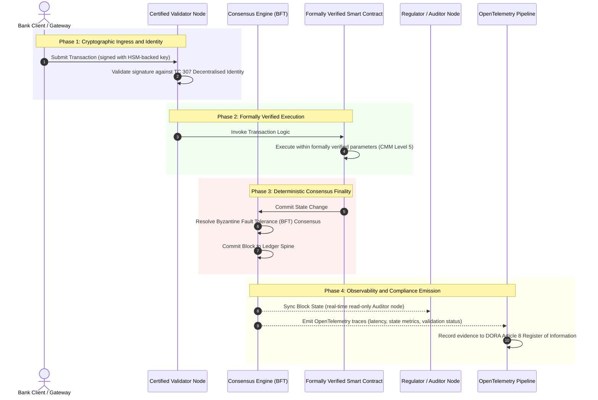

# De la preuve à la vérité : pourquoi les blockchains certifiées définiront la prochaine ère de la confiance bancaire

**Immuable ne signifie pas digne de confiance.** À mesure que la banque de gros passe au règlement en temps réel et à l'IA probabiliste, le registre qui décide de ce qui est vrai est devenu la seule couche que les banques ne parviennent toujours pas à certifier. Elles certifient l'entité au titre de Basel III, le cloud au titre d'ISO 27001 et leur IA au titre d'ISO 42001, mais le registre distribué, sa gouvernance, son consensus, sa cryptographie et ses contrats intelligents, restent livrés à des hypothèses propres à chaque fournisseur. Ce rapport soutient que combler cet écart fiduciaire suppose de passer des orientations ISO/IEC TC 307 à une assurance prescriptive : noter le registre selon un Index de blockchain certifiée à 5 niveaux qui transforme les métriques d'ingénierie en une vérité auditable par le conseil et défendable au titre de DORA.

<!-- lead-start -->
<aside class="post-lead" aria-label="Résumé de l'article">

<strong>En bref.</strong> Les banques certifient l'entité, le cloud et leur IA, mais pas le registre qui détermine de plus en plus ce qui est vrai. ISO/IEC TC 307 fournit des orientations, pas de l'assurance. Un Index de blockchain certifiée à 5 niveaux note la gouvernance du registre, l'intégrité du consensus, l'identité et la cryptographie, l'assurance des contrats intelligents et l'observabilité selon un modèle de maturité des capacités, comblant l'écart fiduciaire et donnant à l'IA probabiliste une colonne vertébrale d'audit déterministe.

<strong>Points clés</strong>

<ul class="post-lead-takeaways">
  <li><strong>L'écart de friction fiduciaire.</strong> La banque (Basel III), le cloud (ISO 27001) et le système de gouvernance de l'IA (ISO 42001) peuvent être certifiés ; le registre distribué qui décide de ce qui est vrai ne peut pas encore l'être. Cette asymétrie est une vulnérabilité opérationnelle bien réelle.</li>
  <li><strong>DORA engage la responsabilité personnelle.</strong> Au titre de DORA Article 5, les conseils d'administration des banques portent une responsabilité directe et non délégable de la résilience des déploiements tiers et de registres, avec des sanctions personnelles SM&amp;CR en cas de manquement.</li>
  <li><strong>La colonne vertébrale d'audit de l'IA.</strong> L'apprentissage automatique n'est pas reproductible ; une blockchain certifiée capture de manière déterministe et on-chain les versions de modèles, les entrées et les décisions de validation, satisfaisant ISO 42001 et les normes de gestion du risque de modèle.</li>
  <li><strong>L'Index de blockchain certifiée.</strong> La gouvernance, le consensus, la cryptographie, les contrats intelligents et l'observabilité deviennent une grille de notation CMM de 0 à 5 qui traduit les métriques d'ingénierie en déclarations d'appétence au risque approuvées par le conseil.</li>
</ul>

<strong>À lire également :</strong> <a href="https://sebastienrousseau.com/2026-07-02-certified-blockchains-banking-trust-tc307-assurance-2026">Blockchains certifiées et confiance bancaire : l'assurance TC 307</a>, <a href="https://sebastienrousseau.com/2026-07-24-global-payments-outlook-operating-model-risk-revenue">Les perspectives mondiales des paiements pour 2026</a>.

</aside>
<!-- lead-end -->

> **Synthèse pour dirigeants**
>
> - **La banque de gros est à un point d'inflexion.** La compensation en temps réel et l'IA probabiliste font voler en éclats le modèle d'assurance analogique et rétrospectif : les audits statiques, fondés sur l'entité, ne répondent plus aux exigences modernes de gestion du risque ni aux exigences fiduciaires.
> - **TC 307 est une base, pas un certificat.** ISO/IEC TC 307 a normalisé le vocabulaire, l'architecture de référence et les orientations de sécurité pour les registres distribués, mais il reste descriptif. Il définit ce à quoi ressemble le bon niveau ; il ne fournit pas la vérification prescriptive dont les responsables des risques et les superviseurs ont besoin pour autoriser un déploiement en production.
> - **L'assurance consiste à noter le registre.** La gouvernance, l'intégrité du consensus, la sûreté des contrats intelligents et l'agilité cryptographique, notées selon un modèle de maturité des capacités strict à 5 niveaux, font passer les banques d'hypothèses disparates et propres aux fournisseurs à une vérité financière certifiable et auditable par le conseil.
> - **Le registre est la colonne vertébrale d'audit de l'IA.** Ancrer les versions de modèles, les entrées et les décisions de validation à un consensus déterministe donne à un apprentissage automatique non reproductible un dossier probant défendable et reconstructible au titre d'ISO 42001, de SR 11-7 et de la PRA SS1/23.

## L'écart de friction fiduciaire dans la banque numérique

Dans la banque classique, la confiance est relationnelle, institutionnelle et rétrospective. Elle repose sur des auditeurs tiers indépendants qui examinent l'état financier à des instants statiques, en réconciliant les écarts entre des silos de registres bilatéraux. Sur les marchés en temps réel et pilotés par API de 2026, ce modèle introduit des latences prohibitives et des risques structurels.

Lorsque les transactions se règlent instantanément, que les réserves de liquidité intrajournalières sont gérées dynamiquement par des passerelles API et que la propriété des actifs est tokenisée à travers des registres partagés, les audits rétrospectifs deviennent des exercices médico-légaux plutôt que des contrôles préventifs. Les fiduciaires ne peuvent plus se contenter de certifier l'entité juridique. Ils doivent certifier le substrat numérique lui-même.

Actuellement, les banques opèrent sous une asymétrie architecturale flagrante :

1. **Infrastructure cloud certifiée** : les nœuds matériels, les conteneurs virtualisés et les centres de données physiques sont validés selon les contrôles ISO/IEC 27001 et SOC 2 Type II.  
2. **Processus de gestion certifiés** : les politiques de risque opérationnel, les plans de continuité d'activité et les déploiements algorithmiques sont régis par des cadres de risque stricts.  
3. **Moteurs de registre non certifiés** : les mécanismes centraux de consensus distribué, les chaînes d'approvisionnement des nœuds validateurs, les limites des contrats intelligents et les modèles de gouvernance du réseau sont laissés à des hypothèses non certifiées, sur mesure ou propres au consortium.

Cette asymétrie constitue un point de défaillance majeur. Une banque peut exécuter une application validée à l'intérieur d'un conteneur cloud sécurisé et certifié ISO 27001, mais si ce conteneur écrit sur un registre distribué au contrôle des validateurs centralisé, aux paramètres de consensus vulnérables ou aux contrats intelligents non audités, l'intégrité de la transaction est compromise. Pour combler cet écart, le moteur de registre lui-même doit devenir un objet d'assurance certifiable.

## La base de normalisation ISO/IEC TC 307

Le travail fondamental nécessaire à la normalisation des registres distribués est établi par le comité technique ISO/IEC 307 (TC 307\) (Blockchain and distributed ledger technologies). Plutôt que de traiter la blockchain comme un protocole technique isolé, le TC 307 l'aborde comme une infrastructure de confiance institutionnelle, en organisant ses travaux autour de cinq piliers fondamentaux :

1. **Taxonomie et vocabulaire (ISO 22739\)** : établit une nomenclature commune, garantissant des définitions juridiques et opérationnelles cohérentes entre différentes juridictions, dispositifs financiers et institutions.  
2. **Architecture de référence (ISO/TR 23245\)** : définit les limites, les couches, les flux de données et les composants fonctionnels d'un système de registre distribué conforme.  
3. **Sécurité, confidentialité et contrats intelligents (ISO/TR 23244 / ISO 23613\)** : établit des lignes directrices de sécurité de base pour les systèmes d'actifs numériques et détaille les meilleures pratiques pour l'atténuation des vulnérabilités des contrats intelligents et la gouvernance de leur cycle de vie.  
4. **Cadres d'interopérabilité** : traite des mécanismes d'échange de données et d'actifs entre réseaux de registres hétérogènes, prévenant la formation de silos tokenisés isolés.  
5. **Identité décentralisée et ancres de confiance** : intègre les identifiants cryptographiques fondés sur le registre à des infrastructures formelles à clé publique (PKI) et à des registres autorisés par l'État.

Collectivement, le TC 307 marque la transition de la DLT d'un choix d'ingénierie sur mesure vers une discipline architecturale normalisée. Cependant, le TC 307 reste principalement descriptif. Il définit ce à quoi ressemble le bon niveau (orientations), mais il ne fournit pas le protocole de vérification prescriptif (assurance) dont les responsables des risques et les superviseurs ont besoin pour autoriser les déploiements en production de fonctions critiques ou importantes (CIFs).

## Orientations vs assurance : la distinction fiduciaire

Les acteurs des marchés financiers ne déploient pas une technologie parce qu'elle est innovante ou élégante ; ils la déploient lorsqu'elle peut être gouvernée, auditée, défendue et réconciliée avec les exigences de réserves de capital. C'est pourquoi la normalisation dans la banque se résout naturellement en deux couches :

* **Orientations (le cadre)** : décrivent les meilleures pratiques, les cibles de référence et les lignes directrices architecturales (par ex. ISO/IEC TC 307, cadres du NIST).  
* **Assurance (la preuve)** : fournit des preuves indépendantes, continues et vérifiables par des tiers que le cadre est mis en œuvre et fonctionne comme prévu (par ex. certification ISO 27001, audits SOC 2, examens réglementaires).

S'appuyer sur un consensus de registre non certifié tout en certifiant l'infrastructure cloud constitue un écart réglementaire critique. Une blockchain « immuable » n'est pas nécessairement « institutionnellement digne de confiance ». L'immuabilité garantit uniquement que les données saisies restent inchangées ; elle ne vérifie pas que les nœuds validateurs sont sécurisés, que le protocole de consensus résiste à la collusion, que la logique des contrats intelligents est mathématiquement solide ou que la gestion des clés cryptographiques respecte les mandats post-quantiques.

Pour combler cet écart, l'Index de blockchain certifiée 2026 formalise ces exigences en un modèle de maturité des capacités (CMM) quantifiable, mis en correspondance avec les réglementations bancaires mondiales.

## L'Index de blockchain certifiée 2026

Pour permettre à la direction générale d'évaluer et de certifier ses plateformes de registre, cet index structure l'infrastructure de registre distribué en cinq couches opérationnelles auditables, notées sur une échelle CMM de 0 à 5.

### Tableau 1 : L'architecture de l'Index de blockchain certifiée

| Couche de l'index | Niveau de maturité des capacités (CMM) | Métrique technique et opérationnelle | Référence de contrôle réglementaire / fiduciaire |
| ---- | ---- | ---- | ---- |
| **Gouvernance du registre** | **Level 0** : consortium ad hoc**Level 3** : vérification et rotation automatisées des validateurs**Level 5** : ancrage d'identité cryptographique décentralisé et multipartite | % de nœuds validateurs exploités par des entités financières vérifiées ; délai moyen de résolution des différends entre validateurs ; répartition géographique des nœuds | **DORA Article 5** (Gouvernance et organisation) ; **CPMI-IOSCO PFMI Principle 2** (Gouvernance) et **Principle 3** (Cadre pour la gestion complète des risques) |
| **Intégrité du consensus** | **Level 0** : nœud unique ou POW opaque**Level 3** : BFT audité avec irrévocabilité déterministe**Level 5** : consensus multijuridictionnel, formellement vérifié avec surveillance continue de la latence | Latence de consensus maximale tolérable ; seuil de résistance à la collusion ; SLA de disponibilité sous partition de nœuds simulée | **DORA Article 6** (Cadre de gestion du risque lié aux TIC) ; **CPMI-IOSCO PFMI Principle 8** (Irrévocabilité du règlement) |
| **Identité et cryptographie** | **Level 0** : clés RSA / ECDSA faibles**Level 3** : multi-signature avec gestion de clés adossée à un HSM**Level 5** : clés hybrides résistantes au quantique (FIPS 203 ML-KEM) et portes de confidentialité à divulgation nulle de connaissance | % de transactions du registre signées avec des clés adossées à un HSM ; score de préparation à la migration PQC ; latence des preuves ZK | **NIST FIPS 203 / 204** ; **ISO/IEC 27001** (Gestion de la sécurité de l'information) |
| **Assurance des contrats intelligents** | **Level 0** : scripts solidity non audités**Level 3** : validation automatisée du compilateur et audit externe**Level 5** : contrats intelligents formellement vérifiés et immuables avec mises à niveau à coupe-circuit | % de contrats intelligents avec vérification formelle mathématique ; nombre d'avertissements du compilateur ; couverture de l'analyse de vulnérabilités | **EBA Guidelines on Outsourcing Arrangements** (Paragraphes 81, 113-117) ; **DORA Article 30** (Clauses contractuelles minimales) |
| **Audit et observabilité** | **Level 0** : extraction manuelle des journaux**Level 3** : traces OTel structurées et nœuds auditeurs en lecture seule**Level 5** : réconciliation continue et automatisée avec le registre de l'Article 8 | % de transactions couvertes par des traces OpenTelemetry ; latence entre la validation d'un bloc du registre et la synchronisation du nœud auditeur | **BCBS 239** (Agrégation des données sur les risques) ; **DORA Article 8** (Registre d'informations / schémas ITS) |

### Tableau 2 : Principaux signaux de confiance mis en correspondance avec les normes bancaires mondiales

| Signal / référence | Métrique | Impact sur les plateformes bancaires | Source réglementaire |
| ---- | ---- | ---- | ---- |
| **Progrès de l'ISO/IEC TC 307** | Passage des rapports techniques ISO/TR à des schémas de certification formels | Établit le premier cadre normalisé pour certifier les moteurs de registre distribué | **ISO/IEC JTC 1 / SC 44** (Technologies de registre distribué) |
| **Phase prototype du projet Agorá** | Plus de 40 banques commerciales participantes ; test de registre unifié pour des dépôts tokenisés | Fait passer la compensation transfrontalière de la messagerie (SWIFT) au règlement atomique tokenisé | **Pôle d'innovation de la Banque des règlements internationaux (BRI)** |
| **Audit tiers DORA Article 30** | 100 % des fournisseurs de nœuds et des hébergeurs d'infrastructure audités selon des critères de sécurité | Élimine les « nœuds validateurs fantômes » ; impose une transparence totale de la chaîne d'approvisionnement | **Autorités européennes de surveillance (AES)** |
| **ISO/IEC 42001 (Gouvernance de l'IA)** | Journaux de modèles et d'entraînement de l'IA rendus cryptographiquement immuables on-chain | Emploie la blockchain comme registre probant immuable (« colonne vertébrale d'audit ») pour l'apprentissage automatique | **ISO/IEC 42001:2023** (Technologies de l'information, Intelligence artificielle) |
| **Adéquation des fonds propres Basel III** | Réduction des coussins de fonds propres au titre du risque opérationnel sur la base d'une réduction documentée de la complexité | Les cadres normalisés de risque opérationnel créditent directement la résilience vérifiée du registre | **Comité de Bâle sur le contrôle bancaire (BCBS)** |

## La « colonne vertébrale d'audit » de l'IA : une intelligence probabiliste sur une infrastructure déterministe

L'un des rôles stratégiques les plus puissants d'une blockchain certifiée en 2026 consiste à faire office de **« colonne vertébrale d'audit »** pour les déploiements d'intelligence artificielle. Les systèmes financiers modernes sont de plus en plus probabilistes. Le scoring de crédit, la détection de fraude en temps réel, le trading algorithmique et les interactions client autonomes sont pilotés par des modèles d'apprentissage automatique qui évoluent, dérivent et s'adaptent au fil du temps. Ces modèles sont non déterministes : pour une même entrée à deux moments différents, ils peuvent produire des sorties différentes en raison de poids dynamiques et d'un entraînement continu.

Ce non-déterminisme introduit un défi de gouvernance profond au titre d'**ISO/IEC 42001 (Gouvernance de l'IA)** et des normes de **gestion du risque de modèle (MRM)** (telles que **US Federal Reserve SR 11-7** et **UK PRA SS1/23**) : *comment auditer, expliquer et défendre des décisions qui ne sont pas strictement reproductibles ?*

Un registre distribué certifié fournit le contrepoids déterministe. Alors que les modèles d'IA fonctionnent de manière probabiliste, la blockchain certifiée enregistre leurs paramètres de manière déterministe, établissant une colonne vertébrale probante inaltérable :

* **Versionnage des modèles et ancrage des poids** : chaque version de modèle déployée, ses poids associés et les sommes de contrôle de ses données d'entraînement sont hachés et écrits sur le registre au moment de la construction, satisfaisant les exigences de chaîne d'approvisionnement **SLSA Level 3**.  
* **Journalisation contextuelle des entrées** : lorsqu'un modèle d'IA exécute une décision critique (par ex. approuver un prêt ou signaler une transaction), les entrées contextuelles exactes et les empreintes du modèle sont écrites sur le registre, créant un historique inviolable.  
* **Auditabilité sans accès au code** : si un régulateur demande « Pourquoi votre modèle a-t-il rejeté cette demande de crédit le 3 juin ? », la banque n'a pas besoin d'exposer du code propriétaire ni de tenter de recréer l'état exact du modèle. Elle présente le dossier du registre, signé cryptographiquement et on-chain, des entrées, des poids et de l'état de validation.

En ancrant les décisions probabilistes des modèles d'apprentissage automatique au consensus déterministe d'une blockchain certifiée, l'institution crée une chronologie des actions automatisées défendable, reconstructible et vérifiable de manière indépendante.

## Visualiser le pipeline certifié du consensus à l'audit

Le diagramme de séquence suivant illustre le cycle de vie d'une transaction transitant par une plateforme de blockchain certifiée, montrant comment les portes de validation, l'intégrité du consensus, l'exécution des contrats intelligents et l'émission de télémétrie s'imbriquent pour produire des preuves réglementaires prêtes pour le conseil :

Le chemin critique de cette séquence transactionnelle exige que chaque étape de validation, d'exécution et de consensus soit signée cryptographiquement, garantissant une provenance de bout en bout. Le nœud auditeur du régulateur synchronise l'état des blocs en temps réel, éliminant le besoin d'une réconciliation financière rétrospective et manuelle.

## Le manuel du conseil pour les cadres dirigeants

Pour réussir à gérer le passage d'une confiance organisationnelle à une confiance infrastructurelle, les cadres et dirigeants des banques devraient exécuter immédiatement quatre directives clés :

1. **Rendre obligatoires les audits de registre dans la gestion des risques d'entreprise (ERM)** : imposer une politique selon laquelle aucune plateforme de registre distribué, qu'elle soit privée, publique ou fondée sur un consortium, ne peut être déployée pour des fonctions critiques ou importantes (CIFs) tant qu'elle n'a pas été auditée selon l'**architecture de l'Index de blockchain certifiée** à 5 couches (CMM Level 3 minimum).  
2. **Intégrer les blockchains comme colonne vertébrale probante de l'IA au titre d'ISO 42001** : charger le directeur des risques et l'architecte IA en chef d'intégrer tous les modèles d'apprentissage automatique à fort impact à une blockchain certifiée, créant un registre d'audit inviolable des versions de modèles, des poids, des entrées et des décisions.  
3. **Auditer la chaîne d'approvisionnement des nœuds validateurs (DORA Article 30\)** : exiger de la division des achats qu'elle audite toutes les entités tierces hébergeant des nœuds validateurs ou gérant l'hébergement cloud des réseaux DLT, en imposant la conformité aux mêmes normes de cybersécurité et de résilience opérationnelle appliquées aux nœuds cloud internes de la banque.  
4. **Aligner les architectures de registre sur CPMI-IOSCO et BCBS 239** : demander à l'équipe d'ingénierie de la plateforme d'aligner directement la télémétrie de sortie du registre sur les exigences de reporting des données **BCBS 239**, et veiller à ce que les paramètres de consensus et d'irrévocabilité du règlement respectent strictement les **CPMI-IOSCO Principes 8 et 9**.

## Foire aux questions

**ISO/IEC TC 307 est-il une norme de certification ?**  
Non. ISO/IEC TC 307 est un comité technique qui établit le vocabulaire, les architectures de référence et les lignes directrices de sécurité. S'il définit « ce à quoi ressemble le bon niveau » (orientations), le secteur doit opérationnaliser ces documents en schémas de certification formels et auditables (assurance) pour satisfaire les superviseurs bancaires.

**Comment une blockchain certifiée soutient-elle la conformité à DORA ?**  
Au titre de DORA Article 5, les conseils d'administration des banques portent une responsabilité personnelle directe de la résilience technologique. Une blockchain certifiée fournit des preuves cryptographiques vérifiables de l'intégrité du consensus, du contrôle de la chaîne d'approvisionnement des validateurs et de la sûreté des contrats intelligents, donnant aux membres du conseil les « mesures raisonnables » documentables nécessaires pour se défendre contre les mises en cause de la responsabilité personnelle SM\&CR.

**Quelle est la différence entre un audit de registre traditionnel et un audit de blockchain certifiée ?**  
Un audit traditionnel est rétrospectif : il vérifie des saisies manuelles et des fichiers statiques après le règlement des transactions. Un audit de blockchain certifiée est continu et en temps réel ; les nœuds validateurs, le moteur de consensus BFT et les contrats intelligents formellement vérifiés sont certifiés pour exécuter les transactions de manière déterministe, émettant une télémétrie structurée (OpenTelemetry) qui valide en continu la santé du système.

**Les blockchains publiques peuvent-elles être certifiées pour un usage bancaire ?**  
Dans la plupart des juridictions, les blockchains publiques purement sans permission ne satisfont pas aux réglementations bancaires en raison de l'absence de vérification de l'identité des validateurs, de coûts de gaz/transaction imprévisibles et d'une irrévocabilité non déterministe (par ex. bifurcations probabilistes de preuve de travail/d'enjeu). Les blockchains certifiées dans la banque utilisent généralement des architectures d'entreprise avec permission ou des architectures publiques-hybrides fortement réglementées, où les opérateurs de nœuds validateurs sont des entités financières identifiées et auditées.

## Références

* Basel Committee on Banking Supervision (BCBS), 2013\. *Principles for effective risk data aggregation and reporting (BCBS 239\)*. Basel: Bank for International Settlements. Available at: [Basel Committee on Banking Supervision (BCBS), 2013\.](https://www.bis.org/publ/bcbs239.pdf "Basel Committee on Banking Supervision (BCBS), 2013\.").  
* Committee on Payments and Market Infrastructures and Technical Committee of the International Organisation of Securities Commissions (CPMI-IOSCO), 2012\. *Principles for financial market infrastructures*. Basel: Bank for International Settlements. Available at: [Committee on Payments and Market Infrastructures and Technical Committee of the International Organisation of Securities Commissions (CPMI-IOSCO), 2012\.](https://www.bis.org/cpmi/publ/d101a.pdf "Committee on Payments and Market Infrastructures and Technical Committee of the International Organisation of Securities Commissions (CPMI-IOSCO), 2012\.").  
* European Banking Authority (EBA), 2019\. *EBA/GL/2019/02, Guidelines on outsourcing arrangements*. Paris: EBA. Available at: [European Banking Authority (EBA), 2019\.](https://www.eba.europa.eu/regulation-and-policy/internal-governance/guidelines-on-outsourcing-arrangements "European Banking Authority (EBA), 2019\.").  
* European Parliament and Council of the European Union, 2022\. *Regulation (EU) 2022/2554 on digital operational resilience for the financial sector (DORA)*. Brussels: Official Journal of the European Union. Available at: [European Parliament and Council of the European Union, 2022\.](https://eur-lex.europa.eu/legal-content/EN/TXT/?uri=CELEX%3A32022R2554 "European Parliament and Council of the European Union, 2022\.").  
* ISO/IEC JTC 1/SC 42, 2023\. *ISO/IEC 42001:2023, Information technology, Artificial intelligence, Management system*. Geneva: International Organisation for Standardisation. Available at: [ISO/IEC JTC 1/SC 42, 2023\.](https://www.iso.org/standard/81230.html "ISO/IEC JTC 1/SC 42, 2023\.").  
* ISO/IEC Technical Committee 307, 2020\. *ISO/IEC 22739:2020, Blockchain and distributed ledger technologies, Vocabulary*. Geneva: International Organisation for Standardisation. Available at: [ISO/IEC Technical Committee 307, 2020\.](https://www.iso.org/standard/73771.html "ISO/IEC Technical Committee 307, 2020\.").  
* National Institute of Standards and Technology (NIST), 2026\. *First Three Finalised Post-Quantum Encryption Standards (FIPS 203, 204, and 205\)*. Gaithersburg: U.S. Department of Commerce. Available at: [National Institute of Standards and Technology (NIST), 2026\.](https://www.nist.gov/news-events/news/2024/08/nist-releases-first-3-finalised-post-quantum-encryption-standards "National Institute of Standards and Technology (NIST), 2026\.").
