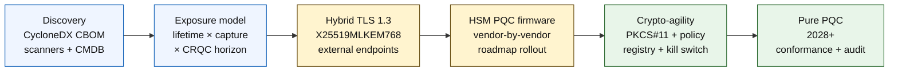

# Quantum-Safe Banking Index a 2026: Cryptography na Post-Quantum, QKD, Crypto-Agility, da Haɗarin Harvest-Now-Decrypt-Later

<!-- lead-start: manual -->
<aside class="post-lead" aria-label="Taƙaitaccen labari">

<strong>TL;DR.</strong> Banki na quantum-safe a 2026 shiri ne na isarwa wanda ake da iyaka da haɗuwar layi biyu — tsawon lokacin sirri na bayanan da cibiyar ke riƙe a yau, da lokacin isowar Cryptographically Relevant Quantum Computer (CRQC). NIST FIPS 203 / 204 / 205 sun zama na ƙarshe tun Agusta 2024; CNSA 2.0 ta sanya ƙarshen yanayin tarayyar Amurka a 2033; harvest-now-decrypt-later yana faruwa a yau a kan bayanan dadewa. Quantum Scorecard na Allunan Gudanarwa yana bin kashi huɗu daidai: cikar kayyade, bayyanar HNDL, ci gaban ƙaura ta NIST, shirin crypto-agility.

<strong>Manyan abubuwa</strong>

<ul class="post-lead-takeaways">
  <li><strong>Muhawarar algorithm ta ƙare a ranar 13 ga Agusta 2024.</strong> ML-KEM (FIPS 203), ML-DSA (FIPS 204), SLH-DSA (FIPS 205) su ne amsoshin. Bankunan da har yanzu suke gudanar da kima na ciki don "zaɓen wanda zai lashe" sun makara da watanni 18.</li>
  <li><strong>Harvest-now-decrypt-later ya riga ya shafi.</strong> Duk wani abu da yake da tsawon lokacin sirri wanda ya wuce isowar CRQC ta gaskiya — jingina na shekaru 30, jingina na inshorar rai, rikodin ma'amala na MiFID II / GDPR, ajiyar M&amp;A retention — dole ne ya ƙaura zuwa hybrid quantum-safe key encapsulation a yau, ba lokacin da aka ba da sanarwar CRQC ba.</li>
  <li><strong>Kayyade shi ne ƙofar balaga.</strong> Cryptographic Bill of Materials (CBOM) — yarjejeniya, dakin karatu, takardar shaida, HSM partition, dogaron mai siyarwa, mai aikace-aikacen, tsawon rai na rabe-raben bayanai — shi ne sharadin kowane abu. Bi sabuwa, ba ɗaukar hoto ba.</li>
  <li><strong>Hybrid TLS 1.3 shi ne tsarin 2026.</strong> X25519MLKEM768 hybrid key share shi ne abin da Chrome / Firefox / Cloudflare / Akamai ke yin shawarwari a yau. ML-KEM TLS mai tsabta yana jiran firmware na HSM da shirin CA.</li>
  <li><strong>Crypto-agility shi ne fitarwar mai dorewa.</strong> PKCS#11 abstraction, key masu lakabi, policy registry da ke daidaita sabis na kasuwanci da saitin algorithm da aka ba da izini. Idan ba tare da shi ba, sauyin algorithm na gaba zai zama wani shirin shekaru da yawa.</li>
</ul>
</aside>
<!-- lead-end -->

Banki na quantum-safe a 2026 ya shafi ƙaura na aiki, ba zato ba. NIST ta gama ƙa'idodin uku na farko na cryptography na post-quantum, kuma bankuna yanzu suna buƙatar fahimtar waɗanne tsare-tsare suka dogara da RSA, ECC, TLS, sa hannu, HSMs, takardun shaida, hanyoyin biyan kuɗi, ajiya, da bayanan sirri na dadewa. Tambayar index a sauƙaƙe: shin cibiyar za ta iya maye gurbin cryptography kafin barazanar ta zama aiki?

---

> **Taƙaitaccen Gudanarwa / Manyan Abubuwa**
>
> - **Ƙa'idodin NIST yanzu sun zama na zahiri.** FIPS 203 ya bayyana ML-KEM don key encapsulation, FIPS 204 ya bayyana ML-DSA don sa hannu, kuma FIPS 205 ya bayyana SLH-DSA a matsayin ƙa'idar sa hannu na stateless hash-based.
> - **Kayyade shi ne ƙofar balaga ta farko.** Banki ba zai iya ƙaurar abin da ba zai iya samu ba: takardun shaida, key, yarjejeniya, aikace-aikace, masu siyarwa, HSMs, API, ajiya, da tsarin embedded dole ne a tsara su.
> - **Crypto-agility shi ne manufa mai dorewa.** Manufar ba sauya algorithm sau ɗaya ba ce; ƙarfin canza primitives na cryptographic ne ba tare da sake tsara aikace-aikace gaba ɗaya ba.
> - **Bayanan dadewa suna canza gaggawa.** Haɗarin harvest-now-decrypt-later yana nufin bayanan da aka kama yau na iya zama masu karatu daga baya idan suka kasance masu daraja na dogon lokaci.
> - **QKD na'ura ce ta musamman.** Quantum key distribution na iya zama da dacewa ga hanyoyin masu mafi girman daraja, amma ba ya maye gurbin ƙaura ta PQC a duk cibiyar ba.
>
---

## Me ya sa 2026 ce Shekarar da Wannan Index ke da Muhimmanci

Sauye-sauye uku a 2024-2025 sun mai da quantum-safe shirin banki da ake auna shi maimakon wani lamarin bincike kawai. Na farko, NIST ya gama ƙa'idodin post-quantum na farko a ranar 13 ga Agusta 2024: [FIPS 203 (ML-KEM) ⧉](https://nvlpubs.nist.gov/nistpubs/FIPS/NIST.FIPS.203.pdf "FIPS 203 — Module-Lattice-Based Key-Encapsulation Mechanism"), [FIPS 204 (ML-DSA) ⧉](https://nvlpubs.nist.gov/nistpubs/FIPS/NIST.FIPS.204.pdf "FIPS 204 — Module-Lattice-Based Digital Signature Standard"), [FIPS 205 (SLH-DSA) ⧉](https://nvlpubs.nist.gov/nistpubs/FIPS/NIST.FIPS.205.pdf "FIPS 205 — Stateless Hash-Based Digital Signature Standard"). Muhawarar zaɓen algorithm ta ƙare a wannan ranar; bankunan da har yanzu suke gudanar da workstreams na ciki na "wace shiri zai lashe" a 2026 sun makara da watanni 18.

Na biyu, [CNSA 2.0 na NSA ⧉](https://media.defense.gov/2022/Sep/07/2003071834/-1/-1/0/CSA_CNSA_2.0_ALGORITHMS_.PDF "Commercial National Security Algorithm Suite 2.0") ya sanya ƙarshen yanayin tarayyar Amurka a 2033 tare da ƙarshen tsaka-tsaki da ke farawa a 2027 don sa hannu na software da firmware, 2030 don browsers da tsarin aiki. Duk wani banki da yake da bayyanar abokin tarayya na tarayyar Amurka — FedNow, ayyukan Treasury, asusun abokan ciniki na tarayya — yana cikin wannan iyaka don tsarin da suka taɓa bayanan tarayya. Agogon ba shi da ƙa'ida ba.

Na uku, [Harvest-Now-Decrypt-Later (HNDL) ⧉](https://csrc.nist.gov/Projects/post-quantum-cryptography "Shirin Post-Quantum Cryptography na NIST") shi ne hujjar haɗari mai ɗauke da nauyi don gaggawa. Maƙiya masu fasaha suna kama saƙonnin biyan kuɗi waɗanda TLS ke kāre, ambulopes na SWIFT, takardun KYC, da ciphertext na ajiya na dadewa a manyan cibiyoyin kuɗi. Bayanan da aka kama a 2026 kawai suna buƙatar su kasance masu mahimmanci a lokacin decryption — don jingina na shekaru 30, jingina na inshorar rai, rikodin ma'amala na MiFID II / GDPR, da ajiyar M&A retention, wannan tagar ta wuce kowace kima ta gaskiya don Cryptographically Relevant Quantum Computer (CRQC). Maƙiyi ba ya buƙatar kwamfuta na quantum yau. Yana buƙatar ɗaya kafin bayanan su daina mahimmanci.

Quantum-Safe Banking Index yana auna ko cibiyar ku za ta iya isar da ƙaura kafin wannan haɗuwar ta zo. Aikin ba ya shafi ko za a ƙaura ba; yana shafi ko ƙaura ta gama akan jadawalin lokacin da ake iya kāre.

## Tsarin Index na 2026

| Matakin Index | Hanyar 2026 | Ma'aunin Shiri | Haɗari Idan Aka Yi Kuskure |
|---|---|---|---|
| **Kayyade** | Tsara kadarorin cryptographic, yarjejeniya, takardun shaida, masu siyarwa, da rabe-raben bayanai | Kashi na ɗakin da aka kayyade | Dogaro na quantum-vulnerable da ba a sani ba |
| **Bayyanar** | Rarraba tsarin ta tsawon lokacin sirri da mahimmancin ma'amala | Kadarorin haɗari mai girma ta daraja da tsawon rai | Ƙaura da aka fifita ba daidai ba |
| **Ƙaura** | Yarda da hybrid da PQC-ready tare da ƙa'idodin NIST | Shirin ML-KEM da ML-DSA | Sake-platforming na gaggawa ƙarƙashin ƙarshen lokaci |
| **Crypto-agility** | Raba aikace-aikacen kasuwanci daga primitives na cryptographic | Murfin crypto da manufa ke sarrafawa | Algorithms da aka rubuta a cikin code a duk ɗakin |
| **Tabbatarwa** | Gwada interoperability, aiki, goyon bayan HSM, takardun shaida, da shirin mai siyarwa | Adadin gwajin da ya wuce da jerin abubuwan da ba a saba ba | Hanyoyin da suka karye ko sarrafa fallback masu rauni |

### Quantum Scorecard na Allunan Gudanarwa

Scorecard na shirin quantum mai gaskiya yana buƙatar bin kashi daidai, ba kawai matsayin ayyuka ba:

1. **Cikar Kayyade:** Kashi na aikace-aikacen tier-1 tare da Cryptographic Bill of Materials (CBOM) wanda aka tsara sosai.
2. **Bayyanar HNDL:** Yawan bayanan sirri na dadewa (misali, PII, asirin kasuwanci) da aka tura kan hanyar sadarwa ba tare da hybrid quantum-safe key encapsulation ba.
3. **Ci gaban Ƙaura ta NIST:** Kashi na asymmetric encryption keys da sa hannu na dijital da aka ƙaura zuwa ƙa'idodin FIPS 203 (ML-KEM) da FIPS 204 (ML-DSA).
4. **Shirin Crypto-Agility:** Kashi na tsarin masu mahimmanci inda za a iya jujjuya algorithms na cryptographic ta hanyar manufa ta tsakiya ba tare da buƙatar sake harhada code ba.

## Alamomin Yanzu da za a Bi

| Alama | Me Yake Nufi ga Bankuna | Tushen |
|---|---|---|
| **FIPS 203 ML-KEM** | Babbar ƙa'idar NIST don kafa key na encryption gabaɗaya | [NIST ⧉](https://www.nist.gov/news-events/news/2024/08/nist-releases-first-3-finalized-post-quantum-encryption-standards "Ƙa'idodin post-quantum encryption uku na farko da aka gama") |
| **FIPS 204 ML-DSA** | Babbar ƙa'idar NIST don sa hannu na dijital | [NIST ⧉](https://www.nist.gov/news-events/news/2024/08/nist-releases-first-3-finalized-post-quantum-encryption-standards "Ƙa'idodin post-quantum encryption uku na farko da aka gama") |
| **FIPS 205 SLH-DSA** | Madadin sa hannu na hash-based da ƙirar ajiyar baya | [NIST ⧉](https://www.nist.gov/news-events/news/2024/08/nist-releases-first-3-finalized-post-quantum-encryption-standards "Ƙa'idodin post-quantum encryption uku na farko da aka gama") |
| **Ana ƙarfafa haɗawa nan da nan** | NIST a fili tana faɗa wa masu gudanarwa su fara haɗa ƙa'idodi saboda cikakken haɗawa yana ɗaukar lokaci | [NIST ⧉](https://www.nist.gov/news-events/news/2024/08/nist-releases-first-3-finalized-post-quantum-encryption-standards "Ƙa'idodin post-quantum encryption uku na farko da aka gama") |
| **Shirye-shiryen quantum na bankuna suna fadada** | Manyan bankuna suna binciken fasahar quantum yayin da suke shirin canjin PQC | [Quantum Insider ⧉](https://thequantuminsider.com/2026/03/27/15-plus-global-banks-probing-the-wonderful-world-of-quantum-technologies/ "Bayanin bankuna na duniya da ke binciken fasahar quantum") |

## Ƙaura na Farawa Daga Littafin Cryptography

Tsarin ƙaura an fahimce shi sosai a wannan lokacin. Kowace ƙofa tana samar da shaida da ke tafiyar da na gaba; tsallake ko matsa ƙofa shi ne abin da ke samar da haɗarin sake-platforming na gaggawa wanda ke bayyana a shafin kasawar Tsarin Index.

Abu na farko da za a isar ba sabon algorithm ba ne; cryptographic bill of materials (CBOM) ne. Bankuna suna buƙatar kayyade mai rai wanda ke haɗa sabis na kasuwanci da algorithms, dakunan karatu, takardun shaida, tsayin key, HSMs, tsawon rai na bayanai, masu siyarwa, da masu aiki. Idan ba tare da wannan littafi ba, ƙaura ta quantum-safe ya zama tunani.

Tarihin CBOM ya kamata ya kama, ga kowane primitive na cryptographic: yarjejeniya ko interface (TLS 1.3, IPsec, SSH, custom payment-message format), algorithm da saitin parameter (RSA-2048, ECDH P-256, ML-KEM-768, ML-DSA-65), dakin karatu da sigar (OpenSSL 3.4, BoringSSL commit hash, vendor SDK build), iyakar hardware (HSM partition, TPM, secure enclave, ko babu), shaidar takardar shaida idan ya dace, mai aikace-aikace, da tsawon rai na rabe-raben bayanai. Kayan aikin da ke shigowa cikin samar da kayayyaki a 2025-2026 — IBM Quantum Safe Inventory, [CycloneDX CBOM specification ⧉](https://cyclonedx.org/capabilities/cbom/ "CycloneDX Cryptography Bill of Materials") na buɗewa, scanners na kasuwanci daga CryptoNext / Sandbox / PQShield — suna haɗawa cikin CMDB pipelines da ke akwai. Babu ɗayansu da ya cika shi kaɗai; tsammanin tsarin gina CBOM na watanni 12-18 ko da tare da kayan aikin mai siyarwa da ƙwararru masu zaman kansu.

Ma'aunin da za a bi shi ne sabuwa, ba murfi ba. CBOM da ya wuce watanni biyu yana da muni fiye da rashin CBOM domin yana ba ƙungiyar tsaro amincewar ƙarya game da abin da aka ƙaura.

## Hybrid Da Farko, Agile Kullum

Yawancin bankuna ba za su canza komai a lokaci ɗaya ba. Tsarin gaskiya shi ne hybrid deployment, inda hanyoyin gargajiya da post-quantum ke gudana tare yayin da masu siyarwa, yarjejeniya, takardun shaida, da kayan aikin aiki ke balaga. Manufar dogon lokaci shi ne crypto-agility: zaɓuɓɓukan cryptographic da manufa ke sarrafawa waɗanda za a iya canzawa ba tare da sake gina aikace-aikacen kasuwanci ba.

[Shigar da Sashin Hulda: Harvest-Now-Decrypt-Later (HNDL) Risk Calculator — Kayan aikin tushen slider inda manyan masu gudanarwa ke shigar da tsawon rai na bayanai idan aka kwatanta da lokacin quantum na kima don ganin tagar bayyanarsu.]

> **Babban fahimta:** Idan bayanan ku suna buƙatar su zama sirri na shekaru 10, kuma Cryptographically Relevant Quantum Computer (CRQC) yana nesa da shekaru 7, ƙarshen ƙaurarku ba ya cikin shekaru 7 — ya kasance shekaru 3 da suka wuce.

A aikace wannan yana nufin TLS 1.3 tare da hybrid `X25519MLKEM768` key share don endpoints na waje (Chrome / Firefox / Cloudflare / Akamai duk suna goyan bayan wannan yau), classical signature chains har sai HSM da CA infrastructure sun kama, da PKCS#11 abstraction layer wanda ke ba policy registry damar jujjuya algorithms ba tare da sake harhada aikace-aikacen kasuwanci ba. Crypto-agility shi ne abin da ke ƙayyade ko sauyin algorithm na gaba (lokacin, ba idan ba) zai zama jujjuyawar makonni shida ko wani shirin shekaru bakwai.

## Inda QKD Ya Dace

Quantum key distribution na cikin index a matsayin zaɓi na hanyar mai matuƙar mahimmanci, musamman ga abubuwan more rayuwa na kasuwar kuɗi, haɗin bankin tsakiya, da kwararar cibiyoyi masu matuƙar mahimmanci. Yana kamata a yi maganinsa a matsayin haɗari ga PQC, ba a matsayin uzuri don jinkirta ƙaura ta kamfani ba.

## Me Wannan Ke Nufi ga Kowane Nau'in Banki

### Global Systemically Important Banks

Matsalar mai wuya ita ce sikeli: dubban dubban endpoints na TLS, ɗaruruwan HSM partitions, dozin na masu ba da takardun shaida na ciki, ɗaruruwan aikace-aikacen kasuwanci tare da primitives na cryptographic da aka shigar, da vendor SDKs waɗanda banki ba zai iya gyara ba. Saka hannun jari ba wani pilot bane; shi ne kayan aikin CBOM, PKCS#11 abstraction layer da aka haɗa cikin kowane sabon ginin, shirin haɗin HSM wanda ya zaɓi mai siyarwa ɗaya don jagora kan firmware na PQC ya kuma yarda da kasala na shekaru da yawa a kan sauran, da policy registry wanda ya zama saman crypto-agility mai dorewa tun bayan kammala ƙaura zuwa FIPS 203 / 204 / 205.

### Bankunan Ma'amala da Bankunan Kamfanoni

Iyakar ƙaura ta fi karkata fiye da matakin G-SIB amma bayyanar HNDL tana da tsanani: saƙonnin SWIFT na ƙetare, structured payment data masu ɗauke da PII na kamfanonin abokin tarayya, dandalin musayar takardu masu riƙe takardun trade-finance, da ajiyar rahoton retention na dogon lokaci. Fifita hybrid TLS a kowane endpoint na abokin ciniki da PQC at rest don ajiyar retention. Tura lissafi ga mai siyarwa na HSM — ƙungiyar dandalin banki na kamfanoni tana da matsala ta saye kai tsaye wanda ƙungiyar fasahar wholesale sau da yawa ba ta da shi.

### Bankuna na Yankin

Sayi vendor stack wanda ya riga ya sami primitives na crypto-agility. Zaɓi dandalin core banking wanda mai siyarwarsa ke buga CBOM kuma yake jajirce kan jadawalin tallafi na ML-KEM / ML-DSA. Tabbatar da cewa roadmap na HSM na mai siyarwa ya dace da ƙarshen ƙaura na banki. Ƙarfin injiniya da ake buƙata don gina crypto-agility daga sifili shine shekaru da yawa; mai siyarwa yana biyan wannan kuɗin a kan abokan ciniki da yawa kuma banki yana gado fa'idar. Aikin tabbatarwa — duba ko da'awar mai siyarwa za ta rayu cikin tsarin MRM na cibiyar — shi ne iyaka na ciki na gaskiya.

### Fintechs, PSPs, da Masu Samar da Abubuwan More Rayuwa

Tambayar gasa ga masu siyarwa da ke siyarwa cikin bankuna a 2026 ba "shin kuna goyan bayan PQC ba." Tambayar ita ce "shin kuna iya samar da CycloneDX CBOM don dandalinku, vendor support matrix na HSM, da SLA na rotation na algorithm da aka rubuta." Masu siyarwar da suka amsa eh za su wuce ƙofofin saye na tier-1 a 2026-2027. Masu siyarwar da ba za su iya ba za su rasa zagayowar sabuntawa ga mai gasa wanda ke iya.

## Kammalawa

Banki na quantum-safe a 2026 ba wani lamarin bincike ba ne; shiri ne na isarwa wanda ake da iyaka da haɗuwar layi biyu — tsawon lokacin sirri na bayanan da cibiyar ke riƙe a yau, da lokacin isowar Cryptographically Relevant Quantum Computer. Cibiyoyin da suka yi gaskiya ga masu sa ido da abokan tarayya a 2030 su ne waɗanda suka fara gina CBOM a 2024, suka tura hybrid TLS a kowane endpoint na waje a ƙarshen 2026, kuma suka injinjini crypto-agility a kowane sabon ginin daga rana ɗaya. Cibiyoyin da ba su yi haka ba za su gano ko tagar ƙaurarsu ta riga ta rufe ga bayanan da maƙiyinsu ke girba a yau.

Auna ƙaura kamar yadda kuke auna kowane shirin aiki: an san iyaka, an fifita jadawali, an yi alkawarin ƙarshen lokuta, jerin abubuwan da ba a saba ba na gaskiya. Ƙarfin da ka duba kan ɗakinka, ƙanƙanin tagar ƙaurar take ji.

## Tambayoyin da Ake Yawan Yi

**Me banki ya kamata ya fara kayyadewa?**

Fara da TLS da aka fallasa a waje, hanyoyin biyan kuɗi, tabbatar da abokin ciniki, haɗin tsakanin bankuna, sabis na HSM-backed, ajiyar dogon lokaci, da tsarin da ke gudanar da bayanan sirri tare da rai mai amfani na dadewa.

**Shin PQC kawai batun cybersecurity ne?**

A'a. Yana shafar biyan kuɗi, ainihi, shaidar doka, sa hannu na ma'amala, amincewar abokin ciniki, riƙon bayanai, gudanar da mai siyarwa, da juriya na aiki.

**Me ake nufi da crypto-agility?**

Crypto-agility yana nufin ƙarfin canza primitives na cryptographic ta hanyar manufa da sarrafa dandalin maimakon canje-canjen aikace-aikacen da aka rubuta a code.

**Shin bankuna ya kamata su jira ƙarin ƙa'idodi?**

A'a. NIST ta ƙarfafa masu gudanarwa su fara haɗa ƙa'idodi na farko na ƙarshe domin cikakken haɗawa yana ɗaukar lokaci.

## Tushe

- NIST, (2026). [Ƙa'idodin post-quantum encryption uku na farko da aka gama ⧉](https://www.nist.gov/news-events/news/2024/08/nist-releases-first-3-finalized-post-quantum-encryption-standards "Ƙa'idodin post-quantum encryption uku na farko da aka gama").

<!-- enrich-start -->
<aside class="author-card" aria-label="Game da Marubuci"><strong class="author-card-name"><a href="/about/index.html">Sebastien Rousseau</a></strong>Babban masanin fasahar banki yana rubutu kan amfani da AI, abubuwan more rayuwa na biyan kuɗi, kuɗin da aka tokenize, ISO 20022, tsaron bayan quantum, sabis na kuɗi na cloud-native, da kasuwannin dijital da aka tsara.Shekaru 20+ a HSBC Commercial &amp; Investment Bank, PayPal, Barclays, Shazam, AKQA, Virgin Group. <a href="/about/index.html">Cikakken bayani</a> &middot; <a href="https://www.linkedin.com/in/sebastienrousseau/" rel="external noopener">LinkedIn</a> &middot; <a href="https://github.com/sebastienrousseau" rel="external noopener">GitHub</a></aside>

Bita ta ƙarshe <time datetime="2026-06-04">2026-06-04</time>.

<!-- enrich-end -->
