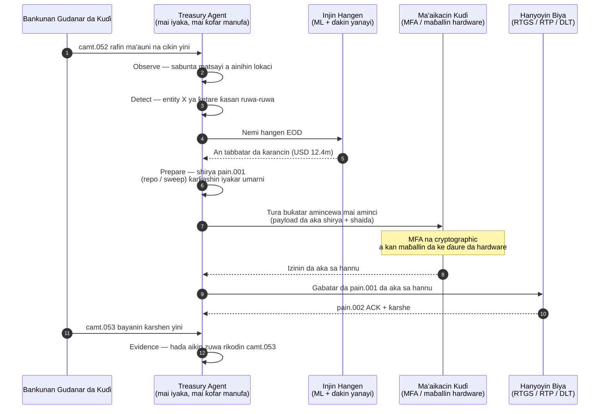

# Fihirisar Kuɗi Mai Cin Gashin Kansa a 2026: Kuɗi na Agentic, Kuɗin Shirye-shiryen, Ajiyar Tokens, da Kula da Kuɗi a Ainihin Lokaci

<!-- lead-start -->
<aside class="post-lead" aria-label="Taƙaitaccen labari">

<strong>TL;DR.</strong> Fihirisar kuɗi mai cin gashin kansa ta 2026 — tana auna tafiyar ayyukan agentic, faɗin kuɗin shirye-shiryen, haɗewar ajiyar tokens, tsara biyan kuɗi a ainihin lokaci, da kula da kuɗi ta atomatik a matsayin tsarin samfurin aiki guda.

<strong>Manyan abubuwan ɗauka</strong>

<ul class="post-lead-takeaways">
  <li><strong>Kuɗi yana zama tsarin aiki a ainihin lokaci.</strong> Hangen kuɗi marasa motsi da tarawa ta batch ba sune ma'aunin sake ba; tafiyar ayyukan agentic da ke gudana a kan bayanai na ainihin lokaci ne.</li>
  <li><strong>Kuɗin shirye-shiryen yanzu yana yiwuwa.</strong> Ajiyar tokens + hanyoyin ainihin lokaci suna sa samar da kuɗi kowane lamari ya zama tushen tafiyar aiki, ba shiri na kwata-kwata ba.</li>
  <li><strong>Ajiyar tokens su ne kuɗin dijital da masu kula da kuɗi suka fi so.</strong> Tattalin arzikin kuɗin banki, ikon shirye-shiryen, da tabbacin yini — ba tare da tambayoyin haɗarin mai bayarwa da ajiya na stablecoins ba.</li>
  <li><strong>Matakin sarrafa shi ne sabon saman bincike.</strong> Umarni, iyaka, hanyoyin maye gurbi da hannu, da shaidar juyawa dole su yi aiki a matsayin tushen dandamali, ba amincewa ta hannu na kowane aiki ba.</li>
  <li><strong>Katin maki na CFO yana kowace shawara, ba kowane kwata ba.</strong> Kuɗin kuɗi, rage buffer na kuɗin yini, ingancin FX, da daidaiton hangen ana auna su a saurin tafiyar aiki.</li>
</ul>

<strong>Karatu mai alaƙa:</strong> <a href="https://sebastienrousseau.com/2026-05-25-programmable-liquidity-ai-tokenised-deposits-real-time-treasury-2026/index.html">Kuɗin Shirye-shiryen a 2026: AI, Ajiyar Tokens, da Tsarin Kuɗi a Ainihin Lokaci</a>, <a href="https://sebastienrousseau.com/2026-05-21-tokenised-deposits-banking-services-status-2026/index.html">Ajiyar Tokens a 2026: Sabis na Banki, Gasa ta Stablecoin, da Matsayin Kuɗin Bankin Kasuwanci Mai Shirye-shiryen</a>.

</aside>
<!-- lead-end -->

Kuɗi mai cin gashin kansa shi ne wurin haɗuwa na halitta tsakanin agentic AI, biyan kuɗi na ɗimbin yawa, ajiyar tokens, da kuɗin ainihin lokaci. A 2026, mafi kyawun gine-ginen kuɗi ba za su yi hangen kuɗi kawai ba; za su ba da shawara, su yi bayani, kuma daga ƙarshe su gudanar da ayyukan kuɗi a cikin iyaka a kan asusu, kuɗaɗen ƙasashe, hanyoyi, da kadarorin sasantawa.

---

> **Taƙaitaccen Hukumar Gudanarwa / Manyan Abubuwan Ɗauka**
>
> - **Kuɗi yana sauya daga bayar da rahoto zuwa sarrafawa.** Ma'aunin ainihin lokaci, hangen kuɗi, halin biyan kuɗi, da motsin kuɗi sun zama wani ɓangare na tafiyar aiki guda.
> - **Agentic AI yana ƙirƙirar sabon ƙofar kuɗi.** Agents za su iya sa ido kan matsayi, fitar da abubuwan ban mamaki, shirya ayyukan tallafi, da haɓaka yanke shawara a cikin umarni da aka ayyana.
> - **Kuɗin shirye-shiryen yana canza ɓangaren kuɗi.** Ajiyar tokens da gwaje-gwajen CBDC na ɗimbin yawa suna ƙirƙirar sabbin damammaki na sasantawa ta atomic, biyan kuɗi mai sharaɗi, da kuɗi a koyaushe.
> - **Fihirisa dole ta auna iko.** Tambayar ba ko agent zai iya ba da shawarar aiki ba ce; tana cewa ko iko, iyaka, amincewa, da shaida suna a sarari.
> - **Ƙimar kuɗi ana iya aunata.** Kuɗin da aka ajiye, raguwar bincike na hannu, gazawar sasantawa da aka guje wa, da jari na aiki da aka saki ya kamata su ayyana nasara.
>
---

## Me Yasa 2026 Ita ce Shekarar da Wannan Fihirisa ke Da Mahimmanci

Fihirisar AI ta Stanford tana da amfani saboda tana kula da fagen fasaha mai sauri canzawa a matsayin abin da za a iya aunawa: fitar da bincike, aikin fasaha, aikin alhakin, tattalin arziki, ɗauka ta sashe, manufa, da ra'ayin jama'a an kawo su cikin tsari guda ([Stanford HAI ⧉](https://hai.stanford.edu/ai-index/2026-ai-index-report "Rahoton Fihirisar AI na 2026")). Bankuna da cibiyoyin kuɗi yanzu suna buƙatar irin wannan horon don ababen more rayuwa. Agentic AI, tsaron lafiyar ƙididdiga, juriya ta cloud native, da biyan kuɗi na ɗimbin yawa ba su sake zama hanyoyin kirkire-kirkire daban ba; suna haɗuwa cikin samfurin aiki guda.

Tambayar mai amfani ga banki ba ko kowane fage yana da mahimmanci ba ce. Tana cewa ko cibiyar za ta iya auna shirye-shirye a kan dukansu a lokaci guda. Banki na iya ɗora agentic AI kuma ya kasance mai rauni idan cryptography ɗinsa ba a shirye yake don ƙaura ba. Yana iya sabunta dandamali na cloud kuma ya gaza idan bayanan biya sun kasance ba a tsara su ba. Yana iya gudanar da gwaje-gwaje na tokenisation kuma ya haifar da haɗarin tsarin idan ba a tsara matakan sasantawa, kuɗi, ainihi, da bincike tare ba.

## Gine-ginen Fihirisar 2026

| Shimfiɗar Fihirisa | Hanyar 2026 | Ma'aunin Shirye-shirye | Haɗari Idan Ba A Kula Ba |
|---|---|---|---|
| **Ganuwa** | Haɗa bayanan asusu, biya, kuɗi, da fallasa | Faɗin matsayin kuɗi na ainihin lokaci | Wargajewar ganin kuɗi |
| **Hangen** | Yi amfani da AI don hangen ma'auni, kwararar, da buƙatun tallafi | Daidaiton hangen da yawan banbanci | Amincewa karya cikin rauni bayanai |
| **Cin gashin kai** | Bai wa agents iko a cikin iyaka don shawarwari da ayyuka | Faɗin umarni da ingancin amincewa | Aikin da ba a ba da izini ba ko ba a yi bayani ba |
| **Iya shirye-shirye** | Yi amfani da ajiyar tokens da yanayi masu wayo inda suka ƙara ƙima | Lokuta na biyan kuɗi mai sharaɗi da sasantawa ta atomic | Gwaje-gwajen kuɗi da fasaha ke jagoranta |
| **Sarrafawa** | Saka iyaka, takunkumi, FX, kuɗi, da sarrafa bincike | Shaidar sarrafa kowane aikin kuɗi | Gudanarwa ta hannu bayan aiwatarwa |

## Siginar Yanzu da Za A Bibiya

| Sigina | Me Yake Nufi ga Bankuna | Tushe |
|---|---|---|
| **52% ɗaukar agentic AI a sabis na kuɗi** | Kuɗi yanzu zai iya ɗaukar tafiyar ayyukan agentic ta cikin dandamali da aka tafiyar | [Cambridge CCAF ⧉](https://www.jbs.cam.ac.uk/faculty-research/centres/alternative-finance/publications/2026-global-ai-in-financial-services-report/ "Rahoton AI a Sabis na Kuɗi a Duniya na 2026") |
| **Biyan kuɗi mai sharaɗi na Project Agorá** | Tokenisation na iya bayar da damar biyan kuɗi mai sharaɗi da na koyaushe | [BIS ⧉](https://www.bis.org/about/bisih/topics/fmis/agora.htm "Project Agorá") |
| **Bank of England — Digital Securities Sandbox** | Bonds da equities da aka bayar ta DLT suna sasantawa a kan tushen 「Delivery-versus-Payment (DvP)」 — ɓangaren kadarar da ɓangaren kuɗi (wholesale CBDC ko ajiyar bankin kasuwanci na tokens) suna sasantawa a cikin ma'amala ta atomic guda, suna kawar da haɗarin abokin huldar gaba ɗaya | [Bank of England ⧉](https://www.bankofengland.co.uk/financial-stability/digital-securities-sandbox "Digital Securities Sandbox") |
| **Ƙarshen lokaci na adireshin tsarin SWIFT** | Bayanan kuɗi dole a kama su daidai a tushe | [SWIFT ⧉](https://www.swift.com/news-events/news/iso-20022-milestone-november-2026-unstructured-addresses-be-removed "Matsayin adireshin tsarin ISO 20022 na Nuwamba 2026") |
| **Manyan cibiyoyin kuɗi suna fafutuka don auna ƙimar AI** | Sarrafa kai na kuɗi yana buƙatar ma'aunin tattalin arziki masu wuya | [Cambridge CCAF ⧉](https://www.jbs.cam.ac.uk/faculty-research/centres/alternative-finance/publications/2026-global-ai-in-financial-services-report/ "Rahoton AI a Sabis na Kuɗi a Duniya na 2026") |

## Umarnin Agent na Kuɗi

Bai kamata a tsara agent na kuɗi a matsayin mataimaki na gama-gari ba. Yana buƙatar umarni: sa ido kan asusu, gano banbanci, hango giɓi na tallafi, shirya ayyuka, neman amincewa, aiwatarwa cikin iyaka, da samar da shaida. Kowane mataki ya kamata ya kasance da samfurin iko dabam.

Loop ɗin sarrafawa yana gudana Observe → Detect → Forecast → Prepare → Request Approval — sannan ya tsaya. Agent ɗin ba ya taɓa ƙetare iyakar izini na cryptographic da kansa. Zane na ƙasa yana bin diddigin zagaye cikakke guda: ƙarancin ruwa-ruwa na cikin yini na dala miliyoyi yana fitowa a cikin `camt.052` telemetry, agent ɗin yana hango matsayin ƙarshen yini, yana shirya repo ko intercompany sweep a matsayin `pain.001` da aka kammala, sannan ya miƙa shi ga ma'aikacin kuɗi don sa hannu na cryptographic mai abubuwa da yawa a kan maɓallin da ke ɗaure da hardware. Agent ɗin sai ya gabatar da payload ɗin da aka sa hannu; ƙarshen yana zuwa a matsayin `pain.002` ACK da `camt.053` na rikodi mai zuwa.

Iyakar ita ce muhimmiyar — kowane aikin da ke motsa kuɗi na ainihi yana zaune a bayan ƙofar cryptographic da agent ba zai iya cikawa da kansa ba.

## Kuɗin Shirye-shiryen

Kuɗin shirye-shiryen shi ne ikon motsa ƙima a ƙarƙashin yanayi: idan an wuce kofa, idan jingina ta cancanta, idan abokin huldar ya wuce gwajin, idan ƙarshen sasantawa yana samuwa, ko idan buffer na kuɗin yini ya yi ƙasa sosai. Ajiyar tokens da dandamali na sasantawa na ɗimbin yawa suna sa waɗannan tsare-tsare su zama masu amfani.

Shirye-shiryen ba ya nufin fitar da ma'aunin daidaitawa. Hanyar aiwatarwa ita ce `pain.001` — ISO 20022 Customer Credit Transfer Initiation. Aikin da agent ya shirya shi ne payload na `pain.001` da aka kammala wanda aka tura zuwa banki a kan channel ɗin da kamfani ERP zai yi amfani da shi, an tabbatar da shi a kan schema ɗin, an ƙididdige shi da injunan fraud da sanctions, kuma an amince da shi a kan rahotannin halin `pain.002` ɗin. Layi na sharaɗi (kofa, cancantar jingina, samuwar ƙarshe, ƙasan buffer) yana zaune sama da saƙon — yana yin ƙofa *idan* aka aika `pain.001`, ba *siffar da yake ɗauka ba*. Dandamali na kuɗi da ke ƙirƙirar payloads na musamman don bayyana yanayi za su faɗi daga hanyar da banki ya iya cinyewa kuma su koma kan haɗin gwiwa biyu-biyu.

## Ɗakin Sarrafa na Kuɗi

Samfurin aiki ya kamata ya yi kama da ɗakin sarrafa: matsayi, hangen, halin biyan kuɗi, amfani da iyaka, banbanci, amincewa, da shaida a cikin ƙofa guda. Fihirisa ya kamata ta hukunta tsarin kuɗi da ke buƙatar ƙungiyoyi su haɗa imel, sheets, ƙofofin banki, da dashboards da ba a haɗa ba.

Layi ɗin bayanai a bayan wannan ƙofa shi ne ISO 20022 cash management. Matsayin cikin yini shi ne `camt.052` — Bank-to-Customer Account Report — wanda aka tura daga kowane bankin gudanar da kuɗi zuwa cikin layi ɗin lura na agent a kan saurin da banki ke bugawa (mintuna ga masu samar da GTB na tier-1, ƙarshen-zagaye ga sauran). Daidaita ƙarshen yini shi ne `camt.053` — Bank-to-Customer Statement — rikodin da za a iya bincika wanda za a auna hangen na agent da safiya mai zuwa. Dandamali na kuɗi da ke karanta bayanan PDF ko screen-scrape ƙofofin banki ba za su iya cika 「Level 4」 na fihirisa ba; telemetry na cikin yini dole ya iso a matsayin `camt.052` mai tsari domin loop ɗin hangen ya rufe a lokaci don aiki.

## Abin da Wannan Ke Nufi Bisa Nau'in Banki

### Bankunan Tsarin Duniya Masu Mahimmanci

Bankunan duniya ya kamata su kula da wannan fihirisa a matsayin katin maki na gine-ginen kamfani. Fifiko ba wani gwajin tabbacin ra'ayi ba ne; shaida ce cewa tafiyar ayyukan cin gashin kai, ƙaurar cryptography, dogaro da cloud, da sabunta biya za a iya tafiyar da su a matsayin tsarin haɗari da ƙima guda.

### Bankunan Ma'amala da Bankunan Kamfani

Bankunan ma'amala ya kamata su mai da hankali kan biyan kuɗi na ɗimbin yawa, bayanai masu tsari, kuɗi, ajiyar tokens, da sabis na kuɗi na agentic. Mafi mahimmancin shawarar abokin ciniki ba motsi kuɗi mai sauri kawai ba ne; motsi kuɗi mai bayani, mai bincikuwa, mai shirye-shiryen ne tare da ƙananan bincike da ingantacciyar ganin jari na aiki.

### Bankunan Yanki

Bankunan yanki ya kamata su yi amfani da fihirisa don guje wa yaɗuwar shirye-shirye. Ba sa buƙatar jagorantar kowane fage, amma suna buƙatar matsayin amintacce kan gudanar da AI, jerin bayan ƙididdiga, shaidar fita ta cloud, da shirye-shiryen bayanan biya.

### Fintechs, PSPs, da Masu Samar da Ababen More Rayuwa

Fintechs da masu samar da ababen more rayuwa ya kamata su daidaita taswirorin samfurinsu zuwa shirye-shiryen banki da za a iya aunawa. Mafi kyawun shawarwari za su rage haɗarin haɗawa, su ƙarfafa shaida, kuma su sa ababen more rayuwa masu sarƙaƙƙiya su zama masu sauƙin tafiyarwa ga bankuna.

## Kammalawa

Ƙimar rahoton salon fihirisa ita ce yana mai da ajandar fasaha mai wargajewa zuwa samfurin aiki da za a iya aunawa. A 2026, masu nasara a ababen more rayuwa na kuɗi ba za su zama cibiyoyin da ke da gwaje-gwaje mafi yawa ba. Za su zama cibiyoyin da za su iya tabbatar da shirye-shirye a cin gashin kai, tsaro, juriya, sasantawa, tattalin arziki, da gudanarwa a lokaci guda.

## Tambayoyin da Akan Yi Akai-akai

**Mene ne kuɗi mai cin gashin kansa?**

Kuɗi mai cin gashin kansa shi ne amfani da agents na AI, bayanai na ainihin lokaci, da biyan kuɗi mai shirye-shiryen don sa ido, ba da shawara, da yiwuwar aiwatar da ayyukan kuɗi a cikin iyaka.

**Ya kamata a bar agents na kuɗi su aiwatar da biyan kuɗi?**

Kawai a cikin umarni masu ƙanƙanta, iyaka masu ƙarfi, amincewa a sarari, da cikakken iya bincike. Ya kamata a samu ikon aiwatarwa ta hanyar girma.

**Yaya ajiyar tokens ke taimaka wa kuɗi?**

Za su iya tallafa wa sasantawa mai shirye-shiryen, aiwatarwa ta atomic, da yiwuwar kula da kuɗin yini mafi kyau yayin da suke kiyaye dangantakar kuɗin bankin kasuwanci.

**Mene ne mataki na farko na aiwatarwa?**

Gina ganuwa ta ainihin lokaci da ingancin bayanai kafin ba da cin gashin kai. Agents ba za su iya inganta kuɗi cikin aminci wanda ba za su iya gani daidai ba.

## Bayanai

- Cambridge Centre for Alternative Finance, (2026). [2026 Global AI in Financial Services Report ⧉](https://www.jbs.cam.ac.uk/faculty-research/centres/alternative-finance/publications/2026-global-ai-in-financial-services-report/ "Rahoton AI a Sabis na Kuɗi a Duniya na 2026").
- SWIFT, (2026). [ISO 20022 November 2026 structured address milestone ⧉](https://www.swift.com/news-events/news/iso-20022-milestone-november-2026-unstructured-addresses-be-removed "Matsayin adireshin tsarin ISO 20022 na Nuwamba 2026").
- BIS Innovation Hub, (2026). [Project Agorá ⧉](https://www.bis.org/about/bisih/topics/fmis/agora.htm "Project Agorá").
- Bank of England, (2026). [Shaping the UK's digital financial future ⧉](https://www.bankofengland.co.uk/speech/2025/january/sasha-mills-speech-at-the-tokenisation-summit "Tsara makomar kuɗi ta dijital ta UK").

<!-- enrich-start -->
<aside class="author-card" aria-label="Game da Marubucin"><strong class="author-card-name"><a href="/about/index.html">Sebastien Rousseau</a></strong>Babban masanin fasahar banki yana rubutu kan amfani da AI, ababen more rayuwa na biyan kuɗi, kuɗin tokenised, ISO 20022, tsaron bayan ƙididdiga, sabis na kuɗi na cloud-native, da kasuwannin dijital da aka tsara.Shekaru 20+ a HSBC Commercial &amp; Investment Bank, PayPal, Barclays, Shazam, AKQA, Virgin Group. <a href="/about/index.html">Cikakken bayani</a> &middot; <a href="https://www.linkedin.com/in/sebastienrousseau/" rel="external noopener">LinkedIn</a> &middot; <a href="https://github.com/sebastienrousseau" rel="external noopener">GitHub</a></aside>

Bita ta ƙarshe <time datetime="2026-06-07">2026-06-07</time>.

<!-- enrich-end -->
