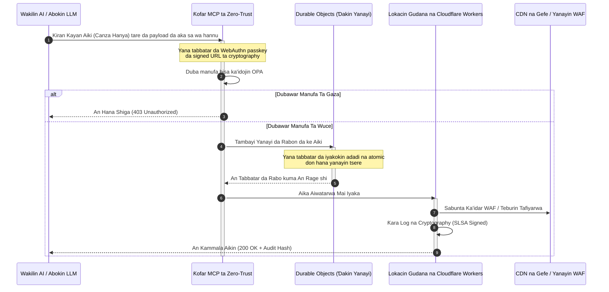

# CloudCDN: Tsari na Buɗaɗɗen Tushe ga Gefe na AI-na Asali a 2026

<!-- lead-start: manual -->
<aside class="post-lead" aria-label="Taƙaitaccen labari">

<strong>TL;DR.</strong> Fasahar kamfanoni a 2026 tana bayyana ta haɗuwar aiwatarwar serverless da aka rarraba a duniya da kuma AI mai wakilci. CDNs na yau da kullum — da aka gina don adana fayiloli na tsaye da tafiyar da zirga-zirga na asali — sun tsufa a tsarin gini a zamanin daidaita bayanai mai aiki na ainihin lokaci. CloudCDN tsari ne na buɗaɗɗen tushe wanda ke mai da gefe zuwa matakin sarrafawa mai aiki: lokutan gudana na serverless, daidaita yanayi mai tarihi ta Cloudflare Durable Objects, da ƙofar Model Context Protocol (MCP) ta zero-trust wadda ke barin wakilan AI masu cin gashin kansu su sarrafa ababen more rayuwa na yanar gizo cikin iyakokin aiki masu ƙayyadewa da aka tsare ta hanyar cryptography.

<strong>Manyan abubuwan ɗauka</strong>

<ul class="post-lead-takeaways">
  <li><strong>Daga cache na tsaye zuwa matakin sarrafawa mai iyaka.</strong> CloudCDN yana matsar da iyakar aiki zuwa gefe, yana mai da nodes na CDN zuwa ƙofofin manufa masu aiki waɗanda ke aiwatar da yanke shawara na tsaro, tafiyarwa, da sarrafa shiga cikin ƙasa da millisecond.</li>
  <li><strong>Daidaita gefe mai tarihi.</strong> Cloudflare Durable Objects suna tilasta iyakancewar adadi ta atomic da daidaita yanayi a ainihin lokaci a duniya — babu yanayin tsere da aka rarraba, babu cin zarafin rabo na tsari a fadin yankunan gefe.</li>
  <li><strong>Sarrafa ababen more rayuwa mai aminci ta wakilai ta hanyar MCP.</strong> Ƙofar zero-trust tana fallasa kayan aikin MCP na musamman 42, tana barin wakilan AI su bincika, saita, da sarrafa ababen more rayuwa ƙarƙashin iyakokin da aka sa wa hannu ta cryptography.</li>
  <li><strong>Tsaron sarkar samarwa a matsayin abin bayarwa na pipeline.</strong> Shaidar asalin gini ta SLSA Level 3 ta Sigstore/Cosign da gwaje-gwajen unit 3,185 a 100% murfi a kowane saki.</li>
  <li><strong>Shaida ta matakin hukumar gudanarwa, ba dashboards ba.</strong> Telemetry na gefe yana taswira kai tsaye zuwa lissafin hukumar gudanarwa na DORA Mataki na 5, rahoton haɗari na BCBS 239, da ka'idojin jarin haɗarin aiki na Basel III.</li>
</ul>

<strong>Karatu mai alaƙa:</strong> <a href="/2026-05-16-best-cloud-infrastructure-architecture-2026/">Mafi Kyawun Gine-ginen Ababen More Rayuwa na Cloud a 2026: Tsari na AI-na Asali, Multi-Cloud, mai Sanin Quantum ga Sabis na Kuɗi</a> · <a href="/2026-06-05-cloud-native-banking-index-dora-resilience-platform-engineering-2026/">Ma'aunin Banki na Cloud-Native a 2026: DORA, Injiniyancin Dandamali, Cloud mai Mulkin Kai, da Juriyar Aiki</a> · <a href="/2026-06-03-agentic-ai-index-banks-autonomy-governance-auditability-2026/">Ma'aunin AI mai Wakilci ga Bankuna a 2026: Auna 'Yancin Kai, Gudanarwa, Ikon Bincike, da Tasirin Kasuwanci</a>

</aside>
<!-- lead-end -->

Muhawarar CDN ta ƙare. Gefe ba cache ba ne kuma; shi ne matakin sarrafawa ga software na AI-na asali. Yayin da wakilai ke kiran kayan aiki, motsa bayanai, goge caches, neman signed URLs, da daidaita hanyoyin aiki, tsohon samfurin dashboards masu duhu da matakan sarrafawa na mallaka ya daina zama matsala kawai — ya zama haɗarin dokoki. CloudCDN yana jayayya don wani samfuri daban: dandalin gefe mai buɗewa, mai bincike, mai sarrafa wakili wanda ke ɗaukar tsaro, isar da hannu, aiki, da ikon bincike a matsayin ƙa'idoji da za a tilasta maimakon alkawuran mai siyarwa.

Ma'aunin buɗaɗɗen tushe na wannan labarin shi ne [cloudcdn.pro ⧉](https://github.com/sebastienrousseau/cloudcdn.pro "cloudcdn.pro"). Ma'ajiyar CDN ce ta masu yawan haya, ta AI-na asali wadda za a iya karanta ta daga ƙarshe zuwa ƙarshe kuma a tura ta da kanta: TTFB na ƙasa da 100ms a fadin Cloudflare PoPs, sarrafa MCP, iyakancewar adadi ta Durable Objects, isar da hannu na WCAG-AA, signed URLs, passkeys, SLSA Level 3, da gwaje-gwaje 3,185 a 100% murfi.

---

> **Taƙaitaccen Hukumar Gudanarwa / Manyan Abubuwan Ɗauka**
>
> - **Gefe ya zama iyakar aiki.** CloudCDN yana mai da nodes na CDN na yau da kullum zuwa ƙofofin manufa masu aiki waɗanda ke aiwatar da tsaro, tafiyarwa, da sarrafa shiga cikin ƙasa da millisecond.
> - **Durable Objects suna sa iyakancewar adadi ta zama atomic.** Tilasta rabo a ainihin lokaci, mai daidaito a duniya yana rufe tagar yanayin tsere da masu iyakancewa na eventual consistency ke barwa a buɗe ga maharan da wakilai masu lalacewa.
> - **Wakilai suna sarrafa ababen more rayuwa ta kayan aikin MCP 42 masu iyaka.** Ana tabbatar da kowane kira da WebAuthn passkeys, payloads da aka sa wa hannu, da manufar OPA kafin kome ya aiwatu.
> - **Sarkar samarwa ɓangare ne na samfurin.** Shaidar asali ta SLSA Level 3 ta Sigstore/Cosign tana haɗa kowane saki da tushensa da aka bincika ta hanyar cryptography.
> - **Telemetry shaidar bin doka ce.** Ayyukan gefe suna taswira zuwa DORA Mataki na 5, BCBS 239, da jarin haɗarin aiki na Basel III — kai tsaye, ba ta rahoto na baya-bayan-aiki ba.
>
---

## Me Yasa Wannan Aikin Buɗaɗɗen Tushe Yake da Muhimmanci a 2026

IT na kamfanoni a 2026 ya matsa daga samar da ababen more rayuwa na tsaye zuwa daidaita bayanai na ainihin lokaci da abubuwan da ke faruwa ke jagoranta. Ƙarfin kasuwa biyu ne ke tafiyar da wannan sauyi.

Na farko shi ne yaɗuwar AI mai wakilci. Models masu cin gashin kansu da wakilan software yanzu suna aiwatar da ayyukan aiki masu sarƙaƙiya — rage barazana ta atomatik, yanke shawarar tafiyarwa, daidaita ledger a ainihin lokaci. Ba sa amfani da dashboards. Suna kiran kayan aiki.

Na biyu shi ne tilastawa mai aiki ta [Dokar Juriyar Aiki ta Dijital (DORA) ⧉](https://eur-lex.europa.eu/legal-content/EN/TXT/?uri=CELEX%3A32022R2554 "Dokar (EU) 2022/2554 kan juriyar aiki ta dijital ga ɓangaren kuɗi"). Cibiyoyin banki ba za su iya dogaro kuma da CDNs na ɓangare na uku masu duhu, na mallaka ba. Masu kula da dokoki suna buƙatar cikakken gani cikin sarkar samar da software, ikon fita da za a iya tabbatarwa, da hanyoyin binciken cryptography da ba za a iya canzawa ba.

Gine-ginen sabar da aka tsakaita suna ɗora hukunce-hukuncen jinkiri waɗanda daidaitawa na ainihin lokaci ba zai iya ɗauka ba. CDNs na mallaka suna aiki a matsayin akwatuna baƙaƙe waɗanda ke fallasa cibiyoyi ga lalacewar sarkar samarwa da ba za su iya gani ba, balle su shaida. CloudCDN yana rufe wannan gibin da tsari na buɗaɗɗen tushe, na zero-trust, mai gaskiya wanda ke mai da gefe zuwa matakin sarrafawa mai aiki. Ga shugabannin fasaha, yana matsar da tattaunawar daga kuɗin bin doka zuwa Return on Resilience: jarin da aka kiyaye ta hanyoyin aiki na atomatik, masu shirye don bincike.

## Ruwan Tabarau na Gine-gine

An tsara gine-ginen CloudCDN a kan shimfiɗa biyar, yana maye gurbin middleware da aka tsakaita da kayan asali na gefe masu tarihi, na gida:

| Shimfiɗa | Yanke Shawara na Ƙira | Me Yasa Yake da Muhimmanci | Haɗari Idan Ba A Kula Ba |
|---|---|---|---|
| **Lokacin gudana na gefe** | Cloudflare Workers da Pages | Yana kawar da jinkirin VM da aka tsakaita; yana aiwatar da manufofi cikin ƙasa da millisecond a duniya | Ribar aiki ba tare da horon manufa ba tana haifar da gushewar gefe mara tsari |
| **Daidaita yanayi** | Durable Objects | Yana tabbatar da daidaito na atomic, na ainihin lokaci ga iyakokin adadi da yanayin da ake rabawa a fadin yankuna | Yanayin tsere da aka rarraba, cin zarafin albarkatun API, rabon kewaye da aka tsallake |
| **Fuskar wakili** | Ƙofar MCP ta zero-trust | Tana fallasa kayan aikin MCP na musamman 42 don wakilan AI su sarrafa ababen more rayuwa ƙarƙashin iyakokin gudanarwa | Kiran kayan aiki mara iyaka da canje-canjen saiti mara izini |
| **Sarrafa shiga** | WebAuthn passkeys da signed URLs | Yana maye gurbin kalmomin sirri na tsaye da sa hannun cryptography don ayyuka masu ikon bincike | Canje-canje marasa tabbataccen suna; satar shaida da ke kaiwa ga karya kewaye |
| **Ƙofofin inganci** | SLSA Level 3 da 100% murfin gwaji | Yana tabbatar da tushen gini ta lissafi; yana toshe allurar dependency mai cutarwa | Code mai cutarwa da aka saka ta sarkar samar da software |

## Siginonin Aiki da za a Bi

Shirye-shiryen gefe abu ne da za a iya aunawa. Waɗannan su ne alamomin ƙididdiga da ke nuna ikon aiwatarwa maimakon niyya:

| Sigina | Ma'auni / Mizani | Maganar Dokoki | Aiwatarwa a Dandamali |
|---|---|---|---|
| **Kayan aikin MCP 42** | Adadin rajistar kayan aiki mai iyaka don sarrafawa ta atomatik | COBIT 2019 (BAI06) | Ƙofar MCP tana tabbatar da sa hannun wakilai bisa manufofin OPA |
| **Durable Objects** | Tilasta rabo na atomic mara zubewa, cikin ƙasa da millisecond | DORA Mataki na 6 | Durable Objects suna bin diddigin yanayin rabon API na duniya |
| **Passkeys da signed URLs** | 100% na zaman admin an tabbatar da su ta FIDO2 WebAuthn | DORA Mataki na 30 | An saka dubawar sa hannun cryptography cikin router na gefe |
| **SLSA Level 3** | Manifests na gini da aka sa wa hannu ta cryptography (Sigstore) | DORA Mataki na 30 | Pipelines na GitHub Actions suna samar da metadata na gini da aka sa wa hannu |
| **Gwaje-gwajen unit 3,185** | 100% murfi; ƙofofin regression a kowane saki | NIST CSF 2.0 (PR.DS-01) | Pipelines na CI suna dakatar da turawa idan kowane gwaji ya gaza |

## CDN Ya Zama Matakin Sarrafawa Mai Aiki

An ƙera CDNs na al'ada kewaye da hanzarta abun ciki na tsaye, mara aiki. CloudCDN yana sake fasalta samfurin. Da haɗin Cloudflare Workers da Durable Objects, gefe yana aiki a matsayin ƙofar manufa mai aiki, mai tarihi.

Lokacin da wakilin AI ko tsari na atomatik ya nemi canjin saitin ababen more rayuwa ko gyaran tafiyarwa, ba ya magana da database mai rauni da aka tsakaita. Ana kama buƙatar a node na gefe mafi kusa kuma a tafiyar da ita ta dubawar ainihi, manufa, da rabo kafin kome ya aiwatu:

Kowane mataki a wannan jerin yana samar da rikodi mai tabbataccen suna, da aka sa wa hannu. Wannan shi ne bambancin tsakanin CDN da ke hanzarta abun ciki da matakin sarrafawa da za a iya gudanarwa.

## Me Yasa Buɗaɗɗen Tushe Yake Canza Samfurin Amincewa

Ga Manyan Jami'an Tsaron Bayanai (CISOs), CDNs na mallaka masu duhu suna gabatar da haɗari mai ninkuwa. Cibiyoyin sadarwar gefe na rufaffen tushe akwatuna baƙaƙe ne: idan mai siyarwa ya sha lalacewa ta ciki, banki ba shi da ko ɗan gani har sai an bayyana karyar a fili.

CloudCDN yana maye gurbin wannan rashin daidaito da samfurin amincewa na buɗaɗɗen tushe mai cikakken ikon bincike, da aka gina a kan hanyoyi uku:

1. **Shaidar asalin gini ta lissafi.** Ƙarƙashin SLSA Level 3, kowane saki an haɗa shi ta cryptography da ma'ajiyar GitHub ɗinsa ta buɗaɗɗen tushe. CISO na iya tabbatarwa — ta lissafi, ba ta kwangila ba — cewa binary ɗin da ke gudana a kan nodes na gefe na duniya na Cloudflare ya ƙunshi daidai code ɗin tushen da aka bincika.
2. **Binciken tsaro na ci gaba, na fili.** Ana sanya codebase ɗin a ƙarƙashin scans na atomatik, bayyana raunin tsaro a fili, da binciken code da takwarori ke dubawa. Duhu ba sarrafawa ba ne; dubawa ce.
3. **Babu kulle ga mai siyarwa (DORA Mataki na 28).** DORA tana buƙatar bankuna su tabbatar da dabarar fita bayyananne, da aka gwada, daga masu samar da sabis na ɓangare na uku masu muhimmanci. Saboda CloudCDN buɗaɗɗen tushe ne kuma an gina shi a kan kayan asali na serverless na yau da kullum, cibiyoyi za su iya ƙaura da saitunan gefe daga Cloudflare zuwa wasu lokutan gudana na serverless ko clusters na Kubernetes masu zaman kansu — kuma su shaida wannan ikon ga mai kula da dokoki.

## Tsarin Gefe na Matakin Banki

An ƙera CloudCDN don cika ma'aunin bin doka na ɓangaren kuɗi na duniya, yana taswira ayyukan fasaha na gefe kai tsaye zuwa tsarukan da masu kula da dokoki ke bincika a zahiri:

- **Gudanar da haɗarin model ([US Fed SR 11-7 ⧉](https://web.archive.org/web/20260414150921/https://www.federalreserve.gov/supervisionreg/srletters/sr1107.htm "Jagorar Kulawa kan Gudanar da Haɗarin Model") / UK PRA SS1/23).** Models masu cin gashin kansu da ke aiwatar da ayyukan aiki suna faɗawa ƙarƙashin gudanar da haɗarin model. Ƙofar MCP ta CloudCDN tana ɗaukar kayan aikin wakilci a matsayin models na ƙididdiga: iyakokin manufa masu tsauri, log a ainihin lokaci, da tilas mutum-cikin-da'ira don ayyuka masu babban tasiri.
- **BCBS 239 (tara bayanan haɗari).** Ta hanyar kamawa, yiwa alama, da tsara bayanan ciniki a gefe, ana samar da ma'aunin aiki a ainihin lokaci — daidai da buƙatun BCBS 239 na amincin bayanai, dacewar lokaci, da binciken dokoki.
- **DORA Mataki na 5 (lissafin hukumar gudanarwa).** Hukumar gudanarwa ce ke ɗaukar babban nauyin kai na ƙarshe kan juriyar aiki. CloudCDN yana mai da telemetry na gefe zuwa shaida da aka ƙididdige, da za a iya tabbatarwa wadda daraktoci marasa fasaha za su iya ɗauka zuwa binciken nauyin kai.
- **Jarin haɗarin aiki na Basel III.** Bankuna suna riƙe jarin dokoki kan haɗarin aiki. Failover na DR na atomatik da shaidar asali ta SLSA Level 3 suna rage bayanin haɗarin aiki na cibiyar — suna kiyaye jari a kan balance sheet, ba kawai gamsar da bincike ba.

## Abin da Wannan Ke Nufi Bisa Nau'in Banki

### Bankunan Duniya Masu Muhimmanci ga Tsari (G-SIBs)

G-SIBs suna gudanar da manyan adadin ciniki a fadin hukunce-hukunce da yawa. Fifikon shi ne maye gurbin sarrafa kewaye na gado da aka rarrabu da matakin gefe ɗaya, haɗaɗɗe. Tura tsarin CloudCDN yana barin G-SIB ya daidaita manufofin tsaro, ƙofofin API, da gudanarwar wakilci a duniya — kuma ya samar da pipelines na shaida masu bin DORA a matsayin sakamakon aiki maimakon gaggawar kowane kwata.

### Bankunan Ciniki da na Kamfanoni

Ga bankunan ciniki, samfurin da abokan ciniki ke gani ƙunshin saurin aiwatarwa, tsaro, da gaskiyar bayanai ne. Tsarin CloudCDN yana barin waɗannan bankuna su fallasa dashboards na API masu tsaro da sabis na bin diddigin kuɗi a ainihin lokaci ga ma'aji na kamfanoni — matsayin gefe mai juriya da ke kare ajiyar kamfanoni.

### Bankunan Yanki da Ƙanana

Bankunan yanki suna fuskantar maharan iri ɗaya da G-SIBs ba tare da kasafin injiniya ba. Tsari na gefe na buɗaɗɗen tushe, na matakin banki yana ba da sarrafawar nan take: daidaitawa da dokoki kai tsaye ba tare da kuɗin lasisi na mallaka ba, da code ɗin tushe don tabbatar da shi.

## Littafin Dabarun Hukumar Gudanarwa

Juriyar aiki ba ta zama kuma ma'aunin IT na bayan gida da ba a gani ba; fifikon hukumar gudanarwa ce da nauyin kai a haɗe da ita. Cibiyoyin da za su riƙe amincewar masu kula da dokoki, abokan ciniki, da masu hannun jari a 2026 suna ɗaukar fasaha a matsayin kadara da za a iya tabbatarwa, da za a iya lura da ita.

Taswirar hanya ga manyan shugabannin fasaha gajeriya ce:

1. **Umurci shaida a matsayin samfuri.** Ware kasafi don pipelines na atomatik, masu rubuta kansu a gefe — shaidar da aiki ke samarwa, ba wadda aka tattara wa mai bincike ba.
2. **Matsa zuwa sarrafa gefe mai tarihi.** Ɗauke iyakancewar adadi, WAF, da tabbatar da ainihi daga sabar da aka tsakaita zuwa kayan asali na gefe na atomic.
3. **Kafa iyakokin wakilci na cryptography.** Tilasta ƙofofin MCP na zero-trust tare da tabbatarwa ta passkey da OPA ga kowane kiran kayan aiki na atomatik.
4. **Buƙaci binciken gini na buɗaɗɗen tushe.** Mai da shaidar asalin gini ta SLSA Level 3 sharaɗin turawa, ba buri ba.

## Tambayoyin da Akan Yi Akai-akai

**Shin CloudCDN a shirye yake ga binciken DORA?**

Eh. An ƙera CloudCDN don samar da shaidar bin doka ta atomatik wadda ke taswira kai tsaye zuwa templates na ITS na Rajistar Bayanai (RT.01 zuwa RT.15) da sasannin kwangila na DORA Mataki na 30.

**Mene ne amfanin amfani da Durable Objects don iyakancewar adadi?**

Masu iyakance adadi da aka rarraba na al'ada suna dogaro da eventual consistency, wadda ke barin tagar jinkiri da maharan ko wakilai masu lalacewa za su iya amfani da ita. Durable Objects suna tabbatar da daidaito na nan take, na atomic a duniya, suna rufe tagar yanayin tsere gabaki ɗaya.

**Mene ne ke sa CloudCDN ya zama na AI-na asali?**

Ayyukansa da MCP ke sarrafawa da samfurin sarrafawa mai sanin wakili. Ana sarrafa ababen more rayuwa ta kayan aiki 42 masu gudanarwa tare da ainihin cryptography da iyakokin manufa — an ƙera shi don hanyoyin aiki masu cin gashin kansu, ba kawai dashboards na mutum ba.

**Shin code na buɗaɗɗen tushe yana ƙara haɗarin amfani da zero-day?**

A'a. CDNs na mallaka, na rufaffen tushe suna dogaro da tsaro ta hanyar duhu. Codebase na CloudCDN ana sanya shi ci gaba a ƙarƙashin gwaji na atomatik, dubawar takwarori a fili, da tabbatarwa ta SLSA Level 3 — matakin amincewa mafi girma da za a iya tabbatarwa.

## Bayanai

- Majalisar Tarayyar Turai da Majalisar Ƙungiyar Tarayyar Turai, (2022). [Dokar (EU) 2022/2554 kan juriyar aiki ta dijital ga ɓangaren kuɗi (DORA) ⧉](https://eur-lex.europa.eu/legal-content/EN/TXT/?uri=CELEX%3A32022R2554 "Dokar (EU) 2022/2554 kan juriyar aiki ta dijital ga ɓangaren kuɗi (DORA)"). Brussels: Jaridar Hukuma ta Ƙungiyar Tarayyar Turai.
- Kwamitin Basel kan Kula da Banki (BCBS), (2013). [Ka'idoji don tara bayanan haɗari da rahoton haɗari masu inganci (BCBS 239) ⧉](https://www.bis.org/publ/bcbs239.htm "Ka'idoji don tara bayanan haɗari da rahoton haɗari masu inganci (BCBS 239)"). Basel: Bank for International Settlements.
- Hukumar Gwamnonin Tsarin Federal Reserve, (2011). [Jagorar Kulawa kan Gudanar da Haɗarin Model (SR Letter 11-7) ⧉](https://web.archive.org/web/20260414150921/https://www.federalreserve.gov/supervisionreg/srletters/sr1107.htm "Jagorar Kulawa kan Gudanar da Haɗarin Model (SR Letter 11-7)"). Washington D.C.: Federal Reserve.
- Cloudflare, (2026). [Takardun Durable Objects: daidaita gefe mai tarihi ⧉](https://developers.cloudflare.com/durable-objects/ "Takardun Durable Objects"). San Francisco: Cloudflare.
- Cloudflare, (2026). [Gina wakilan AI tare da MCP, tabbatarwa da Durable Objects ⧉](https://blog.cloudflare.com/building-ai-agents-with-mcp-authn-authz-and-durable-objects/ "Gina wakilan AI tare da MCP, tabbatarwa da Durable Objects").
- GitHub, (2026). [Ma'ajiyar cloudcdn.pro ⧉](https://github.com/sebastienrousseau/cloudcdn.pro "Ma'ajiyar cloudcdn.pro").

<!-- enrich-start -->
<aside class="author-card" aria-label="Game da marubucin"><strong class="author-card-name"><a href="/about/index.html">Sebastien Rousseau</a></strong>Babban masanin fasahar banki yana rubutu kan amfani da AI, ababen more rayuwa na biyan kuɗi, kuɗin tokenised, ISO 20022, tsaron bayan ƙididdiga, sabis na kuɗi na cloud-native, ababen more rayuwa na buɗaɗɗen tushe, da kasuwannin dijital da aka tsara.Shekaru 20+ a HSBC Commercial &amp; Investment Bank, PayPal, Barclays, Shazam, AKQA, Virgin Group. <a href="/about/index.html">Cikakken bayani</a> &middot; <a href="https://www.linkedin.com/in/sebastienrousseau/" rel="external noopener">LinkedIn</a> &middot; <a href="https://github.com/sebastienrousseau" rel="external noopener">GitHub</a></aside>

Bita ta ƙarshe <time datetime="2026-06-11">2026-06-11</time>.

<!-- enrich-end -->
