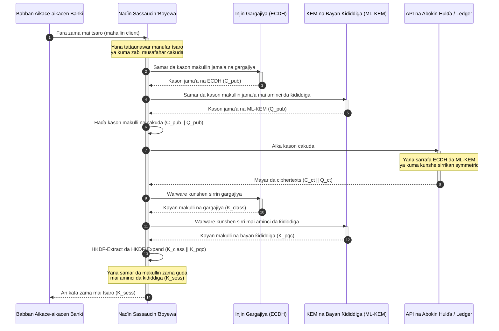

# KyberLib da Ƙaurar Bankuna Bayan Ƙididdiga a 2026: Daga Matakai zuwa Lamba

<!-- lead-start: manual -->
<aside class="post-lead" aria-label="Taƙaitaccen labari">

<strong>TL;DR.</strong> Ababen more rayuwa na banki a 2026 na fuskantar barazana ta tsari mai sananniyar ƙarshe: lissafi a matakin quantum zai karya musayar makullai ta RSA da ECC da ke kare zirga-zirgar bayanai a kan hanya a yau. Matakan tarayya da takardun manufofin masu sa-ido sun wayar da kai; aiwatarwar fasaha har yanzu tana warwatse. <a href="https://github.com/sebastienrousseau/kyberlib">KyberLib</a> tsari ne na injiniya na buɗaɗɗen tushe da ke ƙaura da labarin bayan ƙididdiga zuwa lambar Rust ta zahiri mai amincin ƙwaƙwalwa — yana aiwatar da ML-KEM da NIST ya tsara (FIPS 203) a bayan iyakokin abstraction masu sassaucin ɓoyewa, don cibiyoyi su inganta tsaron sufuri da kunshe makullai kafin hare-haren "Store Now, Decrypt Later" su kai ga ma'ajiyarsu.

<strong>Manyan abubuwan ɗauka</strong>

<ul class="post-lead-takeaways">
  <li><strong>Daga manufofi zuwa lambar da ana iya bincika.</strong> KyberLib na ƙaura da ɓoyewar bayan ƙididdiga daga taswirorin dabara marasa zahiri zuwa aiwatarwar Rust ta zahiri, mai saurin aiki, da ana iya yin awo da bincike a kanta.</li>
  <li><strong>Aiwatar da FIPS 203 ML-KEM da aka tsara.</strong> Ɗakin karatun na aiwatar da ML-KEM — algorithm na kafa makulli da aka kammala a ƙarƙashin NIST FIPS 203 — yana riƙe dacewa daidai da tsammanin hukumomin duniya.</li>
  <li><strong>Sassaucin ɓoyewa ta ƙira.</strong> Tsayayyun iyakokin abstraction na bawa aikace-aikacen banki damar musanya tushen ɓoyewa ba tare da sake rubutu mai tsada da saurin kuskure ba.</li>
  <li><strong>Amincin ƙwaƙwalwa ta ƙarfin Rust.</strong> Dokokin mallaka na lokacin tattarawa na kawar da buffer overflow da ɗigon ƙwaƙwalwa da ke addabar tsofaffin ɗakunan karatu na ɓoyewa na tushen C, a gudun zero-cost abstraction.</li>
  <li><strong>Rage alhakin amana.</strong> Shaidar ƙaura da ana iya gani da gwadawa na bawa daraktoci rikodin "matakan da suka dace" da binciken alhakin kai na DORA Article 5 ke buƙata.</li>
</ul>

<strong>Karatu mai alaƙa:</strong> <a href="/2026-05-18-quantum-cryptography-standards-developments-2026/">Matakan ɓoyewar ƙididdiga 2026</a> · <a href="/2026-05-28-dora-ai-act-data-sovereignty-banking-compliance-stack-2026/">Tarin bin doka na DORA + AI Act</a> · <a href="/2026-05-20-cloud-native-banking-financial-institutions-2026/">Banki na cloud-native</a>

</aside>
<!-- lead-end -->

Ƙaurar bayan ƙididdiga ta daina zama atisayen tsarawa. A 2026 buƙata ce ta aiki mai gudana, kuma gibin da ke tsakanin nufin hukumomi da aiwatarwar injiniya shi ne inda haɗarin yake zaune yanzu. [KyberLib ⧉](https://github.com/sebastienrousseau/kyberlib "kyberlib") na rufe wani ɓangare na wannan gibi: ɗakin karatu na Rust mai amincin ƙwaƙwalwa, wanda aka shirya don samarwa, da ke aiwatar da ML-KEM bisa sigogin FIPS 203 da aka kammala, ya kuma naɗe shi cikin iyakokin sassaucin ɓoyewa da kadarorin mu'amala na banki ke buƙata a zahiri.

---

> **Taƙaitaccen Hukumar Gudanarwa / Manyan Abubuwan Ɗauka**
>
> - **Barazanar ta riga ta fara aiki.** Maƙiya na gudanar da girbin "Store Now, Decrypt Later" a yau; sirrin bayanai zai rushe baya-baya ranar da kwamfutar quantum mai ƙarfin karya ɓoyewa ta iso.
> - **An kammala matakan.** NIST FIPS 203 (ML-KEM) da FIPS 204 (ML-DSA) na bawa kwamitocin bincike ma'auni bayyananne da ana iya gwadawa — babu sauran hujjar "muna jiran matakai".
> - **KyberLib shi ne tsarin injiniya.** Rust mai amincin ƙwaƙwalwa, tattarawar `no_std` don HSMs da katunan smart, da tsare-tsaren musafahar cakuda da ke kiyaye haɗin kai da tsarukan gargajiya.
> - **Sassaucin ɓoyewa ita ce manufa mai ɗorewa.** Tsayayyun iyakokin abstraction na bawa tushen ɓoyewa damar canzawa ba tare da sake rubuta aikace-aikace ba — darasin da ya fi kowane algorithm guda rayuwa.
> - **Hukumar gudanarwa ce ke ɗauke da alhakin.** DORA Article 5 na ɗora wa daraktoci alhaki na kai; lambar ƙaura da ana iya bincika da gani ita ce shaidar da ke biyan wannan buƙata.
>
---

## Me Yasa Wannan Aikin Buɗaɗɗen Tushe Ke Da Muhimmanci a 2026

Yayin da ɓoyewar asymmetric ke gabatowa tsufa, barazanar ba ta jiran a gina kwamfutar quantum mai ƙarfin karya ɓoyewa ba. Maƙiya na aiwatar da hare-haren **"Store Now, Decrypt Later" (SNDL)** yanzu — suna girbin zirga-zirgar da aka ɓoye ta mu'amalar bankunan kamfanoni, sirrin kasuwanci, da sadarwar cibiyoyi, da nufin warware su da zarar ƙarfin quantum ya kammala. Ga banki, kowace musafaha ta gargajiya a kan layi a yau keta sirri ce mai ranar fashewa da aka jinkirta.

Hukumomin sa-ido sun mayar da martani da wajibai na zahiri:

1. **DORA Article 6 (gudanar da haɗarin ICT)** na buƙatar cibiyoyi su zana taswira, su gano, su kuma rage raunuka a duk faɗin kadarorin ɓoyewarsu — har da musayar makullai ta asymmetric da ke ɓoye cikin middleware da babu wanda ya yi wa lissafi.
2. **NIST FIPS 203 da 204** na kafa matakan hukuma na bayan ƙididdiga don kunshe makullai (ML-KEM) da sa hannun dijital (ML-DSA), suna bawa kwamitocin bincike ma'auni da aka tsara wanda ake auna ci gaban ƙaura da shi.

Aiwatar da wannan ƙaura ba tare da kawo cikas ga ayyuka masu gudana ba na buƙatar wuce takardun manufofi zuwa **ababen more rayuwa na ɓoyewa na buɗaɗɗen tushe da ana iya bincika**. [KyberLib ⧉](https://github.com/sebastienrousseau/kyberlib "kyberlib") na bayar da daidai wannan: ɗakin karatu na Rust mai amincin ƙwaƙwalwa da ya dace da FIPS 203 wanda ke mai da sauyin bayan ƙididdiga zuwa bututun injiniya da ana iya aunawa da tabbatarwa — ya kuma karkatar da tattaunawar saka hannun jari ta fasaha zuwa Return on Resilience na zahiri.

## Ruwan Tabarau na Gine-gine

KyberLib na zama a bayan tsayayyun iyakokin API, yana kare manyan aikace-aikacen mu'amala na banki daga sauye-sauye a tushen ɓoyewa na ƙananan matakai.

| Shimfiɗa | Yanke Shawarar Ƙira | Me Yasa Yake Da Muhimmanci | Haɗari Idan Ba A Kula Ba |
|---|---|---|---|
| **Tushe** | Kunshe makullai na FIPS 203 ML-KEM | Yana maye gurbin musayar makullai ta Diffie-Hellman da RSA na gargajiya da tsarukan tushen lattice | Rashin dacewa da sigogin FIPS 203 da aka kammala, wanda ke kai ga faɗuwar binciken bin ƙa'ida |
| **Harshe** | Aiwatarwar Rust mai amincin ƙwaƙwalwa | Yana kawar da raunukan lalacewar ƙwaƙwalwa (buffer overflow, use-after-free) da suka zama ruwan dare a C/C++ | Yawaitar dogaro da ke lalata amincin sarkar ginin |
| **Abstraction** | Tsayayyun iyakoki masu sassaucin ɓoyewa | Aikace-aikace na canza algorithm a bayan interface guda yayin da matakai ke girma | Tushen da aka ɗaure da ƙarfi yana tilasta sake rubutu da hannu a kowace ƙaura ta gaba |
| **Tura** | Musafahohin ɓoyewa ta cakuda | Yana haɗa KEMs na bayan ƙididdiga da algorithms na gargajiya cikin ambulan mai naɗi biyu | Asarar haɗin kai da tsofaffin tsaruka ko ɓatan daidaitawa a shiru |
| **Tabbaci** | Asalin SLSA Level 3 da gwaje-gwaje da ana iya bincika | Yana tabbatar da tushen lamba da asalinta; ana iya bincika misalai layi-layi | Wasan kwaikwayo na tsaro — ɗakunan karatu na baƙin akwati waɗanda kurakuran aiwatarwarsu ke bayyana a samarwa |

## Alamomin Aiki da Za A Bi

Nuna bin ƙa'idar bayan ƙididdiga ga hukumomin gudanarwa da masu sa-ido na nufin bin diddigin ma'aunai na zahiri da ana iya ƙididdigewa:

| Alama | Ma'auni | Tushen Ƙa'ida | Aiwatarwa a Dandamali |
|---|---|---|---|
| **Dacewar FIPS 203 ML-KEM** | Bin ƙa'ida 100% da sigogin da aka kammala (ML-KEM-512/768/1024) | NIST FIPS 203 | Ɓoyewar lattice da aka tabbatar da sigoginta, da aka tattara cikin modules na KyberLib |
| **Lissafin ɓoyewa** | Cikakken lissafin amfani da musayar makullai ta asymmetric a duk tsaruka | NIST SP 1800-38 | Wakilan dubawa masu sarrafa kansu da ke rubuta cipher suites masu aiki zuwa rajista ta tsakiya |
| **Musayar makullai ta cakuda** | Kashi na musafahohin shimfiɗar sufuri da ke gudana cikin ambulan cakuda | DORA Article 6 | Proxies na hanyar sadarwa da ke naɗe musafahohin TLS 1.3 na gargajiya cikin kunshewar PQC |
| **Tattarawar `no_std`** | Ikon tattarawa ba tare da daidaitaccen ɗakin karatu na Rust ba don na'urori masu ƙayyadewa | DORA Article 30 | Tattarawar `no_std` ta sharaɗi a KyberLib don Hardware Security Modules |
| **Ma'aunin sassaucin ɓoyewa** | Lokaci a mintuna na musanya tushen ɓoyewa a faɗin API gateway | UK PRA SS1/23 | Rajistojin tuƙi na abstraction da ke gudanar da rabon algorithm ta masu canji na lokacin gudana |

## Me Yasa Rust Ke Da Muhimmanci ga Ɓoyewar Bayan Ƙididdiga

Aiwatar da algorithms na bayan ƙididdiga irin su ML-KEM na buƙatar hadaddun ayyukan lissafi na ƙananan matakai a kan zoben polynomial. A tarihi, gudanar da waɗannan ayyuka a gudun samarwa na nufin C/C++ ko assembly da aka rubuta da hannu — babban filin hari na lalacewar ƙwaƙwalwa, a daidai lambar da banki ba zai iya ɗaukar kuskurenta ba.

Rust na canza matsayin tsaro na injiniyancin ɓoyewa ta hanyoyi uku na zahiri:

1. **Amincin ƙwaƙwalwa na lokacin tattarawa.** Tsarin mallaka na Rust na tabbatar da cewa an hana buffer overflow, double free, da kurakuran use-after-free tun a lokacin tattarawa. Wannan na da muhimmanci sosai ga ɗakunan karatu na bayan ƙididdiga, inda girman makullai da ciphertexts ya fi na takwarorinsu na gargajiya yawa.
2. **Abstraction marasa tsada kuma tabbatattu.** Rust na tattarawa zuwa lambar inji ta asali ba tare da garbage collector ba, don haka gudun aiki da sawun ƙwaƙwalwa na kai ko wuce na ɗakunan karatu na tushen C tare da kiyaye aminci.
3. **Dacewar `no_std`.** KyberLib na tattarawa ba tare da daidaitaccen ɗakin karatu na Rust ba, don haka yana gudana a yanayi masu ƙayyadewa na bare-metal — har da Hardware Security Modules da katunan smart — yana riƙe ɓoyewa ta matakin banki cikin iyakokin tsaro na zahiri.

## Ƙirƙirar Gine-gine Mai Sassaucin Ɓoyewa

Halin gazawa na gargajiya a ƙaurar ɓoyewa shi ne ɗaurin lamba da ƙarfi: zato na musamman na algorithm da aka saka kai tsaye cikin dabarar aikace-aikace, wanda ake sake ganowa cikin zafi a kowane sauyi. Manufa mai ɗorewa ta 2026 ita ce **sassaucin ɓoyewa** — shimfiɗar abstraction da ke ɗaukar algorithms a matsayin modules masu musanyuwa a bayan tsayayyen interface, don ƙaurar gaba ta zama sauyin daidaitawa maimakon sake rubuta dukan kadarori.

Jerin da ke ƙasa na nuna yadda naɗin sassaucin ɓoyewa na KyberLib ke daidaita musafahar musayar makullai ta cakuda (ta gargajiya tare da ta bayan ƙididdiga):

Ambulan cakuda shi ne dalla-dallar da ke da muhimmanci a aikace. Har sai tushen bayan ƙididdiga ya tara shekaru na binciken samarwa, makullin zama na fitowa daga sirrin gargajiya da na bayan ƙididdiga duka biyu: dole maharin ya karya ECDH **da** ML-KEM kafin ya dawo da tashar. Abokan hulɗa da ba su yi ƙaura ba na ci gaba da aiki; waɗanda suka yi na samun kariyar tushen lattice nan take.

## Littafin Dabarun Hukumar Gudanarwa

Tsaron bayan ƙididdiga ba batun ɓoyewa na ofishin baya ba ne; batun gudanarwa ne na hukumar gudanarwa mai hannun jari na kai. Ya kamata manyan manajoji su tsara ƙaurar ta fuskar alhakin amana:

- **DORA Article 5 (gudanarwa da ƙungiya)** na ɗora wa hukumar daraktoci alhaki na kai kan tsaron ICT. Gwaje-gwajen buɗaɗɗen tushe da ana iya gani su ne shaidar kai tsaye da binciken alhakin kai ke nema — "mun zaɓi aiwatarwar FIPS 203 da ana iya bincika kuma ga sakamakon gwajin dacewarta" amsa ce da za a iya karewa; "mai sayar mana ya tabbatar mana" ba haka ba ce.
- **Gudanar da haɗarin model (US Fed SR 11-7 / UK PRA SS1/23)** na shafar gine-ginen naɗin ɓoyewa kamar yadda yake shafar models na farashi. Ya kamata shimfiɗoyin abstraction su bi ta tabbatarwar MRM, har da aiki a ƙarƙashin yanayin tarwatsewa mai tsanani.
- **Jarin haɗarin aiki na Basel III** na sakawa balagar sarrafawa da aka nuna lada. Musafahohin cakuda da aka gwada na rage bayanin haɗarin aiki na cibiyar na dogon lokaci, suna rage ƙarin jari da kuma sako ƙarfin ma'auni don amfanin baitulmali mai aiki.

## Abin da Wannan Ke Nufi Bisa Nau'in Banki

### Manyan Bankunan Duniya Masu Muhimmanci ga Tsarin (G-SIBs)

G-SIBs na gudanar da kadarorin mu'amala masu cike da tsofaffin tsaruka, don haka ƙuntatawarsu ta farko ita ce ganowa: sanin inda musayar makullai ta asymmetric ke faruwa a zahiri. Lissafin ɓoyewa mai ci gaba a ƙarƙashin jagorancin NIST SP 1800-38 na zuwa farko; sannan KyberLib na bayar da ɗakin karatu da aka tsara, mai amincin ƙwaƙwalwa, don aiwatar da kunshe makullai na bayan ƙididdiga a kowane node na zamani da lissafin ya bayyana.

### Bankunan Mu'amala da na Kamfanoni

Sirri a kan hanyoyin biyan kuɗi shi ne jigon kasuwancin. Saboda KyberLib na tattarawa zuwa na'urorin bare-metal na `no_std`, bankunan mu'amala za su iya tura musafahohin bayan ƙididdiga kai tsaye cikin na'urorin tuƙin biyan kuɗi na gefe da na gudanar da liquidity — ba a shimfiɗar aikace-aikace kawai ba.

### Bankunan Yanki da Ƙanana

Cibiyoyin yanki na fuskantar girbi iri ɗaya da gwamnatoci ke ɗaukar nauyi, ba tare da kasafin bincike na G-SIB ba. Aiwatarwar Rust ta buɗaɗɗen tushe da ana iya bincika na ba su hanya kai tsaye zuwa dacewar NIST FIPS 203 nan take, ba tare da shawarwarin taswirorin masu sayarwa na baƙin akwati ba.

## Daga Taswirori zuwa Lambar da Ke Tattarawa

Sauyin bayan ƙididdiga aiki ne na injiniya mai gudana, kuma cibiyoyin da za su riƙe amincewar masu sa-ido, abokan hulɗa, da ma'aikatan baitulmali na kamfanoni har ƙarshen 2026 su ne waɗanda ke ƙaura daga taswirorin dabara zuwa lambar da ana iya gani kuma take tattarawa. Umarnin gudanarwa na biyo kai tsaye: a bincika wuraren musayar makullai na gargajiya, a tura musafahohin cakuda a kan tashoshi mafi daraja, a kuma gina tsayayyun iyakokin abstraction da ke sa kowace musanyar tushe ta gaba ta zama aikin yau da kullum. KyberLib na mai da kowanne daga waɗannan matakai ƙarfin aiki da ana iya aunawa maimakon alkawarin nunin faifai.

## Tambayoyin da Akan Yi Akai-akai

**Shin KyberLib ya dace da matakan NIST da aka kammala?**

Eh. An ƙera KyberLib a kewayen sigogin ML-KEM kamar yadda aka kammala su a FIPS 203, yana riƙe ɗakin karatun da aka tattara daidai da tsammanin hukumomin tarayya da na duniya.

**Shin ɗakin karatu na bayan ƙididdiga na buƙatar na'urori na musamman?**

A'a. Aiwatarwar Rust ta KyberLib na tattarawa zuwa daidaitattun gine-ginen tsaruka. Ƙarfinta na `no_std` na ƙara ba ta damar gudana a kan Hardware Security Modules na musamman da katunan smart inda ake buƙatar riƙon makullai na zahiri.

**Ta yaya "Store Now, Decrypt Later" ke shafar bin ƙa'ida a yanzu?**

Idan shimfiɗar sufuri ta dogara da RSA ko ECC na gargajiya, maƙiya za su iya girbin zirga-zirga a yau su kuma warware ta da zarar ƙarfin quantum ya kammala. Musayar makullai ta cakuda da aka tura yanzu na riƙe bayanan da aka kama a bayan kariyar tushen lattice.

**Me yasa musafahohin cakuda maimakon ƙaura kai tsaye zuwa tushen bayan ƙididdiga?**

Ambulan cakuda na samar da makullin zama daga sirrin gargajiya da na bayan ƙididdiga duka biyu, don haka tsaron na nan sai dai idan an karya su duka. Wannan na kiyaye haɗin kai da abokan hulɗa da ba su yi ƙaura ba yayin da sabbin tushe ke tara binciken samarwa.

## Bayanai

- National Institute of Standards and Technology, (2024). [FIPS 203: Matakin Hanyar Kunshe Makullai mai Tushen Module-Lattice ⧉](https://www.nist.gov/news-events/news/2024/08/nist-releases-first-3-finalized-post-quantum-encryption-standards "Sanarwar NIST FIPS 203").
- Board of Governors of the Federal Reserve System, (2011). [Jagorancin Sa-ido kan Gudanar da Haɗarin Model (SR Letter 11-7) ⧉](https://web.archive.org/web/20260414150921/https://www.federalreserve.gov/supervisionreg/srletters/sr1107.htm "Federal Reserve SR 11-7").
- European Parliament and Council of the European Union, (2022). [Dokar (EU) 2022/2554 kan juriyar aiki ta dijital ga fannin kuɗi (DORA) ⧉](https://eur-lex.europa.eu/legal-content/EN/TXT/?uri=CELEX%3A32022R2554 "Dokar DORA").
- NIST National Cybersecurity Center of Excellence, (2025). [Ƙaura zuwa Ɓoyewar Bayan Ƙididdiga (NIST SP 1800-38) ⧉](https://www.nccoe.nist.gov/projects/migration-post-quantum-cryptography "NIST SP 1800-38").
- GitHub, (2026). [Ma'ajiyar buɗaɗɗen tushe ta kyberlib ⧉](https://github.com/sebastienrousseau/kyberlib "Ma'ajiyar kyberlib").

<!-- enrich-start -->
<aside class="author-card" aria-label="Game da marubucin"><strong class="author-card-name"><a href="/about/index.html">Sebastien Rousseau</a></strong>Babban masanin fasahar banki yana rubutu kan amfani da AI, ababen more rayuwa na biyan kuɗi, kuɗin tokenised, ISO 20022, tsaron bayan ƙididdiga, sabis na kuɗi na cloud-native, ababen more rayuwa na buɗaɗɗen tushe, da kasuwannin dijital da aka tsara.Shekaru 20+ a HSBC Commercial &amp; Investment Bank, PayPal, Barclays, Shazam, AKQA, Virgin Group. <a href="/about/index.html">Cikakken bayani</a> &middot; <a href="https://www.linkedin.com/in/sebastienrousseau/" rel="external noopener">LinkedIn</a> &middot; <a href="https://github.com/sebastienrousseau" rel="external noopener">GitHub</a></aside>

Bita ta ƙarshe <time datetime="2026-06-12">2026-06-12</time>.

<!-- enrich-end -->
