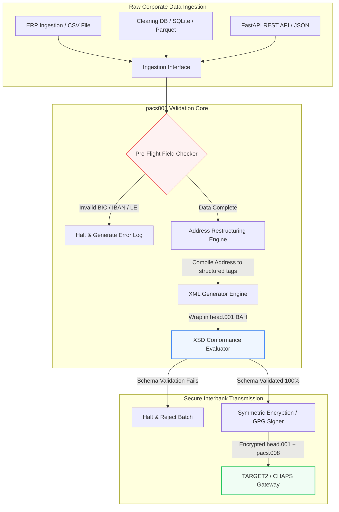

---

# Front Matter (YAML)

author: "contact@sebastienrousseau.com (Sebastien Rousseau)"
banner_alt: "Ma'aikaciyar ofis tare da mataimakin murya da kwamfutar tafi-da-gidanka — alama ce ta saƙonnin biyan kuɗi tsakanin bankuna masu tsari, masu karatu da na'ura, waɗanda sarrafa pacs.008 ke sa su zama masu shirye-shirye"
banner_height: "1597"
banner_width: "2584"
banner: "https://cloudcdn.pro/stocks/images/tyler-prahm-lmV3gJSAgbo.webp"
cdn: "https://cloudcdn.pro"
charset: "UTF-8"
cname: "sebastienrousseau.com"
copyright: "© Copyright 2025 - 2026 - Sebastien Rousseau. All rights reserved."
date: "June 15, 2026"
description: "Pacs008 ɗakin karatu ne na Python na buɗaɗɗen tushe wanda ke sarrafa samar da tabbatar da saƙon canja wurin kuɗin abokin ciniki na ISO 20022 pacs.008 FI-to-FI — adireshi mai tsari, naɗaɗa BAH head.001, bincike na BIC/LEI/IBAN, gano UETR ta OpenTelemetry — an gina shi don yankan SWIFT na Nuwamba 2026."
format-detection: "telephone=no"
hreflang: "ha"
icon: "https://cloudcdn.pro/clients/sebastienrousseau/v1/logos/sebastienrousseau.svg"
id: "https://sebastienrousseau.com/2026-06-15-pacs008-automation-iso-20022-interbank-payments-2026"
image_alt: "Black and White Portrait of Sebastien Rousseau"
image_height: "162"
image_width: "162"
image: "https://cloudcdn.pro/stocks/images/sebastienrousseau.webp"
keywords: "pacs008, ISO 20022 pacs.008, canja wurin kuɗin abokin ciniki FI zuwa FI, adireshi mai tsari, SWIFT CBPR+, BAH head.001, TARGET2, CHAPS, Fedwire, DORA, BCBS 239, Basel III, UETR, tabbatar da LEI, SEPA VoP"
language: "ha-NG"
last_reviewed: "2026-06-15"
layout: "report"
locale: "ha_NG"
logo_alt: "Logo for Sebastien Rousseau"
logo_height: "44"
logo_width: "44"
logo: "https://cloudcdn.pro/clients/sebastienrousseau/v1/logos/sebastienrousseau.svg"
menu: ""
measurementID: "G-169G4ET5HQ"
name: "Sebastien Rousseau"
permalink: "https://sebastienrousseau.com/2026-06-15-pacs008-automation-iso-20022-interbank-payments-2026"
rating: "general"
referrer: "no-referrer"
robots: "index, follow"
schema: "FAQPage, Article"
seo_title: "Sarrafa pacs.008 don Zamanin ISO 20022"
short_name: "sebastienrousseau"
subtitle: "Saƙon pacs.008 shi ne inda bayanan biyan kuɗi tsakanin bankuna, adireshi mai tsari, bin doka, tafiyarwa, da ayyukan daidaitawa suka haɗu."
tags: "pacs008, ISO 20022, biyan kuɗi tsakanin bankuna, biyan kuɗi mai yawa, Python"
theme-color: "0, 83, 191"
title: "Gina Sarrafa pacs.008 don Zamanin ISO 20022 Tsakanin Bankuna a 2026"
url: "https://sebastienrousseau.com/2026-06-15-pacs008-automation-iso-20022-interbank-payments-2026"
viewport: "width=device-width, initial-scale=1, shrink-to-fit=no"

# RSS - The RSS feed front matter (YAML).
atom_link: "https://sebastienrousseau.com/2026-06-15-pacs008-automation-iso-20022-interbank-payments-2026/rss.xml"
category: "Finance"
docs: https://validator.w3.org/feed/docs/rss2.html
generator: "Static Site Generator (SSG) (version 0.0.26)"
item_description: "Pacs008 yana ba da tushen Python na buɗaɗɗen tushe don sarrafa saƙonnin canja wurin kuɗin abokin ciniki na ISO 20022 FI-to-FI a zamanin biyan kuɗi tsakanin bankuna."
item_guid: "https://sebastienrousseau.com/2026-06-15-pacs008-automation-iso-20022-interbank-payments-2026/rss.xml"
item_link: "https://sebastienrousseau.com/2026-06-15-pacs008-automation-iso-20022-interbank-payments-2026/rss.xml"
item_pub_date: "Mon, 15 Jun 2026 06:06:06 +0000"
item_title: "Gina Sarrafa pacs.008 don Zamanin ISO 20022 Tsakanin Bankuna a 2026"
last_build_date: "Mon, 15 Jun 2026 06:06:06 +0000"
managing_editor: "contact@sebastienrousseau.com (Sebastien Rousseau)"
pub_date: "Mon, 15 Jun 2026 06:06:06 +0000"
ttl: "60"
type: "article"
webmaster: "contact@sebastienrousseau.com"

# Apple - The Apple front matter (YAML).
apple_mobile_web_app_orientations: "portrait"
apple_touch_icon_sizes: "192x192"
apple-mobile-web-app-capable: "yes"
apple-mobile-web-app-status-bar-inset: "black"
apple-mobile-web-app-status-bar-style: "black-translucent"
apple-mobile-web-app-title: "Sarrafa pacs.008 don Zamanin ISO 20022"
apple-touch-fullscreen: "yes"

# MS Application - The MS Application front matter (YAML).

msapplication-navbutton-color: "0, 83, 191"

# Twitter Card - The Twitter Card front matter (YAML).

twitter_card: "summary_large_image"
twitter_creator: "@wwdseb"
twitter_description: "Pacs008 yana ba da tushen Python na buɗaɗɗen tushe don sarrafa saƙonnin canja wurin kuɗin abokin ciniki na ISO 20022 FI-to-FI a zamanin biyan kuɗi tsakanin bankuna."
twitter_image: "https://cloudcdn.pro/clients/sebastienrousseau/v1/logos/sebastienrousseau.svg"
twitter_image_alt: "Logo of Sebastien Rousseau"
twitter_site: "@wwdseb"
twitter_title: "Sarrafa pacs.008 don Zamanin ISO 20022"
twitter_url: "https://sebastienrousseau.com/2026-06-15-pacs008-automation-iso-20022-interbank-payments-2026"

excerpt: "pacs008 kayan aikin Python ne na buɗaɗɗen tushe wanda ke sa saƙonnin canja wurin kuɗin abokin ciniki na ISO 20022 FI-to-FI su zama masu shirye-shirye — adireshi mai tsari, tabbatarwa, tafiyarwa, ƙugiyoyin bin doka, da wa'adin ƙarshe na SWIFT na Nuwamba 2026 a matsayin tsoffin saiti."

# Humans.txt - The Humans.txt front matter (YAML).
author_website: "https://sebastienrousseau.com"
author_twitter: "@wwdseb"
author_location: "London, UK"
thanks: "Na gode da karatu!"
site_last_updated: "2026-06-15"
site_standards: "HTML5, CSS3, RSS, Atom, JSON, XML, YAML, Markdown, TOML"
site_components: "Kaishi, Kaishi Builder, Kaishi CLI, Kaishi Templates, Kaishi Themes"
site_software: "Static Site Generator, Rust"

---

# Sarrafa Biyan Kuɗi Tsakanin Bankuna na ISO 20022 pacs.008 da Python na Buɗaɗɗen Tushe a 2026

<!-- lead-start -->
<aside class="post-lead" aria-label="Taƙaitaccen labari">

<strong>TL;DR.</strong> A ƙarƙashin jagororin SWIFT CBPR+, Tudun Adireshi Mai Tsari na 14 ga Nuwamba 2026 zai cire adireshi marasa tsari daga TARGET2, CHAPS, Fedwire, Lynx, da SEPA. Pacs008 ɗakin karatu ne na Python na buɗaɗɗen tushe wanda ke sarrafa samar da tabbatar da saƙonnin canja wurin kuɗin abokin ciniki (pacs.008) na ISO 20022 FI-to-FI, yana naɗa biyan kuɗi a cikin Business Application Headers (BAH head.001), kuma yana saka bin doka na adireshi mai tsari a cikin hanyar bayanai kafin saƙon ya taɓa hanyar sadarwar tantancewa.

<strong>Manyan abubuwan ɗauka</strong>

<ul class="post-lead-takeaways">
  <li><strong>Wa'adin ƙarshe na Adireshi Mai Tsari cikakke ne.</strong> Bayan 14 ga Nuwamba 2026, ana cire bulokan adireshi marasa tsari. Pacs008 yana tilasta abubuwan adireshi na gidan waya masu tsari (<code>&lt;TwnNm&gt;</code>, <code>&lt;Ctry&gt;</code>, <code>&lt;PstCd&gt;</code>) a lokacin haɗa bayanai don hana ƙin amincewa a kan iyaka.</li>
  <li><strong>Haɗaɗɗen tsara saƙo.</strong> Yana naɗa abun ciki na biyan kuɗi na pacs.008 cikin ambulafin Business Application Header (head.001) mai bin doka, yana ba da samfurin sarrafa zagaye na yau da kullum.</li>
  <li><strong>Tabbatacciyar algorithm.</strong> Masu tabbatarwa na cikin gida don BICs da Legal Entity Identifiers (LEIs) ta amfani da ƙididdigar checksum na ISO 7064 Modulo 97-10.</li>
  <li><strong>Bibiyya matakin DORA.</strong> Cikakkun kayan aikin OpenTelemetry da aka maɓallinsu da Unique End-to-End Transaction Reference (UETR) don log na bincike na ainihin lokaci da sa hannun bincike na cryptographic.</li>
  <li><strong>Kiyaye matakin amintacciya na hukumar gudanarwa.</strong> Yana daidaita daidaiton saƙon tsakanin bankuna da DORA Mataki na 5, rahoton BCBS 239, da rage babban birni na Basel III Operational Risk.</li>
</ul>

<strong>Karatun da ya shafi wannan:</strong> <a href="https://sebastienrousseau.com/2026-05-19-global-wholesale-payments-economics-2026">Biyan Kuɗi Mai Yawa na Duniya a 2026: ISO 20022, Sabunta RTGS, da Tattalin Arzikin Daidaituwa</a>, <a href="https://sebastienrousseau.com/2026-05-27-ai-operating-system-payments-fraud-routing-resilience-compliance-2026">AI a Matsayin Tsarin Aiki na Biyan Kuɗi: Zamba, Tafiyarwa, Juriya, da Bin Doka a 2026</a>, <a href="https://sebastienrousseau.com/2026-05-12-iso-20022-pacs008-structured-address-deadline">Wa'adin Ƙarshe na pacs.008 Adireshi Mai Tsari na Nuwamba 2026: Hangen Watanni Shida</a>.

</aside>
<!-- lead-end -->

Haɗa giɓi tsakanin bayanan kuɗi na gargajiya da saƙonnin tsakanin bankuna masu tsari ta hanyar bututun Python da aka tabbatar da schema, mai iya bincike.

Mahangar buɗaɗɗen tushe na wannan labarin ita ce [pacs008 ⧉](https://github.com/sebastienrousseau/pacs008 "pacs008 — ɗakin karatu na Python na buɗaɗɗen tushe"). An sanya wurin ajiya a matsayin ɗakin karatu na Python don sarrafa saƙonnin XML na canja wurin kuɗin abokin ciniki na ISO 20022 pacs.008 FI-to-FI.

## Me Yasa Wannan Aikin Buɗaɗɗen Tushe Yake da Mahimmanci a 2026

Ababen more rayuwa na tantancewar biyan kuɗi tsakanin bankuna na duniya na shiga sabuntawar mafi zurfi a kusan rabin ƙarni.

A watan Yuni 2026, sashin sabis na kuɗi yana saurin kusantowa zuwa **Tudun Adireshi Mai Tsari na SWIFT na 14 ga Nuwamba 2026**. Daga wannan kwanan wata gaba, jagororin SWIFT CBPR+, tare da TARGET2, CHAPS, Fedwire, da Lynx na Kanada, za su cire layuka adireshi marasa tsari na gidan waya a hukumance (ta amfani da `<AdrLine>` kawai a cikin bulokan `<PstlAdr>`). Duk cibiyoyin kuɗi masu shiga dole su aika adireshi a tsarin gauraye (`<TwnNm>` da `<Ctry>` masu tsari, tare da matsakaicin abubuwa biyu na `<AdrLine>` don sauran cikakkun bayanai) ko tsari cikakke (abubuwa daban-daban don sunan titi, lambar gini, da lambar gidan waya). Duk saƙon da bai cika wannan ka'idar ba za a ƙi shi a iyakar hanyar sadarwa.

Ga cibiyoyin kuɗi, wannan canji yana haifar da manyan ƙuntatawa na aiki:

1. **Hukuncin ƙin amincewa a iyaka.** Biyan kuɗin da ba su cika ƙa'idodin adireshi mai tsari ba za su fuskanci ƙin amincewar hanyar sadarwa nan da nan, suna haifar da jinkirin ma'amala, toshe ruwa, da jelar ayyuka.
2. **SEPA Verification of Payee (VoP).** Yana wajabta cewa duk Masu Bayar da Sabis na Biyan Kuɗi (PSPs) a cikin yankin SEPA su tabbatar da daidaituwa tsakanin sunan mai karɓa da IBAN kafin aiwatar da canja wurin kuɗi, suna ƙara ƙofa ɗaya na tabbatarwa ga ƙaddamar da saƙo.

[Pacs008](https://github.com/sebastienrousseau/pacs008) yana magance wannan matsala. Ɗakin karatu ne na Python na buɗaɗɗen tushe, mai sauƙi wanda ke sarrafa canjin bayanan kuɗi marasa tsari zuwa saƙonnin canja wurin kuɗin abokin ciniki tsakanin bankuna na ISO 20022 pacs.008 da aka tabbatar gabaɗaya, masu bin schema. Ta hanyar haɗa giɓin gargajiya-zuwa-tsari na bayanai, pacs008 yana ba da Riba Mai Girma kan Juriya (RoR), yana adana babban birni mai aiki kuma yana tabbatar da aiwatarwa a ainihin lokaci a kan dukkan layuka na duniya.

## Dalilin da ya sa na gina pacs008 haka

Ni na rubuta `pacs008` da ɗan'uwansa na sama, `pain001`, kuma rayuwar aikina tana
kan biyan kuɗi na babban sikeli da kuma sarrafa kayan API. Wannan haɗin shi ne
dalilin da ya sa wannan ɗakin karatu yake kamar haka, don haka ya dace a bayyana
shawarwarin a fili maimakon barin su a ɓoye cikin lambar.

**Tabbatarwa tana gudana kafin ƙirƙira, ba bayanta ba.** Al'adar da aka saba a
yawancin tsarin biyan kuɗi ita ce a ƙirƙiri saƙo sannan a duba shi, domin haka
aka tsara tsarin nazari: an ƙirƙiri fayil, wani ya duba shi, keɓancewa su shiga
layi. Wannan tsari yana tabbatar da cewa ana samun kurakurai a wurin da ƙarfin
gyara ya fi ƙaranci — bayan an gama aikin haɗa saƙon, kuma sau da yawa bayan ya
bar cibiyar. Tabbatarwa da farko na nufin adireshi mara bin ƙa'ida ko IBAN mara
kyau ya zama kuskuren gina shirin maimakon ƙin karɓa daga hanyar sadarwa.

**Lasisin MIT ne domin bankuna suna buƙatar karanta dabarun tabbatarwa, ba
amincewa da su kawai ba.** Mai tabbatarwa a rufe yana neman cibiya ta amince da
fahimtar wani game da ƙa'idodin amfani ba tare da bincike ba. Wannan ba abu ne
mai ma'ana a nema daga ƙungiyar da ke ɗauke da nauyin ka'ida ba. Kowace doka a
cikin wannan ɗakin karatu ana iya duba ta, a ƙalubalance ta, a kuma yi mata fork.

**Ana tabbatarwa bisa tsarin XSD na hukuma maimakon sake rubuta shi.** Kwatancen
da aka rubuta da hannu na ƙa'idodin ISO 20022 zai rabu da ainihin yarjejeniyar
hanyar sadarwa da zaran wani ɓangare ya canza. Tsarin XSD shi ne yarjejeniyar;
duk sauran tushe ne na biyu na gaskiya wanda ke jira ya saɓa.

**Tana nufin CI, ba mataki na nazari ba.** Mai tabbatarwa da mutum yake buƙatar
tunawa don gudanar da shi shi ne mai tabbatarwa da ake dainawa gudanarwa a lokacin
matsin lokaci — wato daidai lokacin da ya fi muhimmanci.

Abin da ɗakin karatu bai yi da gangan ba shi ma an yi shi da gangan. Kayan aiki
ne na matakin saƙo. Ba ya maye gurbin injin biyan kuɗi, tsarin binciken takunkumi,
ko gyaran manyan bayanan abokin ciniki da cibiyar dole ta yi tun daga tushe. Yana
sa wannan gyaran ya zama abin tilastawa; ba ya yi maka shi ba.

## Tabarau na Gine-gine na pacs008 a 2026

An gina ɗakin karatu na pacs008 a matsayin injin tabbatarwa da samarwa wanda aka ware, yana tabbatar cewa ana sarrafa shigarwar danye cikin tsari, ana wadatar da su, kuma ana naɗa su a cikin ambulafin daidaitattu:

| Shimfiɗa | Yanke Shawara na Ƙira | Me Yasa Yake da Mahimmanci | Haɗari Idan Ba A Kula Ba |
|---|---|---|---|
| **Shimfiɗar Shigarwa** | Karɓar CSV, JSON, SQLite, da Parquet | Yana saduwa da ƙungiyoyin haɗawar banki inda bayanansu ke zaune, yana hana ƙaurar dandamali. | Karɓar bayanan danye, marasa tabbatar, ko lalatattu. |
| **Shimfiɗar Tabbatarwa** | Tabbatarwa ta gaba-da-tashi a kan schema na XSD na hukuma da ƙa'idodin kasuwanci na al'ada | Yana dakatar da aiwatarwa kuma yana lura da kuskure kafin a aika fayil ɗin biyan kuɗi zuwa hanyar sadarwar tantancewa. | Fayilolin XML marasa inganci suna haifar da ƙin amincewar hanyar sadarwa nan take da jinkirin tantancewa. |
| **Shimfiɗar Ambulafin BAH** | Naɗa Business Application Header (head.001) ta atomatik | Yana daidaita aika saƙo da tafiyarwa bisa ga alamar `<MsgDefIdr>`. | Aika abubuwan ciki na pacs.008 marasa ambulafin waje wanda ake buƙata, yana haifar da ƙin amincewar tsarin. |
| **Shimfiɗar Serialization** | Tallafin XML na yau da kullum da JSON mai bin ISO (TS 23029) | Yana ba da damar fassarar kai tsaye tsakanin abubuwan ciki na XML da JSON, yana goyon bayan REST API na zamani da Kafka streaming. | Wakilcin bayanai da aka raba waɗanda ke karya jagororin ISO na hukuma. |
| **Shimfiɗar Lura** | Bibiyya ta OpenTelemetry da aka maɓalli da UETR | Yana ɗaukar cikakkun hanyoyin aiwatarwa da log, yana ba da binciken ainihin lokaci. | Giɓin bibiyya suna toshe hangen nesa na aiki da bincike. |

## Manyan Siginar Tsakanin Bankuna da Manyan Abubuwan Bin Doka

Don nuna juriya na aiki na ma'amala, manyan manajojin fasaha da haɗari dole su bi takamaiman alamomi na bin doka da za a iya ƙididdiga:

| Sigina | Ma'auni / Matakin Aiki | Tushe na G20 / SWIFT / DORA | Aiwatar da Dandamalin Fasaha |
|---|---|---|---|
| **Bin Doka na Adireshi Mai Tsari** | % na saƙonnin pacs.008 da ke amfani da filayen `<PstlAdr>` da aka tsara gabaɗaya tare da `<TwnNm>` da `<Ctry>` da aka kebanta. | Wa'adin Ƙarshe na SWIFT SR 2026 | Binciken schema na gaba-da-tashi a pacs008 yana ƙi layukan adireshi marasa tsari. |
| **SEPA Verification of Payee** | Tabbatar da daidaituwa tsakanin sunan mai karɓa da IBAN kafin aiwatar da saƙo. | Dokar SEPA VoP | Ajin masu taimakawa na VoP na cikin gida suna aiwatar da tambayoyin tabbatarwa kafin lokaci a kan IBAN/BIC. |
| **Haɗakar BAH head.001** | Kashi na abubuwan ciki na biyan kuɗi masu fita da aka naɗa cikin nasara cikin Business Application Headers. | Jagororin TARGET2 / CBPR+ | Tsarin naɗa BAH yana haɗa ambulafin XML na waje ta atomatik. |
| **LEI Modulo Checksum** | Tabbatar da lambar bincike na ISO 7064 Modulo 97-10 a kan bulokan `<LEI>` na mai bashi da mai bashi. | Umarnin Bank of England | Mai bincike na algorithm yana tabbatar da amincin alamar harafi 20. |
| **Daidaiton Bibiyya na UETR** | 100% na biyan kuɗin da aka samar an saka su tare da Unique End-to-End Transaction Reference mai inganci. | Bayanin SWIFT UETR | Samar da ta atomatik da bibiyya na lambar tushe na UUIDv4 mai haruffa 36. |

## Me Yasa Python Ya Zama Mafi Kyawun Hanya don Sarrafa Tsakanin Bankuna

Manyan dandamalin biyan kuɗi na zamani da ƙungiyoyin ayyukan baitulmali a 2026 sun dogara sosai a kan Python don canjin bayanai, ƙirar kuɗi, da haɗakar bayanan ERP.

Ta hanyar amfani da ɗakin karatu na Python na buɗaɗɗen tushe, cibiyoyi suna samun manyan fa'idodi:

1. **Ƙarancin nauyin tunani da haɗawa mai girma.** Python yana aiki a matsayin gada mai ɗaurewa. Yana ba da damar masu haɓakawa su rubuta sauƙin sauƙi waɗanda ke jawo umarnin biyan kuɗi danye daga bayanan gargajiya, su tabbatar da su a kan ƙa'idodin banki na duniya masu rikitarwa, kuma su fitar da XML mai bin doka cikin tafiyar aiki ɗaya, haɗaɗɗiya.
2. **Cire masu fassara "akwati baƙar fata".** Tashoshi na banki na keɓe galibi suna caji manyan kuɗaɗen lasisi don masu fassara fayil ɗin biyan kuɗi na al'ada. Waɗannan masu fassara akwatuna baƙi ne na keɓe, suna sa ya yi wuya ƙungiyoyin tsaro su bincika yadda ake sarrafa bayanai ko inda aka adana maɓallai. Ɗakin karatu mai buɗaɗɗen tushe, mai iya bincike kamar pacs008 yana tabbatar da cikakken gaskiyar code.
3. **Haɗawa mara katsewa ta CI/CD.** Pacs008 yana haɗawa kai tsaye cikin bututun ci gaba na haɗakawa da turawa, yana ba da damar masu haɓakawa su sarrafa gwajin fayil ɗin biyan kuɗi a matsayin wani ɓangare na rayuwar isar da software na yau da kullum.

## Tsara Bututun Tsakanin Bankuna Mai Iyakancewa

Babbar rauni a tantance tsakanin bankuna ita ce "samar da bach mara sarrafawa" — samar da fayiloli ba tare da bayyananne, mai iya tabbatarwa na zagaye ba. An ƙirƙira pacs008 don aiki a matsayin injin tabbatarwa na tsakiya a cikin bututun ma'amala mai matakai da yawa wanda aka sarrafa shi sosai.

Hanyar aiki da ke ƙasa tana nuna yadda bayanan ma'amala danye ke wucewa ta bututun pacs008 don samar da fayil ɗin pacs.008 mai amintacciya ta cryptographic, mai bin schema, wanda aka naɗa cikin ambulafin BAH:

## Littafin Wasan Hukumar Gudanarwa da Alhakin Amintacciya

Sarrafa biyan kuɗi tsakanin bankuna batun gudanar da haɗari na matakin hukumar gudanarwa ne da gudanar da kamfani. Manyan manajojin dole su magance ingancin bayanan ma'amala ta tabarau na alhaki na amintacciya da rage haɗari na aiki:

- **DORA Mataki na 5 (Hisabin Hukumar).** Yana sanya alhaki kai tsaye, na kansa a kan membobin hukumar don juriya da tsaro na ayyukan ICT na cibiyar. Saboda tantance tsakanin bankuna aiki ne mai mahimmanci na kamfani, hukumomi dole su nuna sun aiwatar da ƙwararrun, ingantattun, kuma masu sarrafa kai na sarrafawa na ma'amala don hana rikicewar ayyuka ko biyan kuɗi da aka jinkirta.
- **BCBS 239 (Tarin Bayanan Haɗari da Rahotanni).** Yana buƙatar cewa rahoton ma'amala na kuɗi ya zama daidai, cikakke, kuma a samar da shi a ainihin lokaci. Pacs008 yana taimakawa cibiyoyi su cimma bin doka na BCBS 239 ta hanyar tabbatar cewa bayanan biyan kuɗi an tsara su cikin tsabta kuma an tabbatar da su a tushe, suna kawar da giɓin bayanai da kuskuren daidaitawar hannu da ke addabar takardar daidai na gargajiya.
- **Rage Cajin Babban Birni na Haɗari na Aiki (Basel III).** A ƙarƙashin jagororin Basel III, manyan ƙimar kuskuren biyan kuɗi da kuɗaɗen shiga na hannu suna ƙara buƙatun babban birni na haɗari na aiki na banki, suna ɗaure babban birni wanda zai iya zama a yi amfani da shi don ba da bashi ko saka hannun jari. Sarrafa kai na bututun biyan kuɗi yana rage waɗannan kuɗaɗen babban birni kai tsaye, yana adana ƙimar takardar balanse.

## Abin da Wannan Ke Nufi Bisa Nau'in Banki

### Bankuna Masu Mahimmancin Tsari na Duniya (G-SIBs)

G-SIBs suna gudanar da manyan, ƙarar ma'amala na kamfani na ƙetare. Babban ƙalubalensu shi ne magance bayanan gargajiya marasa tsari kafin su isa hanyar sadarwar tantancewa. Ta hanyar haɗa pacs008 cikin tashoshin banki na kamfaninsu, G-SIBs na iya ba da kayan aikin tabbatarwa na atomatik ga abokan cinikinsu na kamfani, suna rage kuɗaɗen gyaran biyan kuɗi na hannu kuma suna tabbatar da aiwatarwa a ainihin lokaci a kan hanyar sadarwar SWIFT.

### Bankuna Masu Ma'amala da na Kamfani

Ga bankuna masu ma'amala, ingancin bayanan biyan kuɗi shi ne bambanci na gasa. Ta hanyar ba da kayan aikin tabbatarwa na buɗaɗɗen tushe, mai iya bincike kamar pacs008 ga abokan cinikin baitulmali na kamfani, waɗannan bankuna na iya hanzarta shigarwa, rage ƙin amincewar fayil ɗin biyan kuɗi, kuma su gina amincin abokin ciniki ta hanyar ƙimar sarrafa kai tsaye mafi girma.

### Bankuna na Yanki da Ƙanana

Bankuna na yanki dole su kiyaye bin doka tare da ƙa'idodin biyan kuɗi na duniya ba tare da manyan kasafin kuɗi na fasaha na G-SIBs ba. Pacs008 yana ba da maganin mai sauƙi, mai tsada, kuma mai cikakken bin doka da aka gina kan Python, yana ba da damar ƙananan cibiyoyi su ba da damar ƙaddamar da biyan kuɗi na zamani, masu tsari ba tare da lasisi na keɓe na middleware mai tsada ba.

## Kammalawa: Taswirar Hanya na Tantancewa Tsakanin Bankuna

Wa'adin ƙarshe na adireshi mai tsari na SWIFT na Nuwamba 2026 mai zuwa yana wakiltar iyaka mai ƙarfi ga ayyukan baitulmali na kamfani. Dogaro a kan takardar daidai na gargajiya, shigar bayanai na hannu, da fayilolin biyan kuɗi marasa tsari haɗari ne na kasuwanci mai aiki.

Don tabbatar da ci gaba na ma'amala da rage kuɗaɗen aiki, manyan manajojin fasaha da kuɗi ya kamata su aiwatar da taswirar hanya bayyananne ta tantancewa a yau:

1. **Tilasta tabbatarwa a tushe.** Wajabta cewa duk umarnin biyan kuɗi an tabbatar da su kuma an tsara su bisa ga schema na XSD na ISO 20022 na hukuma kafin barin iyakokin ERP na kamfani.
2. **Bincika bututun bayanai.** Canza daga sarrafa takardar daidai na hannu kuma a aiwatar da tafiyar aiki na Python masu sarrafa kai, masu iya bincike ta amfani da pacs008.
3. **Aiwatar da tsaro mai gauraye.** Tabbatar da cewa fayilolin biyan kuɗin da aka samar an sa hannu kuma an ɓoye su ta cryptographic kafin aikawa, suna gamsar da tsammanin hanyar sadarwa marar amincewa.
4. **Daidaita tare da fifikon amintacciya.** A hukumance bayar da rahoton sarrafa kai na biyan kuɗi da ma'aunin ingancin bayanai ga hukumar, ana tsara saka hannun jari a matsayin shirin rage haɗari na aiki mai mahimmanci a ƙarƙashin DORA.

## Tambayoyin da Akan Yi Akai-akai

**Shin pacs008 yana bin ƙa'idodin adireshi na SWIFT SR 2026 mai zuwa?**

Eh. An tsara pacs008 don tallafawa abin mahimmancin adireshi mai tsari na SWIFT na Nuwamba 2026 mai tsanani, yana tilasta rabe-raben wajibi na abubuwan adireshi na gidan waya (gari, ƙasa, lambar gidan waya) cikin filayen XML na ISO 20022 da aka kebanta.

**Shin pacs008 zai iya naɗa abubuwan ciki na biyan kuɗi cikin Business Application Headers?**

Eh. Saboda pacs008 yana tallafawa naɗa Business Application Header (BAH head.001) ta tushe, yana haɗa ambulafin waje da TARGET2, CHAPS, da hanyoyin sadarwar CBPR+ ke buƙata ta atomatik.

**Me yasa ake fifita ɗakin karatu na buɗaɗɗen tushe a kan masu fassara na keɓe?**

Masu fassara na keɓe akwatuna baƙi ne marasa fahimta, suna sa binciken tsaro ba zai yiwu ba. Ɗakin karatu na buɗaɗɗen tushe, wanda takwarorin sun yi bita kamar pacs008 yana ba da cikakkar gaskiyar code, yana ba da damar ƙungiyoyin tsaro su tabbatar cewa ba a fallasa bayanan biyan kuɗi masu mahimmanci ba a lokacin sarrafawa.

**Wadanne alamomi pacs008 ke tabbatar?**

Pacs008 yana zuwa tare da masu tabbatarwa na cikin gida don Bank Identifier Codes (BICs) da Legal Entity Identifiers (LEIs) ta amfani da ƙididdigar checksum na ISO 7064 Modulo 97-10, da kuma tabbatar da lambar bincike na IBAN da binciken keɓancewar UETR.

## Bayanai

- SWIFT, (2024). *ISO 20022 November 2026 Structured Address Milestone*. La Hulpe: SWIFT. Akwai a: [Abin Mahimmancin ISO 20022 na SWIFT ⧉](https://www.swift.com/standards/iso-20022/iso-20022-bytes/call-action-november-2026 "Abin mahimmancin ISO 20022 na SWIFT").
- Basel Committee on Banking Supervision (BCBS), (2013). *Principles for effective risk data aggregation and risk reporting (BCBS 239)*. Basel: Bank for International Settlements. Akwai a: [Ka'idodin BCBS 239 ⧉](https://www.bis.org/publ/bcbs239.htm "Ka'idodin BCBS 239").
- European Parliament and Council of the European Union, (2022). *Regulation (EU) 2022/2554 on digital operational resilience for the financial sector (DORA)*. Brussels: Official Journal of the European Union. Akwai a: [Dokar DORA ⧉](https://eur-lex.europa.eu/legal-content/EN/TXT/?uri=CELEX%3A32022R2554 "Dokar DORA").
- GitHub, (2026). *pacs008 open-source repository*. Akwai a: [Wurin Ajiya na pacs008 ⧉](https://github.com/sebastienrousseau/pacs008 "Wurin ajiya na pacs008").

<!-- enrich-start -->
<aside class="author-card" aria-label="Game da marubucin"><strong class="author-card-name"><a href="/about/index.html">Sebastien Rousseau</a></strong>Babban masanin fasahar banki yana rubutu kan amfani da AI, ƙaurar ISO 20022, cryptography bayan-ƙididdiga don sabis na kuɗi, da canjin tsari na biyan kuɗi mai yawa.Shekaru 20+ a HSBC Commercial &amp; Investment Bank, PayPal, Barclays, Shazam, AKQA, Virgin Group. <a href="/about/index.html">Cikakken bayani</a> &middot; <a href="https://www.linkedin.com/in/sebastienrousseau/" rel="external noopener">LinkedIn</a> &middot; <a href="https://github.com/sebastienrousseau" rel="external noopener">GitHub</a></aside>

Bita ta ƙarshe <time datetime="2026-06-15">2026-06-15</time>.

<aside class="related-posts" aria-labelledby="related-heading">
<h2 id="related-heading" class="related-heading">Karatun da ya shafi wannan</h2>

<article class="related-card"><footer class="related-body"><h3><a href="https://sebastienrousseau.com/2026-05-19-global-wholesale-payments-economics-2026">Biyan Kuɗi Mai Yawa na Duniya a 2026: ISO 20022, Sabunta RTGS, da Tattalin Arzikin Daidaituwa</a></h3>
<time datetime="2026-05-19">2026-05-19</time>
</footer></article>
<article class="related-card"><footer class="related-body"><h3><a href="https://sebastienrousseau.com/2026-05-27-ai-operating-system-payments-fraud-routing-resilience-compliance-2026">AI a Matsayin Tsarin Aiki na Biyan Kuɗi: Zamba, Tafiyarwa, Juriya, da Bin Doka a 2026</a></h3>
<time datetime="2026-05-27">2026-05-27</time>
</footer></article>
<article class="related-card"><footer class="related-body"><h3><a href="https://sebastienrousseau.com/2026-05-12-iso-20022-pacs008-structured-address-deadline">Wa'adin Ƙarshe na pacs.008 Adireshi Mai Tsari na Nuwamba 2026: Hangen Watanni Shida</a></h3>
<time datetime="2026-05-12">2026-05-12</time>
</footer></article>

</aside>
<!-- enrich-end -->
