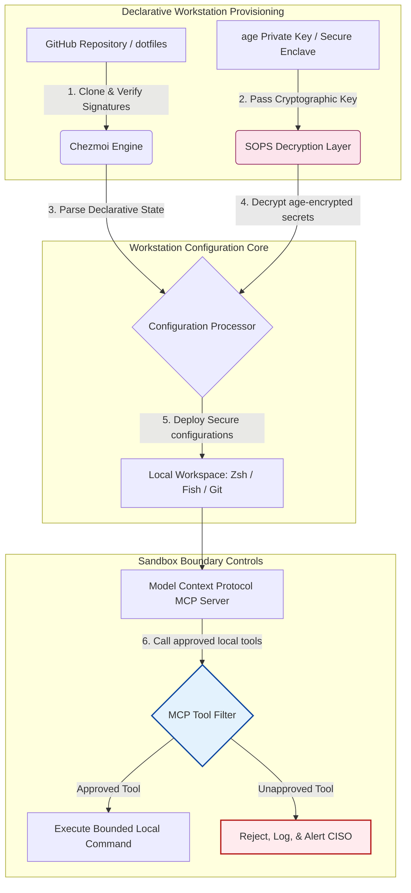

---

# Front Matter (YAML)

author: "contact@sebastienrousseau.com (Sebastien Rousseau)"
banner_alt: "Wurin aikin mai haɓakawa cikin ƙarancin haske — alama ce ta dotfiles masu sanin AI, masu sake samarwa, masu aminci don sabar MCP, sa hannun SLSA, asirai na age/SOPS, da daidaita shells da yawa"
banner_height: "1597"
banner_width: "2584"
banner: "https://cloudcdn.pro/stocks/images/almas-salakhov-Vq2ap8aFFEs.webp"
cdn: "https://cloudcdn.pro"
charset: "UTF-8"
cname: "sebastienrousseau.com"
copyright: "© Copyright 2025 - 2026 - Sebastien Rousseau. All rights reserved."
date: "June 16, 2026"
description: "Dotfiles masu sanin AI sun zama tsari mai aminci, mai ikon sake samarwa na wurin aiki don zamanin MCP — saiti bayyananne ta Chezmoi, asirai na SOPS/age, asalin SLSA Level 3, daidaita shells da yawa, da iyakokin sandbox don wakilan AI na gida."
format-detection: "telephone=no"
hreflang: "ha"
icon: "https://cloudcdn.pro/clients/sebastienrousseau/v1/logos/sebastienrousseau.svg"
id: "https://sebastienrousseau.com/2026-06-16-ai-aware-dotfiles-secure-reproducible-workstation-2026"
image_alt: "Hoton Sebastien Rousseau a baki da fari"
image_height: "162"
image_width: "162"
image: "https://cloudcdn.pro/stocks/images/sebastienrousseau.webp"
keywords: "dotfiles, Chezmoi, MCP, Model Context Protocol, SLSA, SOPS, age encryption, declarative configuration, developer workstation, DORA Article 5, NIST CSF 2.0, supply chain security, agentic AI, multi-shell parity, Zsh, Fish, Nushell"
language: "ha-NG"
last_reviewed: "2026-06-16"
layout: "report"
locale: "ha_NG"
logo_alt: "Tambarin Sebastien Rousseau"
logo_height: "44"
logo_width: "44"
logo: "https://cloudcdn.pro/clients/sebastienrousseau/v1/logos/sebastienrousseau.svg"
menu: ""
measurementID: "G-169G4ET5HQ"
name: "Sebastien Rousseau"
permalink: "https://sebastienrousseau.com/2026-06-16-ai-aware-dotfiles-secure-reproducible-workstation-2026"
rating: "general"
referrer: "no-referrer"
robots: "index, follow"
schema: "FAQPage, Article"
seo_title: "Dotfiles Masu Sanin AI don Wurin Aikin Mai Haɓakawa Mai Aminci"
short_name: "sebastienrousseau"
subtitle: "Wurin aikin mai haɓakawa yanzu ɓangare ne na sarkar samar da AI; dotfiles na buƙatar tsaro, ikon sake samarwa, tsabtacewar asirai, da tafiyar aiki mai sanin MCP."
tags: "dotfiles, kayan aikin mai haɓakawa, MCP, SLSA, wurin aiki mai aminci, chezmoi, macOS, Linux, WSL"
theme-color: "0, 83, 191"
title: "Dotfiles Masu Sanin AI a 2026: Gina Wurin Aikin Mai Haɓakawa Mai Aminci, Mai Ikon Sake Samarwa don MCP, SLSA, da Daidaita Shells da Yawa"
url: "https://sebastienrousseau.com/2026-06-16-ai-aware-dotfiles-secure-reproducible-workstation-2026"
viewport: "width=device-width, initial-scale=1, shrink-to-fit=no"

# RSS - The RSS feed front matter (YAML).
atom_link: "https://sebastienrousseau.com/2026-06-16-ai-aware-dotfiles-secure-reproducible-workstation-2026/rss.xml"
category: "Technology"
docs: https://validator.w3.org/feed/docs/rss2.html
generator: "Static Site Generator (SSG) (version 0.0.26)"
item_description: "Duba dotfiles bayyananne don wurin aikin mai haɓakawa mai aminci, mai ikon sake samarwa a macOS, Linux, da WSL, tare da sanin MCP, SLSA, age, SOPS, da daidaita shells da yawa."
item_guid: "https://sebastienrousseau.com/2026-06-16-ai-aware-dotfiles-secure-reproducible-workstation-2026/rss.xml"
item_link: "https://sebastienrousseau.com/2026-06-16-ai-aware-dotfiles-secure-reproducible-workstation-2026/rss.xml"
item_pub_date: "Tue, 16 Jun 2026 06:06:06 +0000"
item_title: "Dotfiles Masu Sanin AI a 2026: Gina Wurin Aikin Mai Haɓakawa Mai Aminci, Mai Ikon Sake Samarwa don MCP, SLSA, da Daidaita Shells da Yawa"
last_build_date: "Tue, 16 Jun 2026 06:06:06 +0000"
managing_editor: "contact@sebastienrousseau.com (Sebastien Rousseau)"
pub_date: "Tue, 16 Jun 2026 06:06:06 +0000"
ttl: "60"
type: "article"
webmaster: "contact@sebastienrousseau.com"

# Apple - The Apple front matter (YAML).
apple_mobile_web_app_orientations: "portrait"
apple_touch_icon_sizes: "192x192"
apple-mobile-web-app-capable: "yes"
apple-mobile-web-app-status-bar-inset: "black"
apple-mobile-web-app-status-bar-style: "black-translucent"
apple-mobile-web-app-title: "Dotfiles Masu Sanin AI don Wurin Aiki Mai Aminci"
apple-touch-fullscreen: "yes"

# MS Application - The MS Application front matter (YAML).

msapplication-navbutton-color: "0, 83, 191"

# Twitter Card - The Twitter Card front matter (YAML).

twitter_card: "summary_large_image"
twitter_creator: "@wwdseb"
twitter_description: "Duba dotfiles bayyananne don wurin aikin mai haɓakawa mai aminci, mai ikon sake samarwa a macOS, Linux, da WSL, tare da sanin MCP, SLSA, age, SOPS, da daidaita shells da yawa."
twitter_image: "https://cloudcdn.pro/clients/sebastienrousseau/v1/logos/sebastienrousseau.svg"
twitter_image_alt: "Tambarin Sebastien Rousseau"
twitter_site: "@wwdseb"
twitter_title: "Dotfiles Masu Sanin AI don Wurin Aikin Mai Haɓakawa Mai Aminci"
twitter_url: "https://sebastienrousseau.com/2026-06-16-ai-aware-dotfiles-secure-reproducible-workstation-2026"

excerpt: "Dotfiles masu sanin AI a 2026 suna ɗaukar wurin aikin mai haɓakawa a matsayin abubuwan more rayuwa na sarkar samar da kayayyaki — saiti bayyananne wanda chezmoi ke gudanarwa tare da sanin MCP, fitarwa da SLSA ya sa hannu, asirai na age/SOPS, farawa ƙasa da sakan ɗaya, da daidaita macOS/Linux/WSL."

# Humans.txt - The Humans.txt front matter (YAML).
author_website: "https://sebastienrousseau.com"
author_twitter: "@wwdseb"
author_location: "London, UK"
thanks: "Na gode da karatu!"
site_last_updated: "2026-06-16"
site_standards: "HTML5, CSS3, RSS, Atom, JSON, XML, YAML, Markdown, TOML"
site_components: "Kaishi, Kaishi Builder, Kaishi CLI, Kaishi Templates, Kaishi Themes"
site_software: "Static Site Generator, Rust"

---

# Dotfiles Masu Sanin AI a 2026: Gina Wurin Aikin Mai Haɓakawa Mai Aminci, Mai Ikon Sake Samarwa don MCP, SLSA, da Daidaita Shells da Yawa

<!-- lead-start -->
<aside class="post-lead" aria-label="Taƙaitaccen labari">

<strong>TL;DR.</strong> Wurin aikin mai haɓakawa ba ƙarshen layi kawai ba ne; mai shiga ne mai aiki cikin sarkar samar da software kuma fuska kai tsaye ga sashin sarrafawa na AI na gida. Mataimakan AI da ke aiki cikin terminal da sabar <a href="https://modelcontextprotocol.io">Model Context Protocol (MCP)</a> suna gudanar da umarnin shell na gida, suna bincika ma'ajiyoyi, suna karanta fayilolin saiti masu mahimmanci kai tsaye. <a href="https://github.com/sebastienrousseau/dotfiles">Dotfiles na Sebastien Rousseau</a> tsari ne bayyananne, na buɗaɗɗen tushe wanda yake gina wuraren aiki masu aminci, masu ikon sake samarwa a macOS, Linux, da Windows Subsystem for Linux (WSL) — yana haɗa <a href="https://www.chezmoi.io/">Chezmoi</a>, <a href="https://github.com/getsops/sops">SOPS, age</a>, da asalin SLSA Level 3 don keɓance asirai mai aminci ga ƙwaƙwalwa da hanyoyin aiwatarwa iyakantattu ga samfuran AI na gida.

<strong>Manyan abubuwan ɗauka</strong>

<ul class="post-lead-takeaways">
  <li><strong>Wuraren aiki abubuwan more rayuwa ne na sarkar samar da kayayyaki.</strong> Saitin muhallin mai haɓakawa dole ne a yi masa daidai da tsanani na saiti bayyananne kamar yadda ake yi wa turawar sabar samarwa, ana kawar da ɓarkewar saiti da hannu.</li>
  <li><strong>Ƙalubalen sashin sarrafawa na AI.</strong> Samfuran AI da ke aiki cikin terminal da kayan aikin MCP na iya samun damar zuwa kundayen adireshi na gida. Dotfiles dole ne su tilasta iyakokin sandbox, jerin izinin kayan aiki masu tsauri, da log na gida da ba a iya gyarawa don hana yaye bayanai.</li>
  <li><strong>Cikakken daidaita tsakanin dandamali.</strong> Aikin shell mai daidaituwa ƙasa da sakan ɗaya da fasalin tsaro a macOS, Linux (Zsh, Fish, Nushell), da WSL, yana yanke lokacin shigar da mai haɓakawa daga makonni zuwa minutes.</li>
  <li><strong>Keɓance asirai mai aminci ta cryptography.</strong> Lambobin SOPS da age suna hana takardun shaida da aka rubuta cikin lamba (alamomin GitHub, maɓallan samun damar cloud) daga shiga Git ko karatu daga LLMs na gida.</li>
  <li><strong>Darajar fiduciary na matakin hukumar.</strong> Yana fassara bin doka ta saitin wurin aiki zuwa fifikon hukumar bayyananne, yana tallafawa DORA Article 5, ka'idodin ƙarshen layi na NIST CSF 2.0, da rage Operational Risk na Basel III.</li>
</ul>

<strong>Karatu masu alaƙa:</strong> <a href="https://sebastienrousseau.com/2026-05-23-agentic-payments-banking-consent-liability-new-payment-ux-2026">Biyan Kuɗi na Agentic a Banki: Yarda, Lamuni, da Sabon UX na Biyan Kuɗi a 2026</a>, <a href="https://sebastienrousseau.com/2024-03-12-revolutionising-real-time-speech-recognition-on-macos-with-openai-whisper/index.html">Saurin Gane Magana a Lokacin Hakiki a macOS: OpenAI Whisper</a>, <a href="https://sebastienrousseau.com/2024-02-26-google-gemma-ai-transforming-open-source-ai-development/index.html">Google Gemma AI: Canza Haɓaka AI na Buɗaɗɗen Tushe</a>.

</aside>
<!-- lead-end -->

Haɗa giɓi tsakanin saitin wurin aiki bayyananne da sarƙoƙin samar da software masu aminci a zamanin samfuran AI na gida da kayan aikin masu haɓakawa masu wakilci.

Nuni na buɗaɗɗen tushe ga wannan labari shi ne [dotfiles ⧉](https://github.com/sebastienrousseau/dotfiles "dotfiles — saitin wurin aiki bayyananne"). An gabatar da ma'ajiyar a matsayin: dotfiles bayyananne don macOS, Linux, da WSL, suna ba da daidaita shells da yawa, farawa ƙasa da sakan ɗaya, fitarwa da SLSA ya sa hannu, da saiti masu sanin AI/MCP.

## Me Yasa Wannan Aikin Buɗaɗɗen Tushe Yake Da Mahimmanci a 2026

A Yuni 2026, wurin aikin mai haɓakawa shi ne mafi rauni a sarkar samar da software kuma manufar mai daraja ga ƙungiyoyin laifuka da masu yin laifi waɗanda gwamnatoci ke tallafawa.

Halin tsaro na muhallin haɓakawa ya canza sosai tare da ƙaruwar mataimakan AI na shirin lamba na tushen terminal (kamar Claude Code) da ɗaukar Model Context Protocol (MCP). Terminals na masu haɓakawa na gida yanzu suna ɗaukar wakilan AI masu aiki masu sarrafa kai waɗanda za su iya:

- Karatu da gyara fayilolin tushen na gida.
- Kira kayan aikin CLI na gida (`git`, `npm`, `aws`, `kubectl`).
- Bincika canjin yanayi na shell, ma'ajin gida, da saitunan saiti.

Idan muhallin mai haɓakawa na gida ba shi da iyakoki masu tsauri, waɗannan kayan aikin AI masu sarrafa kai na iya karanta bayanan sirri masu mahimmanci ba da gangan ba, yaye takardun shaida na cloud zuwa APIs na LLM na jama'a, ko aiwatar da kunshin masu cutarwa yayin gini ta atomatik.

A ƙarƙashin Digital Operational Resilience Act (DORA) da NIST Cybersecurity Framework (CSF) 2.0, hukumomin kuɗi suna da wajibcin doka don tabbatar da asalin da amincin tsaro na kowace na'ura da ke samun damar shiga sarkar samar da software. "Laptops na musamman" — saitunan da aka yi da hannu, ba a binciko su ba, masu ɓarkewa — ba sa cikin bin ka'idodin banki na duniya.

[Dotfiles na Sebastien Rousseau](https://github.com/sebastienrousseau/dotfiles) yana magance wannan matsala. Tsari ne na gudanar da wurin aiki bayyananne, buɗaɗɗen tushe wanda yake kafa wuraren aiki na masu haɓakawa masu aminci, masu ikon sake samarwa. Ta hanyar tilasta tushen saiti mai daidaituwa, mai bincikuwa, aikin yana ba da Return on Resilience (RoR) babba, yana rage lokacin shigar da mai haɓakawa daga makonni zuwa awanni kuma yana kare sarƙoƙin samar da kuɗi masu mahimmanci daga raunin ƙarshen layi.

## Ruwan Gine-gine na Wurin Aiki Mai Sanin AI a 2026

Tsarin dotfiles yana aiki a matsayin manajan muhalli bayyananne, mai aminci — duk shells, kayan aiki, da asirai na gida ana gudanar da su, binciko su, kuma a keɓe su a tsarrace:

| Laushi | Yanke Shawara na Ƙira | Me Yasa Yake Da Mahimmanci | Haɗari Idan Aka Yi Rashin Daidai |
|---|---|---|---|
| **Laushin Tanada** | Gudanar da saiti bayyananne ta Chezmoi | Yana gina wuraren aiki masu cikakken ikon sake samarwa a macOS, Linux, da WSL, yana kawar da ɓarkewa. | Saitunan musamman tare da yanayin gida masu rauni, ba a binciko ba. |
| **Laushin Shell** | Daidaita shells da yawa (Zsh, Fish, Nushell) | Yana tabbatar da farawa daidai, ƙasa da sakan ɗaya da halayyar alias mai daidaituwa a muhalli daban-daban. | Rashin daidaituwa na umarni na shell yana haifar da sakamako na rubutu mara tsammani. |
| **Laushin Asirai** | Lambobin fayil ta SOPS da age | Yana hana takardun shaida da aka rubuta cikin lamba da maɓallai masu danye daga shiga Git ko fallasawa ga LLMs na gida. | Takardun shaida sun yaye cikin tarihin ma'ajiyar jama'a ko aka kama su ta wakilai na gida. |
| **Laushin AI/MCP** | Sarrafa iyaka na Model Context Protocol | Yana iyakance wakilan AI na gida zuwa wani takamaiman jerin kayan aikin da aka amince da su, yana yin log na duk aiwatarwa na gida. | Wakilan AI marasa iyaka suna aiwatar da umarni masu lalata ko masu gudu a gida. |
| **Laushin Sarkar Samar da Kayayyaki** | Fitarwa da SLSA ya sa hannu da tabbatar da Sigstore | Yana tabbatar ta cryptography asalin rubutun bootstrap da fayilolin saiti. | Rubutun saitin da aka kama suna saka backdoors masu cutarwa cikin muhallin masu haɓakawa. |

## Alamomin Tsaro da Sarrafa Kai na Wurin Aiki Mai Mahimmanci

Don kiyaye cikakken tsaro a fadin yankin haɓakawa, Chief Information Security Officers (CISOs) da manajojin fasaha dole ne su bi takamaiman alamomi masu aiki da za a iya aunawa:

| Alama | Ma'auni / Ma'auni na Aiki | Nuni na NIST CSF / DORA | Aiwatarwar Dandamali ta Fasaha |
|---|---|---|---|
| **Ikon Sake Samar da Wurin Aiki** | % na laptops na masu haɓakawa da ake gudanarwa gaba ɗaya ta ma'ajiyoyin dotfiles bayyananne ba tare da ɓarkewar saiti ba. | NIST CSF 2.0 (PR.DS-01) | Bincike na ɓarkewar Chezmoi da ake gudanarwa ta atomatik a farawar terminal. |
| **Tsabtacewar Takardun Shaida** | Babu asirai ko maɓallan da ba a sanya su a cikin lamba a fadin fayilolin saiti na gida. | DORA Article 6 (Tsaro na ICT) | Hooks na Git pre-commit da binciken gida suna ƙin fayiloli marasa lamba. |
| **Asalin Ginin** | 100% na kayan aikin bootstrap na wurin aiki an tabbatar da su ta amfani da rubutattun bayanai da aka sa hannu ta cryptography. | DORA Article 30 (Sarkar Samar da Kayayyaki) | Tabbatar da Sigstore da SLSA Level 3 da aka saka cikin bututun saiti. |
| **Lokacin Shigar da Mai Haɓakawa** | Lokacin da ya wuce daga samar da kayan aiki na ɗanye zuwa wurin aiki na haɓakawa mai cikakken saiti, mai bin doka. | Return on Resilience (RoR) | Rubutun saiti bayyananne na atomatik suna haɗa muhalli cikin minutes 15. |
| **Damar Iyakantacciyar Wakili na AI** | Tabbatar cewa kayan aikin AI na gida suna aiki cikin iyakokin kundayen adireshi da aka ayyana tare da tsoffin karatu-kawai. | Model Risk Management | Bayanan saiti na MCP suna iyakance kasidu na kayan aikin wakili zuwa ayyukan da aka amince da su. |

## Me Yasa Saiti Bayyananne Shine Ginshikin Tsaro na Wurin Aiki

Hanyoyin gargajiya na saitin wurin aikin mai haɓakawa suna da hannu sosai, suna haifar da "laptops na musamman" — muhallai inda saiti suke ɓarkewa a kan lokaci yayin da masu haɓakawa ke shigar da kayan aiki na musamman, suna gyara canjin yanayi, kuma suna canza rubutun na gida. Wannan ɓarkewa yana haifar da raunuka masu mahimmanci da yawa:

1. **Saitin inuwa da ba a bi ba.** Laptops masu ɓarkewa galibi suna aiki da kunshin software masu rauni, masu tsufa ko rubutun na gida da ke ɓatar da kayan aikin tsaro na kamfani.
2. **Yaye asirai.** Masu haɓakawa akai-akai suna sanya maɓallan API, alamomin GitHub, ko takardun shaida na AWS kai tsaye cikin rubutun rubutu na gargajiya ko bayanan shell, suna sa su zama masu rauni ga sata.
3. **Shiga mara inganci.** Saita sabon wurin aikin mai haɓakawa da hannu na iya ɗaukar har zuwa makonni biyu na lokacin injiniya, yana shafar saurin ƙungiya.

Ta hanyar canzawa zuwa saiti bayyananne, mai sarrafawa ta samfuri ta amfani da Chezmoi, gabaɗayan wurin aiki na mai haɓakawa ya zama tsarin tarihi mai sarrafa sigar, mai ikon sake samarwa. Kowane canji, alias, dogaron kunshin, da tsoffin tsaro an rubuta su a Git, an tabbatar da su a kan manufofin bin ka'idodi na ƙungiya, kuma an tabbatar da su ta cryptography kafin a yi amfani da su a laptop na zahiri.

## Ƙira Muhalli na Mai Haɓakawa Na AI Mai Iyaka

Don hana wakilan AI na gida da kayan aikin MCP samun damar shiga marasa iyaka ga kadarorin gida, wurin aiki dole ne ya yi aiki a matsayin jirgin aiwatarwa mai iyaka.

Tafiyar aiki da ke ƙasa tana nuna yadda tsarin dotfiles yake daidaita Chezmoi, SOPS, da age don buɗewa da turawa dotfiles masu aminci yayin da yake kiyaye iyaka na aiwatar da sandbox da aka keɓe ga wakilan AI na gida masu kiran kayan aikin MCP:

## Littafin Aiki na Hukumar da Lamuni na Fiduciary

Tsaro na wurin aikin mai haɓakawa da amincin sarkar samar da kayayyaki manyan fifikon hukumar ne. Manyan manajoji dole ne su magance haɗarin muhallin mai haɓakawa ta hanyar nauyin fiduciary, bin ka'idoji na doka, da kiyaye darajar kasuwanci:

- **DORA Article 5 (Lamunin Hukumar).** Yana tilasta cewa hukumar gudanarwa (hukumar) tana ɗaukar nauyin ƙarshe na sarrafa haɗarin ICT na hukumar. Saboda wuraren aikin masu haɓakawa su ne ƙofa zuwa sarkar samar da software, daraktocin hukumar dole ne su tabbatar cewa ƙarshen layi suna da aminci, masu cikakken bincikuwa, kuma ana gudanar da su a ƙarƙashin tsare-tsaren saiti masu tsauri, masu ikon sake samarwa don gamsar da binciken doka.
- **Bin NIST CSF 2.0 (Tsaron Ƙarshen Layi).** Yana buƙatar cewa kawai na'urori da aka ba da izini kuma aka tabbatar da su, masu gudanar da saiti masu daidaituwa, masu aminci, na iya samun damar hanyoyin sadarwa da ma'ajiyoyin kamfani. Dotfiles bayyananne suna ba ƙungiyoyin tsaro damar tabbatar da lissafi cewa duk muhallin masu haɓakawa suna bin tushen tsaro na ƙungiyar, ana kawar da haɗarin saitunan "musamman" da ba a binciko ba.
- **Kiyaye Darajar Ma'aunin Kuɗi.** Takarda ɗaya ta shaida na mai haɓakawa da aka kama ko keta sarkar samar da kayayyaki na iya kashe hukuma miliyoyin daloli a gyarawa, tara doka, da lalata suna. Canjawa zuwa muhallin mai haɓakawa mai aminci, bayyananne yana rage wannan haɗari kai tsaye, yana kiyaye darajar ma'aunin kuɗi kuma yana kare amincewar abokin ciniki.

## Me Wannan Yake Nufi ta Nau'in Banki

### Manyan Bankunan Tsarin Mahimmanci na Duniya (G-SIBs)

G-SIBs suna gudanar da dubban wuraren aikin masu haɓakawa a fadin nahiyoyi da yawa da hukunce-hukuncen doka. Babban ƙalubalensu shi ne kiyaye daidaiton saiti da hana yaye takardun shaida a fadin ƙungiyoyin injiniya masu yawa. Ta ɗaukar samfurin dotfiles bayyananne, buɗaɗɗen tushe ta amfani da Chezmoi, G-SIBs na iya daidaita tsaron ƙarshen layi, sarrafa bincike na bin doka ta atomatik, da yanke lokutan shigar da masu haɓakawa daga makonni zuwa minutes a fadin ƙungiyar duniya.

### Bankunan Ma'amala da Bankunan Kamfani

Bankunan ma'amala suna gudanar da hanyoyin biyan kuɗi masu mahimmanci da abubuwan more rayuwa na share-da-jumla. Tabbatar da cikakken amincin lambar da aka tura zuwa waɗannan muhallai na samarwa buƙata ce ta doka da ba a tattaunawa. Daidaita wuraren aikin masu haɓakawa a ƙarƙashin tsarin dotfiles mai aminci, mai bin SLSA yana tabbatar cewa sarkar samar da software an binciko gabaɗaya kuma an kare ta daga raunuka na ƙarshen layi na masu haɓakawa na gida.

### Bankunan Yanki da Ƙananan Bankuna

Bankunan yanki dole ne su kiyaye manyan ka'idodin tsaro na cyber ba tare da manyan kasafin tsaro na G-SIBs ba. Wannan tsarin dotfiles na buɗaɗɗen tushe yana ba da mafita mai sauƙi, mai tasiri na kashe kuɗi, kuma mai aminci sosai mai sauƙin amfani da Python da Rust, yana ba da damar ƙananan hukumomi su aiwatar da tsaron ƙarshen layi na matakin kamfani da kariya na sarkar samar da kayayyaki ba tare da lasisin software na mallakar mai tsada ba.

## Ƙarshe: Hanyar Wurin Aikin Mai Haɓakawa

Wurin aikin mai haɓakawa ba na'urar bayi ba ne; sashin sarrafawa ne mai mahimmanci a sarkar samar da software. Bayar da damar "laptops na musamman" da aka saita da hannu, ba a binciko ba samun damar shiga kadarorin kamfani babban haɗari ne na aiki da na doka.

Don tabbatar da sarkar samar da software da kare ƙarshen layi daga raunuka na wakilan AI na gida, manyan manajojin fasaha da tsaro ya kamata su aiwatar da hanyar haɓakawa bayyananne yau:

1. **Tilasta tanada bayyananne.** Cire ayyukan saiti da hannu, masu jagorancin takarda kuma tilasta cewa duk muhallin masu haɓakawa ana tanada su a fili ta amfani da Chezmoi.
2. **Tilasta tsabtacewar asirai.** Tilasta hooks na pre-commit masu tsauri da kayan aikin bincike don tabbatar cewa babu takardun shaida masu danye, maɓallai, ko alamomin API a cikin rubutu na gargajiya a fadin saitin wurin aiki na gida.
3. **Kafa iyakokin sandbox na AI.** Aiwatar da bayanan saiti na MCP masu aminci, masu iyaka don iyakance mataimakan AI na shirin lamba na gida da wakilai zuwa kayan aikin karatu-kawai da kundayen adireshi da aka amince da su.
4. **Tabbatar da sarkar samar da kayayyaki.** Tabbatar duk rubutun bootstrap da saitin muhalli an tabbatar da su ta cryptography ta amfani da asalin SLSA Level 3 kafin turawa.

## Tambayoyin Akai-akai

**Menene Chezmoi kuma me yasa ake amfani da shi don dotfiles?**

Chezmoi mai gudanar da dotfile mai aminci, bayyananne, buɗaɗɗen tushe ne. Yana ba masu haɓakawa damar gudanar da saitunansu na gida a matsayin ma'ajiyar mai sarrafa sigar, yana tabbatar da cikakken daidaituwa da ikon sake samarwa a tsarin aiki daban-daban (macOS, Linux, WSL).

**Yaya tsarin yake kare asirai?**

Tsarin yana amfani da SOPS (Secrets Operations) da lambar fayil ta age don ɓoye takardun shaida masu mahimmanci (kamar alamomin GitHub ko maɓallan samun damar cloud) kai tsaye a cikin ma'ajiyar dotfile. Wannan yana hana maɓallai daga shiga cikin rubutu na gargajiya ko karatu daga wakilan AI na gida marasa izini.

**Menene Model Context Protocol (MCP) kuma yaya yake shafar tsaro?**

MCP ka'ida ce buɗaɗɗen tushe da ke ba da damar samfuran AI su aiwatar da kayan aiki na gida da samun damar fayiloli cikin aminci. Tsarin dotfiles yana aiwatar da fayilolin saiti masu tsauri na MCP don iyakance kayan aikin AI na gida da wakilai zuwa kundayen adireshi da umarnin da aka amince da su.

**Wadanne shells tsarin yake tallafawa?**

Bash, Zsh, Fish, Nushell, da PowerShell — tare da daidaituwa a macOS, Linux, da WSL don haka halayyar umarni ta kasance daidai ko da wane terminal mai haɓakawa ya buɗe.

## Nassoshi

- Open Source Security Foundation (OpenSSF), (2024). *Supply-chain Levels for Software Artifacts (SLSA)*. Akwai a: [Tsarin SLSA ⧉](https://slsa.dev/ "Tsarin SLSA").
- NIST, (2024). *NIST Cybersecurity Framework 2.0*. Gaithersburg: National Institute of Standards and Technology. Akwai a: [NIST CSF 2.0 ⧉](https://www.nist.gov/cyberframework "NIST Cybersecurity Framework 2.0").
- European Parliament and Council of the European Union, (2022). *Regulation (EU) 2022/2554 on digital operational resilience for the financial sector (DORA)*. Brussels: Official Journal of the European Union. Akwai a: [Dokar DORA ⧉](https://eur-lex.europa.eu/legal-content/EN/TXT/?uri=CELEX%3A32022R2554 "Dokar DORA").
- GitHub, (2026). *Ma'ajiyar dotfiles ta buɗaɗɗen tushe*. Akwai a: [Ma'ajiyar Dotfiles ⧉](https://github.com/sebastienrousseau/dotfiles "Ma'ajiyar dotfiles").

<!-- enrich-start -->
<aside class="author-card" aria-label="Game da marubuci"><strong class="author-card-name"><a href="/about/index.html">Sebastien Rousseau</a></strong>Babban masanin fasahar banki yana rubuta game da AI da aka aiwatar, ƙaurar ISO 20022, cryptography post-quantum don sabis na kuɗi, da canjin tsarin biyan kuɗi na jumla.Fiye da shekaru 20 a HSBC Commercial &amp; Investment Bank, PayPal, Barclays, Shazam, AKQA, Virgin Group. <a href="/about/index.html">Cikakken bayani</a> &middot; <a href="https://www.linkedin.com/in/sebastienrousseau/" rel="external noopener">LinkedIn</a> &middot; <a href="https://github.com/sebastienrousseau" rel="external noopener">GitHub</a></aside>

An sake duba ta ƙarshe <time datetime="2026-06-16">2026-06-16</time>.

<aside class="related-posts" aria-labelledby="related-heading">
<h2 id="related-heading" class="related-heading">Karatu masu alaƙa</h2>

<article class="related-card"><footer class="related-body"><h3><a href="https://sebastienrousseau.com/2026-05-23-agentic-payments-banking-consent-liability-new-payment-ux-2026">Biyan Kuɗi na Agentic a Banki: Yarda, Lamuni, da Sabon UX na Biyan Kuɗi a 2026</a></h3>
<time datetime="2026-05-23">2026-05-23</time>
</footer></article>
<article class="related-card"><footer class="related-body"><h3><a href="https://sebastienrousseau.com/2024-03-12-revolutionising-real-time-speech-recognition-on-macos-with-openai-whisper/index.html">Saurin Gane Magana a Lokacin Hakiki a macOS: OpenAI Whisper</a></h3>
<time datetime="2024-03-12">2024-03-12</time>
</footer></article>
<article class="related-card"><footer class="related-body"><h3><a href="https://sebastienrousseau.com/2024-02-26-google-gemma-ai-transforming-open-source-ai-development/index.html">Google Gemma AI: Canza Haɓaka AI na Buɗaɗɗen Tushe</a></h3>
<time datetime="2024-02-26">2024-02-26</time>
</footer></article>

</aside>
<!-- enrich-end -->
