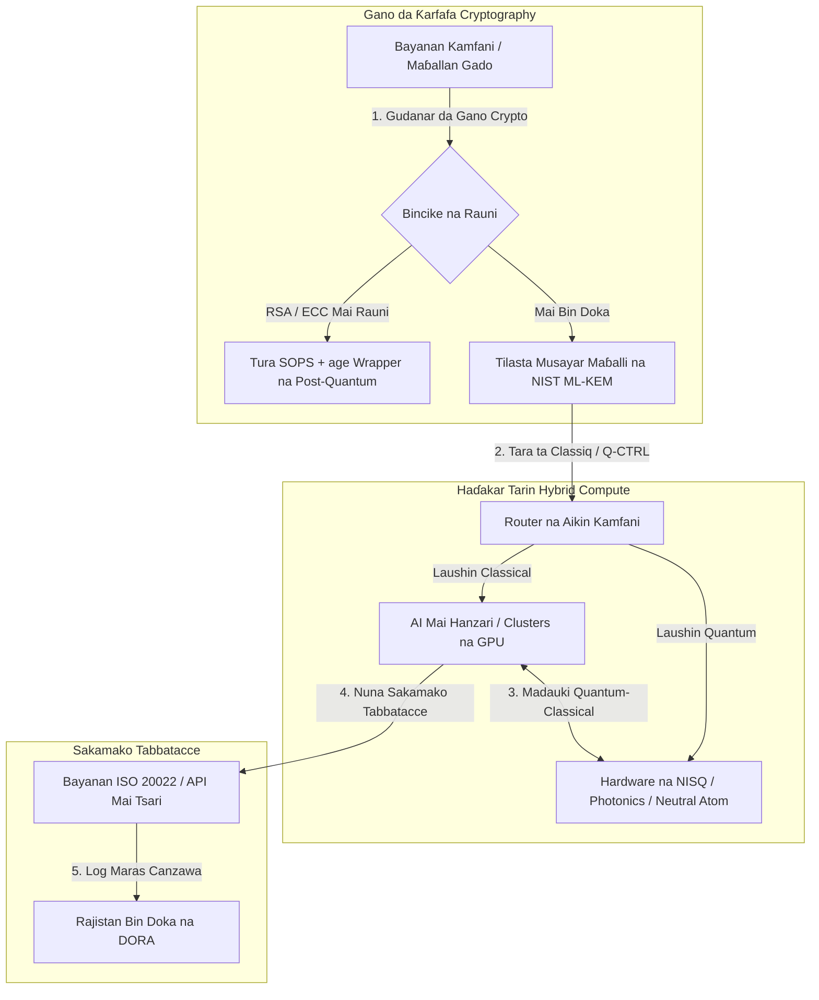

---

# Front Matter (YAML)

author: "contact@sebastienrousseau.com (Sebastien Rousseau)"
banner_alt: "Kallon dandali daga taron Economist Impact na 5 na shekara-shekara Commercialising Quantum Global 2026 a London — alama ce ta sauyin fasahar quantum daga binciken kimiyyar lissafi zuwa hanyoyin aiki da suka shirya don kamfanoni"
banner_height: "1597"
banner_width: "2584"
banner: "https://cloudcdn.pro/stocks/images/sebastien-rousseau-20260617-5th-commercialising-quantum-2.webp"
cdn: "https://cloudcdn.pro"
charset: "UTF-8"
cname: "sebastienrousseau.com"
copyright: "© Copyright 2025 - 2026 - Sebastien Rousseau. All rights reserved."
date: "June 17, 2026"
description: "Abubuwan ɗauka na hukumar daga taron Economist Impact na 5 na shekara-shekara Commercialising Quantum Global 2026 — karuwar tallafi na $1.3B, tarin hybrid marasa nadama, gaggawar ƙaurar cryptography post-quantum, kasuwancin quantum sensing, da umarni na HSBC cewa jira kuskure ne na rashin tursasawa."
format-detection: "telephone=no"
hreflang: "ha"
icon: "https://cloudcdn.pro/clients/sebastienrousseau/v1/logos/sebastienrousseau.svg"
id: "https://sebastienrousseau.com/2026-06-17-economist-commercialising-quantum-summit-2026"
image_alt: "Hoton Sebastien Rousseau a baki da fari"
image_height: "162"
image_width: "162"
image: "https://cloudcdn.pro/stocks/images/sebastien-rousseau.png"
keywords: "Commercialising Quantum Global 2026, taron Economist Impact, cryptography post-quantum, NIST ML-KEM, harvest-now decrypt-later, SNDL, HSBC quantum, Philip Intallura, quantum sensing, kewayawa mai zaman kanta daga GPS, NQCC, EU Quantum Act, Quantcore, qBIG prize, Lord Vallance, hybrid quantum-classical, DORA Article 6"
language: "ha-NG"
last_reviewed: "2026-06-17"
layout: "report"
locale: "ha_NG"
logo_alt: "Tambarin Sebastien Rousseau"
logo_height: "44"
logo_width: "44"
logo: "https://cloudcdn.pro/clients/sebastienrousseau/v1/logos/sebastienrousseau.svg"
menu: ""
measurementID: "G-169G4ET5HQ"
name: "Sebastien Rousseau"
permalink: "https://sebastienrousseau.com/2026-06-17-economist-commercialising-quantum-summit-2026"
rating: "general"
referrer: "no-referrer"
robots: "index, follow"
schema: "FAQPage, Article"
seo_title: "Commercialising Quantum 2026: Abubuwan Ɗauka na Hukumar"
short_name: "sebastienrousseau"
subtitle: "Quantum ya tsallaka daga kimiyyar dakin gwaje-gwaje mai zato zuwa hanyoyin aiki na hybrid na kamfani; hukumar dole ne ta mayar da martani ga tallafin $1.3B a 2026, ƙaurar post-quantum nan take, da umarnin HSBC na dakatar da jira."
tags: "quantum, cryptography post-quantum, NIST ML-KEM, harvest-now decrypt-later, quantum sensing, HSBC, Economist Impact, hybrid compute, DORA, EU Quantum Act, NQCC, abubuwan ɗauka na taro"
theme-color: "0, 83, 191"
title: "Daga Qubits zuwa Riba: Abubuwan Ɗauka na Dabaru daga Taron Economist na 5 na Shekara-shekara Commercialising Quantum Global 2026"
url: "https://sebastienrousseau.com/2026-06-17-economist-commercialising-quantum-summit-2026"
viewport: "width=device-width, initial-scale=1, shrink-to-fit=no"

# RSS - The RSS feed front matter (YAML).
atom_link: "https://sebastienrousseau.com/2026-06-17-economist-commercialising-quantum-summit-2026/rss.xml"
category: "Technology"
docs: https://validator.w3.org/feed/docs/rss2.html
generator: "Static Site Generator (SSG) (version 0.0.26)"
item_description: "Abubuwan ɗauka na hukumar daga taron Economist Impact na 5 na shekara-shekara Commercialising Quantum Global 2026 — karuwar tallafi na $1.3B, tarin hybrid marasa nadama, gaggawar ƙaurar cryptography post-quantum, kasuwancin quantum sensing, da umarni na HSBC cewa jira kuskure ne na rashin tursasawa."
item_guid: "https://sebastienrousseau.com/2026-06-17-economist-commercialising-quantum-summit-2026/rss.xml"
item_link: "https://sebastienrousseau.com/2026-06-17-economist-commercialising-quantum-summit-2026/rss.xml"
item_pub_date: "Wed, 17 Jun 2026 06:06:06 +0000"
item_title: "Daga Qubits zuwa Riba: Abubuwan Ɗauka na Dabaru daga Taron Economist na 5 na Shekara-shekara Commercialising Quantum Global 2026"
last_build_date: "Wed, 17 Jun 2026 06:06:06 +0000"
managing_editor: "contact@sebastienrousseau.com (Sebastien Rousseau)"
pub_date: "Wed, 17 Jun 2026 06:06:06 +0000"
ttl: "60"
type: "article"
webmaster: "contact@sebastienrousseau.com"

# Apple - The Apple front matter (YAML).
apple_mobile_web_app_orientations: "portrait"
apple_touch_icon_sizes: "192x192"
apple-mobile-web-app-capable: "yes"
apple-mobile-web-app-status-bar-inset: "black"
apple-mobile-web-app-status-bar-style: "black-translucent"
apple-mobile-web-app-title: "Commercialising Quantum 2026: Abubuwan Ɗauka"
apple-touch-fullscreen: "yes"

# MS Application - The MS Application front matter (YAML).

msapplication-navbutton-color: "0, 83, 191"

# Twitter Card - The Twitter Card front matter (YAML).

twitter_card: "summary_large_image"
twitter_creator: "@wwdseb"
twitter_description: "Abubuwan ɗauka na hukumar daga taron Economist Impact na 5 na shekara-shekara Commercialising Quantum Global 2026 — karuwar tallafi na $1.3B, tarin hybrid marasa nadama, gaggawar ƙaurar cryptography post-quantum, kasuwancin quantum sensing, da umarni na HSBC cewa jira kuskure ne na rashin tursasawa."
twitter_image: "https://cloudcdn.pro/clients/sebastienrousseau/v1/logos/sebastienrousseau.svg"
twitter_image_alt: "Tambarin Sebastien Rousseau"
twitter_site: "@wwdseb"
twitter_title: "Commercialising Quantum 2026: Abubuwan Ɗauka na Hukumar"
twitter_url: "https://sebastienrousseau.com/2026-06-17-economist-commercialising-quantum-summit-2026"

excerpt: "Taron Economist Impact na 5 na shekara-shekara Commercialising Quantum Global 2026 ya tabbatar da juyawar quantum zuwa hanyoyin aiki na kamfani: an tara $1.3B a cikin watanni biyar, cryptography post-quantum batu ne na fiduciary a matakin hukumar a ƙarƙashin girbi na SNDL, quantum sensing yana aikawa a yau don kewayawa mai zaman kanta daga GPS, kuma Philip Intallura na HSBC ya bayar da umarni cewa jira hardware mai juriya ga kuskure kuskure ne na rashin tursasawa."

# Humans.txt - The Humans.txt front matter (YAML).
author_website: "https://sebastienrousseau.com"
author_twitter: "@wwdseb"
author_location: "London, UK"
thanks: "Na gode da karatu!"
site_last_updated: "2026-06-17"
site_standards: "HTML5, CSS3, RSS, Atom, JSON, XML, YAML, Markdown, TOML"
site_components: "Kaishi, Kaishi Builder, Kaishi CLI, Kaishi Templates, Kaishi Themes"
site_software: "Static Site Generator, Rust"

---

# Daga Qubits zuwa Riba: Abubuwan Ɗauka na Dabaru daga Taron Economist na 5 na Shekara-shekara Commercialising Quantum Global 2026

Shirye-shiryen kamfani, ƙaurar cryptography post-quantum, tarin hybrid compute, da kasuwancin da ke fitowa na quantum sensing da networking.

**TL;DR.** Taron 5 na shekara-shekara Commercialising Quantum Global 2026, wanda Economist Impact ya shirya a ranar 16–17 ga Yuni, 2026, a Business Design Centre a London, ya tara fiye da shugabannin duniya 1,100 a fadin kamfani, kuɗi, manufa, da bincike. Babban jigon ya nuna sauyi mai bayyana: fasahar quantum ta yi sauyi daga kimiyyar dakin gwaje-gwaje mai zato zuwa hanyoyin aiki na kamfani na hybrid masu amfani. Tare da goyon bayan dala biliyan 1.3 a babban birnin kasuwanci da aka tara a cikin watanni biyar na farko na 2026 kaɗai, tattaunawa a hukumar ba ta sake mai da hankali kan ƙidaya qubits na zahiri ba, amma kan kafa tarin hybrid compute "marasa nadama", kiyaye kadarorin dijital daga barazanar cryptography ta "harvest-now, decrypt-later" (SNDL), da tura tsarin quantum sensing na kusa-da-yanzu don kewayawa mai zaman kanta daga GPS.

## Manyan abubuwan ɗauka

- **Sauyin kamfani zuwa hanyoyin aiki masu amfani.** Shugabannin masana'antu ([Steve Suarez](https://www.linkedin.com/in/stevesuarez) na HorizonX, [Phil Intallura](https://www.linkedin.com/in/intallura) na HSBC) sun jaddada cewa haɗakar quantum ba ta sake zama matsala ce ta kimiyyar lissafi ba amma ta aiki ce. Bankuna da kamfanoni suna tura matukin jirgi na hybrid quantum-classical don shirya basira da inganta aikin da yake aiki.
- **Cryptography post-quantum (PQC) fifiko ne na hukumar.** Masana tsaro da na shari'a (CMS UK, [Joanne Miller](https://www.linkedin.com/in/joanne-miller-nso) na Microsoft, [Craig Farrell](https://www.linkedin.com/in/craig-farrell) na EY) sun yi gargaɗi cewa ƙungiyoyi ba za su iya jira hardware mai juriya ga kuskure ba don tura PQC. Girbi na "Harvest-now, decrypt-later" yana faruwa a yau, yana sa ƙaura zuwa ka'idodin NIST ML-KEM batu na fiduciary na nan take.
- **Quantum sensing yana jagorancin riba ta kusa-da-yanzu.** Yayin da kwamfuta mai juriya ga kuskure ke ɗaukar shekaru, quantum sensing ([Matthew Kinsella](https://www.linkedin.com/in/matthewkinsella) na Infleqtion) yana ƙaruwa cikin sauri. Ana tura agogon quantum da na'urori masu auna saurin motsi a cikin kewayawa mai zaman kanta daga GPS, tsaro na ƙasa, da grids na makamashi masu kwanciyar hankali.
- **Mulkin kai, clusters da gaggawar manufa.** Ministan Kimiyya na UK [Lord Vallance](https://www.linkedin.com/in/patrick-vallance) da [Lord William Hague](https://www.linkedin.com/in/williamhague) sun fitar da ayyukan ƙasa don juya bincike zuwa "superclusters" na masana'antu masu aiki tare da National Quantum Computing Centre (NQCC). EU Quantum Act mai zuwa ya ƙara jaddada gaggawar geopolitical don ƙarfin kwamfuta mai mulkin kai.
- **Quantcore ya lashe kyautar qBIG.** Quantcore, wani spin-out na Jami'ar Glasgow, ya samu kyautar IOP qBIG saboda ɓangarorinsa na superconducting na niobium, waɗanda ke aiki a yanayin zafi mafi girma fiye da kayan gargajiya, suna rage tsadar abubuwan more rayuwa na cryogenic sosai.

**Karatu masu alaƙa:** [KyberLib da Ƙaurar Banki ta Post-Quantum a 2026: Daga Ka'idoji zuwa Lamba](https://sebastienrousseau.com/2026-06-12-kyberlib-post-quantum-banking-migration-standards-code-2026/), [Fihirisar Juriya na Banki a 2026: AI, Cloud, Quantum, Biyan Kuɗi, da Haɗarin Tarayya na Ɓangare na Uku](https://sebastienrousseau.com/2026-06-08-banking-resilience-index-ai-cloud-quantum-payments-third-party-risk-2026/), [Fihirisar Banki na Cloud Native a 2026: DORA, Injiniyancin Dandali, Cloud Mai Mulkin Kai, da Juriya na Aiki](https://sebastienrousseau.com/2026-06-05-cloud-native-banking-index-dora-resilience-platform-engineering-2026/).

## 01. Me Yasa Taron 2026 Yake Da Mahimmanci ga Hukumar

Bugu na 2026 na taron Commercialising Quantum Global na Economist ya nuna sauyi na dindindin a yadda duniyar kamfani ke tantance fasahar zurfafa.

A tarihance, kwamfuta ta quantum ta kasance a sashen R&D a matsayin aikin kimiyya na shekaru da yawa. A Yuni 2026, wannan ra'ayi ya tsufa. Ƙungiyoyi dole ne su yi sauyi daga sha'awa "mai mai da hankali kan kimiyyar lissafi" zuwa aiwatarwa "mai mai da hankali kan kasuwanci". Dalilin biyu ne:

1. **Hadakar quantum-AI.** Tarin high-performance computing (HPC) yana haɗa nodes na classical, AI mai hanzari, da NISQ (Noisy Intermediate-Scale Quantum) zuwa wani sashin compute guda ɗaya. Ƙungiyoyin da suka jinkirta gina aikace-aikace masu shirye-shiryen quantum za su gano cewa taga don ɗaukar fa'idar dabaru tana rufewa cikin sauri fiye da yadda ake tsammani.
2. **Gaggawar geopolitical da fiduciary.** Tare da shirin quantum na UK wanda manufa ke jagorancin sa da EU Quantum Act mai zuwa, ƙarfin quantum ya zama batu na mulkin kai na ƙasa da ci gaba na kamfani.

Bugu da ƙari, tsaron cyber post-quantum ba ya sake zama buƙatar bin doka ta gaba ba. Barazanar harin "store now, decrypt later" (SNDL) tana nufin bayanan kamfani da aka kama a yau za a buɗe lambar su lokacin da tsarin quantum na kasuwanci ya ƙaru, yana ƙirƙirar lamuni nan take a ƙarƙashin umarnin juriya na aiki na duniya kamar Digital Operational Resilience Act (DORA).

## 02. Tabaron Dabaru na Commercialising Quantum 2026

Shugabannin fasaha na kamfani dole ne su tsara balagar quantum a fadin laushi biyar daban-daban na aiki, suna tantance jadawalin lokaci da haɗarin ma'aunin kuɗi.

### Teburi 1: Tabaron dabaru na Commercialising Quantum 2026

| Laushi | Mai da hankali na kamfani | Jadawalin lokaci | Babban haɗari na kamfani |
| :---- | :---- | :---- | :---- |
| **Hardware da compiler** | Zaɓi tsakanin hanyoyi masu gasa (superconducting, trapped ions, neutral atoms, photonics) | Shekaru 3 – 5 (juriya ga kuskure) | Kulle a cikin gine-gine maras ƙarewa ko goyon bayan dandali ɗaya da wuri. |
| **Ƙarfafa cryptography** | Gano da lissafin abubuwan da suka dogara da cryptography; ƙaura zuwa NIST ML-KEM | Nan take (ƙaura mai aiki) | Karya bayanai na tsari da gazawar bin doka a ƙarƙashin DORA da NIST CSF 2.0. |
| **Quantum sensing** | Tura kewayawa mai zaman kanta daga GPS, agogo masu kwanciyar hankali, da gravimeters | Shekaru 1 – 2 (kasuwanci nan take) | Tsangwama na aiki na logistics, jigilar kaya, da grids na makamashi saboda toshe GPS. |
| **Haɗakar tsarin** | Haɗa hardware na quantum cikin cibiyoyin bayanai na classical HPC da supercomputing | Shekaru 1 – 3 (lokacin hybrid) | Latency mai girma, matsalolin canja wurin bayanai, da silos na compute da suka karye. |
| **Software na kamfani** | Fitar da algorithms na quantum ta hanyar laushi na abstraction da APIs (Classiq, Q-CTRL) | Nan take (gina basira) | Keɓancewar basira da hanyar aiki daga aiwatar da injiniyanci na gaske. |

## 03. Manyan Alamomi na Quantum da Abubuwan da ke Haifar da Hukumar

Shugabannin fasaha dole ne su lura da takamaiman ma'auni na kasuwa da na doka don jagorantar saka hannun jari na quantum.

### Teburi 2: Manyan alamomi na quantum da abubuwan da ke haifar da hukumar

| Alama | Ma'auni mai yawa | Nuni na doka / manufa | Fifikon dandali mai aiki |
| :---- | :---- | :---- | :---- |
| **Karuwar tallafi na quantum** | $1.3 biliyan da aka tara a duniya a cikin watanni biyar na farko na 2026 | Return on Resilience (RoR) | Sauya kasafin kuɗi daga matukin jirgi mai zato zuwa aikin hybrid quantum-classical "marasa nadama". |
| **Bayyanar buɗewar bayanai** | 100% na bayanan da aka rufa wa ido waɗanda aka watsa ta hanyoyin sadarwa na jama'a sun fallasa ga girbin SNDL | DORA Article 6 (tsaron ICT) | Aiwatar da kayan aikin gano cryptography don gano maɓallan RSA/ECC masu rauni a fadin gidan. |
| **Abubuwan more rayuwa masu mulkin kai** | £2.5 biliyan na rabon UK National Quantum Strategy | UK Quantum Missions / Lord Vallance | Kafa abokan haɗin gwiwa na gida tare da superclusters na ƙasa kamar NQCC. |
| **Wa'adin bin doka** | Sauyin adireshi mai tsari na SWIFT na Nuwamba 14, 2026 | Umarni na SWIFT SR 2026 | Tsabtace da tsara bayanan interbank don cika ƙayyadaddun XML mai tsari. |

## 04. Cikakken Bincike kan Manyan Jigogin Taron

### Quantum ya isa wurin juyawa na saka hannun jari

Tallafin babban birnin kasuwanci ya samu sauri mai girma, yana tara **$1.3 biliyan** a cikin watanni biyar na farko na 2026 kaɗai. Ba kamar zagayowar zato na shekarun da suka gabata ba, igiyar babban birnin da ke yanzu tana da goyon bayan aiki na kusa-da-yanzu na duniya na gaske. Masu magana daga Classiq da IBM Quantum Platform sun nuna yadda laushi na abstraction na software da masu tara atomatik ke ba ƙungiyoyin masu haɓakawa marasa ƙwarewa damar gudanar da algorithms na hybrid quantum-classical akan abubuwan more rayuwa na classical na yau. Wannan dabarar "marasa nadama" tana ba ƙungiyoyi damar gina basira da hanyoyin aiki masu shirye-shiryen quantum nan take.

### Gargaɗi na shari'a da na doka kan "harvest now, decrypt later"

Abokan tarayya na shari'a da shugabannin tsaron cyber sun ƙarfafa shiga mai girma kewaye da gaggawar haɗarin bayanai. Wakilai daga kamfanin doka mai daukar nauyi CMS UK da CSO na Microsoft [Joanne Miller](https://www.linkedin.com/in/joanne-miller-nso) sun isar da gargaɗi mai ƙarfi ga manyan manajoji: *jira hardware mai juriya ga kuskure ya zo kafin tura cryptography post-quantum gazawar fiduciary ce mai mahimmanci.*

A ƙarƙashin tsarin "store now, decrypt later" (SNDL), masu adawa suna girbi bayanan kamfani da aka rufa wa ido a yau tare da niyyar buɗe lambar sa da zaran kwamfutoci na quantum masu dacewa da cryptography suka fito. Ƙungiyoyi dole ne su tura kariya na post-quantum (kamar NIST ML-KEM) nan take don kiyaye saitin bayanai masu mahimmanci, dukiya ta hankali, da bayanan abokan ciniki na tarihi.

### Sake daidaitawar zato na "quantum sensing"

Yayin da kwamfuta ta quantum mai juriya ga kuskure ke ɗaukar shekaru, taron ya jaddada quantum sensing a matsayin igiyar farko ta gaske mai riba ta turawa na duniya na gaske. Babban Manaja [Matthew Kinsella](https://www.linkedin.com/in/matthewkinsella) na Infleqtion ya bayyana yadda agogon quantum, na'urori masu auna saurin motsi, da tsarin radio-frequency suna ƙaruwa cikin sauri a fadin masana'antu da yawa.

Saboda waɗannan fasahohin suna auna abubuwa na zahiri tare da daidaito na sub-atomic, suna ba da damar **kewayawa mai zaman kanta daga GPS**, grids na makamashi masu kwanciyar hankali, da sadarwar sararin samaniya mai zurfi. Waɗannan aikace-aikace suna da matuƙar dacewa ga jiragen sama, jigilar ruwa, da tsarin tsaro na ƙasa waɗanda ke fuskantar barazanar toshe GPS mai girma.

### Haɗin gwiwa na yanayin halittu da cluster

Yanayin halittu na quantum na UK ya yi amfani da taron London don nuna superclusters na ƙirƙira na cikin gida. Sabbin labarai kai tsaye daga National Quantum Computing Centre (NQCC) da Digital Catapult sun bayyana yadda spin-outs na fasahar zurfafa na farko-mataki za su iya haɗa "rabin fasaha" ta haɗa hardware na quantum kai tsaye cikin cibiyoyin bayanai na classical supercomputing.

[Wridhdhisom Karar](https://www.linkedin.com/in/wridhdhisomkarar), abokin kafa Quantcore, wani sabon kamfani na Scotland na quantum, ya karɓi kyautar Institute of Physics (IOP) Quantum Business Innovation and Growth (qBIG) saboda ɓangarorin superconducting na niobium na kamfanin. Waɗannan ɓangarorin suna aiki a yanayin zafi mafi girma fiye da kayan gargajiya, suna rage tsadar abubuwan more rayuwa na cryogenic da ake buƙata don ƙara processors na quantum sosai.

### Nazarin shari'ar HSBC: me yasa jira quantum "kuskure ne na rashin tursasawa"

Fahimta daga [**Philip Intallura, Ph.D.**](https://www.linkedin.com/in/intallura) (Babban Shugaban Fasahar Quantum a HSBC, Mai Ba da Shawara ga Gwamnatin UK, da Mai Ba da Shawara ga Hukumar) a Taron 5 na Shekara-shekara na Commercialising Quantum na Economist (2026) ya isar da umarni mai ƙarfi ga hukumar: *"Jira quantum mai juriya ga kuskure kafin ku fara kuskure ne na rashin tursasawa."*

Dr Intallura ya yi gardama cewa hanyar "jira-da-gani" gama gari tsakanin cibiyoyin kuɗi kuskure ne na kai-kai wanda aka gina shi akan zato uku marasa daidai:

- **ROI na kusa-da-yanzu na gaske ne.** A gwajin gaske, HSBC ya zarce samfuran da ke gudana a samarwa, ya haɗa aikin quantum zuwa wasu sassan kasuwanci, ya yi amfani da quantum don zurfafa dangantaka tare da wasu daga cikin manyan abokan cinikinsa, kuma ya jawo sabbin kasuwanci masu mahimmanci cikin **HSBC Innovation Banking**.
- **Quantum lankwasa ne mai tsanani na ɗauka.** Gina ƙarfi, saita dabaru, samun tallafi, da gudanar da zagayowar gwaji a cikin ƙungiya mai tsananin tsari ba ƙaramin aiki ba ne. Dole ne a gwada hanyoyi a tsari kuma a daidaita su don fasahar.
- **Quantum yanayin halittu ne.** Babu ɗan wasa guda ɗaya da zai iso wurin shi kaɗai. Kowane takarda na bincike, POC, da matukin jirgi na HSBC an aiwatar da shi cikin haɗin gwiwa kusa da mai bayar da quantum — kuma a wasu lokuta, haɗin gwiwa yana faɗaɗa zuwa ilimi, masu tsara doka, da gwamnati.

**Umarnin rufewa na hukumar:** *"Ƙarfin da za ku buƙaci a rana ɗaya ta juriya ga kuskure shi ne ƙarfin da kuke gina yanzu."*

## 05. Bututun Haɗakar Quantum na Kamfani da Cryptography

Don kiyaye kadarorin dijital yayin gina shirye-shiryen quantum, kamfanin dole ne ya kafa bututun haɗaka mai bayyana.

## 06. Littafin Aiki na Hukumar: Umarni Masu Aiki

Don juya fahimtar taron Commercialising Quantum Global 2026 zuwa darajar kasuwanci nan take, manyan manajoji ya kamata su aiwatar da littafin aiki na hukumar mai matakai huɗu masu zuwa:

1. **Umarci gano cryptography.** Umarci Chief Information Security Officer (CISO) ya jera dukkan kadarorin cryptography, yana tsara kowane maɓalli na gado na RSA da ECC a fadin kamfani don shirya don ƙaurar post-quantum.
2. **Tura dabarar hybrid "marasa nadama".** Guji jira hardware mai cikakke. Saka hannun jari a software wanda quantum ke ƙarfafa shi da matukin jirgi na hybrid classical-quantum don haɓaka basira na cikin gida da inganta logistics masu rikitarwa ko fayil na haɗari a yau.
3. **Tantance quantum sensing don logistics.** Idan ƙungiyar ku ta dogara akan sarƙoƙin samar da kayayyaki na duniya, jigilar kaya, ko muhimman abubuwan more rayuwa, ku yi aiki tantance tsarin quantum sensing (kamar kewayawa mai zaman kanta daga GPS) don rage haɗarin tsangwama na geopolitical.
4. **Yi rajista don Insight Hour na 30 ga Yuni.** Tabbatar shugabannin fasaha sun yi rajista don **Commercialising Quantum Global Insight Hour** na zahiri a ranar 30 ga Yuni, 2026, da ƙarfe 3:00 PM BST (tare da goyon bayan IonQ) don ci gaba da bibiyar dabarun sarrafa haɗari na kamfani da rabon basira.

## 07. Tambayoyin Akai-akai

**Menene "harvest now, decrypt later" (SNDL) kuma me yasa yake da mahimmanci a yau?**
SNDL aiki ne na katsewa da adana bayanan da aka rufa wa ido a yau, tare da niyyar buɗe lambar su daga baya da zarar kwamfutoci na quantum masu dacewa da cryptography sun zama akwai. Saitin bayanai masu mahimmanci masu daɗewa — dukiya ta hankali, bayanan abokan ciniki, sadarwar gwamnati — an riga an yi niyya akan su. Ƙaura zuwa NIST ML-KEM yanke shawara ce ta fiduciary wanda hukumar ba za ta iya jinkirtawa ba.

**Me yasa quantum sensing igiya ce ta farko ta kasuwanci maimakon kwamfuta?**
Na'urori masu auna quantum suna auna abubuwa na zahiri tare da daidaito na sub-atomic kuma ba sa buƙatar hardware mai juriya ga kuskure wanda kwamfuta ta quantum ke buƙata. Agogon quantum, gravimeters, da na'urori masu auna saurin motsi sun riga sun kasance a matakin matukin jirgi don kewayawa mai zaman kanta daga GPS, grids na makamashi masu kwanciyar hankali, da sadarwar sararin samaniya mai zurfi.

**Shin aikin quantum na HSBC R&D kawai ne ko ya ba da dawowa ta gaske?**
A cewar Philip Intallura a taron, HSBC ya zarce samfuran da ke gudana a samarwa, ya yi amfani da quantum don zurfafa dangantaka tare da manyan abokan cinikinsa, kuma ya jawo sabbin kasuwanci masu mahimmanci cikin HSBC Innovation Banking. Aikin ya tashi daga bincike zuwa haɗakar aiki.

## 08. Nassoshi

- **Economist Impact, (2026).** *5th Annual Commercialising Quantum Global 2026.* Tafiyar taro kai tsaye, 16–17 ga Yuni, 2026. London: Business Design Centre. Akwai a: [Economist Impact](https://events.economist.com/commercialising-quantum/).
- **National Institute of Standards and Technology (NIST), (2024).** *First Three Finalized Post-Quantum Encryption Standards (FIPS 203, 204, and 205).* Gaithersburg: U.S. Department of Commerce. Akwai a: [NIST Standards](https://www.nist.gov/news-events/news/2024/08/nist-releases-first-3-finalized-post-quantum-encryption-standards).
- **European Parliament and Council of the European Union, (2022).** *Regulation (EU) 2022/2554 on digital operational resilience for the financial sector (DORA).* Brussels: Official Journal of the European Union. Akwai a: [DORA Regulation](https://eur-lex.europa.eu/legal-content/EN/TXT/?uri=CELEX%3A32022R2554).
- **SWIFT, (2024).** *ISO 20022 November 2026 Structured Address Milestone.* La Hulpe: SWIFT. Akwai a: [SWIFT ISO 20022 milestone](https://www.swift.com/standards/iso-20022/iso-20022-bytes/call-action-november-2026).
