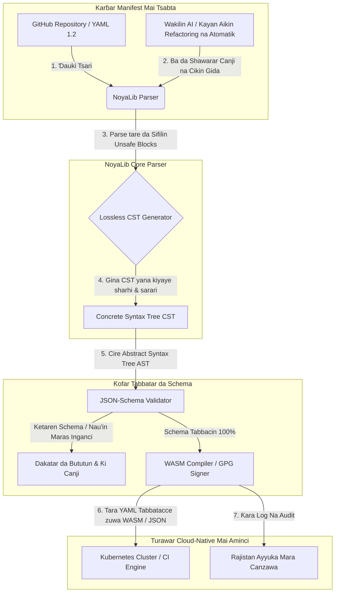

---

# Front Matter (YAML)

author: "contact@sebastienrousseau.com (Sebastien Rousseau)"
banner_alt: "Geometry na gine-gine a ƙarƙashin haske mai ban mamaki — alama ce ta matsayin NoyaLib a matsayin parser na YAML mai ɗauke da nauyi a ƙarƙashin CI, Kubernetes, MCP, da tsarin kuɗi"
banner_height: "1597"
banner_width: "2584"
banner: "https://cloudcdn.pro/stocks/images/ken-cheung-KonWFWUaAuk.webp"
cdn: "https://cloudcdn.pro"
charset: "UTF-8"
cname: "sebastienrousseau.com"
copyright: "© Copyright 2025 - 2026 - Sebastien Rousseau. All rights reserved."
date: "June 18, 2026"
description: "NoyaLib, parser na Rust mara unsafe na YAML 1.2 mai 406/406 spec compliance, JSON Schema validation, lossless CST da MCP/WASM bindings."
format-detection: "telephone=no"
hreflang: "ha"
icon: "https://cloudcdn.pro/clients/sebastienrousseau/v1/logos/sebastienrousseau.svg"
id: "https://sebastienrousseau.com/2026-06-18-noyalib-safe-yaml-rust-ai-mcp-financial-infrastructure-2026"
image_alt: "Hoton Sebastien Rousseau a baki da fari"
image_height: "162"
image_width: "162"
image: "https://cloudcdn.pro/stocks/images/sebastienrousseau.webp"
keywords: "parser Rust mai aminci na YAML, NoyaLib, YAML 1.2 spec compliance, Rust mara unsafe, JSON Schema validation, lossless Concrete Syntax Tree, CST, MCP, Model Context Protocol, WebAssembly, manifests na Kubernetes, tsarin CI/CD, DORA Article 5, BCBS 239, haɗarin aiki na Basel III, tsarin kuɗi, tsaron tsari, tsaron jerin samar da software"
language: "ha-NG"
last_reviewed: "2026-06-18"
layout: "report"
locale: "ha_NG"
logo_alt: "Tambarin Sebastien Rousseau"
logo_height: "44"
logo_width: "44"
logo: "https://cloudcdn.pro/clients/sebastienrousseau/v1/logos/sebastienrousseau.svg"
menu: ""
measurementID: "G-169G4ET5HQ"
name: "Sebastien Rousseau"
permalink: "https://sebastienrousseau.com/2026-06-18-noyalib-safe-yaml-rust-ai-mcp-financial-infrastructure-2026"
rating: "general"
referrer: "no-referrer"
robots: "index, follow"
schema: "FAQPage, Article"
seo_title: "Parser na Rust Mai Aminci na YAML don AI, MCP & Kuɗi"
short_name: "sebastienrousseau"
subtitle: "Tarin Rust mai aminci na YAML — NoyaLib — ya juya YAML 1.2 daga rubutun dacewa zuwa wani sashin sarrafa tsari mai amintacce a ƙirar cryptography don wakilan AI, MCP, Kubernetes, da tsarin kuɗi."
tags: "parser Rust mai aminci na YAML, NoyaLib, YAML 1.2, Rust mara unsafe, JSON Schema, MCP, WebAssembly, Kubernetes, DORA, BCBS 239, Basel III, tsarin kuɗi, tsaron jerin samar da kayayyaki"
theme-color: "0, 83, 191"
title: "Me Yasa YAML Ke Buƙatar Tarin Rust Mai Aminci don AI, MCP, da Tsarin Kuɗi a 2026"
url: "https://sebastienrousseau.com/2026-06-18-noyalib-safe-yaml-rust-ai-mcp-financial-infrastructure-2026"
viewport: "width=device-width, initial-scale=1, shrink-to-fit=no"

# RSS - The RSS feed front matter (YAML).
atom_link: "https://sebastienrousseau.com/2026-06-18-noyalib-safe-yaml-rust-ai-mcp-financial-infrastructure-2026/rss.xml"
category: "Technology"
docs: https://validator.w3.org/feed/docs/rss2.html
generator: "Static Site Generator (SSG) (version 0.0.26)"
item_description: "NoyaLib, parser na Rust mara unsafe na YAML 1.2 mai 406/406 spec compliance, JSON Schema validation, lossless CST da MCP/WASM bindings."
item_guid: "https://sebastienrousseau.com/2026-06-18-noyalib-safe-yaml-rust-ai-mcp-financial-infrastructure-2026/rss.xml"
item_link: "https://sebastienrousseau.com/2026-06-18-noyalib-safe-yaml-rust-ai-mcp-financial-infrastructure-2026/rss.xml"
item_pub_date: "Thu, 18 Jun 2026 06:06:06 +0000"
item_title: "Me Yasa YAML Ke Buƙatar Tarin Rust Mai Aminci don AI, MCP, da Tsarin Kuɗi a 2026"
last_build_date: "Thu, 18 Jun 2026 06:06:06 +0000"
managing_editor: "contact@sebastienrousseau.com (Sebastien Rousseau)"
pub_date: "Thu, 18 Jun 2026 06:06:06 +0000"
ttl: "60"
type: "article"
webmaster: "contact@sebastienrousseau.com"

# Apple - The Apple front matter (YAML).
apple_mobile_web_app_orientations: "portrait"
apple_touch_icon_sizes: "192x192"
apple-mobile-web-app-capable: "yes"
apple-mobile-web-app-status-bar-inset: "black"
apple-mobile-web-app-status-bar-style: "black-translucent"
apple-mobile-web-app-title: "Parser na Rust Mai Aminci na YAML don AI, MCP & Kuɗi"
apple-touch-fullscreen: "yes"

# MS Application - The MS Application front matter (YAML).

msapplication-navbutton-color: "0, 83, 191"

# Twitter Card - The Twitter Card front matter (YAML).

twitter_card: "summary_large_image"
twitter_creator: "@wwdseb"
twitter_description: "NoyaLib, parser na Rust mara unsafe na YAML 1.2 mai 406/406 spec compliance, JSON Schema validation, lossless CST da MCP/WASM bindings."
twitter_image: "https://cloudcdn.pro/clients/sebastienrousseau/v1/logos/sebastienrousseau.svg"
twitter_image_alt: "Tambarin Sebastien Rousseau"
twitter_site: "@wwdseb"
twitter_title: "Parser na Rust Mai Aminci na YAML don AI, MCP & Kuɗi"
twitter_url: "https://sebastienrousseau.com/2026-06-18-noyalib-safe-yaml-rust-ai-mcp-financial-infrastructure-2026"

excerpt: "NoyaLib tari ne na Rust mai aminci na YAML — sifili na unsafe blocks, 406/406 YAML 1.2 spec compliance, lossless Concrete Syntax Tree, JSON Schema (Draft 2020-12) validation, da MCP/WASM bindings — an ƙera shi don wakilan AI, Kubernetes, CI/CD, da sashin sarrafa tsari a bayan tsarin kuɗi."

# Humans.txt - The Humans.txt front matter (YAML).
author_website: "https://sebastienrousseau.com"
author_twitter: "@wwdseb"
author_location: "London, UK"
thanks: "Na gode da karatu!"
site_last_updated: "2026-06-18"
site_standards: "HTML5, CSS3, RSS, Atom, JSON, XML, YAML, Markdown, TOML"
site_components: "Kaishi, Kaishi Builder, Kaishi CLI, Kaishi Templates, Kaishi Themes"
site_software: "Static Site Generator, Rust"

---

# Me Yasa YAML Ke Buƙatar Tarin Rust Mai Aminci don AI, MCP, da Tsarin Kuɗi a 2026

Tarin Rust mai aminci na YAML yana da muhimmanci saboda YAML yanzu yana ɗauke da bututun CI/CD, manifests na Kubernetes, ƙa'idodin [Open Policy Agent](https://www.openpolicyagent.org/), da rajistun kayan aikin Model Context Protocol (MCP) — kuma karatu mai shubuha guda ɗaya zai iya karya tsarin tsabtacewa, ya saita ƙungiyar tsaro ba daidai ba, ko ya ba wakilin AI na cikin gida izinin da bai dace ba. [NoyaLib](https://github.com/sebastienrousseau/noyalib) yanayin halittu ne na pure-Rust, mara unsafe na YAML 1.2 parsing da validation wanda aka ƙera don sa tsarin ya zama mai aminci ta tsohuwa.

## Amsa mai sauri

**Menene NoyaLib a cikin jumla guda?** NoyaLib parser ne mai buɗewa, na pure-Rust na YAML 1.2 da yanayin halittu na validation tare da sifili na lambar `unsafe`, 100% spec compliance a fadin tsarin gwajin 406 na YAML, lossless Concrete Syntax Tree, da real-time validation na [JSON Schema](https://json-schema.org/) — an ƙera shi don sa tsarin wakilan AI, MCP, Kubernetes, da kuɗi ya zama mai aminci ta tsohuwa.

## Taƙaitawar manyan manajoji

YAML yana kama da mara muhimmanci har sai karatu mai shubuha ko keta schema ya karya tsarin tsabtacewa na samarwa na biliyoyin daloli. A 2026, YAML shi ne ma'aunin de-facto don bututun [CI/CD](https://docs.github.com/en/actions/learn-github-actions/workflow-syntax-for-github-actions), manifests na [Kubernetes](https://kubernetes.io/docs/concepts/configuration/overview/), ƙa'idodin [Open Policy Agent](https://www.openpolicyagent.org/), da rajistun kayan aikin Model Context Protocol (MCP). Parsers na gado masu duhu — masu raunin ƙwaƙwalwa da parsing mai lalata — haɗari ne na tsaro wanda ba za a iya yarda da shi ba. NoyaLib yanayin halittu ne na pure-Rust, mara unsafe na YAML 1.2: 100% spec compliance a fadin dukan gwaje-gwajen 406 na hukuma, lossless Concrete Syntax Tree (CST) wanda ke kiyaye sharhin da sarari, da JSON Schema validation a ciki. Sakamakon shine YAML wanda aka sake fasalin a matsayin sashin sarrafa tsari mai amintacce, mai aminci, kuma mai isa ga wakilai.

## Manyan abubuwan ɗauka

- **Tsari shine lambar samarwa.** Fayil ɗin YAML guda ɗaya mai lalacewa zai iya saita ƙungiyoyin tsaro na cloud-native ko izinin wakilin AI ba daidai ba. NoyaLib yana ɗaukar YAML a matsayin tsari mai mahimmanci.
- **Ƙirar mara unsafe.** An gina shi gaba ɗaya cikin safe Rust tare da sifili na `unsafe` blocks, NoyaLib yana kawar da raunin tsaron ƙwaƙwalwa — buffer overflows, remote code execution — a cikin laushin parsing na asali.
- **Cikakken 406/406 spec compliance.** Yana tabbatar da tsarin tsarukan cikin lissafi, yana kawar da bambance-bambancen parsing da motsi tsakanin yanayin staging da samarwa.
- **Lossless Concrete Syntax Tree.** Ba kamar parsers na gado waɗanda ke jefar da sharhi da tsari ba, NoyaLib yana kiyaye sarari da bayanan kula, yana ba da damar refactoring mai aminci, na atomatik ta wakilan AI.
- **Darajar fiduciary a matakin hukumar.** Yana danganta amincin tsari da [DORA Article 5](https://eur-lex.europa.eu/legal-content/EN/TXT/?uri=CELEX%3A32022R2554) da ma'aunin babban birnin haɗarin aiki na [Basel III](https://www.bis.org/bcbs/publ/d424.htm), kai tsaye yana kare manyan manajoji daga alhakin kansu.

**Karatu masu alaƙa:** [KyberLib da Ƙaurar Banki ta Post-Quantum a 2026: Daga Ka'idoji zuwa Lamba](https://sebastienrousseau.com/2026-06-12-kyberlib-post-quantum-banking-migration-standards-code-2026/), [Fihirisar Banki na Cloud Native a 2026: DORA, Injiniyancin Dandali, Cloud Mai Mulkin Kai, da Juriya na Aiki](https://sebastienrousseau.com/2026-06-05-cloud-native-banking-index-dora-resilience-platform-engineering-2026/), [Dotfiles Masu Sane da AI a 2026: Gina Tashar Aiki ta Mai Haɓakawa Mai Aminci da Sake Maimaitawa don MCP, SLSA, da Daidaiton Shells da Yawa](https://sebastienrousseau.com/2026-06-16-ai-aware-dotfiles-secure-reproducible-workstation-2026/).

## 01. Me Yasa Tarin Rust Mai Aminci na YAML Ke da Mahimmanci a 2026

A Yuni 2026, kayan aikin IT na kamfanoni sun rabu ƙwarai kuma sun fi karuwa ta atomatik.

YAML ya zama, a hankali, harshen tsari mai ɗauke da nauyi don dukan tarin injiniyancin software. Yana ɗaukar bututun continuous-integration (CI) waɗanda ke tara abubuwan samarwa, manifests na [Kubernetes](https://kubernetes.io/docs/concepts/overview/) waɗanda ke daidaita clusters na duniya na cloud-native, da schemas na server na [Model Context Protocol](https://modelcontextprotocol.io/) (MCP) waɗanda ke ba wakilan AI na cikin gida izinin aiwatar da ayyukan cikin gida.

Parsers na gado na YAML — [PyYAML](https://pyyaml.org/), [yaml-cpp](https://github.com/jbeder/yaml-cpp), [libyaml](https://github.com/yaml/libyaml) — suna ɗauke da haɗari biyu na tsari:

1. **Raunin tilastawa-nau'i (matsalar "Norway").** Parsers na gado akai-akai suna tilasta strings marasa quoted (lambar ƙasa `NO` zuwa boolean `false`, `yes`/`no` haka kuma) — duba [YAML 1.1 vs 1.2 boolean tag](https://yaml.org/type/bool.html) — yana haifar da gazawar tsarin mai mahimmanci ko saituna marasa daidai na tsaro na shiru.
2. **Cin amfani na tsaron ƙwaƙwalwa.** Parsers masu duhu da aka rubuta a C/C++ suna fama da memory-leak da buffer-overflow exploits, waɗanda zasu iya haifar da remote code execution (RCE) akan servers na asali na ginawa.

[NoyaLib](https://github.com/sebastienrousseau/noyalib) yana magance waɗannan ƙalubalen. Yanayin halittu ne na pure-Rust, mara unsafe na YAML 1.2 parsing da validation. Ta hanyar samun cikakken 406/406 spec compliance da aiwatar da JSON Schema validation kai tsaye yayin parse, NoyaLib yana ba da babban **Return on Resilience (RoR)** — yana hana lokacin sauke saboda tsari kuma yana tabbatar da jerin samar da software na matakin kuɗi.

## 02. Tabaron Gine-ginen NoyaLib na 2026

Yanayin halittu na NoyaLib yana aiki a matsayin parser na tsari mai aminci, lossless. Kowane manifest na cikin gida da na cloud yana da tabbacin tsari kuma yana da kariya a laushin aiwatarwa mafi ƙanƙanta.

### Teburi 1: Laushi na gine-ginen NoyaLib da rage haɗari

| Laushi | Yanke shawara na ƙira | Me yasa yake da mahimmanci | Haɗari idan an gudanar da shi ba daidai ba |
| ---- | ---- | ---- | ---- |
| **Laushin parser** | Parser na pure-Rust mai bin YAML 1.2 tare da sifili na `unsafe` blocks | Yana kawar da raunin tsaron ƙwaƙwalwa da buffer overflows a laushin aiwatarwa mafi ƙanƙanta. | Remote code execution (RCE) akan servers na asali na ginawa. |
| **Laushin daidaitawa** | 100% compliance a fadin gwaje-gwajen 406/406 na hukuma na YAML 1.2 | Yana kawar da bambance-bambancen parsing da motsin tilastawa-nau'i tsakanin staging da samarwa. | Kurakurai na tilastawa-nau'i na "matsalar Norway" suna kashe ƙungiyoyin tsaro. |
| **Laushin syntax-tree** | Lossless Concrete Syntax Tree (CST) | Yana kiyaye sharhi, sarari, da tsari yayin round-trip parsing da refactoring na atomatik. | Refactoring na atomatik na AI yana lalata bayanan kula na mai haɓakawa. |
| **Laushin validation** | [JSON Schema (Draft 2020-12)](https://json-schema.org/draft/2020-12/release-notes) validation yayin parsing | Yana tilasta tsauraran samfuran bayanai akan fayilolin tsari kafin su isa clusters na samarwa. | Fayilolin tsari marasa lafiya suna haifar da faɗuwar clusters na cloud-native. |
| **Laushin interface** | WebAssembly (WASM) da MCP bindings | Yana ba da damar validation na tsari ya gudana kai tsaye a cikin browsers, edge nodes, da kayan aikin wakilai na cikin gida. | Silos na kayan aiki inda validation ba zai iya aiwatarwa akan na'urori na gefe ba. |

## 03. Manyan Alamomi na Tsaro na Tashar Aiki da Tsari

Don kiyaye cikakken tsaro a fadin haɓakawa da gidan ayyuka, Chief Information Security Officers (CISOs) dole ne su lura da takamaiman ma'auni masu yawa.

### Teburi 2: Alamomi na tsaro na tashar aiki da tsari

| Alama | Ma'auni / ma'auni na aiki | Nuni na NIST CSF / DORA | Aiwatar da dandali na fasaha |
| ---- | ---- | ---- | ---- |
| **Daidaiton parser** | 100% wucewa a fadin tsarin gwajin YAML 1.2 na hukuma (406/406 gwaje-gwaje). | [DORA Article 6](https://eur-lex.europa.eu/legal-content/EN/TXT/?uri=CELEX%3A32022R2554) (tsaron ICT) | NoyaLib parser core yana tabbatar da dukan manifests kafin aiwatar da CI. |
| **Tarihin tsaron ƙwaƙwalwa** | Sifili na `unsafe` Rust blocks a cikin parser da serializer dependencies. | DORA Article 30 (jerin samar da kayayyaki) | Binciken compiler na atomatik ([`forbid(unsafe_code)`](https://doc.rust-lang.org/reference/attributes/diagnostics.html#the-forbid-attribute)) a cikin cargo builds. |
| **Schema validation** | 100% na fayilolin tsari da aka yi parse an tabbatar da su akan samfuran [JSON Schema](https://json-schema.org/) masu inganci. | [NIST CSF 2.0](https://www.nist.gov/cyberframework) (PR.DS-01) | Ƙofar validation a ainihin lokaci tana dakatar da bututun ginawa akan ketare schema. |
| **Motsi na tsari** | Gano da farfaɗo a ainihin lokaci na fayilolin tsari na cikin gida zuwa yanayin sigar git. | Return on Resilience (RoR) | Telemetry na ci gaba yana shigar da dukan canjin fayil na cikin gida. |
| **Sarrafa shiga na wakili** | Iyaka, izinin karatu kawai don kayan aikin AI na cikin gida da ke aiki ta tsarin MCP. | Sarrafa haɗarin samfuri ([SR 11-7](https://web.archive.org/web/20260414150921/https://www.federalreserve.gov/supervisionreg/srletters/sr1107.htm)) | Iyakokin server na MCP suna takura ayyukan wakili zuwa kundayen adireshi da aka amince da su. |

## 04. Karya na Parsing na Tsari mai Duhu

Babban rauni a ayyukan cloud-native shine *parsing mai duhu* — amfani da parsers waɗanda ke jefar da metadata na tsari (sharhi, whitespace, tsarin takarda) ko cikin shiru suna tilasta nau'i yayin tarawa. Halayyar tana gabatar da haɗari biyu masu tsanani na tsaro:

1. **Refactoring mai lalata.** Lokacin da mataimakin lambar AI ko kayan aikin refactoring na atomatik ya sabunta manifest na turawa, parsers na gargajiya suna jefar da sharhin mai haɓakawa da tsari, suna lalata yanayin da ake buƙata don bita na mutum da kuma binciken bayan-lamarin.
2. **Bambance-bambancen parsing.** Idan yanayin staging yana amfani da parser na Python kuma samarwa tana gudanar da parser na C, bambance-bambance masu ƙanƙanta a cikin YAML 1.2 spec compliance zasu iya haifar da manifest na staging mai inganci ya gaza ko ya nuna hali daban a cikin samarwa, yana ƙirƙirar raunin tsaro na ɓoye.

NoyaLib's **lossless Concrete Syntax Tree (CST)** yana magance wannan. Yana kiyaye kowane sarari, sharhi, da layin takarda yayin madaurar parse-and-serialise. Mataimakan AI na atomatik zasu iya gyaggyara, refactor, da yin commit fayilolin tsari yayin da suke kiyaye 100% na bayanan kula da aka rubuta da hannu — cikakken alamar audit.

## 05. Ƙira Bututun Tsari na AI Mai Iyaka

Don hana canjin tsari mai mugun nufi ya kai ga yanayin samarwa, ƙungiyar dole ne ta aiwatar da bututun tsari mai tsayayyen iyaka, mai tabbatar da schema.

Hanyar aiki da ke ƙasa tana nuna yadda NoyaLib ke parse raw YAML, ya gina lossless CST, ya tabbatar da AST akan samfurin JSON Schema, da kuma tara WebAssembly bindings don browser ko yanayin edge.

## 06. Littafin Aiki na Hukumar da Alhakin Fiduciary

Tsaron tsari da amincin jerin samar da software fifikon hukumar ne masu mahimmanci. Manyan manajoji dole ne su kusanci sarrafa tsari ta hanyar lensin alhakin fiduciary da juriya na aiki.

- **DORA Article 5 (alhakin hukumar).** Yana umarce cewa hukumar ta ɗauki cikakken, alhakin da ba za a iya wakilta ba na sarrafa haɗarin ICT na cibiyar. Saboda fayilolin tsari suna sarrafa ƙungiyoyin tsaro masu mahimmanci na cloud-native da hanyoyin biya, hukumomi dole ne su tabbatar da cewa tsarin da ke parse waɗannan manifests masu aminci ne na ƙwaƙwalwa kuma masu cikakken spec-compliant don gamsuwa da binciken doka. ([Regulation (EU) 2022/2554](https://eur-lex.europa.eu/legal-content/EN/TXT/?uri=CELEX%3A32022R2554))
- **BCBS 239 (haɗakar bayanai na haɗari da bayar da rahoto).** Yana buƙatar cewa bayar da rahoton haɗari da ma'aunin tsarin su zama daidai, cikakke, kuma ana samar da su a ƙarƙashin tsauraran sarrafa ingancin bayanai. NoyaLib yana goyon bayan BCBS 239 ta hanyar parsing da tabbatar da fayilolin tsari akan tsauraran schemas a tushe, yana hana zubar da bayanai na shiru ko faɗuwar da aka haifar saboda saitin ba daidai. ([Ma'aunin BCBS 239](https://www.bis.org/publ/bcbs239.htm))
- **Rage cajin babban birnin haɗarin aiki (Basel III).** Faɗuwar da aka haifar saboda tsari kai tsaye yana ƙara cajin babban birnin haɗarin aiki a ƙarƙashin Basel III, yana ɗaure babban birnin balance-sheet. Daidaita tarin tsari na kamfani akan parser na pure-Rust mai aminci kamar NoyaLib yana rage wannan haɗari, yana adana babban birnin kuma yana kare amincin abokan ciniki. ([Ma'aunin Basel III](https://www.bis.org/bcbs/publ/d424.htm))

## 07. Me Wannan Ke Nufi ta Nau'in Banki

### Banki masu Mahimmanci na Tsarin Duniya (G-SIBs)

G-SIBs suna sarrafa dubban microservices da bututun turawa a cikin hukumomi da yawa. Babban ƙalubalensu shi ne kiyaye daidaiton tsari da hana motsin tsaro a fadin manyan ɗakunan cloud-native. Daidaitawa akan tarin Rust mai aminci na YAML kamar NoyaLib yana ba da garantin cewa duka manifests na Kubernetes, bututun CI/CD, da manufofin tsaro ana parse su kuma ana tabbatar da su a ƙarƙashin tsari guda mai aminci na ƙwaƙwalwa — yana kawar da haɗarin tsare-tsare "snowflake" marasa audited.

### Banki na ma'amala da na kamfanoni

Banki na ma'amala suna sarrafa ƙofofin biya masu mahimmanci da tsarin tsabtacewa na babba. Tabbatar da cikakken tsaro na lamba da tsari da aka turawa zuwa waɗannan yanayin samarwa buƙata ce ta doka da ba za a iya tattaunawa ba. Haɗa NoyaLib yana ba da garantin cewa jerin samar da software ya cika audited, lossless, kuma yana da kariya daga raunin parsing — sarrafawa wanda ke taswira cikakke zuwa DORA Article 6 da [PCI DSS v4.0](https://www.pcisecuritystandards.org/document_library/) section 6.

### Banki na yanki da na ƙanana

Banki na yanki dole ne su kiyaye manyan ma'aunin tsaron cyber ba tare da kasafin fasaha na sikelin G-SIB ba. Tsarin buɗewa na NoyaLib yana ba da maganin Rust-friendly mai sauƙi, mai tsada, kuma mai tsaro sosai, yana ba da damar cibiyoyin ƙanana don aiwatar da tsaron tsari na matakin kamfani da kariyar jerin samar da kayayyaki ba tare da kuɗin lasisi na mallaka ba.

## 08. Kammalawa: Hanyar Tsaron Tsari

Tsaren tsari na tashar aiki na mai haɓakawa da na cloud-native na asali sune sashunan sarrafawa masu mahimmanci a cikin jerin samar da software. Ba da damar fayilolin tsari marasa audited, masu shubuha, ko marasa aminci su isa kadarorin kamfani haɗari ne na aiki da na doka wanda ba za a iya yarda da shi ba.

Don tabbatar da jerin samar da software da kare endpoints daga raunin tsari, manyan manajojin fasaha da tsaro yakamata su aiwatar da bayyananniyar hanyar haɓakawa a yau:

1. **Umarci tsari na declarative.** Cire daidaitawar tsari da hannu, marasa audited kuma ku umarci cewa duka manifests ana sarrafa su a matsayin tsarin rikodin da aka sarrafa ta sigar, na declarative.
2. **Tilasta schema validation.** Tilasta tsauraran pre-commit hooks da kayan aikin scan don tabbatar da cewa dukan fayilolin tsari an tabbatar da su akan samfuran JSON Schema masu inganci kafin turawa.
3. **Aiwatar da round-tripping mara asara.** Tabbatar da duk mataimakan lambar AI na atomatik da kayan aikin refactoring suna amfani da parsing mara asara don kiyaye sharhi, sarari, da yanayin mai haɓakawa.
4. **Tabbatar da jerin samar da kayayyaki.** Tabbatar da cewa dukkan saitunan tsari da kayan aikin parsing an tabbatar da su a cryptography ta amfani da pure-Rust, mara unsafe libraries kamar NoyaLib kafin aiwatarwa. ([Tsarin SLSA](https://slsa.dev/))

## 09. Tambayoyin Akai-akai

**Menene NoyaLib kuma me yasa ake amfani da shi don YAML parsing?**
NoyaLib parser ne na YAML 1.2 mai buɗewa, pure-Rust, mara unsafe. Yana samun 100% spec compliance a fadin tsarin gwaji-406 na hukuma, yana tilasta tsauraran validation na [JSON Schema](https://json-schema.org/) yayin parsing, kuma yana fallasa WASM da [MCP](https://modelcontextprotocol.io/) bindings — yana sa shi ya zama tarin Rust mai aminci na YAML don wakilan AI, Kubernetes, da tsarin kuɗi.

**Me yasa ƙirar mara unsafe ke da mahimmanci ga YAML parsing?**
Raunin tsaron ƙwaƙwalwa — buffer overflows, use-after-free — a cikin parsers na gado da aka rubuta a C/C++ na iya haifar da remote code execution akan servers na asali na ginawa. Ƙirar pure-Rust ta NoyaLib tare da [`#![forbid(unsafe_code)]`](https://doc.rust-lang.org/reference/attributes/diagnostics.html#the-forbid-attribute) tana kawar da waɗannan raunuka a cikin lissafi yayin tarawa.

**Menene lossless Concrete Syntax Tree (CST) kuma me yasa yake da mahimmanci?**
Parsers na gargajiya suna jefar da sharhi da tsari, suna sa gyare-gyare na atomatik ta wakilan AI su zama masu lalata. Lossless Concrete Syntax Tree na NoyaLib yana kiyaye kowane sharhi, sarari, da layin takarda — don haka mataimakan AI na iya gyaggyara da refactor fayilolin tsari cikin aminci yayin da suke kiyaye yanayin mai haɓakawa, binciken bayan-lamarin, da alamar audit gabaki ɗaya.

**Yaya NoyaLib ya yi taswira zuwa DORA, BCBS 239, da Basel III?**
DORA Article 5 yana sanya alhakin haɗarin ICT akan hukumar; BCBS 239 yana buƙatar sarrafa ingancin bayanai akan bayar da rahoton haɗari; Basel III yana sanya haraji akan babban birnin haɗarin aiki. NoyaLib yana ba da laushin parse mai tabbatar da schema, mai aminci na ƙwaƙwalwa wanda waɗannan ƙa'idodi suka buƙata don tsari a matsayin lambar — yana sa taswirar doka ta zama mai sauƙi kuma cajin babban birnin haɗarin aiki ya zama ƙarami.

## 10. Nassoshi

- **YAML, (2026).** *YAML 1.2 specification*. Akwai a: [YAML 1.2 spec](https://yaml.org/spec/1.2.2/).
- **JSON Schema, (2026).** *JSON Schema Draft 2020-12 release notes*. Akwai a: [JSON Schema Draft 2020-12](https://json-schema.org/draft/2020-12/release-notes).
- **European Parliament and Council of the European Union, (2022).** *Regulation (EU) 2022/2554 on digital operational resilience for the financial sector (DORA)*. Brussels: Official Journal of the European Union. Akwai a: [DORA regulation](https://eur-lex.europa.eu/legal-content/EN/TXT/?uri=CELEX%3A32022R2554).
- **Basel Committee on Banking Supervision, (2013).** *Principles for effective risk data aggregation and risk reporting (BCBS 239)*. Basel: Bank for International Settlements. Akwai a: [BCBS 239 standard](https://www.bis.org/publ/bcbs239.htm).
- **Basel Committee on Banking Supervision, (2017).** *Basel III: finalising post-crisis reforms*. Basel: Bank for International Settlements. Akwai a: [Basel III standards](https://www.bis.org/bcbs/publ/d424.htm).
- **Anthropic, (2025).** *Model Context Protocol (MCP) specification*. Akwai a: [Model Context Protocol](https://modelcontextprotocol.io/).
- **GitHub, (2026).** *noyalib open-source repository*. Akwai a: [NoyaLib repository](https://github.com/sebastienrousseau/noyalib).
