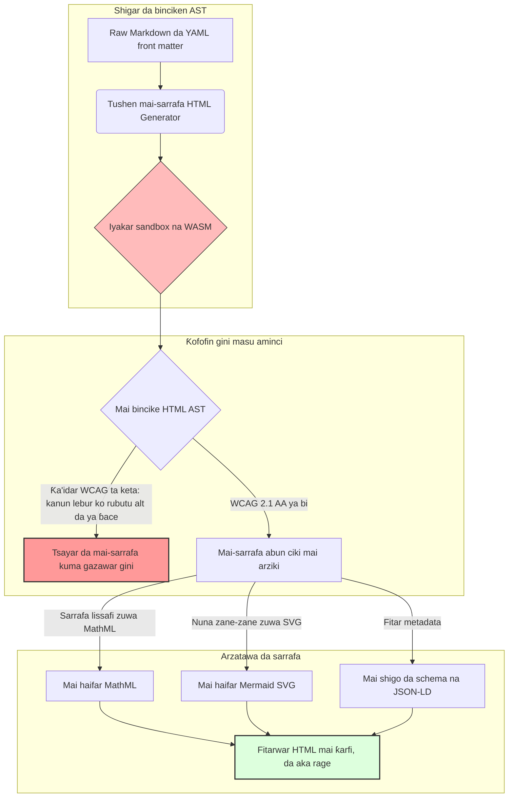

---

# Front Matter (YAML)

author: "contact@sebastienrousseau.com (Sebastien Rousseau)"
banner_alt: "Tsarin gine-gine a ƙarƙashin haske mai tsari — yana alama da rawar HTML Generator a matsayin bututun sarrafa Markdown zuwa HTML da aka kebe don buga abubuwa masu sauƙin isa, shirye don SEO, da amintacce"
banner_height: "1597"
banner_width: "2584"
banner: "https://cloudcdn.pro/stocks/images/ricardo-gomez-angel-IGPmtHvbe2g-unsplash.webp"
cdn: "https://cloudcdn.pro"
charset: "UTF-8"
cname: "sebastienrousseau.com"
copyright: "© Copyright 2025 - 2026 - Sebastien Rousseau. All rights reserved."
date: "June 20, 2026"
description: "HTML Generator laburare ne na Rust da yake canza Markdown zuwa HTML mai bin WCAG, shirye don SEO, da JSON-LD — sauƙin isa a matsayin lambar code, tallafi na MathML da Mermaid, da kuma aiwatarwa a cikin sandbox na WebAssembly don buga amintacce na kamfanoni."
format-detection: "telephone=no"
hreflang: "ha"
icon: "https://cloudcdn.pro/clients/sebastienrousseau/v1/logos/sebastienrousseau.svg"
id: "https://sebastienrousseau.com/2026-06-20-html-generator-accessible-seo-structured-markdown-rust-2026"
image_alt: "Hoton Baƙar Fata da Fari na Sebastien Rousseau"
image_height: "162"
image_width: "162"
image: "https://cloudcdn.pro/stocks/images/sebastien-rousseau.png"
keywords: "html-generator, Rust Markdown zuwa HTML, sauƙin isa a matsayin code, WCAG 2.1 AA, HTML shirye don SEO, JSON-LD, MathML, Mermaid, WebAssembly, EAA, DORA, ADA Title III, buga mai sauƙin isa, sarrafa lafiyayye, buɗaɗɗen tushe"
language: "ha-NG"
last_reviewed: "2026-06-20"
layout: "report"
locale: "ha_NG"
logo_alt: "Tambarin Sebastien Rousseau"
logo_height: "44"
logo_width: "44"
logo: "https://cloudcdn.pro/clients/sebastienrousseau/v1/logos/sebastienrousseau.svg"
menu: ""
measurementID: "G-169G4ET5HQ"
name: "Sebastien Rousseau"
permalink: "https://sebastienrousseau.com/2026-06-20-html-generator-accessible-seo-structured-markdown-rust-2026"
rating: "general"
referrer: "no-referrer"
robots: "index, follow"
schema: "FAQPage, Article"
seo_title: "Sauƙin Isa a Matsayin Code: Markdown zuwa HTML na AAA tare da Rust a 2026"
short_name: "sebastienrousseau"
subtitle: "Canza buga yanar gizo na kamfanoni, takardar samfur, da ƙofar abokin ciniki daga fayilolin rubutu marasa sauƙin isa zuwa kadarorin dijital masu tsari, bin doka, da amintacce."
tags: "html-generator, Rust, Markdown, sauƙin isa, WCAG, SEO, JSON-LD, MathML, Mermaid, WebAssembly, EAA, DORA, ADA, AI-discovery, RAG, buɗaɗɗen tushe, ababen more rayuwa na bankuna"
theme-color: "0, 83, 191"
title: "Canza Markdown zuwa HTML mai Sauƙin Isa, Shirye don SEO, da Tsari tare da Rust a 2026"
url: "https://sebastienrousseau.com/2026-06-20-html-generator-accessible-seo-structured-markdown-rust-2026"
viewport: "width=device-width, initial-scale=1, shrink-to-fit=no"

# RSS - The RSS feed front matter (YAML).
atom_link: "https://sebastienrousseau.com/2026-06-20-html-generator-accessible-seo-structured-markdown-rust-2026/rss.xml"
category: "Technology"
docs: https://validator.w3.org/feed/docs/rss2.html
generator: "Static Site Generator (SSG) (version 0.0.40)"
item_description: "HTML Generator laburare ne na Rust da yake canza Markdown zuwa HTML mai bin WCAG, shirye don SEO, da JSON-LD — sauƙin isa a matsayin lambar code, tallafi na MathML da Mermaid, da kuma aiwatarwa a cikin sandbox na WebAssembly don buga amintacce na kamfanoni."
item_guid: "https://sebastienrousseau.com/2026-06-20-html-generator-accessible-seo-structured-markdown-rust-2026/rss.xml"
item_link: "https://sebastienrousseau.com/2026-06-20-html-generator-accessible-seo-structured-markdown-rust-2026/rss.xml"
item_pub_date: "Sat, 20 Jun 2026 06:06:06 +0000"
item_title: "Canza Markdown zuwa HTML mai Sauƙin Isa, Shirye don SEO, da Tsari tare da Rust a 2026"
last_build_date: "Sat, 20 Jun 2026 06:06:06 +0000"
managing_editor: "contact@sebastienrousseau.com (Sebastien Rousseau)"
pub_date: "Sat, 20 Jun 2026 06:06:06 +0000"
ttl: "60"
type: "article"
webmaster: "contact@sebastienrousseau.com"

# Apple - The Apple front matter (YAML).
apple_mobile_web_app_orientations: "portrait"
apple_touch_icon_sizes: "192x192"
apple-mobile-web-app-capable: "yes"
apple-mobile-web-app-status-bar-inset: "black"
apple-mobile-web-app-status-bar-style: "black-translucent"
apple-mobile-web-app-title: "Markdown zuwa HTML na AAA tare da Rust"
apple-touch-fullscreen: "yes"

# MS Application - The MS Application front matter (YAML).

msapplication-navbutton-color: "0, 83, 191"

# Twitter Card - The Twitter Card front matter (YAML).

twitter_card: "summary_large_image"
twitter_creator: "@wwdseb"
twitter_description: "HTML Generator laburare ne na Rust da yake canza Markdown zuwa HTML mai bin WCAG, shirye don SEO, da JSON-LD — sauƙin isa a matsayin lambar code, tallafi na MathML da Mermaid, da kuma aiwatarwa a cikin sandbox na WebAssembly don buga amintacce na kamfanoni."
twitter_image: "https://cloudcdn.pro/clients/sebastienrousseau/v1/logos/sebastienrousseau.svg"
twitter_image_alt: "Tambarin Sebastien Rousseau"
twitter_site: "@wwdseb"
twitter_title: "Sauƙin Isa a Matsayin Code: Markdown zuwa HTML na AAA tare da Rust"
twitter_url: "https://sebastienrousseau.com/2026-06-20-html-generator-accessible-seo-structured-markdown-rust-2026"

# Humans.txt - The Humans.txt front matter (YAML).
author_website: "https://sebastienrousseau.com"
author_twitter: "@wwdseb"
author_location: "London, UK"
thanks: "Na gode da karantawa!"
site_last_updated: "2026-06-20"
site_standards: "HTML5, CSS3, RSS, Atom, JSON, XML, YAML, Markdown, TOML"
site_components: "Kaishi, Kaishi Builder, Kaishi CLI, Kaishi Templates, Kaishi Themes"
site_software: "Static Site Generator, Rust"

---

# Canza Markdown zuwa HTML mai Sauƙin Isa, Shirye don SEO, da Tsari tare da Rust a 2026

<!-- lead-start -->
<aside class="post-lead" aria-label="Takaitaccen labarin">

<strong>TL;DR.</strong> HTML Generator mai-Rust-tsantsa ne na sarrafa Markdown zuwa HTML wanda yake tilasta WCAG 2.1 AA a lokacin gini, yana shigo da JSON-LD mai bin tsarin schema, yana nuna MathML da Mermaid SVG ta asali, kuma yana ware sarrafa a cikin sandbox na WebAssembly — yana mai da buga abubuwa zuwa wurin kula da bututun da aka kebe wanda ke tabbatar da sauƙin isa, SEO, da tsaron ICT.

<strong>Manyan abubuwan da za a ɗauka</strong>

<ul class="post-lead-takeaways">
  <li><strong>Amsawar gaggawa.</strong> Menene HTML Generator a cikin jumla ɗaya?</li>
  <li><strong>Taƙaitaccen bayanin zartarwa.</strong> Nuna Markdown yana da sauƙi a zahiri; samun HTML na matakin buga-kamfani daidai matsala ce ta bin doka.</li>
  <li><strong>01. Me yasa mai-sarrafa HTML na farko-sauƙin-isa ya yi muhimmanci a 2026.</strong> EAA da ADA Title III sun matsar da sauƙin isa daga tsaftar injiniyanci zuwa haɗarin kuɗaɗen amana.</li>
  <li><strong>02. Madubin tsarin HTML Generator na 2026.</strong> Bututun sarrafa mai-zangon-da-yawa, da aka kebe ta matakin mai-sarrafa, daga raw Markdown zuwa fitarwar HTML mai ƙarfi.</li>
</ul>

<strong>Karatu masu alaƙa:</strong> <a href="https://sebastienrousseau.com/2026-06-18-noyalib-safe-yaml-rust-ai-mcp-financial-infrastructure-2026">Me yasa YAML ke Buƙatar Tari mafi Aminci na Rust don AI, MCP, da Ababen More Rayuwa na Kuɗi a 2026</a>, <a href="https://sebastienrousseau.com/2026-06-17-static-site-generator-secure-default-ai-era-publishing-2026">Static Site Generator mai-Aminci-ta-Asali don Buga a Zamanin AI a 2026</a>, <a href="https://sebastienrousseau.com/2026-06-11-cloudcdn-open-source-blueprint-ai-native-edge-2026">CloudCDN: Tsarin Buɗaɗɗen Tushe don Kiyayen AI-Native a 2026</a>.

</aside>
<!-- lead-end -->

A 2026, abun ciki na yanar gizo ana amfani da shi daidai gwargwado ta masu bincike na AI, injunan bincike masu LLM, da bututun Retrieval-Augmented Generation (RAG) kamar yadda masu karatu mutane ke yi. HTML mai lebur ko mara kyau yana rikita gano injin, yayin da gazawar bin ƙa'idodi masu ƙarfi na duniya kamar [Dokar Sauƙin Isa ta Turai (EAA)](https://www.accessibility-act.eu/) da [ADA Title III na Amurka](https://www.ada.gov/topics/title-iii/) yanzu haɗarin aikin farar hula ne wanda ba shi da tabbaci. [HTML Generator](https://github.com/sebastienrousseau/html-generator) laburare ne na Rust mai-aiki-sosai wanda aka tsara don rufe waɗancan giɓi — a matakin mai-sarrafa, ba a gyare-gyaren bayan tura ba.

## Amsawar gaggawa

**Menene HTML Generator a cikin jumla ɗaya?** HTML Generator mai-sarrafa Markdown zuwa HTML ne na buɗaɗɗen tushe, pure-Rust wanda yake tilasta [WCAG 2.1 AA](https://www.w3.org/TR/WCAG21/) a lokacin gini, yana haifar da abubuwa masu alamar semantic da halaye na ARIA ta atomatik, yana shigo da metadata na [JSON-LD](https://json-ld.org/) mai bin tsarin schema daga YAML front matter, yana nuna zane-zanen Mermaid da lissafi zuwa SVG mai sauƙin isa da MathML, kuma yana aiki a cikin sandbox na [WebAssembly](https://webassembly.org/) — yana mai da buga kamfanoni zuwa wurin kula na matakin wajibi na amana wanda aka kebe.

## Taƙaitaccen bayanin zartarwa

Nuna Markdown yana da sauƙi a zahiri. HTML na matakin buga kamfani matsala ce ta bin doka. A Yuni 2026, kowane wurin da kamfani ke taɓa — ƙofofin hulɗa da masu hannun jari, shigar da takardu na tsari, takardar abokin ciniki, jagoran API, jihohin siyarwa — ana bincika su ta mutane da injuna daidai. Matsin lamba biyu sun haɗu a kowace shafi: [EAA](https://www.accessibility-act.eu/) da [ADA Title III](https://www.ada.gov/topics/title-iii/) sun mai da sauƙin isa haɗarin shari'a na matakin kwamitin gudanarwa, yayin da shigar AI da bututun RAG ke ba da lada ga fitarwa mai tsari, da ke iya karatu ta injin. Laburaren Markdown na yau da kullun suna samar da HTML mai lebur wanda ya kasa daidaiton biyu. HTML Generator yana bi da samar da takarda a matsayin bututun da aka kebe ta matakin mai-sarrafa: tabbatarwar WCAG kuskure ne na gini, JSON-LD ya fito daga YAML front matter ba tare da tambaya ta hannu ba, MathML da Mermaid suna nuna da sauƙin isa, kuma injin gaba ɗaya yana aika a matsayin burin WebAssembly don sarrafa takardu marasa amana ya kasance a cikin sandbox daga mai masaukin baki.

## Manyan abubuwan da za a ɗauka

- **Sauƙin isa a matsayin code shine sabon asali.** EAA tana sanya tilas sauƙin isa don ayyukan dijital na mabukaci. HTML Generator yana tantance itacen takarda a lokacin gini, yana haifar da abubuwa masu alamar semantic da halaye na ARIA ta atomatik — gyare-gyare kaɗan bayan tura, kasafin kuɗin magance matsala kaɗan, babu rubutun alt da ya ɓace yana aika zuwa samarwa.
- **Bayanan tsari don gano AI.** Bincike na zamani da RAG suna dogara da metadata da injin zai iya karanta. Mai-sarrafa yana bincike YAML front matter kuma yana shigo da [JSON-LD mai bin tsarin Schema.org](https://schema.org/) kai tsaye cikin kan takarda, yana sa abun ciki ya iya karatu gaba ɗaya ta [Google Rich Results](https://developers.google.com/search/docs/appearance/structured-data/intro-structured-data), [Bing Webmaster](https://www.bing.com/webmasters), da masu bincike masu LLM.
- **Kyakkyawan abun ciki na fasaha.** Buga fasaha ba rubutu mai lebur ba ne. HTML Generator yana sarrafa ƙaddamar lissafi na Markdown zuwa [MathML](https://www.w3.org/Math/) mai sauƙin isa, kuma yana nuna zane-zanen [Mermaid.js](https://mermaid.js.org/) zuwa SVG mai amsa — duka suna adana tsarin da ya bi WCAG maimakon fada zuwa hotuna marasa gani.
- **Keɓewa na WebAssembly.** Sarrafa Markdown marasa amana haɗari ne na tsaro. Ta hanyar niyya da [WASM](https://webassembly.org/), HTML Generator yana aiwatarwa a cikin sandbox mai keɓe wanda yake hana aiwatar lambar ta sabani kuma yana kare tsarin mai masaukin baki — yana cika tilas na tsaron ICT na DORA Article 6 kai tsaye.
- **Kariya ta amana don kwamitocin gudanarwa.** Rashin bin ƙa'idodi na fasaha ya shiga zauren kwamiti. Yin amfani da injin HTML da aka kebe ta matakin mai-sarrafa yana kare daraktoci da manajan manajoji daga haɗarin farar hula da tsari na sirri a ƙarƙashin DORA, EAA, da ADA Title III.

**Karatu masu alaƙa:** [Me yasa YAML ke Buƙatar Tari mafi Aminci na Rust don AI, MCP, da Ababen More Rayuwa na Kuɗi a 2026](https://sebastienrousseau.com/2026-06-18-noyalib-safe-yaml-rust-ai-mcp-financial-infrastructure-2026/), [Static Site Generator mai-Aminci-ta-Asali don Buga a Zamanin AI a 2026](https://sebastienrousseau.com/2026-06-17-static-site-generator-secure-default-ai-era-publishing-2026/), [CloudCDN: Tsarin Buɗaɗɗen Tushe don Kiyayen AI-Native a 2026](https://sebastienrousseau.com/2026-06-11-cloudcdn-open-source-blueprint-ai-native-edge-2026/).

## 01. Me yasa Mai-Sarrafa HTML na Farko-Sauƙin-Isa Ya Yi Muhimmanci a 2026

Jihohin yanar gizo na kamfanoni, laburaran takardu, da cibiyoyin taimako na samfur wurare masu mahimmanci na hulɗa ta dijital ne. Yanzu suna ƙarƙashin matsin lamba biyu masu ƙarfi da ke haɗuwa.

Na farko shine **shigar AI da gano ta**. Abun ciki ana sarrafa shi ta ƙaruwa ta manyan samfuran harshe da bututun Retrieval-Augmented Generation. HTML mai lebur ko mara kyau yana rikita binciken crawler, yana barin bincike da takardu na kamfanoni marasa ganuwa ga salon bincike na zamani — ciki har da [Google Search Generative Experience](https://blog.google/products/search/generative-ai-search/), binciken [ChatGPT](https://chat.openai.com/), da wakilan RAG na kamfanoni.

Na biyu shine **dokar sauƙin isa ta duniya mai ƙarfi**. A ƙarƙashin [Dokar Sauƙin Isa ta Turai](https://www.accessibility-act.eu/) (ta yi aiki gaba ɗaya daga Yuni 2025) da [ADA Title III na Amurka](https://www.ada.gov/topics/title-iii/), dandamalin buga kamfanoni dole su tabbatar da sauƙin isa na dijital gaba ɗaya. Gazawar cika [WCAG 2.1 AA](https://www.w3.org/TR/WCAG21/) ba kuskure na injiniyanci ba ne; haɗarin farar hula ne da na tsari wanda ya samar da sulhuwar miliyoyin daloli.

[HTML Generator](https://github.com/sebastienrousseau/html-generator) yana magance waɗannan matsin lamba biyu kai tsaye. Laburare ne na Rust mai-aminci-jerin-sadarwa wanda aka tsara don canza Markdown zuwa HTML mai sauƙin isa, shirye don SEO, da tsari. Ta hanyar bi da samar da takarda a matsayin bututun da aka kebe ta matakin mai-sarrafa, injin yana ba da **Dawowar Juriya (RoR)** mai ƙarfi — yana kare ma'auni daga ƙarar sauƙin isa yayin da yake ƙara iya karatu ta injin don gano AI.

## 02. Madubin Tsarin HTML Generator na 2026

An tsara tsarin a matsayin bututun sarrafa amintacce mai zangon-da-yawa wanda yake canza rubutun Markdown raw zuwa kadarorin tsaye da aka tabbatar da cryptography, masu sauƙin isa sosai.

### Tebur na 1: Yaduddukan tsarin HTML Generator da ragewa haɗari

| Yadudduka | Shawarar zane | Me yasa ya yi muhimmanci | Haɗari idan ba a daidaita ba |
| ---- | ---- | ---- | ---- |
| **Yaduddukan shigar** | Mai bincike na Markdown da YAML front matter | Yana saduwa da marubuta inda suke; yana raba rubutun daga metadata na tsari. | Metadata mara daidaito, taswirar gidan yanar gizo mai lalacewa, giɓin ƙididdiga. |
| **Yaduddukan tsari** | Teburin Abun ciki ta atomatik da abubuwa masu alamar semantic tare da alamomi na ARIA | Yana samar da itacen takarda mai iya kewayawa, masu sauƙin isa ta gini. | HTML mai lebur wanda ke karya masu karatu allon kuma ya keta WCAG. |
| **Yaduddukan abun ciki mai arziki** | Nuna MathML da Mermaid.js SVG ta asali | Yana sarrafa tsare-tsare da zane-zane zuwa SVG mai sauƙin isa da MathML. | Jinkiri na nuna ta JS daga bangaren abokin ciniki da fitarwar fasaha ta taimaki da ta ƙetare. |
| **Yaduddukan SEO da bayanan** | Haɗakarwar JSON-LD da samar da metadata mai tsari | Yana shigo da JSON-LD mai bin [Schema.org](https://schema.org/) kai tsaye cikin kan. | Injunan bincike da masu bincike na AI sun ɓace marubucin, mahallin, lasisin. |
| **Yaduddukan aiwatarwa** | Mai-sarrafa Rust na asali tare da burin WebAssembly | Yana ba da damar aiwatarwa mai aminci, a cikin sandbox a sabobin, cibiyoyin ƙarshe, da masu bincike. | Aiwatar lambar ta sabani yayin sarrafa Markdown marasa amana. |

## 03. Alamomin Tsaro da Sauƙin Isa na Yanar Gizo Masu Muhimmanci

Don tabbatar cewa kadarorin buga da ke fuskantar jama'a sun cika duba na tsari da tsaro na zamani, manyan jami'an fasaha dole su sa ido kan ma'auni na musamman, masu iya ƙididdiga.

### Tebur na 2: Alamomin tsaro da sauƙin isa na yanar gizo

| Alama | Ma'auni / Ma'aunin aiki | Tunani na EAA / DORA / W3C | Aiwatarwa ta fasaha |
| ---- | ---- | ---- | ---- |
| **Bin ƙa'idodin sauƙin isa** | 100% na shafukan da aka sarrafa an tabbatar da su a kan ƙa'idodin WCAG 2.1 AA. | [EAA](https://www.accessibility-act.eu/) da [ADA Title III](https://www.ada.gov/topics/title-iii/) | Mai bincike HTML na lokacin gini yana tantance alamomi alt na hoto da abubuwa masu alamar semantic. |
| **Sandbox na aiwatarwa na WASM** | 100% na shigar Markdown marasa amana an sarrafa su a cikin kayan aiki na WebAssembly mai keɓe. | [DORA Article 6](https://eur-lex.europa.eu/legal-content/EN/TXT/?uri=CELEX%3A32022R2554) (tsaron ICT) | Keɓewar yanayin sarrafa daga sabin mai masaukin baki. |
| **Rufe metadata mai tsari** | 100% na labaran da aka buga an shigo da su da kanon JSON-LD masu inganci, masu bin tsarin schema. | Ƙayyadaddun [Schema.org](https://schema.org/) | Bincike na atomatik na front-matter da canzawa zuwa abubuwan JSON-LD. |
| **Gudun sarrafa** | Burin shafuka-a-dakika sama da 10,000 akan kayan aiki na yau da kullun. | Dawowar Juriya (RoR) | Mai-sarrafa AST na Rust mai ƙarfin layi mai yawa. |
| **Tabbatarwar yanki mai arziki** | Zero kuskuren bincike akan [Google Rich Results](https://search.google.com/test/rich-results) da gunar [Schema validator](https://validator.schema.org/). | Jagoran Google Search | Tabbatarwar tsari na JSON-LD da aka haifar yayin bututun gini. |

## 04. Labari na Karya na Nuna Markdown mai Sauƙi

Kuɗin fahimta da ke yadu a tsakanin manajan fasaha shi ne cewa canza Markdown zuwa HTML aiki ne mai sauƙi na maye rubutu. Laburaren yau da kullun da yawa suna fassara tsarin Markdown zuwa HTML mai lebur, marasa tsari. Fitarwa tana nuna ga mai karatu a cikin mai bincike, amma tarko ne na bin doka.

HTML mai lebur yawanci yana ɓatar da abubuwa uku.

1. **Tsarin taken daidai.** Markdown na yau da kullun bai tilasta tsarin taken ba. Tsallewa daga `<h1>` zuwa `<h4>` yana keta WCAG 2.1 AA kuma yana karya kewayawar takarda don masu karatu allon.
2. **Semantics na tebur bayyanannu.** Teburan Markdown na yau da kullun ba a nuna su da daidai `<th>` scope da halaye na `<tbody>` da ake buƙata don bincike mai sauƙin isa.
3. **Metadata da ke iya karatu ta injin.** HTML na yau da kullun yana ɓatar da kusa-kusa na JSON-LD da dandamalin bincike na AI na zamani da tsarin shigar RAG suka dogara da su.

HTML Generator yana warware wannan ta hanyar bincike Markdown zuwa **Abstract Syntax Tree (AST)**. Injin yana tantance tsarin takarda kafin fitarwa ta HTML, yana tabbatar da shiga-juna na taken, yana shigo da halaye na ARIA masu dacewa, kuma yana tabbatar cewa kowane kadari na kafofin watsa labarai yana ɗauke da rubutu mai-ra'ayi — yana mai da sauƙin isa daga bincike ta hannu zuwa abin da ya tabbata na lokacin-sarrafa.

## 05. Tsara Bututun Gini na Sauƙin Isa a Matsayin Code

Don hana kadarorin marasa sauƙin isa ko marasa ƙididdiga daga taɓa aika jama'a, sauƙin isa dole ne ya zama ƙofar mai-sarrafa mai ƙarfi. Bututun da ke zuwa yana nuna yadda HTML Generator yake tantance Markdown, yana gudanar da tabbatarwa ta WebAssembly-mai-keɓe, kuma yana fitarwa HTML mai ƙarfi, mai tsari.

## 06. Littafin Taka-Tsantsan na Zauren Kwamiti da Haɗarin Amana

Bin ƙa'idodin sauƙin isa na zamani da tsaron yanar gizo batutuwa ne na wajibi na zauren kwamiti. Manajoji na manyan mukamai dole su kusanci ababen more rayuwa na buga ta madubin haɗarin shari'a, kiyaye kuɗi, da haɗarin tsari.

- **Dokar Sauƙin Isa ta Turai (EAA).** Tana sanya tilas kai tsaye, masu ɗaure doka na bin ƙa'ida akan ƙofofin dijital na jama'a da masu zaman kansu. Rashin bin doka na iya haifar da hukunci mai tsanani na kuɗi, ƙarar farar hula, da fitar da kadari daga kasuwar EU nan take. Ta hanyar haɗa sauƙin isa a matsayin code, kwamitoci na iya tabbatar cewa lambar da ba ta bin doka ba za ta aika — yana canza magance matsala mai jinkiri zuwa garkuwar shari'a mai tsari.
- **DORA Article 6 (Yanayin ICT mai Aminci).** Yana kafa ƙa'idodi masu ƙarfi don tsaron yanayin ICT. Ta hanyar keɓe sarrafa Markdown a cikin sandbox na WebAssembly, ƙungiyoyi suna tabbatar cewa bincike takardu da abokin ciniki ya loda ko ciyarwar abokin tarayya ba za su iya fallasa sabobin mai masaukin baki ga aiwatar lambar ta sabani ba, suna kare ƙofofin bankuna masu mahimmanci.
- **Rage farashi a bincike na bin doka.** Bin ƙa'idodin sauƙin isa na al'ada yana dogara da bincike mai tsada na bayan-tura mai jinkiri — dubban daloli a kowace shekara a kowace gidan yanar gizo. Aiwatar tabbatarwar WCAG a matsayin shinge na lokacin-sarrafa yana kawar da waɗancan farashi masu jinkiri, yana canza kasafin kuɗin bin doka daga tsaro zuwa sabuntawa.

## 07. Menene Wannan ke Nufin ta Nau'in Banki / Kamfani

### Bankunan da ke da Muhimmanci ta Duniya (G-SIBs)

G-SIBs suna aiki da jihohin jama'a masu girma, masu yaruruwa da yawa waɗanda suke buga takardu na bincike na dubun-dubutan, bayyanawa na tsari, da takardu na hulɗa da masu hannun jari a hukunce-hukunce daban-daban. Ƙalubalen su shi ne girman scale da daidaito na harsuna da yawa. Burin WebAssembly na HTML Generator da injin Rust mai gudun sarrafa sama yana bawa laburaran bincike masu girma, masu rarrabawa damar sabunta, sarrafa, da tura a duniya a cikin dakiku — ba tare da jinkiri na nuna ko komawa baya a sauƙin isa ba.

### Bankunan Ma'amala da Kamfanoni

Don bankunan ma'amala, ƙofofin abokin ciniki, cibiyoyin takardu, da jagorori na API na masu haɓakawa wurare masu mahimmanci na hulɗa ta dijitan ne. Sarrafa waɗancan kadarorin ta HTML Generator yana nufin tashoshin da ke fuskantar abokin ciniki ba su da haɗarin XSS, babu hanyoyin hijack na dogaro, kuma babu giɓin sauƙin isa — suna adana amincewar cibiyar kuma suna rage saman ƙara.

### Bankunan Yanki da Fintechs

Bankunan yanki da fintechs masu sauri suna fafatawa akan kwarewar dijital ba tare da kasafin kuɗin injiniyanci na G-SIB ba. HTML Generator yana ba wa waɗancan ƙungiyoyi bututun buga na matakin kamfani nan take, yana bawa jihohin ƙanana damar aika kadarorin masu sauƙin isa, shirye don SEO, masu aminci waɗanda ke jure bincike daga ma'aikatun tsari da abokan kasuwanci na kamfanoni masu yuwuwa.

## 08. Taswira ta Ababen More Rayuwa na Buga

Jihohin yanar gizo da ke fuskantar jama'a na kamfanoni sashi ne mai mahimmanci na juriya ta aiki. Dogara da injunan yanar gizo masu jinkiri, masu rauni ta ƙa'ida, masu-database — ko kadarorin tsaye marasa sanya hannu — haɗari ne na kasuwanci mara yarda.

Don tabbatar da wurare masu hulɗa ta dijital na jama'a kuma don kare ma'auni daga ƙarar sauƙin isa, manajan fasaha da tsaro na manyan mukamai ya kamata su aiwatar da taswira a bayyane.

1. **Canja zuwa tsarin tsaye.** Kawo ƙarshen dandamalin CMS mai ƙa'ida masu jinkiri don jihohin bincike, siyarwa, da takardu. Matsar da abun ciki zuwa bututun da aka kebe ta matakin mai-sarrafa kamar HTML Generator.
2. **Tilasta sauƙin isa a lokacin gini.** Aiwatar sauƙin isa a matsayin code. Kasa bututun sarrafa ta atomatik kan duk wani keta WCAG 2.1 AA.
3. **Keɓe sarrafa a WebAssembly.** Sandboxar duk bincike na takarda da abun ciki a cikin kayan aiki na WASM don shigar marasa amana ba ta taɓa tsarin mai masaukin baki ba.
4. **Shigo da metadata mai arziki na JSON-LD.** Tabbatar cewa kowane kadari da aka buga yana ɗauke da kanon JSON-LD masu bin tsarin schema don ƙara gano AI zuwa iyaka.

## 09. Tambayoyi da Ake Yawan Yiwa

**Yaya HTML Generator ke tilasta sauƙin isa?**

Yana bincike Abstract Syntax Tree na HTML da aka haifar a lokacin gini, yana tantance takarda a kan ƙa'idodin [WCAG 2.1 AA](https://www.w3.org/TR/WCAG21/). Idan an keta ƙa'ida — halayya alt da ta ɓace, tsallewa na taken, kula na fom marasa lakabin — mai-sarrafa yana tsayar da gini, yana bi da sauƙin isa a matsayin abin da ya tabbata na lokacin-sarrafa maimakon aikin bincike bayan tura.

**Me yasa keɓewar WebAssembly ta yi muhimmanci?**

[WebAssembly](https://webassembly.org/) yana ba da damar injin bincike na Markdown ya aiwata a cikin sandbox mai keɓe, an raba shi daga sabin mai masaukin baki. Ko da lokacin da ɗan wasa mai ƙiyayya ya loda takarda Markdown da aka tsara don amfani da rauni na mai bincike, aiwatarwa an tarko — yana kare tsarin mai masaukin baki kuma yana cika tilas na tsaron ICT na DORA Article 6.

**Yaya JSON-LD ke amfana da gano bincike a 2026?**

[JSON-LD](https://json-ld.org/) yana ba da metadata mai tsari, da ke iya karatu ta injin a cikin kan takarda. [Google Rich Results](https://developers.google.com/search/docs/appearance/structured-data/intro-structured-data), masu bincike na Bing, da wakilan bincike masu LLM suna gano marubucin, lasisin, kwanan buga, da mahallin semantic nan take — suna kaucewa rashin tabbas na HTML na yau da kullun kuma suna ƙara saman a cikin gano da AI ke jagoranta.

**Wa ne manufar HTML Generator?**

Masu gina gidajen yanar gizo na tsaye, ƙungiyoyin takardu, marubuta masu fasaha, masu haɓakawa na Rust, da injiniyan dandamali masu aika jihohin masu mahimmanci na sauƙin isa ko masu-tsari. Shi ma yadudduka na sarrafa abun ciki masu yuwuwa a cikin bututun buga mafi aminci kamar [Static Site Generator (SSG)](https://github.com/sebastienrousseau/static-site-generator).

## 10. Manazarta

- World Wide Web Consortium (W3C), 2024. [Jagoran Abun Ciki na Yanar Gizo mai Sauƙin Isa (WCAG) 2.1 ⧉](https://www.w3.org/TR/WCAG21/ "Web Content Accessibility Guidelines 2.1").
- Schema.org, 2026. [Ƙayyadaddun bayanan tsari na Schema.org ⧉](https://schema.org/ "Schema.org structured-data specifications").
- Majalisar Turai da Majalisar Tarayyar Turai, 2022. [Tsarin (EU) 2022/2554 akan juriya ta aiki ta dijital don sashen kuɗi (DORA) ⧉](https://eur-lex.europa.eu/legal-content/EN/TXT/?uri=CELEX%3A32022R2554 "DORA Regulation").
- Hukumar Turai, 2025. [Dokar Sauƙin Isa ta Turai ⧉](https://www.accessibility-act.eu/ "European Accessibility Act").
- Ma'aikatar Shari'a ta Amurka, 2024. [ADA Title III ⧉](https://www.ada.gov/topics/title-iii/ "ADA Title III").
- Ƙungiyar Jama'a ta WebAssembly, 2026. [Ƙayyadaddun WebAssembly ⧉](https://webassembly.org/ "WebAssembly").
- GitHub, 2026. [Ma'ajiyar HTML Generator ⧉](https://github.com/sebastienrousseau/html-generator "HTML Generator open-source repository").

<!-- enrich-start -->
<aside class="author-card" aria-label="Game da marubucin"><strong class="author-card-name"><a href="/about/index.html">Sebastien Rousseau</a></strong>Ƙwararren fasaha na banki yana rubutu akan AI da aka aiwatar, ababen more rayuwa na biyan kuɗi, kuɗin da aka tokenize, ISO 20022, tsaron bayan-quantum, ayyukan kuɗi na cloud-native, ababen more rayuwa na buɗaɗɗen tushe, da kasuwar dijital da aka tsara.Shekaru 20+ a fadin HSBC Commercial &amp; Investment Bank, PayPal, Barclays, Shazam, AKQA, Virgin Group. <a href="/about/index.html">Cikakken bayani</a> &middot; <a href="https://www.linkedin.com/in/sebastienrousseau/" rel="external noopener">LinkedIn</a> &middot; <a href="https://github.com/sebastienrousseau" rel="external noopener">GitHub</a></aside>

An karshe duba <time datetime="2026-06-20">2026-06-20</time>.

<!-- enrich-end -->
