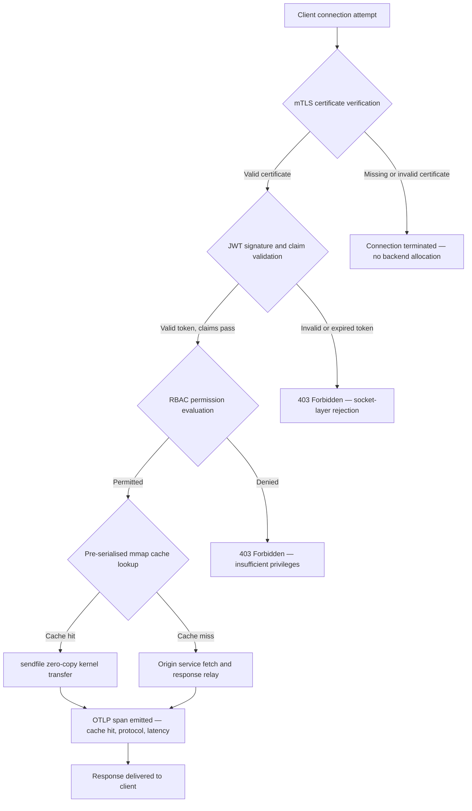

---

# Front Matter (YAML)

author: "contact@sebastienrousseau.com (Sebastien Rousseau)"
banner_alt: "Hoton birnin da aka gina da katin kewaya a cikin daren da ya nuna iyakar banki inda canja wurin kernel-level zero-copy, musafaha na mTLS, da tabbatarwa JWT suka hadu a cikin binary guda ɗaya da aka haɗa a tsaye"
banner_height: "1597"
banner_width: "2584"
banner: "https://cloudcdn.pro/stocks/images/bit-cloud-GlqbGLCPnQ4.webp"
cdn: "https://cloudcdn.pro"
charset: "UTF-8"
cname: "sebastienrousseau.com"
copyright: "© Copyright 2025 - 2026 - Sebastien Rousseau. All rights reserved."
date: "June 20, 2026"
description: "http-handle wani binary na Rust da aka haɗa a tsaye wanda ke isar da buƙatu 180,000 a sakan ɗaya a iyakar banki ba tare da dogaro da lokaci na gudu ba, tare da tabbatarwa mTLS da JWT da aka haɗa, HTTP/2 da HTTP/3 da aka tattauna ta ALPN, da kuma lura ta OTLP — ta rufe gibin tsaro da karko da Nginx da Envoy suka bari buɗe."
format-detection: "telephone=no"
hreflang: "ha"
icon: "https://cloudcdn.pro/clients/sebastienrousseau/v1/logos/sebastienrousseau.svg"
id: "https://sebastienrousseau.com/2026-06-20-http-handle-zero-dependency-edge-ingress-banking-rust-2026"
image_alt: "Hoton Baki da Fari na Sebastien Rousseau"
image_height: "162"
image_width: "162"
image: "https://cloudcdn.pro/stocks/images/sebastienrousseau.webp"
keywords: "http-handle, Rust edge ingress, proxy ba tare da dogaro ba, ababen more rayuwa na banki, mTLS JWT, sendfile zero-copy, ALPN HTTP3, bin doka DORA, Basel III, lura OTLP, binary na tsaye, ARM64 banki, zero trust banki, ingress mai sauƙi, tsaro Rust na banki"
language: "ha-NG"
last_reviewed: "2026-06-20"
layout: "report"
locale: "ha_NG"
logo_alt: "Alamar Sebastien Rousseau"
logo_height: "44"
logo_width: "44"
logo: "https://cloudcdn.pro/clients/sebastienrousseau/v1/logos/sebastienrousseau.svg"
menu: ""
measurementID: "G-169G4ET5HQ"
name: "Sebastien Rousseau"
permalink: "https://sebastienrousseau.com/2026-06-20-http-handle-zero-dependency-edge-ingress-banking-rust-2026"
rating: "general"
referrer: "no-referrer"
robots: "index, follow"
schema: "FAQPage, Article"
seo_title: "http-handle: Rust Ingress Ba Tare da Dogaro ba ga Banki a 180k req/s"
short_name: "sebastienrousseau"
subtitle: "Yadda binary guda ɗaya na Rust da aka haɗa a tsaye ke isar da buƙatu 180,000 a sakan ɗaya tare da mTLS, JWT, da ALPN a iyakar banki — da kuma abin da hakan ke nufi ga bin doka DORA da Basel III."
tags: "http-handle, Rust, banking, edge-ingress, mTLS, JWT, ALPN, HTTP3, DORA, Basel-III, zero-copy, sendfile, ARM64, zero-trust, OTLP, observability, open-source, infrastructure"
theme-color: "0, 83, 191"
title: "http-handle: Ingress Mai Ƙarfin Aiki da Ba Tare da Dogaro ba ga Banki a 2026"
url: "https://sebastienrousseau.com/2026-06-20-http-handle-zero-dependency-edge-ingress-banking-rust-2026"
viewport: "width=device-width, initial-scale=1, shrink-to-fit=no"

# RSS - The RSS feed front matter (YAML).
atom_link: "https://sebastienrousseau.com/2026-06-20-http-handle-zero-dependency-edge-ingress-banking-rust-2026/rss.xml"
category: "Technology"
docs: https://validator.w3.org/feed/docs/rss2.html
generator: "Static Site Generator (SSG) (version 0.0.40)"
item_description: "http-handle wani binary na Rust da aka haɗa a tsaye wanda ke isar da buƙatu 180,000 a sakan ɗaya a iyakar banki ba tare da dogaro da lokaci na gudu ba, tare da tabbatarwa mTLS da JWT da aka haɗa, HTTP/2 da HTTP/3 da aka tattauna ta ALPN, da kuma lura ta OTLP — ta rufe gibin tsaro da karko da Nginx da Envoy suka bari buɗe."
item_guid: "https://sebastienrousseau.com/2026-06-20-http-handle-zero-dependency-edge-ingress-banking-rust-2026/rss.xml"
item_link: "https://sebastienrousseau.com/2026-06-20-http-handle-zero-dependency-edge-ingress-banking-rust-2026/rss.xml"
item_pub_date: "Sat, 20 Jun 2026 07:07:07 +0000"
item_title: "http-handle: Ingress Mai Ƙarfin Aiki da Ba Tare da Dogaro ba ga Banki a 2026"
last_build_date: "Sat, 20 Jun 2026 07:07:07 +0000"
managing_editor: "contact@sebastienrousseau.com (Sebastien Rousseau)"
pub_date: "Sat, 20 Jun 2026 07:07:07 +0000"
ttl: "60"
type: "article"
webmaster: "contact@sebastienrousseau.com"

# Apple - The Apple front matter (YAML).
apple_mobile_web_app_orientations: "portrait"
apple_touch_icon_sizes: "192x192"
apple-mobile-web-app-capable: "yes"
apple-mobile-web-app-status-bar-inset: "black"
apple-mobile-web-app-status-bar-style: "black-translucent"
apple-mobile-web-app-title: "Iyakar Banki Ba Tare da Dogaro ba"
apple-touch-fullscreen: "yes"

# MS Application - The MS Application front matter (YAML).

msapplication-navbutton-color: "0, 83, 191"

# Twitter Card - The Twitter Card front matter (YAML).

twitter_card: "summary_large_image"
twitter_creator: "@wwdseb"
twitter_description: "http-handle wani binary na Rust da aka haɗa a tsaye wanda ke isar da buƙatu 180,000 a sakan ɗaya a iyakar banki ba tare da dogaro da lokaci na gudu ba, tare da mTLS, JWT, da lura ta OTLP."
twitter_image: "https://cloudcdn.pro/clients/sebastienrousseau/v1/logos/sebastienrousseau.svg"
twitter_image_alt: "Logo of Sebastien Rousseau"
twitter_site: "@wwdseb"
twitter_title: "http-handle: Rust Ingress Ba Tare da Dogaro ba ga Banki a 180k req/s"
twitter_url: "https://sebastienrousseau.com/2026-06-20-http-handle-zero-dependency-edge-ingress-banking-rust-2026"

# Humans.txt - The Humans.txt front matter (YAML).
author_website: "https://sebastienrousseau.com"
author_twitter: "@wwdseb"
author_location: "London, UK"
thanks: "Thanks for reading!"
site_last_updated: "2026-06-20"
site_standards: "HTML5, CSS3, RSS, Atom, JSON, XML, YAML, Markdown, TOML"
site_components: "Kaishi, Kaishi Builder, Kaishi CLI, Kaishi Templates, Kaishi Themes"
site_software: "Static Site Generator, Rust"

---

# http-handle: Ingress Mai Ƙarfin Aiki da Ba Tare da Dogaro ba ga Banki a 2026

<!-- lead-start -->
<aside class="post-lead" aria-label="Taƙaitaccen labari">

<strong>A taƙaice.</strong> http-handle binary ne na Rust na buɗaɗɗen tushe da aka haɗa a tsaye wanda ke maye gurbin Nginx da Envoy a iyakar banki. Yana isar da buƙatu 180,000 a sakan ɗaya a kan nodes na ARM64 ta hanyar canja wurin zero-copy na Linux <code>sendfile(2)</code>, yana aiwatar da tabbatarwa mTLS da JWT a kan layin socket na cibiyar sadarwa kafin a gudanar da wani lambar aikace-aikace, yana tattauna HTTP/2 da HTTP/3 ta atomatik ta ALPN, kuma yana fitar da ma'auni na OpenTelemetry ta asali — duk ba tare da dogaro da lokaci na gudu fiye da <code>libc</code> ba.

<strong>Manyan abubuwan da aka gano</strong>

<ul class="post-lead-takeaways">
  <li><strong>Matsalar proxy mai nauyi.</strong> Nginx da Envoy suna ɗauke da bishiyoyin dogaro waɗanda ke faɗaɗa farfajiyar CVE da kuma sanya tsarin magance hadarin ICT na DORA ya zama mai rikitarwa.</li>
  <li><strong>Aikin zero-copy a ma'auni.</strong> Tubalan cache na mmap da aka tsara a gaba da canja wurin kernel na <code>sendfile(2)</code> suna kiyaye buƙatu 180,000 req/s a ARM64 tare da ƙasa da millisecond ɗaya na wuce-wuce na proxy.</li>
  <li><strong>Tsaro a socket, ba a aikace-aikace ba.</strong> Tabbatarwa ta takardar shaidar mai amfani na mTLS, tabbatarwa ta JWT, da kuma kimanta RBAC sun cika kafin a rarraba wani albarkatu na baya ga buƙatar.</li>
  <li><strong>Daidaituwa da ƙa'idoji an haɗa shi a ciki.</strong> Raguwar farfajiyar harin da kuma tura binary guda ɗaya da za a iya dubawa kai tsaye suna magance Mataki na 5 da na 6 na DORA, haɗarin aiki na Basel III, da kuma sarƙoƙin lissafin SM&CR.</li>
</ul>

<strong>Ƙarin karantawa:</strong> <a href="https://sebastienrousseau.com/2026-06-18-noyalib-safe-yaml-rust-ai-mcp-financial-infrastructure-2026">Me Ya Sa YAML Ke Buƙatar Tarin Rust Mai Aminci ga AI, MCP, da Ababen More Rayuwa na Kudi a 2026</a>, <a href="https://sebastienrousseau.com/2026-06-11-cloudcdn-open-source-blueprint-ai-native-edge-2026">CloudCDN: Tsarin Buɗaɗɗen Tushe ga Iyakar Asalin AI a 2026</a>, <a href="https://sebastienrousseau.com/2026-05-16-best-cloud-infrastructure-architecture-2026">Mafi Kyawun Tsarin Ababen More Rayuwa na Cloud ga Bankunan da Cibiyoyin Kudi a 2026</a>.

</aside>
<!-- lead-end -->

Iyakar banki tana da matsalar dogaro. Kowane misali na Nginx ko Envoy da ke jagorantar zirga-zirgar ababen hawa tsakanin mai amfani da sabis na banki na tsakiya yana ɗauke da bishiyar dogaro: ginawa ta OpenSSL, modules ɗin Lua, ɗakunan karatu na gRPC, da layukan kwantena — kowannensu CVE mai yiwuwa, kowannensu yana buƙatar zagayen faɗakarwa mai sadaukarwa, kowannensu yana ƙara bambancin jinkiri wanda ke sanya auna SLA ya zama mai rikitarwa. A ƙarƙashin [Dokar Ƙarfin Aiki na Dijital (DORA)](https://eur-lex.europa.eu/eli/reg/2022/2554/oj), wannan rikitarwa yanzu yana da alhakin ƙa'idoji kamar yadda yake da na aiki.

[http-handle](https://github.com/sebastienrousseau/http-handle) yana ɗaukar hanyar daban. Ita ce binary guda ɗaya na Rust da aka haɗa a tsaye ba tare da dogaro da lokaci na gudu fiye da `libc` ba. Yana isar da buƙatu 180,000 a sakan ɗaya a kan nodes na ARM64, yana aiwatar da TLS na juna da tabbatarwa ta JWT a layin socket na cibiyar sadarwa, kuma yana tattauna HTTP/2 da HTTP/3 ta atomatik — duk a cikin ƙananan ƙafa na tura ƙasa da MB 20 na RAM.

## Amsar Gaggawa

**Mene ne http-handle a cikin jumla ɗaya?** http-handle binary ne na buɗaɗɗen tushe na Rust da aka haɗa a tsaye wanda ke maye gurbin kwantena na proxy mai nauyi a iyakar banki, yana isar da buƙatu 180,000 req/s a ARM64 ta hanyar canja wurin kernel na zero-copy na `sendfile(2)` na Linux, yana aiwatar da mTLS, JWT, da RBAC a layin socket kafin a taɓa wani albarkatu na baya, kuma yana fitar da ma'auni na asalin [OpenTelemetry](https://opentelemetry.io/) — ba tare da dogaro da ɗakunan karatu na lokaci na gudu fiye da `libc` ba.

## Taƙaitaccen Shugabanci

Bankunan sun gudanar da Nginx da Envoy a iyakarsu na tsawon shekara goma. Dukansu masu ikon aiki ne; babu ɗayansu da aka tsara don yanayin ƙa'idoji na 2026. Hotunan kwantena da ke cike da dogaro suna haifar da layin jira na CVE waɗanda ƙungiyoyin bin doka ba za su iya tsabtace su da sauri ba, kuma kowane canza sigar ɗakin karatu yana ɗauke da haɗarin matsawa baya. Mataki na 5 da na 6 na DORA suna buƙatar a gudanar da haɗarin ICT ta hanyar ƙira, ba ana gyara shi bayan ganowa ba. Tsarin haɗarin aiki na Basel III yana hukunta gine-ginen da abubuwan gazawa ke ƙaruwa tare da rikitarwan tsarin.

http-handle yana kawar da matsalar dogaro a tushen ta. An haɗa binary ɗaya tare a tsaye, ba tare da buƙatun ɗakin karatu na waje a lokacin gudu ba. Farfajiyar harin ta ragu zuwa ɗakin karatu na Rust na ma'auni da kuma `libc`. Aiwatar da tsaro — tabbatarwa ta takardun shaidar mTLS, tabbatarwa ta iƙirarin JWT, da kuma kula da shiga ta dogaro da rawa — yana aiwatarwa a kan socket na cibiyar sadarwa kafin wani rarraba baya, ta runtse kewaye na Zero Trust zuwa mafi ƙanƙani da za a iya. Aikin yana bi tsarin gine-gine: tubalan cache da aka ɗora a ƙwaƙwalwa da aka tsara a gaba tare da canja wurin kernel na `sendfile(2)` sun cire bayanai gaba ɗaya daga hanyar kwafin CPU zuwa ƙwaƙwalwa, yana kiyaye buƙatu 180,000 req/s a kayan aikin ARM64. Sakamakon shine layin ingress wanda ke cika buƙatun juriyar DORA, yana tallafawa hujjojin raguwar haɗarin aiki na Basel III, kuma yana ba manyan shugabannin IT a ƙarƙashin SM&CR sarkar lissafin na guda ɗaya mai tabbatacce don kayan aikin iyakar.

## Manyan Abubuwan da Aka Gano

- **Binary ƙanana, layin CVE gajere.** Binary guda ɗaya da aka haɗa a tsaye yana da fakiti guda ɗaya don gyarawa, saki guda ɗaya don tabbatarwa, da kuma kayan aiki guda ɗaya don dubawa. Nginx tare da saitin module na ma'auni yana zuwa tare da dogaro fiye da ɗakunan karatu na 30 da aka raba; kowannensu yana ɗauke da salon rayuwar rauni na kansa.
- **Zero-copy ba ci gaba ba ne — ƙa'ida ce ta ƙira.** A buƙatu 180,000 req/s, duk wani kwafin bayanai a sararin mai amfani yana gabatar da bambancin jinkiri mai auna. `sendfile(2)` yana canja wurin abubuwan kwayoyin halitta na mai bayyana fayil — ko yankin da aka ɗora a ƙwaƙwalwa — zuwa mai bayyana fayil na socket na cibiyar sadarwa, gaba ɗaya a cikin kernel. Haɗe da tubalan cache na amsa da aka ɗinke a mmap, CPU ba ya taɓa hanyar bayanai don amsar da aka ɓoye a cikin cache.
- **Kewaye na tsaro na socket ne.** Tabbatarwar JWT da takardun shaidar mTLS a cikin middleware na aikace-aikace yana nufin bayan ya riga ya rarraba zaren da ƙwaƙwalwa kafin a ƙi buƙatar. Tabbatarwar layin socket yana tabbatar da cewa buƙatun da ba a tantance ba ba sa cinye wani albarkatu na baya kwata-kwata.
- **OTLP yana rufe gibin lura.** Haɗin gwiwar asalin OpenTelemetry yana nufin kowane buƙata, kowane yanke shawara na tabbatarwa, da kuma duk wata tattaunawa ta yarjejeniya yana samar da telemetry mai tsari ba tare da wakili na sidecar ba. Allon sarrafa na banki da ke akwai suna cin abinci kai tsaye daga OTLP.

**Ƙarin karantawa:** [Me Ya Sa YAML Ke Buƙatar Tarin Rust Mai Aminci ga AI, MCP, da Ababen More Rayuwa na Kudi a 2026](https://sebastienrousseau.com/2026-06-18-noyalib-safe-yaml-rust-ai-mcp-financial-infrastructure-2026/), [CloudCDN: Tsarin Buɗaɗɗen Tushe ga Iyakar Asalin AI a 2026](https://sebastienrousseau.com/2026-06-11-cloudcdn-open-source-blueprint-ai-native-edge-2026/), [Mafi Kyawun Tsarin Ababen More Rayuwa na Cloud ga Bankunan da Cibiyoyin Kudi a 2026](https://sebastienrousseau.com/2026-05-16-best-cloud-infrastructure-architecture-2026/).

## 01. Matsalar Proxy Mai Nauyi a Banki

Nginx da Envoy sun gina iyakar intanet ɗin zamani. Dukansu masu saitin aiki ne, an gwada su a fagen daga, kuma manyan al'ummomin sun goyi bayansu. Su ma zaɓuɓɓukan gine-gine ne da aka yi kafin DORA ta wanzu, kafin tsarin haɗarin aiki na Basel III ya buƙaci raguwar rikitarwa mai auna, da kuma kafin nodes na ARM64 na cloud suka canza tattalin arzikin ɗaukar nauyin aiki mai yawan magudanar ruwa.

Sakamakon aiki shine gibi tsakanin abin da bankunan ke buƙata da abin da kwantena na proxy masu nauyi ke bayarwa.

**Farfajiyar dogaro.** Turan Envoy na ma'auni yana jan OpenSSL, Abseil, Protobuf, gRPC, Lua, da daruruwan ɗakunan karatu na biyu. Kowannensu yana ɗauke da zagayen rayuwar CVE mai zaman kansa. Lokacin da Bayanan Tsaro na Ƙasa ya buga wani shawarar OpenSSL mai mahimmanci, kowane misali na Envoy a cikin dukiya ya zama agogo na bin doka: kimanta, gyarawa, gwadawa, sake turawa, da sake tabbatarwa — a duk yanayin da binary ke gudana. A ƙarƙashin Mataki na 6 na DORA, dole ne bankunan su nuna cewa tsarin gudanar da haɗarin ICT sun dace, an rubuta su, kuma za a iya tabbatarwa. Bishiyar dogaro mai ɗakunan karatu da yawa tana yin wannan nuni mai tsada don kulawa.

**Yawan aiki na ƙwaƙwalwa.** Aiwatarwar Nginx da aka saitin ta ƙasa da ƙasa tana cinye MB 40-80 na ƙwaƙwalwar mazaunin ƙarƙashin nauyi matsakaici. A ma'auni — ɗaruruwan nodes na ingress a cikin tsarin kasuwanci, APIs na biyan kuɗi, da hanyoyin shiga na mai amfani — wannan nauyin ya taru zuwa farashin kayan aikin da za a iya aunawa ba tare da amfanin aikin da ya dace ba fiye da madadin binary ɗaya da aka tsara sosai.

**Sauri na faɗakarwa.** Sarƙoƙin samar da hoton kwantena suna gabatar da lag na kwana da yawa tsakanin wallafe-wallafen CVE da farkon da aka tabbatar da ya isa samar da shi. Dole ne a sake gina hoton tushe, sake yin layin aikace-aikace, sake aiwatar da cikakken matrix ɗin gwaji, da sake aiwatar da layin turawa. Ga tsarin banki mai mahimmanci da ke aiki a ƙarƙashin tagogin rahoton lamarin DORA, wannan zagaye haɗari ne na tsari.

http-handle yana magance dukkan uku. Binary guda ɗaya. Farfajiyar CVE guda ɗaya. Kayan aiki guda ɗaya don gyarawa. Ƙasa da MB 20 na RAM don node na ingress na samarwa.

## 02. Lens ɗin Gine-ginen http-handle na 2026

An tsara binary ɗin azaman layuka biyar masu yanayi mai dogaro, kowannensu an tsara shi don kawar da wata takamaiman ɗimbin haɗari da gine-ginen proxy na gargajiya ke tattarawa.

### Tebur 1: Layukan gine-ginen http-handle da rage haɗari

| Layer | Yanke shawara na ƙira | Me ya sa ya fi dacewa | Haɗari idan ba a kula da shi ba |
| ---- | ---- | ---- | ---- |
| **Gindin uwar garken** | Binary guda ɗaya na Rust, da aka haɗa a tsaye, babu dogaro fiye da `libc` | Kayan aiki guda ɗaya don gyarawa; yana kawar da yaɗuwar CVE ɗin ɗakin karatu a duk dukiya | Hare-haren rikicewar dogaro; taruwar raunin ɗakin karatu |
| **Injin hanzarawa** | Tubalan cache na mmap da aka tsara a gaba da canja wurin kernel na zero-copy na `sendfile(2)` | Buƙatu 180,000 req/s a ARM64 tare da ƙasa da millisecond ɗaya na wuce-wuce na proxy; babu bayanai da ke shiga sararin mai amfani don amsar da aka ɓoye a cikin cache | Ɓatar da ƙwaƙwalwar ɗauran; tarin tsaro na sararin kernel ƙarƙashin soke cache |
| **Tsaro na ɓoye** | mTLS na asalin tare da goyan bayan sake ɗaukar takardun shaidar zafi da tattaunawar ALPN | Yana tabbatar da mutuncin bayanai da jituwa ta yarjejeniya; juya takardun shaidar ba tare da ɓata haɗin gwiwa ba | Ƙarewar takardun shaidar ta haifar da katsewar sabis; ƙarancin ƙa'idodin cipher suite na tsoho |
| **Jirgin tsare-tsaren shiga** | Tabbatarwar JWT a layin socket da kimanta iƙirarin RBAC | Buƙatun da ba a tantance ba ba sa cinye wani albarkatu na baya; Zero Trust da aka aiwatar a kan iyakar kernel | Hare-haren rikicewar algorithm na JWT; ƙa'idar RBAC da ba daidai ba ta ba da damar shiga da yawa fiye da kima |
| **Lura** | Haɗin gwiwa na asalin [OpenTelemetry (OTLP)](https://opentelemetry.io/docs/specs/otlp/) | Telemetry mai tsari ba tare da wakilan sidecar ba; cin abinci kai tsaye a cikin dukiyoyin sa ido na banki da ke akwai | Wuraren makafi yayin katsewar; gurɓatattun sawun bincike don rahoton lamarin DORA |

## 03. Manyan Alamomin Aikin da Tsaro

Bankunan da ke gudanar da http-handle a iyakar dole ne su aunawa alamomin da za a iya aunawa guda biyar don cika buƙatun rahoton aiki na DORA da kuma mulkin SLA na ciki.

### Tebur 2: Gwajin aiki da nassoshi na ƙa'idoji

| Alamar | Gwaji | Nassoshi na ƙa'idoji | Aiwatarwa ta fasaha |
| ---- | ---- | ---- | ---- |
| **Gudun magudanar ruwa** | ≥ buƙatu 180,000 req/s a kan nodes na ARM64 a P99 ≤ 1 ms wuce-wuce na proxy | Haɗarin aiki na Basel III — raguwar rikitarwan tsari | `sendfile(2)` + tubalan cache na mmap da aka tsara a gaba; babu kwafin bayanai a sararin mai amfani don nasarar cache |
| **Farfajiyar hari** | Babu dogaro da ɗakunan karatu na lokaci na gudu; kayan aiki binary guda ɗaya a kowace saki | [Mataki na 6 na DORA](https://eur-lex.europa.eu/eli/reg/2022/2554/oj) — gudanar da haɗarin ICT ta ƙira | Haɗin tsaye tare da `cargo build --release --target aarch64-unknown-linux-musl` |
| **Jinkirin tabbatarwa** | Musafaha na mTLS + tabbatarwa ta JWT da aka kammala kafin farkon byte na amsar baya | [Mataki na 5 na DORA](https://eur-lex.europa.eu/eli/reg/2022/2554/oj) — kariyar tsaro ta ICT | Katsewar layin socket; kimanta iƙirarin JWT a Rust kusa da kernel kafin jagorar baya |
| **Samun takardun shaidar** | Sake ɗaukar takardun shaidar mTLS ta zafi tare da sifiri haɗin gwiwa da aka ɓata yayin juya | Lissafin gudanarwa ta manyan ma'aikata na SM&CR don samun iyakar | Mai kallo na takardun shaidar da inotify ke jagoranta; canzawar mai bayyana fayil na atomic yayin sake ɗaukar |
| **Ɗaukar lura** | Buƙatu 100% suna samar da spans na OTLP tare da sakamakon tabbatarwa, sigar yarjejeniya, da matsayin cache | Mataki na 17 na DORA — ganowa da rahoton lamari | Mai fitar da OTLP na asalin; babu buƙatar sidecar; jigilar gRPC ko HTTP/Protobuf mai saitin aiki |

## 04. Injin Zero-Copy: mmap da sendfile(2)

Aikin hanyar sadarwa a cikin banki mai yawan aiki — biyan kuɗi na ainihi, APIs na bayanai na kasuwa, sabis na token na tabbatarwa — an iyakance shi da ɗan takaitawa fiye da kowane abu: farashin matsar bytes daga ajiya zuwa socket na cibiyar sadarwa.

Uwar garken HTTP na al'ada suna karanta abubuwan fayil zuwa yawon bude ido na sararin mai amfani, sannan suna rubuta wannan yawon bude ido zuwa socket. Jerin wannan yana buƙatar kwafi na ƙwaƙwalwa biyu da canjin yanayi biyu tsakanin sararin mai amfani da sararin kernel don kowane amsa. A buƙatu 180,000 a sakan ɗaya, yawan nauyin da aka tattara yana da girma.

http-handle yana kawar da duka kwafin biyu.

**Tubalan cache da aka ɗora a ƙwaƙwalwa.** Lokacin da sabis ya fara, yana jerin abun da ke ciki na amsa na tsaye zuwa yankuna da aka ɗora a ƙwaƙwalwa ta amfani da `mmap(2)`. Waɗannan yankuna an ɗinke su a cikin cache na shafi na kernel. Lokacin da buƙata ta zo don albarkatu da aka ɓoye a cikin cache, an riga an ɗora amsar a cikin ƙwaƙwalwar kernel — babu karanta diski, babu rarraba yawon bude ido.

**Canja wurin kernel na `sendfile(2)`.** Kiran tsarin Linux `sendfile(2)` yana canja wurin bayanai kai tsaye daga mai bayyana fayil — ko yankin da aka ɗora a ƙwaƙwalwa — zuwa mai bayyana fayil na socket na cibiyar sadarwa, gaba ɗaya a cikin kernel. Babu bytes da suka shiga sararin mai amfani. Rawan CPU ya ragu zuwa fitar da kiran tsarin da gudanar da abin da ya faru na kammala. A kan nodes na ARM64 tare da wannan gine-ginen, http-handle yana kiyaye buƙatu 180,000 req/s a ƙasa da millisecond ɗaya na wuce-wuce na proxy ƙarƙashin nauyin da ke ɗorewa.

Ga bankunan da ke gudanar da daidaitawa ta jerin ƙarshen wata, rahoton ruwa mai ruwa a cikin rana, ko zirga-zirgar API na maki-zamba a ainihi, sakamakon injiniyan yana kai tsaye: nodes na ARM64 kaɗan a kowace mataki na zirga-zirga, farashin kayan aikin da ya ragu, da ƙaramin haɗarin juriyar DORA daga ƙarancin ƙarfi.

## 05. Jirgin Tsare-tsaren Shiga na mTLS da JWT

A banki, tabbatarwa a iyakar ba fasali ba ne — yana da buƙatar ƙa'idoji. DORA yana aiwatar da cewa daidaitattun tsaro na ICT sun dace, an rubuta su, kuma za a iya tabbatarwa. SM&CR yana sanya alhakin kai tsaye na yanke shawara na tsaro na kayan aiki a kan manyan manajoji da aka ƙyale. Tambayar ba ita ce ko a tabbata a iyakar ba, amma a wace layin.

http-handle yana aiwatar da manufofin Zero Trust na matakai uku kafin a rarraba wani albarkatu na baya.

**Matakin 1: Tabbatarwa ta takardar shaidar mai amfani na mTLS.** A lokacin musafaha ta TLS, http-handle yana buƙata kuma tabbatarwa ta takardar shaidar mai amfani akan wurin ajiyar amana mai saitin aiki. Haɗin gwiwa ba tare da takardar shaidar mai inganci ba sun ƙare a musafaha. Babu zaren aikace-aikace da aka ƙirƙira, babu tafkin ƙwaƙwalwa da aka rarraba. Baya ba ya taɓa ganin buƙatar.

**Matakin 2: Tabbatarwa ta iƙirarin JWT.** Ga haɗin gwiwa da suka wuce mTLS, http-handle yana fitar da kuma tabbatarwa ta JSON Web Token daga taken `Authorization` a layin socket. Tabbatarwa ta sa hannu, binciken ƙarewar, da tabbatarwa ta mai bayarwa suna faruwa kafin buƙatar ta isa layin jagorancin. Hare-haren rikicewar algorithm — inda uwar garken ya yarda da algorithm mai daidaituwa lokacin da ake tsammanin maɓallin maras daidaituwa — an toshe su ta hanyar jerin algorithm da aka izinta a bayyane a cikin saitin aiki.

**Matakin 3: Kimanta iƙirarin RBAC.** Iƙirarin JWT da aka tabbatar suna ɗaukar hanyarsu zuwa tebur ɗin rawa a cikin ƙwaƙwalwa. Buƙatun da ke ɗauke da izinin da bai isa ba suna karɓar amsa na 403 a jirgin tsare-tsaren shiga. Sabis ɗin baya ba a taɓa kira shi don zirga-zirgar da ba a ba da izini ba.

Wannan tsari yana da muhimmanci ga aiki. A ƙarƙashin tsarin gargajiya — inda tabbatarwa ke gudana a cikin middleware na aikace-aikace — mai kai hari zai iya ƙaras da tafkin zaren baya da buƙatun da ba a tantance ba kafin a ba da ƙi ɗaya. Tabbatarwar layin socket tana lalata wannan ɗangon hare-hare gaba ɗaya.

## 06. Jagorancin ALPN da Jerin Dawowa na HTTP/3

Zirga-zirgar banki tana iso ta yanayin hanyar sadarwa daban-daban: fiber na kamfani don teburorin kasuwanci, 5G don abokan banki na wayar salula, hanyar sadarwa ta tauraron dan adam don ayyuka masu nisa, da kuma wakilan bincike na TLS a cikin yanayin da aka tsara. Ingress na yarjejeniya guda ɗaya yana ƙirƙira ɗan takaitawa na mafi ƙanƙani da aka raba.

http-handle yana amfani da [Application-Layer Protocol Negotiation (ALPN)](https://www.rfc-editor.org/rfc/rfc7301) don zabar yarjejeniya mafi kyau ga kowane haɗin gwiwa ta atomatik.

**HTTP/2** shine tsoho don zirga-zirgar mai bincike da API a kan TCP. Jararrakin da aka haɗa a sarari a kan haɗin gwiwa guda ɗaya suna kawar da toshewar kai na layin da HTTP/1.1 ke gabatarwa ƙarƙashin tsarin buƙatun lokaci guda.

**HTTP/3 (QUIC)** yana kunna lokacin da hanyar sadarwa ta tallafawa UDP kuma mai amfani yana sanarwa `h3` a cikin ɗaukacin ALPN ɗinsa. Haɗuwar jararraki masu zaman kansu na QUIC da ƙaurawar haɗin gwiwa suna sa shi ya fi kyau sosai ga abokan banki na wayar salula a kan hanyoyin sadarwa na salula masu cunkoson motoci inda haɗin gwiwa na TCP ke faɗuwa kuma sun sake haɗawa da yawa.

**Dawowa mai kyau.** Idan tattaunawar ALPN ta ƙasa — saboda wakili mai tsakiyar ya cire ɗaukacin ko wani mai amfani na tsohon zamani ya bar shi — http-handle yana dawowa zuwa HTTP/1.1 yayin kiyaye duk taken tsaro, aiwatar da mTLS, da tabbatarwa ta JWT. Babu kadarorin tsaro da ke ragewa yayin dawowa ta yarjejeniya.

## 07. Zagayen Rayuwar Buƙata na Zero-Copy

Jadawalin da ke gaba yana nuna cikakken hanyar buƙata daga haɗin gwiwa na mai amfani zuwa isar da amsa, ciki har da ƙofofi na tabbatarwa da wuraren fitar da lura.

Hanyar mahimmanci don amsar da aka bugi cache yana wucewa ta ƙofofin tsaro uku da kiran tsari guda ɗaya. Babu yawon bude ido na sararin mai amfani da aka rarraba don jikin amsa. Span na OTLP yana kama sakamakon tabbatarwa, sigar yarjejeniya ta ALPN, matsayin cache, da jinkirin ƙarshen zuwa ƙarshe a cikin rikodin da aka tsara guda ɗaya.

## 08. Daidaituwa ta Ƙa'idoji: DORA, Basel III, da SM&CR

### Mataki na 5 da na 6 na DORA — Gudanar da haɗarin ICT da kariya

[Mataki na 5 na DORA](https://eur-lex.europa.eu/eli/reg/2022/2554/oj) yana buƙatar cibiyoyin kudi su kiyaye tsarin gudanar da haɗarin ICT. Mataki na 6 yana buƙatar su aiwatar da matakin kariya da kiyayewa masu dacewa da bayanin haɗarin tsarin ICT ɗinsu.

Binary guda ɗaya da aka haɗa a tsaye yana cika buƙatun biyu da inganci fiye da tarin kwantena mai ɗakunan karatu da yawa. Farfajiyar harin ana iya aunawa — kayan aiki guda ɗaya, dogaro guda ɗaya (`libc`), farfajiyar CVE guda ɗaya — kuma matakin kariya tsarin ne maimakon na hanyoyin aiki: ba za a iya kaucewa aiwatar da mTLS da JWT ta hanyar ƙa'idar ƙa'idoji da ba daidai ba saboda suna aiwatarwa a layin socket kafin a gudanar da wani ɗangon aikace-aikace mai saitin aiki.

### Basel III — Buƙatun jari na haɗarin aiki

[Tsarin haɗarin aiki na Basel III](https://www.bis.org/bcbs/basel3.htm) yana ɗaure buƙatun jari na ƙa'idoji da raguwar haɗari mai tabbatarwa. Bankunan da za su iya rubuta raguwar da za a iya aunawa a cikin rikitarwan tsarin da ƙididdiga na abubuwan gazawa na ICT suna da gardama mai auna don raguwar rarraba jari na haɗarin aiki. Maye gurbin dukiyar proxy na kwantena da yawa da nodes na ingress na binary guda ɗaya shine daidai irin wannan raguwar rikitarwa wanda ke tallafawa wannan gardamar — muddin ƙungiyar injiniyan za ta iya samar da takardar shaida.

Kayan aikin saki na http-handle masu bincike — ginawa mai sake samuwa, lajakalar dogaro mai dacewa da SBOM, da kuma faifan aiki na ayyukan da OTLP ya dogara da su — suna tallafawa sarkar takarda da tattaunawar jari na Basel III ke buƙata.

### SM&CR — Lissafin manajan shugabanci

[Tsarin Manajoji na Manyan Ma'aikata da Takaddama (SM&CR)](https://www.fca.org.uk/firms/senior-managers-certification-regime) yana sanya alhakin kai tsaye a kan manajoji na manyan ma'aikata da aka ƙyale don matsayin tsaro na ICT na tsarin da ke ƙarƙashin lissafin su. Ingress na binary guda ɗaya wanda ke sake ɗaukar takardun shaidar cikin zafi ba tare da katsewar sabis ba, yana samar da faifan bincike mai tsari ta OTLP, kuma yana da kayan aiki guda ɗaya da aka ɗinke sigar don kowane tura yana ba da sarkar tsaro mai tabbatarwa, mai iya rubuta manajin manyan ma'aikata da aka ƙyale. Tarin kwantena mai ɗakunan karatu da yawa ba ya yi haka.

## 09. Abin da Hakan Ke Nufi ta Rawa

### Hukumar daraktoci da shugabannin zartarwa

Ingantawa ta jari na ƙa'idoji a ƙarƙashin tsarin haɗarin aiki na Basel III yana dogara ga raguwar rikitarwa mai tabbatarwa. Maye gurbin Nginx ko Envoy da binary guda ɗaya da aka haɗa a tsaye yana rage ƙididdiga na abubuwan gazawa na ICT ta hanyar da za a iya bincika kuma a gabatar wa masu duba na prudential. Raguwar farfajiyar CVE kuma yana tallafawa sake tattaunawar kudin inshora na cyber — masu inshora suna ƙididdiga akan ma'auni na farfajiyar harin mai tabbatarwa, kuma binary na ingress na dogaro guda ɗaya shine wurin bayanan da ke ciki.

### Shugabannin tsaro na bayanai da shugabannin haɗari

Bin doka na DORA yana buƙatar matakin kariya na ICT su yi daidai kuma a iya tabbatarwa. Aiwatar da mTLS da JWT a layin socket yana ba da ƙofar tabbatarwa mai tabbatarwa, mai ɗaukar ba tare da kaucewa ta iyakar. Juya takardun shaidar da aka sake ɗauka cikin zafi yana kawar da haɗarin tagogin sabis wanda sabuntawar takardun shaidar gargajiya ke ɗauke da ita. Samfurin haɗin tsaye ba tare da dogaro ba yana nufin lokacin da aka buga shawarar `libc` mai mahimmanci, ana iya sake gina dukiyar gaba ɗaya, gwadawa, da sake turawa daga kayan aiki na tushen Rust guda ɗaya a cikin sa'o'i maimakon kwanaki.

### Injiniya da gudanar da IT

Buƙatu 180,000 req/s a kan node na ARM64 na ma'auni yana canza tattaunawar ƙididdiga-kayan aiki don APIs na biyan kuɗi da sabis na tabbatarwa. Haɗin gwiwa na asalin OTLP yana cire buƙatar masu fitarwa na Prometheus, wakilan sidecar, ko masu jigilar log ɗin da aka keɓance. Samfurin tura na Kubernetes pod ne na ma'auni — ƙasa da MB 20 na RAM, babu izinin kwantena mai izinin musamman, babu buƙatar isa ga hanyar sadarwa ta mai masaukin baki. Sake ɗaukar takardun shaidar cikin zafi yana aiki ba tare da yawan sake farawa na Kubernetes da ke yaɗuwa ba.

## Tambayoyi Mafiya Yawa

**Yaya http-handle ke gudanar da juya takardun shaidar ƙarƙashin nauyi?**
Binary ɗin yana sa ido akan hanyoyin fayil na takardun shaidar ta amfani da mai kallo na inotify. Lokacin da aka gano sabon takardun shaidar da fayilolin maɓalli, yana aiwatar da canzawar atomic na yanayin TLS mai aiki — haɗin gwiwa da ke akwai suna kammalawa ta amfani da takardun shaidar da suka gabata yayin da haɗin gwiwa sabon yana amfani da wanda aka jujjuya nan da nan. Babu haɗin gwiwa da aka ɓata. Babu buƙatar tagogin sabis.

**Shin http-handle zai iya gudana a cikin gungun Kubernetes azaman mai kula da ingress?**
Ee. Binary ɗin yana gudana azaman pod mai zaman kansa tare da ƙa'idar sabis na ingress na ma'auni. Buƙatun albarkatun sun ƙasa da MB 20 na RAM a cikakken magudanar ruwa, ba tare da izinin kwantena mai izinin musamman ba kuma babu buƙatar isa ga hanyar sadarwa ta mai masaukin baki. Hakanan zai iya gudana azaman sidecar a cikin hanyoyin sadarwa na sabis inda ake son aiwatar da mTLS a kan layin sidecar fiye da tabbatarwa ta hanyar shiga ta tsakiya.

**Mene ne gudummawar jinkiri mai auna ta proxy da kanta?**
Don amsar da aka bugi cache, yawan aiki na proxy — daga yarda ta socket zuwa kammala `sendfile(2)` — ƙasa da millisecond ɗaya a kan kayan aikin ARM64. Don amsar da ta kasa bugi cache waɗanda ke buƙatar iskar sama, yawan aikin shine adadi ɗaya na ƙasa da millisecond ɗaya da ƙari da lokacin amsa na asalin. Proxy da kanta ba ta ƙara jinkirin layin jira saboda tabbatarwa tana faruwa ta synchronously a layin socket ba tare da rarraba tafkin zare kafin a kammala tabbatarwa ta takaddama ba.

**Yaya http-handle ke daidaita zuwa cikin tsarin Zero Trust kusa da ƙofar API da ke akwai?**
http-handle yana aiki a iyakar OSI Layer 4/7: yana aiwatar da mTLS na layin sufuri kuma yana tabbatarwa ta JWT na layin aikace-aikace kafin jagorancin zuwa sabis na sama. Zai iya zaune a gaban ƙofa cikakkar API — yana sha zirga-zirgar da ba a tantance ba kafin ya isa layin sarrafa ƙofa mafi tsada — ko ya maye gurbin ƙofa gaba ɗaya don sabis waɗanda manufofin shiga ɗinsu za a iya bayyana su gaba ɗaya a cikin iƙirarin JWT.

**Shin fitarwar binary ta iya sake samuwa don dalilai na binciken sarkar samar da kaya?**
Ee. Ginin ana iya sake samuwansa tare da sigar kayan aikin Rust da aka ɗinke da kuma `Cargo.lock` da aka maida. Samar da SBOM ta `cargo cyclonedx` yana samar da jerin kayan aiki mai dacewa da CycloneDX don kowane saki. Ana iya buga duka kayan aiki zuwa sarkar kayan aikin bincike na haɗin ma'auni na software na ciki na banki kuma suna cika buƙatun takardar haɗarin sarkar samar da kaya na DORA.

## Kammalawa

Iyakar banki ba ta buƙatar ƙarin fasali — tana buƙatar ƙarancin abubuwa, kowannensu yana yin ƙasa da kuma yana yin sa da tabbatarwa. http-handle yana rage layin ingress zuwa mafi ƙanƙani da ba za a iya rage shi ba: binary guda ɗaya na Rust wanda ke aiwatar da tabbatarwa a socket, yana canja wurin bayanai ba tare da kwafa su ba, kuma yana bayar da rahoton duk abin da yake yi a cikin telemetry mai tsari. Ga bankunan da ke tafiya cikin jadawalin bin doka na DORA, bita kan ingantawa jari na Basel III, da kuma buƙatun lissafin SM&CR, wannan sauƙi ba zaɓi ne na injiniya ba — gardama ce ta ƙa'idoji.

[Lambar tushe na http-handle](https://github.com/sebastienrousseau/http-handle) ana samunsa a ƙarƙashin lasisin MIT da Apache 2.0 biyu.

---

*Nassoshi*

Basel Committee on Banking Supervision (2011). *Basel III: A global regulatory framework for more resilient banks and banking systems*. Bank for International Settlements. Available at: [https://www.bis.org/publ/bcbs189.pdf](https://www.bis.org/publ/bcbs189.pdf)

European Parliament and Council (2022). Regulation (EU) 2022/2554 on digital operational resilience for the financial sector (DORA). Available at: [https://eur-lex.europa.eu/legal-content/EN/TXT/?uri=CELEX:32022R2554](https://eur-lex.europa.eu/legal-content/EN/TXT/?uri=CELEX:32022R2554)

Financial Conduct Authority (2015). *Senior Managers and Certification Regime (SM&CR)*. Available at: [https://www.fca.org.uk/firms/senior-managers-certification-regime](https://www.fca.org.uk/firms/senior-managers-certification-regime)

Internet Engineering Task Force (2014). *RFC 7301: Transport Layer Security (TLS) Application-Layer Protocol Negotiation Extension*. Available at: [https://www.rfc-editor.org/rfc/rfc7301](https://www.rfc-editor.org/rfc/rfc7301)

OpenTelemetry Authors (2024). *OpenTelemetry Protocol Specification (OTLP)*. Available at: [https://opentelemetry.io/docs/specs/otlp/](https://opentelemetry.io/docs/specs/otlp/)
