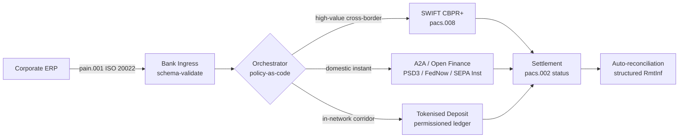

---

# Front Matter (YAML)

author: "contact@sebastienrousseau.com (Sebastien Rousseau)"
banner_alt: "Jirgin ruwa mai ɗauke da kwantena a wani tashar ruwa mai zurfi da safiya — alama ce ta motsi mai layi da yawa, na ƙetare iyaka na kuɗin kamfanoni a fadin ISO 20022, open finance, da hanyoyin tsabtacewa na tokenised-deposit a 2026"
banner_height: "1597"
banner_width: "2584"
banner: "https://cloudcdn.pro/stocks/images/viktor-forgacs-KxVRDiFdTVo.webp"
cdn: "https://cloudcdn.pro"
charset: "UTF-8"
cname: "sebastienrousseau.com"
copyright: "© Copyright 2025 - 2026 - Sebastien Rousseau. All rights reserved."
date: "June 24, 2026"
description: "Yadda ISO 20022, A2A, open finance a ƙarƙashin PSD3/FiDA, da tokenised deposits ke sake fasalin kuɗin kamfanoni na ƙetare iyaka tare da SWIFT a 2026."
format-detection: "telephone=no"
hreflang: "ha"
icon: "https://cloudcdn.pro/clients/sebastienrousseau/v1/logos/sebastienrousseau.svg"
id: "https://sebastienrousseau.com/2026-06-24-cross-border-iso-20022-open-finance-tokenised-deposits-treasury-2026"
image_alt: "Hoton Sebastien Rousseau a baki da fari"
image_height: "162"
image_width: "162"
image: "https://cloudcdn.pro/stocks/images/sebastienrousseau.webp"
keywords: "biya na ƙetare iyaka, ISO 20022, open finance, PSD3, FiDA, tokenised deposits, stablecoins, A2A, treasury, CIB, Nexi, Mastercard, layi da yawa, pacs.008, pain.001, SWIFT, FedNow, SEPA Instant, RTP, CBPR+"
language: "ha-NG"
last_reviewed: "2026-06-24"
layout: "report"
locale: "ha_NG"
logo_alt: "Tambarin Sebastien Rousseau"
logo_height: "44"
logo_width: "44"
logo: "https://cloudcdn.pro/clients/sebastienrousseau/v1/logos/sebastienrousseau.svg"
menu: ""
measurementID: "G-169G4ET5HQ"
name: "Sebastien Rousseau"
permalink: "https://sebastienrousseau.com/2026-06-24-cross-border-iso-20022-open-finance-tokenised-deposits-treasury-2026"
rating: "general"
referrer: "no-referrer"
robots: "index, follow"
schema: "FAQPage, Article"
seo_title: "Ƙetare Iyaka 2026: ISO 20022, Open Finance, Hanyoyin Tokenised"
short_name: "sebastienrousseau"
subtitle: "Kuɗin kamfanoni na ƙetare iyaka a 2026 yana aiki ne a kan tsarin layi da yawa — ISO 20022 a matsayin harshen gama gari, A2A da open finance a matsayin hanyar fuskantar abokin ciniki, tokenised deposits a matsayin layin tsabtacewa na babba, tare da SWIFT yana ci gaba da goyon bayan dogon wutsiya."
tags: "biya na ƙetare iyaka, ISO 20022, open finance, PSD3, FiDA, tokenised deposits, A2A, treasury, CIB, layi da yawa, pacs.008, pain.001, SWIFT, FedNow, SEPA Instant, RTP, CBPR+"
theme-color: "0, 83, 191"
title: "Ƙetare Iyaka 2026: ISO 20022, Open Finance da Tokenised Deposits a Kuɗin Kamfanoni"
url: "https://sebastienrousseau.com/2026-06-24-cross-border-iso-20022-open-finance-tokenised-deposits-treasury-2026"
viewport: "width=device-width, initial-scale=1, shrink-to-fit=no"

# RSS - The RSS feed front matter (YAML).
atom_link: "https://sebastienrousseau.com/2026-06-24-cross-border-iso-20022-open-finance-tokenised-deposits-treasury-2026/rss.xml"
category: "Technology"
docs: https://validator.w3.org/feed/docs/rss2.html
generator: "Static Site Generator (SSG) (version 0.0.26)"
item_description: "Yadda ISO 20022, A2A, open finance a ƙarƙashin PSD3/FiDA, da tokenised deposits ke sake fasalin kuɗin kamfanoni na ƙetare iyaka tare da SWIFT a 2026."
item_guid: "https://sebastienrousseau.com/2026-06-24-cross-border-iso-20022-open-finance-tokenised-deposits-treasury-2026/rss.xml"
item_link: "https://sebastienrousseau.com/2026-06-24-cross-border-iso-20022-open-finance-tokenised-deposits-treasury-2026/rss.xml"
item_pub_date: "Wed, 24 Jun 2026 07:07:07 +0000"
item_title: "Ƙetare Iyaka 2026: ISO 20022, Open Finance da Tokenised Deposits a Kuɗin Kamfanoni"
last_build_date: "Wed, 24 Jun 2026 06:06:06 +0000"
managing_editor: "contact@sebastienrousseau.com (Sebastien Rousseau)"
pub_date: "Wed, 24 Jun 2026 07:07:07 +0000"
ttl: "60"
type: "article"
webmaster: "contact@sebastienrousseau.com"

# Apple - The Apple front matter (YAML).
apple_mobile_web_app_orientations: "portrait"
apple_touch_icon_sizes: "192x192"
apple-mobile-web-app-capable: "yes"
apple-mobile-web-app-status-bar-inset: "black"
apple-mobile-web-app-status-bar-style: "black-translucent"
apple-mobile-web-app-title: "Ƙetare Iyaka 2026: ISO 20022, Open Finance, Hanyoyin Tokenised"
apple-touch-fullscreen: "yes"

# MS Application - The MS Application front matter (YAML).

msapplication-navbutton-color: "0, 83, 191"

# Twitter Card - The Twitter Card front matter (YAML).

twitter_card: "summary_large_image"
twitter_creator: "@wwdseb"
twitter_description: "Yadda ISO 20022, A2A, open finance a ƙarƙashin PSD3/FiDA, da tokenised deposits ke sake fasalin kuɗin kamfanoni na ƙetare iyaka tare da SWIFT a 2026."
twitter_image: "https://cloudcdn.pro/clients/sebastienrousseau/v1/logos/sebastienrousseau.svg"
twitter_image_alt: "Tambarin Sebastien Rousseau"
twitter_site: "@wwdseb"
twitter_title: "Ƙetare Iyaka 2026: ISO 20022, Open Finance, Hanyoyin Tokenised"
twitter_url: "https://sebastienrousseau.com/2026-06-24-cross-border-iso-20022-open-finance-tokenised-deposits-treasury-2026"

excerpt: "Kuɗin kamfanoni na ƙetare iyaka a 2026 matsalar injiniyanci ce ta layi da yawa. ISO 20022 shi ne harshen gama gari, A2A da open finance a ƙarƙashin PSD3/FiDA su ne hanyar fuskantar abokin ciniki, tokenised deposits suna ɗaukar layin tsabtacewa na babba, kuma SWIFT yana ci gaba da goyon bayan dogon wutsiya. Aikin mai ban sha'awa yana cikin laushin orchestration, ba a cikin samfurin ba."

# Humans.txt - The Humans.txt front matter (YAML).
author_website: "https://sebastienrousseau.com"
author_twitter: "@wwdseb"
author_location: "London, UK"
thanks: "Na gode da karatu!"
site_last_updated: "2026-06-24"
site_standards: "HTML5, CSS3, RSS, Atom, JSON, XML, YAML, Markdown, TOML"
site_components: "Kaishi, Kaishi Builder, Kaishi CLI, Kaishi Templates, Kaishi Themes"
site_software: "Static Site Generator, Rust"

---

# Ƙetare Iyaka 2026: ISO 20022, Open Finance da Tokenised Deposits a Kuɗin Kamfanoni

<!-- lead-start -->
<aside class="post-lead" aria-label="Taƙaitawar labari">

<strong>TL;DR.</strong> Kuɗin kamfanoni na ƙetare iyaka a 2026 yana aiki a kan layi huɗu a hannu ɗaya — SWIFT CBPR+, A2A nan take a ƙarƙashin PSD3/FiDA, tokenised deposits, da hanyoyin stablecoin — an haɗa su tare ta ISO 20022 a matsayin harshen gama gari. Aikin ƙungiyoyin CIB da na kuɗin kamfanoni shi ne orchestration, ba zaɓen layi ba.

<strong>Manyan abubuwan ɗauka</strong>

<ul class="post-lead-takeaways">
  <li><strong>Layi da yawa shi ne tsohon zaɓi.</strong> Babu wani layi ɗaya da ke tsabtace kowane corridor, kowane girman tikiti, kowane cut-off. Treasury yana zaɓen layi a kowace biya, ba a kowane banki ba.</li>
  <li><strong>ISO 20022 shi ne lingua franca.</strong> pacs.008, pacs.009 da pain.001 yanzu suna ɗaukar bayanan remittance a fadin RTGS, instant, A2A da hanyoyin tokenised-deposit — yana sa yanke shawarar routing ya dogara da bayanai maimakon a ƙulla da wani layi.</li>
  <li><strong>Open finance yana faɗaɗa iyaka.</strong> PSD3 da FiDA suna tura samfurin open-banking zuwa fansho, inshora da bayanan treasury; Nexi da Mastercard suna gina laushin orchestration da kamfanoni ke amfani da shi.</li>
  <li><strong>Tokenised deposits su ne layin babba.</strong> Tokenised deposits da banki suka bayar da kuma hanyoyin stablecoin masu haɗewa suna ƙarƙashin layin instant na fuskantar abokin ciniki kuma suna tsabtace layin babba kusan a T+0.</li>
</ul>

<strong>Karatu masu alaƙa:</strong> <a href="https://sebastienrousseau.com/2026-06-07-autonomous-treasury-index-programmable-liquidity-tokenised-deposits-2026">Fihirisar Treasury mai Cin Gashin Kai ta 2026: Liquidity da za a iya Tsara da Tokenised Deposits</a>, <a href="https://sebastienrousseau.com/2026-06-15-pacs008-automation-iso-20022-interbank-payments-2026">Aiwatar da pacs.008 ta Atomatik: Biyan Tsakanin Banki na ISO 20022 a 2026</a>.

</aside>
<!-- lead-end -->

> **Taƙaitaccen bayanin gudanarwa.** Kuɗin kamfanoni na ƙetare iyaka a 2026 matsalar injiniyanci ce ta layi da yawa kafin ta zama matsalar gudanar da dangantaka. PSD3 da ƙa'idar Financial Data Access (FiDA) suna faɗaɗa iyakar open-banking zuwa cikin bayanan treasury na kamfani; sauyawar SWIFT MT/MX na Nuwamba 2026 ta sa pacs.008 mai bin CBPR+ ya zama tsarin interbank na ƙetare iyaka tilo mai aiki; tokenised deposits da hanyoyin stablecoin masu tsari suna ɗaukar sashin tsabtacewa na babba kusan a T+0 cikin hanyoyin sadarwa masu izini. CIB da ke nasara a wannan zagayowar ba shi ne wanda ke zaɓen layi ɗaya ba; shi ne wanda ke injiniyancin laushin orchestration da ke ɗaure su. Wannan labarin ya bi gine-ginen layi huɗu (A2A ƙarƙashin PSD3, SWIFT CBPR+, tokenised deposits da banki suka bayar, stablecoins masu tsari) — abin da kowane layi ke yi da kyau, inda iyakokin fitowar credit ke faɗuwa, da abin da laushin orchestration na policy-as-code da ke saman su dole ne ya aiwatar saboda kamfanin ya ga biya ɗaya kuma mai sa ido ya ga tarihin audit ɗaya.

Wani kamfanin masana'antu na Turai yana biyan wani mai samar da kayayyaki na Brazil EUR 4.2 miliyan a safiyar Laraba. Workstation na treasury baya zaɓen banki. Yana zaɓen layi — jerin layi. Umurnin da ya fuskanci abokin ciniki yana saukowa a kan saƙon A2A pain.001 wanda aka turawa ta hanyar mai samar da open finance a ƙarƙashin PSD3. Banki yana turawa a fadin yankunan correspondent guda biyu a kan tokenised deposits a cikin hanyar sadarwa mai zaman kanta ta CIB. Dogon wutsiya — wani biyan USD 80,000 don tsaftacewa ga mai samar da kayayyaki na ƙasa wanda ba shi da alaƙar tokenised-deposit — har yanzu yana hawa SWIFT CBPR+ a matsayin pacs.008. Abokin ciniki yana ganin biya ɗaya. Gine-ginen yana ganin layi huɗu. ISO 20022 shi ne kawai dalilin da ya sa abubuwa suka haɗu.

Wannan shi ne tsarin aiki da Mastercard ke bayyana yayin da yake magana game da [juyin halittar daga open banking zuwa open finance](https://www.mastercard.com/us/en/news-and-trends/Insights/2026/open-banking-to-open-finance-the-evolution-of-financial-data.html "Mastercard: open banking to open finance, the evolution of financial data") — bayanai da biya sun haɗu zuwa laushin orchestration guda ɗaya, tare da tsarin yana zaɓen layi, ba abokin ciniki ba. Tambayar mai ban sha'awa ga manyan masu fasahar banki ba ita ce wane layi ke nasara ba. Yadda ake injiniyancin laushin orchestration, ake mulkinsa, kuma ake daidaita shi.

## 01. Daga katuna zuwa A2A — sauyin open finance

Hanyoyin katuna ba sa tafiya. Ana sake fasalinsu.

A duk shekarar 2025 har zuwa 2026, [PSD3 da ƙa'idar Financial Data Access (FiDA)](https://www.consultancy.uk/news/42202/orchestrating-open-banking-for-platform-growth-2026-outlook "Consultancy.uk: orchestrating open banking for platform growth, 2026 outlook") sun faɗaɗa wajibcin open-banking gaba da asusun biya zuwa fansho, jinginar gida, ajiya, inshora da bayanan treasury na kamfani. Ma'anar ga kuɗin kamfani kai tsaye ce: manajan dangantakar CIB yanzu yana iya cinye cikakken hoton liquidity na kamfani a fadin bankuna da yawa ta hanyar yarjejeniyar API guda ɗaya, akan umurnin kamfani.

Masu aiki biyu suna fitowa fili wajen gina laushin orchestration da kamfanoni za su cinye. Nexi ya faɗaɗa sahun acquiring nasa zuwa farawa A2A a fadin SEPA Instant da corridors na RTGS na pan-Turai, ISO 20022 native daga ƙarshe zuwa ƙarshe. Laushin open finance na Mastercard — wanda ya dogara da saye Aiia da Finicity — yana ba da laushin tara bayanai da yardar a ƙasa, tare da farawa biya yana fitowa ta hanyar tsarin API ɗaya da a baya ya yi hidima ga ikon katunan.

Sauyin yana da muhimmanci saboda dalilai uku:

1. **Tattalin arzikin sashe.** A2A da aka fara ƙarƙashin PSD3 yana cire interchange daga biyan. Don manyan tikiti na B2B, ceton yana da girma; don ƙananan tikiti na masu amfani, tsarin farashin ɗan kasuwa yana faɗuwa.
2. **Ingancin bayanai.** A2A a ƙarƙashin ISO 20022 yana ɗaukar bayanan remittance masu tsari da katuna ba za su iya ɗauka ba. Ƙimar daidaita kai tsaye sama da 95% yanzu wajibi ne.
3. **Samfurin haɗari.** A2A canja wurin credit ne, ba ikon katuna ba. Fuskar yaudara, samfurin chargeback, da samfurin jayayya duk sun bambanta. Ƙungiyoyin kuɗin kamfani suna buƙatar fahimtar cewa ana sake gina laushin kariyar abokin ciniki, ba a gada ba.

CIB da ke siyar da shirin layi da yawa a 2026 yana siyar da orchestration — ba shiga ba. Shiga yanzu yana ƙarƙashin doka.

## 02. ISO 20022 a matsayin lingua franca a fadin layi

Dalilin da ya sa layi da yawa zai iya aiki kwata-kwata shi ne tsarin saƙon yanzu yana daidaita a fadin layi.

Kwamitin BIS akan Tsarin Biya da Hanyar Sadarwa na Kasuwa (CPMI) ya yi shari'ar gine-gine a cikin [buƙatun haɗawar ISO 20022 don haɓaka biyan ƙetare iyaka](https://www.bis.org/cpmi/publ/d230.pdf "BIS CPMI: ISO 20022 harmonisation requirements for enhancing cross-border payments"). Sauyawar Nuwamba 2025 zuwa CBPR+ ta rufe zamanin MT103 / MT202 don saƙon interbank na ƙetare iyaka. Daga wannan lokaci, kowane babban layi — SWIFT, FedNow, SEPA Instant, RTP, da manyan tsarin biya nan take a Asiya da Latin Amurka — suna magana da harshen pacs.008 / pacs.009 / pain.001 guda ɗaya.

Sakamako mai amfani ga kuɗin kamfani:

- **Routing yana dogara da bayanai.** Workstation na treasury zai iya karanta pain.001 sau ɗaya kuma ya yanke shawarar layi a kowane biya bisa corridor, girman tikiti, cut-off, da alaƙar abokin huɗu — ba tare da sake taswirar saƙon ba.
- **Bayanan remittance suna tsira a tsalle.** Filayen remittance masu tsari (`<RmtInf><Strd>`) suna wucewa ta sassan correspondent ba tare da yankewa ba. Ƙimar daidaita kai tsaye tana tashi saboda an dakatar da ɓarnar bayanai a iyakar layi.
- **Binciken takunkumi ya zama mai iya audit.** Filayen `<Dbtr>` / `<Cdtr>` / `<DbtrAgt>` / `<CdtrAgt>` masu tsari tare da nassoshin LEI suna maye gurbin binciken sunan rubutu kyauta. Ƙimar buga tana faɗuwa. Layukan bincike suna ragewa.

Hoton da ke ƙasa yana bin pain.001 ɗaya ta hanyar ingress na banki, zuwa cikin orchestrator na policy-as-code, kuma zuwa ga duk wani layi da corridor da girman tikiti ke buƙata — saƙo ɗaya, layi da yawa, ba sake taswira ba.

Kuɗin daidaiton wannan shi ne horon injiniyanci. ISO 20022 yana ba da damar. Bankuna biyu na iya zama cikakke CBPR+ compliant kuma su samar da saƙonnin pacs.008 da suka bambanta a amfani da filaye, character set, da tsarin bayanan remittance. CIB da ke nasara akan ƙetare iyaka a 2026 yana aiwatar da bayanan saƙo mai tsanani fiye da yadda ma'aunin ke buƙata — kuma yana ƙin yarda akan parse, ba akan tsabtacewa ba.

## 03. Tokenised deposits da hanyoyin tabbatacce

Layin tsabtacewa na babba shi ne inda labarin layi ke zama mai ban sha'awa.

Hoton 2026, wanda aka kama da kyau a cikin [bincike na Trade Treasury Payments game da aiwatarwa ta atomatik, hanyoyin gaggawa, ISO 20022 da stablecoins](https://tradetreasurypayments.com/articles/automation-contingency-rails-iso-20022-and-stablecoins-the-2026-trends-reshaping-corporate-finance-and-b2b-payments "Trade Treasury Payments: automation, contingency rails, ISO 20022 and stablecoins, the 2026 trends reshaping corporate finance and B2B payments"), yana raba layin tsabtacewa na babba zuwa samfura biyu masu bambanci.

**Tokenised deposits da banki suka bayar.** Wani banki na kasuwanci yana bayar da nauyin tokenised akan ledger mai izini — JPM Coin, alamar ajiya ta HSBC mai alaƙa da Orion, ƙwararru CIB na Turai. Alamar da'awa ce kai tsaye akan banki mai bayarwa. Tsabtacewa kusan T+0 cikin hanyar sadarwa. Bin doka yana kan banki mai bayarwa. Layin yana cikakke ƙarƙashin doka, cikakke mai iya gano, kuma yana da iyaka ga mahalarta da mai bayarwa ya shigar.

**Hanyoyin stablecoin masu haɗewa.** Stablecoin mai tsari — wanda aka tabbatar da cikakke, aka audit, kuma yana aiki ƙarƙashin MiCA ko tsarin yanki makamancinsa — yana tsabtace corridor inda tokenised deposits da banki suka bayar har yanzu ba sa kai. Alamar da'awa ce akan reserve, ba akan ma'aunin banki ba. Ana raba bin doka tsakanin mai bayarwa, on-ramp, da off-ramp.

Samfura biyun ba sa gasa. Ana tara su. Samfurin ƙetare iyaka na CIB a 2026 yawanci yana amfani da tokenised deposits da banki suka bayar don sashin cikin hanyar sadarwa da stablecoin mai tsari don corridor inda layin cikin hanyar sadarwa ya ƙare. Kamfani yana ganin biyan ISO 20022 guda ɗaya. Labarin tsabtacewa a ƙasa yana da alamomi da yawa.

Tambayar matakin hukumar ɗaya ce da kwamitocin haɗarin aiki suka kasance suna yi tun na fari pilots na liquidity da za a iya tsara: wa ke ɗaukar fitowar credit akan alama, kuma har na tsawon yaushe? Tokenised deposits suna ba da amsa mai tsabta — banki mai bayarwa, har sai an ƙona. Hanyoyin stablecoin masu haɗewa suna ba da amsa mai sarƙaƙiya — reserve, ƙarƙashin zagayowar audit da garantin fansa. Ƙungiyar treasury da ba ta rubuta amsar a kowane layi a kowane corridor tana ɗaukar haɗarin credit da ba a auna ba akan ma'aunin ta.

## 04. Tarin treasury mai cin gashin kai

A saman laushin layi yana zama laushin orchestration. A saman laushin orchestration yana zama laushin wakili.

Na bayyana gine-ginen daki-daki a cikin [Fihirisar Treasury mai Cin Gashin Kai ta 2026: Liquidity da za a iya Tsara da Tokenised Deposits](https://sebastienrousseau.com/2026-06-07-autonomous-treasury-index-programmable-liquidity-tokenised-deposits-2026 "Sebastien Rousseau: The Autonomous Treasury Index 2026"). Sigar gajere: treasury na wakilai a 2026 shi ne laushin orchestration, wanda aka bayyana a matsayin policy-as-code, tare da wakilai masu iyaka da ke aiwatarwa a cikinta.

Tarin shi ne:

1. **Laushin layi.** SWIFT CBPR+, A2A nan take, tokenised deposits, stablecoins masu tsari. Kowane layi yana da bayanan da aka buga, teburin cut-off, lankwasa farashi, da samfurin gama-tsabtacewa.
2. **Laushin orchestration.** ISO 20022 a ciki, ISO 20022 a waje. Yanke shawarar layi a kowane biya bisa corridor, tikiti, cut-off, alaƙar abokin huɗu, da manufa. Manufa tana da version, sa hannu, kuma ana iya audit.
3. **Laushin wakili.** Wakilai masu iyaka na treasury suna aiwatar da manufar orchestration tare da iyakokin tool-call, audit logs, da kill switches. Wakili baya zaɓen layi. Manufa tana zaɓen layi. Wakili yana gudanar da manufa.
4. **Laushin daidaitawa.** Saƙonnin ISO 20022 pacs.008 / pacs.002 / camt.054 suna daidaita akan umurnin pain.001 na asali, tare da bayanan remittance masu tsari suna rufe madauki ba tare da shiga tsakani na hannu ba.

CIB da ke siyar da wannan tarin a 2026 yana siyar da abubuwa huɗu a hannu ɗaya — kuma yana sa farashinsu daban. Kamfanin da ke saye yana siyan zaɓi a fadin layi, tare da ma'aunin saƙo guda ɗaya, laushin manufa guda ɗaya, da feed na daidaitawa guda ɗaya. Wannan shi ne sauyin gine-gine. Sauran duk dalla-dalla ne na aiwatarwa.

## Tambayoyin da ake yawan yi

**Shin "open finance" kawai sake fasalin open banking ne?**
A'a. Open banking ƙarƙashin PSD2 ya rufe asusun biya. PSD3 da ƙa'idar Financial Data Access (FiDA) suna faɗaɗa wajibcin raba bayanai zuwa fansho, jinginar gida, ajiya, inshora, da bayanan treasury na kamfani. Ma'anar ga kuɗin kamfani kai tsaye ce: manajan dangantakar CIB yanzu yana iya cinye cikakken hoton liquidity na kamfani a fadin bankuna da yawa ta hanyar yarjejeniyar API guda ɗaya, akan umurnin kamfani, ba kawai tarihin asusun biya ba.

**Me ya sa laushin orchestration shi ne mayar da hankali na gine-gine, ba layi ba?**
Saboda layi yanzu sun zama na yau da kullum. SWIFT CBPR+ pacs.008, A2A ƙarƙashin PSD3, tokenised deposits, da stablecoins masu tsari duk suna ɗaukar harshen ISO 20022 guda ɗaya a matakin saƙo. Abin da ya bambanta CIB na 2026 shi ne injin policy-as-code da ke zaɓen layi a kowane biya bisa corridor, girman tikiti, buƙatun gama-tsabtacewa, da alaƙar abokin huɗu — kuma da ke rubuta zaɓin a cikin telemetry na audit da mai sa ido zai nema. Ba tare da wannan injin ba, layi da yawa kawai zaɓi ne ba tare da gudanarwa ba.

**Ina iyakar fitowar credit ke faɗuwa akan sashin tokenised-deposit?**
Tokenised deposits da banki suka bayar akan ledger mai izini da'awa kai tsaye ne akan banki mai bayarwa — fitowar credit tana ƙarewa a ƙona. Hanyoyin stablecoin masu tsari (MiCA-supervised a EU, tsarin takardar tattaunawa na Bankin Ingila a UK, makamantansu a sauran wurare) da'awa ne akan reserve, tare da taga fitowar ƙarƙashin zagayowar audit da sharuɗɗan garantin fansa. Ƙungiyar treasury da ba ta rubuta amsar a kowane layi a kowane corridor tana ɗaukar haɗarin credit da ba a auna ba akan ma'aunin ta.

**Me ke faruwa da SWIFT a wannan gine-ginen?**
SWIFT baya ɓacewa — yana goyon bayan dogon wutsiya. Corridors inda tokenised deposits da banki suka bayar har yanzu ba sa kai (yawancin alaƙar sub-supplier na kasuwannin masu tasowa, yawancin kwarara na ƙetare iyaka mai ƙarancin mita / ƙarancin tikiti), da corridors inda kamfani ko banki ke buƙatar tarihin audit na correspondent-banking na CBPR+, suna ci gaba akan SWIFT pacs.008. Gine-ginen 2026 shi ne "SWIFT + sabbin layi", ba "sabbin layi maimakon SWIFT" ba.

**Me kamfanin ke saye lokacin da ya sayi wannan tarin?**
Zaɓi a fadin layi, tare da ma'aunin saƙo guda ɗaya (ISO 20022), laushin manufa guda ɗaya (injin orchestration), da feed na daidaitawa guda ɗaya (matsayin pacs.002 + tabbatar da camt.054 + bayanan camt.053 masu tsari). Kamfani baya biyan haɗin layi huɗu daban. Yana biyan laushin orchestration da ke sa layi huɗu su yi aiki a matsayin ɗaya a aiki — da tarihin audit da ke ba shi damar amsa "wane layi ne wancan biyan EUR 4.2 m ya hau, kuma me ya sa?" safiyar bayan buƙatar mai sa ido ta gaba.

## Kammalawa

Kuɗin kamfanoni na ƙetare iyaka a 2026 matsalar injiniyanci ce ta layi da yawa. ISO 20022 shi ne harshen da ke sa layi da yawa ya zama mai amfani. PSD3 da FiDA suna faɗaɗa iyakar bayanai kuma suna tura open finance cikin tsarin aiki na kuɗin kamfani. Tokenised deposits da stablecoins masu tsari suna ɗaukar layin tsabtacewa na babba. SWIFT yana ci gaba da goyon bayan dogon wutsiya.

CIB da ke nasara shi ne wanda ke gina laushin orchestration — ba wanda ke zaɓen layi ɗaya kuma ya yi caca da hannun jarinsa a kansa ba. Ƙungiyar kuɗin kamfani da ke nasara ita ce wadda ke rubuta fitowar credit a kowane layi a kowane corridor, ke aiwatar da bayanan ISO 20022 mai tsanani fiye da yadda mai tsari ke buƙata, kuma ke kula da yanke shawarar layi a matsayin manufa, ba a matsayin yanke shawara a kowace biya ba.

Aikin mai ban sha'awa yana cikin laushin orchestration. Gina shi a hankali.

## Manazarta

Bank for International Settlements, Committee on Payments and Market Infrastructures (2023). *Harmonised ISO 20022 data requirements for enhancing cross-border payments* (CPMI Papers No. 230). Akwai a: [https://www.bis.org/cpmi/publ/d230.htm](https://www.bis.org/cpmi/publ/d230.htm "BIS CPMI 230 — Harmonised ISO 20022 data requirements")

Bank for International Settlements (2024). *Project Agorá: cross-border payments with tokenised commercial bank deposits and central bank money*. BIS Innovation Hub. Akwai a: [https://www.bis.org/about/bisih/topics/fmis/agora.htm](https://www.bis.org/about/bisih/topics/fmis/agora.htm "BIS Project Agorá")

Bank of England (2023). *Regulatory regime for systemic payment systems using stablecoins and related service providers — Discussion Paper*. Akwai a: [https://www.bankofengland.co.uk/paper/2023/dp/regulatory-regime-for-systemic-payment-systems-using-stablecoins-and-related-service-providers](https://www.bankofengland.co.uk/paper/2023/dp/regulatory-regime-for-systemic-payment-systems-using-stablecoins-and-related-service-providers "Bank of England — Regulatory regime for stablecoins discussion paper")

European Commission (2023). *Proposal for a Directive on payment services and electronic money services (PSD3)*. Akwai a: [https://finance.ec.europa.eu/regulation-and-supervision/financial-services-legislation/implementing-and-delegated-acts/payment-services-directive_en](https://finance.ec.europa.eu/regulation-and-supervision/financial-services-legislation/implementing-and-delegated-acts/payment-services-directive_en "European Commission — Payment Services Directive proposal")

European Parliament and Council (2023). *Regulation (EU) 2023/1114 on markets in crypto-assets (MiCA)*. Akwai a: [https://eur-lex.europa.eu/eli/reg/2023/1114/oj](https://eur-lex.europa.eu/eli/reg/2023/1114/oj "Regulation (EU) 2023/1114 — Markets in Crypto-Assets (MiCA)")

Financial Action Task Force (2023). *International standards on combating money laundering and the financing of terrorism — Recommendation 16 on wire transfers*. Akwai a: [https://www.fatf-gafi.org/en/publications/Fatfrecommendations/Fatf-recommendations.html](https://www.fatf-gafi.org/en/publications/Fatfrecommendations/Fatf-recommendations.html "FATF Recommendations")

International Organization for Standardization (2020). *ISO 17442 Financial services — Legal entity identifier (LEI)*. Akwai a: [https://www.gleif.org/en/about-lei/iso-17442-the-lei-code-structure](https://www.gleif.org/en/about-lei/iso-17442-the-lei-code-structure "ISO 17442 — Legal Entity Identifier")

SWIFT (2024). *Cross-Border Payments and Reporting Plus (CBPR+) usage guidelines*. Akwai a: [https://www.swift.com/standards/iso-20022/iso-20022-programme](https://www.swift.com/standards/iso-20022/iso-20022-programme "SWIFT CBPR+ usage guidelines")

<!-- enrich-start -->
<aside class="author-card" aria-label="Game da marubucin"><strong class="author-card-name"><a href="/about/index.html">Sebastien Rousseau</a></strong>Babban masanin fasahar banki da ke rubutu game da amfani da AI, ƙaurar ISO 20022, cryptography na post-quantum don ayyukan kuɗi, da sauyin tsarin biyan kuɗi na babba.Sama da shekaru 20 a fadin HSBC Commercial &amp; Investment Bank, PayPal, Barclays, Shazam, AKQA, Virgin Group. <a href="/about/index.html">Cikakken bayanin martaba</a> &middot; <a href="https://www.linkedin.com/in/sebastienrousseau/" rel="external noopener">LinkedIn</a> &middot; <a href="https://github.com/sebastienrousseau" rel="external noopener">GitHub</a></aside>

An sake duba ƙarshe <time datetime="2026-06-24">2026-06-24</time>.

<!-- enrich-end -->
