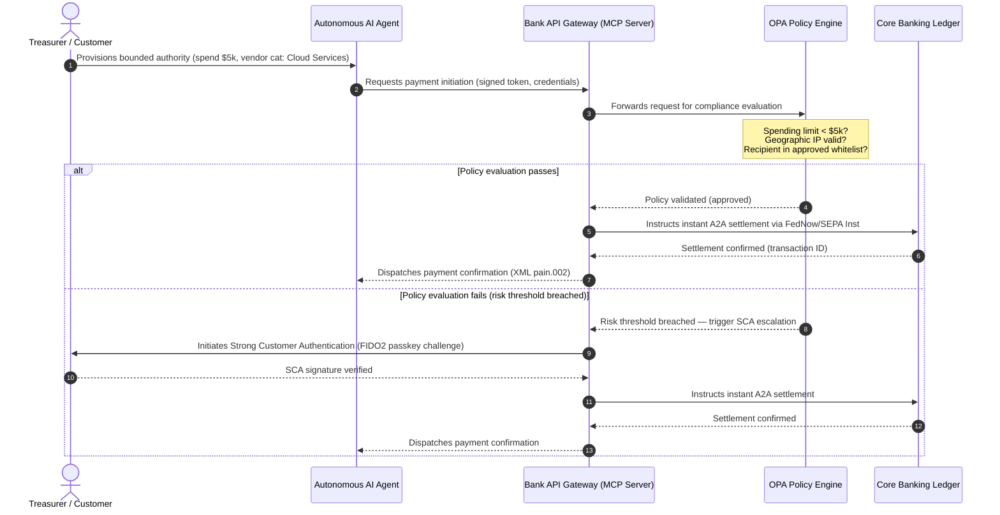

# Hangen Biyan Kuɗi na Duniya na 2026: Tsarin Aiki, Haɗari, da Kuɗin Shiga a Duniya Mai Agentic, Marar Ganuwa, da Lokaci-Real

Zagayowar biyan kuɗi na duniya na 2026 yana bayyana ta hanyar runduna uku da ke haɗuwa — agentic commerce, embedded payments marasa ganuwa, da aiwatarwa na lokaci-real — suna a saman tokenised unified ledger a ƙarƙashin Project Agorá da cut-over mai tsanani na structured-address na SWIFT na Nuwamba 2026.

<!-- lead-start -->
<aside class="post-lead" aria-label="Taƙaitaccen labari">

<strong>TL;DR.</strong> Yanayin biyan kuɗi na 2026 ya wuce daga ƙaura na messaging zuwa tsarin aiki mai dama da yawa inda haɗari da kuɗin shiga ke ƙayyade ta hanyar aiwatarwa na lokaci-real. Wannan rubutu yana haɗa hangen na J.P. Morgan, Global Payments, HSBC, da Payments Association na 2026 zuwa tsarin aiki na G-SIB mai ginshiƙai huɗu, wanda ya ƙunshi agentic commerce da model ke fara, treasury APIs masu aiki koyaushe, tokenised unified ledgers a ƙarƙashin BIS Project Agorá, da wa'adin structured-address na SWIFT da SEPA na 14/15 Nuwamba 2026 (Swift CBPR+: 14 Nuwamba 2026; littattafan EPC SEPA: 15 Nuwamba 2026).

<strong>Manyan abubuwan da za a ɗauka</strong>

<ul class="post-lead-takeaways">
  <li><strong>Agentic commerce yana buɗe iyaka na delegated-liability.</strong> Ana hasashen autonomous AI agents za su shiga tsakanin commerce na shekara-shekara kuɗi tiriliyan $3-$5 har zuwa 2030. Banki dole ne su bayyana MCP gatekeeping, wakilcin SCA a ƙarƙashin PSD3/PSR, da mallakar KYC/AML a cikin sarƙoƙin biyan kuɗi na multi-agent.</li>
  <li><strong>Liquidity mai aiki koyaushe yanzu ita ce ginshiƙin aiki da na tsari.</strong> Treasury APIs na 24/7 da virtual accounts suna rage trapped cash kuma suna ɗaga matakin juriya. Don APIs na ma'ajiyar lokaci-real masu muhimmanci na tsarin, samuwar five-nines (99.999 %) ya zama burin injiniyanci na ciki da bankuna ke gindaya wa kansu domin nuna ƙarfin matakin DORA ga masu kulawa. DORA da kanta ba ta tsara madaidaicin matakin five-nines na duniya ba; tana rufe sarrafa haɗarin ICT, bayar da rahoton aukuwa, gwajin ƙarfi, haɗarin ɓangare na uku, da kulawa kan masu samar da ICT masu muhimmanci.</li>
  <li><strong>Tokenisation ta kammala karatu zuwa unified ledgers da aka tsara.</strong> Project Agorá ita ce mafi girman tsarin public-private don tokenised commercial bank deposits da ajiyar babban banki. Banki suna buƙatar tafiya ta tokenisation matakai biyar, tare da bayyananniyar bi da prudential.</li>
  <li><strong>Cut-over na structured-address na 14/15 Nuwamba 2026 yana da kwanan wata mai tsanani.</strong> Swift CBPR+ za ta cire toshe `<AdrLine>` mara tsari daga 14 Nuwamba 2026; littattafan EPC SEPA suna ba da damar adireshin da ba shi da tsari kawai har zuwa 15 Nuwamba 2026. Duka biyu suna jawo ƙin yarda bayan cut-over. Ana buƙatar tsabtataccen mulkin data a cikin ƙungiyoyin samfur, fasaha, da bin doka.</li>
</ul>

<strong>Karatun da ya shafi wannan:</strong> <a href="https://sebastienrousseau.com/2026-06-23-iso-20022-pain001-programmable-liquidity-autonomic-treasury-2026">Daga Pain.001 zuwa Programmable Liquidity: ISO 20022 a Matsayin Tsarin Jijiya na Autonomic na Treasury a 2026</a>, <a href="https://sebastienrousseau.com/2026-06-24-cross-border-iso-20022-open-finance-tokenised-deposits-treasury-2026">Cross-Border 2026: ISO 20022, Open Finance da Tokenised Deposits a Corporate Treasury</a>, <a href="https://sebastienrousseau.com/2026-06-25-quantum-dawn-cib-kyberlib-quantum-resilient-payments-stack-2026">Quantum Dawn don CIB: Daga KyberLib zuwa Quantum-Resilient Payments Stack</a>.

</aside>
<!-- lead-end -->

Ga global transaction banks, zagayowar 2026-2028 taga ce ta tsari. Modern payment infrastructure ba ya kasance kayan aikin gudanarwa kawai — ita ce ginshiƙin dabarun fasaha na bank-grade. A cikin G-SIBs da manyan cibiyoyin yanki, fasaha, tsari, da fatan abokin ciniki sun haɗu zuwa filin aiki ɗaya.

Runduna uku suna bayyana wannan zagayowar, kuma kowanne yana taswira kai tsaye zuwa damuwar executive-suite.

- **Agentic commerce** — rabon channel, ƙirar samfur, sanya alhakin, da Model Risk Management a ƙarƙashin binciken kulawa.
- **Biyan kuɗi marasa ganuwa** — gogewar abokin ciniki, tare da haɗarin disintermediation inda banki suka kasa shigar da ledger ɗinsu cikin corporate da merchant front-ends.
- **Aiwatarwa na lokaci-real** — saurin jari, tare da sauyi mai sakamako ga liquidity management, credit risk, operational resilience, da fraud defense.

Hadarin kuɗi yana da gaske. Fraud yana fadada cikin sauri da ƙwarewa; wa'adin tsari yana da tsanani; kuma banki da suka zamanantar da core systems ɗinsu da gaba-gaba suna buɗe damar fee-revenue masu yawa. Tsada na rashin aiki shine kishiyar: ƙin yarda nan take, koshi na aiki, hukunci na tsari, da gushewar kasuwa cikin sauri.

## Tsanin tabbas — abin da yake da kwanan wata, abin da ake tsara wa, abin da ake hasashe

Ba kowane sashe na wannan rahoto ke ɗauke da matakin tabbas iri ɗaya ba. Tambayar matakin hukuma ita ce wane bambance-bambance ne kwanan wata, wane su ne tsammanin masu kulawa, kuma wane su ne har yanzu hasashe na kasuwa — domin amsar tana canza tattaunawar kasafin kuɗi.

| Rukuni | Misalai |
| --- | --- |
| **Kwanakin da ba a sassautawa** | Swift CBPR+ structured-address cut-over (14 Nuwamba 2026); littattafan EPC SEPA (15 Nuwamba 2026) |
| **Wajibcin tsari** | DORA ICT risk + gwajin ƙarfi + kulawa kan ɓangare na uku (EU); wakilcin SCA a ƙarƙashin PSD3/PSR; MRM a ƙarƙashin SR 11-7 + PRA SS1/23 |
| **Sauye-sauyen kasuwa masu yiwuwa sosai** | Treasury APIs na lokaci-real, kariyar fraud da AI ke jagoranta, liquidity na tushen API, deepfake-driven biometric fraud |
| **Zaɓuɓɓuka na dabaru** | Tokenised deposits, unified ledgers a ƙarƙashin Project Agorá, corridors na agentic-commerce, continuous FX (Wire 365) |
| **Hasashe** | `$3-$5 trillion` na agentic-commerce flows na shekara-shekara har zuwa 2030 (McKinsey baseline) |

A ɗauki layuka biyu na sama a matsayin gaskiyar bin doka da ke jawo layin kasafin kuɗi ko ba a kama wani amfani na sama ba. A ɗauki layuka biyu na ƙasa a matsayin zaɓuɓɓuka na dabaru — masu tabbas a jagora, amma inda lokacin aiwatarwa zaɓi ne na hukuma maimakon shigarwa a kalandar mai kulawa.

## Haɗuwar hukumomin biyan kuɗi na duniya

Wannan rahoto yana haɗa hangen biyan kuɗi da commerce na 2026 daga manyan muryoyi huɗu na masana'antu — [J.P. Morgan Payments](https://www.jpmorgan.com/payments/newsroom/payments-outlook-2026-trends-report-released "J.P. Morgan Payments — Outlook 2026"), [Global Payments](https://investors.globalpayments.com/news-events/press-releases/detail/497/global-payments-releases-its-2026-commerce-and-payment "Global Payments — 2026 Commerce and Payment Trends Report"), HSBC, da The Payments Association — sannan yana auna su a kan [G20 Roadmap for Enhancing Cross-Border Payments](https://www.fsb.org/2026/03/fsb-kicks-off-new-implementation-phase-to-enhance-cross-border-payments-through-public-private-partnership/ "FSB — cross-border payments implementation phase, March 2026").

Kowace ƙungiya tana kusantar yanayin daga wani kusurwar kasuwa daban, amma binciken nasu yana haɗuwa kan invariants uku.

1. **Rails na nan take, masu jagorancin API sune ginshiƙi.** Tsarin legacy batch-processing ana saka su a gefe don cross-border da high-value flows; saurin transaction a waɗannan ɓangarorin yana ƙayyade ta hanyar messaging na lokaci-real, mai aiki koyaushe.
2. **AI duka barazana ne kuma kariya.** Generative tools da deepfakes suna fadada fraud na transaction, suna buƙatar lokaci-real, multi-layered machine-learning counter-defenses.
3. **Tokenisation ita ce kayan aikin shirye don samarwa.** Ledgers suna haɗuwa don ɗaukar tokenised commercial liabilities da wholesale central bank digital currencies.

| Rahoto | Babban masu sauraro | Mai da hankali | Babban ginshiƙi | Tasiri ga banki |
| --- | --- | --- | --- | --- |
| **J.P. Morgan Payments** | Corporate treasurers, G-SIBs | Liquidity na lokaci-real, fraud | APIs, AI biometrics | Sake gina liquidity, FX, da risk systems don ci gaba da settlement na kwanaki 365. |
| **Global Payments** | Merchants, e-commerce | Juyin halittar POS, omnichannel | Agentic commerce, frictionless checkout | Gina corridors masu aminci, API-gated na biyan kuɗin merchant don autonomous AI agents. |
| **HSBC Insights** | Multinational corporates | Haɗewar ERP (SAP/Oracle), cash na lokaci-real | Treasury-as-a-Service, cash visibility | Sanya kuɗi a kan transactional API suites kuma shigar da real-time cash ledger reporting a tushe. |
| **The Payments Association** | Fintechs, payment institutions | Stablecoins, tokenisation, dokokin duniya | Regulated digital assets, bin doka | Shirya balance sheets don tokenised deposits da kewaya tsarin alhaki na PSD3/PSR. |

Hangen huɗu suna bayyana operating stack na bangaren masu zaman kansu wanda ke gudana a saman kayan aikin manufofin G20 na bangaren jama'a, suna fassara niyyar manufa zuwa shawarwari madaidaiciya kan liquidity, tokenisation, data, da fraud control a cikin banki.

## Ginshiƙi 1 — Agentic commerce da biyan kuɗi marasa ganuwa

Agentic commerce shine canjin daga human-driven, click-to-buy checkout zuwa autonomous, model-driven transaction initiation. Hasashen masana'antu yana haɗuwa kan kuɗi tiriliyan $3-$5 na commerce na shekara-shekara da autonomous agents ke shiga tsakani har zuwa 2030 — kaso na ƙananan lambobi guda na duka biyan kuɗi na duniya da aka aiwatar ba tare da mutum ya danna 'sayi' ba.

Tsarin retail da kasuwanci yana da rata mai dacewa. Mafi yawan masu sayayya yanzu suna sa rai near-frictionless payments, amma ƙasa da rabin merchants sun ba da fifiko ga one-click checkout ko API-accessible product catalogues. AI agents ba za su iya zagaya legacy multi-page checkout screens da aka tsara wa idanun mutane ba; suna buƙatar structured, machine-to-machine API handshakes.

### Manyan fifikon banki da tasirin aiki

- **Mallakar KYC da AML.** Banki dole ne su bayyana wanda ke riƙe da wajibin bin doka a cikin sarƙar agentic transaction. Idan personal AI agent na mai sayayya ya fara transaction ta hanyar merchant's agentic checkout, banki dole ne su tabbatar cewa originating delegated authority an ɗaure shi cryptographically zuwa primary account holder.
- **Sake ƙirar alhaki da chargeback.** Card schemes da A2A rails an tsara su a kewaye human authorisation. Lokacin da AI agent ya yi kuskuren saye — yana sayen kayan masana'antu marasa daidai saboda data-parsing error, alal misali — banki dole ne su raba alhakin a fili tsakanin mai sayayya, mai bayar da agent, da merchant.
- **Risk-rating agentic flows.** Injin tafiyar da biyan kuɗi dole ne ya yi risk-rate agentic payments cikin haɓaka, yana amfani da buƙatun ajiyar ƙari ko interchange rates ga transactions waɗanda ba mutum ya fara ba har sai an sami stable settlement track record.

### Bounded action da bounded authority

Don rage "unbounded action" — enterprise procurement agent yana gudanar da infinite recursive purchase loop saboda software glitch — banki dole ne su tura **bounded-authority API gates**. Ƙofofin suna tabbatar da iyakoki na matakin policy a kan dama uku.

1. **Tiered financial limits** — kashe kuɗin agent an iyakance ta girman transaction, ƙimar tarawa ta yau da kullum, da merchant category.
2. **Context-aware safeguards** — siginan na biyu (lokacin rana, IP geolocation, yawan transaction) ana kimanta su kafin ledger ya saki kuɗi.
3. **Human-in-the-loop escalation** — ana buƙatar human authorisation da Strong Customer Authentication (SCA) ke jawowa a ƙarƙashin PSD3 / PSR a duk lokacin da transaction ya wuce risk thresholds.

Mermaid sequence a ƙasa yana nuna target architecture wanda banki da yawa za su gane a matsayin bounded-authority agentic payment flow.

### The Model Context Protocol (MCP)

Don haɗa localised AI models zuwa bank-governed execution layers, masana'antu suna daidaitawa kewaye da [Model Context Protocol (MCP)](https://modelcontextprotocol.io "Model Context Protocol — open standard for LLM tool integration") — open protocol wanda ke barin LLMs su kira tools da APIs masu bayyananne, masu sa ido ba tare da raw access ga core systems ba.

Lulluɓe banking APIs (payment initiation, balance enquiry, party verification) a cikin MCP server yana kiyaye LLMs daga database tables da system-root controls. Model yana hulɗa da ledger kawai ta hanyar structured, audited, rate-limited endpoints — tsaro ana tabbatarwa a kan iyaka na agentic tool execution maimakon ɓoye a cikin model.

## Ginshiƙi 2 — Sauye-sauyen treasury da sake tsara liquidity

Saurin transaction banking a 2026 an saita ta sauyi daga end-of-day batch processing zuwa always-on, real-time treasury operations. Multinational corporates ba sa ƙara haƙuri da trapped cash — liquidity da ke zaune zaman kashe wando a local accounts a karshen mako ko ranakun bukukuwa saboda settlement systems sun rufe.

### Hujjar tattalin arziki don liquidity na lokaci-real

J.P. Morgan da HSBC duka suna ba da rahoton cewa corporates da advanced real-time cash da data capabilities sun fi yiwuwa su zarce takwarorinsu cikin haɓakar kuɗin shiga da ingancin jari, musamman ta hanyar rage trapped liquidity da inganta zagayowar working-capital.

Don kama wancan ƙimar, banki suna tura **Treasury-as-a-Service (TaaS) API products** waɗanda ke barin corporate ERPs (SAP, Oracle) su haɗu kai tsaye da bank's ledger.

- **Real-time balance APIs** ta amfani da `camt.052` schema — yana maye gurbin file-transfer protocols da instant, event-driven cash-position reporting.
- **Bulk payment initiation APIs** ta amfani da `pain.001` — direct, straight-through aiwatarwar batches na biyan kuɗin vendor daga ERP ledger.
- **Continuous FX APIs** — injin treasury suna kulle real-time, algorithmic foreign-exchange rates don cross-border settlement, suna kawar da overnight market-gap risk.
- **Virtual account APIs** — corporates suna haɓaka da yin ritaya dubban sub-accounts cikin haɓaka don automated receivables matching da ledger separation.

### Operational resilience da DORA

Bayar da liquidity mai aiki koyaushe yana canza risk profile na banki. Don APIs na ma'ajiyar lokaci-real masu muhimmanci na tsarin, samuwar five-nines (99.999 %) ya zama burin injiniyanci na ciki da bankuna ke gindaya wa kansu domin nuna ƙarfin matakin DORA ga masu kulawa. DORA da kanta ba ta tsara madaidaicin matakin five-nines na duniya ba; tana rufe sarrafa haɗarin ICT, bayar da rahoton aukuwa, gwajin ƙarfi, haɗarin ɓangare na uku, da kulawa kan masu samar da ICT masu muhimmanci.

A ƙarƙashin [Digital Operational Resilience Act (DORA)](https://eur-lex.europa.eu/legal-content/EN/TXT/?uri=CELEX%3A32022R2554 "Regulation (EU) 2022/2554 — Digital Operational Resilience Act"), wancan ba KPI na IT ba ne — buƙatu ne mai tsanani na tsari. Masu kula da tsari suna sa ran banki za su tabbatar cewa real-time treasury API surface da ledger database za su iya ɗaukar cyberattacks masu tsanani-amma-mai yiwuwa, network outages, da hyperscaler disruptions ba tare da katse manyan biyan kuɗi ko lalata systemic liquidity ba. Wancan yana buƙatar geo-redundant, active-active multi-cloud database architectures, real-time threat-detection layers, da automated failover — bayyane a layin tsadar canji, ba kawai a dossier na audit ba.

### Continuous FX da sabuwar fasaha cross-border

Real-time treasury ba zai iya rayuwa a cikin iyakar kuɗi guda ba. G-SIBs suna tura continuous FX infrastructure — platform [Wire 365](https://www.jpmorgan.com/insights/payments/fx-cross-border/wire-365-global-clearing "J.P. Morgan — Wire 365 global clearing reinvented") na J.P. Morgan yana sarrafa cross-border payments da FX conversions kowace rana ta shekara, fiye da awannin RTGS na central-bank na gargajiya. Wancan layer yana haɗa kai tsaye da tokenised-deposit da unified-ledger systems da aka tattauna a Ginshiƙi 3.

## Ginshiƙi 3 — Tokenised deposits da unified ledger

Tokenisation ta kammala karatu daga keɓance proof-of-concept pilots zuwa scaled, bank-grade monetary infrastructure. An canza mai da hankali daga private stablecoins da speculative cryptoassets zuwa **tokenised commercial bank deposits** da **wholesale central bank digital currencies (wCBDCs)** masu gudana a kan programmable unified ledgers.

Tsarin tunani shine [Project Agorá](https://www.bis.org/about/bisih/topics/fmis/agora.htm "BIS Project Agorá — tokenisation of wholesale cross-border payments") — babban haɗin gwiwa na public-private wanda BIS da IIF suka taru, ya ƙunshi bankunan tsakiya takwas da fiye da private financial institutions 40 (bisa shafin BIS Agorá, an sabunta a 27 Mayu 2026). Aikin yana bincikar yadda tokenised commercial bank deposits ke haɗuwa da tokenised wholesale CBDCs a kan shared programmable ledger don kawar da cross-border settlement friction, daidaita binciken bin doka, da ba da damar 24/7 atomic finality.

### Tafiya ta matakai biyar ta tokenisation

Ga G-SIBs da manyan banki na yanki, tokenisation tafiya ce ta mataki-mataki daga internal optimisation zuwa open-market interoperability.

1. **Internal treasury liquidity** — tokenising ma'aunin cash na corporate na ciki (misali JPM Coin ko private bank ledgers masu daidai) don ba da damar nan take, 24/7 cross-border transfer da netting a cikin rassan banki na kansa.
2. **Bounded multi-bank corridors** — closed, regulated consortia (Project Agorá sandbox) don gwada interbank settlement da shared ledger state a cikin distinct institutions.
3. **Continuous programmable FX** — smart contracts a kan unified ledger suna aiwatar da instant Payment-versus-Payment (PvP) FX, suna kawar da settlement risk a cikin yankunan lokaci.
4. **Tokenised real-world assets (RWAs)** — tokenised cash leg yana haɗuwa da tokenised securities, debt, ko trade ledgers don instant Delivery-versus-Payment (DvP) finality, yana rage capital lock-up daga kwanaki zuwa milliseconds.
5. **Regulated public/hybrid interoperability** — secure gateway wrappers suna barin institutional liquidity ya hulɗa da aminci da open public networks.

### Tasirin prudential da balance-sheet

Tokenised cash dole ne a kewaya shi ta hanyar prudential frameworks da hankali. Masu kula suna jaddada cewa tokenised deposit dole ne ya zama daidai a tattalin arziki da traditional commercial bank deposit — wanda ke nufin unsecured liability a balance sheet na banki tare da daidai deposit-insurance coverage.

A aiki, tokenised deposits suna gabatar da haɗari waɗanda ba a gina classical liquidity stress models su simulate ba. Smart contracts suna aiwatar da programmable withdrawals a saurin da ƙarar da legacy assumptions ba sa kama. A ƙarƙashin Basel III, banki dole ne su tabbatar da risk engine zai iya yin model na programmable cash run-offs kuma cewa tokenised ledger yana interoperate a tsabta tare da legacy RTGS systems ta zagayowar daily liquidity.

### Stablecoins da tokenised deposits — matsayi mai zurfi

Private fully-reserved stablecoins (USDC, da sauransu) suna ci gaba da kama hannun jari a retail cross-border remittance da decentralised commerce, amma sun rasa credit-creation capacity da settlement finality na commercial banking system.

Maimakon yin gasa kan retail rails, transaction banks suna kafa custody, suna fitar da nasu regulated tokenised liability instruments, kuma suna gina secure on-/off-ramp gateways. Corporate clients suna samun programming flexibility yayin da suke kiyaye jari a cikin regulated perimeter.

### Tambayoyin da hukumar ta kamata ta yi game da tokenised money

- **Sa hannu a unified ledger.** Menene roadmap dabarunmu na aiki don sa hannu a wholesale public-private unified-ledger initiatives kamar Project Agorá?
- **Balance sheet da risk modelling.** Shin risk engines da capital-adequacy frameworks ɗinmu sun sabunta stress-testing don bayyana saurin smart-contract-triggered token run-offs?
- **Ɓangarorin abokin ciniki na farko.** Wadanne daga cikin ɓangarorin abokin ciniki na corporate-treasury da commercial-banking za su amfana nan da nan daga programmable, tokenised DvP/PvP settlement?

## Ginshiƙi 4 — Structured data da fraud defense

Bin doka na kayan aiki a 2026 ta mamaye ta **structured-address cut-over na 14/15 Nuwamba 2026** — kwanaki biyu kusa da juna waɗanda tare suke rufe hanyar adireshin da ba shi da tsari a kan rails na cross-border da na cikin EU. A ƙarƙashin [SWIFT Standards Release (SR) 2026](https://www.swift.com/standards/iso-20022/removal-unstructured-address "SWIFT — Removal of unstructured address, November 2026"), CBPR+ za ta daina karɓar tubalan `<AdrLine>` marasa tsari gabaɗaya daga **14 Nuwamba 2026**. A ƙarƙashin littattafan EPC SEPA na 2025, ana ba da damar adireshin da ba shi da tsari kawai har zuwa **15 Nuwamba 2026**. Bayan cut-overs ɗin, duk saƙon cross-border ko na cikin gida da ke ɗauke da unstructured address inda ake tsammanin structured elements za a jinkirta ko ƙin yarda ta network.

Yawancin cibiyoyi sun san kwanan wata. Da yawa suna kallon shi a matsayin atisaye mai sauƙi na taswira a layer na interface. Hakikanin shine zurfin ƙalubalen data-quality da data-governance. Don guje wa rates na ƙin yarda na masifa, payment operations suna buƙatar tsayayyen tsarin mulki na cross-functional.

- **Samfur da aiki.** Kama data a tushe. Customer-facing digital portals, onboarding interfaces, da corporate ERP input fields dole ne su tilasta structured address fields (`<StrtNm>`, `<PstCd>`, `<TwnNm>`, `<Ctry>`) a maƙallin payment initiation.
- **Fasaha.** Parsing, taswira, schema validation. Validation engines suna toshe legacy files kafin su buga SWIFT interface. Locally-deployed machine-learning models suna parse legacy unstructured address blocks zuwa XML-compliant tags a ƙarƙashin `<PstlAdr>`.
- **Bin doka da haɗari.** Sanctions screening, transaction monitoring, da AML logic an sabunta don ɗauka structured XML fields — yana rage rates na false-positive da binciken da ake yi da hannu.

### Hujjar kasuwanci don structured data

Idan an kalle shi a matsayin tsadar bin doka, structured-data programme yana da tsada. Idan an kalle shi a matsayin mai ba da damar kuɗin shiga, yana biyan kansa.

1. **Advanced credit decisioning.** Structured invoice, remittance, da ultimate-debtor data yana barin banki su gina automated, precise working-capital financing da supply-chain invoice-factoring programmes don corporate clients.
2. **Automated receivables matching.** Bayyana structured party da invoice identifiers yana goyan bayan premium cash-reconciliation da virtual-account pooling products, yana samar da sabon kuɗin shiga na transaction-fee.
3. **Monetisable transaction analytics.** Banki suna shirya da siyar da granular real-time liquidity da purchasing-pattern analytics dashboards ga corporate CFOs da treasurers.

### Layered AI fraud defense

Yayin da saurin transaction ke hanzarta zuwa lokaci-real, dabarun fraud sun fadada. [Rahoton Lalata Tantance Mutum 2026 na Entrust](https://www.entrust.com/resources/reports/identity-fraud-report "Entrust 2026 Identity Fraud Report") ya sanya deepfakes a matsayin **ɗaya cikin biyar na ƙoƙarin lalata biometric**; binciken Entrust na baya ya sanya deepfakes musamman a **40 % na ƙoƙarin lalata biometric na bidiyo**. A kowane fasalin, synthetic media yanzu hanya ce mai muhimmanci ta kayar da voice da facial-recognition controls a onboarding da payment flows.

Kariya ita ce **three-layer AI fraud model**.

1. **Identity layer.** Biometrically verified [FIDO2](https://fidoalliance.org/fido2/ "FIDO Alliance — FIDO2 specification") passkeys, cryptographically signed hardware device-binding, da decentralised digital ID wallets don tsaron damar biyan kuɗi.
2. **Behavioural layer.** Continuous behavioural biometrics — saurin session navigation, ƙimar buga taɓi, alkiblar na'urar — don gano automated bot execution ko ƙoƙarin session-hijack.
3. **Transaction layer.** Filayen structured na ISO 20022 suna ciyar da real-time machine-learning risk engines, suna nazarin metadata na transaction tare da shared network-level consortium intelligence don gano transactions masu zargi a cikin milliseconds na fara.

Don gamsar da masu kula, transaction-layer AI models suna ƙunshe da tsayayyen **explainability parameters** kuma suna aiki a ƙarƙashin programme na musamman na Model Risk Management (MRM). Masu kula suna sa ran banki za su yi bayanin takamaiman bayanan data da algorithmic logic da suka jawo automated block ko fraud alert, daidai da [US Federal Reserve SR 11-7](https://www.federalreserve.gov/frrs/guidance/supervisory-guidance-on-model-risk-management.htm "US Federal Reserve — Supervisory Guidance on Model Risk Management, SR 11-7") da [PRA SS1/23](https://www.bankofengland.co.uk/prudential-regulation/publication/2023/may/model-risk-management-principles-for-banks-ss "Bank of England PRA SS1/23 — Model Risk Management principles for banks") na Bank of England.

## Ajenda na shawarwarin hukumar 2026-2028

Don aiwatar a cikin ginshiƙai huɗu, hukumomin gudanarwa na G-SIB da banki na yanki ya kamata su tsara saka hannun jari na aiki da fasaha tare da bayyananne three-horizon roadmap.

### Horizon 1 — Bin doka nan take da ƙarfafa core (watanni 0-12)

- **Mai da hankali.** Daidaita ingancin data na ISO 20022 da tabbatar da hanyoyin transaction na lokaci-real na asali.
- **Mai nuna nasara (KPI).** Sifili ƙin yarda na unstructured-address a SWIFT da SEPA bayan cut-overs na 14/15 Nuwamba 2026.
- **Mai mallakar zartarwa.** Chief Operating Officer / Shugaban Payment Operations.
- **Nau'in mai isar da.** No-regrets move. Sabuntar core database schema da SWIFT SR 2026 validation engine.

### Horizon 2 — Automation da agentic safeguards (watanni 12-24)

- **Mai da hankali.** Bounded agentic API gates da ci gaba da fraud-defense architecture.
- **Mai nuna nasara (KPI).** 100% na machine-to-machine da AI-initiated API transactions an tabbatar ta hanyar FIDO2 hardware binding da bounded-authority policy engines.
- **Mai mallakar zartarwa.** Chief Information Officer / Chief Risk Officer.
- **Nau'in mai isar da.** No-regrets move (fraud defense) tare da strategic option (agentic commerce). Tafiyar MCP da three-layer fraud AI.

### Horizon 3 — Platform tokenisation da unified ledgers (watanni 24-36)

- **Mai da hankali.** Canza treasury assets zuwa tokenised deposits kuma sa hannu a shared cross-border ledgers.
- **Mai nuna nasara (KPI).** Aƙalla 15% na high-value corporate treasury settlement volume an sarrafa shi a zahiri ta hanyar tokenised deposit instruments ko unified-ledger arrangements (misali corridors na Project Agorá).
- **Mai mallakar zartarwa.** Group Treasurer / Shugaban Transaction Banking.
- **Nau'in mai isar da.** Strategic option. Programmable ledger infrastructure, smart-contract liquidity rules, DvP/PvP settlement adapters.

## Abin yi safiyar Litinin — jerin abubuwa shida ga bankuna

Roadmap na horizons uku shi ne shirin zagayowar. Jerin da ke ƙasa shi ne abin da CIO, COO, ko Shugaban Transaction Banking zai iya samu a tebur kafin ƙarshen mako mai zuwa, ba tare da la'akari da yadda sauran shirin ya girma ba.

1. **Yi ƙididdigar bayyanar adireshi mara tsari** ta hanyar tashar tasha da nau'in saƙo. Kowace hanyar file na legacy, kowace API endpoint na legacy, kowace ERP na corporate da har yanzu ke fitar da `<AdrLine>` mai 'yanci. Sakamako: ƙidaya, mai mallaka, da kwanan watan gyara ga kowace tushe.
2. **Kafa rabe-raben haɗarin agentic-payment.** Sanya hanyoyin da ba mutum ya fara ba ta hanyar hanyar farawa (consumer agent, merchant agent, corporate procurement agent), nau'in counterparty, da rail. Sakamako: rabe-rabe na shafi guda da tikitin routing-engine.
3. **Bayyana iyakokin manufofi na delegated-authority don biyan kuɗin da AI ya fara.** Iyakoki masu matakai ta girman tikiti, rukunin merchant, yanki. Sakamako: tsarin manufofi-a-matsayin-code wanda OPA engine zai iya aiwatarwa.
4. **Tsara APIs na ma'ajiyar masu muhimmanci ga DORA da dogaro kan ɓangare na uku.** Wadanne APIs ne ke a cikin jerin scenarios masu tsanani amma masu yiwuwa; wadanne ɓangare na uku suka dogara da su; wadanne kwangiloli sun riga sun cika DORA Article 28. Sakamako: layi a cikin rajistar critical-ICT-third-party ga kowane API.
5. **Gano amfani biyu na tokenised-deposit tare da ƙimar ma'ajiya mai aunawa.** Netting na cikin gida tsakanin rassan banki da corridor guda mai kusa da Project Agorá su ne biyu na farko masu yiwuwa. Sakamako: case na kasuwanci da aka ƙididdige ga kowanne, tare da mai mallaka da kwanan wata na yanke shawara na kwanaki 90.
6. **Ƙirƙira tsarin sarrafa haɗarin ƙirar don fraud da agentic decisioning.** Tsara kowane samfurin ML a cikin hanyoyin fraud da agentic-payment zuwa tsammanin SR 11-7 / PRA SS1/23: maƙasudi da aka rubuta, asalin data, bayyanawa, sa ido, hanyar tsallakawa. Sakamako: matrix na sarrafa MRM na shafi guda ga kowane samfuri.

Manufar jerin ba ita ce wani abu daga cikinsa sabo ba ne. Manufar ita ce karami yana iya farawa wannan makon, mai sa ido yana iya bibiyarsa a kwamiti na zartarwa mai zuwa, kuma yana daidaita tare da ginshiƙai huɗu domin ayyukan farko su ciyar da shirin maimakon yin gasa da shi.

## FAQ

**Shin agentic commerce za ta isa kuɗi tiriliyan $3-$5 da gaske har zuwa 2030?**
McKinsey baseline yana nuni zuwa kuɗi tiriliyan $5 cikin agentic commerce sales har zuwa 2030, tare da kewayon hasashe masu zaman kansu suna haɗuwa tsakanin kuɗi tiriliyan $3 da kuɗi tiriliyan $5. Bambancin yana bayyana yadda merchants ke tura machine-readable checkout APIs cikin tsanani da kuma yadda banki ke barin agents su yi transact a ƙarƙashin wakilcin SCA cikin sauri — bottleneck na kan banki da merchant ne, ba na agent capability ba.

**Shin cut-overs na 14/15 Nuwamba 2026 suna shafar domestic SEPA flows ma?**
Eh. Buƙatun structured-address suna shafar CBPR+ cross-border da SEPA payment messages. Banki da ke gudanar da rails biyu suna buƙatar canonical address schema guda ɗaya upstream na SWIFT interface, ba taswira biyu masu daidaitawa ba.

**Shin tokenised deposit iri ɗaya ne da stablecoin?**
A'a. Tokenised deposit unsecured liability ne a kan balance sheet na regulated bank, tare da daidai deposit-insurance coverage kamar traditional deposit. Stablecoin yawanci kayan aiki ne na fully-reserved da non-bank ke fitarwa, ba tare da credit-creation capacity ba. Ƙirar Project Agorá tana ɗauka cewa tokenised deposits suna zama tare da wholesale CBDCs a kan shared programmable ledger; stablecoins ba sa fitowa a wholesale settlement leg.

**Yaya Project Agorá ke alaƙa da wCBDC pilots da ake ciki?**
Agorá ita ce tsarin haɗawa. National wCBDC experiments suna rufe central-bank-money leg; Agorá yana kawo tokenised commercial deposits zuwa daidai programmable ledger don cross-border settlement ya zama atomic a cikin nau'ikan kuɗi biyu. Bankunan tsakiya takwas da ke shiga da private institutions 40+ sun sa ta zama mafi girman public-private design ground don wholesale tokenised money architecture.

**Menene mafi ƙarancin matsayin bin doka na DORA don TaaS API?**
Geo-redundant active-active deployment, tare da rubuce-rubucen cyber scenarios masu tsanani-amma-mai yiwuwa tare da masu mallakar suna a ƙarƙashin SM&CR (UK), da kuma testin failover wanda ba ya katse muhimman biyan kuɗi. Ba tare da wancan ba, TaaS product alhakin tsari ne kafin ya zama layin kuɗin shiga.

## Manazarta

- Bank for International Settlements (BIS) Innovation Hub. (2026). *Project Agorá: exploring tokenisation of wholesale cross-border payments*. [BIS Project Agorá](https://www.bis.org/about/bisih/topics/fmis/agora.htm).
- Deutsche Bank. (2026). *Digital Money: a perspective on stablecoins, tokenised deposits and CBDCs*. [Deutsche Bank Flow](https://flow.db.com/publications/flow-white-papers-and-guides/digital-money-a-perspective-on-stablecoins-tokenised-deposits-and-cbdcs).
- European Parliament and Council. (2022). *Regulation (EU) 2022/2554 on Digital Operational Resilience (DORA)*. [DORA Regulation](https://eur-lex.europa.eu/legal-content/EN/TXT/?uri=CELEX%3A32022R2554).
- Financial Stability Board. (2026). *FSB kicks off new implementation phase to enhance cross-border payments*. [FSB statement](https://www.fsb.org/2026/03/fsb-kicks-off-new-implementation-phase-to-enhance-cross-border-payments-through-public-private-partnership/).
- Global Payments. (2025). *2026 Commerce and Payment Trends Report — press release*. [Global Payments press release](https://investors.globalpayments.com/news-events/press-releases/detail/497/global-payments-releases-its-2026-commerce-and-payment).
- J.P. Morgan Payments. (2026). *Payments Outlook 2026 Trends Report Released*. [J.P. Morgan Newsroom](https://www.jpmorgan.com/payments/newsroom/payments-outlook-2026-trends-report-released).
- J.P. Morgan Insights. (2026). *5 Payment Trends to Watch for in 2026*. [J.P. Morgan Trends](https://www.jpmorgan.com/insights/payments/trends-innovation/five-payment-trends-in-2026).
- J.P. Morgan FX & Cross-Border. (2026). *Wire 365: Global Clearing Reinvented*. [J.P. Morgan FX Wire 365](https://www.jpmorgan.com/insights/payments/fx-cross-border/wire-365-global-clearing).
- SWIFT. (2026). *ISO 20022 milestone for November 2026: unstructured addresses to be removed*. [SWIFT ISO 20022 Milestone](https://www.swift.com/news-events/news/iso-20022-milestone-november-2026-unstructured-addresses-be-removed).
- SWIFT Standards. (2026). *Removal of unstructured address*. [SWIFT Standards](https://www.swift.com/standards/iso-20022/removal-unstructured-address).
- Bank of England. (2023). *Supervisory Statement (SS1/23) — Model Risk Management principles for banks*. [Bank of England PRA SS1/23](https://www.bankofengland.co.uk/prudential-regulation/publication/2023/may/model-risk-management-principles-for-banks-ss).
- US Federal Reserve. (2011). *Supervisory Guidance on Model Risk Management (SR 11-7)*. [SR 11-7](https://www.federalreserve.gov/frrs/guidance/supervisory-guidance-on-model-risk-management.htm).
- McKinsey & Company. (2025). *McKinsey forecast: $5 trillion in agentic commerce sales by 2030* (via Digital Commerce 360). [McKinsey agentic forecast](https://www.digitalcommerce360.com/2025/10/20/mckinsey-forecast-5-trillion-agentic-commerce-sales-2030/).
- HSBC Business. (2026). *HSBC Business Insights*. [HSBC Insights](https://www.business.hsbc.com/en-gb/insights).
- Bright Defense. (2026). *Deepfake Statistics: A Growing Security Concern*. [Deepfake fraud statistics](https://www.brightdefense.com/resources/deepfake-statistics/).
- European Banking Authority. (2019). *Guidelines on outsourcing arrangements (EBA/GL/2019/02)*. [EBA Outsourcing Guidelines](https://www.eba.europa.eu/regulation-and-policy/internal-governance/guidelines-on-outsourcing-arrangements).

<!-- enrich-start -->
<aside class="author-card" aria-label="Game da marubucin"><strong class="author-card-name"><a href="/about/index.html">Sebastien Rousseau</a></strong>Babban masanin fasahar banki wanda ke rubutu kan applied AI, ƙaurar ISO 20022, post-quantum cryptography don ayyukan kuɗi, da sauye-sauyen tsari na wholesale payments.Fiye da shekaru 20 a HSBC Commercial &amp; Investment Bank, PayPal, Barclays, Shazam, AKQA, Virgin Group. <a href="/about/index.html">Cikakken bayanin martaba</a> &middot; <a href="https://www.linkedin.com/in/sebastienrousseau/" rel="external noopener">LinkedIn</a> &middot; <a href="https://github.com/sebastienrousseau" rel="external noopener">GitHub</a></aside>

An sake duba ƙarshe <time datetime="2026-06-25">2026-06-25</time>.

<!-- enrich-end -->
