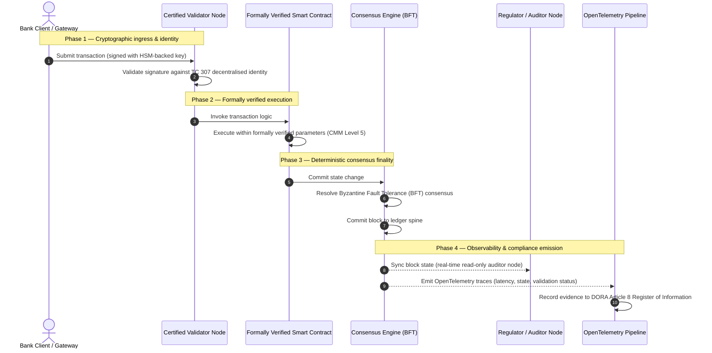

# Daga hujja zuwa gaskiya: dalilin da ya sa sarƙoƙin bulokci masu takardar shaida za su fassara sabon zamani na amincewar banki

## Taƙaitaccen dabaru (mafi muhimmanci)

Bankin jomla da mu'amaloli na duniya a shekarar 2026 suna a wani mahimmin lokaci na sauyi na tarihi. Yayin da ayyukan kuɗi ke sauya zuwa cibiyoyin sadarwa na tsaftacewa na dijital na asali kuma na lokaci-lokaci, kuma yayin da basirar wucin gadi ke shigar da rashin tabbas na yiyuwa, tsofaffin samfuran tabbaci na baya-baya (kamar bincike-bincike na tsaye da suka danganci hukuma) ba sa ƙara biyan buƙatun zamani na sarrafa haɗari da wajibai na amana.

Kwamitin Fasaha na ISO/IEC TC 307 ya kafa tushe da aka daidaita don fasahohin littafi mai rarrabuwa. Duk da haka, ainihin karɓuwa na hukumomi yana buƙatar sauyawa daga jagoranci na kwatanci zuwa tabbaci na sarƙar bulokci na umarni wanda ake iya ba da takardar shaida kai tsaye. Ta hanyar ba da maki ga shugabancin littafi, mutuncin yarjejeniya, tsaron kwangilar wayo, da saurin sirri a kan wani tsayayyen Samfurin Balaga na Iyawa (CMM) mai matakai biyar, bankuna za su iya sauyawa daga zato masu tarwatsewa da suka keɓanci mai kaya zuwa gaskiyar kuɗi da ake iya ba da takardar shaida kuma hukumar gudanarwa ke iya bincika.

## Muhimman abubuwa

* **Gibin gogayya na amana**: a yau muna iya ba da takardar shaida ga banki (Basel III), giza-gizai (ISO 27001), da tsarin shugabancin AI (ISO 42001), amma har yanzu ba za mu iya ba da takardar shaida ga littafi mai rarrabuwa da ke ƙara tantance abin da ke gaskiya ba. Wannan rashin daidaito babbar rauni ce ta aiki.  
* **DORA na tilasta alhakin amana kai tsaye**: a ƙarƙashin Mataki na 5 na DORA, hukumomin darektocin banki suna ɗaukar alhakin mutum kai tsaye da ba za a iya wakilta ba game da juriya ta aiki na duk tura na ɓangare na uku da littafi, tare da hukunce-hukunce masu tsauri na mutum a ƙarƙashin tsarin SM&CR game da gazawa.  
* **Ƙashin bayan bincike na AI**: inda koyon na'ura ke samar da sakamako na yiyuwa da ba za a iya sake haifar da su ba, sarƙar bulokci mai takardar shaida na ba da ɗaukar yanayi na tabbatacce. Rubuta nau'ikan samfuri, shigarwa, da yanke shawara na tabbatarwa a kan sarƙa yana biyan ISO 42001 da ka'idojin sarrafa haɗarin samfuri.  
* **Ma'aunin Sarƙoƙin Bulokci Masu Takardar Shaida**: wannan ma'auni yana tsara shugabanci, yarjejeniya, kwangilolin wayo, da lura zuwa katin maki da ake iya tabbatarwa kuma a shirye don bincike a kan sikelin CMM daga 0 zuwa 5, yana fassara ma'aunan injiniya zuwa bayanan sha'awar haɗari da hukumar gudanarwa ta amince.

## 01. Gibin gogayya na amana a bankin dijital

A bankin gargajiya, amincewa tana da alaƙa, ta hukumomi, kuma ta baya-baya. Tana dogara ga masu bincike na ɓangare na uku masu zaman kansu da ke duba yanayin kuɗi a kan tabbatattun lokuta, suna daidaita bambance-bambance tsakanin ɗakunan littattafai na ɓangarori biyu. A cikin kasuwannin lokaci-lokaci da API ke tuƙi na 2026, wannan samfurin yana shigar da jinkiri masu hanawa da haɗari na tsari.

Lokacin da mu'amaloli suka daidaita nan take, ana sarrafa tafkunan ruwan kuɗi na cikin rana ta hanyar ƙofofin API, kuma ana ba da alama ga mallakar dukiya a kan littattafai da aka raba, bincike-bincike na baya-baya suna zama ayyukan bincike na laifi maimakon sarrafawa na kariya. Masu amana ba za su ƙara dogara kawai ga ba da takardar shaida ga hukumar doka ba. Dole ne su ba da takardar shaida ga tushen dijital da kansa.

A halin yanzu, bankuna suna aiki a ƙarƙashin bayyananniyar rashin daidaito na gine-gine:

1. **Kayan aiki na giza-gizai mai takardar shaida**: ana tabbatar da kumburan kayan aiki, kwantena masu kama-da-wane, da cibiyoyin bayanai na zahiri a kan sarrafawa na ISO/IEC 27001 da SOC 2 Type II.  
2. **Hanyoyin sarrafawa masu takardar shaida**: ana gudanar da manufofin haɗari na aiki, tsare-tsare na ci gaba da kasuwanci, da tura na algorithm ta hanyar tsarin haɗari masu tsauri.  
3. **Injunan littafi marasa takardar shaida**: ana barin hanyoyin yarjejeniya na rarrabuwa, sarƙoƙin samar da kumburan tabbatarwa, iyakokin kwangilar wayo, da samfuran shugabancin cibiyar sadarwa ga zato marasa takardar shaida, na keɓe, ko na ƙungiya.

Wannan rashin daidaito muhimmin wurin gazawa ne. Banki na iya gudanar da aikace-aikace da aka tabbatar a cikin kwantena na giza-gizai mai tsaro, mai takardar shaida na ISO 27001, amma idan wannan kwantena ta rubuta zuwa littafi mai rarrabuwa mai sarrafawa na tsakiya na masu tabbatarwa, ma'aunan yarjejeniya masu rauni, ko kwangilolin wayo marasa bincike, mutuncin mu'amala ya lalace. Don haɗa wannan gibi, dole ne injin littafi da kansa ya zama abu na tabbaci da ake iya ba da takardar shaida.

## 02. Tushen daidaitawa na ISO/IEC TC 307

Aikin tushe da ake buƙata don daidaita littattafai masu rarrabuwa ana kafa shi ta Kwamitin Fasaha na ISO/IEC TC 307 (Fasahohin sarƙar bulokci da littafi mai rarrabuwa). Maimakon ɗaukar sarƙar bulokci a matsayin ka'idar fasaha da aka keɓe, TC 307 na kusanto shi a matsayin kayan aiki na amincewa na hukumomi, yana tsara aikinsa a kan manyan ginshiƙai biyar:

1. **Rabe-raben iri da ƙamus (ISO 22739)**: yana kafa suna gama gari, yana tabbatar da ma'anoni na doka da na aiki masu daidaituwa tsakanin hukunce-hukunce, tsare-tsaren kuɗi, da cibiyoyi.  
2. **Gine-ginen tunani (ISO/TR 23245)**: yana bayyana iyakoki, sassa, kwararar bayanai, da abubuwan aiki na tsarin littafi mai rarrabuwa da ya dace.  
3. **Tsaro, sirri, da kwangilolin wayo (ISO/TR 23244 / ISO 23613)**: yana kafa jagororin tsaro na asali don tsarin dukiya na dijital kuma yana bayyana mafi kyawun ayyuka don rage raunin kwangilar wayo da shugabancin zagayowar rayuwa.  
4. **Tsarin haɗin kai**: yana magance hanyoyin musanya bayanai da dukiya tsakanin cibiyoyin sadarwa na littattafai iri-iri, yana hana samuwar ɗakunan alama da aka keɓe.  
5. **Shaida mai rarrabuwa da abin ɗaure na amincewa**: yana haɗa masu gano sirri da suka danganci littafi da kayan aiki na maɓalli na jama'a (PKI) na yau da kullum da rajistun da ƙasa ta ba da izini.

Gaba ɗaya, TC 307 na nuna sauyin DLT daga zaɓi na injiniya na keɓe zuwa horo na gine-gine da aka daidaita. Duk da haka, TC 307 ya kasance mafi yawa na kwatanci. Yana bayyana yadda kyawawan aiki suke kama (jagoranci), amma bai ba da ka'idar tabbatarwa ta umarni (tabbaci) ba wadda jami'an haɗari da masu kula ke buƙata don ba da izinin tura na samarwa na muhimman ayyuka ko masu muhimmanci (CIF).

## 03. Jagoranci da tabbaci: bambancin amana

Mahalarta kasuwar kuɗi ba sa tura fasaha domin ta kasance sabuwa ko kyakkyawa; suna tura ta lokacin da za a iya sarrafa ta, bincika ta, kāre ta, da daidaita ta da buƙatun ajiyar jari. Shi ya sa daidaitawa a bankin a zahiri ya rabu zuwa sassa biyu:

* **Jagoranci (tsarin)**: yana zayyana mafi kyawun ayyuka, manufofin tunani, da jagororin gine-gine (misali ISO/IEC TC 307, tsarin NIST).  
* **Tabbaci (hujja)**: yana ba da shaida mai zaman kanta, mai ci gaba, kuma da ɓangare na uku ke iya tabbatarwa cewa an aiwatar da tsarin kuma yana aiki kamar yadda aka tsara (misali takardar shaida na ISO 27001, bincike-bincike na SOC 2, jarrabawa na tsari).

Dogaro ga yarjejeniya na littafi marar takardar shaida yayin ba da takardar shaida ga kayan aiki na giza-gizai gibin tsari ne mai muhimmanci. Sarƙar bulokci "marar canzawa" ba dole ba ce "abin dogaro ta hukumomi". Rashin canzawa yana tabbatar da cewa bayanan da aka shigar sun kasance ba tare da canzawa ba kawai; ba ya tabbatar da ko kumburan tabbatarwa suna da tsaro, ko ka'idar yarjejeniya na da juriya ga haɗin gwiwa, ko dabaru na kwangilar wayo daidai ne a lissafi, ko sarrafa maɓallin sirri yana bin umarni na bayan-ƙima.

Don rufe wannan gibi, Ma'aunin Sarƙoƙin Bulokci Masu Takardar Shaida na 2026 yana tsara waɗannan buƙatu zuwa Samfurin Balaga na Iyawa (CMM) da ake iya aunawa, wanda aka danganta ga ƙa'idodin banki na duniya.

## 04. Ma'aunin Sarƙoƙin Bulokci Masu Takardar Shaida na 2026

Don ba da damar babbar manaja su tantance kuma su ba da takardar shaida ga dandamalin littafi nasu, wannan ma'auni yana tsara kayan aiki na littafi mai rarrabuwa zuwa sassa biyar na aiki da ake iya bincika, waɗanda ake ba da maki a kan sikelin CMM daga 0 zuwa 5.

## Tebur 1: gine-ginen Ma'aunin Sarƙoƙin Bulokci Masu Takardar Shaida

| Sashen ma'auni | Matakin balaga (CMM) | Ma'aunin fasaha da na aiki | Tunanin sarrafawa na tsari / amana |
| ---- | ---- | ---- | ---- |
| **Shugabancin littafi** | **Mataki 0**: ƙungiya ta lokaci**Mataki 3**: bincike da juyawa na masu tabbatarwa ta atomatik**Mataki 5**: ɗaure shaida ta sirri mai rarrabuwa, na ɓangarori da yawa | % na kumburan tabbatarwa da hukumomin kuɗi da aka bincika ke gudanarwa; matsakaicin lokacin warware jayayya na masu tabbatarwa; rarraba wurin kumbura | **DORA Mataki 5** (Shugabanci da ƙungiya); **CPMI-IOSCO PFMI Ƙa'ida 2** (Shugabanci) da **Ƙa'ida 3** (Tsarin sarrafa haɗari mai cikakke) |
| **Mutuncin yarjejeniya** | **Mataki 0**: kumbura ɗaya ko PoW mara haske**Mataki 3**: BFT da aka bincika mai ƙarshe na tabbatacce**Mataki 5**: yarjejeniya ta hukunce-hukunce da yawa, da aka tabbatar a hukumance, mai sa ido na jinkiri mai ci gaba | matsakaicin jinkirin yarjejeniya da za a iya jurewa; ƙofar juriya ga haɗin gwiwa; SLA na samuwa a raba kumbura da aka kwaikwaya | **DORA Mataki 6** (Tsarin sarrafa haɗarin ICT); **CPMI-IOSCO PFMI Ƙa'ida 8** (Ƙarshen sasantawa) |
| **Shaida da sirri** | **Mataki 0**: maɓallan RSA / ECDSA masu rauni**Mataki 3**: sa hannu da yawa mai sarrafa maɓalli da HSM ke tallafawa**Mataki 5**: maɓallan gauraye masu tsaro na ƙima (FIPS 203 ML-KEM) da ƙofofin sirri na sifili-ilimi | % na mu'amaloli na littafi da aka sa hannu da maɓallan da HSM ke tallafawa; makin shirye-shiryen ƙaura na PQC; jinkirin hujja na ZK | **NIST FIPS 203 / 204**; **ISO/IEC 27001** (Sarrafa tsaron bayanai) |
| **Tabbacin kwangilar wayo** | **Mataki 0**: rubutun Solidity marasa bincike**Mataki 3**: tabbatarwa ta atomatik na mai tarawa da bincike na waje**Mataki 5**: kwangilolin wayo marasa canzawa, da aka tabbatar a hukumance, masu haɓaka na irin mai yanke wutar lantarki | % na kwangilolin wayo masu tabbatarwa na lissafi a hukumance; adadin gargaɗi na mai tarawa; ɗaukar bincike na rauni | **Jagororin EBA game da fitar da aiki** (sakin layi 81, 113-117); **DORA Mataki 30** (Ƙananan sharuɗɗa na kwangila) |
| **Bincike da lura** | **Mataki 0**: tattara log da hannu**Mataki 3**: alamun OTel masu tsari da kumburan mai bincike na karantawa kawai**Mataki 5**: daidaitawa ta atomatik, mai ci gaba da rajistar Mataki 8 | % na mu'amaloli da alamun OpenTelemetry suka rufe; jinkiri daga aikata block zuwa daidaita kumburan mai bincike | **BCBS 239** (Tara bayanan haɗari); **DORA Mataki 8** (Rajistar bayanai / tsarin ITS) |

## Tebur 2: muhimman siginonin amincewa da aka danganta ga ƙa'idodin banki na duniya

| Sigina / ma'auni | Ma'auni | Tasiri a kan dandamalin banki | Tushen tsari |
| ---- | ---- | ---- | ---- |
| **Ci gaban ISO/IEC TC 307** | Sauyawa daga rahotannin fasaha na ISO/TR zuwa tsare-tsaren takardar shaida na hukumance | Yana kafa tsari na farko da aka daidaita don ba da takardar shaida ga injunan littafi mai rarrabuwa | **ISO/IEC JTC 1 / SC 44** (Fasahohin littafi mai rarrabuwa) |
| **Matakin samfuri na Aikin Agorá** | Bankuna na kasuwanci sama da 40 masu shiga; gwajin littafi guda ɗaya na ajiya masu alama | Yana kaura tsaftacewa na kan iyaka daga aikawa saƙo (SWIFT) zuwa sasantawa mai alama na atomatik | **Cibiyar Ƙirƙira ta Bankin Sasantawa na Duniya (BIS)** |
| **Bincike na ɓangare na uku na DORA Mataki 30** | An bincika kashi 100% na masu ba da kumbura da masu masaukin kayan aiki a kan ma'aunan tsaro | Yana kawar da "kumburan tabbatarwa na inuwa"; yana wajabta cikakken bayyanannen sarƙar samarwa | **Hukumomin Kula na Turai (ESA)** |
| **ISO/IEC 42001 (shugabancin AI)** | An sanya log na samfuri da horarwa na AI marasa canzawa ta sirri a kan sarƙa | Yana amfani da sarƙar bulokci a matsayin rajistar hujja marar canzawa ("ƙashin bayan bincike") don koyon na'ura | **ISO/IEC 42001:2023** (Fasahar bayanai — Basirar wucin gadi) |
| **Isasshen jari na Basel III** | Rage matashin jari na haɗarin aiki bisa rage rikitarwa da aka rubuta | Tsarin haɗari na aiki da aka daidaita suna ba da lada kai tsaye ga juriya na littafi da aka tabbatar | **Kwamitin Basel na Kula da Banki (BCBS)** |

## 05. "Ƙashin bayan bincike" na AI: basira ta yiyuwa a kan kayan aiki na tabbatacce

Ɗaya daga cikin manyan ayyuka na dabaru na sarƙar bulokci mai takardar shaida a 2026 shine aiki a matsayin **"ƙashin bayan bincike"** don tura na basirar wucin gadi. Tsarin kuɗi na zamani na ƙara zama na yiyuwa. Ba da maki na bashi, gano zamba na lokaci-lokaci, ciniki na algorithm, da mu'amaloli na abokin ciniki masu cin gashin kai suna gudana ta samfuran koyon na'ura da ke tasowa, kaucewa, da daidaituwa a kan lokaci. Waɗannan samfura ba tabbatattu ba ne: da shigarwa iri ɗaya a lokuta biyu daban-daban, za su iya samar da fitarwa daban-daban saboda nauyi masu motsi da horarwa mai ci gaba.

Wannan rashin tabbaci yana kawo babban ƙalubale na shugabanci a ƙarƙashin **ISO/IEC 42001 (shugabancin AI)** da ma'aunan sarrafa haɗarin samfuri (MRM) (kamar **SR 11-7 na Babban Bankin Amurka** da **SS1/23 na PRA na Biritaniya**): *yaya za ka bincika, bayyana, da kāre yanke shawara da ba za a iya sake haifar da su ba daidai?*

Littafi mai rarrabuwa mai takardar shaida yana ba da ma'auni na tabbatacce. Inda samfuran AI ke aiki na yiyuwa, sarƙar bulokci mai takardar shaida na rubuta ma'aunansu na tabbatacce, yana kafa ƙashin bayan hujja marar canzawa:

* **Nau'in samfuri da ɗaure nauyi**: kowane nau'in samfuri da aka tura, nauyinsa masu alaƙa, da adadin dubawa na bayanan horarwa ana yin hash kuma ana rubuta su zuwa littafi a lokacin ginawa, suna biyan buƙatun sarƙar samarwa na **SLSA Level 3**.  
* **Rubuta shigarwa na yanayi**: lokacin da samfurin AI ke aiwatar da yanke shawara mai muhimmanci (misali amincewa da rance ko yiwa mu'amala alama), ana rubuta ainihin shigarwa na yanayi da hash na samfuri zuwa littafi, yana ƙirƙirar tarihi mai juriya ga gyara.  
* **Iya bincike ba tare da damar shiga lambar ba**: idan mai kula ya tambaya "me ya sa samfurinku ya ƙi wannan buƙatar bashi a ranar 3 ga Yuni?", banki ba ya buƙatar bayyana lambar mallakarsa ko yunƙurin sake ƙirƙirar ainihin yanayin samfuri. Yana gabatar da rikodin da aka sa hannu ta sirri a kan sarƙa na shigarwa, nauyi, da yanayin tabbatarwa.

Ta hanyar ɗaure yanke shawara na yiyuwa na samfuran koyon na'ura zuwa yarjejeniya ta tabbatacce na sarƙar bulokci mai takardar shaida, cibiyar tana ƙirƙirar lokacin ayyuka na atomatik da za a iya kāre, sake ginawa, da tabbatarwa da kansa.

## 06. Nuna madaidaicin bututun tabbatarwa daga yarjejeniya zuwa bincike

Zanen jerin da ke gaba yana nuna zagayowar rayuwar mu'amala da ke ratsa dandamalin sarƙar bulokci mai takardar shaida, yana nuna yadda ƙofofin tabbatarwa, mutuncin yarjejeniya, aiwatar da kwangilar wayo, da fitar da telemetry ke haɗuwa don samar da hujja ta tsari a shirye don hukumar gudanarwa:

Muhimmiyar hanya na wannan jerin mu'amala tana buƙatar cewa kowane matakin tabbatarwa, aiwatarwa, da yarjejeniya an sa hannu ta sirri, yana tabbatar da asali daga ƙarshe zuwa ƙarshe. Kumburan mai bincike na mai kula yana daidaita yanayin block na lokaci-lokaci, yana kawar da buƙatar daidaita kuɗi ta baya-baya, ta hannu.

## 07. Littafin wasa na hukumar gudanarwa don manyan manajoji

Don yin nasarar tafiyar da sauyi daga amincewa na ƙungiya zuwa amincewa na kayan aiki, shugabannin banki da manyan manajoji su aiwatar da umarni huɗu masu muhimmanci nan take:

1. **Wajabta bincike na littafi a sarrafa haɗari na kamfani (ERM)**: aiwatar da manufa cewa babu dandamalin littafi mai rarrabuwa — na sirri, na jama'a, ko na ƙungiya — da za a iya tura don muhimman ayyuka ko masu muhimmanci (CIF) ba tare da an bincika shi a kan **gine-ginen Ma'aunin Sarƙoƙin Bulokci Masu Takardar Shaida** na sassa biyar ba (mafi ƙanƙanci CMM Mataki 3).  
2. **Haɗa sarƙoƙin bulokci a matsayin ƙashin bayan hujja na AI na ISO 42001**: umarci Babban Jami'in Haɗari da babban Injiniyan AI su haɗa duk samfuran koyon na'ura masu tasiri sosai da sarƙar bulokci mai takardar shaida, suna ƙirƙirar rajistar bincike mai juriya ga gyara na nau'ikan samfuri, nauyi, shigarwa, da yanke shawara.  
3. **Bincika sarƙar samar da kumburan tabbatarwa (DORA Mataki 30)**: buƙaci sashen saye ya bincika duk ɓangarori na uku da ke masaukin kumburan tabbatarwa ko sarrafa masaukin giza-gizai don cibiyoyin sadarwa na DLT, yana wajabta ma'aunan tsaro na yanar gizo da juriya na aiki iri ɗaya da aka yi amfani da su ga kumburan giza-gizai na cikin banki.  
4. **Daidaita gine-ginen littafi da CPMI-IOSCO da BCBS 239**: umarci ƙungiyar injiniya na dandamali su daidaita telemetry na fitarwa na littafi kai tsaye da buƙatun rahoton bayanai na **BCBS 239**, kuma su tabbatar cewa ma'aunan yarjejeniya da ƙarshen sasantawa suna bin **Ƙa'idodi 8 da 9 na CPMI-IOSCO** sosai.

## 08. Tambayoyi da ake yawan yi

**Shin ISO/IEC TC 307 ma'auni ne na takardar shaida?**  
A'a. ISO/IEC TC 307 kwamiti ne na fasaha da ke kafa ƙamus, gine-ginen tunani, da jagororin tsaro. Ko da yake yana bayyana "yadda kyawawan aiki suke kama" (jagoranci), masana'antu dole su sanya waɗannan takardu su yi aiki zuwa tsare-tsaren takardar shaida na hukumance da ake iya bincika (tabbaci) don gamsar da masu kula na banki.

**Yaya sarƙar bulokci mai takardar shaida ke tallafawa bin DORA?**  
A ƙarƙashin Mataki na 5 na DORA, hukumomin banki suna ɗaukar alhakin mutum kai tsaye game da juriya ta fasaha. Sarƙar bulokci mai takardar shaida na ba da hujja ta sirri da za a iya tabbatarwa game da mutuncin yarjejeniya, sarrafa sarƙar samar da masu tabbatarwa, da tsaron kwangilar wayo, yana ba wa membobin hukumar "matakai masu ma'ana" da za a iya rubuta da ake buƙata don kāre kai daga da'awar alhakin mutum a ƙarƙashin SM&CR.

Menene bambanci tsakanin bincike na littafi na gargajiya da bincike na sarƙar bulokci mai takardar shaida?  
Bincike na gargajiya na baya-baya ne: yana tabbatar da shigarwa ta hannu da fayilolin tsaye bayan an sasanta mu'amaloli. Bincike na sarƙar bulokci mai takardar shaida mai ci gaba ne kuma na lokaci-lokaci; kumburan tabbatarwa, injin yarjejeniya na BFT, da kwangilolin wayo da aka tabbatar a hukumance an ba su takardar shaida don aiwatar da mu'amaloli na tabbatacce, suna fitar da telemetry mai tsari (OpenTelemetry) da ke tabbatar da lafiyar tsarin ci gaba.

Shin za a iya ba da takardar shaida ga sarƙoƙin bulokci na jama'a don amfani na banki?  
A mafi yawan hukunce-hukunce, sarƙoƙin bulokci na jama'a marasa izini kawai suna gaza gamsar da ƙa'idodin banki saboda rashin tabbatar da shaida na masu tabbatarwa, kudaden mu'amala da ba za a iya hasashe ba, da ƙarshe mara tabbaci (misali cokali masu yiyuwa na proof-of-work/stake). Sarƙoƙin bulokci masu takardar shaida a banki galibi suna amfani da gine-gine na kamfani masu izini ko gine-gine na jama'a-gauraye masu tsauri, inda masu gudanar da kumburan tabbatarwa hukumomin kuɗi ne da aka gano kuma aka bincika.

## 09. Manazarta

* Kwamitin Basel na Kula da Banki (BCBS), 2013. *Principles for effective risk data aggregation and reporting (BCBS 239)*. Basel: Bankin Sasantawa na Duniya. Ana samu a: [https://www.bis.org/publ/bcbs239.pdf](https://www.bis.org/publ/bcbs239.pdf).  
* Committee on Payments and Market Infrastructures da Technical Committee of the International Organization of Securities Commissions (CPMI-IOSCO), 2012. *Principles for financial market infrastructures*. Basel: Bankin Sasantawa na Duniya. Ana samu a: [https://www.bis.org/cpmi/publ/d101a.pdf](https://www.bis.org/cpmi/publ/d101a.pdf).  
* Hukumar Banki ta Turai (EBA), 2019. *EBA/GL/2019/02 — Guidelines on outsourcing arrangements*. Paris: EBA. Ana samu a: [https://www.eba.europa.eu/regulation-and-policy/internal-governance/guidelines-on-outsourcing-arrangements](https://www.eba.europa.eu/regulation-and-policy/internal-governance/guidelines-on-outsourcing-arrangements).  
* Majalisar Turai da Majalisar Ƙungiyar Turai, 2022. *Dokar (EU) 2022/2554 game da juriya ta aiki na dijital don ɓangaren kuɗi (DORA)*. Brussels: Jaridar Hukuma ta Ƙungiyar Turai. Ana samu a: [https://eur-lex.europa.eu/legal-content/EN/TXT/?uri=CELEX%3A32022R2554](https://eur-lex.europa.eu/legal-content/EN/TXT/?uri=CELEX%3A32022R2554).  
* ISO/IEC JTC 1/SC 42, 2023. *ISO/IEC 42001:2023 — Information technology — Artificial intelligence — Management system*. Geneva: Ƙungiyar Ƙasa da Ƙasa don Daidaitawa. Ana samu a: [https://www.iso.org/standard/81230.html](https://www.iso.org/standard/81230.html).  
* Kwamitin Fasaha na ISO/IEC 307, 2020. *ISO/IEC 22739:2020 — Blockchain and distributed ledger technologies — Vocabulary*. Geneva: Ƙungiyar Ƙasa da Ƙasa don Daidaitawa. Ana samu a: [https://www.iso.org/standard/73771.html](https://www.iso.org/standard/73771.html).  
* National Institute of Standards and Technology (NIST), 2026. *First Three Finalized Post-Quantum Encryption Standards (FIPS 203, 204, and 205)*. Gaithersburg: U.S. Department of Commerce. Ana samu a: [https://www.nist.gov/news-events/news/2024/08/nist-releases-first-3-finalized-post-quantum-encryption-standards](https://www.nist.gov/news-events/news/2024/08/nist-releases-first-3-finalized-post-quantum-encryption-standards).
