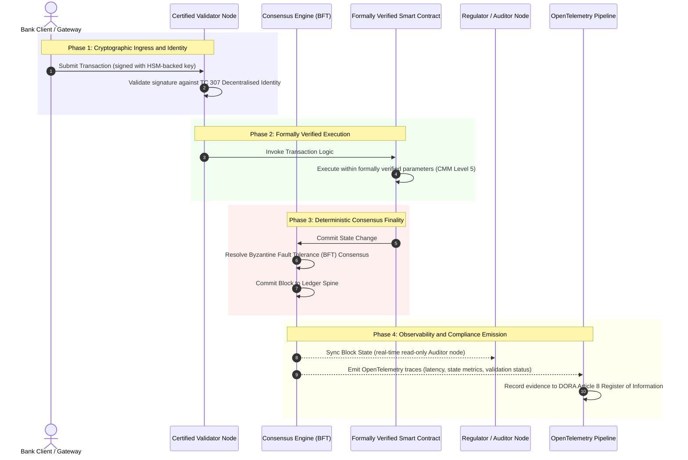

# Daga Shaida Zuwa Gaskiya: Dalilin da Blockchains da Aka Tabbatar Za Su Ayyana Sabon Zamani na Amanar Banki

**Rashin canzawa ba daidai yake da amincewa ba.** Yayin da bankin manyan kasuwanci ke matsawa zuwa biyan kuɗi na lokaci-lokaci da AI mai yiwuwa, littafin da ke yanke abin da yake gaskiya ya zama layin da bankuna har yanzu ba za su iya tabbatarwa ba. Suna tabbatar da hukumar a ƙarƙashin Basel III, girgije a ƙarƙashin ISO 27001 da AI dinsu a ƙarƙashin ISO 42001, amma distributed ledger, mulkinsa, consensus, cryptography da smart contracts, an bar shi ga zaton musamman na mai kaya. Wannan rahoto na gardama cewa rufe wannan giɓin amana na buƙatar matsawa daga jagorar ISO/IEC TC 307 zuwa tabbaci na tsari: ƙididdiga littafi da Certified Blockchain Index mai matakai 5 wanda ke mai da ma'aunin injiniya zuwa gaskiyar da ake iya tantancewa a zauren gudanarwa, wadda za a iya kare ta a ƙarƙashin DORA.

<!-- lead-start -->
<aside class="post-lead" aria-label="Taƙaitaccen labari">

<strong>TL;DR.</strong> Bankuna suna tabbatar da hukumar, girgije da AI dinsu, amma ba littafin da ke ƙara yanke abin da yake gaskiya ba. ISO/IEC TC 307 na ba da jagora, ba tabbaci ba. Certified Blockchain Index mai matakai 5 na ƙididdiga mulkin littafi, amincin consensus, ainihi da cryptography, tabbacin smart-contract da lura da Capability Maturity Model, yana rufe giɓin amana kuma yana ba AI mai yiwuwa kashin bayan bincike mai tabbataccen sakamako.

<strong>Muhimman abubuwan da za a koya</strong>

<ul class="post-lead-takeaways">
  <li><strong>Giɓin gwabza amana.</strong> Ana iya tabbatar da banki (Basel III), girgije (ISO 27001) da tsarin mulkin AI (ISO 42001); distributed ledger da ke yanke abin da yake gaskiya har yanzu ba a iya tabbatarwa ba. Wannan rashin daidaituwa rauni ne na aiki mai rai.</li>
  <li><strong>DORA na mai da shi na kai.</strong> A ƙarƙashin DORA Article 5, allon bankuna na ɗaukar alhakin kai tsaye, wanda ba a iya wakilata, na juriya na tura wani ɓangare na uku da littafi, tare da hukuncin kai na SM&amp;CR kan gazawa.</li>
  <li><strong>Kashin bayan bincike na AI.</strong> Machine learning ba ya iya sake haifuwa; blockchain da aka tabbatar na kama sigogin model, shigarwa da yanke shawarar tabbatarwa cikin tabbataccen sakamako on-chain, yana gamsar da ISO 42001 da ma'aunin sarrafa haɗarin model.</li>
  <li><strong>Certified Blockchain Index.</strong> Mulki, consensus, cryptography, smart contracts da lura na zama katin ƙima na CMM daga 0 zuwa 5 wanda ke fassara ma'aunin injiniya zuwa Bayanan Sha'awar Haɗari da allon ya amince da su.</li>
</ul>

<strong>Karatu masu alaƙa:</strong> <a href="https://sebastienrousseau.com/2026-07-02-certified-blockchains-banking-trust-tc307-assurance-2026">Blockchains da Aka Tabbatar da Amanar Banki: Tabbacin TC 307</a>, <a href="https://sebastienrousseau.com/2026-07-24-global-payments-outlook-operating-model-risk-revenue">Hangen Biyan Kuɗi na Duniya na 2026</a>.

</aside>
<!-- lead-end -->

> **Taƙaitawar Zartarwa**
>
> - **Bankin manyan kasuwanci na kan matsayin juyawa.** Share-fage na lokaci-lokaci da AI mai yiwuwa na karya tsarin tabbaci na analogue mai duban baya: bincike na tsaye, na hukuma, ba sa ƙara gamsar da buƙatun sarrafa haɗari na zamani ko na amana.
> - **TC 307 tushe ne, ba takardar shaida ba.** ISO/IEC TC 307 ya daidaita ƙamus, reference architecture da jagorar tsaro na distributed ledgers, amma na bayyanawa ne. Yana ayyana yadda kyau yake kama; ba ya ba da tabbatarwa ta tsari da jami'an haɗari da masu kula ke buƙata don ba da izinin tura samarwa.
> - **Tabbaci na nufin ƙididdiga littafi.** Mulki, amincin consensus, amincin smart-contract da saurin cryptography, da aka ƙididdiga da Capability Maturity Model mai matakai 5 mai tsauri, na motsa bankuna daga zaton ɓarke-ɓarke na musamman na mai kaya zuwa gaskiyar kuɗi da ake iya tantancewa a zauren gudanarwa.
> - **Littafi shine kashin bayan bincike na AI.** Ƙulla sigogin model, shigarwa da yanke shawarar tabbatarwa ga consensus mai tabbataccen sakamako na ba wa machine learning wanda ba ya iya sake haifuwa rikodin shaida mai kariya, mai iya sake ginawa a ƙarƙashin ISO 42001, SR 11-7 da PRA SS1/23.

## Giɓin Gwabza Amana a Bankin Dijital

A bankin gargajiya, amana tana da alaƙa, ta hukuma, kuma mai duban baya. Ta dogara ne kan masu bincike masu zaman kansu na ɓangare na uku suna nazarin yanayin kuɗi a wuraren tsayayye na lokaci, suna daidaita saɓani a tsakanin littattafan da ke tarayya biyu-biyu. A kasuwanni na lokaci-lokaci, waɗanda API ke jagoranta na 2026, wannan tsari na gabatar da jinkiri masu hana aiki da haɗura na tsari.

Lokacin da mu'amaloli ke biyan kuɗi nan take, an sarrafa tafkunan kuɗi na cikin rana da API gateways, kuma an tokenize mallakar kadara a littattafan da ake tarayya, bincike masu duban baya na zama motsa jiki na forensic maimakon sarrafawar rigakafi. Masu riƙe amana ba za su ƙara dogara kawai kan tabbatar da hukumar kamfani ba. Dole ne su tabbatar da tushen dijital kansa.

A yanzu, bankuna na aiki a ƙarƙashin rashin daidaito na architecture bayyananne:

1. **Certified Cloud Infrastructure**: An tabbatar da hardware nodes, virtualised containers, da physical datacenters da ISO/IEC 27001 da SOC 2 Type II controls.  
2. **Certified Management Processes**: An mulkin manufofin haɗari na aiki, tsare-tsaren ci gaba da kasuwanci, da tura algorithmic a ƙarƙashin tsauraran tsarin haɗari.  
3. **Uncertified Ledger Engines**: An bar tsakiyar distributed consensus mechanisms, validator node supply chains, iyakokin smart contract, da model na mulki na cibiyar sadarwa ga zato marasa tabbaci, na musamman, ko na consortium.

Wannan rashin daidaito babban wurin gazawa ne. Banki na iya gudanar da app da aka tabbatar cikin secure, ISO 27001-certified cloud container, amma idan wannan container ya rubuta zuwa distributed ledger tare da centralised validator control, sigogin consensus masu rauni, ko smart contracts da ba a bincika ba, an lalata amincin mu'amala. Don haɗa wannan giɓi, dole ne ledger engine kansa ya zama abu na tabbaci mai iya tantancewa.

## Tushen Daidaituwar ISO/IEC TC 307

Aikin tushe da ake buƙata don daidaita distributed ledgers ana kafa shi ne da ISO/IEC Technical Committee 307 (TC 307\) (Blockchain and distributed ledger technologies). Maimakon ɗaukar blockchain a matsayin ka'idar fasaha da ke ware, TC 307 na magance ta a matsayin tushen amanar hukuma, yana tsara aikinsa a fadin ginshiƙai biyar na tsakiya:

1. **Taxonomy and Vocabulary (ISO 22739\)**: Na kafa suna gama-gari, yana tabbatar da ma'anonin doka da aiki masu daidaituwa a tsakanin hukunce-hukunce, tsare-tsaren kuɗi, da cibiyoyi daban-daban.  
2. **Reference Architecture (ISO/TR 23245\)**: Na ayyana iyakoki, layuka, tafiyar bayanai, da abubuwan aiki na tsarin distributed ledger da ya dace.  
3. **Security, Privacy, and Smart Contracts (ISO/TR 23244 / ISO 23613\)**: Na kafa jagororin tsaro na tushe don tsarin kadarar dijital kuma na bayyana kyawawan ayyuka don rage rauni na smart contract da mulkin zagayen rayuwa.  
4. **Interoperability Frameworks**: Na magance hanyoyin musanya bayanai da kadara a tsakanin cibiyoyin littafi daban-daban, yana hana samuwar rumbunan tokenize da ke ware.  
5. **Decentralised Identity and Trust Anchors**: Na haɗa masu ganewa na cryptographic da suka dogara kan littafi tare da public-key infrastructures (PKI) na hukuma da rijistoci da jihar ta ba da izini.

Gaba ɗaya, TC 307 na nuna sauyawar DLT daga zaɓi na injiniya na musamman zuwa horo na architecture da aka daidaita. Duk da haka, TC 307 na ci gaba da kasancewa na bayyanawa da farko. Yana ayyana yadda kyau yake kama (jagora), amma ba ya ba da ka'idar tabbatarwa ta tsari (tabbaci) da jami'an haɗari da masu kula ke buƙata don ba da izinin tura samarwa na critical or important functions (CIFs).

## Jagora vs. Tabbaci: Bambancin Amana

Mahalarta kasuwar kuɗi ba sa tura fasaha saboda tana da sabuwa ko kyakkyawa; suna tura ta lokacin da za a iya mulkinta, bincike ta, kare ta, da daidaita ta da buƙatun ajiyar babban kuɗi. Wannan shine dalilin da ya sa daidaituwa a banki ke warware ta zuwa layuka biyu:

* **Guidance (The Framework)**: Na fitar da kyawawan ayyuka, manufofin reference, da jagororin architecture (misali, ISO/IEC TC 307, NIST frameworks).  
* **Assurance (The Proof)**: Na ba da shaida mai zaman kanta, mai ci gaba, kuma da ɓangare na uku zai iya tantancewa cewa an aiwatar da framework kuma yana aiki kamar yadda aka tsara (misali, ISO 27001 certification, SOC 2 audits, gwaje-gwajen tsari).

Dogara kan uncertified ledger consensus yayin tabbatar da cloud infrastructure giɓi ne mai muhimmanci na tsari. Blockchain da yake "marar canzawa" ba lallai "amintacce a hukumance ba." Rashin canzawa kawai na tabbatar da cewa bayanan da aka shigar ba a canza ba; ba ya tabbatar da cewa validator nodes suna da tsaro, ka'idar consensus tana da juriya kan haɗin baki, dabarar smart contract tana da inganci a lissafi, ko sarrafa maɓallin cryptographic ya bi umarnin post-quantum.

Don rufe wannan giɓi, 2026 Certified Blockchain Index na tsara waɗannan buƙatu zuwa Capability Maturity Model (CMM) mai iya ƙididdigawa da aka tsara zuwa ka'idojin banki na duniya.

## 2026 Certified Blockchain Index

Don ba manyan gudanarwa damar tantancewa da tabbatar da dandamalin littafinsu, wannan index na tsara distributed ledger infrastructure zuwa layuka biyar na aiki masu iya tantancewa, da aka ƙididdiga a ma'aunin CMM daga 0 zuwa 5.

### Table 1: Architecture na Certified Blockchain Index

| Index Layer | Capability Maturity Level (CMM) | Technical and Operational Metric | Regulatory / Fiduciary Control Reference |
| ---- | ---- | ---- | ---- |
| **Ledger Governance** | **Level 0**: Ad-hoc consortium**Level 3**: Automated validator vetting & rotation**Level 5**: Decentralised, multi-party cryptographic identity anchoring | % na validator nodes da hukumomin kuɗi da aka tantance ke gudanarwa; matsakaicin lokacin warware saɓanin validator; rarraba nodes a wurare | **DORA Article 5** (Governance and Organisation); **CPMI-IOSCO PFMI Principle 2** (Governance) & **Principle 3** (Framework for the comprehensive management of risks) |
| **Consensus Integrity** | **Level 0**: Single-node or opaque POW**Level 3**: Audited BFT with deterministic finality**Level 5**: Multi-jurisdictional, formally verified consensus with continuous latency monitoring | Mafi girman jinkiri na consensus da za a iya jurewa; ƙofar juriya kan haɗin baki; SLA na aiki a ƙarƙashin rabuwar node ta gwaji | **DORA Article 6** (ICT Risk Management Framework); **CPMI-IOSCO PFMI Principle 8** (Settlement Finality) |
| **Identity & Cryptography** | **Level 0**: Weak RSA / ECDSA keys**Level 3**: Multi-sig with HSM-backed key management**Level 5**: Quantum-safe hybrid keys (FIPS 203 ML-KEM) and zero-knowledge privacy gates | % na mu'amalolin littafi da aka sa hannu da HSM-backed keys; ƙimar shirye-shiryen sauya PQC; jinkirin ZK-proof | **NIST FIPS 203 / 204**; **ISO/IEC 27001** (Information Security Management) |
| **Smart Contract Assurance** | **Level 0**: Un-audited solidity scripts**Level 3**: Automated compiler validation & external audit**Level 5**: Formally verified, immutable smart contracts with circuit-breaker upgrades | % na smart contracts masu formal verification na lissafi; adadin gargaɗin compiler; faɗin binciken rauni | **EBA Guidelines on Outsourcing Arrangements** (Paragraphs 81, 113-117); **DORA Article 30** (Minimum Contractual Clauses) |
| **Audit & Observability** | **Level 0**: Manual log scraping**Level 3**: Structured OTel traces & read-only auditor nodes**Level 5**: Automated, continuous reconciliation to the Article 8 register | % na mu'amaloli da OpenTelemetry traces ya ƙunsa; jinkiri daga ledger block-commit zuwa auditor-node sync | **BCBS 239** (Risk Data Aggregation); **DORA Article 8** (Register of Information / ITS Schemas) |

### Table 2: Muhimman Alamun Amana da Aka Tsara zuwa Ka'idojin Banki na Duniya

| Signal / Benchmark | Metric | Impact on Banking Platforms | Regulatory Source |
| ---- | ---- | ---- | ---- |
| **ISO/IEC TC 307 Progress** | Sauyawa daga ISO/TR technical reports zuwa tsare-tsaren certification na hukuma | Na kafa framework na farko da aka daidaita don tabbatar da distributed ledger engines | **ISO/IEC JTC 1 / SC 44** (Distributed Ledger Technologies) |
| **Project Agorá Prototype Phase** | Bankunan kasuwanci 40+ da ke shiga; gwajin littafi ɗaya na tokenised deposits | Sauya share-fage na kan iyaka daga saƙo (SWIFT) zuwa atomic tokenised settlement | **Bank for International Settlements (BIS) Innovation Hub** |
| **DORA Article 30 Third-Party Audit** | 100% na masu ba da node da masu masaukin infrastructure an bincika su da ma'aunin tsaro | Na kawar da "shadow validator nodes"; na wajabta cikakkiyar gaskiyar supply-chain | **European Supervisory Authorities (ESA)** |
| **ISO/IEC 42001 (AI Governance)** | An mai da model na AI da logs na horo marasa canzawa ta cryptographic on-chain | Na yin amfani da blockchain a matsayin littafin shaida marar canzawa ("audit spine") na machine learning | **ISO/IEC 42001:2023** (Information technology, Artificial intelligence) |
| **Basel III Capital Adequacy** | Ragewar buffers na babban kuɗi na haɗarin aiki bisa raguwar sarƙaƙƙiya da aka rubuta | Tsarin haɗarin aiki da aka daidaita na ba da lada kai tsaye ga juriyar littafi da aka tabbatar | **Basel Committee on Banking Supervision (BCBS)** |

## Kashin Bayan Bincike na AI: Hankali Mai Yiwuwa a Kan Infrastructure Mai Tabbataccen Sakamako

Ɗaya daga cikin muhimman ayyuka na dabaru na blockchain da aka tabbatar a 2026 shine aiki a matsayin **"Audit Spine"** na tura hankali na wucin gadi. Tsarin kuɗi na zamani na ƙara zama mai yiwuwa. Ƙima na kuɗi, gano zamba na lokaci-lokaci, ciniki na algorithmic, da mu'amaloli na abokan ciniki masu cin gashin kai ana jagorancin su ne da model na machine learning masu tasowa, ratsawa, da daidaitawa a tsawon lokaci. Waɗannan model ba masu tabbataccen sakamako ba ne: idan aka ba su shigarwa iri ɗaya a lokaci biyu daban-daban, za su iya ba da fitarwa daban-daban saboda nauyi masu motsi da horo mai ci gaba.

Wannan rashin tabbataccen sakamako na gabatar da ƙalubalen mulki mai zurfi a ƙarƙashin **ISO/IEC 42001 (AI Governance)** da ma'aunin **Model Risk Management (MRM)** (kamar **US Federal Reserve SR 11-7** da **UK PRA SS1/23**): *Yaya za ka bincika, bayyana, kuma kare yanke shawara waɗanda ba a iya sake haifuwa sosai ba?*

Distributed ledger da aka tabbatar na ba da ma'aunin daidaituwa mai tabbataccen sakamako. Yayin da model na AI ke aiki cikin yiwuwa, blockchain da aka tabbatar na rikodin sigoginsu cikin tabbataccen sakamako, yana kafa kashin bayan shaida marar canzawa:

* **Model Versioning and Weight Anchoring**: Ana hash kowace sigar model da aka tura, nauyinsa masu alaƙa, da checksums na bayanan horo kuma a rubuta su zuwa littafi a lokacin build, suna gamsar da buƙatun supply-chain na **SLSA Level 3**.  
* **Contextual Input Logging**: Lokacin da model na AI ke aiwatar da yanke shawara mai muhimmanci (misali, amincewa da rance ko yiwa mu'amala alama), ana rubuta ainihin shigarwar mahallin da hashes na model zuwa littafi, yana ƙirƙirar tarihin da ke nuna aikin gyara.  
* **Auditability without Code Access**: Idan mai kula ya tambaya, "Me ya sa model ɗinku ya ƙi wannan buƙatar rance a ranar 3 ga Yuni?" banki ba ya buƙatar bayyana lambar da take mallakarsa ko yunƙurin sake ƙirƙirar ainihin yanayin model. Yana gabatar da rikodin littafi on-chain da aka sa hannu ta cryptographic na shigarwa, nauyi, da yanayin tabbatarwa.

Ta ƙulla yanke shawara mai yiwuwa na model na machine learning ga consensus mai tabbataccen sakamako na blockchain da aka tabbatar, cibiyar na ƙirƙirar jadawalin lokaci na ayyukan atomatik mai kariya, mai iya sake ginawa, kuma da masu zaman kansu za su iya tantancewa.

## Nuna Bututun daga Consensus da Aka Tabbatar zuwa Bincike

Wannan sequence diagram na nuna zagayen rayuwar mu'amala da ke ratsa dandamalin blockchain da aka tabbatar, yana nuna yadda ƙofofin tabbatarwa, amincin consensus, aiwatar da smart contract, da fitar da telemetry ke haɗuwa don samar da shaida ta tsari mai shiri ga allo:

Hanyar da ke da muhimmanci ga wannan jerin mu'amala na buƙatar cewa an sa hannu ta cryptographic kan kowane matakin tabbatarwa, aiwatarwa, da consensus, yana tabbatar da asali daga farko zuwa ƙarshe. Auditor node na mai kula na daidaita yanayin block a lokaci-lokaci, yana kawar da buƙatar daidaitawar kuɗi da hannu mai duban baya.

## Littafin Wasa na Zauren Gudanarwa ga Manyan Manajoji

Don sarrafa sauyawa daga amana ta hukuma zuwa amana ta infrastructure cikin nasara, shugabannin banki da manyan manajoji su aiwatar da umarni huɗu masu muhimmanci nan take:

1. **Wajabta Bincike na Littafi a Enterprise Risk Management (ERM)**: Aiwatar da manufar cewa babu dandamalin distributed ledger, ko na kai, na jama'a, ko na consortium, da za a iya tura shi don critical or important functions (CIFs) sai an bincika shi da **Certified Blockchain Index Architecture** mai layuka 5 (aƙalla CMM Level 3).  
2. **Haɗa Blockchains a matsayin Kashin Bayan Shaida na AI na ISO 42001**: Umarci Chief Risk Officer da Lead AI Architect da su haɗa dukkan model na machine learning masu tasiri mai girma da blockchain da aka tabbatar, suna ƙirƙirar littafin bincike da ke nuna aikin gyara na sigogin model, nauyi, shigarwa, da yanke shawara.  
3. **Bincika Validator Node Supply Chain (DORA Article 30\)**: Buƙaci ɓangaren saye da su bincika dukkan hukumomin ɓangare na uku da ke ba da masauki ga validator nodes ko sarrafa masaukin cloud na cibiyoyin DLT, suna wajabta bin ma'aunin cybersecurity da juriyar aiki iri ɗaya da aka yi amfani da su ga cloud nodes na cikin gida na banki.  
4. **Daidaita Architectures na Littafi da CPMI-IOSCO da BCBS 239**: Umarci ƙungiyar injiniyar dandamali da su daidaita telemetry na fitar littafi kai tsaye da buƙatun bayar da rahoton bayanai na **BCBS 239**, kuma su tabbatar da cewa sigogin consensus da settlement finality sun bi **CPMI-IOSCO Principles 8 and 9** sosai.

## Tambayoyi da Ake Yawan Yi

**Shin ISO/IEC TC 307 ma'aunin certification ne?**  
A'a. ISO/IEC TC 307 kwamitin fasaha ne da ke kafa ƙamus, reference architectures, da jagororin tsaro. Yayin da yake ayyana "yadda kyau yake kama" (jagora), masana'antu dole ne su mai da waɗannan takardu zuwa tsare-tsaren certification na hukuma masu iya tantancewa (tabbaci) don gamsar da masu kula da banki.

**Yaya blockchain da aka tabbatar ke tallafawa bin DORA?**  
A ƙarƙashin DORA Article 5, allon bankuna na ɗaukar alhakin kai tsaye, na kai, na juriyar fasaha. Blockchain da aka tabbatar na ba da shaida ta cryptographic mai iya tantancewa na amincin consensus, sarrafa validator supply-chain, da amincin smart contract, yana ba mambobin allo "matakan da suka dace" da za a iya rubutawa don kare kansu daga da'awar alhakin kai na SM\&CR.

**Menene bambanci tsakanin bincike na littafi na gargajiya da bincike na blockchain da aka tabbatar?**  
Bincike na gargajiya na duban baya ne, yana tabbatar da shigarwa da hannu da fayilolin tsaye bayan mu'amaloli sun share. Bincike na blockchain da aka tabbatar na ci gaba ne kuma na lokaci-lokaci; an tabbatar da validator nodes, BFT consensus engine, da smart contracts da aka tabbatar a hukumance don aiwatar da mu'amaloli cikin tabbataccen sakamako, suna fitar da telemetry mai tsari (OpenTelemetry) da ke tabbatar da lafiyar tsarin a ci gaba.

**Shin za a iya tabbatar da blockchains na jama'a don amfanin banki?**  
A mafi yawan hukunce-hukunce, pure permissionless public blockchains sun kasa gamsar da ka'idojin banki saboda rashin tabbatar da ainihin validator, farashin gas/mu'amala marasa iya hasashe, da finality mara tabbataccen sakamako (misali, forks na probabilistic proof-of-work/stake). Blockchains da aka tabbatar a banki galibi na amfani da architectures na enterprise permissioned ko public-hybrid da aka mulki sosai inda aka gane masu gudanar da validator node kuma hukumomin kuɗi ne da aka bincika.

## Nassoshi

* Basel Committee on Banking Supervision (BCBS), 2013\. *Principles for effective risk data aggregation and reporting (BCBS 239\)*. Basel: Bank for International Settlements. Available at: [Basel Committee on Banking Supervision (BCBS), 2013\.](https://www.bis.org/publ/bcbs239.pdf "Basel Committee on Banking Supervision (BCBS), 2013\.").  
* Committee on Payments and Market Infrastructures and Technical Committee of the International Organisation of Securities Commissions (CPMI-IOSCO), 2012\. *Principles for financial market infrastructures*. Basel: Bank for International Settlements. Available at: [Committee on Payments and Market Infrastructures and Technical Committee of the International Organisation of Securities Commissions (CPMI-IOSCO), 2012\.](https://www.bis.org/cpmi/publ/d101.htm "Committee on Payments and Market Infrastructures and Technical Committee of the International Organisation of Securities Commissions (CPMI-IOSCO), 2012\.").  
* European Banking Authority (EBA), 2019\. *EBA/GL/2019/02, Guidelines on outsourcing arrangements*. Paris: EBA. Available at: [European Banking Authority (EBA), 2019\.](https://www.eba.europa.eu/regulation-and-policy/internal-governance/guidelines-on-outsourcing-arrangements "European Banking Authority (EBA), 2019\.").  
* European Parliament and Council of the European Union, 2022\. *Regulation (EU) 2022/2554 on digital operational resilience for the financial sector (DORA)*. Brussels: Official Journal of the European Union. Available at: [European Parliament and Council of the European Union, 2022\.](https://eur-lex.europa.eu/legal-content/EN/TXT/?uri=CELEX%3A32022R2554 "European Parliament and Council of the European Union, 2022\.").  
* ISO/IEC JTC 1/SC 42, 2023\. *ISO/IEC 42001:2023, Information technology, Artificial intelligence, Management system*. Geneva: International Organisation for Standardisation. Available at: [ISO/IEC JTC 1/SC 42, 2023\.](https://www.iso.org/standard/81230.html "ISO/IEC JTC 1/SC 42, 2023\.").  
* ISO/IEC Technical Committee 307, 2020\. *ISO/IEC 22739:2020, Blockchain and distributed ledger technologies, Vocabulary*. Geneva: International Organisation for Standardisation. Available at: [ISO/IEC Technical Committee 307, 2020\.](https://www.iso.org/standard/73771.html "ISO/IEC Technical Committee 307, 2020\.").  
* National Institute of Standards and Technology (NIST), 2026\. *First Three Finalised Post-Quantum Encryption Standards (FIPS 203, 204, and 205\)*. Gaithersburg: U.S. Department of Commerce. Available at: [National Institute of Standards and Technology (NIST), 2026\.](https://www.nist.gov/news-events/news/2024/08/nist-releases-first-3-finalized-post-quantum-encryption-standards "National Institute of Standards and Technology (NIST), 2026\.").

