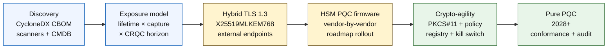

# מדד הבנקאות הקוונטית-בטוחה ב-2026: קריפטוגרפיה פוסט-קוונטית, QKD, גמישות קריפטוגרפית וסיכון Harvest-Now-Decrypt-Later

<!-- lead-start: manual -->
<aside class="post-lead" aria-label="תקציר המאמר">

<strong>תקציר.</strong> בנקאות קוונטית-בטוחה ב-2026 היא תוכנית מסירה עם דד-ליין שנקבע על-ידי הצטלבות שתי עקומות — משך הסודיות של הנתונים שהמוסד מחזיק היום, ואופק ההגעה של מחשב קוונטי רלוונטי קריפטוגרפית (CRQC). NIST FIPS 203 / 204 / 205 סופיים מאז אוגוסט 2024; CNSA 2.0 קובע את יעד הסיום הפדרלי האמריקאי ל-2033; harvest-now-decrypt-later כבר מתבצע על נתונים ארוכי-חיים. כרטיס הניקוד הקוונטי לדירקטוריון עוקב אחר ארבעה אחוזים מדויקים: שלמות המצאי, חשיפת HNDL, התקדמות הגירת NIST, מוכנות לגמישות קריפטוגרפית.

<strong>נקודות מפתח</strong>

<ul class="post-lead-takeaways">
  <li><strong>הוויכוח על האלגוריתם נסגר ב-13 באוגוסט 2024.</strong> ML-KEM (FIPS 203), ML-DSA (FIPS 204), SLH-DSA (FIPS 205) הן התשובות. בנקים שעדיין מנהלים הערכות פנימיות כדי "לבחור את המנצח" מפגרים ב-18 חודשים.</li>
  <li><strong>Harvest-now-decrypt-later כבר חל.</strong> כל דבר עם משך סודיות מעבר להגעה אמינה של CRQC — משכנתאות ל-30 שנה, חיתום ביטוח חיים, הקלטות עסקאות MiFID II / GDPR, ארכיוני שימור M&amp;A — חייב לעבור היום לאיגוד מפתחות היברידי קוונטי-בטוח, ולא כאשר יוכרז CRQC.</li>
  <li><strong>המצאי הוא הבשלות החוסמת.</strong> כתב כמויות קריפטוגרפי (CBOM) — פרוטוקול, ספרייה, תעודה, מחיצת HSM, תלות ספק, בעלים יישומי, משך סיווג נתונים — הוא תנאי מקדים לכל השאר. עקבו אחר טריות, לא אחר כיסוי.</li>
  <li><strong>TLS 1.3 היברידי הוא הפריסה של 2026.</strong> שיתוף מפתחות היברידי X25519MLKEM768 הוא מה ש-Chrome / Firefox / Cloudflare / Akamai מנהלים משא ומתן עליו בפועל היום. ML-KEM TLS טהור ממתין לקושחת HSM ולמוכנות CA.</li>
  <li><strong>גמישות קריפטוגרפית היא התוצר בר-הקיימא.</strong> הפשטת PKCS#11, מפתחות מתויגים, מרשם מדיניות הממפה שירות עסקי לקבוצת אלגוריתמים מותרת. בלעדיה, המעבר האלגוריתמי הבא הוא תוכנית רב-שנתית נוספת.</li>
</ul>
</aside>
<!-- lead-end -->

בנקאות קוונטית-בטוחה ב-2026 עוסקת בהגירה תפעולית, לא בספקולציה. NIST סיים את שלושת תקני הקריפטוגרפיה הפוסט-קוונטית הראשונים, ובנקים נדרשים כעת להבין אילו מערכות תלויות ב-RSA, ECC, TLS, חתימות, HSMs, תעודות, ערוצי תשלום, ארכיונים ונתונים סודיים ארוכי-חיים. שאלת המדד פשוטה: האם המוסד מסוגל להחליף קריפטוגרפיה לפני שהאיום הופך לתפעולי?

---

> **תקציר מנהלים / נקודות מפתח**
>
> - **תקני NIST קונקרטיים כעת.** FIPS 203 מגדיר את ML-KEM לאיגוד מפתחות, FIPS 204 מגדיר את ML-DSA לחתימות, ו-FIPS 205 מגדיר את SLH-DSA כתקן חתימה חסר-מצב מבוסס-גיבוב.
> - **המצאי הוא שער הבשלות הראשון.** בנק אינו יכול להגר את מה שאינו יכול למצוא: יש למפות תעודות, מפתחות, פרוטוקולים, יישומים, ספקים, HSMs, ממשקי API, ארכיונים ומערכות משובצות.
> - **גמישות קריפטוגרפית היא היעד בר-הקיימא.** המטרה אינה החלפת אלגוריתם חד-פעמית; היא היכולת לשנות פרימיטיבים קריפטוגרפיים בלי לעצב מחדש יישומים שלמים.
> - **נתונים ארוכי-חיים משנים את הדחיפות.** סיכון harvest-now-decrypt-later פירושו שנתונים שנלכדים היום עשויים להפוך לקריאים בעתיד אם יישארו בעלי ערך מספיק זמן.
> - **QKD הוא משלים ייעודי.** הפצת מפתחות קוונטית עשויה להיות רלוונטית לערוצים בעלי הערך הגבוה ביותר, אך אינה מחליפה הגירת PQC בכל המוסד.
>
---

## מדוע 2026 היא השנה שבה המדד הזה חשוב

שלושה שינויים ב-2024-2025 הפכו את הקוונטי-בטוח לתוכנית בנקאית מדידה, לא לנקודת מעקב מחקרית. ראשית, NIST סיים את תקני הפוסט-קוונטיים הראשיים ב-13 באוגוסט 2024: [FIPS 203 (ML-KEM) ⧉](https://nvlpubs.nist.gov/nistpubs/FIPS/NIST.FIPS.203.pdf "FIPS 203 — מנגנון איגוד מפתחות מבוסס סריג-מודולים"), [FIPS 204 (ML-DSA) ⧉](https://nvlpubs.nist.gov/nistpubs/FIPS/NIST.FIPS.204.pdf "FIPS 204 — תקן חתימה דיגיטלית מבוסס סריג-מודולים"), [FIPS 205 (SLH-DSA) ⧉](https://nvlpubs.nist.gov/nistpubs/FIPS/NIST.FIPS.205.pdf "FIPS 205 — תקן חתימה דיגיטלית חסר-מצב מבוסס-גיבוב"). הוויכוח על בחירת האלגוריתם נסגר באותו תאריך; בנקים שעדיין מריצים זרמי עבודה פנימיים של "איזו שיטה תנצח" ב-2026 מפגרים ב-18 חודשים.

שנית, [CNSA 2.0 של ה-NSA ⧉](https://media.defense.gov/2022/Sep/07/2003071834/-1/-1/0/CSA_CNSA_2.0_ALGORITHMS_.PDF "Commercial National Security Algorithm Suite 2.0") קבע את יעד הסיום הפדרלי האמריקאי ל-2033 עם נקודות חיתוך ביניים החל מ-2027 לחתימת תוכנה וקושחה, ו-2030 לדפדפנים ומערכות הפעלה. כל בנק עם חשיפת צד-נגדי פדרלי אמריקאי — FedNow, פעולות אוצר, חשבונות לקוחות פדרליים — יושב בתוך אותו פרימטר עבור המערכות הנוגעות בנתונים פדרליים. השעון כבר אינו מופשט.

שלישית, [Harvest-Now-Decrypt-Later (HNDL) ⧉](https://csrc.nist.gov/Projects/post-quantum-cryptography "תוכנית הקריפטוגרפיה הפוסט-קוונטית של NIST") הוא טיעון הסיכון הנושא בדחיפות. יריבים מתוחכמים כבר לוכדים הודעות תשלום מוגנות-TLS, מעטפות SWIFT, תיעוד KYC וטקסטים מוצפנים בארכיונים ארוכי-חיים במרכזים פיננסיים מרכזיים. הנתונים שנלכדים ב-2026 צריכים להישאר רגישים-סודיות רק ברגע הפענוח — עבור משכנתאות ל-30 שנה, חיתום ביטוח חיים, הקלטות עסקאות MiFID II / GDPR וארכיוני שימור M&A, חלון זה משתרע הרבה מעבר לכל הערכה אמינה למחשב קוונטי רלוונטי קריפטוגרפית (CRQC). היריב אינו זקוק למחשב קוונטי היום. הוא זקוק לכזה לפני שהנתונים מפסיקים להיות חשובים.

מדד הבנקאות הקוונטית-בטוחה מודד אם המוסד שלכם יכול לספק את ההגירה לפני שההצטלבות הזו מגיעה. העבודה כבר אינה עוסקת בשאלה אם להגר; היא עוסקת בשאלה אם ההגירה מסתיימת על-פי לוח זמנים בר-הגנה.

## ארכיטקטורת המדד 2026

| שכבת מדד | כיוון 2026 | מדד מוכנות | סיכון בטיפול שגוי |
|---|---|---|---|
| **מצאי** | מיפוי נכסים קריפטוגרפיים, פרוטוקולים, תעודות, ספקים ומחלקות נתונים | אחוז הנחלה במצאי | תלויות פגיעות-קוונטית לא ידועות |
| **חשיפה** | סיווג מערכות לפי משך סודיות וקריטיות עסקה | נכסים בסיכון גבוה לפי ערך ומשך | הגירה עם תיעדוף שגוי |
| **הגירה** | אימוץ דפוסים היברידיים ומוכני-PQC המיושרים לתקני NIST | מוכנות ML-KEM ו-ML-DSA | החלפת פלטפורמה בחירום תחת לוח זמנים |
| **גמישות קריפטוגרפית** | הפרדת לוגיקת יישום מפרימיטיבים קריפטוגרפיים | כיסוי קריפטו מבוקר-מדיניות | אלגוריתמים מקודדים-קשיח על פני הנחלה |
| **אבטחה** | בדיקת יכולת הפעלה הדדית, ביצועים, תמיכת HSM, תעודות ומוכנות ספקים | שיעור מעבר בדיקות וצבר חריגים | ערוצים שבורים או בקרות נסיגה חלשות |

### כרטיס הניקוד הקוונטי לדירקטוריון

כרטיס ניקוד מוכנות קוונטית אמין דורש מעקב אחר אחוזים מדויקים, לא רק סטטוסי פרויקטים:

1. **שלמות המצאי:** אחוז יישומי טיר-1 עם כתב כמויות קריפטוגרפי (CBOM) ממופה במלואו.
2. **חשיפת HNDL:** נפח הנתונים הסודיים ארוכי-החיים (למשל PII, סודות מסחריים) המועברים ברשתות בלי איגוד מפתחות היברידי קוונטי-בטוח.
3. **התקדמות הגירת NIST:** אחוז המפתחות האסימטריים והחתימות הדיגיטליות שהוגרו לתקני FIPS 203 (ML-KEM) ו-FIPS 204 (ML-DSA).
4. **מוכנות לגמישות קריפטוגרפית:** אחוז המערכות הקריטיות שבהן ניתן לסובב אלגוריתמים קריפטוגרפיים דרך מדיניות מרכזית בלי דרישה לקומפילציה מחדש של קוד.

## אותות נוכחיים למעקב

| אות | המשמעות לבנקים | מקור |
|---|---|---|
| **FIPS 203 ML-KEM** | תקן NIST ראשי לכינון מפתחות הצפנה כללי | [NIST ⧉](https://www.nist.gov/news-events/news/2024/08/nist-releases-first-3-finalized-post-quantum-encryption-standards "שלושת תקני ההצפנה הפוסט-קוונטית הסופיים הראשונים") |
| **FIPS 204 ML-DSA** | תקן NIST ראשי לחתימות דיגיטליות | [NIST ⧉](https://www.nist.gov/news-events/news/2024/08/nist-releases-first-3-finalized-post-quantum-encryption-standards "שלושת תקני ההצפנה הפוסט-קוונטית הסופיים הראשונים") |
| **FIPS 205 SLH-DSA** | חלופת חתימה מבוססת-גיבוב ועיצוב גיבוי | [NIST ⧉](https://www.nist.gov/news-events/news/2024/08/nist-releases-first-3-finalized-post-quantum-encryption-standards "שלושת תקני ההצפנה הפוסט-קוונטית הסופיים הראשונים") |
| **שילוב מיידי מומלץ** | NIST מורה במפורש למנהלים להתחיל לשלב את התקנים מכיוון ששילוב מלא דורש זמן | [NIST ⧉](https://www.nist.gov/news-events/news/2024/08/nist-releases-first-3-finalized-post-quantum-encryption-standards "שלושת תקני ההצפנה הפוסט-קוונטית הסופיים הראשונים") |
| **תוכניות קוונטיות בבנקים מתרחבות** | בנקים מובילים בוחנים טכנולוגיות קוונטיות תוך הכנת מעבר ל-PQC | [Quantum Insider ⧉](https://thequantuminsider.com/2026/03/27/15-plus-global-banks-probing-the-wonderful-world-of-quantum-technologies/ "סקירה של בנקים גלובליים הבוחנים טכנולוגיות קוונטיות") |

## ההגירה מתחילה מספר החשבונות הקריפטוגרפי

רצף ההגירה מובן היטב בשלב זה. כל שער מייצר ראיות המניעות את הבא; דילוג או דחיסה של שער הם מה שמייצרים את סיכון החלפת הפלטפורמה בחירום המופיע בעמודת הכישלון של ארכיטקטורת המדד.

התוצר הראשון אינו אלגוריתם חדש; הוא כתב כמויות קריפטוגרפי (CBOM). בנקים זקוקים למצאי חי המחבר בין שירותים עסקיים לאלגוריתמים, ספריות, תעודות, אורכי מפתחות, HSMs, משכי נתונים, ספקים ובעלים תפעוליים. בלי ספר חשבונות זה, הגירה קוונטית-בטוחה הופכת לניחוש.

קבוצת רשומות ה-CBOM צריכה ללכוד, עבור כל פרימיטיב קריפטוגרפי: את הפרוטוקול או הממשק (TLS 1.3, IPsec, SSH, פורמט הודעת תשלום מותאם), את האלגוריתם וקבוצת הפרמטרים (RSA-2048, ECDH P-256, ML-KEM-768, ML-DSA-65), את הספרייה והגרסה (OpenSSL 3.4, גיבוב קומיט של BoringSSL, build של SDK של ספק), את גבול החומרה (מחיצת HSM, TPM, מובלעת מאובטחת, או ללא), את זהות התעודה אם רלוונטי, את הבעלים היישומי ואת משך סיווג הנתונים. כלים הנוחתים בייצור ב-2025-2026 — IBM Quantum Safe Inventory, [מפרט CBOM של CycloneDX ⧉](https://cyclonedx.org/capabilities/cbom/ "CycloneDX Cryptography Bill of Materials") בקוד פתוח, סורקי ארגון מ-CryptoNext / Sandbox / PQShield — משתלבים בצינורות CMDB קיימים. אף אחד מהם אינו שלם בפני עצמו; ציפו למחזור בנייה של 12-18 חודשים ל-CBOM גם עם כלי ספקים וכוח אדם ייעודי.

המדד למעקב הוא טריות, לא כיסוי. CBOM שבן חודשיים מהיום גרוע מהיעדר CBOM, מכיוון שהוא נותן לצוות האבטחה ביטחון שווא לגבי מה שהוגר.

## היברידי קודם, גמיש תמיד

רוב הבנקים לא יחליפו הכול בבת אחת. הדפוס הריאלי הוא פריסה היברידית, שבה מנגנונים קלאסיים ופוסט-קוונטיים פועלים יחד בעוד ספקים, פרוטוקולים, תעודות וכלים תפעוליים מבשילים. היעד ארוך-הטווח הוא גמישות קריפטוגרפית: בחירות קריפטוגרפיות מבוקרות-מדיניות הניתנות לשינוי בלי בנייה מחדש של היישום העסקי.

[הוסיפו רכיב אינטראקטיבי: מחשבון סיכון Harvest-Now-Decrypt-Later (HNDL) — כלי מבוסס-מחוון שבו מנהלים מזינים את משך החיים של הנתונים מול לוח הזמנים הקוונטי המשוער כדי לראות את חלון החשיפה שלהם.]

> **תובנת מפתח:** אם הנתונים שלכם צריכים להישאר סודיים במשך 10 שנים, ומחשב קוונטי רלוונטי קריפטוגרפית (CRQC) נמצא 7 שנים מאיתנו, הדד-ליין שלכם להגירה אינו בעוד 7 שנים — הוא היה לפני 3 שנים.

בפועל פירוש הדבר TLS 1.3 עם שיתוף מפתחות `X25519MLKEM768` היברידי לנקודות קצה הפונות החוצה (Chrome / Firefox / Cloudflare / Akamai תומכים בכך כיום), שרשראות חתימה קלאסיות עד שתשתית HSM ו-CA תדביק, ושכבת הפשטה של PKCS#11 המאפשרת למרשם המדיניות לסובב אלגוריתמים בלי לקמפל מחדש יישומים עסקיים. גמישות קריפטוגרפית היא שקובעת אם המעבר האלגוריתמי הבא (מתי, לא אם) יהיה סיבוב של שישה שבועות או תוכנית רב-שנתית נוספת של שבע שנים.

## איפה QKD משתלב

הפצת מפתחות קוונטית משתייכת למדד כאופציית ערוץ ברגישות גבוהה, במיוחד לתשתית שווקים פיננסיים, לקישוריות בנק מרכזי ולזרימות מוסדיות רגישות במיוחד. יש להתייחס אליה כמשלימה ל-PQC, ולא כתירוץ לעכב הגירה ארגונית.

## המשמעות לפי סוג בנק

### בנקים גלובליים בעלי חשיבות שיטתית

הבעיה הקשה היא הקנה מידה: עשרות אלפי נקודות קצה TLS, מאות מחיצות HSM, עשרות רשויות אישורים פנימיות, מאות יישומים עסקיים עם פרימיטיבים קריפטוגרפיים משובצים, ו-SDKs של ספקים שהבנק אינו יכול לשנות. ההשקעה אינה פיילוט נוסף; היא כלי ה-CBOM, שכבת ההפשטה של PKCS#11 המחווטת בכל בנייה חדשה, תוכנית הקונסולידציה של HSM הבוחרת ספק אחד להוביל בקושחת PQC ומקבלת זנב רב-שנתי על השאר, ומרשם המדיניות ההופך למשטח גמישות הקריפטוגרפית בר-הקיימא הרבה אחרי שהגירת FIPS 203 / 204 / 205 הסתיימה.

### בנקי עסקאות ובנקים תאגידיים

היקף ההגירה צר יותר מאשר בטיר G-SIB אך חשיפת ה-HNDL חריפה: הודעות SWIFT חוצות-גבולות, נתוני תשלום מובנים הנושאים PII של צדדים נגדיים תאגידיים, פלטפורמות חילופי מסמכים המחזיקות תיעוד מימון סחר, וארכיוני דיווח לשימור ארוך. תעדפו TLS היברידי בכל נקודת קצה הפונה ללקוח ו-PQC במנוחה לארכיוני שימור. דחפו אחריות-ספק HSM — לצוות פלטפורמת הבנקאות התאגידית יש מנוף רכש ישיר שלעיתים חסר לצוות הטכנולוגיה הסיטונאי.

### בנקים אזוריים

קנו את מחסנית הספקים שכבר יש בה את הפרימיטיבים של גמישות קריפטוגרפית. בחרו פלטפורמת בנקאות מרכזית שהספק שלה מפרסם CBOM ומתחייב ללוחות זמנים של תמיכה ב-ML-KEM / ML-DSA. ודאו שמפת הדרכים של HSM של הספק תואמת את הדד-ליין של הבנק להגירה. קיבולת ההנדסה הנדרשת לבנות גמישות קריפטוגרפית מאפס היא רב-שנתית; הספק משלם את העלות הזו על פני לקוחות רבים והבנק יורש את היתרון. עבודת הוולידציה — בדיקה שטענות הספק שורדות את תהליך ה-MRM של המוסד — היא היקף פנימי לגיטימי.

### פינטקים, PSPs וספקי תשתית

שאלת התחרות לספקים המוכרים לבנקים ב-2026 אינה "האם אתם תומכים ב-PQC". היא "האם אתם יכולים להפיק CycloneDX CBOM לפלטפורמה שלכם, מטריצת תמיכת ספקי HSM ו-SLA כתוב של סיבוב אלגוריתם". ספקים העונים בכן יעברו את שערי הרכש של טיר-1 ב-2026-2027. ספקים שלא יוכלו, יאבדו את מחזור החידוש למתחרה שכן יכול.

## מסקנה

בנקאות קוונטית-בטוחה ב-2026 אינה נקודת מעקב מחקרית; היא תוכנית מסירה עם דד-ליין שנקבע על-ידי הצטלבות שתי עקומות — משך הסודיות של הנתונים שהמוסד מחזיק היום, ואופק ההגעה של מחשב קוונטי רלוונטי קריפטוגרפית. המוסדות שייראו אמינים בעיני רגולטורים וצדדים נגדיים ב-2030 הם אלה שהתחילו את בניית ה-CBOM ב-2024, פרסו TLS היברידי בכל נקודת קצה חיצונית עד סוף 2026, והנדסו גמישות קריפטוגרפית לכל בנייה חדשה מהיום הראשון. המוסדות שלא עשו זאת יגלו אם חלון ההגירה שלהם כבר נסגר עבור הנתונים שיריביהם קוצרים היום.

מדדו את ההגירה כפי שאתם מודדים כל תוכנית תפעולית: היקף ידוע, רצף מתוזמן, דד-ליינים מחויבים, מרשמי חריגים כנים. ככל שתסתכלו קשה יותר על הנחלה שלכם, חלון ההגירה ירגיש קטן יותר.

## שאלות נפוצות

**מה בנק צריך למפות במצאי קודם?**

התחילו ב-TLS חשוף החוצה, ערוצי תשלום, אימות לקוחות, קישוריות בין-בנקאית, שירותים מגובי-HSM, ארכיונים ארוכי-טווח, ומערכות המטפלות בנתונים סודיים בעלי חיים שימושיים ארוכים.

**האם PQC הוא רק סוגיה של אבטחת סייבר?**

לא. הוא משפיע על תשלומים, זהות, ראיות משפטיות, חתימת עסקאות, אמון לקוחות, שימור נתונים, ניהול ספקים וחוסן תפעולי.

**מה משמעות גמישות קריפטוגרפית?**

גמישות קריפטוגרפית היא היכולת לשנות פרימיטיבים קריפטוגרפיים דרך בקרות מדיניות ופלטפורמה במקום שינויי יישום מקודדים-קשיח.

**האם בנקים צריכים להמתין לתקנים נוספים?**

לא. NIST עודד מנהלים להתחיל לשלב את התקנים הסופיים הראשונים מכיוון ששילוב מלא דורש זמן.

## הפניות

- NIST, (2026). [שלושת תקני ההצפנה הפוסט-קוונטית הסופיים הראשונים ⧉](https://www.nist.gov/news-events/news/2024/08/nist-releases-first-3-finalized-post-quantum-encryption-standards "שלושת תקני ההצפנה הפוסט-קוונטית הסופיים הראשונים").

<!-- enrich-start -->
<aside class="author-card" aria-label="אודות המחבר"><strong class="author-card-name"><a href="/about/index.html">Sebastien Rousseau</a></strong>טכנולוג בנקאות בכיר הכותב על AI יישומי, תשתיות תשלומים, כסף מתוסמל, ISO 20022, אבטחה פוסט-קוונטית, שירותים פיננסיים ענן-מקוריים ושווקים דיגיטליים מפוקחים.20+ שנים ב-HSBC Commercial &amp; Investment Bank, PayPal, Barclays, Shazam, AKQA, Virgin Group. <a href="/about/index.html">פרופיל מלא</a> &middot; <a href="https://www.linkedin.com/in/sebastienrousseau/" rel="external noopener">LinkedIn</a> &middot; <a href="https://github.com/sebastienrousseau" rel="external noopener">GitHub</a></aside>

נסקר לאחרונה <time datetime="2026-06-04">2026-06-04</time>.

<!-- enrich-end -->
