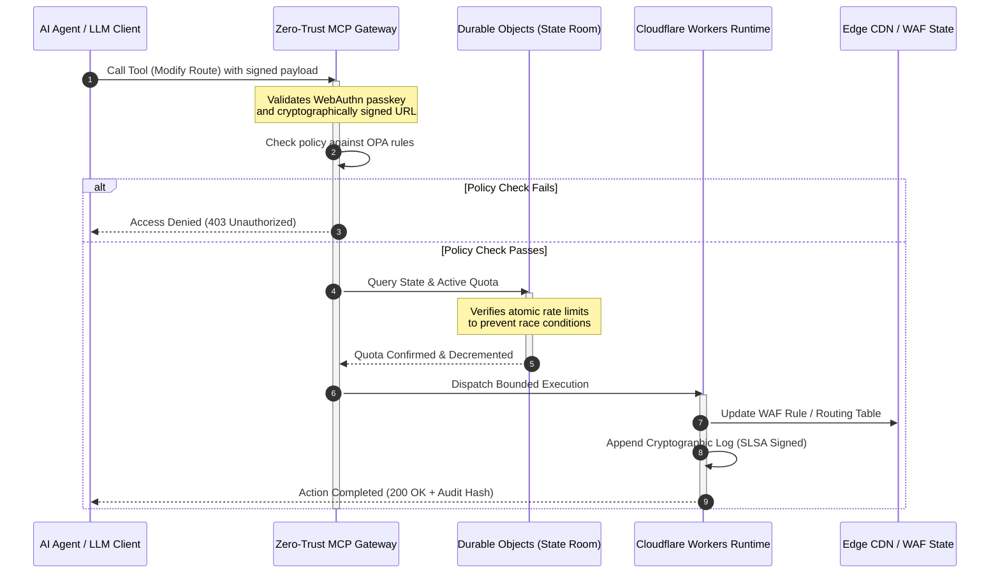

# CloudCDN: תכנית אב של קוד פתוח לקצה ילידי-AI ב-2026

<!-- lead-start: manual -->
<aside class="post-lead" aria-label="תקציר המאמר" dir="rtl">

<strong>תקציר.</strong> הטכנולוגיה הארגונית ב-2026 מוגדרת על ידי ההתכנסות של ביצוע serverless מבוזר גלובלית ושל AI סוכני. רשתות CDN סטנדרטיות — שנבנו למטמון קבצים סטטיים ולניתוב תעבורה בסיסי — מיושנות מבחינה מבנית בעידן של תזמור נתונים פעיל בזמן אמת. CloudCDN היא תכנית אב של קוד פתוח שממירה את הקצה למישור בקרה פעיל: זמני ריצה serverless, תיאום מצב באמצעות Cloudflare Durable Objects, ושער Model Context Protocol (MCP) באפס-אמון שמאפשר לסוכני AI אוטונומיים להפעיל תשתית אינטרנט בתוך מעטפות תפעוליות תחומות ומאובטחות קריפטוגרפית.

<strong>נקודות מפתח</strong>

<ul class="post-lead-takeaways">
  <li><strong>ממטמון סטטי למישור בקרה תחום.</strong> CloudCDN מעבירה את הגבול התפעולי אל הקצה, וממירה צמתי CDN לשערי מדיניות פעילים המבצעים החלטות אבטחה, ניתוב ובקרת גישה בתת-אלפית-שנייה.</li>
  <li><strong>תיאום מצב בקצה.</strong> Cloudflare Durable Objects אוכפים הגבלת קצב אטומית בזמן אמת ותיאום מצב גלובלי — בלי מצבי מרוץ מבוזרים, בלי ניצול שיטתי לרעה של מכסות בין אזורי קצה.</li>
  <li><strong>ניהול תשתית סוכני בטוח באמצעות MCP.</strong> שער אפס-אמון חושף 42 כלי MCP ייעודיים, ומאפשר לסוכני AI לבדוק, להגדיר ולהפעיל תשתית תחת גבולות חתומים קריפטוגרפית.</li>
  <li><strong>אבטחת שרשרת האספקה כתוצר של הצינור.</strong> מקור build ברמת SLSA Level 3 באמצעות Sigstore/Cosign ו-3,185 בדיקות יחידה בכיסוי של 100% בכל שחרור.</li>
  <li><strong>ראיות ברמת דירקטוריון, לא לוחות מחוונים.</strong> טלמטריית הקצה ממופה ישירות לאחריות הדירקטוריון לפי סעיף 5 ל-DORA, לדיווח הסיכונים לפי BCBS 239 ולכללי ההון לסיכון תפעולי של Basel III.</li>
</ul>

<strong>קריאה נוספת:</strong> <a href="/2026-05-16-best-cloud-infrastructure-architecture-2026/">ארכיטקטורת תשתית הענן הטובה ביותר ב-2026</a> · <a href="/2026-06-05-cloud-native-banking-index-dora-resilience-platform-engineering-2026/">מדד הבנקאות ה-cloud-native ב-2026</a> · <a href="/2026-06-03-agentic-ai-index-banks-autonomy-governance-auditability-2026/">מדד ה-AI הסוכני לבנקים ב-2026</a>.

</aside>
<!-- lead-end -->

הוויכוח על ה-CDN הסתיים. הקצה כבר אינו מטמון; הוא מישור הבקרה של תוכנה ילידת-AI. כשסוכנים קוראים לכלים, מזיזים נתונים, מטהרים מטמונים, מבקשים כתובות URL חתומות ומתאמים תהליכי עבודה, המודל הישן של לוחות בקרה אטומים ומישורי בקרה קנייניים מפסיק להיות אי-נוחות והופך לחבות רגולטורית. CloudCDN טוענת בעד מודל אחר: פלטפורמת קצה פתוחה, ניתנת לבדיקה וניתנת לבקרה בידי סוכן, המתייחסת לאבטחה, נגישות, ביצועים ויכולת ביקורת כברירות מחדל הניתנות לאכיפה ולא כהבטחות ספק.

נקודת ההפניה בקוד פתוח של מאמר זה היא [cloudcdn.pro ⧉](https://github.com/sebastienrousseau/cloudcdn.pro "cloudcdn.pro"). המאגר הוא רשת CDN רב-דיירית, ילידת-AI, שניתן לקרוא מקצה לקצה ולפרוס באופן עצמאי: TTFB מתחת ל-100ms על פני נקודות PoP של Cloudflare, בקרת MCP, הגבלת קצב ב-Durable Objects, נגישות WCAG-AA, כתובות URL חתומות, passkeys, SLSA Level 3 ו-3,185 בדיקות בכיסוי של 100%.

---

> **תקציר מנהלים / נקודות מפתח**
>
> - **הקצה הופך לגבול התפעולי.** CloudCDN ממירה צמתי CDN סטנדרטיים לשערי מדיניות פעילים המבצעים אבטחה, ניתוב ובקרת גישה בתת-אלפית-שנייה.
> - **Durable Objects הופכים את הגבלת הקצב לאטומית.** אכיפת מכסות בזמן אמת, עקבית גלובלית, סוגרת את חלון מצבי המרוץ שמגבילי קצב בעקביות-בסופו-של-דבר משאירים פתוח לתוקפים ולסוכנים כושלים.
> - **סוכנים מפעילים תשתית באמצעות 42 כלי MCP תחומים.** כל קריאה מאומתת מול passkeys של WebAuthn, מטענים חתומים ומדיניות OPA לפני שכל דבר מתבצע.
> - **שרשרת האספקה היא חלק מהמוצר.** מקור SLSA Level 3 באמצעות Sigstore/Cosign קושר קריפטוגרפית כל שחרור לקוד המקור המבוקר שלו.
> - **טלמטריה היא ראיית ציות.** פעולות הקצה ממופות לסעיף 5 ל-DORA, ל-BCBS 239 ולהון לסיכון תפעולי של Basel III — ישירות, לא באמצעות דיווח בדיעבד.
>
---

## מדוע פרויקט הקוד הפתוח הזה חשוב ב-2026

ה-IT הארגוני ב-2026 עבר מהקצאת תשתית סטטית לתזמור נתונים מונחה-אירועים בזמן אמת. שני כוחות שוק מניעים את השינוי.

הראשון הוא התפשטות ה-AI הסוכני. מודלים אוטונומיים וסוכני תוכנה מבצעים כיום משימות תפעוליות מורכבות — מיתון איומים אוטומטי, החלטות ניתוב, איזון ספרים ראשיים בזמן אמת. הם אינם משתמשים בלוחות בקרה. הם קוראים לכלים.

השני הוא האכיפה הפעילה של [תקנת החוסן התפעולי הדיגיטלי (DORA) ⧉](https://eur-lex.europa.eu/legal-content/EN/TXT/?uri=CELEX%3A32022R2554 "תקנה (EU) 2022/2554 בדבר חוסן תפעולי דיגיטלי במגזר הפיננסי"). מוסדות בנקאיים אינם יכולים עוד להסתמך על רשתות CDN צד-שלישי אטומות וקנייניות. הרגולטורים דורשים נראות מלאה אל שרשרת אספקת התוכנה, יכולת יציאה הניתנת לאימות ושבילי ביקורת קריפטוגרפיים שאינם ניתנים לשינוי.

ארכיטקטורות שרת ריכוזיות כופות קנסות השהיה שתזמור בזמן אמת אינו יכול לספוג. רשתות CDN קנייניות מתפקדות כקופסאות שחורות שחושפות מוסדות לפגיעה בשרשרת האספקה שהם אינם יכולים לראות, ובוודאי לא להוכיח בראיות. CloudCDN סוגרת את הפער הזה עם תכנית אב שקופה, באפס-אמון ובקוד פתוח, שהופכת את הקצה למישור בקרה פעיל. עבור מנהלי טכנולוגיה בכירים, היא מעבירה את השיחה מעלות הציות אל Return on Resilience: הון שנשמר באמצעות צינורות תפעוליים אוטומטיים ומוכנים לביקורת.

## עדשת ארכיטקטורה

ארכיטקטורת CloudCDN בנויה בחמש שכבות, ומחליפה middleware ריכוזי בפרימיטיבים מקומיים של קצה עם מצב:

| שכבה | החלטת תכנון | מדוע זה חשוב | סיכון בטיפול לקוי |
|---|---|---|---|
| **זמן ריצה בקצה** | Cloudflare Workers ו-Pages | מבטל השהיה של מכונות וירטואליות ריכוזיות; מבצע מדיניות בתת-אלפית-שנייה גלובלית | רווחי ביצועים ללא משמעת מדיניות מייצרים סחיפת קצה כאוטית |
| **תיאום מצב** | Durable Objects | מבטיח עקביות אטומית בזמן אמת למגבלות קצב ולמצב משותף בין אזורים | מצבי מרוץ מבוזרים, ניצול לרעה של משאבי API, עקיפת מכסות היקפיות |
| **ממשק סוכן** | שער MCP באפס-אמון | חושף 42 כלי MCP ייעודיים כדי שסוכני AI יפעילו תשתית תחת גבולות ממושלים | קריאת כלים ללא גבולות ושינויי תצורה לא מורשים |
| **בקרת גישה** | passkeys של WebAuthn וכתובות URL חתומות | מחליף סיסמאות סטטיות בחתימות קריפטוגרפיות לפעולות הניתנות לביקורת | שינויים בייחוס חלש; גניבת אישורי גישה המובילה לפריצת ההיקף |
| **שערי איכות** | SLSA Level 3 וכיסוי בדיקות של 100% | מאמת מתמטית את מקור ה-build; חוסם הזרקת תלויות זדונית | קוד זדוני המוחדר דרך שרשרת אספקת התוכנה |

## איתותים תפעוליים למעקב

מוכנות קצה ניתנת למדידה. אלה האינדיקטורים הכמותיים שמדגימים יכולת ביצוע ולא כוונה:

| איתות | מדד / אמת מידה | הפניה רגולטורית | יישום בפלטפורמה |
|---|---|---|---|
| **42 כלי MCP** | ספירת רישום כלים תחום לניהול אוטומטי | COBIT 2019 (BAI06) | שער MCP המאמת חתימות סוכנים מול מדיניות OPA |
| **Durable Objects** | אכיפת מכסות אטומית בתת-אלפית-שנייה וללא דליפות | סעיף 6 ל-DORA | Durable Objects העוקבים אחר מצב מכסות ה-API הגלובלי |
| **passkeys וכתובות URL חתומות** | 100% מהפעלות הניהול מאומתות באמצעות FIDO2 WebAuthn | סעיף 30 ל-DORA | בדיקות חתימה קריפטוגרפיות משובצות בנתב הקצה |
| **SLSA Level 3** | מניפסטים של build חתומים קריפטוגרפית (Sigstore) | סעיף 30 ל-DORA | צינורות GitHub Actions המפיקים מטא-נתוני build חתומים |
| **3,185 בדיקות יחידה** | כיסוי של 100%; שערי רגרסיה בכל שחרור | NIST CSF 2.0 (PR.DS-01) | צינורות CI העוצרים פריסה בכל כשל בדיקה |

## ה-CDN הופך למישור בקרה פעיל

רשתות CDN מסורתיות תוכננו סביב האצת תוכן סטטית ופסיבית. CloudCDN מגדירה מחדש את המודל. עם Cloudflare Workers ו-Durable Objects משולבים, הקצה מתפקד כשער מדיניות פעיל ובעל מצב.

כשסוכן AI או תהליך אוטומטי מבקש שינוי בתצורת התשתית או התאמת ניתוב, הוא אינו פונה למסד נתונים ריכוזי ופגיע. הבקשה מיורטת בצומת הקצה הקרוב ביותר ועוברת בדיקות זהות, מדיניות ומכסה לפני שכל דבר מתבצע:

כל שלב ברצף הזה מפיק רשומה חתומה וניתנת לייחוס. זה ההבדל בין CDN שמאיץ תוכן לבין מישור בקרה שניתן לממשל.

## מדוע קוד פתוח משנה את מודל האמון

עבור מנהלי אבטחת מידע ראשיים, רשתות CDN קנייניות אטומות מציבות סיכון מצטבר. רשתות קצה בקוד סגור הן קופסאות שחורות: אם הספק סופג פגיעה פנימית, לבנק אין שום נראות עד שהפרצה נחשפת בפומבי.

CloudCDN מחליפה את האסימטריה הזו במודל אמון בקוד פתוח, הניתן לביקורת מלאה ובנוי על שלושה מנגנונים:

1. **מקור build מתמטי.** תחת SLSA Level 3, כל שחרור קשור קריפטוגרפית למאגר ה-GitHub הפתוח שלו. מנהל אבטחת מידע יכול לאמת — מתמטית, לא חוזית — שהקובץ הבינארי הרץ על צומתי הקצה הגלובליים של Cloudflare מכיל בדיוק את קוד המקור המבוקר.
2. **ביקורות אבטחה ציבוריות ומתמשכות.** בסיס הקוד נתון לסריקות אוטומטיות, לחשיפת פגיעויות פומבית ולביקורות קוד בסקירת עמיתים. עמימות אינה בקרה; סקירה כן.
3. **ללא נעילת ספק (סעיף 28 ל-DORA).** DORA מחייבת בנקים להוכיח אסטרטגיית יציאה ברורה ונבדקת מספקי צד-שלישי קריטיים. מכיוון ש-CloudCDN היא קוד פתוח ובנויה על פרימיטיבים serverless סטנדרטיים, מוסדות יכולים להעביר תצורות קצה מ-Cloudflare לזמני ריצה serverless אחרים או לאשכולות Kubernetes פרטיים — ולהוכיח את היכולת הזו לרגולטור.

## דפוס הקצה ברמת בנק

CloudCDN מהונדסת לעמוד בתקני הציות של המגזר הפיננסי הגלובלי, וממפה פעולות קצה טכניות ישירות למסגרות שהמפקחים אכן בוחנים:

- **ניהול סיכוני מודל ([SR 11-7 של הפדרל ריזרב האמריקאי ⧉](https://www.federalreserve.gov/supervisionreg/srletters/sr1107.htm "Supervisory Guidance on Model Risk Management") / SS1/23 של ה-PRA הבריטי).** מודלים אוטונומיים המבצעים משימות תפעוליות כפופים לממשל סיכוני מודל. שער ה-MCP של CloudCDN מתייחס לכלים סוכניים כאל מודלים כמותיים: גבולות מדיניות קשיחים, רישום בזמן אמת ועקיפות חובה עם אדם-בלולאה לפעולות בעלות השפעה גבוהה.
- **BCBS 239 (אגרגציה של נתוני סיכון).** לכידה, תיוג והבניה של נתוני עסקאות בקצה מפיקות מדדים תפעוליים בזמן אמת — בהלימה לדרישות BCBS 239 לשלמות נתונים, לעדכניות ולעקיבות רגולטורית.
- **סעיף 5 ל-DORA (אחריות הדירקטוריון).** הדירקטוריון נושא באחריות אישית סופית לחוסן התפעולי. CloudCDN מתרגמת טלמטריית קצה לראיות מכומתות וניתנות לאימות שדירקטורים לא-טכניים יכולים להביא לביקורת הנושאת אחריות אישית.
- **הון לסיכון תפעולי לפי Basel III.** בנקים מחזיקים הון רגולטורי כנגד סיכון תפעולי. התאוששות מאסון אוטומטית ומקור SLSA Level 3 מקטינים את פרופיל הסיכון התפעולי של המוסד — ושומרים הון במאזן, לא רק מספקים ביקורת.

## מה זה אומר לפי סוג בנק

### בנקים בעלי חשיבות מערכתית גלובלית (G-SIB)

בנקים מסוג G-SIB מריצים נפחי עסקאות עצומים על פני תחומי שיפוט מרובים. העדיפות היא החלפת בקרות היקף מורשת מפוצלות במישור קצה אחד ומאוחד. פריסת דפוס CloudCDN מאפשרת ל-G-SIB לתקנן גלובלית מדיניות אבטחה, שערי API וממשל סוכני — ולהפיק צינורות ראיות תואמי-DORA כתוצר לוואי של התפעול ולא כמרוץ רבעוני.

### בנקים עסקאיים ובנקים תאגידיים

עבור בנקים עסקאיים, המוצר הפונה ללקוח הוא חבילה של מהירות ביצוע, אבטחה ושקיפות נתונים. דפוס CloudCDN מאפשר לבנקים אלה לחשוף לוחות API מאובטחים ושירותי מעקב מזומנים בזמן אמת לגזברים תאגידיים — תנוחת קצה עמידה שמגינה על פיקדונות ארגוניים.

### בנקים אזוריים וקטנים יותר

בנקים אזוריים מתמודדים עם אותם גורמי איום כמו G-SIB, בלי תקציבי ההנדסה. תכנית אב לקצה ברמת בנק בקוד פתוח מספקת את הבקרות מהקופסה: הלימה רגולטורית מיידית ללא עלויות רישיון קנייני, וקוד המקור כדי להוכיח זאת.

## ספר המהלכים של הדירקטוריון

חוסן תפעולי כבר אינו מדד IT בלתי נראה של המשרד העורפי; הוא עדיפות דירקטוריון עם אחריות אישית צמודה. המוסדות ששומרים על אמון הרגולטורים, הלקוחות ובעלי המניות ב-2026 מתייחסים לטכנולוגיה כאל נכס הניתן לאימות ולתצפית.

מפת הדרכים למובילי טכנולוגיה בכירים קצרה:

1. **לחייב ראיות כמוצר.** לתקצב צינורות אוטומטיים המתעדים את עצמם בקצה — ראיות שנוצרות מהתפעול, לא נאספות עבור המבקר.
2. **לעבור לבקרת קצה עם מצב.** להוריד הגבלת קצב, WAF ואימות זהות משרתים ריכוזיים אל פרימיטיבים אטומיים בקצה.
3. **לקבוע גבולות סוכניים קריפטוגרפיים.** לאכוף שערי MCP באפס-אמון עם אימות passkey ו-OPA לכל קריאת כלי אוטומטית.
4. **לדרוש ביקורות build בקוד פתוח.** להפוך מקור build ברמת SLSA Level 3 לתנאי פריסה, לא לשאיפה.

## שאלות נפוצות

**האם CloudCDN מוכנה לביקורות DORA?**

כן. CloudCDN מהונדסת להפיק ראיות ציות אוטומטיות הממופות ישירות לתבניות ה-ITS של מרשם המידע (RT.01 עד RT.15) ולסעיפים החוזיים של סעיף 30 ל-DORA.

**מה היתרון בשימוש ב-Durable Objects להגבלת קצב?**

מגבילי קצב מבוזרים מסורתיים מסתמכים על עקביות-בסופו-של-דבר, שמשאירה חלון השהיה שתוקפים או סוכנים כושלים יכולים לנצל. Durable Objects מבטיחים עקביות אטומית מיידית גלובלית, וסוגרים את חלון מצבי המרוץ לחלוטין.

**מה הופך את CloudCDN לילידת-AI?**

הפעולות בבקרת MCP ומודל הבקרה המודע לסוכן. התשתית מופעלת באמצעות 42 כלים ממושלים עם זהות קריפטוגרפית וגבולות מדיניות — תכנון לתהליכי עבודה אוטונומיים, לא רק ללוחות בקרה אנושיים.

**האם קוד פתוח מגדיל את הסיכון לניצולי יום-אפס?**

לא. רשתות CDN קנייניות בקוד סגור מסתמכות על אבטחה באמצעות עמימות. בסיס הקוד של CloudCDN נתון ברציפות לבדיקות אוטומטיות, לסקירת עמיתים פומבית ולאימות SLSA Level 3 — סף אמון גבוה יותר באופן הניתן לאימות.

## הפניות

- הפרלמנט האירופי ומועצת האיחוד האירופי, (2022). [תקנה (EU) 2022/2554 בדבר חוסן תפעולי דיגיטלי במגזר הפיננסי (DORA) ⧉](https://eur-lex.europa.eu/legal-content/EN/TXT/?uri=CELEX%3A32022R2554 "תקנה (EU) 2022/2554 בדבר חוסן תפעולי דיגיטלי במגזר הפיננסי (DORA)"). בריסל: העיתון הרשמי של האיחוד האירופי.
- ועדת באזל לפיקוח על הבנקים (BCBS), (2013). [עקרונות לאגרגציה אפקטיבית של נתוני סיכון ולדיווח סיכונים (BCBS 239) ⧉](https://www.bis.org/publ/bcbs239.htm "עקרונות לאגרגציה אפקטיבית של נתוני סיכון ולדיווח סיכונים (BCBS 239)"). באזל: הבנק להסדרים בינלאומיים.
- Board of Governors of the Federal Reserve System, (2011). [Supervisory Guidance on Model Risk Management (SR Letter 11-7) ⧉](https://www.federalreserve.gov/supervisionreg/srletters/sr1107.htm "Supervisory Guidance on Model Risk Management (SR Letter 11-7)"). וושינגטון הבירה: הפדרל ריזרב.
- Cloudflare, (2026). [תיעוד Durable Objects: תיאום מצב בקצה ⧉](https://developers.cloudflare.com/durable-objects/ "תיעוד Durable Objects"). סן פרנסיסקו: Cloudflare.
- Cloudflare, (2026). [בניית סוכני AI עם MCP, אימות ו-Durable Objects ⧉](https://blog.cloudflare.com/building-ai-agents-with-mcp-authn-authz-and-durable-objects/ "בניית סוכני AI עם MCP, אימות ו-Durable Objects").
- GitHub, (2026). [מאגר cloudcdn.pro ⧉](https://github.com/sebastienrousseau/cloudcdn.pro "מאגר cloudcdn.pro").

<!-- enrich-start -->
<aside class="author-card" aria-label="על המחבר"><strong class="author-card-name"><a href="/about/index.html">סבסטיאן רוסו</a></strong>טכנולוג בנקאי בכיר הכותב על בינה מלאכותית יישומית, תשתיות תשלומים, כסף בטוקנים, ISO 20022, אבטחה פוסט-קוונטית, שירותים פיננסיים cloud-native, תשתית בקוד פתוח ושווקים דיגיטליים מפוקחים.למעלה מ-20 שנים ב-HSBC Commercial &amp; Investment Bank, PayPal, Barclays, Shazam, AKQA, Virgin Group. <a href="/about/index.html">פרופיל מלא</a> &middot; <a href="https://www.linkedin.com/in/sebastienrousseau/" rel="external noopener">LinkedIn</a> &middot; <a href="https://github.com/sebastienrousseau" rel="external noopener">GitHub</a></aside>

נבדק לאחרונה <time datetime="2026-06-11">2026-06-11</time>.

<!-- enrich-end -->
