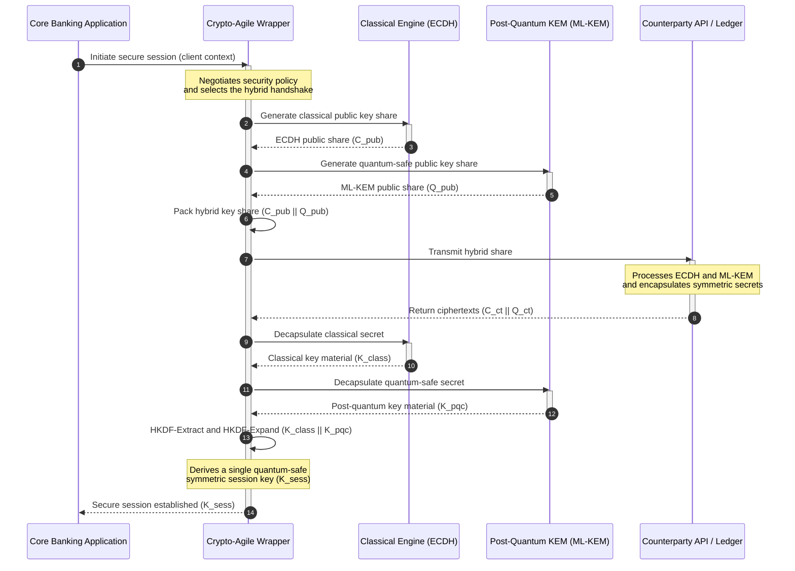

# KyberLib והמעבר הפוסט-קוונטי של הבנקאות ב-2026: מתקנים לקוד

<!-- lead-start: manual -->
<aside class="post-lead" aria-label="תקציר המאמר" dir="rtl">

<strong>תקציר.</strong> תשתית הבנקאות ב-2026 ניצבת מול איום מערכתי בעל נקודת סיום ידועה: מחשוב בקנה מידה קוונטי ישבור את חילופי המפתחות מסוג RSA ו-ECC המגינים כיום על התעבורה במעבר. תקנים פדרליים וניירות מדיניות פיקוחיים העלו את המודעות; הביצוע הטכני נותר מפוצל. <a href="https://github.com/sebastienrousseau/kyberlib">KyberLib</a> הוא שרטוט הנדסי בקוד פתוח שמעביר את הנרטיב הפוסט-קוונטי אל קוד Rust קונקרטי ובטוח-זיכרון — מימוש ML-KEM המתוקנן על ידי NIST (FIPS 203) מאחורי גבולות הפשטה קריפטו-גמישים, כך שמוסדות יכולים לשדרג את אבטחת שכבת התעבורה ואת האנקפסולציה של המפתחות לפני שמתקפות "אסוף עכשיו, פענח אחר כך" יגיעו לארכיונים שלהם.

<strong>נקודות מפתח</strong>

<ul class="post-lead-takeaways">
  <li><strong>מנייר מדיניות לקוד ניתן לבדיקה.</strong> KyberLib מעביר את הקריפטוגרפיה הפוסט-קוונטית ממפות דרכים אסטרטגיות מופשטות אל מימושי Rust קונקרטיים, מהירים וניתנים לביקורת.</li>
  <li><strong>ביצוע ML-KEM מתוקנן לפי FIPS 203.</strong> הספרייה מממשת את ML-KEM — אלגוריתם כינון המפתחות שהושלם תחת NIST FIPS 203 — ושומרת על התאמה לציפיות הרגולטוריות הגלובליות.</li>
  <li><strong>גמישות קריפטוגרפית בתכנון.</strong> גבולות הפשטה יציבים מאפשרים ליישומים בנקאיים להחליף פרימיטיבים קריפטוגרפיים בלי שכתובי יישומים יקרים ומועדים לתקלות.</li>
  <li><strong>בטיחות זיכרון מבוססת Rust.</strong> חוקי בעלות בזמן קומפילציה מחסלים את גלישות החוצץ ודליפות הזיכרון שמכבידות על ספריות קריפטוגרפיות ותיקות מבוססות C, במהירות של הפשטות ללא עלות.</li>
  <li><strong>הפחתת חבות פידוציארית.</strong> ראיות מעבר נצפות וניתנות לבדיקה מעניקות לדירקטורים את תיעוד "הצעדים הסבירים" שביקורות האחריות האישית לפי סעיף 5 של DORA דורשות.</li>
</ul>

<strong>קריאה נוספת:</strong> <a href="/2026-05-18-quantum-cryptography-standards-developments-2026/">תקני קריפטוגרפיה קוונטית 2026</a> · <a href="/2026-05-28-dora-ai-act-data-sovereignty-banking-compliance-stack-2026/">ערימת הציות של DORA וחוק הבינה המלאכותית</a> · <a href="/2026-05-20-cloud-native-banking-financial-institutions-2026/">בנקאות cloud-native</a>

</aside>
<!-- lead-end -->

המעבר הפוסט-קוונטי חדל להיות תרגיל תכנוני. ב-2026 הוא דרישה תפעולית פעילה, והפער בין הכוונה הרגולטורית לביצוע ההנדסי הוא המקום שבו יושב כעת הסיכון. [KyberLib ⧉](https://github.com/sebastienrousseau/kyberlib "kyberlib") סוגרת חלק מהפער הזה: ספריית Rust בטוחת-זיכרון ומכוונת ייצור, שמממשת את ML-KEM לפי הפרמטרים הסופיים של FIPS 203 ועוטפת אותו בגבולות קריפטו-גמישים שמערך העסקאות של בנק זקוק להם בפועל.

---

> **תקציר מנהלים / נקודות מפתח**
>
> - **האיום כבר מבצעי.** יריבים מריצים כיום קציר מסוג "אסוף עכשיו, פענח אחר כך"; סודיות הנתונים נכשלת רטרואקטיבית ביום שבו יגיע מחשב קוונטי רלוונטי קריפטוגרפית.
> - **התקנים סופיים.** NIST FIPS 203 (ML-KEM) ו-FIPS 204 (ML-DSA) מעניקים לוועדות ביקורת אמת מידה ברורה וניתנת לבדיקה — הגנת "ממתינים לתקנים" כבר אינה קיימת.
> - **KyberLib הוא השרטוט ההנדסי.** Rust בטוח-זיכרון, קומפילציית `no_std` עבור HSM וכרטיסים חכמים, ותבניות לחיצת יד היברידיות ששומרות על יכולת פעולה הדדית קלאסית.
> - **גמישות קריפטוגרפית היא היעד בר-הקיימא.** גבולות הפשטה יציבים מאפשרים להחליף פרימיטיבים בלי לשכתב יישומים — הלקח ששורד מעבר לכל אלגוריתם בודד.
> - **הדירקטוריונים נושאים בחבות.** סעיף 5 של DORA מטיל אחריות אישית על דירקטורים; קוד מעבר ניתן לבדיקה ולתצפית הוא הראיה שמספקת אותה.
>
---

## מדוע פרויקט הקוד הפתוח הזה חשוב ב-2026

ככל שהקריפטוגרפיה האסימטרית מתקרבת להתיישנות, האיום אינו ממתין לבנייתו של מחשב קוונטי רלוונטי קריפטוגרפית. יריבים מבצעים כבר עתה מתקפות **"אסוף עכשיו, פענח אחר כך" (SNDL)** — קוצרים זרמי תעבורה מוצפנים של עסקאות בנקאות תאגידית, סודות מסחריים ותקשורת מוסדית מתוך כוונה לפענח אותם ברגע שהיכולות הקוונטיות יבשילו. עבור בנק, כל לחיצת יד קלאסית על הקו היום היא הפרת סודיות עם מועד פיצוץ דחוי.

הרגולטורים הגיבו במחויבויות קונקרטיות:

1. **סעיף 6 של DORA (ניהול סיכוני ICT)** מחייב מוסדות למפות, לזהות ולמתן פגיעויות לרוחב המערך הקריפטוגרפי שלהם — כולל חילופי המפתחות האסימטריים הקבורים בתווכה שאיש לא ערך לה אינוונטר.
2. **NIST FIPS 203 ו-204** מכוננים את התקנים הפוסט-קוונטיים הרשמיים לאנקפסולציה של מפתחות (ML-KEM) ולחתימות דיגיטליות (ML-DSA), ומעניקים לוועדות ביקורת אמת מידה מתוקננת שמולה נמדדת התקדמות המעבר.

ביצוע המעבר הזה בלי לשבש פעילות חיה מחייב לעבור מניירות מדיניות אל **תשתית קריפטוגרפית בקוד פתוח הניתנת לבדיקה**. [KyberLib ⧉](https://github.com/sebastienrousseau/kyberlib "kyberlib") מספקת בדיוק את זה: ספריית Rust בטוחת-זיכרון התואמת ל-FIPS 203, שהופכת את המעבר הפוסט-קוונטי לצינור הנדסי מדיד וניתן לאימות — ומסיטה את שיחת ההשקעה הטכנולוגית לעבר תשואה מוחשית על חוסן.

## עדשת הארכיטקטורה

KyberLib יושבת מאחורי גבולות API יציבים, ומבודדת את יישומי הליבה העסקתיים של הבנק משינויים בפרימיטיבים קריפטוגרפיים נמוכי-רמה.

| שכבה | החלטת עיצוב | מדוע זה חשוב | סיכון בטיפול לקוי |
|---|---|---|---|
| **פרימיטיב** | אנקפסולציה של מפתחות ML-KEM לפי FIPS 203 | מחליפה את חילופי המפתחות הקלאסיים מסוג Diffie-Hellman ו-RSA במבנים מבוססי סריגים | אי-התאמה לפרמטרים הסופיים של FIPS 203, שמובילה לכישלון בביקורות ציות |
| **שפה** | מימוש Rust בטוח-זיכרון | מחסל את פגיעויות השחתת הזיכרון (גלישות חוצץ, use-after-free) האנדמיות ל-C/C++ | התפשטות תלויות שפוגעת בשלמות שרשרת הבנייה |
| **הפשטה** | גבולות קריפטו-גמישים יציבים | יישומים מחליפים אלגוריתמים מאחורי ממשק אחוד ככל שהתקנים מתפתחים | פרימיטיבים מקודדים-קשיח שכופים שכתוב ידני בכל מעבר עתידי |
| **פריסה** | לחיצות יד בהצפנה היברידית | משלבת KEMs פוסט-קוונטיים עם אלגוריתמים קלאסיים במעטפת כפולת-עטיפה | אובדן יכולת פעולה הדדית עם מערכות ותיקות או סחיפת תצורה שקטה |
| **הבטחה** | מוצא SLSA Level 3 ובדיקות ניתנות לבדיקה | מבטיחה את מקור הקוד ואת המוצא שלו; דוגמאות ניתנות לביקורת שורה אחר שורה | תאטרון אבטחה — ספריות קופסה שחורה ששגיאות המימוש שלהן צפות בייצור |

## אותות תפעוליים למעקב

הוכחת ציות פוסט-קוונטי לדירקטוריונים מפקחים ולרגולטורים פירושה מעקב אחר מדדים ספציפיים וברי-כימות:

| אות | מדד | הפניה רגולטורית | מימוש בפלטפורמה |
|---|---|---|---|
| **התאמה ל-ML-KEM לפי FIPS 203** | 100% ציות לפרמטרים הסופיים (ML-KEM-512/768/1024) | NIST FIPS 203 | קריפטוגרפיית סריגים מאומתת-פרמטרים המקומפלת בתוך מודולי KyberLib |
| **אינוונטר קריפטוגרפי** | אינוונטר מלא של שימוש בחילופי מפתחות אסימטריים לרוחב כל המערכות | NIST SP 1800-38 | סוכני סריקה אוטומטיים הרושמים חבילות צפנים פעילות במרשם מרכזי |
| **חילופי מפתחות היברידיים** | אחוז לחיצות היד בשכבת התעבורה המתבצעות במעטפת היברידית | סעיף 6 של DORA | פרוקסי רשת העוטפים לחיצות יד קלאסיות של TLS 1.3 באנקפסולציית PQC |
| **קומפילציית `no_std`** | יכולת קומפילציה ללא הספרייה הסטנדרטית של Rust עבור יעדים מוגבלים | סעיף 30 של DORA | קומפילציית `no_std` מותנית ב-KyberLib עבור Hardware Security Modules |
| **מדד גמישות קריפטוגרפית** | זמן בדקות להחלפת פרימיטיב קריפטוגרפי לרוחב שער ה-API | UK PRA SS1/23 | מרשמי ניתוב מופשטים המנהלים הקצאת אלגוריתמים באמצעות משתני זמן-ריצה |

## מדוע Rust חשובה לקריפטוגרפיה פוסט-קוונטית

מימוש אלגוריתמים פוסט-קוונטיים כמו ML-KEM דורש פעולות מתמטיות מורכבות ונמוכות-רמה על חוגי פולינומים. היסטורית, הרצת הפעולות הללו במהירות ייצור הצריכה C/C++ או אסמבלי כתובים ביד — שטח תקיפה גדול להשחתת זיכרון, בדיוק בקוד שבנק הכי פחות יכול להרשות לעצמו לטעות בו.

Rust משנה את תנוחת האבטחה של הנדסה קריפטוגרפית בשלוש דרכים קונקרטיות:

1. **בטיחות זיכרון בזמן קומפילציה.** מודל הבעלות של Rust מבטיח שגלישות חוצץ, שחרורים כפולים ושגיאות use-after-free נמנעות בזמן הקומפילציה. זה חשוב במיוחד בספריות פוסט-קוונטיות, שבהן גודלי המפתחות והצפנים גדולים משמעותית ממקביליהם הקלאסיים.
2. **הפשטות דטרמיניסטיות ללא עלות.** Rust מתקמפלת לקוד מכונה ילידי ללא אוסף זבל, כך שמהירות הביצוע וטביעת הזיכרון משתוות לספריות מבוססות C או עולות עליהן, תוך שמירה על בטיחות.
3. **תאימות `no_std`.** KyberLib מתקמפלת ללא הספרייה הסטנדרטית של Rust, כך שהיא רצה בסביבות מוגבלות וללא מערכת הפעלה — כולל Hardware Security Modules וכרטיסים חכמים — ושומרת קריפטוגרפיה בדרגה בנקאית בתוך גבולות האבטחה הפיזיים.

## תכנון ארכיטקטורה קריפטו-גמישה

מצב הכשל הקלאסי במעברים קריפטוגרפיים הוא קידוד-קשיח: הנחות תלויות-אלגוריתם המוטמעות ישירות בלוגיקת היישום ומתגלות מחדש בכאב בכל מעבר. היעד בר-הקיימא ל-2026 הוא **גמישות קריפטוגרפית** — שכבת הפשטה שמתייחסת לאלגוריתמים כאל מודולים ברי-החלפה מאחורי ממשק יציב, כך שהמעבר הבא הוא שינוי תצורה ולא שכתוב כלל-מערכי.

הרצף שלהלן מציג כיצד העטיפה הקריפטו-גמישה של KyberLib מתאמת לחיצת יד היברידית (קלאסית פלוס פוסט-קוונטית) לחילופי מפתחות:

המעטפת ההיברידית היא הפרט החשוב תפעולית. עד שהפרימיטיבים הפוסט-קוונטיים יצברו שנים של בחינה בייצור, מפתח השיחה נגזר הן מהסוד הקלאסי והן מהסוד הפוסט-קוונטי: תוקף חייב לשבור גם את ECDH **וגם** את ML-KEM כדי לשחזר את הערוץ. צדדים נגדיים שטרם עברו ממשיכים לעבוד; צדדים נגדיים שעברו מקבלים הגנה מבוססת סריגים באופן מיידי.

## ספר המשחקים לדירקטוריון

אבטחה פוסט-קוונטית אינה עניין הצפנה של המשרד האחורי; היא סוגיית ממשל לדירקטוריון עם סיכון אישי. על מנהלים בכירים למסגר את המעבר דרך אחריות פידוציארית:

- **סעיף 5 של DORA (ממשל וארגון)** מטיל אחריות אישית לאבטחת ICT על חברי הדירקטוריון. בדיקות פתוחות ונצפות הן הראיה הישירה שביקורת חבות אישית מבקשת — "בחרנו מימוש FIPS 203 ניתן לבדיקה והנה הרצות ההתאמה שלו" היא תשובה ברת-הגנה; "הספק שלנו הבטיח לנו" אינה.
- **ניהול סיכוני מודלים (US Fed SR 11-7 / UK PRA SS1/23)** חל על ארכיטקטורות עטיפה קריפטוגרפיות לא פחות מאשר על מודלי תמחור. שכבות הפשטה צריכות לעבור ולידציית MRM, כולל ביצועים תחת תרחישי שיבוש קיצוניים.
- **הון סיכון תפעולי לפי Basel III** מתגמל בשלות בקרות מוכחת. לחיצות יד היברידיות שנבדקו מורידות את פרופיל הסיכון התפעולי ארוך הטווח של המוסד, מקצצות את פרמיית ההון ומשחררות קיבולת מאזנית לפריסה אקטיבית של חדר העסקאות.

## מה זה אומר לפי סוג בנק

### בנקים בעלי חשיבות מערכתית גלובלית (G-SIBs)

G-SIBs מפעילים מערכים עסקתיים עתירי מערכות ותיקות, ולכן האילוץ המחייב שלהם הוא גילוי: לדעת היכן חילופי מפתחות אסימטריים מתרחשים בפועל. אינוונטרים קריפטוגרפיים רציפים לפי הנחיות NIST SP 1800-38 קודמים לכול; לאחר מכן KyberLib מספקת את הספרייה המתוקננת ובטוחת-הזיכרון לביצוע אנקפסולציה פוסט-קוונטית של מפתחות בכל צומת מודרני שהאינוונטר חושף.

### בנקי עסקאות ובנקאות תאגידית

סודיות לרוחב מסילות התשלומים היא הזיכיון עצמו. מכיוון ש-KyberLib מתקמפלת ליעדי `no_std` ללא מערכת הפעלה, בנקי עסקאות יכולים לפרוס לחיצות יד פוסט-קוונטיות ישירות בתוך חומרת ניתוב התשלומים וניהול הנזילות בקצה — לא רק בשכבת היישום.

### בנקים אזוריים וקטנים יותר

מוסדות אזוריים ניצבים מול אותו קציר בחסות מדינות, ללא תקציבי המחקר של G-SIB. מימוש Rust פתוח וניתן לבדיקה מעניק להם נתיב מוכן להתאמה ל-NIST FIPS 203 באופן מיידי, בלי לנהל משא ומתן על מפות דרכים של ספקי קופסה שחורה.

## ממפות דרכים לקוד מתקמפל

המעבר הפוסט-קוונטי הוא משימה הנדסית פעילה, והמוסדות שישמרו על אמון המפקחים, הצדדים הנגדיים וגזברי התאגידים לאורך 2026 הם אלה שעוברים ממפות דרכים מופשטות לקוד נצפה ומתקמפל. המנדט הניהולי נגזר ישירות: לבקר את נקודות חילופי המפתחות הוותיקות, לפרוס לחיצות יד היברידיות בערוצים בעלי הערך הגבוה ביותר, ולבנות את גבולות ההפשטה היציבים שהופכים כל החלפת פרימיטיב עתידית לשגרה. KyberLib הופכת כל אחד מהצעדים הללו ליכולת תפעולית מדידה ולא להתחייבות במצגות.

## שאלות נפוצות

**האם KyberLib תואמת לתקני NIST הסופיים?**

כן. KyberLib מעוצבת סביב הפרמטרים של ML-KEM כפי שהושלמו ב-FIPS 203, ושומרת על התאמת הספרייה המקומפלת לציפיות הרגולטוריות הפדרליות והגלובליות.

**האם ספרייה פוסט-קוונטית דורשת חומרה ייעודית?**

לא. מימוש ה-Rust של KyberLib מתקמפל לארכיטקטורות מערכת סטנדרטיות. יכולת ה-`no_std` שלה מאפשרת לה בנוסף לרוץ על Hardware Security Modules ייעודיים ועל כרטיסים חכמים שבהם נדרשת משמורת פיזית על מפתחות.

**כיצד "אסוף עכשיו, פענח אחר כך" משפיע על הציות הנוכחי?**

אם שכבת התעבורה נשענת על RSA או ECC קלאסיים, יריבים יכולים לקצור תעבורה היום ולפענח אותה ברגע שהיכולת הקוונטית תבשיל. חילופי מפתחות היברידיים הנפרסים כעת שומרים נתונים שנלכדו מאחורי הגנה מבוססת סריגים.

**מדוע לחיצות יד היברידיות ולא מעבר ישיר לפרימיטיבים פוסט-קוונטיים?**

מעטפות היברידיות גוזרות את מפתח השיחה הן מסוד קלאסי והן מסוד פוסט-קוונטי, כך שהאבטחה מחזיקה אלא אם שניהם נשברים. זה משמר יכולת פעולה הדדית עם צדדים נגדיים שטרם עברו, בזמן שהפרימיטיבים החדשים צוברים בחינה בייצור.

## הפניות

- National Institute of Standards and Technology, (2024). [FIPS 203: תקן מנגנון אנקפסולציה של מפתחות מבוסס סריגי מודולים ⧉](https://www.nist.gov/news-events/news/2024/08/nist-releases-first-3-finalized-post-quantum-encryption-standards "הכרזת NIST על FIPS 203").
- Board of Governors of the Federal Reserve System, (2011). [הנחיה פיקוחית לניהול סיכוני מודלים (SR Letter 11-7) ⧉](https://www.federalreserve.gov/supervisionreg/srletters/sr1107.htm "Federal Reserve SR 11-7").
- European Parliament and Council of the European Union, (2022). [תקנה (EU) 2022/2554 בדבר חוסן תפעולי דיגיטלי למגזר הפיננסי (DORA) ⧉](https://eur-lex.europa.eu/legal-content/EN/TXT/?uri=CELEX%3A32022R2554 "תקנת DORA").
- NIST National Cybersecurity Center of Excellence, (2025). [מעבר לקריפטוגרפיה פוסט-קוונטית (NIST SP 1800-38) ⧉](https://www.nccoe.nist.gov/projects/migration-post-quantum-cryptography "NIST SP 1800-38").
- GitHub, (2026). [מאגר הקוד הפתוח kyberlib ⧉](https://github.com/sebastienrousseau/kyberlib "מאגר kyberlib").

<!-- enrich-start -->
<aside class="author-card" aria-label="אודות הכותב"><strong class="author-card-name"><a href="/about/index.html">סבסטיאן רוסו</a></strong>טכנולוג בנקאי בכיר הכותב על בינה מלאכותית יישומית, תשתיות תשלומים, כסף בטוקנים, ISO 20022, אבטחה פוסט-קוונטית, שירותים פיננסיים cloud-native, תשתיות קוד פתוח ושווקים דיגיטליים מפוקחים.למעלה מ-20 שנים ב-HSBC Commercial &amp; Investment Bank, PayPal, Barclays, Shazam, AKQA, Virgin Group. <a href="/about/index.html">פרופיל מלא</a> &middot; <a href="https://www.linkedin.com/in/sebastienrousseau/" rel="external noopener">LinkedIn</a> &middot; <a href="https://github.com/sebastienrousseau" rel="external noopener">GitHub</a></aside>

נבדק לאחרונה <time datetime="2026-06-12">12 ביוני 2026</time>.

<!-- enrich-end -->
