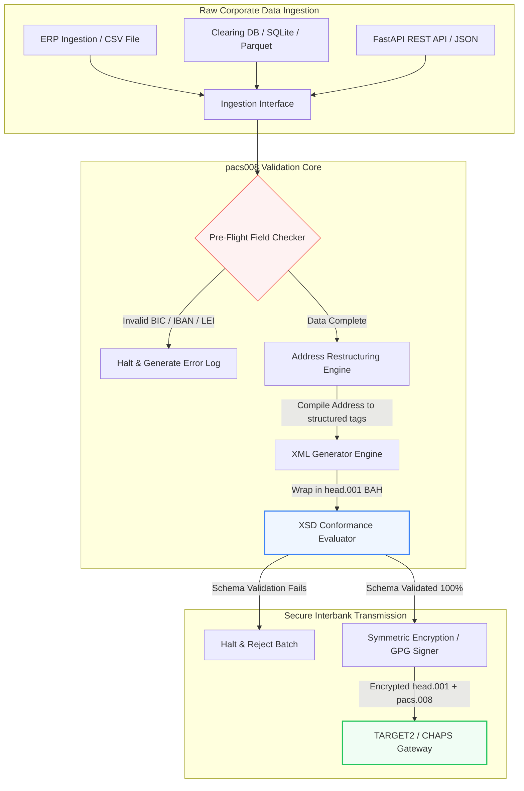

---

# Front Matter (YAML)

author: "contact@sebastienrousseau.com (Sebastien Rousseau)"
banner_alt: "עובד משרד עם עוזר קולי ומחשב נייד — סמל להודעות התשלום הבין-בנקאיות המובְנות וקריאות-המכונה שאוטומציית pacs.008 הופכת לתכנותיות"
banner_height: "1597"
banner_width: "2584"
banner: "https://cloudcdn.pro/stocks/images/tyler-prahm-lmV3gJSAgbo.webp"
cdn: "https://cloudcdn.pro"
charset: "UTF-8"
cname: "sebastienrousseau.com"
copyright: "© Copyright 2025 - 2026 - Sebastien Rousseau. All rights reserved."
date: "June 15, 2026"
description: "pacs008 היא ספריית Python בקוד פתוח לאוטומציית ייצור ואימות הודעות pacs.008 של ISO 20022 — כתובות מובְנות, עטיפת BAH head.001, סיכומי ביקורת BIC/LEI/IBAN ומעקב UETR ב-OpenTelemetry — לקראת מועד SWIFT בנובמבר 2026."
format-detection: "telephone=no"
hreflang: "he"
icon: "https://cloudcdn.pro/clients/sebastienrousseau/v1/logos/sebastienrousseau.svg"
id: "https://sebastienrousseau.com/2026-06-15-pacs008-automation-iso-20022-interbank-payments-2026"
image_alt: "Black and White Portrait of Sebastien Rousseau"
image_height: "162"
image_width: "162"
image: "https://cloudcdn.pro/stocks/images/sebastienrousseau.webp"
keywords: "pacs008, ISO 20022 pacs.008, העברה אשראית של לקוח בין מוסדות פיננסיים, כתובת מובנית, SWIFT CBPR+, BAH head.001, TARGET2, CHAPS, Fedwire, DORA, BCBS 239, Basel III, UETR, אימות LEI, SEPA VoP"
language: "he-IL"
last_reviewed: "2026-06-15"
layout: "report"
locale: "he_IL"
logo_alt: "Logo for Sebastien Rousseau"
logo_height: "44"
logo_width: "44"
logo: "https://cloudcdn.pro/clients/sebastienrousseau/v1/logos/sebastienrousseau.svg"
menu: ""
measurementID: "G-169G4ET5HQ"
name: "Sebastien Rousseau"
permalink: "https://sebastienrousseau.com/2026-06-15-pacs008-automation-iso-20022-interbank-payments-2026"
rating: "general"
referrer: "no-referrer"
robots: "index, follow"
schema: "FAQPage, Article"
seo_title: "אוטומציית pacs.008 לעידן ISO 20022"
short_name: "sebastienrousseau"
subtitle: "הודעת pacs.008 היא הנקודה שבה נתוני תשלום בין-בנקאי, כתובות מובְנות, ציות, ניתוב ופעולות סליקה נפגשים."
tags: "pacs008, ISO 20022, תשלומים בין-בנקאיים, תשלומים סיטונאיים, Python"
theme-color: "0, 83, 191"
title: "בניית אוטומציית pacs.008 לעידן הבין-בנקאי של ISO 20022 ב-2026"
url: "https://sebastienrousseau.com/2026-06-15-pacs008-automation-iso-20022-interbank-payments-2026"
viewport: "width=device-width, initial-scale=1, shrink-to-fit=no"

# RSS - The RSS feed front matter (YAML).
atom_link: "https://sebastienrousseau.com/2026-06-15-pacs008-automation-iso-20022-interbank-payments-2026/rss.xml"
category: "Finance"
docs: https://validator.w3.org/feed/docs/rss2.html
generator: "Static Site Generator (SSG) (version 0.0.26)"
item_description: "pacs008 מספקת בסיס Python בקוד פתוח לאוטומציית הודעות pacs.008 של ISO 20022 להעברה אשראית של לקוח בין מוסדות פיננסיים בעידן התשלומים הבין-בנקאיים."
item_guid: "https://sebastienrousseau.com/2026-06-15-pacs008-automation-iso-20022-interbank-payments-2026/rss.xml"
item_link: "https://sebastienrousseau.com/2026-06-15-pacs008-automation-iso-20022-interbank-payments-2026/rss.xml"
item_pub_date: "Mon, 15 Jun 2026 06:06:06 +0000"
item_title: "בניית אוטומציית pacs.008 לעידן הבין-בנקאי של ISO 20022 ב-2026"
last_build_date: "Mon, 15 Jun 2026 06:06:06 +0000"
managing_editor: "contact@sebastienrousseau.com (Sebastien Rousseau)"
pub_date: "Mon, 15 Jun 2026 06:06:06 +0000"
ttl: "60"
type: "article"
webmaster: "contact@sebastienrousseau.com"

# Apple - The Apple front matter (YAML).
apple_mobile_web_app_orientations: "portrait"
apple_touch_icon_sizes: "192x192"
apple-mobile-web-app-capable: "yes"
apple-mobile-web-app-status-bar-inset: "black"
apple-mobile-web-app-status-bar-style: "black-translucent"
apple-mobile-web-app-title: "אוטומציית pacs.008 לעידן ISO 20022"
apple-touch-fullscreen: "yes"

# MS Application - The MS Application front matter (YAML).

msapplication-navbutton-color: "0, 83, 191"

# Twitter Card - The Twitter Card front matter (YAML).

twitter_card: "summary_large_image"
twitter_creator: "@wwdseb"
twitter_description: "pacs008 מספקת בסיס Python בקוד פתוח לאוטומציית הודעות pacs.008 של ISO 20022 להעברה אשראית של לקוח בין מוסדות פיננסיים בעידן התשלומים הבין-בנקאיים."
twitter_image: "https://cloudcdn.pro/clients/sebastienrousseau/v1/logos/sebastienrousseau.svg"
twitter_image_alt: "Logo of Sebastien Rousseau"
twitter_site: "@wwdseb"
twitter_title: "אוטומציית pacs.008 לעידן ISO 20022"
twitter_url: "https://sebastienrousseau.com/2026-06-15-pacs008-automation-iso-20022-interbank-payments-2026"

excerpt: "pacs008 היא ערכת כלים בקוד פתוח ב-Python שהופכת הודעות pacs.008 של ISO 20022 להעברה אשראית של לקוח בין מוסדות פיננסיים לתכנותיות — כתובות מובְנות, אימות, ניתוב, וו ציות והמועד האחרון של SWIFT בנובמבר 2026 מובנים כברירות מחדל."

# Humans.txt - The Humans.txt front matter (YAML).
author_website: "https://sebastienrousseau.com"
author_twitter: "@wwdseb"
author_location: "London, UK"
thanks: "תודה שקראתם!"
site_last_updated: "2026-06-15"
site_standards: "HTML5, CSS3, RSS, Atom, JSON, XML, YAML, Markdown, TOML"
site_components: "Kaishi, Kaishi Builder, Kaishi CLI, Kaishi Templates, Kaishi Themes"
site_software: "Static Site Generator, Rust"

---

# אוטומציית תשלומים בין-בנקאיים pacs.008 של ISO 20022 ב-Python בקוד פתוח ב-2026

<!-- lead-start -->
<aside class="post-lead" aria-label="תקציר המאמר">

<strong>תקציר.</strong> במסגרת הנחיות SWIFT CBPR+, מצוק הכתובות המובְנות ב-14 בנובמבר 2026 מסיר את הכתובות הדואריות הלא מובְנות מ-TARGET2, CHAPS, Fedwire, Lynx ו-SEPA. pacs008 היא ספריית Python בקוד פתוח שמבצעת אוטומציה של ייצור ואימות הודעות pacs.008 של ISO 20022 (העברה אשראית של לקוח בין מוסדות פיננסיים), עוטפת תשלומים ב-Business Application Headers (BAH head.001) ומטמיעה ציות לכתובת מובְנית בנתיב הנתונים לפני שההודעה נוגעת ברשת סליקה.

<strong>נקודות מפתח</strong>

<ul class="post-lead-takeaways">
  <li><strong>המועד האחרון לכתובת מובְנית הוא מוחלט.</strong> לאחר 14 בנובמבר 2026, בלוקי הכתובות הלא מובְנות יוצאים משימוש. pacs008 אוכפת רכיבי כתובת דואר מובְנים (<code>&lt;TwnNm&gt;</code>, <code>&lt;Ctry&gt;</code>, <code>&lt;PstCd&gt;</code>) בעת הידור הנתונים כדי למנוע דחיות בגבול הרשת.</li>
  <li><strong>תזמור הודעות מאוחד.</strong> עוטף את עומס המטען של pacs.008 במעטפת Business Application Header (head.001) תואמת, ומספק מודל סטנדרטי של עיבוד הלוך ושוב.</li>
  <li><strong>שלמות אלגוריתמית.</strong> מאמתים מובְנים ל-BIC ולמזהי ישות משפטית (LEI) באמצעות חישובי סיכום ביקורת ISO 7064 Modulo 97-10.</li>
  <li><strong>עקיבות ברמת DORA.</strong> מכשור OpenTelemetry מלא הממופה ל-Unique End-to-End Transaction Reference (UETR) ליומני ביקורת בזמן אמת ולחתימות ביקורת קריפטוגרפיות.</li>
  <li><strong>שמירה על אחריות נאמנותית ברמת הדירקטוריון.</strong> מיישר את דיוק ההודעות הבין-בנקאיות עם סעיף 5 של DORA, דיווח BCBS 239 וחיסכון בהון של סיכון תפעולי לפי Basel III.</li>
</ul>

<strong>קריאה משלימה:</strong> <a href="https://sebastienrousseau.com/2026-05-19-global-wholesale-payments-economics-2026">תשלומים סיטונאיים גלובליים ב-2026: ISO 20022, חידוש RTGS וכלכלת האינטראופרביליות</a>, <a href="https://sebastienrousseau.com/2026-05-27-ai-operating-system-payments-fraud-routing-resilience-compliance-2026">בינה מלאכותית כמערכת ההפעלה של התשלומים: הונאה, ניתוב, חוסן וציות ב-2026</a>, <a href="https://sebastienrousseau.com/2026-05-12-iso-20022-pacs008-structured-address-deadline">המועד האחרון לכתובת מובְנית של pacs.008 בנובמבר 2026: מבט של שישה חודשים</a>.

</aside>
<!-- lead-end -->

גישור על הפער בין נתונים פיננסיים מדור קודם להעברת הודעות בין-בנקאיות מובְנות באמצעות צינור Python בר-ביקורת ומאומת-סכמה.

נקודת הייחוס בקוד פתוח למאמר הזה היא [pacs008 ⧉](https://github.com/sebastienrousseau/pacs008 "pacs008 — ספריית Python בקוד פתוח"). המאגר ממוצב כספריית Python לאוטומציית הודעות XML של pacs.008 של ISO 20022 להעברה אשראית של לקוח בין מוסדות פיננסיים.

## מדוע פרויקט הקוד הפתוח הזה חשוב ב-2026

תשתית הסליקה הבין-בנקאית הגלובלית עוברת את המודרניזציה העמוקה ביותר שלה בכמעט חצי מאה.

ביוני 2026, ענף השירותים הפיננסיים מתקרב במהירות אל **מצוק הכתובות המובְנות של SWIFT ב-14 בנובמבר 2026**. החל מתאריך זה, הנחיות SWIFT CBPR+, יחד עם TARGET2, CHAPS, Fedwire ו-Lynx הקנדית, יוציאו רשמית משימוש את שורות הכתובת הדואריות הלא מובְנות (השימוש רק ב-`<AdrLine>` בתוך בלוקי `<PstlAdr>`). כל המוסדות הפיננסיים המשתתפים חייבים להעביר כתובות בפורמט היברידי (`<TwnNm>` ו-`<Ctry>` מובְנים, עם מקסימום שני רכיבי `<AdrLine>` לפרטים הנותרים) או בפורמט מובְנה לחלוטין (רכיבים נפרדים לשם רחוב, מספר בניין ומיקוד). כל הודעה שלא תעמוד בקריטריון הזה תידחה בגבול הרשת.

עבור מוסדות פיננסיים, המעבר הזה יוצר אילוצים תפעוליים מהותיים:

1. **קנס דחייה בגבול.** תשלומים שלא יעמדו בקריטריוני הכתובת המובְנית יתקלו בדחיות רשת מיידיות, ויעוררו עיכובים בעסקאות, חסימות נזילות ופיגורים תפעוליים.
2. **SEPA Verification of Payee (VoP).** מחייבת את כל ספקי שירותי התשלום (PSPs) באזור ה-SEPA לאמת את ההתאמה בין שם המוטב לבין ה-IBAN לפני ביצוע העברה אשראית, ומוסיפה שער אימות נוסף ביזימת ההודעה.

[pacs008](https://github.com/sebastienrousseau/pacs008) פותרת את הבעיה הזו. זוהי ספריית Python קלת משקל בקוד פתוח שמבצעת אוטומציה של המרת נתונים פיננסיים גולמיים להודעות pacs.008 להעברה אשראית של לקוח בין מוסדות פיננסיים — מאומתות במלואן ותואמות לסכמה. על ידי גישור על פער הנתונים בין מדור קודם למובְנה, pacs008 מספקת Return on Resilience (RoR) גבוה, שמר על הון חוזר ומאבטח ביצוע בזמן אמת על פני מסלולים גלובליים.

## למה בניתי את pacs008 כך

אני כתבתי את `pacs008` ואת אחותה שבמעלה הזרם, `pain001`, ואת חיי המקצועיים אני
מבלה בתשלומים סיטונאיים ובניהול מוצר של ממשקי תכנות. הצירוף הזה הוא הסיבה לצורתה
של הספרייה, ולכן ראוי לומר את ההכרעות האלה במפורש במקום להשאיר אותן משתמעות בתוך
הקוד.

**האימות רץ לפני ההפקה, לא אחריה.** האינסטינקט ברוב מערכות התשלומים הוא לייצר
תחילה את ההודעה ורק אז לבדוק אותה, מפני שמחזור הביקורת עוצב כך: נוצר קובץ, מישהו
מעיף בו מבט, והחריגים נכנסים לתור. הסדר הזה מבטיח שהפגמים יימצאו בנקודה בעלת
המינוף הנמוך ביותר — אחרי שמלאכת הרכבת ההודעה כבר הסתיימה, ולעיתים קרובות אחרי
שההודעה כבר יצאה מהמוסד. אימות מוקדם פירושו שכתובת שאינה תואמת או IBAN פגום הופכים
לכישלון בנייה במקום לדחייה מצד הרשת.

**הרישיון הוא MIT מפני שבנקים חייבים לקרוא את לוגיקת האימות, לא לתת בה אמון.**
מאמת סגור מבקש מהמוסד לקבל מתוך אמון את הפרשנות של מישהו אחר להנחיות השימוש. זו
אינה בקשה סבירה מצוות הנושא בחובה רגולטורית. כל כלל בספרייה הזו ניתן לבדיקה,
לערעור ולפיצול.

**האימות נעשה מול סכמות ה-XSD הרשמיות ולא מתוך מימוש מחדש.** קירוב שנכתב ביד
לכללי ISO 20022 סוטה מהחוזה בפועל של הרשת ברגע שאחד הצדדים משתנה. הסכמה היא
החוזה; כל דבר אחר הוא מקור אמת שני שממתין לסתור אותה.

**היא מכוונת ל-CI ולא לשלב ביקורת.** מאמת שאדם צריך לזכור להריץ הוא מאמת שיפסיק
לרוץ תחת לחץ לוחות זמנים — בדיוק ברגע שבו הוא חשוב יותר מכול.

מה שהספרייה נמנעת מלעשות מכוון באותה מידה. זוהי ערכת כלים בשכבת ההודעה. היא אינה
מחליפה מנוע תשלומים, מערכת סינון סנקציות, או את תיקון נתוני האב של הלקוחות שעל
המוסד לבצע במקור. היא הופכת את התיקון הזה לבר-אכיפה; היא אינה עושה אותו במקומך.

## עדשת הארכיטקטורה של pacs008 ב-2026

ספריית pacs008 בנויה כמנוע אימות וייצור מבודד, המבטיח שקלטים גולמיים מנותחים, מועשרים ועטופים במעטפות סטנדרטיות באופן שיטתי:

| שכבה | החלטת תכנון | מדוע זה חשוב | הסיכון בטיפול לקוי |
|---|---|---|---|
| **שכבת קלט** | קליטה של CSV, JSON, SQLite ו-Parquet | פוגשת את צוותי האינטגרציה הבנקאיים במקום שבו הנתונים שלהם כבר נמצאים, ומונעת הגירות פלטפורמה. | קליטה של עומסי נתונים גולמיים, לא מאומתים או פגומים. |
| **שכבת אימות** | אימות מקדים מול סכמות XSD רשמיות וכללים עסקיים מותאמים | עוצרת ביצוע ומסמנת שגיאות לפני שקובץ התשלום נשלח לרשת הסליקה. | קבצי XML לא תקפים שמעוררים דחיות רשת מיידיות ועיכובי סליקה. |
| **שכבת מעטפת BAH** | עטיפה אוטומטית של Business Application Header (head.001) | מתקננת את משלוח וניתוב ההודעות בהתבסס על תגית `<MsgDefIdr>`. | שליחת עומסי pacs.008 גולמיים ללא המעטפה החיצונית הנדרשת, הגורמת לדחייה במערכת. |
| **שכבת סריאליזציה** | תמיכה ב-XML סטנדרטי וב-JSON תואם-ISO (TS 23029) | מאפשרת תרגום ישיר בין עומסי XML ל-JSON, ותומכת ב-REST API מודרני ו-Kafka streaming. | ייצוגי נתונים מקוטעים שמפרים את הנחיות ה-ISO הרשמיות. |
| **שכבת עקיבות** | מעקב OpenTelemetry הממופה ל-UETR | תופס נתיבי ביצוע ויומנים מפורטים, ומספק יכולת ביקורת בזמן אמת. | פערי מעקב החוסמים נראות תפעולית וביקורת. |

## אותות בין-בנקאיים מרכזיים ואבני דרך רגולטוריות

כדי להוכיח חוסן תפעולי בעסקאות, על מנהלי טכנולוגיה וסיכון בכירים לעקוב אחר מדדי ציות ספציפיים וכמותיים:

| אות | מדד / מבחן תפעולי | הפניית G20 / SWIFT / DORA | מימוש בפלטפורמה הטכנית |
|---|---|---|---|
| **ציות לכתובת מובְנית** | אחוז הודעות pacs.008 שמשתמשות בשדות `<PstlAdr>` מובְנים לחלוטין עם `<TwnNm>` ו-`<Ctry>` מוגדרים. | מועד SWIFT SR 2026 | בדיקות סכמה מקדימות ב-pacs008 שדוחות שורות כתובת לא מובְנות. |
| **SEPA Verification of Payee** | אימות התאמה בין שם המוטב ל-IBAN לפני ביצוע ההודעה. | רגולציית SEPA VoP | מחלקות עזר VoP מובְנות שמבצעות שאילתות אימות מקדים על IBAN/BIC. |
| **אינטגרציית BAH head.001** | אחוז עומסי התשלום היוצאים שנעטפו בהצלחה ב-Business Application Headers. | הנחיות TARGET2 / CBPR+ | תת-מערכת עטיפת BAH שמהדרת אוטומטית את מעטפת ה-XML החיצונית. |
| **סיכום ביקורת Modulo של LEI** | אימות ספרת ביקורת ISO 7064 Modulo 97-10 על בלוקי `<LEI>` של החייב והנושה. | מנדט של Bank of England | בודק אלגוריתמי שמאמת את שלמות המזהה בן 20 התווים. |
| **דיוק מעקב UETR** | 100% מהתשלומים המיוצרים מוזרקים עם Unique End-to-End Transaction Reference תקף. | מפרטי UETR של SWIFT | ייצור ומעקב אוטומטיים של קוד הייחוס UUIDv4 בן 36 התווים. |

## מדוע Python היא דרך הגישה האידיאלית לאוטומציה בין-בנקאית

מרכזי תשלומים מודרניים וצוותי פעולות אוצר ב-2026 מסתמכים במידה רבה על Python לטרנספורמציית נתונים, מודלים פיננסיים ואינטגרציית מסדי נתונים של ERP.

על ידי שימוש בספריית Python בקוד פתוח, מוסדות משיגים יתרונות משמעותיים:

1. **עומס קוגניטיבי נמוך ואינטראופרביליות גבוהה.** Python משמש כגשר מלכד. הוא מאפשר למפתחים לכתוב סקריפטים פשוטים שמושכים הוראות תשלום גולמיות ממסדי נתונים מדור קודם, מאמתים אותן מול כללים בנקאיים בינלאומיים מורכבים, ומוציאים XML תואם בתוך תהליך עבודה אחיד ומאוחד.
2. **חיסול של מתרגמים אטומים מסוג "קופסה שחורה".** פורטלי בנקאות קנייניים גובים לעיתים קרובות דמי רישוי גבוהים עבור מתרגמי קבצי תשלום מותאמים אישית. מתרגמים אלה הם קופסאות שחורות קנייניות, שמחייבות את בלתי-אפשרות הביקורת של צוותי אבטחה על אופן עיבוד הנתונים או היכן מאוחסנים מפתחות. ספרייה בקוד פתוח ובת-בחינה כמו pacs008 מבטיחה שקיפות קוד מלאה.
3. **אינטגרציה חלקה ב-CI/CD.** pacs008 משתלבת ישירות בצינורות אינטגרציה ופריסה רציפים, ומאפשרת למפתחים לבצע אוטומציה של בדיקות קבצי תשלום כחלק מסבב חיי האספקה הסטנדרטי של תוכנה.

## תכנון צינור בין-בנקאי תחום

פגיעות מרכזית בסליקה הבין-בנקאית היא "ייצור אצוות לא מבוקר" — ייצור קבצים ללא לולאת אימות ברורה ותחומה. pacs008 מתוכננת לפעול כמנוע האימות המרכזי בתוך צינור עסקאות מבוקר היטב ורב-שלבי.

הזרימה התפעולית להלן מראה כיצד נתוני עסקה גולמיים עוברים דרך צינור ה-pacs008 לייצור קובץ pacs.008 מאובטח קריפטוגרפית ותואם-סכמה, עטוף במעטפת BAH:

## ספר המשחק של הדירקטוריון ואחריות נאמנותית

אוטומציית תשלומים בין-בנקאיים היא סוגיית ניהול סיכונים וממשל תאגידי ברמת הדירקטוריון. על מנהלים בכירים להתייחס לאיכות נתוני העסקאות דרך עדשת האחריות הנאמנותית והפחתת סיכונים תפעוליים:

- **סעיף 5 של DORA (אחריות הדירקטוריון).** מטיל אחריות אישית ישירה על חברי הדירקטוריון על חוסן ואבטחת פעולות ה-ICT של המוסד. מאחר שסליקה בין-בנקאית היא פונקציה תאגידית קריטית, על דירקטוריונים להוכיח שהם יישמו בקרות עסקאות חזקות, מאומתות ואוטומטיות כדי למנוע שיבושים תפעוליים או עיכובי תשלום.
- **BCBS 239 (אגרגציית ודיווח של נתוני סיכון).** מחייב שדיווח עסקאות פיננסי יהיה מדויק, שלם ויוצר בזמן אמת. pacs008 עוזרת למוסדות להשיג ציות ל-BCBS 239 על ידי הבטחה שנתוני התשלום מובְנים ומאומתים נקי במקור, ומחסלת את פערי הנתונים ושגיאות ההתאמה הידנית שפוקדים גיליונות מדור קודם.
- **הפחתת חיובי הון של סיכון תפעולי (Basel III).** לפי הנחיות Basel III, שיעורי שגיאה גבוהים בתשלומים ותקורת התערבות ידנית מגדילים את דרישות ההון של הסיכון התפעולי של הבנק, וקושרים הון שאחרת ניתן היה לפרוס להלוואות או להשקעה. אוטומציה של צינור התשלומים מצמצמת ישירות את הפרמיות ההוניות הללו, ושומרת על ערך המאזן.

## מה זה אומר לפי סוג בנק

### בנקים בעלי חשיבות מערכתית גלובלית (G-SIBs)

G-SIBs מנהלים נפחי עסקאות תאגידיות חוצי גבולות עצומים. האתגר העיקרי שלהם הוא תיקון נתונים מדור קודם לא מובְנים לפני שהם מגיעים לרשת הסליקה. על ידי שילוב pacs008 בשערי הבנקאות העסקית שלהם, G-SIBs יכולים לספק כלי אימות אוטומטיים ללקוחות התאגידיים שלהם, להפחית את התקורה של תיקוני תשלום ידניים ולאבטח ביצוע בזמן אמת על פני רשת SWIFT.

### בנקי עסקאות ובנקים תאגידיים

עבור בנקי עסקאות, איכות נתוני התשלום היא בידול תחרותי. על ידי הצעת כלי אימות בקוד פתוח ובר-בחינה כמו pacs008 ללקוחות אוצר תאגידיים, בנקים אלה יכולים להאיץ הצטרפות, למזער דחיות של קבצי תשלום ולבנות אמון לקוחות באמצעות שיעורי straight-through processing מעולים.

### בנקים אזוריים וקטנים יותר

בנקים אזוריים חייבים לשמור על ציות לתקני תשלום בינלאומיים ללא תקציבי הטכנולוגיה המסיביים של G-SIBs. pacs008 מספקת פתרון Python קל משקל, חסכוני וצייתני לחלוטין, ומאפשרת למוסדות קטנים יותר להציע יכולות יזימת תשלום מודרניות ומובְנות ללא רישיונות יקרים של תוכנת ביניים קניינית.

## מסקנה: מפת הדרכים של הסליקה הבין-בנקאית

המועד האחרון של SWIFT לכתובות מובְנות בנובמבר 2026 מייצג גבול קשיח לפעולות אוצר תאגידיות. הסתמכות על גיליונות מדור קודם, הזנת נתונים ידנית וקבצי תשלום לא מובְנים היא סיכון עסקי פעיל.

כדי לאבטח רציפות עסקאות ולמזער תקורה תפעולית, על מנהלי טכנולוגיה ופיננסים בכירים לבצע מפת דרכי סליקה ברורה היום:

1. **אכפו אימות במקור.** חייבו שכל הוראות התשלום יאומתו וייפורמטו בהתאם לסכמות XSD רשמיות של ISO 20022 לפני שיעזבו את גבולות ה-ERP התאגידי.
2. **בקרו את צינור הנתונים.** עברו מעיבוד גיליונות ידני ויישמו תהליכי עבודה אוטומטיים, ברי-בחינה ומבוססי-Python באמצעות pacs008.
3. **יישמו אבטחה היברידית.** ודאו שקבצי התשלום המיוצרים חתומים קריפטוגרפית ומוצפנים לפני העברה, ועומדים בציפיות רשת zero-trust.
4. **יישרו לפי עדיפויות נאמנותיות.** דווחו רשמית על מדדי אוטומציית תשלום ואיכות נתונים לדירקטוריון, ומסגרו את ההשקעה כתוכנית הפחתת סיכון תפעולי קריטית לפי DORA.

## שאלות נפוצות

**האם pacs008 תואמת לכללי הכתובת הצפויים של SWIFT SR 2026?**

כן. pacs008 מתוכננת לתמוך באבן הדרך הקשיחה של SWIFT לכתובת מובְנית בנובמבר 2026, ואוכפת את ההפרדה החובה של רכיבי כתובת דואר (עיר, מדינה, מיקוד) לשדות XML מוגדרים של ISO 20022.

**האם pacs008 יכולה לעטוף עומסי תשלום ב-Business Application Headers?**

כן. מכיוון ש-pacs008 תומכת באופן מקורי בעטיפת Business Application Header (BAH head.001), היא מהדרת אוטומטית את המעטפת החיצונית הנדרשת על ידי רשתות TARGET2, CHAPS ו-CBPR+.

**מדוע ספרייה בקוד פתוח עדיפה על מתרגמי קבצים קנייניים?**

מתרגמים קנייניים הם קופסאות שחורות אטומות, שהופכות ביקורות אבטחה לבלתי אפשריות. ספרייה בקוד פתוח שנבחנת על ידי עמיתים כמו pacs008 מציעה שקיפות קוד מלאה, ומאפשרת לצוותי אבטחה לוודא שאין חשיפת נתוני תשלום רגישים במהלך העיבוד.

**אילו מזהים pacs008 מאמתת?**

pacs008 מגיעה עם מאמתים מובְנים ל-Bank Identifier Codes (BICs) ולמזהי ישות משפטית (LEIs) באמצעות חישובי סיכום ביקורת ISO 7064 Modulo 97-10, בנוסף לאימות ספרת ביקורת של IBAN ובדיקות ייחודיות של UETR.

## הפניות

- SWIFT, (2024). *ISO 20022 November 2026 Structured Address Milestone*. La Hulpe: SWIFT. זמין ב: [אבן הדרך של SWIFT ISO 20022 ⧉](https://www.swift.com/standards/iso-20022/iso-20022-bytes/call-action-november-2026 "אבן הדרך של SWIFT ISO 20022").
- Basel Committee on Banking Supervision (BCBS), (2013). *Principles for effective risk data aggregation and risk reporting (BCBS 239)*. Basel: Bank for International Settlements. זמין ב: [עקרונות BCBS 239 ⧉](https://www.bis.org/publ/bcbs239.htm "עקרונות BCBS 239").
- European Parliament and Council of the European Union, (2022). *Regulation (EU) 2022/2554 on digital operational resilience for the financial sector (DORA)*. Brussels: Official Journal of the European Union. זמין ב: [רגולציית DORA ⧉](https://eur-lex.europa.eu/legal-content/EN/TXT/?uri=CELEX%3A32022R2554 "רגולציית DORA").
- GitHub, (2026). *מאגר pacs008 בקוד פתוח*. זמין ב: [מאגר pacs008 ⧉](https://github.com/sebastienrousseau/pacs008 "מאגר pacs008").

<!-- enrich-start -->
<aside class="author-card" aria-label="אודות המחבר"><strong class="author-card-name"><a href="/about/index.html">סבסטיאן רוסו</a></strong>טכנולוג בנקאי בכיר הכותב על בינה מלאכותית יישומית, הגירת ISO 20022, קריפטוגרפיה פוסט-קוונטית לשירותים פיננסיים והטרנספורמציה המבנית של תשלומים סיטונאיים.למעלה מ-20 שנים ב-HSBC Commercial &amp; Investment Bank, PayPal, Barclays, Shazam, AKQA, Virgin Group. <a href="/about/index.html">פרופיל מלא</a> &middot; <a href="https://www.linkedin.com/in/sebastienrousseau/" rel="external noopener">LinkedIn</a> &middot; <a href="https://github.com/sebastienrousseau" rel="external noopener">GitHub</a></aside>

נבדק לאחרונה <time datetime="2026-06-15">2026-06-15</time>.

<aside class="related-posts" aria-labelledby="related-heading">
<h2 id="related-heading" class="related-heading">קריאה משלימה</h2>

<article class="related-card"><footer class="related-body"><h3><a href="https://sebastienrousseau.com/2026-05-19-global-wholesale-payments-economics-2026">תשלומים סיטונאיים גלובליים ב-2026: ISO 20022, חידוש RTGS וכלכלת האינטראופרביליות</a></h3>
<time datetime="2026-05-19">2026-05-19</time>
</footer></article>
<article class="related-card"><footer class="related-body"><h3><a href="https://sebastienrousseau.com/2026-05-27-ai-operating-system-payments-fraud-routing-resilience-compliance-2026">בינה מלאכותית כמערכת ההפעלה של התשלומים: הונאה, ניתוב, חוסן וציות ב-2026</a></h3>
<time datetime="2026-05-27">2026-05-27</time>
</footer></article>
<article class="related-card"><footer class="related-body"><h3><a href="https://sebastienrousseau.com/2026-05-12-iso-20022-pacs008-structured-address-deadline">המועד האחרון לכתובת מובְנית של pacs.008 בנובמבר 2026: מבט של שישה חודשים</a></h3>
<time datetime="2026-05-12">2026-05-12</time>
</footer></article>

</aside>
<!-- enrich-end -->
