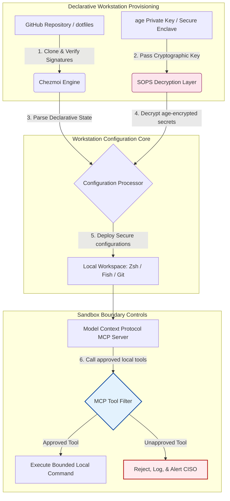

---

# Front Matter (YAML)

author: "contact@sebastienrousseau.com (Sebastien Rousseau)"
banner_alt: "תחנת עבודה למפתח באור עמום — מסמלת dotfiles מודעי AI, ניתנים לשחזור ומאובטחים עבור שרתי MCP, חתימת SLSA, סודות age/SOPS ותאימות רב-shell"
banner_height: "1597"
banner_width: "2584"
banner: "https://cloudcdn.pro/stocks/images/almas-salakhov-Vq2ap8aFFEs.webp"
cdn: "https://cloudcdn.pro"
charset: "UTF-8"
cname: "sebastienrousseau.com"
copyright: "© Copyright 2025 - 2026 - Sebastien Rousseau. All rights reserved."
date: "June 16, 2026"
description: "dotfiles מודעי AI הם דפוס תחנת עבודה מאובטחת וניתנת לשחזור לעידן MCP — תצורה דקלרטיבית באמצעות Chezmoi, סודות SOPS/age, מקור SLSA רמה 3, תאימות רב-shell וגבולות סנדבוקס תחומים לסוכני AI מקומיים."
format-detection: "telephone=no"
hreflang: "he"
icon: "https://cloudcdn.pro/clients/sebastienrousseau/v1/logos/sebastienrousseau.svg"
id: "https://sebastienrousseau.com/2026-06-16-ai-aware-dotfiles-secure-reproducible-workstation-2026"
image_alt: "Black and White Portrait of Sebastien Rousseau"
image_height: "162"
image_width: "162"
image: "https://cloudcdn.pro/stocks/images/sebastien-rousseau.png"
keywords: "dotfiles, Chezmoi, MCP, Model Context Protocol, SLSA, SOPS, הצפנת age, תצורה דקלרטיבית, תחנת עבודה למפתח, DORA סעיף 5, NIST CSF 2.0, אבטחת שרשרת אספקה, AI סוכני, תאימות רב-shell, Zsh, Fish, Nushell"
language: "he-IL"
last_reviewed: "2026-06-16"
layout: "report"
locale: "he_IL"
logo_alt: "Logo for Sebastien Rousseau"
logo_height: "44"
logo_width: "44"
logo: "https://cloudcdn.pro/clients/sebastienrousseau/v1/logos/sebastienrousseau.svg"
menu: ""
measurementID: "G-169G4ET5HQ"
name: "Sebastien Rousseau"
permalink: "https://sebastienrousseau.com/2026-06-16-ai-aware-dotfiles-secure-reproducible-workstation-2026"
rating: "general"
referrer: "no-referrer"
robots: "index, follow"
schema: "FAQPage, Article"
seo_title: "dotfiles מודעי AI לתחנת עבודה מאובטחת למפתח"
short_name: "sebastienrousseau"
subtitle: "תחנת העבודה למפתח היא כיום חלק משרשרת האספקה של ה-AI; dotfiles זקוקים לאבטחה, ניתנות לשחזור, היגיינת סודות וזרימות עבודה מודעות MCP."
tags: "dotfiles, כלי מפתח, MCP, SLSA, תחנת עבודה מאובטחת, chezmoi, macOS, Linux, WSL"
theme-color: "0, 83, 191"
title: "dotfiles מודעי AI ב-2026: בניית תחנת עבודה מאובטחת וניתנת לשחזור ל-MCP, SLSA ותאימות רב-shell"
url: "https://sebastienrousseau.com/2026-06-16-ai-aware-dotfiles-secure-reproducible-workstation-2026"
viewport: "width=device-width, initial-scale=1, shrink-to-fit=no"

# RSS - The RSS feed front matter (YAML).
atom_link: "https://sebastienrousseau.com/2026-06-16-ai-aware-dotfiles-secure-reproducible-workstation-2026/rss.xml"
category: "Technology"
docs: https://validator.w3.org/feed/docs/rss2.html
generator: "Static Site Generator (SSG) (version 0.0.26)"
item_description: "מבט על dotfiles דקלרטיביים לתחנות עבודה מאובטחות וניתנות לשחזור ב-macOS, Linux ו-WSL, עם מודעות MCP, SLSA, age, SOPS ותאימות רב-shell."
item_guid: "https://sebastienrousseau.com/2026-06-16-ai-aware-dotfiles-secure-reproducible-workstation-2026/rss.xml"
item_link: "https://sebastienrousseau.com/2026-06-16-ai-aware-dotfiles-secure-reproducible-workstation-2026/rss.xml"
item_pub_date: "Tue, 16 Jun 2026 06:06:06 +0000"
item_title: "dotfiles מודעי AI ב-2026: בניית תחנת עבודה מאובטחת וניתנת לשחזור ל-MCP, SLSA ותאימות רב-shell"
last_build_date: "Tue, 16 Jun 2026 06:06:06 +0000"
managing_editor: "contact@sebastienrousseau.com (Sebastien Rousseau)"
pub_date: "Tue, 16 Jun 2026 06:06:06 +0000"
ttl: "60"
type: "article"
webmaster: "contact@sebastienrousseau.com"

# Apple - The Apple front matter (YAML).
apple_mobile_web_app_orientations: "portrait"
apple_touch_icon_sizes: "192x192"
apple-mobile-web-app-capable: "yes"
apple-mobile-web-app-status-bar-inset: "black"
apple-mobile-web-app-status-bar-style: "black-translucent"
apple-mobile-web-app-title: "dotfiles מודעי AI לתחנת עבודה מאובטחת"
apple-touch-fullscreen: "yes"

# MS Application - The MS Application front matter (YAML).

msapplication-navbutton-color: "0, 83, 191"

# Twitter Card - The Twitter Card front matter (YAML).

twitter_card: "summary_large_image"
twitter_creator: "@wwdseb"
twitter_description: "מבט על dotfiles דקלרטיביים לתחנות עבודה מאובטחות וניתנות לשחזור ב-macOS, Linux ו-WSL, עם מודעות MCP, SLSA, age, SOPS ותאימות רב-shell."
twitter_image: "https://cloudcdn.pro/clients/sebastienrousseau/v1/logos/sebastienrousseau.svg"
twitter_image_alt: "Logo of Sebastien Rousseau"
twitter_site: "@wwdseb"
twitter_title: "dotfiles מודעי AI לתחנת עבודה מאובטחת למפתח"
twitter_url: "https://sebastienrousseau.com/2026-06-16-ai-aware-dotfiles-secure-reproducible-workstation-2026"

excerpt: "dotfiles מודעי AI ב-2026 מתייחסים לתחנת העבודה למפתח כאל תשתית שרשרת אספקה — תצורה דקלרטיבית מנוהלת ב-chezmoi עם מודעות MCP, גרסאות חתומות SLSA, סודות age/SOPS, הפעלה מתחת לשנייה ותאימות בין macOS/Linux/WSL."

# Humans.txt - The Humans.txt front matter (YAML).
author_website: "https://sebastienrousseau.com"
author_twitter: "@wwdseb"
author_location: "London, UK"
thanks: "תודה שקראתם!"
site_last_updated: "2026-06-16"
site_standards: "HTML5, CSS3, RSS, Atom, JSON, XML, YAML, Markdown, TOML"
site_components: "Kaishi, Kaishi Builder, Kaishi CLI, Kaishi Templates, Kaishi Themes"
site_software: "Static Site Generator, Rust"

---

# dotfiles מודעי AI ב-2026: בניית תחנת עבודה מאובטחת וניתנת לשחזור ל-MCP, SLSA ותאימות רב-shell

<!-- lead-start -->
<aside class="post-lead" aria-label="תקציר המאמר">

<strong>תקציר.</strong> תחנת העבודה למפתח אינה עוד נקודת קצה בלבד; היא משתתפת פעילה בשרשרת האספקה של התוכנה וממשק ישיר למישור הבקרה המקומי של ה-AI. עוזרי AI מבוססי טרמינל ושרתי <a href="https://modelcontextprotocol.io">Model Context Protocol (MCP)</a> מפעילים פקודות shell מקומיות, בוחנים מאגרים וקוראים קבצי תצורה רגישים ישירות. <a href="https://github.com/sebastienrousseau/dotfiles">Dotfiles של Sebastien Rousseau</a> הוא מסגרת דקלרטיבית בקוד פתוח הבונה תחנות עבודה מאובטחות וניתנות לשחזור על פני macOS, Linux ו-Windows Subsystem for Linux (WSL) — תוך שילוב <a href="https://www.chezmoi.io/">Chezmoi</a>, <a href="https://github.com/getsops/sops">SOPS, age</a> ומקור בנייה ברמת SLSA Level 3 לבידוד סודות בטוח בזיכרון ולמסלולי הפעלה תחומים עבור מודלי AI מקומיים.

<strong>נקודות מפתח</strong>

<ul class="post-lead-takeaways">
  <li><strong>תחנות עבודה הן תשתית שרשרת אספקה.</strong> יש להתייחס לתצורות סביבת מפתח באותה קפדנות דקלרטיבית כמו לפריסות שרתי ייצור, תוך ביטול סחיפת תצורה ידנית.</li>
  <li><strong>אתגר מישור הבקרה של ה-AI.</strong> מודלי AI מבוססי טרמינל וכלי MCP יכולים לגשת לספריות מקומיות. dotfiles חייבים לאכוף גבולות סנדבוקס תחומים, רשימות הרשאה מחמירות לכלים ויומנים מקומיים בלתי ניתנים לשינוי כדי למנוע דליפת נתונים.</li>
  <li><strong>תאימות מוחלטת בין פלטפורמות.</strong> ביצועי shell זהים ומתחת לשנייה ופרופילי אבטחה על פני macOS, Linux (Zsh, Fish, Nushell) ו-WSL, המקצרים את זמן הקליטה של מפתחים משבועות לדקות.</li>
  <li><strong>בידוד סודות מאובטח קריפטוגרפית.</strong> הצפנת קבצים ב-SOPS וב-age עוצרת אישורי גישה מקודדים-קשיח (אסימוני GitHub, מפתחות גישה לענן) מהיכנסות ל-Git או מקריאה על ידי LLMs מקומיים.</li>
  <li><strong>ערך פיננסי ברמת הדירקטוריון.</strong> מתרגם ציות לתצורת תחנת עבודה לעדיפויות ברורות בחדר הישיבות, תומך בסעיף 5 של DORA, תקני נקודות קצה של NIST CSF 2.0 והפחתת סיכון תפעולי של Basel III.</li>
</ul>

<strong>קריאה קשורה:</strong> <a href="https://sebastienrousseau.com/2026-05-23-agentic-payments-banking-consent-liability-new-payment-ux-2026">תשלומים סוכניים בבנקאות: הסכמה, אחריות וחוויית התשלום החדשה ב-2026</a>, <a href="https://sebastienrousseau.com/2024-03-12-revolutionising-real-time-speech-recognition-on-macos-with-openai-whisper/index.html">זיהוי דיבור מהיר בזמן אמת ב-macOS: OpenAI Whisper</a>, <a href="https://sebastienrousseau.com/2024-02-26-google-gemma-ai-transforming-open-source-ai-development/index.html">Google Gemma AI: שינוי פיתוח AI בקוד פתוח</a>.

</aside>
<!-- lead-end -->

גישור בין תצורת תחנת עבודה דקלרטיבית לבין שרשראות אספקה מאובטחות של תוכנה בעידן של מודלי AI מקומיים וכלי מפתחים סוכניים.

נקודת הייחוס בקוד פתוח למאמר זה היא [dotfiles ⧉](https://github.com/sebastienrousseau/dotfiles "dotfiles — תצורת תחנת עבודה דקלרטיבית"). המאגר ממוצב כך: dotfiles דקלרטיביים ל-macOS, Linux ו-WSL, המציעים תאימות רב-shell, הפעלה מתחת לשנייה, גרסאות חתומות SLSA ותצורה מודעת AI/MCP.

## מדוע פרויקט הקוד פתוח הזה חשוב ב-2026

ביוני 2026, תחנת העבודה למפתח היא החוליה החלשה בשרשרת האספקה של התוכנה ויעד בעל ערך גבוה לגופי סייבר ממשלתיים וקבוצות פשע מתוחכמות.

נוף האבטחה של סביבת הפיתוח השתנה באופן רדיקלי עם עליית עוזרי הקידוד מבוססי AI בטרמינל (כגון Claude Code) ואימוץ Model Context Protocol (MCP). טרמינלים מקומיים של מפתחים מארחים כעת סוכני AI אוטונומיים ופעילים, המסוגלים לבצע:

- קריאה ועריכה של קבצי מקור מקומיים.
- קריאה לכלי CLI מקומיים (`git`, `npm`, `aws`, `kubectl`).
- בחינה של משתני סביבת shell, מסדי נתונים מקומיים והגדרות תצורה.

אם לסביבה המקומית של המפתח חסרים גבולות מחמירים, כלי AI אוטונומיים אלה עלולים לקרוא בטעות נתונים אישיים רגישים, להדליף אישורי גישה לענן ל-APIs ציבוריים של LLM, או להפעיל חבילות זדוניות במהלך בנייה אוטומטית.

תחת תקנת החוסן התפעולי הדיגיטלי (DORA) ומסגרת אבטחת הסייבר של NIST (CSF) 2.0, מוסדות פיננסיים מחויבים משפטית לאמת את המקור ואת שלמות האבטחה של כל מכשיר הניגש לשרשרת האספקה של התוכנה. "מחשבי snowflake" — תצורות שהוגדרו ידנית, לא נבדקו ועברו סחיפה — אינם עוד תואמים לתקני הבנקאות הגלובליים.

[Dotfiles של Sebastien Rousseau](https://github.com/sebastienrousseau/dotfiles) פותר את הבעיה הזו. זוהי מסגרת ניהול תחנת עבודה דקלרטיבית בקוד פתוח, המבססת תחנות עבודה מפתחים מאובטחות וניתנות לשחזור. על ידי אכיפת קו בסיס תצורה סטנדרטי וניתן לביקורת, הפרויקט מספק תשואה גבוהה על חוסן (Return on Resilience, RoR), מקצר את זמן קליטת המפתחים משבועות לשעות ומגן על שרשראות אספקה פיננסיות רגישות מפני פגיעות בנקודות קצה.

## עדשת ארכיטקטורת תחנת העבודה מודעת ה-AI 2026

מסגרת ה-dotfiles פועלת כמנהל סביבה דקלרטיבי ומאובטח — כל ה-shells, הכלים והסודות המקומיים מנוהלים, נבדקים ומבודדים באופן שיטתי:

| שכבה | החלטת תכנון | מדוע זה חשוב | סיכון בטיפול שגוי |
|---|---|---|---|
| **שכבת הקצאה** | ניהול תצורה דקלרטיבי באמצעות Chezmoi | בונה תחנות עבודה ניתנות לשחזור מלא על פני macOS, Linux ו-WSL, ומבטל סחיפה. | תצורות snowflake עם מצבים מקומיים פגיעים שלא נבדקו. |
| **שכבת Shell** | תאימות רב-shell (Zsh, Fish, Nushell) | מבטיחה הפעלה זהה ומתחת לשנייה והתנהגות עקבית של כינויים על פני סביבות שונות. | חוסר עקביות בפקודות shell הגורם לתוצאות סקריפט בלתי צפויות. |
| **שכבת סודות** | הצפנת קבצים באמצעות SOPS ו-age | מונעת אישורי גישה מקודדים-קשיח ומפתחות גולמיים מהיכנסות ל-Git או מחשיפה ל-LLMs מקומיים. | אישורי גישה שדלפו להיסטוריות מאגרים ציבוריים או שנפגעו על ידי סוכנים מקומיים. |
| **שכבת AI/MCP** | בקרות גבול של Model Context Protocol | מגבילה סוכני AI מקומיים לרשימה ספציפית של כלים מאושרים, ומתעדת ביומן את כל ההפעלות המקומיות. | סוכני AI לא תחומים המבצעים פקודות מתפרצות או הרסניות מקומית. |
| **שכבת שרשרת אספקה** | גרסאות חתומות SLSA ואימות Sigstore | מוכיחה קריפטוגרפית את האותנטיות של סקריפטי אתחול וקבצי תצורה. | סקריפטי הגדרה שנפגעו ומחדירים דלתות אחוריות זדוניות לסביבות מפתחים. |

## אותות מפתח לאבטחה ולאוטומציה של תחנת העבודה

כדי לשמר אבטחה מוחלטת על פני אחוזת הפיתוח, מנהלי אבטחת המידע הראשיים (CISOs) ומנהלי הטכנולוגיה חייבים לעקוב אחר אינדיקטורים תפעוליים ספציפיים וניתנים לכימות:

| אות | מדד / רף תפעולי | הפניה NIST CSF / DORA | מימוש פלטפורמה טכני |
|---|---|---|---|
| **ניתן לשחזור של תחנת עבודה** | אחוז מחשבי המפתחים המנוהלים באופן מלא באמצעות מאגרי dotfile דקלרטיביים ללא סחיפת תצורה. | NIST CSF 2.0 (PR.DS-01) | ביקורות זיהוי סחיפה של Chezmoi המופעלות אוטומטית בעת הפעלת הטרמינל. |
| **היגיינת אישורי גישה** | אפס סודות או מפתחות לא מוצפנים המאוחסנים בטקסט גלוי על פני קבצי תצורה מקומיים. | DORA סעיף 6 (אבטחת ICT) | git pre-commit hooks וסריקות מקומיות הדוחות קבצים לא מוצפנים. |
| **מקור בנייה** | 100% מכלי האתחול של תחנת העבודה מאומתים באמצעות מניפסטים חתומים קריפטוגרפית. | DORA סעיף 30 (שרשרת אספקה) | אימות Sigstore ו-SLSA Level 3 מוטמע בצינורות ההגדרה. |
| **זמן קליטת מפתח** | זמן שחלף מהקצאת חומרה גולמית ועד לסביבת פיתוח מוגדרת לחלוטין ותואמת. | תשואה על חוסן (RoR) | סקריפטי הגדרה אוטומטיים ודקלרטיביים המהדרים את הסביבה תוך פחות מ-15 דקות. |
| **גישה תחומה של סוכן AI** | אימות שכלי AI מקומיים פועלים בתוך מגבלות ספרייה מוגדרות עם ברירות מחדל לקריאה בלבד. | ניהול סיכוני מודלים | פרופילי תצורת MCP המגבילים את קטלוגי הכלים של הסוכן לפעולות מאושרות. |

## מדוע תצורה דקלרטיבית היא ליבת אבטחת תחנת העבודה

גישות מסורתיות להגדרת תחנת עבודה למפתח הן ידניות מאוד, ומובילות ל"מחשבי snowflake" — סביבות שבהן תצורות סוחפות עם הזמן כאשר מפתחים מתקינים כלים מותאמים אישית, מתאימים משתנים ומשנים סקריפטים מקומיים. סחיפה זו יוצרת מספר פגיעויות קריטיות:

1. **תצורות צל לא מתועדות.** מחשבים סוחפים מריצים לעתים קרובות חבילות תוכנה מיושנות ופגיעות או סקריפטים מקומיים העוקפים את כלי האבטחה התאגידיים.
2. **דליפת סודות.** מפתחים מקודדים תכופות מפתחות API, אסימוני GitHub או אישורי גישה ל-AWS ישירות לתוך סקריפטים בטקסט גלוי או פרופילי shell, מה שהופך אותם פגיעים מאוד לגניבה.
3. **קליטה לא יעילה.** הגדרת תחנת עבודה חדשה למפתח באופן ידני יכולה לקחת עד שבועיים של זמן הנדסה, ומשפיעה על מהירות הצוות.

על ידי מעבר לתצורה דקלרטיבית ומונחת מודל באמצעות Chezmoi, כל סביבת המפתח הופכת למערכת רישום מבוקרת גרסאות וניתנת לשחזור. כל שינוי, כינוי, תלות חבילה וברירת מחדל אבטחה מתועדים ב-Git, מאומתים מול מדיניות הציות הארגונית ומאומתים קריפטוגרפית לפני שהם מיושמים על המחשב הנייד הפיזי.

## תכנון סביבת מפתח AI תחומה

כדי למנוע מסוכני AI מקומיים וכלי MCP לקבל גישה לא תחומה לנכסים מקומיים, תחנת העבודה חייבת לפעול כמישור הפעלה תחום.

תרשים הזרימה התפעולית להלן מציג כיצד מסגרת ה-dotfiles מתאמת בין Chezmoi, SOPS ו-age כדי לפענח ולפרוס dotfiles מאובטחים תוך שמירה על גבול הפעלה מבודד וסנדבוקסי לסוכני AI מקומיים הקוראים לכלי MCP:

## ספר ההפעלה של חדר הישיבות ואחריות פיננסית

אבטחת תחנת העבודה למפתח ושלמות שרשרת האספקה הן עדיפויות קריטיות בחדר הישיבות. מנהלים בכירים חייבים לטפל בסיכון סביבת המפתח דרך עדשת האחריות הפיננסית, הציות הרגולטורי ושימור ערך עסקי:

- **DORA סעיף 5 (אחריות הדירקטוריון).** מחייב שגוף ההנהלה (הדירקטוריון) נושא באחריות הסופית לניהול סיכוני ה-ICT של המוסד. מכיוון שתחנות עבודה למפתחים הן השער לשרשרת האספקה של התוכנה, חברי הדירקטוריון חייבים לאמת שנקודות הקצה מאובטחות, ניתנות לביקורת מלאה ומנוהלות תחת מסגרות תצורה קפדניות וניתנות לשחזור כדי לעמוד בביקורות רגולטוריות.
- **ציות NIST CSF 2.0 (אבטחת נקודות קצה).** דורש שרק מכשירים מורשים ומאומתים, המריצים תצורות סטנדרטיות ומאובטחות, יוכלו לגשת לרשתות ולמאגרים תאגידיים. dotfiles דקלרטיביים מאפשרים לצוותי אבטחה להוכיח מתמטית שכל סביבות המפתחים תואמות לקו הבסיס האבטחתי של הארגון, ומבטלים את הסיכון של הגדרות "snowflake" לא מבוקרות.
- **שימור ערך המאזן.** אישור גישה אחד של מפתח שנפגע או הפרת שרשרת אספקה אחת יכולים לעלות למוסד מיליוני דולרים בהקלה, קנסות רגולטוריים ונזק תדמיתי. מעבר לסביבת מפתח דקלרטיבית ומאובטחת ממזער ישירות סיכון זה, משמר את ערך המאזן ומגן על אמון הלקוחות.

## משמעות לפי סוג בנק

### בנקים בעלי חשיבות מערכתית גלובלית (G-SIBs)

G-SIBs מנהלים אלפי תחנות עבודה למפתחים על פני יבשות וסמכויות רגולטוריות מרובות. האתגר העיקרי שלהם הוא שמירה על עקביות תצורה ומניעת דליפת אישורי גישה על פני צוותי הנדסה מאסיביים. על ידי אימוץ מודל dotfiles דקלרטיבי ובקוד פתוח באמצעות Chezmoi, G-SIBs יכולים לתקנן אבטחת נקודות קצה, להפוך אוטומטית ביקורת ציות ולקצר זמני קליטת מפתחים משבועות לדקות על פני הארגון הגלובלי.

### בנקי טרנזקציות ובנקים תאגידיים

בנקי טרנזקציות מפעילים שערי תשלום רגישים ותשתיות סליקה סיטונאיות. הוכחת שלמות מוחלטת של הקוד הנפרס לסביבות ייצור אלה היא דרישה רגולטורית בלתי מתפשרת. תקינה של תחנות עבודה למפתחים תחת מסגרת dotfiles מאובטחת ותואמת SLSA מבטיחה ששרשרת האספקה של התוכנה נבדקת במלואה ומוגנת מפני פגיעויות נקודות קצה של מפתחים מקומיים.

### בנקים אזוריים וקטנים יותר

בנקים אזוריים חייבים לשמור על תקני אבטחת סייבר גבוהים ללא תקציבי האבטחה המאסיביים של G-SIBs. מסגרת ה-dotfiles בקוד פתוח מספקת פתרון קל משקל, חסכוני ומאובטח מאוד הידידותי ל-Python ול-Rust, ומאפשרת למוסדות קטנים יותר ליישם אבטחת נקודות קצה והגנת שרשרת אספקה ברמה ארגונית ללא רישיונות תוכנה קנייניים יקרים.

## סיכום: מפת הדרכים של תחנת העבודה למפתח

תחנת העבודה למפתח אינה עוד מכשיר היקפי; היא מישור בקרה קריטי בשרשרת האספקה של התוכנה. לאפשר ל"מחשבי snowflake" שהוגדרו ידנית ולא נבדקו לגשת לנכסים תאגידיים הוא סיכון תפעולי ורגולטורי חמור.

כדי לאבטח את שרשרת האספקה של התוכנה ולהגן על נקודות קצה מפני פגיעויות סוכני AI מקומיים, מנהלי טכנולוגיה ואבטחה בכירים צריכים לבצע מפת דרכים פיתוחית ברורה היום:

1. **חיוב הקצאה דקלרטיבית.** הוצאה משימוש של תהליכי הגדרה ידניים מונחי מסמכים וחיוב שכל סביבות המפתחים יוקצו דקלרטיבית באמצעות Chezmoi.
2. **אכיפת היגיינת סודות.** אכיפת pre-commit hooks מחמירים וכלי סריקה כדי להבטיח אפס אישורי גישה גולמיים, מפתחות או אסימוני API מאוחסנים בטקסט גלוי על פני תצורות תחנת עבודה מקומיות.
3. **ביסוס גבולות סנדבוקס AI.** הטמעת פרופילי תצורת MCP מאובטחים ותחומים כדי להגביל עוזרי קידוד וסוכני AI מקומיים לכלים וספריות מאושרים ובקריאה בלבד.
4. **אבטחת שרשרת האספקה.** הבטחה שכל סקריפטי האתחול ותצורות הסביבה מאומתים קריפטוגרפית באמצעות מקור SLSA Level 3 לפני פריסה.

## שאלות נפוצות

**מהו Chezmoi ומדוע משתמשים בו עבור dotfiles?**

Chezmoi הוא מנהל dotfile דקלרטיבי, מאובטח ובקוד פתוח. הוא מאפשר למפתחים לנהל את התצורות המקומיות שלהם כמאגר מבוקר גרסאות, ומבטיח עקביות וניתן לשחזור מוחלטים על פני מערכות הפעלה שונות (macOS, Linux, WSL).

**כיצד המסגרת מגנה על סודות?**

המסגרת משתמשת בהצפנת קבצים של SOPS (Secrets Operations) ו-age כדי להצפין אישורי גישה רגישים (כגון אסימוני GitHub או מפתחות גישה לענן) ישירות בתוך מאגר ה-dotfile. זה מונע ממפתחות להיכנס בטקסט גלוי או להיקרא על ידי סוכני AI מקומיים לא מורשים.

**מהו Model Context Protocol (MCP) וכיצד הוא משפיע על האבטחה?**

MCP הוא תקן פתוח המאפשר למודלי AI להפעיל בבטחה כלים מקומיים ולגשת לקבצים. מסגרת ה-dotfiles מיישמת קבצי תצורת MCP מחמירים כדי להגביל כלי AI וסוכנים מקומיים לספריות ופקודות מאושרים.

**אילו shells המסגרת תומכת?**

Bash, Zsh, Fish, Nushell ו-PowerShell — עם תאימות על פני macOS, Linux ו-WSL כך שהתנהגות הפקודה נשארת זהה ללא קשר לטרמינל שהמפתח פותח.

## הפניות

- Open Source Security Foundation (OpenSSF), (2024). *Supply-chain Levels for Software Artifacts (SLSA)*. זמין בכתובת: [מסגרת SLSA ⧉](https://slsa.dev/ "מסגרת SLSA").
- NIST, (2024). *NIST Cybersecurity Framework 2.0*. Gaithersburg: National Institute of Standards and Technology. זמין בכתובת: [NIST CSF 2.0 ⧉](https://www.nist.gov/cyberframework "NIST Cybersecurity Framework 2.0").
- European Parliament and Council of the European Union, (2022). *Regulation (EU) 2022/2554 on digital operational resilience for the financial sector (DORA)*. Brussels: Official Journal of the European Union. זמין בכתובת: [תקנת DORA ⧉](https://eur-lex.europa.eu/legal-content/EN/TXT/?uri=CELEX%3A32022R2554 "תקנת DORA").
- GitHub, (2026). *מאגר dotfiles בקוד פתוח*. זמין בכתובת: [מאגר dotfiles ⧉](https://github.com/sebastienrousseau/dotfiles "מאגר dotfiles").

<!-- enrich-start -->
<aside class="author-card" aria-label="אודות המחבר"><strong class="author-card-name"><a href="/about/index.html">Sebastien Rousseau</a></strong>טכנולוג בנקאות בכיר הכותב על AI יישומי, הגירת ISO 20022, קריפטוגרפיה פוסט-קוונטית לשירותים פיננסיים והשינוי המבני של תשלומים סיטונאיים.למעלה מ-20 שנה ב-HSBC Commercial &amp; Investment Bank, PayPal, Barclays, Shazam, AKQA, Virgin Group. <a href="/about/index.html">פרופיל מלא</a> &middot; <a href="https://www.linkedin.com/in/sebastienrousseau/" rel="external noopener">LinkedIn</a> &middot; <a href="https://github.com/sebastienrousseau" rel="external noopener">GitHub</a></aside>

נסקר לאחרונה <time datetime="2026-06-16">2026-06-16</time>.

<aside class="related-posts" aria-labelledby="related-heading">
<h2 id="related-heading" class="related-heading">קריאה קשורה</h2>

<article class="related-card"><footer class="related-body"><h3><a href="https://sebastienrousseau.com/2026-05-23-agentic-payments-banking-consent-liability-new-payment-ux-2026">תשלומים סוכניים בבנקאות: הסכמה, אחריות וחוויית התשלום החדשה ב-2026</a></h3>
<time datetime="2026-05-23">2026-05-23</time>
</footer></article>
<article class="related-card"><footer class="related-body"><h3><a href="https://sebastienrousseau.com/2024-03-12-revolutionising-real-time-speech-recognition-on-macos-with-openai-whisper/index.html">זיהוי דיבור מהיר בזמן אמת ב-macOS: OpenAI Whisper</a></h3>
<time datetime="2024-03-12">2024-03-12</time>
</footer></article>
<article class="related-card"><footer class="related-body"><h3><a href="https://sebastienrousseau.com/2024-02-26-google-gemma-ai-transforming-open-source-ai-development/index.html">Google Gemma AI: שינוי פיתוח AI בקוד פתוח</a></h3>
<time datetime="2024-02-26">2024-02-26</time>
</footer></article>

</aside>
<!-- enrich-end -->
