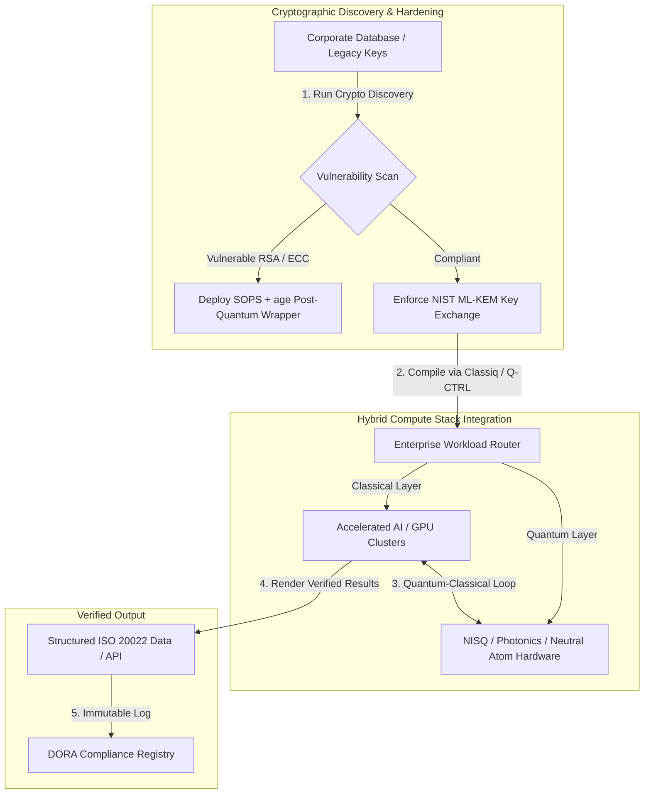

---

# Front Matter (YAML)

author: "contact@sebastienrousseau.com (Sebastien Rousseau)"
banner_alt: "מבט מעל הבמה בפסגת Economist Impact Commercialising Quantum Global 2026 החמישית בלונדון — מסמל את המעבר של הטכנולוגיה הקוונטית ממחקר פיזיקה לזרימות עבודה ארגוניות מוכנות לשימוש"
banner_height: "1597"
banner_width: "2584"
banner: "https://cloudcdn.pro/stocks/images/sebastien-rousseau-20260617-5th-commercialising-quantum-2.webp"
cdn: "https://cloudcdn.pro"
charset: "UTF-8"
cname: "sebastienrousseau.com"
copyright: "© Copyright 2025 - 2026 - Sebastien Rousseau. All rights reserved."
date: "June 17, 2026"
description: "תובנות חדר ישיבות מפסגת Economist Impact Commercialising Quantum Global 2026 החמישית — גל מימון של 1.3 מיליארד דולר, ערימות היברידיות 'ללא חרטה', דחיפות הגירה לקריפטוגרפיה פוסט-קוונטית, מסחור חישת קוונטים, וההנחיה של HSBC כי המתנה היא טעות מיותרת."
format-detection: "telephone=no"
hreflang: "he"
icon: "https://cloudcdn.pro/clients/sebastienrousseau/v1/logos/sebastienrousseau.svg"
id: "https://sebastienrousseau.com/2026-06-17-economist-commercialising-quantum-summit-2026"
image_alt: "Black and White Portrait of Sebastien Rousseau"
image_height: "162"
image_width: "162"
image: "https://cloudcdn.pro/stocks/images/sebastien-rousseau.png"
keywords: "Commercialising Quantum Global 2026, פסגת Economist Impact, קריפטוגרפיה פוסט-קוונטית, NIST ML-KEM, harvest-now decrypt-later, SNDL, HSBC קוונטי, Philip Intallura, חישת קוונטים, ניווט בלתי תלוי ב-GPS, NQCC, EU Quantum Act, Quantcore, פרס qBIG, Lord Vallance, היברידי קוונטי-קלאסי, DORA סעיף 6"
language: "he-IL"
last_reviewed: "2026-06-17"
layout: "report"
locale: "he_IL"
logo_alt: "Logo for Sebastien Rousseau"
logo_height: "44"
logo_width: "44"
logo: "https://cloudcdn.pro/clients/sebastienrousseau/v1/logos/sebastienrousseau.svg"
menu: ""
measurementID: "G-169G4ET5HQ"
name: "Sebastien Rousseau"
permalink: "https://sebastienrousseau.com/2026-06-17-economist-commercialising-quantum-summit-2026"
rating: "general"
referrer: "no-referrer"
robots: "index, follow"
schema: "FAQPage, Article"
seo_title: "Commercialising Quantum 2026: תובנות חדר ישיבות"
short_name: "sebastienrousseau"
subtitle: "הטכנולוגיה הקוונטית חצתה ממדע מעבדה ספקולטיבי לזרימות עבודה ארגוניות היברידיות; חדר הישיבות חייב להגיב למימון של 1.3 מיליארד דולר ב-2026, הגירה מיידית לפוסט-קוונטי וההנחיה של HSBC להפסיק להמתין."
tags: "קוונטי, קריפטוגרפיה פוסט-קוונטית, NIST ML-KEM, harvest-now decrypt-later, חישת קוונטים, HSBC, Economist Impact, מחשוב היברידי, DORA, EU Quantum Act, NQCC, תובנות פסגה"
theme-color: "0, 83, 191"
title: "מקיוביטים לרווחים: תובנות אסטרטגיות מפסגת Commercialising Quantum Global 2026 החמישית של ה-Economist"
url: "https://sebastienrousseau.com/2026-06-17-economist-commercialising-quantum-summit-2026"
viewport: "width=device-width, initial-scale=1, shrink-to-fit=no"

# RSS - The RSS feed front matter (YAML).
atom_link: "https://sebastienrousseau.com/2026-06-17-economist-commercialising-quantum-summit-2026/rss.xml"
category: "Technology"
docs: https://validator.w3.org/feed/docs/rss2.html
generator: "Static Site Generator (SSG) (version 0.0.26)"
item_description: "תובנות חדר ישיבות מפסגת Economist Impact Commercialising Quantum Global 2026 החמישית — גל מימון של 1.3 מיליארד דולר, ערימות היברידיות 'ללא חרטה', דחיפות הגירה לקריפטוגרפיה פוסט-קוונטית, מסחור חישת קוונטים, וההנחיה של HSBC כי המתנה היא טעות מיותרת."
item_guid: "https://sebastienrousseau.com/2026-06-17-economist-commercialising-quantum-summit-2026/rss.xml"
item_link: "https://sebastienrousseau.com/2026-06-17-economist-commercialising-quantum-summit-2026/rss.xml"
item_pub_date: "Wed, 17 Jun 2026 06:06:06 +0000"
item_title: "מקיוביטים לרווחים: תובנות אסטרטגיות מפסגת Commercialising Quantum Global 2026 החמישית של ה-Economist"
last_build_date: "Wed, 17 Jun 2026 06:06:06 +0000"
managing_editor: "contact@sebastienrousseau.com (Sebastien Rousseau)"
pub_date: "Wed, 17 Jun 2026 06:06:06 +0000"
ttl: "60"
type: "article"
webmaster: "contact@sebastienrousseau.com"

# Apple - The Apple front matter (YAML).
apple_mobile_web_app_orientations: "portrait"
apple_touch_icon_sizes: "192x192"
apple-mobile-web-app-capable: "yes"
apple-mobile-web-app-status-bar-inset: "black"
apple-mobile-web-app-status-bar-style: "black-translucent"
apple-mobile-web-app-title: "Commercialising Quantum 2026: תובנות חדר ישיבות"
apple-touch-fullscreen: "yes"

# MS Application - The MS Application front matter (YAML).

msapplication-navbutton-color: "0, 83, 191"

# Twitter Card - The Twitter Card front matter (YAML).

twitter_card: "summary_large_image"
twitter_creator: "@wwdseb"
twitter_description: "תובנות חדר ישיבות מפסגת Economist Impact Commercialising Quantum Global 2026 החמישית — גל מימון של 1.3 מיליארד דולר, ערימות היברידיות 'ללא חרטה', דחיפות הגירה לקריפטוגרפיה פוסט-קוונטית, מסחור חישת קוונטים, וההנחיה של HSBC כי המתנה היא טעות מיותרת."
twitter_image: "https://cloudcdn.pro/clients/sebastienrousseau/v1/logos/sebastienrousseau.svg"
twitter_image_alt: "Logo of Sebastien Rousseau"
twitter_site: "@wwdseb"
twitter_title: "Commercialising Quantum 2026: תובנות חדר ישיבות"
twitter_url: "https://sebastienrousseau.com/2026-06-17-economist-commercialising-quantum-summit-2026"

excerpt: "פסגת Economist Impact Commercialising Quantum Global 2026 החמישית אישרה את הציר של הקוונטים לזרימות עבודה ארגוניות: 1.3 מיליארד דולר גויסו בחמישה חודשים, קריפטוגרפיה פוסט-קוונטית היא סוגיה נאמנותית ברמת הדירקטוריון תחת קציר SNDL, חישת קוונטים נשלחת כיום לניווט בלתי תלוי ב-GPS, ו-Philip Intallura מ-HSBC מסר את ההנחיה כי המתנה לחומרה עמידה בפני תקלות היא טעות מיותרת."

# Humans.txt - The Humans.txt front matter (YAML).
author_website: "https://sebastienrousseau.com"
author_twitter: "@wwdseb"
author_location: "London, UK"
thanks: "תודה שקראתם!"
site_last_updated: "2026-06-17"
site_standards: "HTML5, CSS3, RSS, Atom, JSON, XML, YAML, Markdown, TOML"
site_components: "Kaishi, Kaishi Builder, Kaishi CLI, Kaishi Templates, Kaishi Themes"
site_software: "Static Site Generator, Rust"

---

# מקיוביטים לרווחים: תובנות אסטרטגיות מפסגת Commercialising Quantum Global 2026 החמישית של ה-Economist

מוכנות ארגונית, הגירות לקריפטוגרפיה פוסט-קוונטית, ערימות מחשוב היברידיות והנוף המסחרי המתהווה של חישה ורישות קוונטיים.

**תקציר.** כנס Commercialising Quantum Global 2026 החמישי, שנערך על ידי Economist Impact ב-16–17 ביוני 2026 ב-Business Design Centre בלונדון, כינס למעלה מ-1,100 מנהיגים גלובליים מתחומי הארגון, הפיננסים, המדיניות והמחקר. הנושא המרכזי סימן ציר מבני ברור: הטכנולוגיה הקוונטית עברה ממדע מעבדה ספקולטיבי לזרימות עבודה ארגוניות מעשיות והיברידיות. בגיבוי 1.3 מיליארד דולר בהון סיכון שגויסו בחמישת החודשים הראשונים של 2026 בלבד, הדיון בחדר הישיבות אינו מתמקד עוד בספירת קיוביטים פיזיים, אלא בביסוס ערימות מחשוב היברידיות "ללא חרטה", הגנה על נכסים דיגיטליים מפני איום הקריפטוגרפיה של "harvest-now, decrypt-later" (SNDL), ופריסת מערכות חישת קוונטים לטווח הקצר לניווט בלתי תלוי ב-GPS.

## תובנות מפתח

- **המעבר הארגוני לזרימות עבודה מעשיות.** מנהיגי תעשייה ([Steve Suarez](https://www.linkedin.com/in/stevesuarez) מ-HorizonX, [Phil Intallura](https://www.linkedin.com/in/intallura) מ-HSBC) הדגישו שאינטגרציית הקוונטים אינה עוד בעיית פיזיקה אלא בעיה תפעולית. בנקים וארגונים פורסים פיילוטים היברידיים קוונטיים-קלאסיים כדי להכשיר כישרון ולמטב עומסי עבודה פעילים.
- **קריפטוגרפיה פוסט-קוונטית (PQC) היא עדיפות דירקטוריון.** מומחי אבטחה ומשפט (CMS UK, [Joanne Miller](https://www.linkedin.com/in/joanne-miller-nso) מ-Microsoft, [Craig Farrell](https://www.linkedin.com/in/craig-farrell) מ-EY) הזהירו כי ארגונים אינם יכולים להמתין לחומרה עמידה בפני תקלות כדי לפרוס PQC. קציר "harvest-now, decrypt-later" מתרחש היום, מה שהופך את ההגירה לתקני NIST ML-KEM לדאגה נאמנותית מיידית.
- **חישת קוונטים מובילה את הרווחיות לטווח הקצר.** בעוד שמחשוב עמיד בפני תקלות נותר במרחק שנים, חישת הקוונטים ([Matthew Kinsella](https://www.linkedin.com/in/matthewkinsella) מ-Infleqtion) מתרחבת במהירות. שעוני קוונטים וחיישנים אינרציאליים נפרסים בניווט בלתי תלוי ב-GPS, ביטחון לאומי ורשתות אנרגיה יציבות במיוחד.
- **ריבונות, מקבצים ודחיפות מדיניות.** שר המדע הבריטי [Lord Vallance](https://www.linkedin.com/in/patrick-vallance) ו-[Lord William Hague](https://www.linkedin.com/in/williamhague) שרטטו משימות לאומיות להמרת מחקר ל"מקבצי-על" בקנה מידה תעשייתי בתיאום עם ה-National Quantum Computing Centre (NQCC). ה-EU Quantum Act הקרוב מדגיש עוד את הדחיפות הגיאופוליטית לקיבולת מחשוב ריבונית.
- **Quantcore זוכה בפרס qBIG.** ספין-אאוט של University of Glasgow, Quantcore, זכה בפרס IOP qBIG על רכיביו המוליכים-על מבוססי ניוביום, הפועלים בטמפרטורות גבוהות יותר מחומרים מסורתיים, ומפחיתים משמעותית את העלות של תשתית קריוגנית.

**קריאה קשורה:** [KyberLib וההגירה הבנקאית הפוסט-קוונטית ב-2026: מתקנים לקוד](https://sebastienrousseau.com/2026-06-12-kyberlib-post-quantum-banking-migration-standards-code-2026/), [מדד החוסן הבנקאי ב-2026: AI, ענן, קוונטי, תשלומים וסיכון ריכוז צד שלישי](https://sebastienrousseau.com/2026-06-08-banking-resilience-index-ai-cloud-quantum-payments-third-party-risk-2026/), [מדד הבנקאות Cloud Native ב-2026: DORA, הנדסת פלטפורמה, ענן ריבוני וחוסן תפעולי](https://sebastienrousseau.com/2026-06-05-cloud-native-banking-index-dora-resilience-platform-engineering-2026/).

## 01. מדוע פסגת 2026 חשובה לחדר הישיבות

מהדורת 2026 של פסגת Commercialising Quantum Global של ה-Economist סימנה שינוי קבוע באופן שבו עולם התאגידים מעריך טכנולוגיה עמוקה.

היסטורית, מחשוב קוונטי הוסט למחלקות מו"פ כמיזם מדעי רב-עשורי. ביוני 2026, פרספקטיבה זו מיושנת. ארגונים חייבים לעבור מסקרנות "ממוקדת פיזיקה" ליישום "ממוקד עסקים". הסיבה כפולה:

1. **התכנסות הקוונטים-AI.** ערימות מחשוב בעלות ביצועים גבוהים (HPC) מתמזגות עם AI מואץ קלאסי וצמתי NISQ (Noisy Intermediate-Scale Quantum) לשכבת מחשוב מאוחדת אחת. ארגונים שיעכבו בניית יישומים מוכנים לקוונטים יגלו כי החלון לתפיסת יתרון אסטרטגי נסגר מהר מהצפוי.
2. **דחיפות גיאופוליטית ונאמנותית.** עם תוכנית הקוונטים הבריטית מונחית-משימה וה-EU Quantum Act הקרוב, קיבולת קוונטית הפכה לעניין של ריבונות לאומית והמשכיות תאגידית.

יתרה מכך, אבטחת סייבר פוסט-קוונטית אינה עוד דרישת ציות עתידית. האיום של מתקפות "store now, decrypt later" (SNDL) עוינות פירושו שנתונים תאגידיים שיורטו היום יפוענחו כאשר מערכות קוונטיות מסחריות יתרחבו, ויוצרים אחריות מיידית תחת מנדטים גלובליים של חוסן תפעולי כמו Digital Operational Resilience Act (DORA).

## 02. עדשת האסטרטגיה של Commercialising Quantum 2026

מנהיגי טכנולוגיה ארגונית חייבים למפות את בגרות הקוונטים על פני חמש שכבות תפעוליות נפרדות, ולהעריך אופקי לוח זמנים וסיכוני מאזן.

### טבלה 1: עדשת האסטרטגיה של Commercialising Quantum 2026

| שכבה | מיקוד תאגידי | לוח זמנים / אופק | סיכון תאגידי מרכזי |
| :---- | :---- | :---- | :---- |
| **חומרה ומהדר** | בחירה בין גישות מתחרות (מוליכים-על, יונים לכודים, אטומים ניטרליים, פוטוניקה) | 3–5 שנים (עמידות בפני תקלות) | נעילה לארכיטקטורה ללא מוצא או הימור על פלטפורמה יחידה מוקדם מדי. |
| **חיזוק קריפטוגרפי** | גילוי ומלאי של תלויות קריפטוגרפיות; הגירה ל-NIST ML-KEM | מיידי (הגירה פעילה) | פריצות נתונים מערכתיות וכשלי ציות תחת DORA ו-NIST CSF 2.0. |
| **חישת קוונטים** | פריסת ניווט בלתי תלוי ב-GPS, שעונים יציבים במיוחד וגרבימטרים | 1–2 שנים (מסחרי מיידי) | שיבוש תפעולי של לוגיסטיקה, ספנות ורשתות אנרגיה עקב חסימת GPS. |
| **אינטגרציית מערכת** | חיבור חומרה קוונטית למרכזי נתונים קלאסיים קיימים של HPC וסופר-מחשוב | 1–3 שנים (שלב היברידי) | השהיה גבוהה, צווארי בקבוק בהעברת נתונים וסילוסי מחשוב מקוטעים. |
| **תוכנה ארגונית** | חשיפת אלגוריתמים קוונטיים דרך שכבות הפשטה ו-APIs ברמה גבוהה (Classiq, Q-CTRL) | מיידי (בניית כישורים) | בידוד כישרון וזרימת עבודה מביצוע הנדסי בפועל. |

## 03. אותות קוונטיים מרכזיים וטריגרים לחדר הישיבות

מנהיגי טכנולוגיה חייבים לפקח על מדדי שוק ורגולציה ספציפיים וניתנים לכימות כדי להנחות את השקעותיהם הקוונטיות.

### טבלה 2: אותות קוונטיים מרכזיים וטריגרים לחדר הישיבות

| אות | מדד כמותי | הפניה רגולטורית / מדיניות | עדיפות פלטפורמה ניתנת לפעולה |
| :---- | :---- | :---- | :---- |
| **גל מימון קוונטי** | 1.3 מיליארד דולר גויסו גלובלית בחמישת החודשים הראשונים של 2026 | תשואה על חוסן (RoR) | העברת תקציבים מפיילוטים ספקולטיביים לעומסי עבודה היברידיים קוונטיים-קלאסיים "ללא חרטה". |
| **חשיפת פענוח נתונים** | 100% מהנתונים המוצפנים המועברים בערוצים ציבוריים חשופים לקציר SNDL | DORA סעיף 6 (אבטחת ICT) | יישום כלי גילוי קריפטוגרפיים לזיהוי מפתחות RSA/ECC פגיעים על פני האחוזה. |
| **תשתית ריבונית** | הקצאה של 2.5 מיליארד ליש"ט ל-UK National Quantum Strategy | UK Quantum Missions / Lord Vallance | ביסוס שותפויות מקומיות עם מקבצי-על לאומיים כמו NQCC. |
| **מועדי ציות** | מעבר לכתובת מובנית של SWIFT ב-14 בנובמבר 2026 | הנחיית SWIFT SR 2026 | ניקוי ועיצוב של מסדי נתונים בין-בנקאיים לעמידה במפרטי XML מובנים. |

## 04. צלילה לעומק לתימות הליבה של הפסגה

### הקוונטים מגיעים לנקודת מפנה השקעתית

מימון הון סיכון חווה האצה משמעותית, וגייס **1.3 מיליארד דולר** בחמישת החודשים הראשונים של 2026 בלבד. בניגוד למחזורי ההייפ הספקולטיביים של שנים קודמות, גל ההון הנוכחי מגובה בעומסי עבודה אמיתיים לטווח הקצר. דוברים מ-Classiq ו-IBM Quantum Platform הדגימו כיצד שכבות הפשטה תוכנתיות ומהדרים אוטומטיים מאפשרים לצוותי מפתחים שאינם מומחים להריץ אלגוריתמים היברידיים קוונטיים-קלאסיים על תשתית קלאסית של היום. אסטרטגיית "ללא חרטה" זו מאפשרת לארגונים לבנות כישרון וזרימות עבודה מוכנים לקוונטים באופן מיידי.

### אזהרות משפטיות ורגולטוריות על "harvest now, decrypt later"

שותפים משפטיים ומנהלי אבטחת סייבר עוררו עיסוק משמעותי סביב המיידיות של סיכון הנתונים. נציגים ממשרד עורכי הדין הנותן חסות CMS UK ו-CSO של Microsoft, [Joanne Miller](https://www.linkedin.com/in/joanne-miller-nso), מסרו אזהרה חדה להנהלה הבכירה: *המתנה להגעת חומרה עמידה בפני תקלות לפני פריסת קריפטוגרפיה פוסט-קוונטית היא כשל נאמנותי קריטי.*

תחת פרדיגמת "store now, decrypt later" (SNDL), גורמים עוינים קוצרים באופן פעיל נתונים תאגידיים מוצפנים היום בכוונה לפענח אותם ברגע שיופיעו מחשבים קוונטיים רלוונטיים קריפטוגרפית. ארגונים חייבים לפרוס הגנות פוסט-קוונטיות (כגון NIST ML-KEM) באופן מיידי כדי להגן על מערכי נתונים רגישים ארוכי-חיים, קניין רוחני ורשומות לקוחות היסטוריות.

### יישור מחדש של הייפ "חישת הקוונטים"

בעוד שמחשוב קוונטי עמיד בפני תקלות נותר במרחק שנים, הפסגה הדגישה את חישת הקוונטים כגל הראשון הרווחי באמת של פריסה בעולם האמיתי. המנכ"ל [Matthew Kinsella](https://www.linkedin.com/in/matthewkinsella) של Infleqtion פירט כיצד שעוני קוונטים, חיישנים אינרציאליים ומערכות תדר רדיו מתרחבים במהירות על פני תעשיות מרובות.

מכיוון שטכנולוגיות אלה מודדות קבועים פיזיקליים בדיוק תת-אטומי, הן מאפשרות **ניווט בלתי תלוי ב-GPS**, רשתות אנרגיה יציבות במיוחד ותקשורת חלל עמוק. יישומים אלה רלוונטיים מאוד לתעופה, תחבורה ימית ומערכות הגנה לאומיות הניצבות בפני איומי חסימת GPS גוברים.

### שיתוף פעולה אקוסיסטם ומקבצים

המערכת הקוונטית הבריטית השתמשה בפסגת לונדון להצגת מקבצי-על חדשנות מקומיים. עדכונים חיים מה-National Quantum Computing Centre (NQCC) ומ-Digital Catapult פירטו כיצד ספין-אאוטים בשלב מוקדם של טכנולוגיה עמוקה יכולים לגשר על "הפער הטכנולוגי" על ידי שילוב חומרה קוונטית ישירות במרכזי נתונים קלאסיים של סופר-מחשוב.

[Wridhdhisom Karar](https://www.linkedin.com/in/wridhdhisomkarar), שותף מייסד של חברת הסטארט-אפ הסקוטית Quantcore, קיבל את פרס Institute of Physics (IOP) Quantum Business Innovation and Growth (qBIG) היוקרתי על רכיבי המוליכים-על מבוססי הניוביום של החברה. רכיבים אלה פועלים בטמפרטורות גבוהות יותר מחומרים מסורתיים, ומפחיתים משמעותית את העלות של תשתית קריוגנית הנדרשת להרחבת מעבדים קוונטיים.

### חקר המקרה של HSBC: מדוע המתנה לקוונטים היא "טעות מיותרת"

תובנות מ-[**Philip Intallura, Ph.D.**](https://www.linkedin.com/in/intallura) (ראש גלובלי לטכנולוגיות קוונטיות ב-HSBC, יועץ ממשלת בריטניה ויועץ דירקטוריון) באירוע Commercialising Quantum החמישי של ה-Economist (2026) מסרו הנחיית חדר ישיבות עוצמתית: *"המתנה לקוונטים עמיד בפני תקלות לפני שמתחילים היא טעות מיותרת."*

ד"ר Intallura טען כי גישת "המתן וראה" הנפוצה בקרב מוסדות פיננסיים היא שער עצמי הבנוי על שלוש הנחות שגויות:

- **תשואה על השקעה לטווח הקצר אמיתית.** בבדיקות אמפיריות, HSBC השיגה ביצועים טובים יותר ממודלים הפועלים כיום בייצור, חיברה עבודה קוונטית לחלקים אחרים של העסק, השתמשה בקוונטים להעמקת קשרים עם חלק מלקוחותיה הגדולים ביותר, ומשכה עסקים חדשים משמעותיים אל **HSBC Innovation Banking**.
- **הקוונטים הוא עקומת אימוץ תלולה.** בניית יכולת, קביעת אסטרטגיה, גיוס מימון והרצת מחזורי ניסויים בתוך ארגון מפוקח מאוד אינה משימה קצרה. תהליכים חייבים להיבחן ולהותאם באופן שיטתי לטכנולוגיה.
- **הקוונטים הוא אקוסיסטם.** אף שחקן יחיד לא מגיע לשם לבדו. כל מאמר מחקר, POC ופיילוט ש-HSBC ביצעה היו בשיתוף פעולה הדוק עם ספק קוונטי — ובמקרים מסוימים שיתוף הפעולה משתרע על האקדמיה, הרגולטורים והממשלה.

**הנחיית סיכום לחדר הישיבות:** *"היכולת שתזדקקו לה ביום הראשון של עמידות בפני תקלות היא היכולת שתבנו עכשיו."*

## 05. צינור אינטגרציה וקריפטוגרפיה קוונטית תאגידי

כדי להגן על נכסים דיגיטליים תוך בניית מוכנות קוונטית, הארגון חייב לבסס צינור אינטגרציה ברור.

## 06. ספר ההפעלה של חדר הישיבות: ציוויים ניתנים לפעולה

כדי לתרגם את תובנות פסגת Commercialising Quantum Global 2026 לערך עסקי מיידי, על ההנהלה הבכירה לבצע את ספר ההפעלה הבא של חדר הישיבות בן ארבעת השלבים:

1. **חיוב גילוי קריפטוגרפי.** הנחיית מנהל אבטחת המידע הראשי (CISO) לקטלג את כל הנכסים הקריפטוגרפיים, ולמפות כל מפתח RSA ו-ECC מדור קודם בארגון להכנה להגירה פוסט-קוונטית.
2. **פריסת אסטרטגיה היברידית "ללא חרטה".** הימנעות מהמתנה לחומרה מושלמת. השקעה בתוכנה בהשראת קוונטים ובפיילוטים היברידיים קלאסיים-קוונטיים לפיתוח כישרון פנימי ולמיטוב לוגיסטיקה מורכבת או תיקי סיכון היום.
3. **הערכת חישת קוונטים ללוגיסטיקה.** אם הארגון שלכם תלוי בשרשראות אספקה גלובליות, ספנות או תשתית קריטית, הערכה פעילה של מערכות חישת קוונטים (כגון ניווט בלתי תלוי ב-GPS) להפחתת סיכוני שיבוש גיאופוליטיים.
4. **הרשמה ל-Insight Hour של 30 ביוני.** הבטחה שמנהיגי הטכנולוגיה שלכם נרשמים ל-**Commercialising Quantum Global Insight Hour** הווירטואלי ב-30 ביוני 2026, בשעה 15:00 BST (בתמיכת IonQ) כדי להמשיך לעקוב אחר אסטרטגיות ניהול סיכון ארגוני והקצאת כישרון.

## 07. שאלות נפוצות

**מהו "harvest now, decrypt later" (SNDL) ומדוע זה חשוב היום?**
SNDL הוא הנוהג של יירוט ואחסון נתונים מוצפנים היום, בכוונה לפענח אותם מאוחר יותר ברגע שמחשבים קוונטיים רלוונטיים קריפטוגרפית יהיו זמינים. מערכי נתונים רגישים ארוכי-חיים — קניין רוחני, רשומות לקוחות, תקשורת ממשלתית — הם כבר מטרות. הגירה ל-NIST ML-KEM היא החלטה נאמנותית שהדירקטוריון אינו יכול לדחות.

**מדוע חישת קוונטים היא הגל המסחרי הראשון במקום מחשוב?**
חיישנים קוונטיים מודדים קבועים פיזיקליים בדיוק תת-אטומי ואינם דורשים את החומרה העמידה בפני תקלות הנדרשת למחשוב קוונטי. שעוני קוונטים, גרבימטרים וחיישנים אינרציאליים כבר נמצאים בפריסת פיילוט לניווט בלתי תלוי ב-GPS, רשתות אנרגיה יציבות במיוחד ותקשורת חלל עמוק.

**האם העבודה הקוונטית של HSBC היא רק מו"פ או שהיא סיפקה תשואות ניתנות למדידה?**
לפי Philip Intallura בפסגה, HSBC השיגה ביצועים טובים יותר ממודלים הפועלים כיום בייצור, השתמשה בקוונטים להעמקת קשרים עם לקוחותיה הגדולים ביותר ומשכה עסקים חדשים משמעותיים אל HSBC Innovation Banking. העבודה עברה ממחקר לאינטגרציה תפעולית.

## 08. הפניות

- **Economist Impact, (2026).** *5th Annual Commercialising Quantum Global 2026.* פרוטוקול כנס חי, 16–17 ביוני 2026. לונדון: Business Design Centre. זמין בכתובת: [Economist Impact](https://events.economist.com/commercialising-quantum/).
- **National Institute of Standards and Technology (NIST), (2024).** *First Three Finalized Post-Quantum Encryption Standards (FIPS 203, 204, and 205).* Gaithersburg: U.S. Department of Commerce. זמין בכתובת: [NIST Standards](https://www.nist.gov/news-events/news/2024/08/nist-releases-first-3-finalized-post-quantum-encryption-standards).
- **European Parliament and Council of the European Union, (2022).** *Regulation (EU) 2022/2554 on digital operational resilience for the financial sector (DORA).* Brussels: Official Journal of the European Union. זמין בכתובת: [DORA Regulation](https://eur-lex.europa.eu/legal-content/EN/TXT/?uri=CELEX%3A32022R2554).
- **SWIFT, (2024).** *ISO 20022 November 2026 Structured Address Milestone.* La Hulpe: SWIFT. זמין בכתובת: [SWIFT ISO 20022 milestone](https://www.swift.com/standards/iso-20022/iso-20022-bytes/call-action-november-2026).
