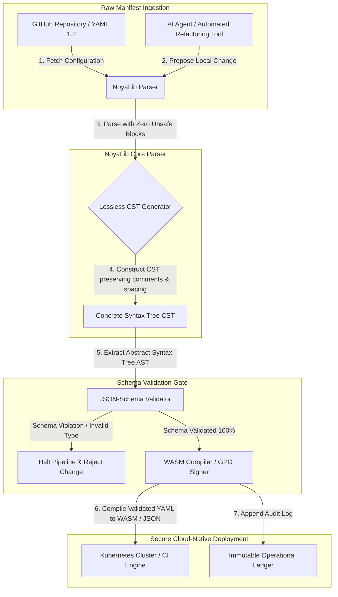

---

# Front Matter (YAML)

author: "contact@sebastienrousseau.com (Sebastien Rousseau)"
banner_alt: "גאומטריה אדריכלית תחת תאורה דרמטית — מסמלת את תפקידה של NoyaLib כמנתח YAML בטוח ב-Rust הנושא את עומס תצורות CI, Kubernetes, MCP ושירותים פיננסיים"
banner_height: "1597"
banner_width: "2584"
banner: "https://cloudcdn.pro/stocks/images/ken-cheung-KonWFWUaAuk.webp"
cdn: "https://cloudcdn.pro"
charset: "UTF-8"
cname: "sebastienrousseau.com"
copyright: "© Copyright 2025 - 2026 - Sebastien Rousseau. All rights reserved."
date: "June 18, 2026"
description: "NoyaLib, מנתח YAML 1.2 ב-Rust ללא unsafe עם תאימות 406/406 למפרט, אימות JSON Schema, CST ללא אובדן וכריכות MCP/WASM לתשתית פיננסית."
format-detection: "telephone=no"
hreflang: "he"
icon: "https://cloudcdn.pro/clients/sebastienrousseau/v1/logos/sebastienrousseau.svg"
id: "https://sebastienrousseau.com/2026-06-18-noyalib-safe-yaml-rust-ai-mcp-financial-infrastructure-2026"
image_alt: "Black and White Portrait of Sebastien Rousseau"
image_height: "162"
image_width: "162"
image: "https://cloudcdn.pro/stocks/images/sebastienrousseau.webp"
keywords: "מנתח YAML בטוח יותר ב-Rust, NoyaLib, תאימות מפרט YAML 1.2, Rust ללא unsafe, אימות JSON Schema, עץ תחביר קונקרטי ללא אובדן, CST, MCP, Model Context Protocol, WebAssembly, מניפסטים של Kubernetes, תצורת CI/CD, DORA סעיף 5, BCBS 239, סיכון תפעולי Basel III, תשתית פיננסית, אבטחת תצורה, שרשרת אספקת תוכנה"
language: "he-IL"
last_reviewed: "2026-06-18"
layout: "report"
locale: "he_IL"
logo_alt: "Logo for Sebastien Rousseau"
logo_height: "44"
logo_width: "44"
logo: "https://cloudcdn.pro/clients/sebastienrousseau/v1/logos/sebastienrousseau.svg"
menu: ""
measurementID: "G-169G4ET5HQ"
name: "Sebastien Rousseau"
permalink: "https://sebastienrousseau.com/2026-06-18-noyalib-safe-yaml-rust-ai-mcp-financial-infrastructure-2026"
rating: "general"
referrer: "no-referrer"
robots: "index, follow"
schema: "FAQPage, Article"
seo_title: "מנתח YAML בטוח יותר ב-Rust ל-AI, MCP ופיננסים"
short_name: "sebastienrousseau"
subtitle: "ערימת YAML בטוחה יותר ב-Rust — NoyaLib — הופכת את YAML 1.2 מסימון נוחות למישור בקרת תצורה תואם מפרט ומאובטח קריפטוגרפית עבור סוכני AI, MCP, Kubernetes ותשתית שירותים פיננסיים."
tags: "מנתח YAML בטוח יותר ב-Rust, NoyaLib, YAML 1.2, Rust ללא unsafe, JSON Schema, MCP, WebAssembly, Kubernetes, DORA, BCBS 239, Basel III, תשתית פיננסית, אבטחת שרשרת אספקה"
theme-color: "0, 83, 191"
title: "מדוע YAML זקוק לערימת Rust בטוחה יותר עבור AI, MCP ותשתית פיננסית ב-2026"
url: "https://sebastienrousseau.com/2026-06-18-noyalib-safe-yaml-rust-ai-mcp-financial-infrastructure-2026"
viewport: "width=device-width, initial-scale=1, shrink-to-fit=no"

# RSS - The RSS feed front matter (YAML).
atom_link: "https://sebastienrousseau.com/2026-06-18-noyalib-safe-yaml-rust-ai-mcp-financial-infrastructure-2026/rss.xml"
category: "Technology"
docs: https://validator.w3.org/feed/docs/rss2.html
generator: "Static Site Generator (SSG) (version 0.0.26)"
item_description: "NoyaLib, מנתח YAML 1.2 ב-Rust ללא unsafe עם תאימות 406/406 למפרט, אימות JSON Schema, CST ללא אובדן וכריכות MCP/WASM לתשתית פיננסית."
item_guid: "https://sebastienrousseau.com/2026-06-18-noyalib-safe-yaml-rust-ai-mcp-financial-infrastructure-2026/rss.xml"
item_link: "https://sebastienrousseau.com/2026-06-18-noyalib-safe-yaml-rust-ai-mcp-financial-infrastructure-2026/rss.xml"
item_pub_date: "Thu, 18 Jun 2026 06:06:06 +0000"
item_title: "מדוע YAML זקוק לערימת Rust בטוחה יותר עבור AI, MCP ותשתית פיננסית ב-2026"
last_build_date: "Thu, 18 Jun 2026 06:06:06 +0000"
managing_editor: "contact@sebastienrousseau.com (Sebastien Rousseau)"
pub_date: "Thu, 18 Jun 2026 06:06:06 +0000"
ttl: "60"
type: "article"
webmaster: "contact@sebastienrousseau.com"

# Apple - The Apple front matter (YAML).
apple_mobile_web_app_orientations: "portrait"
apple_touch_icon_sizes: "192x192"
apple-mobile-web-app-capable: "yes"
apple-mobile-web-app-status-bar-inset: "black"
apple-mobile-web-app-status-bar-style: "black-translucent"
apple-mobile-web-app-title: "מנתח YAML בטוח יותר ב-Rust ל-AI, MCP ופיננסים"
apple-touch-fullscreen: "yes"

# MS Application - The MS Application front matter (YAML).

msapplication-navbutton-color: "0, 83, 191"

# Twitter Card - The Twitter Card front matter (YAML).

twitter_card: "summary_large_image"
twitter_creator: "@wwdseb"
twitter_description: "NoyaLib, מנתח YAML 1.2 ב-Rust ללא unsafe עם תאימות 406/406 למפרט, אימות JSON Schema, CST ללא אובדן וכריכות MCP/WASM לתשתית פיננסית."
twitter_image: "https://cloudcdn.pro/clients/sebastienrousseau/v1/logos/sebastienrousseau.svg"
twitter_image_alt: "Logo of Sebastien Rousseau"
twitter_site: "@wwdseb"
twitter_title: "מנתח YAML בטוח יותר ב-Rust ל-AI, MCP ופיננסים"
twitter_url: "https://sebastienrousseau.com/2026-06-18-noyalib-safe-yaml-rust-ai-mcp-financial-infrastructure-2026"

excerpt: "NoyaLib היא ערימת YAML בטוחה יותר ב-Rust — אפס בלוקי unsafe, תאימות 406/406 למפרט YAML 1.2, עץ תחביר קונקרטי (CST) ללא אובדן, אימות JSON Schema (Draft 2020-12) וכריכות MCP/WASM — מהונדסת עבור סוכני AI, Kubernetes, CI/CD ומישור בקרת התצורה שמאחורי התשתית הפיננסית."

# Humans.txt - The Humans.txt front matter (YAML).
author_website: "https://sebastienrousseau.com"
author_twitter: "@wwdseb"
author_location: "London, UK"
thanks: "תודה שקראתם!"
site_last_updated: "2026-06-18"
site_standards: "HTML5, CSS3, RSS, Atom, JSON, XML, YAML, Markdown, TOML"
site_components: "Kaishi, Kaishi Builder, Kaishi CLI, Kaishi Templates, Kaishi Themes"
site_software: "Static Site Generator, Rust"

---

# מדוע YAML זקוק לערימת Rust בטוחה יותר עבור AI, MCP ותשתית פיננסית ב-2026

ערימת YAML בטוחה יותר ב-Rust חשובה משום ש-YAML נושא כיום צינורות CI/CD, מניפסטים של Kubernetes, כללי [Open Policy Agent](https://www.openpolicyagent.org/) ורישומי כלים של Model Context Protocol (MCP) — וניתוח דו-משמעי יחיד עלול לשבור מערכת סליקה, להגדיר באופן שגוי קבוצת אבטחה, או להעניק לסוכן AI מקומי הרשאות שגויות. [NoyaLib](https://github.com/sebastienrousseau/noyalib) היא מערכת אקולוגית לניתוח ואימות [YAML 1.2](https://yaml.org/spec/1.2.2/) בטהור-Rust וללא unsafe, מהונדסת להפוך את התשתית הזו לבטוחה כברירת מחדל.

## תשובה מהירה

**מהי NoyaLib במשפט אחד?** NoyaLib היא מערכת אקולוגית קוד פתוח לניתוח ואימות YAML 1.2 בטהור-Rust עם אפס קוד `unsafe`, תאימות 100% למפרט על פני חבילת 406 הבדיקות הרשמית של YAML, עץ תחביר קונקרטי (CST) ללא אובדן ואימות [JSON Schema](https://json-schema.org/) בזמן אמת — מהונדסת להפוך את תצורת סוכני AI, MCP, Kubernetes ותשתית פיננסית לבטוחה כברירת מחדל.

## תקציר מנהלים

YAML נראה צנוע עד שניתוח דו-משמעי או הפרת סכמה שוברים מערכת סליקה ייצורית במיליארדי דולרים. ב-2026, YAML הוא הסטנדרט דה-פקטו לצינורות [CI/CD](https://docs.github.com/en/actions/learn-github-actions/workflow-syntax-for-github-actions), מניפסטים של [Kubernetes](https://kubernetes.io/docs/concepts/configuration/overview/), כללי [Open Policy Agent](https://www.openpolicyagent.org/) ורישומי כלים של Model Context Protocol (MCP). מנתחים מורשתיים אטומים — עם פגיעויות זיכרון וניתוח הרסני — הם סיכון אבטחה בלתי-מקובל. NoyaLib היא מערכת אקולוגית של YAML 1.2 בטהור-Rust וללא unsafe: תאימות 100% למפרט על פני כל 406 בדיקות החבילה הרשמית, עץ תחביר קונקרטי (CST) ללא אובדן המשמר הערות ורווחים, ואימות JSON Schema מובנה. התוצאה היא YAML שנוסח מחדש כמישור בקרת תצורה ניתן לביקורת, מאובטח ונגיש לסוכנים.

## תובנות מפתח

- **התצורה היא קוד ייצור.** קובץ YAML פגום יחיד יכול להגדיר באופן שגוי קבוצות אבטחה ענן-ילידי או הרשאות סוכן AI. NoyaLib מתייחסת ל-YAML כתשתית קריטית.
- **תכנון ללא unsafe.** בנויה כולה ב-Rust בטוח עם אפס בלוקי `unsafe`, NoyaLib מסלקת פגיעויות בטיחות-זיכרון — גלישות חוצץ, ביצוע קוד מרחוק — בשכבות הניתוח הליבתיות.
- **תאימות מוחלטת 406/406 למפרט.** מאמתת מתמטית מבני תצורה, ומסלקת פערי ניתוח וסחיפות מבניות בין סביבות staging לייצור.
- **עץ תחביר קונקרטי ללא אובדן.** בניגוד למנתחים מורשתיים שמשליכים הערות ופורמט, NoyaLib משמרת רווחים והערות, ומאפשרת ארגון-מחדש אוטומטי מאובטח של רענון-מלא על ידי סוכני AI.
- **ערך נאמנותי ברמת הדירקטוריון.** מקשרת שלמות תצורה עם [DORA סעיף 5](https://eur-lex.europa.eu/legal-content/EN/TXT/?uri=CELEX%3A32022R2554) ומדדי הון סיכון תפעולי של [Basel III](https://www.bis.org/bcbs/publ/d424.htm), ומגנה ישירות על ההנהלה הבכירה מאחריות אישית.

**קריאה קשורה:** [KyberLib וההגירה הבנקאית הפוסט-קוונטית ב-2026: מתקנים לקוד](https://sebastienrousseau.com/2026-06-12-kyberlib-post-quantum-banking-migration-standards-code-2026/), [מדד הבנקאות Cloud Native ב-2026: DORA, הנדסת פלטפורמה, ענן ריבוני וחוסן תפעולי](https://sebastienrousseau.com/2026-06-05-cloud-native-banking-index-dora-resilience-platform-engineering-2026/), [Dotfiles מודעי AI ב-2026: בניית עמדת עבודה למפתח מאובטחת וניתנת לשחזור עבור MCP, SLSA ומקבילות רב-מעטפת](https://sebastienrousseau.com/2026-06-16-ai-aware-dotfiles-secure-reproducible-workstation-2026/).

## 01. מדוע ערימת YAML בטוחה יותר ב-Rust חשובה ב-2026

ביוני 2026, תשתיות IT ארגוניות מבוזרות ברמה גבוהה ומכוטמטות יותר ויותר.

YAML הפך בשקט לשפת התצורה הנושאת את משקל כל ערימת הנדסת התוכנה. הוא נושא את זרימות העבודה של אינטגרציה רציפה (CI) המהדרות חפצי ייצור, את מניפסטי [Kubernetes](https://kubernetes.io/docs/concepts/overview/) המתזמרים אשכולות ענן-ילידיים גלובליים, ואת סכמות שרת [Model Context Protocol](https://modelcontextprotocol.io/) (MCP) המעניקות לסוכני AI מקומיים הרשאה לבצע פעולות מקומיות.

מנתחי YAML מורשתיים — [PyYAML](https://pyyaml.org/), [yaml-cpp](https://github.com/jbeder/yaml-cpp), [libyaml](https://github.com/yaml/libyaml) — נושאים שני סיכונים מבניים:

1. **פגיעויות הסקת-טיפוס ("בעיית נורווגיה").** מנתחים מורשתיים נוטים לעיתים קרובות להסיק מחרוזות לא מצוטטות (קוד המדינה `NO` לבוליאני `false`, `yes`/`no` באותו אופן) — ראו את [תג הבוליאני של YAML 1.1 לעומת 1.2](https://yaml.org/type/bool.html) — וגורמים לכשלי מערכת קריטיים או לתצורות אבטחה שגויות שקטות.
2. **ניצול בטיחות-זיכרון.** מנתחים אטומים שנכתבו ב-C/C++ סובלים מניצולי דליפת זיכרון וגלישת חוצץ, שיכולים להוביל לביצוע קוד מרחוק (RCE) על שרתי בנייה ליבתיים.

[NoyaLib](https://github.com/sebastienrousseau/noyalib) פותרת אתגרים אלה. היא מערכת אקולוגית לניתוח ואימות YAML 1.2 בטהור-Rust וללא unsafe. על ידי השגת תאימות מוחלטת 406/406 למפרט ואכיפת אימות JSON Schema קפדני ישירות בזמן ניתוח, NoyaLib מספקת **תשואה על חוסן (RoR)** גבוהה — מונעת השבתות מושרות-תצורה ומאבטחת שרשראות אספקת תוכנה ברמה פיננסית.

## 02. עדשת ארכיטקטורת NoyaLib 2026

המערכת האקולוגית של NoyaLib פועלת כמנתח תצורה מאובטח וללא אובדן. כל מניפסט מקומי וענני מאומת מבנית ומוגן בשכבת הביצוע הנמוכה ביותר.

### טבלה 1: שכבות ארכיטקטורת NoyaLib והפחתת סיכונים

| שכבה | החלטת תכנון | מדוע זה חשוב | סיכון אם מטופל באופן שגוי |
| ---- | ---- | ---- | ---- |
| **שכבת מנתח** | מנתח YAML 1.2 תואם, בטהור-Rust עם אפס בלוקי `unsafe` | מסלק פגיעויות בטיחות-זיכרון וגלישות חוצץ בשכבת הביצוע הנמוכה ביותר. | ביצוע קוד מרחוק (RCE) על שרתי בנייה ליבתיים. |
| **שכבת קונפורמיות** | תאימות 100% על פני 406/406 בדיקות חבילת YAML 1.2 הרשמית | מסלק פערי ניתוח וסחיפות הסקת-טיפוס בין staging לייצור. | שגיאות הסקת-טיפוס מסוג "בעיית נורווגיה" המנטרלות קבוצות אבטחה. |
| **שכבת עץ-תחביר** | עץ תחביר קונקרטי (CST) ללא אובדן | משמר הערות, רווחים וסדר בעת ניתוח מלא ורענון-מחדש תכנותי. | ארגון-מחדש אוטומטי של AI ההורס הערות מפתח. |
| **שכבת אימות** | אימות [JSON Schema (Draft 2020-12)](https://json-schema.org/draft/2020-12/release-notes) בזמן ניתוח | אוכף מודלי נתונים קפדניים על קבצי תצורה לפני שהם מגיעים לאשכולות ייצור. | קבצי תצורה פגומים מפעילים קריסות אשכול ענן-ילידי. |
| **שכבת ממשק** | כריכות WebAssembly (WASM) ו-MCP | מאפשר לאימות תצורה לרוץ ישירות בתוך דפדפנים, צמתי קצה וערכות כלים של סוכנים מקומיים. | סילוסי כלים שבהם האימות אינו יכול לרוץ על מכשירי קצה. |

## 03. אותות מפתח לאבטחת עמדת עבודה ותצורה

כדי לשמר אבטחה מוחלטת על פני אחוזת הפיתוח והתפעול, מנהלי אבטחת המידע הראשיים (CISOs) חייבים לפקח על מדדים ספציפיים וניתנים לכימות.

### טבלה 2: אותות אבטחה לעמדת עבודה ותצורה

| אות | מדד / מדד תפעולי | הפניה NIST CSF / DORA | יישום פלטפורמה טכני |
| ---- | ---- | ---- | ---- |
| **קונפורמיות מנתח** | שיעור הצלחה 100% על פני חבילת בדיקות YAML 1.2 הרשמית (406/406 בדיקות). | [DORA סעיף 6](https://eur-lex.europa.eu/legal-content/EN/TXT/?uri=CELEX%3A32022R2554) (אבטחת ICT) | ליבת מנתח NoyaLib מאמתת את כל המניפסטים לפני ביצוע CI. |
| **פרופיל בטיחות-זיכרון** | אפס בלוקי Rust `unsafe` בתוך תלויות המנתח והסריאליזטור. | DORA סעיף 30 (שרשרת אספקה) | בדיקות מהדר אוטומטיות ([`forbid(unsafe_code)`](https://doc.rust-lang.org/reference/attributes/diagnostics.html#the-forbid-attribute)) בבניות cargo. |
| **אימות סכמה** | 100% מקבצי התצורה המנותחים מאומתים מול מודלי [JSON Schema](https://json-schema.org/) תקפים. | [NIST CSF 2.0](https://www.nist.gov/cyberframework) (PR.DS-01) | שער אימות בזמן אמת העוצר צינורות בנייה בעת הפרת סכמה. |
| **סחיפת תצורה** | זיהוי בזמן אמת ושחזור של קבצי תצורה מקומיים למצב המגרסה ב-git. | תשואה על חוסן (RoR) | טלמטריה רציפה המתעדת את כל שינויי הקבצים המקומיים. |
| **בקרת גישה לסוכנים** | הרשאות לקריאה-בלבד מתוחמות לכלי AI מקומיים הפועלים דרך תצורות MCP. | ניהול סיכון מודל ([SR 11-7](https://www.federalreserve.gov/supervisionreg/srletters/sr1107.htm)) | גבולות שרת MCP המגבילים פעולות סוכן לספריות מאושרות. |

## 04. הכשל של ניתוח תצורה אטום

פגיעות מרכזית בתפעול ענן-ילידי היא *ניתוח אטום* — שימוש במנתחים שמשליכים מטא-נתונים מבניים (הערות, רווחים, סדר מסמך) או מסיקים שקטים טיפוסים בזמן הידור. ההתנהגות מציגה שני סיכוני אבטחה חמורים:

1. **ארגון-מחדש הרסני.** כאשר עוזר קוד AI או כלי ארגון-מחדש אוטומטי מעדכן מניפסט פריסה, מנתחים מסורתיים משליכים הערות מפתח ופורמט, והורסים את ההקשר הנדרש לסקירות אנושיות ולחקירת פוסט-תקרית.
2. **פערי ניתוח.** אם סביבת staging משתמשת במנתח מבוסס-Python וייצור מריץ מנתח מבוסס-C, הבדלים קטנים בתאימות למפרט YAML 1.2 יכולים לגרום למניפסט תקף ב-staging להיכשל או להתנהג שונה בייצור, ויוצרים פגיעויות אבטחה נסתרות.

**עץ התחביר הקונקרטי (CST) ללא אובדן** של NoyaLib פותר זאת. הוא משמר כל רווח, הערה ושורת מסמך במהלך לולאת הניתוח-וסריאליזציה. עוזרי AI אוטומטיים יכולים לערוך, לארגן-מחדש ולהתחייב לקבצי תצורה תוך שימור 100% מההערות שנכתבו על ידי מפתח — מסלול ביקורת מוחלט.

## 05. תכנון צינור תצורה תחום של AI

כדי למנוע ששינויי תצורה זדוניים יגיעו לסביבות ייצור, הארגון חייב ליישם צינור תצורה תחום בקפדנות, מאומת-סכמה.

הזרימה התפעולית להלן מראה כיצד NoyaLib מנתחת YAML גולמי, בונה CST ללא אובדן, מאמתת את ה-AST מול מודל JSON Schema, ומהדרת כריכות WebAssembly לסביבות דפדפן או קצה.

## 06. ספר ההפעלה של חדר הישיבות והאחריות הנאמנותית

אבטחת תצורה ושלמות שרשרת אספקת תוכנה הן עדיפויות קריטיות לחדר הישיבות. מנהלים בכירים חייבים לגשת לניהול תצורה דרך עדשת חובה נאמנותית וחוסן תפעולי.

- **DORA סעיף 5 (אחריות דירקטוריון).** מכתיב שהדירקטוריון נושא באחריות הסופית, הבלתי-ניתנת לאצילה, לניהול סיכון ה-ICT של המוסד. מכיוון שקבצי תצורה שולטים בקבוצות אבטחה ענן-ילידיות קריטיות ובמסלולי ניתוב תשלומים, דירקטוריונים חייבים לוודא שהמערכות המנתחות את המניפסטים הללו בטוחות-זיכרון ותואמות מלאות למפרט כדי לעמוד בביקורות רגולטוריות. ([Regulation (EU) 2022/2554](https://eur-lex.europa.eu/legal-content/EN/TXT/?uri=CELEX%3A32022R2554))
- **BCBS 239 (אגרגציית נתוני סיכון ודיווח).** מחייב שדיווחי סיכון ומדדי תשתית יהיו מדויקים, שלמים ומופקים תחת בקרות איכות נתונים קפדניות. NoyaLib תומכת ב-BCBS 239 על ידי ניתוח ואימות קבצי תצורה מול סכמות קפדניות במקור, ומונעת דליפת נתונים שקטה או השבתות מושרות-תצורה שגויה. ([תקן BCBS 239](https://www.bis.org/publ/bcbs239.htm))
- **הפחתת חיובי הון סיכון תפעולי (Basel III).** השבתות מושרות-תצורה מנפחות ישירות את חיובי הון סיכון תפעולי תחת Basel III, וכובלות הון מאזן. תקנון ערימת התצורה הארגונית על מנתח בטוח ובטהור-Rust כמו NoyaLib ממזער סיכון זה, משמר הון ומגן על אמון הלקוחות. ([תקני Basel III](https://www.bis.org/bcbs/publ/d424.htm))

## 07. מה זה אומר לפי סוג בנק

### בנקים גלובליים בעלי חשיבות מערכתית (G-SIBs)

G-SIBs מנהלים אלפי microservices וצינורות פריסה על פני תחומי שיפוט מרובים. האתגר העיקרי שלהם הוא שימור עקביות תצורה ומניעת סחיפת אבטחה על פני אחוזות ענן-ילידיות עצומות. תקנון על ערימת YAML בטוחה יותר ב-Rust כמו NoyaLib מבטיח שכל מניפסטי Kubernetes, צינורות CI/CD ומדיניות אבטחה מנותחים ומאומתים תחת מסגרת אחידה ובטוחת-זיכרון — מסלק את הסיכון של תצורות "snowflake" שלא בוקרו.

### בנקי טרנזקציות ובנקים מסחריים

בנקי טרנזקציות מפעילים שערי תשלומים רגישים ותשתיות סליקה סיטונאיות. הוכחת אבטחה מוחלטת של הקוד והתצורה הנפרסים לסביבות הייצור הללו היא דרישה רגולטורית בלתי-מתפשרת. שילוב NoyaLib מבטיח ששרשרת אספקת התוכנה מבוקרת מלאה, ללא אובדן ומוגנת מפני פגיעויות ניתוח — בקרה הממופה בנקיות ל-DORA סעיף 6 וסעיף 6 של [PCI DSS v4.0](https://www.pcisecuritystandards.org/document_library/).

### בנקים אזוריים וקטנים יותר

בנקים אזוריים חייבים לשמור על תקני אבטחת סייבר גבוהים ללא תקציבי טכנולוגיה בסקאלת G-SIB. מסגרת הקוד הפתוח של NoyaLib מספקת פתרון קל, חסכוני ומאובטח מאוד התואם ל-Rust, ומאפשרת למוסדות קטנים יותר ליישם אבטחת תצורה ברמה ארגונית והגנת שרשרת אספקה ללא דמי רישוי קנייניים.

## 08. מסקנה: מפת הדרכים לאבטחת תצורה

עמדת העבודה של המפתח ותצורות התשתית ענן-ילידית הן מישורי בקרה קריטיים בשרשרת אספקת התוכנה. לאפשר לקבצי תצורה לא מבוקרים, דו-משמעיים או לא בטוחים להגיע לנכסים תאגידיים הוא סיכון תפעולי ורגולטורי בלתי-מקובל.

כדי לאבטח את שרשרת אספקת התוכנה ולהגן על נקודות קצה מפני פגיעויות תצורה, מנהלי טכנולוגיה ואבטחה בכירים צריכים לבצע מפת דרכים פיתוח ברורה היום:

1. **חיוב תצורה הצהרתית.** הוצאה מהדרגתית של התאמות תצורה ידניות ולא מבוקרות וחיוב שכל המניפסטים מנוהלים כמערכת רישומים הצהרתית בקרת-גרסה.
2. **אכיפת אימות סכמה.** אכיפת hooks קפדניים לפני קומיט ושירותי סריקה כדי להבטיח שכל קבצי התצורה מאומתים מול מודלי JSON Schema תקפים לפני פריסה.
3. **יישום רענון-מלא ללא אובדן.** הבטחה שכל עוזרי קוד ה-AI האוטומטיים וכלי הארגון-מחדש משתמשים בניתוח ללא אובדן לשימור הערות, רווחים והקשר מפתח.
4. **אבטחת שרשרת האספקה.** הבטחה שכל הגדרות התצורה וכלי הניתוח מאומתים קריפטוגרפית באמצעות ספריות בטהור-Rust וללא unsafe כמו NoyaLib לפני ביצוע. ([מסגרת SLSA](https://slsa.dev/))

## 09. שאלות נפוצות

**מהי NoyaLib ומדוע היא משמשת לניתוח YAML?**
NoyaLib היא מנתח YAML 1.2 בקוד פתוח, בטהור-Rust וללא unsafe. היא משיגה תאימות 100% למפרט על פני חבילת 406 הבדיקות הרשמית, אוכפת אימות [JSON Schema](https://json-schema.org/) קפדני בזמן ניתוח, וחושפת כריכות WASM ו-[MCP](https://modelcontextprotocol.io/) — מה שהופך אותה לערימת YAML בטוחה יותר ב-Rust עבור סוכני AI, Kubernetes ותשתית פיננסית.

**מדוע תכנון ללא unsafe חשוב לניתוח תצורה?**
פגיעויות בטיחות-זיכרון — גלישות חוצץ, use-after-free — בתוך מנתחים מורשתיים שנכתבו ב-C/C++ יכולות להוביל לביצוע קוד מרחוק על שרתי בנייה ליבתיים. תכנון טהור-Rust של NoyaLib עם [`#![forbid(unsafe_code)]`](https://doc.rust-lang.org/reference/attributes/diagnostics.html#the-forbid-attribute) מסלק מתמטית פגיעויות אלה בזמן הידור.

**מהו עץ תחביר קונקרטי (CST) ללא אובדן ומדוע זה חשוב?**
מנתחים מסורתיים משליכים הערות ופורמט, מה שהופך עריכות אוטומטיות של סוכני AI להרסניות. ה-CST ללא אובדן של NoyaLib משמר כל הערה, רווח ושורת מסמך — כך שעוזרי AI יכולים בבטחה לערוך ולארגן-מחדש קבצי תצורה תוך שמירה על הקשר המפתח, חקירת פוסט-תקרית ומסלול הביקורת שלמים.

**כיצד NoyaLib ממופה ל-DORA, BCBS 239 ו-Basel III?**
DORA סעיף 5 מטיל אחריות לסיכון ICT על הדירקטוריון; BCBS 239 דורש בקרות איכות נתונים על דיווח סיכון; Basel III ממסה את הון הסיכון התפעולי. NoyaLib מספקת את שכבת הניתוח המאומתת-סכמה ובטוחת-הזיכרון שתקנות אלה דורשות עבור תצורה כקוד — מה שהופך את המיפוי הרגולטורי לפשוט וחיוב הון הסיכון התפעולי לקטן יותר.

## 10. הפניות

- **YAML, (2026).** *מפרט YAML 1.2*. זמין בכתובת: [מפרט YAML 1.2](https://yaml.org/spec/1.2.2/).
- **JSON Schema, (2026).** *הערות הוצאה של JSON Schema Draft 2020-12*. זמין בכתובת: [JSON Schema Draft 2020-12](https://json-schema.org/draft/2020-12/release-notes).
- **European Parliament and Council of the European Union, (2022).** *Regulation (EU) 2022/2554 on digital operational resilience for the financial sector (DORA)*. Brussels: Official Journal of the European Union. זמין בכתובת: [תקנת DORA](https://eur-lex.europa.eu/legal-content/EN/TXT/?uri=CELEX%3A32022R2554).
- **Basel Committee on Banking Supervision, (2013).** *Principles for effective risk data aggregation and risk reporting (BCBS 239)*. Basel: Bank for International Settlements. זמין בכתובת: [תקן BCBS 239](https://www.bis.org/publ/bcbs239.htm).
- **Basel Committee on Banking Supervision, (2017).** *Basel III: finalising post-crisis reforms*. Basel: Bank for International Settlements. זמין בכתובת: [תקני Basel III](https://www.bis.org/bcbs/publ/d424.htm).
- **Anthropic, (2025).** *מפרט Model Context Protocol (MCP)*. זמין בכתובת: [Model Context Protocol](https://modelcontextprotocol.io/).
- **GitHub, (2026).** *מאגר קוד פתוח של noyalib*. זמין בכתובת: [מאגר NoyaLib](https://github.com/sebastienrousseau/noyalib).
